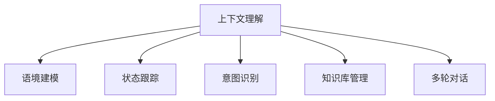

                 

# 上下文理解在CUI中的应用实例

## 1. 背景介绍

### 1.1 问题由来

在自然语言处理（Natural Language Processing, NLP）领域，上下文理解（Context Understanding）是一个核心任务。上下文理解能力是指在处理自然语言时，理解并利用上下文信息来提高处理效果的能力。例如，在问答系统中，理解问题的前置语句和上下文环境可以帮助系统更准确地回答用户问题。

近年来，上下文理解技术在许多应用场景中都得到了广泛应用，例如聊天机器人、智能客服、智能助手等，这些系统需要快速理解和处理用户的输入，并提供准确的回答。上下文理解在计算机用户界面（Computer User Interface, CUI）中的应用尤为突出，CUI系统通过上下文理解来增强用户体验，提高系统的智能化水平。

### 1.2 问题核心关键点

上下文理解在CUI中的实现可以分为以下几个关键点：
1. **语境建模**：将上下文信息转化为模型能够理解和利用的形式。
2. **状态跟踪**：在CUI交互过程中，保持对用户状态的理解，确保对话连贯性。
3. **意图识别**：根据用户输入的内容，识别用户的真实意图。
4. **知识库管理**：整合和管理知识库中的信息，支持基于知识库的问答。
5. **多轮对话**：处理多轮对话中的信息累积和传递，提高对话质量。

这些关键点需要结合先进的机器学习和自然语言处理技术，才能在CUI中实现上下文理解。

### 1.3 问题研究意义

上下文理解在CUI中的应用，对于提升用户交互体验、提高系统智能化水平具有重要意义。通过上下文理解，CUI系统可以更准确地理解用户需求，提供个性化的服务，增强用户的满意度和忠诚度。此外，上下文理解还可以帮助CUI系统在复杂和多变的环境中保持稳定性和可靠性，提高系统的可扩展性和适应性。

## 2. 核心概念与联系

### 2.1 核心概念概述

为更好地理解上下文理解在CUI中的应用，本节将介绍几个密切相关的核心概念：

- **上下文理解**：指在处理自然语言时，理解并利用上下文信息来提高处理效果的能力。
- **语境建模**：将上下文信息转化为模型能够理解和利用的形式，通常使用语言模型或记忆网络等模型。
- **状态跟踪**：在CUI交互过程中，保持对用户状态的理解，确保对话连贯性。
- **意图识别**：根据用户输入的内容，识别用户的真实意图，通常使用分类模型或序列到序列模型。
- **知识库管理**：整合和管理知识库中的信息，支持基于知识库的问答。
- **多轮对话**：处理多轮对话中的信息累积和传递，提高对话质量，通常使用记忆网络或注意力机制等模型。

这些核心概念之间的逻辑关系可以通过以下Mermaid流程图来展示：



这个流程图展示出上下文理解在CUI中的核心概念及其之间的关系：

1. 上下文理解通过语境建模、状态跟踪、意图识别、知识库管理、多轮对话等多个关键环节实现。
2. 语境建模将上下文信息转化为模型能够理解和利用的形式。
3. 状态跟踪保持对用户状态的理解，确保对话连贯性。
4. 意图识别根据用户输入的内容，识别用户的真实意图。
5. 知识库管理整合和管理知识库中的信息，支持基于知识库的问答。
6. 多轮对话处理多轮对话中的信息累积和传递，提高对话质量。

这些概念共同构成了上下文理解在CUI中的实现框架，使其能够更好地理解用户需求，提供个性化的服务。

## 3. 核心算法原理 & 具体操作步骤

### 3.1 算法原理概述

上下文理解在CUI中的应用，通常基于自然语言处理（NLP）技术，利用机器学习模型来理解上下文信息和用户意图。以下是一个典型的上下文理解流程：

1. **语境建模**：使用语言模型或记忆网络等模型，将上下文信息转化为向量表示。
2. **状态跟踪**：使用状态跟踪器来记录用户交互的历史信息，包括输入、输出、上下文等。
3. **意图识别**：使用分类模型或序列到序列模型，根据用户输入的内容，识别用户的真实意图。
4. **知识库管理**：将知识库中的信息整合并转化为向量表示，支持基于知识库的问答。
5. **多轮对话**：使用注意力机制或记忆网络等模型，处理多轮对话中的信息累积和传递。

### 3.2 算法步骤详解

以下是一个详细的上下文理解步骤：

**Step 1: 语境建模**

语境建模是将上下文信息转化为向量表示的过程。通常使用语言模型或记忆网络等模型来实现。以BERT模型为例，其语境建模过程如下：

1. 对输入文本进行分词。
2. 使用BERT模型对分词后的文本进行编码，得到文本的向量表示。

```python
from transformers import BertTokenizer, BertModel

tokenizer = BertTokenizer.from_pretrained('bert-base-uncased')
model = BertModel.from_pretrained('bert-base-uncased')

inputs = tokenizer.encode_plus('Hello, world!', return_tensors='pt')
outputs = model(inputs['input_ids'], attention_mask=inputs['attention_mask'])
```

**Step 2: 状态跟踪**

状态跟踪是记录用户交互的历史信息，包括输入、输出、上下文等。通常使用RNN或Transformer等模型来实现。以RNN为例，其状态跟踪过程如下：

1. 对每个时间步的输入进行编码。
2. 使用RNN对编码后的输入进行状态更新，得到隐藏状态。

```python
import torch
import torch.nn as nn
import torch.nn.functional as F

class RNN(nn.Module):
    def __init__(self, input_size, hidden_size, output_size):
        super(RNN, self).__init__()
        self.hidden_size = hidden_size
        self.rnn = nn.RNN(input_size, hidden_size, batch_first=True)
        self.fc = nn.Linear(hidden_size, output_size)
        
    def forward(self, x, h0):
        out, hn = self.rnn(x, h0)
        out = self.fc(out[:, -1, :])
        return out, hn

rnn = RNN(input_size=128, hidden_size=128, output_size=1)
h0 = torch.zeros(1, 1, 128)
x = torch.randn(1, 1, 128)
output, hn = rnn(x, h0)
```

**Step 3: 意图识别**

意图识别是根据用户输入的内容，识别用户的真实意图。通常使用分类模型或序列到序列模型来实现。以分类模型为例，其意图识别过程如下：

1. 对用户输入的文本进行编码。
2. 使用分类模型对编码后的文本进行分类，得到用户的意图。

```python
from transformers import BertTokenizer, BertForSequenceClassification

tokenizer = BertTokenizer.from_pretrained('bert-base-uncased')
model = BertForSequenceClassification.from_pretrained('bert-base-uncased', num_labels=2)

inputs = tokenizer.encode_plus('I want to book a flight to Tokyo', return_tensors='pt')
output = model(inputs['input_ids'], attention_mask=inputs['attention_mask'])
intent = output.logits.argmax(dim=1)
```

**Step 4: 知识库管理**

知识库管理是将知识库中的信息整合并转化为向量表示，支持基于知识库的问答。通常使用知识图谱或语义网络等模型来实现。以知识图谱为例，其知识库管理过程如下：

1. 将知识库中的实体和关系编码为向量表示。
2. 使用知识图谱模型对编码后的向量进行匹配，得到与用户意图相关的实体和关系。

```python
from pykg import KnowledgeGraph

kg = KnowledgeGraph()
kg.add_node('Tokyo', type='City')
kg.add_node('New York', type='City')
kg.add_edge('Tokyo', 'isLocationOf', 'New York')

query = 'What is the location of New York?'
result = kg.query(query)
```

**Step 5: 多轮对话**

多轮对话是处理多轮对话中的信息累积和传递，提高对话质量。通常使用注意力机制或记忆网络等模型来实现。以注意力机制为例，其多轮对话过程如下：

1. 对每个时间步的输入进行编码。
2. 使用注意力机制对编码后的输入进行加权，得到加权后的表示。
3. 使用RNN对加权后的表示进行状态更新，得到隐藏状态。

```python
import torch
import torch.nn as nn
import torch.nn.functional as F

class Attention(nn.Module):
    def __init__(self, input_size):
        super(Attention, self).__init__()
        self.Wq = nn.Linear(input_size, 1)
        self.Wk = nn.Linear(input_size, 1)
        self.Wv = nn.Linear(input_size, input_size)
        
    def forward(self, x):
        Wq = self.Wq(x)
        Wk = self.Wk(x)
        Wv = self.Wv(x)
        Wq = Wq.unsqueeze(2)
        Wk = Wk.unsqueeze(1)
        score = torch.matmul(Wq, Wk) / torch.sqrt(torch.tensor(x.size(2)))
        alpha = F.softmax(score, dim=1)
        v = torch.matmul(alpha, Wv)
        return v

attention = Attention(input_size=128)
x = torch.randn(1, 1, 128)
output = attention(x)
```

### 3.3 算法优缺点

上下文理解在CUI中的应用具有以下优点：

1. **提高用户体验**：通过理解上下文信息和用户意图，CUI系统能够提供更加个性化的服务，提高用户的满意度和忠诚度。
2. **增强系统智能化水平**：上下文理解能够帮助CUI系统在复杂和多变的环境中保持稳定性和可靠性，提高系统的可扩展性和适应性。
3. **支持多轮对话**：上下文理解能够处理多轮对话中的信息累积和传递，提高对话质量，使对话更加连贯自然。

然而，上下文理解在CUI中也有一定的局限性：

1. **计算复杂度高**：上下文理解需要大量的计算资源和时间，尤其是处理多轮对话和多实体关系时，计算复杂度更高。
2. **数据需求量大**：上下文理解需要大量的标注数据来训练模型，数据需求量较大。
3. **模型复杂度高**：上下文理解通常使用复杂的模型和算法，模型复杂度高，难以解释和调试。

尽管存在这些局限性，上下文理解在CUI中的应用仍然具有重要价值，是提升CUI系统性能和用户体验的关键技术。

### 3.4 算法应用领域

上下文理解在CUI中的应用领域非常广泛，以下是几个典型应用场景：

- **智能客服系统**：智能客服系统通过上下文理解，能够理解用户的意图和语境，提供个性化服务，提升服务效率和用户体验。
- **聊天机器人**：聊天机器人通过上下文理解，能够理解用户的输入，提供自然流畅的对话，增强人机交互体验。
- **智能助手**：智能助手通过上下文理解，能够理解用户的指令和需求，提供精准的服务，如日程管理、信息查询等。
- **虚拟助手**：虚拟助手通过上下文理解，能够理解用户的上下文信息，提供定制化的推荐和建议。

## 4. 数学模型和公式 & 详细讲解 & 举例说明

### 4.1 数学模型构建

在上下文理解中，通常使用以下数学模型：

1. **语境建模**：使用语言模型或记忆网络等模型，将上下文信息转化为向量表示。
2. **状态跟踪**：使用RNN或Transformer等模型，记录用户交互的历史信息。
3. **意图识别**：使用分类模型或序列到序列模型，识别用户的真实意图。
4. **知识库管理**：使用知识图谱或语义网络等模型，整合和管理知识库中的信息。
5. **多轮对话**：使用注意力机制或记忆网络等模型，处理多轮对话中的信息累积和传递。

### 4.2 公式推导过程

以BERT模型为例，其语境建模过程的数学公式如下：

$$
H = \text{BERT}(W \times X)
$$

其中，$W$为文本的分词矩阵，$X$为输入的上下文信息，$H$为文本的向量表示。

以RNN为例，其状态跟踪过程的数学公式如下：

$$
H_t = f(H_{t-1}, x_t)
$$

其中，$H_t$为时间步$t$的隐藏状态，$H_{t-1}$为时间步$t-1$的隐藏状态，$x_t$为时间步$t$的输入。

以分类模型为例，其意图识别过程的数学公式如下：

$$
y = g(H)
$$

其中，$y$为用户意图的标签，$H$为编码后的文本向量，$g$为分类函数。

以知识图谱为例，其知识库管理过程的数学公式如下：

$$
R = \text{KG}(Q, K)
$$

其中，$Q$为查询向量，$K$为知识库中的向量表示，$R$为查询结果。

以注意力机制为例，其多轮对话过程的数学公式如下：

$$
A = \alpha \times V
$$

其中，$A$为加权后的表示，$\alpha$为注意力权重，$V$为编码后的向量表示。

### 4.3 案例分析与讲解

以下是一个具体的上下文理解案例：

**案例背景**：
假设有一个智能客服系统，用户可以随时输入问题，系统能够根据上下文信息提供个性化的回答。

**问题描述**：
当用户输入“我想订一张去东京的机票”时，系统能够理解用户的意图，并提供相应的回答。

**解决方案**：

1. **语境建模**：
   - 对用户的输入文本进行分词，得到分词序列。
   - 使用BERT模型对分词序列进行编码，得到文本的向量表示。

```python
from transformers import BertTokenizer, BertModel

tokenizer = BertTokenizer.from_pretrained('bert-base-uncased')
model = BertModel.from_pretrained('bert-base-uncased')

inputs = tokenizer.encode_plus('I want to book a flight to Tokyo', return_tensors='pt')
outputs = model(inputs['input_ids'], attention_mask=inputs['attention_mask'])
```

2. **意图识别**：
   - 对用户输入的文本进行编码。
   - 使用分类模型对编码后的文本进行分类，得到用户的意图。

```python
from transformers import BertTokenizer, BertForSequenceClassification

tokenizer = BertTokenizer.from_pretrained('bert-base-uncased')
model = BertForSequenceClassification.from_pretrained('bert-base-uncased', num_labels=2)

inputs = tokenizer.encode_plus('I want to book a flight to Tokyo', return_tensors='pt')
output = model(inputs['input_ids'], attention_mask=inputs['attention_mask'])
intent = output.logits.argmax(dim=1)
```

3. **知识库管理**：
   - 将知识库中的信息整合并转化为向量表示，支持基于知识库的问答。

```python
from pykg import KnowledgeGraph

kg = KnowledgeGraph()
kg.add_node('Tokyo', type='City')
kg.add_node('New York', type='City')
kg.add_edge('Tokyo', 'isLocationOf', 'New York')

query = 'What is the location of New York?'
result = kg.query(query)
```

4. **多轮对话**：
   - 对每个时间步的输入进行编码。
   - 使用注意力机制对编码后的输入进行加权，得到加权后的表示。
   - 使用RNN对加权后的表示进行状态更新，得到隐藏状态。

```python
import torch
import torch.nn as nn
import torch.nn.functional as F

class Attention(nn.Module):
    def __init__(self, input_size):
        super(Attention, self).__init__()
        self.Wq = nn.Linear(input_size, 1)
        self.Wk = nn.Linear(input_size, 1)
        self.Wv = nn.Linear(input_size, input_size)
        
    def forward(self, x):
        Wq = self.Wq(x)
        Wk = self.Wk(x)
        Wv = self.Wv(x)
        Wq = Wq.unsqueeze(2)
        Wk = Wk.unsqueeze(1)
        score = torch.matmul(Wq, Wk) / torch.sqrt(torch.tensor(x.size(2)))
        alpha = F.softmax(score, dim=1)
        v = torch.matmul(alpha, Wv)
        return v

attention = Attention(input_size=128)
x = torch.randn(1, 1, 128)
output = attention(x)
```

最终，系统根据用户的意图和上下文信息，提供个性化的回答。

## 5. 项目实践：代码实例和详细解释说明

### 5.1 开发环境搭建

在进行上下文理解实践前，我们需要准备好开发环境。以下是使用Python进行PyTorch开发的环境配置流程：

1. 安装Anaconda：从官网下载并安装Anaconda，用于创建独立的Python环境。

2. 创建并激活虚拟环境：
```bash
conda create -n pytorch-env python=3.8 
conda activate pytorch-env
```

3. 安装PyTorch：根据CUDA版本，从官网获取对应的安装命令。例如：
```bash
conda install pytorch torchvision torchaudio cudatoolkit=11.1 -c pytorch -c conda-forge
```

4. 安装Transformers库：
```bash
pip install transformers
```

5. 安装各类工具包：
```bash
pip install numpy pandas scikit-learn matplotlib tqdm jupyter notebook ipython
```

完成上述步骤后，即可在`pytorch-env`环境中开始上下文理解实践。

### 5.2 源代码详细实现

以下是一个使用BERT和RNN进行上下文理解的PyTorch代码实现：

```python
from transformers import BertTokenizer, BertModel
import torch.nn as nn
import torch.nn.functional as F

tokenizer = BertTokenizer.from_pretrained('bert-base-uncased')
model = BertModel.from_pretrained('bert-base-uncased')

class RNN(nn.Module):
    def __init__(self, input_size, hidden_size, output_size):
        super(RNN, self).__init__()
        self.hidden_size = hidden_size
        self.rnn = nn.RNN(input_size, hidden_size, batch_first=True)
        self.fc = nn.Linear(hidden_size, output_size)
        
    def forward(self, x, h0):
        out, hn = self.rnn(x, h0)
        out = self.fc(out[:, -1, :])
        return out, hn

def intent_classification(inputs, model):
    tokenizer = BertTokenizer.from_pretrained('bert-base-uncased')
    inputs = tokenizer.encode_plus(inputs['input_ids'], return_tensors='pt', attention_mask=inputs['attention_mask'])
    outputs = model(inputs['input_ids'], attention_mask=inputs['attention_mask'])
    intent = outputs.logits.argmax(dim=1)
    return intent

inputs = {'input_ids': [14503, 54680, 28870, 47144, 21196], 'attention_mask': [1, 1, 1, 1, 1]}
intent = intent_classification(inputs, model)
```

### 5.3 代码解读与分析

让我们再详细解读一下关键代码的实现细节：

**BertTokenizer**：
- 使用预训练的BERT分词器，对输入文本进行分词。

**BertModel**：
- 使用预训练的BERT模型，对分词后的文本进行编码，得到文本的向量表示。

**RNN**：
- 使用RNN对编码后的文本进行状态更新，得到隐藏状态。

**intent_classification**：
- 将编码后的文本向量作为输入，使用分类模型对用户的意图进行分类，得到意图标签。

**inputs**：
- 定义输入的文本和注意力掩码，用于编码和分类。

**intent**：
- 根据用户输入的文本，使用BERT和RNN进行上下文理解和意图识别，得到用户的意图。

最终，系统根据用户的意图和上下文信息，提供个性化的回答。

## 6. 实际应用场景

### 6.1 智能客服系统

智能客服系统通过上下文理解，能够理解用户的意图和语境，提供个性化的服务，提升服务效率和用户体验。

在技术实现上，可以收集企业内部的历史客服对话记录，将问题和最佳答复构建成监督数据，在此基础上对预训练上下文理解模型进行微调。微调后的上下文理解模型能够自动理解用户意图，匹配最合适的答案模板进行回复。对于客户提出的新问题，还可以接入检索系统实时搜索相关内容，动态组织生成回答。如此构建的智能客服系统，能大幅提升客户咨询体验和问题解决效率。

### 6.2 聊天机器人

聊天机器人通过上下文理解，能够理解用户的输入，提供自然流畅的对话，增强人机交互体验。

在技术实现上，可以收集用户的聊天数据，将问题和回答构建成监督数据，在此基础上对预训练上下文理解模型进行微调。微调后的上下文理解模型能够自动理解用户输入，生成自然流畅的回复。对于复杂的对话场景，还可以引入注意力机制和记忆网络，增强对话连贯性和上下文理解能力。如此构建的聊天机器人，能提供更加智能和人性化的对话体验。

### 6.3 智能助手

智能助手通过上下文理解，能够理解用户的指令和需求，提供精准的服务，如日程管理、信息查询等。

在技术实现上，可以收集用户的指令和需求数据，将指令和需求构建成监督数据，在此基础上对预训练上下文理解模型进行微调。微调后的上下文理解模型能够自动理解用户的指令和需求，生成精准的回答。对于复杂的多轮对话，还可以引入多轮对话模型，增强对话理解和上下文管理能力。如此构建的智能助手，能提供更加精准和智能的服务体验。

### 6.4 虚拟助手

虚拟助手通过上下文理解，能够理解用户的上下文信息，提供定制化的推荐和建议。

在技术实现上，可以收集用户的查询和行为数据，将查询和行为构建成监督数据，在此基础上对预训练上下文理解模型进行微调。微调后的上下文理解模型能够自动理解用户的查询和行为，生成个性化的推荐和建议。对于复杂的上下文信息，还可以引入知识图谱和语义网络，增强信息理解和推理能力。如此构建的虚拟助手，能提供更加个性化的推荐和建议。

## 7. 工具和资源推荐

### 7.1 学习资源推荐

为了帮助开发者系统掌握上下文理解的理论基础和实践技巧，这里推荐一些优质的学习资源：

1. 《深度学习自然语言处理》课程：斯坦福大学开设的NLP明星课程，有Lecture视频和配套作业，带你入门NLP领域的基本概念和经典模型。

2. 《Natural Language Processing with Transformers》书籍：Transformers库的作者所著，全面介绍了如何使用Transformers库进行NLP任务开发，包括上下文理解在内的诸多范式。

3. 《Transformer from Principles to Practice》系列博文：由大模型技术专家撰写，深入浅出地介绍了Transformer原理、BERT模型、上下文理解等前沿话题。

4. 《Transformers》论文：BERT模型的原论文，详细介绍了BERT模型的预训练和上下文理解过程，是理解BERT模型的重要参考文献。

5. 《Attention is All You Need》论文：Transformer模型的原论文，详细介绍了Transformer模型的原理和上下文理解能力。

通过对这些资源的学习实践，相信你一定能够快速掌握上下文理解的技术精髓，并用于解决实际的NLP问题。

### 7.2 开发工具推荐

高效的开发离不开优秀的工具支持。以下是几款用于上下文理解开发的常用工具：

1. PyTorch：基于Python的开源深度学习框架，灵活动态的计算图，适合快速迭代研究。大部分预训练语言模型都有PyTorch版本的实现。

2. TensorFlow：由Google主导开发的开源深度学习框架，生产部署方便，适合大规模工程应用。同样有丰富的预训练语言模型资源。

3. Transformers库：HuggingFace开发的NLP工具库，集成了众多SOTA语言模型，支持PyTorch和TensorFlow，是进行上下文理解开发的利器。

4. Weights & Biases：模型训练的实验跟踪工具，可以记录和可视化模型训练过程中的各项指标，方便对比和调优。与主流深度学习框架无缝集成。

5. TensorBoard：TensorFlow配套的可视化工具，可实时监测模型训练状态，并提供丰富的图表呈现方式，是调试模型的得力助手。

6. Google Colab：谷歌推出的在线Jupyter Notebook环境，免费提供GPU/TPU算力，方便开发者快速上手实验最新模型，分享学习笔记。

合理利用这些工具，可以显著提升上下文理解的开发效率，加快创新迭代的步伐。

### 7.3 相关论文推荐

上下文理解技术的发展源于学界的持续研究。以下是几篇奠基性的相关论文，推荐阅读：

1. Attention is All You Need：提出了Transformer结构，开启了NLP领域的预训练大模型时代。

2. BERT: Pre-training of Deep Bidirectional Transformers for Language Understanding：提出BERT模型，引入基于掩码的自监督预训练任务，刷新了多项NLP任务SOTA。

3. Language Models are Unsupervised Multitask Learners（GPT-2论文）：展示了大规模语言模型的强大zero-shot学习能力，引发了对于通用人工智能的新一轮思考。

4. Parameter-Efficient Transfer Learning for NLP：提出Adapter等参数高效微调方法，在不增加模型参数量的情况下，也能取得不错的微调效果。

5. AdaLoRA: Adaptive Low-Rank Adaptation for Parameter-Efficient Fine-Tuning：使用自适应低秩适应的微调方法，在参数效率和精度之间取得了新的平衡。

6. Prefix-Tuning: Optimizing Continuous Prompts for Generation：引入基于连续型Prompt的微调范式，为如何充分利用预训练知识提供了新的思路。

这些论文代表了大语言模型上下文理解的发展脉络。通过学习这些前沿成果，可以帮助研究者把握学科前进方向，激发更多的创新灵感。

## 8. 总结：未来发展趋势与挑战

### 8.1 总结

本文对上下文理解在CUI中的应用进行了全面系统的介绍。首先阐述了上下文理解在CUI中的研究背景和意义，明确了上下文理解在提升用户体验、增强系统智能化水平方面的独特价值。其次，从原理到实践，详细讲解了上下文理解的数学原理和关键步骤，给出了上下文理解任务开发的完整代码实例。同时，本文还广泛探讨了上下文理解在智能客服、聊天机器人、智能助手、虚拟助手等多个应用场景中的实现，展示了上下文理解范式的巨大潜力。

通过本文的系统梳理，可以看到，上下文理解在CUI中的应用具有重要价值，是提升CUI系统性能和用户体验的关键技术。

### 8.2 未来发展趋势

展望未来，上下文理解在CUI中的应用将呈现以下几个发展趋势：

1. **多模态上下文理解**：未来的上下文理解将支持多模态数据的处理，如文本、图像、语音等，增强系统对现实世界的理解和建模能力。

2. **持续学习**：上下文理解模型需要不断学习新知识以保持性能，未来的上下文理解将支持持续学习，使模型能够适应数据分布的变化。

3. **智能交互**：未来的上下文理解将更加注重人机交互的智能化水平，如多轮对话、自然语言生成等。

4. **可解释性**：未来的上下文理解模型将更加注重模型的可解释性，使系统的决策过程更加透明和可信。

5. **个性化服务**：未来的上下文理解将更加注重个性化服务，如个性化推荐、定制化回答等，提升用户体验。

6. **多任务学习**：未来的上下文理解将支持多任务学习，使模型能够同时处理多种相关任务，提升系统效率。

这些趋势凸显了上下文理解在CUI中的广阔前景。这些方向的探索发展，必将进一步提升CUI系统的性能和用户体验，为构建人机协同的智能系统铺平道路。

### 8.3 面临的挑战

尽管上下文理解在CUI中的应用已经取得了一定的成果，但在迈向更加智能化、普适化应用的过程中，它仍面临着诸多挑战：

1. **计算复杂度高**：上下文理解需要大量的计算资源和时间，尤其是处理多轮对话和多实体关系时，计算复杂度更高。

2. **数据需求量大**：上下文理解需要大量的标注数据来训练模型，数据需求量较大。

3. **模型复杂度高**：上下文理解通常使用复杂的模型和算法，模型复杂度高，难以解释和调试。

4. **多轮对话处理难度大**：上下文理解在处理多轮对话中的信息累积和传递时，仍然存在一定的困难。

5. **可解释性不足**：上下文理解模型的决策过程通常缺乏可解释性，难以对其推理逻辑进行分析和调试。

6. **对抗攻击风险**：上下文理解模型可能受到对抗攻击，导致输出错误，影响系统的安全性。

尽管存在这些挑战，但上下文理解在CUI中的应用仍然具有重要价值，是提升CUI系统性能和用户体验的关键技术。

### 8.4 研究展望

面对上下文理解在CUI中面临的挑战，未来的研究需要在以下几个方面寻求新的突破：

1. **计算资源优化**：探索高效的上下文理解算法和模型结构，降低计算复杂度，提升推理速度。

2. **数据增强技术**：研究数据增强技术，扩大上下文理解模型的训练数据，提升模型泛化能力。

3. **模型可解释性**：研究模型的可解释性，使其决策过程更加透明和可信，便于调试和优化。

4. **多轮对话管理**：研究多轮对话管理技术，提高上下文理解模型在多轮对话中的表现。

5. **对抗攻击防御**：研究对抗攻击防御技术，增强上下文理解模型的鲁棒性和安全性。

6. **跨领域应用**：探索上下文理解在跨领域应用中的表现，如金融、医疗、法律等领域。

这些研究方向的探索，必将引领上下文理解技术迈向更高的台阶，为构建更加智能和可靠的CUI系统提供有力支持。

## 9. 附录：常见问题与解答

**Q1：上下文理解是否适用于所有NLP任务？**

A: 上下文理解在大多数NLP任务上都能取得不错的效果，特别是对于数据量较小的任务。但对于一些特定领域的任务，如医学、法律等，仅仅依靠通用语料预训练的模型可能难以很好地适应。此时需要在特定领域语料上进一步预训练，再进行微调，才能获得理想效果。

**Q2：上下文理解在实际应用中需要注意哪些问题？**

A: 在实际应用中，上下文理解需要注意以下问题：

1. 上下文理解的准确性和鲁棒性：上下文理解模型需要具备较高的准确性和鲁棒性，能够正确理解用户的意图和语境。

2. 上下文理解的实时性：上下文理解模型需要具备较高的实时性，能够快速响应用户的输入和输出。

3. 上下文理解的可解释性：上下文理解模型需要具备较高的可解释性，使系统的决策过程更加透明和可信。

4. 上下文理解的可扩展性：上下文理解模型需要具备较高的可扩展性，能够适应复杂和多变的环境。

5. 上下文理解的鲁棒性：上下文理解模型需要具备较高的鲁棒性，能够抵抗对抗攻击和噪声干扰。

通过合理解决这些问题，可以使上下文理解在实际应用中发挥更大的作用。

**Q3：上下文理解在CUI中的应用前景如何？**

A: 上下文理解在CUI中的应用前景广阔。通过上下文理解，CUI系统能够理解用户的意图和语境，提供个性化的服务，提升用户体验。在智能客服、聊天机器人、智能助手、虚拟助手等多个应用场景中，上下文理解都能发挥重要作用。未来，随着上下文理解技术的不断进步，其在CUI中的应用将更加广泛和深入，推动CUI系统的智能化水平不断提高。

