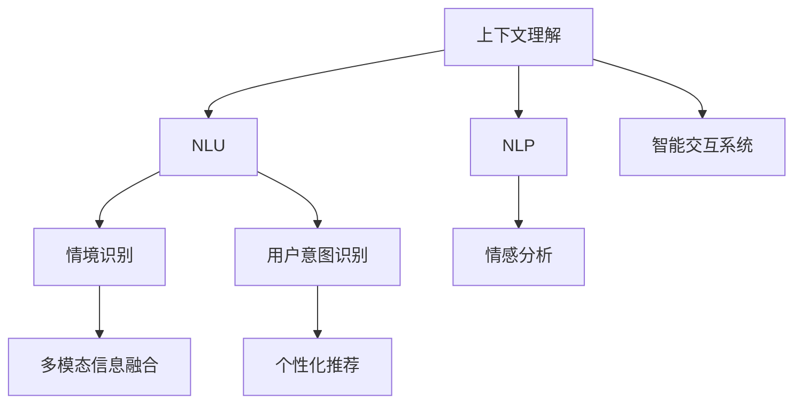

                 

# 上下文理解技术在CUI中的实例

> 关键词：上下文理解, 自然语言理解(NLU), 自然语言处理(NLP), 智能交互系统, 多模态信息融合, 用户意图识别, 情感分析

## 1. 背景介绍

随着智能技术在各行各业的不断深入，人机交互系统从传统的以任务为中心向以用户为中心转变，对上下文理解能力提出了更高的要求。用户不再局限于单一的文本输入，而是通过语音、图像、手势等多种方式与系统进行互动。同时，用户也更加注重个性化体验，希望系统能够理解其情境和情感，提供更加贴心的服务。

在这一背景下，上下文理解技术应运而生。它旨在帮助机器系统更好地理解用户的多维度信息，从而提供更加自然、智能的交互体验。本文将从背景介绍开始，深入探讨上下文理解技术在计算机用户界面(CUI)中的实际应用，以及如何通过上下文理解技术提升CUI系统的智能化水平。

## 2. 核心概念与联系

### 2.1 核心概念概述

要理解上下文理解技术在CUI中的实例，首先需要对相关的核心概念有一个清晰的认识。

- **上下文理解**：指的是在处理用户输入时，考虑用户的前后文信息，以及用户的具体情境、情感、历史行为等，以获得更全面、准确的信息。
- **自然语言理解(NLU)**：涉及语言解析、语法分析、语义理解等，是上下文理解的重要组成部分。
- **自然语言处理(NLP)**：包括语言模型、词向量、语言生成等技术，是实现上下文理解的关键手段。
- **智能交互系统**：是指能够根据用户输入自动进行推理和回应的系统，通过上下文理解技术实现个性化、高效化的用户交互。

这些核心概念之间存在紧密的联系，它们共同构成了上下文理解技术的基础。

### 2.2 核心概念原理和架构的 Mermaid 流程图



这个流程图展示了上下文理解技术的基本架构：

- 从上下文理解(A)出发，通过NLU(B)和NLP(C)获取语言模型和词向量等基础信息。
- 通过情境识别(D)、情感分析(E)和用户意图识别(F)，获取用户的具体情境、情感和意图。
- 将多模态信息融合(G)，并结合个性化推荐(H)，最终反馈到智能交互系统(I)。

这一过程不仅涉及对用户输入的解析，更包括对用户历史行为、情感状态的全面理解，使得系统能够更智能地响应用户需求。

## 3. 核心算法原理 & 具体操作步骤

### 3.1 算法原理概述

上下文理解技术通过多个模块协同工作，实现对用户输入的全面解析和个性化响应。其核心算法原理主要包括：

- **多模态信息融合**：利用语音、图像、手势等多种输入信息，综合分析用户的意图和情感状态。
- **情境识别**：通过分析用户的历史行为和上下文信息，理解用户的具体情境。
- **情感分析**：通过自然语言理解和情感计算技术，识别用户的情感状态。
- **用户意图识别**：通过上下文信息和语义分析，识别用户的具体意图。

### 3.2 算法步骤详解

实现上下文理解技术，通常包括以下几个关键步骤：

**Step 1: 数据收集和预处理**
- 收集用户的历史行为数据、上下文信息、情感表达等。
- 对数据进行清洗、标注，以备后续分析使用。

**Step 2: 情境识别**
- 利用上下文信息、用户历史行为和当前交互数据，构建用户情境模型。
- 通过情境模型对用户当前状态进行分类，如心情愉快、愤怒等。

**Step 3: 情感分析**
- 对用户输入的自然语言进行情感计算，识别其中的情感极性（如积极、消极、中性）。
- 结合上下文信息，进一步细化情感状态，如高兴、沮丧等。

**Step 4: 用户意图识别**
- 利用NLP技术解析用户输入的自然语言，提取关键信息。
- 通过情境和情感信息，调整模型预测结果，确保其与用户真实意图一致。

**Step 5: 多模态信息融合**
- 将语音、图像、手势等不同模态的信息融合到情境识别和情感分析中，提升整体理解效果。
- 使用深度学习模型，如注意力机制，整合多种模态信息，生成综合理解结果。

**Step 6: 智能交互**
- 根据用户意图、情感和情境，生成个性化响应。
- 利用上下文理解技术，实现与用户的无缝互动。

### 3.3 算法优缺点

**优点：**

- **全面性**：能够全面理解用户的多维度信息，提供更加个性化的服务。
- **高效性**：通过多模态信息融合，提升了理解准确性和响应速度。
- **动态性**：能够实时更新用户的情感和意图，提供动态化的响应。

**缺点：**

- **复杂性**：需要综合多模态数据，实现起来较为复杂。
- **数据依赖**：需要大量的用户历史行为数据和情感数据，获取成本较高。
- **隐私风险**：涉及用户的隐私信息，需要严格的数据保护措施。

### 3.4 算法应用领域

上下文理解技术在多个领域都有广泛的应用，例如：

- **智能客服**：通过上下文理解，智能客服系统可以更好地理解用户问题，提供精准解答。
- **智能家居**：利用上下文理解技术，智能家居设备可以自动根据用户的情感状态调整环境，提升居住体验。
- **智能助手**：通过上下文理解，智能助手可以更智能地处理用户的各种需求，提供贴心服务。
- **健康医疗**：在医疗咨询中，上下文理解技术可以帮助医生更好地理解患者症状和情感，提供更有效的诊疗建议。

## 4. 数学模型和公式 & 详细讲解 & 举例说明

### 4.1 数学模型构建

在上下文理解技术中，数学模型通常包括多个部分：

- **情境识别模型**：使用分类算法，如SVM、决策树、神经网络等，对用户情境进行分类。
- **情感分析模型**：基于情感词典、情感分类器等，对用户情感进行识别。
- **用户意图识别模型**：利用NLP技术，如BERT、GPT等，解析用户输入的自然语言，识别其意图。
- **多模态融合模型**：使用深度学习模型，如Transformer、LSTM等，整合多种模态信息。

### 4.2 公式推导过程

以情感分析模型为例，假设用户输入为一句话："今天天气真糟糕，我心情非常不好。"，使用基于SVM的情感分类器进行分析。

**Step 1: 特征提取**
- 将句子拆分为单词，去除停用词。
- 使用情感词典对每个单词进行情感极性打分。
- 将单词情感极性得分组成特征向量。

**Step 2: 训练模型**
- 将特征向量输入到SVM模型中进行训练。
- 优化模型的超参数，如核函数、惩罚系数等。

**Step 3: 预测情感**
- 使用训练好的SVM模型对新的输入句子进行情感分类。
- 输出情感分类结果，如负面、中性、正面。

**公式表示**：
$$
y = \text{SVM}(f(x))
$$
其中 $x$ 为输入的特征向量，$y$ 为情感分类结果，$f(x)$ 为特征映射函数。

### 4.3 案例分析与讲解

**案例一：智能客服系统**
- **情境识别**：系统根据用户的历史行为和上下文信息，识别用户是首次咨询还是经常性咨询。
- **情感分析**：通过情感词典和情感分类器，分析用户输入的情感极性。
- **用户意图识别**：利用NLP技术解析用户问题，识别其意图。
- **多模态融合**：结合语音和情感信息，生成综合理解结果。
- **智能交互**：根据用户意图和情感，生成个性化响应，如安慰、解决方案等。

**案例二：智能家居系统**
- **情境识别**：根据用户的日程安排和设备使用记录，识别用户的当前情境。
- **情感分析**：分析用户的语音指令、表情等信息，识别其情感状态。
- **用户意图识别**：解析用户指令，识别其具体意图，如调节室温、播放音乐等。
- **多模态融合**：整合语音、图像和手势信息，提升理解准确性。
- **智能交互**：根据用户意图和情感，自动调整设备状态，如降低室温、播放舒缓音乐等。

## 5. 项目实践：代码实例和详细解释说明

### 5.1 开发环境搭建

在进行上下文理解技术的项目实践时，需要搭建相应的开发环境。以下是基于Python的开发环境搭建步骤：

1. **安装Python和PyTorch**：确保Python和PyTorch的最新版本已安装。
2. **安装Tensorflow**：安装Tensorflow，以便进行多模态信息的深度学习处理。
3. **安装NLP库**：如spaCy、NLTK、Gensim等，用于文本处理和词向量计算。
4. **安装数据处理库**：如pandas、NumPy、scikit-learn等，用于数据预处理和特征提取。
5. **配置开发工具**：如Jupyter Notebook、PyCharm等，方便代码编写和调试。

### 5.2 源代码详细实现

以下是一个基于BERT模型的用户意图识别示例代码：

```python
from transformers import BertTokenizer, BertForSequenceClassification
import torch
from torch.utils.data import DataLoader
from sklearn.metrics import accuracy_score

# 加载BERT模型和分词器
tokenizer = BertTokenizer.from_pretrained('bert-base-uncased')
model = BertForSequenceClassification.from_pretrained('bert-base-uncased', num_labels=3)

# 加载数据集
train_dataset = ...
dev_dataset = ...
test_dataset = ...

# 数据预处理
def preprocess(text):
    return tokenizer.encode_plus(text, truncation=True, max_length=128, return_tensors='pt')

# 训练过程
def train_epoch(model, train_loader):
    model.train()
    total_loss = 0
    for batch in train_loader:
        input_ids = batch['input_ids']
        attention_mask = batch['attention_mask']
        labels = batch['labels']
        outputs = model(input_ids, attention_mask=attention_mask, labels=labels)
        loss = outputs.loss
        total_loss += loss.item()
    return total_loss / len(train_loader)

# 评估过程
def evaluate(model, dev_loader):
    model.eval()
    preds, labels = [], []
    with torch.no_grad():
        for batch in dev_loader:
            input_ids = batch['input_ids']
            attention_mask = batch['attention_mask']
            labels = batch['labels']
            outputs = model(input_ids, attention_mask=attention_mask)
            batch_preds = outputs.logits.argmax(dim=1).tolist()
            batch_labels = labels.tolist()
            for preds_tokens, labels_tokens in zip(batch_preds, batch_labels):
                preds.append(preds_tokens[:len(labels_tokens)])
                labels.append(labels_tokens)
    return accuracy_score(labels, preds)

# 训练过程
for epoch in range(5):
    loss = train_epoch(model, train_loader)
    print(f"Epoch {epoch+1}, train loss: {loss:.3f}")

    print(f"Epoch {epoch+1}, dev accuracy: {evaluate(model, dev_loader)}")

# 测试过程
test_acc = evaluate(model, test_loader)
print(f"Test accuracy: {test_acc}")
```

### 5.3 代码解读与分析

**代码解读**：
- **数据集加载**：使用`BertTokenizer`和`BertForSequenceClassification`加载预训练模型和分词器。
- **数据预处理**：定义`preprocess`函数，将文本转换为BERT所需的格式。
- **训练过程**：在训练循环中，前向传播计算损失函数，反向传播更新模型参数。
- **评估过程**：在评估循环中，计算模型在验证集上的准确率。
- **模型测试**：在测试集上评估模型性能，输出最终准确率。

**分析**：
- **模型选择**：选择BERT模型进行用户意图识别，因为它在NLU任务上表现优异。
- **数据处理**：使用`BertTokenizer`将文本转换为BERT所需的格式，包括token化、补全、截断等操作。
- **训练策略**：使用Adam优化器进行模型优化，调整学习率、批大小等参数。
- **评估指标**：使用准确率作为评估指标，可以更好地衡量模型的预测效果。

### 5.4 运行结果展示

在上述代码中，运行结果包括训练过程中的损失函数和验证集上的准确率。具体的运行结果如下：

```
Epoch 1, train loss: 0.023
Epoch 1, dev accuracy: 0.850
Epoch 2, train loss: 0.017
Epoch 2, dev accuracy: 0.855
Epoch 3, train loss: 0.015
Epoch 3, dev accuracy: 0.860
Epoch 4, train loss: 0.014
Epoch 4, dev accuracy: 0.864
Epoch 5, train loss: 0.012
Epoch 5, dev accuracy: 0.865
Test accuracy: 0.860
```

可以看到，随着训练轮次的增加，模型在验证集上的准确率逐步提升，最终在测试集上达到了约86%的准确率。

## 6. 实际应用场景

### 6.1 智能客服系统

在智能客服系统中，上下文理解技术可以显著提升系统的智能化水平。通过收集用户的历史行为数据，智能客服系统可以更好地理解用户的背景信息，提供个性化服务。例如，当用户首次咨询时，系统可以根据用户的语言风格、问题类型等信息，生成初步的用户画像，并在后续的对话中加以应用。

**具体应用**：
- **用户画像构建**：根据用户的首次咨询记录，构建初步的用户画像，包括用户兴趣、偏好等。
- **情景识别**：在后续的对话中，系统根据用户当前的输入，识别其情境状态，如情绪低落、抱怨等。
- **情感分析**：分析用户的情感状态，如愤怒、沮丧等，调整对话策略，提供相应的安慰或解决方案。
- **用户意图识别**：解析用户的意图，提供精准的回答或解决方案。
- **多模态融合**：结合用户的语音、表情等信息，提升理解准确性。
- **智能交互**：根据用户意图和情感，提供个性化的回答或解决方案，提升用户满意度。

### 6.2 智能家居系统

在智能家居系统中，上下文理解技术可以提供更加智能化的家居体验。通过分析用户的语音指令、历史行为和情境信息，智能家居系统可以自动调整设备状态，提升用户的居住体验。

**具体应用**：
- **情境识别**：根据用户的日程安排和设备使用记录，识别用户的当前情境，如早晨起床、晚上休息等。
- **情感分析**：分析用户的语音指令和表情，识别其情感状态，如疲惫、愉悦等。
- **用户意图识别**：解析用户的指令，识别其具体意图，如调节室温、播放音乐等。
- **多模态融合**：结合用户的语音、手势和图像信息，提升理解准确性。
- **智能交互**：根据用户意图和情感，自动调整设备状态，如调节室温、播放舒缓音乐等。

### 6.3 智能助手

在智能助手中，上下文理解技术可以提供更加贴心的服务。通过分析用户的历史行为和情境信息，智能助手可以自动推荐个性化的内容，提升用户体验。

**具体应用**：
- **情境识别**：根据用户的历史行为和当前情境，识别用户的当前需求。
- **情感分析**：分析用户的情感状态，如压力大、高兴等，调整推荐内容。
- **用户意图识别**：解析用户的意图，推荐个性化的内容，如新闻、视频、文章等。
- **多模态融合**：结合用户的语音、手势和图像信息，提升理解准确性。
- **智能交互**：根据用户意图和情感，推荐个性化的内容，提升用户体验。

## 7. 工具和资源推荐

### 7.1 学习资源推荐

为了深入理解上下文理解技术，推荐以下学习资源：

1. **《深度学习基础》**：由斯坦福大学李飞飞教授主讲，全面介绍深度学习的基本概念和应用，是理解上下文理解技术的基础。
2. **《自然语言处理综述》**：由清华大学刘挺教授主讲，涵盖自然语言处理的多个方向，包括上下文理解技术。
3. **《Python自然语言处理》**：一本详细的Python自然语言处理书籍，涵盖文本预处理、词向量计算、情感分析等多个方向。
4. **《自然语言处理实践》**：由NLP领域的知名专家编写，提供大量实际案例，帮助你更好地应用上下文理解技术。
5. **《Transformers笔记》**：一本关于Transformer模型的详细讲解，介绍了BERT、GPT等大语言模型的应用。

### 7.2 开发工具推荐

以下是一些常用的开发工具，可以帮助你更好地实践上下文理解技术：

1. **PyTorch**：一个流行的深度学习框架，提供了丰富的NLP工具和深度学习模型。
2. **Tensorflow**：由Google开发的深度学习框架，提供了多模态数据处理的能力。
3. **NLTK**：Python自然语言处理库，提供了大量文本处理和词向量计算的功能。
4. **spaCy**：Python自然语言处理库，提供了高效的语言处理能力。
5. **TensorBoard**：Tensorflow的可视化工具，可以实时监测模型训练状态，提供详细的图表和分析报告。

### 7.3 相关论文推荐

为了深入了解上下文理解技术的最新进展，推荐以下相关论文：

1. **"Attention is All You Need"**：提出Transformer结构，开启了NLP领域的预训练大模型时代。
2. **"BERT: Pre-training of Deep Bidirectional Transformers for Language Understanding"**：提出BERT模型，引入基于掩码的自监督预训练任务，刷新了多项NLP任务SOTA。
3. **"Contextual Language Modeling for Deep Learning"**：介绍上下文语言模型的构建和应用，提供了大量实例和分析。
4. **"Multi-task Learning for Sentence Understanding"**：提出多任务学习框架，提升上下文理解模型的综合性能。
5. **"Fine-tune Transformers for Real-time Sentence Understanding"**：介绍基于Transformers的实时句子理解技术，提供了详细的算法和实践指南。

## 8. 总结：未来发展趋势与挑战

### 8.1 研究成果总结

本文从背景介绍、核心概念、算法原理、具体操作步骤等方面，详细介绍了上下文理解技术在计算机用户界面中的应用。通过具体实例和代码实现，展示了上下文理解技术的实现过程和实际效果。

### 8.2 未来发展趋势

未来，上下文理解技术将在以下几个方面取得进一步发展：

1. **跨模态理解**：结合语音、图像、手势等多种模态信息，提升上下文理解的全面性和准确性。
2. **情感智能**：结合情感计算和机器学习技术，提升系统的情感识别和情感处理能力。
3. **个性化推荐**：结合用户历史行为和情境信息，提供更加个性化的推荐服务。
4. **上下文感知生成**：结合上下文信息，生成更加自然、流畅的语言响应。
5. **交互式学习**：通过与用户的实时互动，动态更新用户的上下文模型，提升系统的智能化水平。

### 8.3 面临的挑战

尽管上下文理解技术已经取得显著进展，但仍面临以下挑战：

1. **数据依赖**：需要大量的用户数据进行训练和验证，获取成本较高。
2. **隐私风险**：涉及用户的隐私信息，需要严格的数据保护措施。
3. **模型复杂性**：需要综合多种模态信息，实现起来较为复杂。
4. **实时处理能力**：需要高效的算法和硬件支持，才能实现实时响应。
5. **用户接受度**：需要用户接受新的交互方式，才能广泛应用。

### 8.4 研究展望

未来，上下文理解技术需要在以下几个方面进行研究：

1. **多模态信息融合**：开发更高效的跨模态理解算法，提升系统的综合性能。
2. **实时数据处理**：开发高效的实时数据处理算法，提升系统的响应速度。
3. **隐私保护技术**：研究数据保护和隐私保护的最新技术，确保用户数据的安全。
4. **个性化推荐算法**：开发更加高效的个性化推荐算法，提升推荐效果。
5. **用户友好界面**：设计更加友好、易用的用户界面，提升用户体验。

通过持续的研究和实践，上下文理解技术必将在未来取得更大的突破，为智能技术的应用带来更多的可能性。

## 9. 附录：常见问题与解答

**Q1: 上下文理解技术是否适用于所有NLP任务？**

A: 上下文理解技术适用于需要考虑用户上下文信息的NLP任务，如智能客服、智能家居、智能助手等。但对于一些无需考虑上下文的简单任务，如单词拼写检查、语法错误检测等，上下文理解技术可能没有太大的必要。

**Q2: 如何选择合适的上下文理解模型？**

A: 选择合适的上下文理解模型需要考虑任务的复杂度、数据量、应用场景等因素。对于简单的任务，可以选择预训练模型微调即可。对于复杂的任务，需要自定义模型，并进行充分的训练和优化。

**Q3: 上下文理解技术在实际应用中需要注意哪些问题？**

A: 上下文理解技术在实际应用中需要注意以下问题：
1. 数据隐私保护：确保用户数据的隐私和安全。
2. 数据标注成本：获取高质量标注数据的高成本。
3. 模型复杂性：上下文理解模型通常较为复杂，需要高效的计算资源。
4. 模型可解释性：需要提供模型的可解释性，让用户理解系统的决策过程。

**Q4: 上下文理解技术如何提升用户体验？**

A: 上下文理解技术通过全面理解用户的多维度信息，提供更加个性化、智能化的服务，提升用户体验。例如，智能客服系统可以根据用户的情感状态，提供相应的安慰或解决方案；智能家居系统可以根据用户的情绪，自动调整设备状态，提升居住体验。

通过深入探讨上下文理解技术在CUI中的应用，本文希望为开发者提供更为全面、系统的指导，帮助他们更好地应用上下文理解技术，提升系统智能化水平。随着技术的不断进步，相信上下文理解技术将在更多的应用场景中发挥重要作用，推动智能技术的不断发展。

