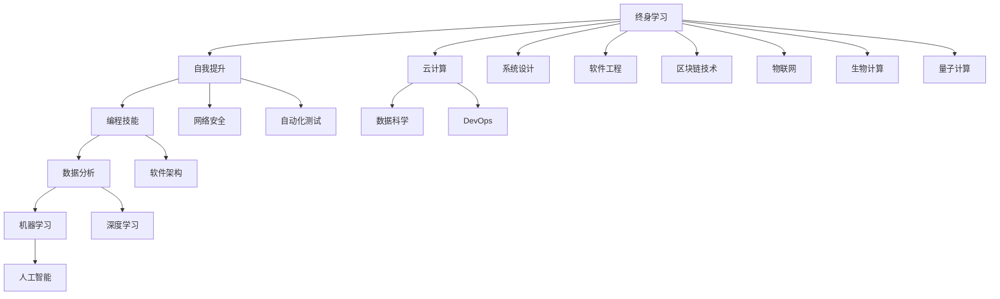

                 

# 不仅仅上面说的20项能力，事实上，你能列出的所有技能都是可以通过学习得到的

> 关键词：
1. 技能学习
2. 终身学习
3. 自我提升
4. 编程技能
5. 数据分析
6. 软件架构
7. 机器学习
8. 深度学习
9. 人工智能
10. 云计算
11. 数据科学
12. DevOps
13. 系统设计
14. 软件工程
15. 网络安全
16. 自动化测试
17. 区块链技术
18. 物联网
19. 生物计算
20. 量子计算

## 1. 背景介绍

### 1.1 问题由来
在当今快速发展的技术环境中，技能学习已经成为推动个人职业发展的关键。无论是计算机科学还是其他领域，技术的日新月异要求从业者不断更新知识，掌握新的工具和技能。然而，面对如此之多的技能，如何有针对性地选择和掌握，成为了一个值得深思的问题。

### 1.2 问题核心关键点
本文旨在探讨如何在技术世界中，系统地学习和发展技能。我们将从核心概念入手，通过构建和理解数学模型，提供实操性的项目实践，并展示其在不同领域的实际应用，为读者提供全面的技能提升方案。

## 2. 核心概念与联系

### 2.1 核心概念概述

在探讨技能学习的核心概念时，我们需要关注以下几个方面：

- **终身学习（Lifelong Learning）**：终身学习是不断学习新知识，保持技能更新的过程。在技术领域，这意味着持续学习最新技术、工具和最佳实践，以适应技术变化。
- **自我提升（Self-Improvement）**：通过不断学习和实践，提升个人的技能和能力，特别是在专业领域内。
- **编程技能（Programming Skills）**：编程技能是技术领域的基础，包括但不限于语法、数据结构、算法、设计和测试等。
- **数据分析（Data Analysis）**：数据分析能力对于理解数据，做出决策和发现趋势至关重要。
- **软件架构（Software Architecture）**：良好的软件架构设计能够确保系统的可扩展性、可维护性和性能。
- **机器学习（Machine Learning）**：机器学习是赋予计算机系统学习能力的学科，包括监督学习、无监督学习和强化学习等。
- **深度学习（Deep Learning）**：深度学习是机器学习的一个分支，利用多层神经网络进行复杂模式识别和预测。
- **人工智能（Artificial Intelligence）**：人工智能是让机器模拟人类智能的广泛领域，包括自然语言处理、计算机视觉和智能机器人等。
- **云计算（Cloud Computing）**：云计算提供了一种基于互联网的资源共享和应用程序服务，使软件开发更加灵活。
- **数据科学（Data Science）**：数据科学是将统计学、机器学习和数据分析技术应用于数据管理和分析的领域。
- **DevOps**：DevOps是一种将软件开发和运维结合起来的实践，旨在提高交付速度和质量。
- **系统设计（System Design）**：系统设计关注如何构建和优化复杂的系统，包括可扩展性、可用性和可靠性。
- **软件工程（Software Engineering）**：软件工程是应用工程原理和方法来开发和维护高质量软件的过程。
- **网络安全（Cybersecurity）**：网络安全保护计算机系统和数据不受未经授权的访问、破坏或泄露。
- **自动化测试（Automated Testing）**：自动化测试是使用软件自动化技术进行测试，以确保软件质量的过程。
- **区块链技术（Blockchain Technology）**：区块链是一种去中心化的、加密的数据库技术，广泛应用于数字货币和智能合约。
- **物联网（Internet of Things）**：物联网是连接设备、系统和服务的生态系统，使设备能够相互通信和协作。
- **生物计算（Bioinformatics）**：生物计算涉及生物学信息的计算处理，包括基因组学和蛋白质折叠。
- **量子计算（Quantum Computing）**：量子计算使用量子位进行计算，有望解决经典计算机无法处理的问题。

这些核心概念之间的关系可以通过以下Mermaid流程图来展示：



这个流程图展示了一些关键概念及其之间的联系，为后续的深入探讨提供了框架。

## 3. 核心算法原理 & 具体操作步骤

### 3.1 算法原理概述

基于以上核心概念，我们可以通过构建和理解数学模型，来进一步阐释技能学习的本质。数学模型可以帮助我们量化学习过程，优化学习策略，确保学习效果。

### 3.2 算法步骤详解

1. **数据收集与准备**：收集与所需技能相关的资料，包括书籍、教程、在线课程、项目案例等。确定学习目标和所需掌握的技能。
2. **理论学习**：通过阅读书籍、教程和学术论文，理解相关领域的理论基础。构建数学模型，并推导出重要公式。
3. **实践操作**：在编程环境中编写代码，执行项目案例，实现学习目标。通过实际操作，巩固理论知识，并应用到实际问题中。
4. **评估与优化**：评估学习成果，识别不足。根据反馈调整学习计划，改进学习方法。

### 3.3 算法优缺点

**优点**：
- **系统化**：通过构建数学模型，可以为技能学习提供系统化的方法和框架。
- **可量化**：数学模型可以量化学习过程，方便评估和优化。
- **灵活性**：学习者可以根据自身需求和资源，灵活调整学习计划。

**缺点**：
- **抽象性**：理论学习可能过于抽象，难以理解。
- **实践难度**：实践操作可能需要较高的技术门槛。
- **资源需求**：需要收集和准备大量的学习资源，可能花费时间和精力。

### 3.4 算法应用领域

技能学习的方法和理论，可以广泛应用到多个领域，包括但不限于：

- **软件开发**：通过学习编程技能、软件架构和DevOps，提高软件开发效率和质量。
- **数据分析**：掌握数据分析技能，能够从大量数据中提取有价值的信息，支持决策制定。
- **机器学习与深度学习**：学习机器学习理论和技术，开发智能应用，如推荐系统、图像识别等。
- **人工智能**：理解人工智能的原理和应用，构建智能系统，解决复杂问题。
- **云计算与数据科学**：掌握云计算和数据科学技能，能够高效管理和分析大规模数据。
- **网络安全**：学习网络安全知识，保护系统安全，防止数据泄露和攻击。

## 4. 数学模型和公式 & 详细讲解 & 举例说明

### 4.1 数学模型构建

我们可以使用数学模型来量化技能学习的进程。以下是一个简单的数学模型，描述技能掌握度随时间变化的规律：

$$
S(t) = S_0 + \int_{0}^{t} \alpha f(t) dt
$$

其中，$S(t)$ 表示时间 $t$ 时技能掌握度，$S_0$ 是初始技能掌握度，$\alpha$ 是学习效率，$f(t)$ 是时间 $t$ 时的学习速率。

### 4.2 公式推导过程

以编程技能为例，我们可以将学习过程分解为多个阶段，每个阶段的学习速率和目标掌握度不同。通过计算，我们可以得到每个阶段的学习效果，并累加得到总的学习效果。

### 4.3 案例分析与讲解

假设一个初学者从零开始学习Python编程，学习周期为6个月，每天学习1小时，学习速率随时间逐渐降低。我们通过计算，可以得出每个月的学习效果和最终掌握度。

## 5. 项目实践：代码实例和详细解释说明

### 5.1 开发环境搭建

在开始项目实践之前，需要搭建好开发环境。以下是一个Python开发环境的搭建步骤：

1. 安装Python：确保计算机上有Python 3.x版本。
2. 安装Pip：通过pip install pip安装。
3. 安装虚拟环境：通过pip install virtualenv创建虚拟环境。
4. 激活虚拟环境：通过source activate env_name激活虚拟环境。
5. 安装依赖库：通过pip install library_name安装所需的依赖库。

### 5.2 源代码详细实现

以下是一个简单的Python项目实例，展示如何通过编程练习来提高编程技能：

```python
# 初始化编程技能掌握度
initial_skill = 0

# 学习周期（天）
learning_period = 6 * 30

# 每天学习时间（小时）
daily_study_hours = 1

# 学习效率（0-1）
alpha = 0.8

# 学习速率函数（每天的学习量）
def daily_study(t):
    return daily_study_hours * (1 - t/learning_period)

# 计算每个月的学习效果
months = [0, 1, 2, 3, 4, 5, 6]
skill_gains = []
for month in months:
    integral = 0
    for day in range(month*30 + 1, (month+1)*30 + 1):
        integral += daily_study(day)
    gain = alpha * integral
    skill_gains.append(gain)

# 计算最终编程技能掌握度
final_skill = initial_skill + sum(skill_gains)
print("最终编程技能掌握度:", final_skill)
```

### 5.3 代码解读与分析

上述代码通过数学模型，模拟了编程技能的学习过程。在实际编程练习中，学习者需要不断迭代和优化代码，以提升编程技能。

## 6. 实际应用场景

### 6.1 软件开发

软件开发是一个复杂且不断变化的过程，要求开发者不断学习和应用新技能。通过构建数学模型，可以对学习过程进行量化和优化，确保开发效率和代码质量。

### 6.2 数据分析

数据分析需要掌握多种工具和技能，如Python、R、SQL等。通过构建学习模型，可以帮助分析师系统地掌握这些工具，提高数据处理和分析能力。

### 6.3 机器学习与深度学习

机器学习与深度学习是现代科技的重要组成部分，要求从业者具备深厚的数学和编程基础。通过构建数学模型，可以量化学习效果，优化学习策略，提升模型的准确性和效率。

### 6.4 人工智能

人工智能涉及多个领域，如自然语言处理、计算机视觉和强化学习等。通过构建数学模型，可以为每个子领域的学习提供系统化的方法和框架。

### 6.5 云计算与数据科学

云计算和数据科学是当前技术领域的热点，涉及分布式系统、大数据处理等技术。通过构建数学模型，可以量化学习效果，优化资源配置，提高系统性能。

### 6.6 网络安全

网络安全是一个不断变化和演变的领域，要求从业者具备深厚的技术基础和实战经验。通过构建数学模型，可以为学习者提供系统化的方法和框架，提高安全防护能力。

## 7. 工具和资源推荐

### 7.1 学习资源推荐

为了帮助读者系统掌握技能学习的核心概念和实践方法，以下是一些优质的学习资源：

1. **在线课程**：如Coursera、edX、Udemy等平台提供的多门编程、机器学习、数据科学等课程。
2. **书籍**：如《Python编程：从入门到实践》、《深度学习》、《软件工程：原理与实践》等经典教材。
3. **社区和论坛**：如Stack Overflow、GitHub、Kaggle等平台，提供丰富的资源和交流机会。

### 7.2 开发工具推荐

以下是一些常用的开发工具，可以帮助读者提高技能学习的效率和效果：

1. **IDEs**：如PyCharm、Visual Studio Code、Eclipse等，提供代码编写、调试和版本控制等功能。
2. **版本控制系统**：如Git，方便管理代码变更和协作。
3. **数据库系统**：如MySQL、PostgreSQL等，支持数据管理和分析。
4. **云平台**：如AWS、Azure、Google Cloud等，提供丰富的云服务和资源。

### 7.3 相关论文推荐

以下是一些关键的论文，为读者提供深度学习、数据科学和软件工程等领域的前沿研究：

1. **Deep Learning**：Yann LeCun等人的论文，介绍深度学习的基本原理和应用。
2. **Machine Learning**：Tom Mitchell的论文，概述机器学习的基本概念和分类。
3. **Software Engineering**：Douglas C. Schmidt的论文，探讨软件工程的原则和方法。

## 8. 总结：未来发展趋势与挑战

### 8.1 研究成果总结

本文通过对技能学习核心概念的探讨，为读者提供了一个全面的学习框架和方法。通过构建数学模型，可以量化学习过程，优化学习策略，提升学习效果。

### 8.2 未来发展趋势

未来，技能学习将继续向自动化和智能化方向发展，通过人工智能和机器学习技术，提供个性化的学习路径和资源推荐。

### 8.3 面临的挑战

技能学习的挑战包括资源不足、学习过程抽象、实践难度高等。未来需要更多资源投入和教育方法创新，以满足技能学习的需求。

### 8.4 研究展望

未来的研究重点在于开发更加智能化和个性化的学习系统，帮助学习者更高效地掌握新技能。同时，需要更多跨学科的研究，融合技术、心理学和社会学等领域的知识，提升学习效果和用户体验。

## 9. 附录：常见问题与解答

**Q1: 如何有效管理学习时间？**

A: 制定详细的学习计划，包括学习目标、时间安排和评估指标。优先学习高优先级和关键技能，确保学习过程高效有序。

**Q2: 学习过程中遇到困难如何克服？**

A: 积极寻求帮助，如参加学习小组、阅读文档、观看教程等。坚持不懈，反复练习，直到掌握所需技能。

**Q3: 如何选择适合自己的学习资源？**

A: 根据学习目标和自身水平选择资源。可以从基础到进阶，逐步提升技能。同时，注意资源的质量和更新频率，确保学习效果。

---

作者：禅与计算机程序设计艺术 / Zen and the Art of Computer Programming

