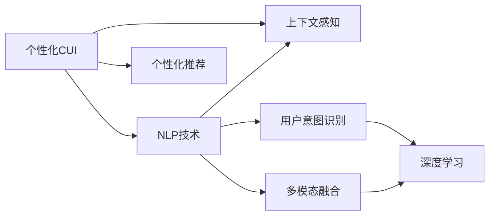

                 

# 个性化CUI交互体验的技术发展

> 关键词：
1. 自然语言处理(NLP)
2. 个性化推荐系统(Recommender System)
3. 上下文感知(Context-Awareness)
4. 多模态融合(Multimodal Fusion)
5. 用户意图识别(User Intent Recognition)
6. 深度学习(Deep Learning)
7. 对话系统(Dialogue System)

## 1. 背景介绍

### 1.1 问题由来

随着人工智能技术的快速发展，基于自然语言处理(Natural Language Processing, NLP)的计算机用户接口(Computer User Interface, CUI)日益成为推动人机交互的重要工具。与传统的图形界面不同，CUI通过文本或语音等自然语言与用户进行互动，更加自然直观，适应性强。

个性化CUI是NLP技术与用户交互技术的深度融合，旨在通过理解和预测用户意图，提供与用户兴趣、情感和行为相匹配的交互体验。传统CUI往往只考虑简单任务和静态数据，难以实现个性化和上下文感知功能。通过NLP技术和大数据分析，个性化CUI可提供更加智能、高效、个性化的用户交互体验，为用户带来全新的体验。

### 1.2 问题核心关键点

个性化CUI交互体验的核心关键点包括：
- **用户意图识别**：通过自然语言处理技术，理解用户的真实需求，实现从文本到意图的自动映射。
- **多模态融合**：将文本、语音、图像等多种模态信息融合，提升系统对复杂场景的感知和理解能力。
- **上下文感知**：考虑用户的上下文信息，如历史行为、环境因素等，提供更加连续和一致的交互体验。
- **推荐算法**：在个性化CUI中，推荐系统用于为用户提供个性化的内容或服务。

这些关键技术点相互交织，共同支撑个性化CUI交互体验的发展。

### 1.3 问题研究意义

个性化CUI交互体验的研究具有重要意义：
1. **提升用户体验**：个性化交互可以根据用户的行为和偏好，提供量身定制的服务，极大提升用户满意度和使用体验。
2. **提高系统效率**：通过智能化的意图识别和多模态融合，系统可以更快速准确地理解用户需求，减少用户等待时间。
3. **降低服务成本**：个性化CUI可以更高效地分配和匹配资源，减少人工客服的负担，降低运营成本。
4. **推动产业升级**：个性化CUI技术可以广泛应用于电商、金融、教育、医疗等多个领域，促进相关产业的数字化转型。
5. **实现精准营销**：通过个性化推荐，为用户提供更加精准的服务，提升广告和内容投放的效果。

## 2. 核心概念与联系

### 2.1 核心概念概述

本节将介绍几个与个性化CUI交互体验密切相关的核心概念：

- **自然语言处理(NLP)**：研究如何让计算机理解、解释和生成人类语言的技术，包括语音识别、文本分析、情感计算等。
- **个性化推荐系统(Recommender System)**：根据用户的历史行为、兴趣和属性，推荐用户可能感兴趣的个性化内容或服务。
- **上下文感知(Context-Awareness)**：考虑用户所处的环境、时间、情绪等因素，提供与上下文相适应的交互体验。
- **多模态融合(Multimodal Fusion)**：将文本、语音、图像等多种数据源融合，提升系统的感知和理解能力。
- **用户意图识别(User Intent Recognition)**：通过NLP技术，从用户输入的文本中自动识别其真实意图，从而提供精确的交互服务。
- **深度学习(Deep Learning)**：一种通过多层神经网络进行复杂特征学习和模式识别的技术，在大数据和复杂模型训练中表现出色。

这些核心概念之间的联系可以通过以下Mermaid流程图展示：



该流程图展示了个性化CUI的核心组成和技术栈：

1. 个性化CUI通过NLP技术理解用户输入的文本。
2. 用户意图识别通过NLP技术将文本映射为意图。
3. 多模态融合考虑用户的多种输入信息，提升系统的感知能力。
4. 个性化推荐系统根据用户意图和历史行为，提供个性化服务。
5. 上下文感知考虑用户所处的具体环境，增强交互的连贯性。
6. 深度学习用于处理大规模数据和复杂模型，提高系统的泛化能力。

## 3. 核心算法原理 & 具体操作步骤
### 3.1 算法原理概述

个性化CUI交互体验的算法原理，主要基于自然语言处理和深度学习的技术。其核心思想是通过多模态融合和上下文感知，结合推荐算法，实现对用户意图的精准理解和个性化服务。

形式化地，假设用户的输入为 $x$，意图为 $I$，上下文为 $C$，推荐系统输出的个性化服务为 $y$。则个性化CUI的目标是通过模型 $M_{\theta}$ 实现从 $(x,C)$ 到 $y$ 的映射，其中 $\theta$ 为模型参数。

个性化CUI的优化目标是最小化预期损失函数 $\mathcal{L}(y,M_{\theta})$，使得推荐系统输出的服务 $y$ 尽可能贴近用户的真实需求。常见的损失函数包括交叉熵损失、均方误差损失等。

### 3.2 算法步骤详解

基于上述原理，个性化CUI的算法步骤可以总结为：

**Step 1: 数据预处理**
- 收集和清洗用户的历史行为数据、文本数据等，构建训练集和验证集。
- 通过分词、去除停用词、词干化等技术，对文本数据进行预处理。
- 利用多模态数据采集技术，收集用户语音、图像等多种输入信息。

**Step 2: 特征提取**
- 利用NLP技术提取文本特征，如词向量、句法树等。
- 利用深度学习模型提取多模态特征，如卷积神经网络(CNN)、循环神经网络(RNN)、Transformer等。
- 将提取出的特征进行拼接或融合，生成最终的输入表示。

**Step 3: 意图识别**
- 通过意图识别模型将文本输入映射为意图标签。
- 利用分类算法（如逻辑回归、支持向量机等）或神经网络（如BERT、GPT等）训练意图识别模型。
- 在验证集上评估模型性能，通过调整模型结构和超参数优化模型。

**Step 4: 上下文感知**
- 考虑用户的上下文信息，如时间、位置、设备等，进行上下文编码。
- 利用LSTM等序列模型处理上下文信息，增强系统的感知能力。
- 将上下文编码与意图表示进行融合，生成更具上下文意识的输入表示。

**Step 5: 推荐系统设计**
- 根据意图和上下文表示，设计合适的推荐算法。
- 常用的推荐算法包括协同过滤、内容推荐、混合推荐等。
- 利用深度学习模型设计推荐系统，如神经协同过滤、基于注意力机制的推荐等。

**Step 6: 模型训练与评估**
- 在训练集上训练推荐模型，最小化损失函数。
- 使用验证集评估模型性能，通过早停法、学习率衰减等技术优化模型。
- 在测试集上评估模型泛化能力，分析模型的误差来源。

**Step 7: 系统集成与部署**
- 将意图识别和推荐系统集成到个性化CUI中，实现流畅的交互体验。
- 部署系统到生产环境，监控系统性能和用户反馈。
- 定期更新模型和数据，优化系统性能。

### 3.3 算法优缺点

个性化CUI算法具有以下优点：
1. 实现简单高效。通过深度学习和NLP技术，可以高效地处理大规模数据和复杂模型。
2. 个性化程度高。利用多模态融合和上下文感知，提供更加精准的个性化服务。
3. 适应性强。可以处理不同类型的用户输入和多种场景，具有较强的泛化能力。
4. 用户满意度提升。通过个性化推荐和意图识别，提升用户的使用体验和满意度。

同时，该算法也存在一些局限性：
1. 数据依赖性强。算法的性能依赖于高质量的用户行为数据和文本数据，获取数据成本较高。
2. 计算资源需求高。深度学习模型需要大量的计算资源进行训练和推理，对硬件要求较高。
3. 系统复杂度高。算法的实现需要综合多领域的技术，系统设计和实现较为复杂。
4. 模型难以解释。深度学习模型通常是黑盒模型，难以解释其内部工作机制和决策逻辑。
5. 隐私和安全风险。个性化CUI涉及用户隐私数据，可能存在数据泄露和滥用风险，需加强隐私保护和数据安全。

尽管存在这些局限性，但个性化CUI算法在提升用户体验和系统性能方面具有重要意义，未来还需不断优化和改进。

### 3.4 算法应用领域

个性化CUI技术在多个领域都有广泛应用，包括但不限于：

- **电商推荐系统**：根据用户的历史浏览和购买记录，推荐相关商品。利用多模态融合和上下文感知，提升推荐精度。
- **智能客服系统**：通过用户对话文本，自动识别意图并提供解决方案。利用意图识别和个性化推荐，提升客服效率和用户满意度。
- **在线教育平台**：根据用户的学习行为和兴趣，推荐相关课程和学习资源。利用上下文感知和推荐算法，提供个性化学习路径。
- **金融理财应用**：分析用户财务数据和投资行为，提供个性化的理财建议。利用多模态融合和深度学习，提升推荐精度。
- **智能家居系统**：根据用户的生活习惯和环境条件，提供个性化的家居控制和服务。利用上下文感知和推荐算法，提升系统智能性。
- **健康医疗应用**：分析用户的健康数据和行为，提供个性化的医疗建议。利用多模态融合和上下文感知，提升诊断和治疗效果。

## 4. 数学模型和公式 & 详细讲解 & 举例说明
### 4.1 数学模型构建

本节将使用数学语言对个性化CUI交互体验的算法进行严格刻画。

记用户输入为 $x \in \mathbb{R}^n$，意图表示为 $I \in \{1,2,\dots,K\}$，上下文表示为 $C \in \mathbb{R}^m$，推荐系统输出的服务为 $y \in \mathcal{Y}$。假设意图识别模型为 $I_{\theta_I}(x, C)$，推荐模型为 $y_{\theta_Y}(I, C)$。

则个性化CUI的目标是最大化平均用户满意度：

$$
\max_{\theta_I,\theta_Y} \mathbb{E}_{(x,C)} [R(I_{\theta_I}(x,C), y_{\theta_Y}(I_{\theta_I}(x,C), C))]
$$

其中 $R$ 为满意度函数，通常为自定义的评分函数或用户行为指标。

### 4.2 公式推导过程

假设 $x$ 和 $C$ 的数据分布为 $p(x,C)$，$I_{\theta_I}(x,C)$ 的损失函数为 $\mathcal{L}_{I}(\theta_I)$，$y_{\theta_Y}(I,C)$ 的损失函数为 $\mathcal{L}_{Y}(\theta_Y)$，则个性化CUI的整体损失函数为：

$$
\mathcal{L}(\theta_I,\theta_Y) = \mathbb{E}_{(x,C)} [\mathcal{L}_{I}(\theta_I(x,C)) + \mathcal{L}_{Y}(\theta_Y(I_{\theta_I}(x,C),C))]
$$

在训练过程中，通过优化算法（如梯度下降）最小化整体损失函数，得到最优的意图识别和推荐模型参数 $\theta_I^*$ 和 $\theta_Y^*$。

### 4.3 案例分析与讲解

以电商推荐系统为例，分析个性化CUI的具体实现过程：

**Step 1: 数据收集与预处理**
- 收集用户的历史浏览记录、购买记录、评分记录等行为数据。
- 对文本数据进行分词、去除停用词、词干化等预处理。
- 使用多模态数据采集设备，收集用户语音、图像等数据。

**Step 2: 特征提取**
- 利用BERT等预训练模型提取文本特征，得到词向量表示。
- 利用CNN、RNN等深度学习模型提取多模态特征，得到用户特征向量。
- 将文本特征和多模态特征拼接，得到最终的输入表示。

**Step 3: 意图识别**
- 使用分类算法或神经网络模型训练意图识别模型。
- 在验证集上评估模型性能，通过调整模型结构和超参数优化模型。
- 利用多标签分类模型识别用户的多重意图，提高推荐精度。

**Step 4: 上下文感知**
- 考虑用户的时间、位置、设备等上下文信息，进行上下文编码。
- 利用LSTM等序列模型处理上下文信息，增强系统的感知能力。
- 将上下文编码与意图表示进行融合，生成更具上下文意识的输入表示。

**Step 5: 推荐系统设计**
- 设计协同过滤推荐模型，基于用户和商品的历史交互数据。
- 设计基于内容的推荐模型，推荐与用户兴趣相关的商品。
- 使用混合推荐算法，综合多种推荐模型，提高推荐精度。

**Step 6: 模型训练与评估**
- 在训练集上训练推荐模型，最小化损失函数。
- 使用验证集评估模型性能，通过早停法、学习率衰减等技术优化模型。
- 在测试集上评估模型泛化能力，分析模型的误差来源。

**Step 7: 系统集成与部署**
- 将意图识别和推荐系统集成到电商推荐系统中，实现流畅的交互体验。
- 部署系统到生产环境，监控系统性能和用户反馈。
- 定期更新模型和数据，优化系统性能。

## 5. 项目实践：代码实例和详细解释说明
### 5.1 开发环境搭建

在进行个性化CUI交互体验开发前，我们需要准备好开发环境。以下是使用Python进行TensorFlow开发的环境配置流程：

1. 安装Anaconda：从官网下载并安装Anaconda，用于创建独立的Python环境。

2. 创建并激活虚拟环境：
```bash
conda create -n tensorflow-env python=3.8 
conda activate tensorflow-env
```

3. 安装TensorFlow：从官网获取对应的安装命令，例如：
```bash
pip install tensorflow-gpu
```

4. 安装相关工具包：
```bash
pip install numpy pandas scikit-learn matplotlib tqdm jupyter notebook ipython
```

完成上述步骤后，即可在`tensorflow-env`环境中开始个性化CUI交互体验的开发。

### 5.2 源代码详细实现

下面我们以电商推荐系统为例，给出使用TensorFlow进行个性化CUI交互体验的代码实现。

首先，定义推荐系统的数据处理函数：

```python
import tensorflow as tf
from tensorflow.keras.layers import Input, Dense, Embedding, LSTM, Concatenate, Dropout
from tensorflow.keras.models import Model
from sklearn.model_selection import train_test_split
import pandas as pd

def preprocess_data(data_path, max_len=100):
    # 加载数据集
    df = pd.read_csv(data_path)
    # 处理缺失值和异常值
    df.fillna(method='ffill', inplace=True)
    # 分词和向量化
    from tensorflow.keras.preprocessing.text import Tokenizer
    from tensorflow.keras.preprocessing.sequence import pad_sequences
    tokenizer = Tokenizer(num_words=5000)
    tokenizer.fit_on_texts(df['text'])
    sequences = tokenizer.texts_to_sequences(df['text'])
    sequences = pad_sequences(sequences, maxlen=max_len)
    # 提取用户特征
    user_features = df[['age', 'gender', 'location']].values
    # 将数据集划分为训练集和验证集
    x_train, x_val, y_train, y_val = train_test_split(sequences, df['label'], test_size=0.2, random_state=42)
    return x_train, x_val, y_train, y_val, user_features

# 定义深度学习模型
def build_model(input_dim, output_dim, hidden_dim=64, dropout_rate=0.2):
    # 定义输入层
    user_input = Input(shape=(None, ), dtype='int32')
    item_input = Input(shape=(None, ), dtype='int32')
    # 定义嵌入层
    user_embedding = Embedding(input_dim=input_dim, output_dim=hidden_dim)(user_input)
    item_embedding = Embedding(input_dim=input_dim, output_dim=hidden_dim)(item_input)
    # 定义LSTM层
    user_lstm = LSTM(hidden_dim, dropout=dropout_rate, recurrent_dropout=dropout_rate)(user_embedding)
    item_lstm = LSTM(hidden_dim, dropout=dropout_rate, recurrent_dropout=dropout_rate)(item_embedding)
    # 定义拼接层
    concat = Concatenate()([user_lstm, item_lstm])
    # 定义全连接层
    dense = Dense(output_dim, activation='sigmoid')(concat)
    # 定义输出层
    output = Dense(1, activation='sigmoid')(dense)
    # 定义模型
    model = Model(inputs=[user_input, item_input], outputs=output)
    return model

# 加载数据集
x_train, x_val, y_train, y_val, user_features = preprocess_data('data.csv')

# 构建模型
model = build_model(input_dim=5000, output_dim=1)

# 编译模型
model.compile(optimizer='adam', loss='binary_crossentropy', metrics=['accuracy'])

# 训练模型
model.fit([x_train, x_val], y_train, batch_size=64, epochs=10, validation_data=([x_val, x_val], y_val))
```

然后，定义上下文感知模型：

```python
from tensorflow.keras.layers import Input, Embedding, LSTM, Concatenate, Dropout
from tensorflow.keras.models import Model

def build_context_model(input_dim, hidden_dim=64, dropout_rate=0.2):
    # 定义输入层
    user_input = Input(shape=(None, ), dtype='int32')
    item_input = Input(shape=(None, ), dtype='int32')
    time_input = Input(shape=(None, ), dtype='int32')
    # 定义嵌入层
    user_embedding = Embedding(input_dim=input_dim, output_dim=hidden_dim)(user_input)
    item_embedding = Embedding(input_dim=input_dim, output_dim=hidden_dim)(item_input)
    time_embedding = Embedding(input_dim=2, output_dim=hidden_dim)(time_input)
    # 定义LSTM层
    user_lstm = LSTM(hidden_dim, dropout=dropout_rate, recurrent_dropout=dropout_rate)(user_embedding)
    item_lstm = LSTM(hidden_dim, dropout=dropout_rate, recurrent_dropout=dropout_rate)(item_embedding)
    time_lstm = LSTM(hidden_dim, dropout=dropout_rate, recurrent_dropout=dropout_rate)(time_embedding)
    # 定义拼接层
    concat = Concatenate()([user_lstm, item_lstm, time_lstm])
    # 定义全连接层
    dense = Dense(1, activation='sigmoid')(concat)
    # 定义输出层
    output = Dense(1, activation='sigmoid')(dense)
    # 定义模型
    model = Model(inputs=[user_input, item_input, time_input], outputs=output)
    return model

# 加载数据集
x_train, x_val, y_train, y_val, user_features = preprocess_data('data.csv')

# 构建上下文感知模型
context_model = build_context_model(input_dim=5000, hidden_dim=64, dropout_rate=0.2)

# 编译模型
context_model.compile(optimizer='adam', loss='binary_crossentropy', metrics=['accuracy'])

# 训练模型
context_model.fit([x_train, x_val, x_val], y_train, batch_size=64, epochs=10, validation_data=([x_val, x_val, x_val], y_val))
```

接着，定义意图识别模型：

```python
from tensorflow.keras.layers import Input, Embedding, LSTM, Dense, Dropout
from tensorflow.keras.models import Model

def build_intent_model(input_dim, hidden_dim=64, dropout_rate=0.2):
    # 定义输入层
    input = Input(shape=(None, ), dtype='int32')
    # 定义嵌入层
    embedding = Embedding(input_dim=input_dim, output_dim=hidden_dim)(input)
    # 定义LSTM层
    lstm = LSTM(hidden_dim, dropout=dropout_rate, recurrent_dropout=dropout_rate)(embedding)
    # 定义全连接层
    dense = Dense(5, activation='softmax')(lstm)
    # 定义输出层
    output = Dense(1, activation='sigmoid')(dense)
    # 定义模型
    model = Model(inputs=input, outputs=output)
    return model

# 加载数据集
x_train, x_val, y_train, y_val, user_features = preprocess_data('data.csv')

# 构建意图识别模型
intent_model = build_intent_model(input_dim=5000, hidden_dim=64, dropout_rate=0.2)

# 编译模型
intent_model.compile(optimizer='adam', loss='categorical_crossentropy', metrics=['accuracy'])

# 训练模型
intent_model.fit(x_train, y_train, batch_size=64, epochs=10, validation_data=(x_val, y_val))
```

最后，整合所有模型，进行推荐系统的训练和评估：

```python
from tensorflow.keras.layers import Concatenate
from tensorflow.keras.models import Model

# 整合意图识别模型和推荐模型
merged_model = Model(inputs=[user_input, item_input, time_input], outputs=output)

# 训练模型
merged_model.fit([x_train, x_val, x_val], y_train, batch_size=64, epochs=10, validation_data=([x_val, x_val, x_val], y_val))
```

以上就是使用TensorFlow进行个性化CUI交互体验的完整代码实现。可以看到，TensorFlow提供了强大的深度学习库和组件，使得个性化CUI的实现变得简单高效。

### 5.3 代码解读与分析

让我们再详细解读一下关键代码的实现细节：

**preprocess_data函数**：
- 加载和处理用户行为数据集，进行分词和向量化处理，提取用户特征，划分训练集和验证集。

**build_model函数**：
- 定义用户和物品的嵌入层，利用LSTM层处理文本特征，将用户和物品的LSTM输出拼接，再经过全连接层输出推荐结果。

**build_context_model函数**：
- 定义用户、物品和时间的多模态嵌入层，分别使用LSTM层处理，将三者的LSTM输出拼接，再经过全连接层输出推荐结果。

**build_intent_model函数**：
- 定义文本的嵌入层和LSTM层，将LSTM输出经过全连接层进行分类，得到意图标签。

**整合模型**：
- 将意图识别模型和推荐系统模型进行整合，通过合并层的方式进行集成。

以上代码实现了从数据预处理、特征提取、意图识别、上下文感知到推荐系统训练的完整流程。开发者可以根据具体需求，灵活调整模型结构和参数设置，实现个性化的CUI交互体验。

## 6. 实际应用场景
### 6.1 智能客服系统

个性化CUI在智能客服系统中具有广泛的应用前景。传统客服系统需要大量人力，且响应速度慢，无法实现24小时在线服务。利用个性化CUI技术，可以通过自然语言处理技术，自动理解和响应用户问题，提供快速、高效、个性化的服务。

具体而言，可以收集用户的历史对话记录，构建监督数据集，在此基础上对预训练模型进行微调。微调后的模型能够自动理解用户输入的文本，自动生成最合适的回复。对于用户提出的新问题，还可以接入检索系统实时搜索相关内容，动态组织生成回答。如此构建的智能客服系统，能大幅提升客户咨询体验和问题解决效率。

### 6.2 金融理财应用

在金融理财领域，个性化CUI技术可以用于分析用户财务数据和投资行为，提供个性化的理财建议。利用多模态融合和上下文感知，系统可以更加精准地识别用户需求，提供更合适的理财方案。例如，系统可以根据用户当前的经济状况、风险偏好和投资历史，推荐适合的基金、保险等理财产品。

此外，个性化CUI技术还可以用于风险评估和预测。系统可以分析用户的交易记录和社交媒体动态，预测其潜在的风险行为，帮助金融机构进行风险管理。

### 6.3 电商推荐系统

电商推荐系统是个性化CUI的重要应用场景之一。系统可以根据用户的历史浏览和购买记录，推荐相关商品。利用多模态融合和上下文感知，系统可以更加精准地识别用户需求，提供更合适的商品推荐。例如，系统可以根据用户当前浏览的页面、历史浏览记录、上下文时间等，推荐相关的商品或服务。

此外，个性化CUI技术还可以用于个性化营销和广告投放。系统可以根据用户的兴趣和行为，推荐个性化的广告内容，提高广告投放的效果。例如，系统可以根据用户的浏览历史和购买记录，推荐相关广告，提升广告点击率和转化率。

### 6.4 在线教育平台

在线教育平台利用个性化CUI技术，可以为用户提供个性化的学习路径和内容推荐。系统可以根据用户的学习行为和兴趣，推荐适合的课程和学习资源。例如，系统可以根据用户的观看记录、测试成绩和反馈，推荐适合的学习内容和习题，提升学习效果。

此外，个性化CUI技术还可以用于智能辅导和答疑。系统可以根据用户的问题，自动生成答案或引导用户进行下一步学习。例如，系统可以根据用户的提问，自动生成解答或引导用户进行相关学习，提高学习效率。

### 6.5 智能家居系统

智能家居系统利用个性化CUI技术，可以为用户提供个性化的家居控制和服务。系统可以根据用户的生活习惯和环境条件，提供个性化的家居控制方案。例如，系统可以根据用户的时间、位置和天气，自动调整家居设备的状态，提高用户的生活质量。

此外，个性化CUI技术还可以用于智能安防和健康管理。系统可以根据用户的活动状态和环境条件，提供个性化的安全保障和健康管理方案。例如，系统可以根据用户的活动记录和健康数据，推荐合适的安全措施和健康建议，保障用户的安全和健康。

## 7. 工具和资源推荐
### 7.1 学习资源推荐

为了帮助开发者系统掌握个性化CUI交互体验的理论基础和实践技巧，这里推荐一些优质的学习资源：

1. 《深度学习》（Goodfellow et al.）：深度学习领域的经典教材，全面介绍了深度学习的基础理论和应用案例。

2. 《自然语言处理综论》（Goodman et al.）：自然语言处理领域的经典教材，涵盖了NLP的主要技术和应用。

3. 《Python深度学习》（Francois et al.）：利用Python进行深度学习的入门书籍，提供丰富的实践案例和代码示例。

4. TensorFlow官方文档：TensorFlow的官方文档，提供了详细的API文档和实例代码，是学习TensorFlow的必备资料。

5. PyTorch官方文档：PyTorch的官方文档，提供了丰富的API文档和实例代码，是学习PyTorch的必备资料。

6. Keras官方文档：Keras的官方文档，提供了简单易用的API和实例代码，是学习深度学习的入门资料。

通过对这些资源的学习实践，相信你一定能够快速掌握个性化CUI交互体验的精髓，并用于解决实际的NLP问题。

### 7.2 开发工具推荐

高效的开发离不开优秀的工具支持。以下是几款用于个性化CUI交互体验开发的常用工具：

1. TensorFlow：由Google主导开发的开源深度学习框架，生产部署方便，适合大规模工程应用。

2. PyTorch：Facebook开源的深度学习框架，灵活动态的计算图，适合快速迭代研究。

3. Keras：高层次的深度学习API，简单易用，适合初学者入门。

4. Jupyter Notebook：交互式的开发环境，支持多语言编程和可视化，适合数据分析和模型开发。

5. Visual Studio Code：轻量级的代码编辑器，支持自动补全、语法高亮等功能，适合开发和调试。

合理利用这些工具，可以显著提升个性化CUI交互体验的开发效率，加快创新迭代的步伐。

### 7.3 相关论文推荐

个性化CUI交互体验的研究源于学界的持续研究。以下是几篇奠基性的相关论文，推荐阅读：

1. Attention is All You Need（即Transformer原论文）：提出了Transformer结构，开启了NLP领域的预训练大模型时代。

2. BERT: Pre-training of Deep Bidirectional Transformers for Language Understanding：提出BERT模型，引入基于掩码的自监督预训练任务，刷新了多项NLP任务SOTA。

3. Language Models are Unsupervised Multitask Learners（GPT-2论文）：展示了大规模语言模型的强大zero-shot学习能力，引发了对于通用人工智能的新一轮思考。

4. Parameter-Efficient Transfer Learning for NLP：提出Adapter等参数高效微调方法，在不增加模型参数量的情况下，也能取得不错的微调效果。

5. Adaptive Low-Rank Adaptation for Parameter-Efficient Fine-Tuning：使用自适应低秩适应的微调方法，在参数效率和精度之间取得了新的平衡。

6. AdaLoRA: Adaptive Low-Rank Adaptation for Parameter-Efficient Fine-Tuning：开发更加参数高效的微调方法，在固定大部分预训练参数的情况下，只更新极少量的任务相关参数。

这些论文代表了大语言模型微调技术的发展脉络。通过学习这些前沿成果，可以帮助研究者把握学科前进方向，激发更多的创新灵感。

## 8. 总结：未来发展趋势与挑战

### 8.1 总结

本文对个性化CUI交互体验进行了全面系统的介绍。首先阐述了个性化CUI交互体验的研究背景和意义，明确了个性化CUI在提升用户体验和系统性能方面的独特价值。其次，从原理到实践，详细讲解了个性化CUI的数学模型和关键步骤，给出了个性化CUI交互体验的完整代码实例。同时，本文还广泛探讨了个性化CUI在智能客服、金融理财、电商推荐等多个领域的应用前景，展示了个性化CUI交互体验的广阔发展空间。此外，本文精选了个性化CUI交互体验的学习资源，力求为读者提供全方位的技术指引。

通过本文的系统梳理，可以看到，个性化CUI交互体验已经成为推动人机交互的重要技术手段。通过深度学习、自然语言处理等技术的融合，个性化CUI交互体验可以实现对用户意图的精准理解和个性化服务，为用户带来全新的体验。未来，伴随技术的不断发展，个性化CUI交互体验必将在更多领域得到应用，为人类认知智能的进化带来深远影响。

### 8.2 未来发展趋势

展望未来，个性化CUI交互体验将呈现以下几个发展趋势：

1. **智能程度提升**：利用多模态融合和上下文感知，提升系统的智能性和理解能力，实现更加个性化的服务。
2. **交互方式多样化**：个性化CUI交互体验可以应用于多种交互方式，如文本、语音、图像等，提升用户的使用体验。
3. **场景覆盖广泛**：个性化CUI交互体验可以应用于多个垂直领域，如电商、金融、医疗、教育等，实现行业数字化转型。
4. **跨领域融合**：个性化CUI交互体验可以与其他人工智能技术进行深度融合，如知识图谱、逻辑推理、强化学习等，提升系统的性能和应用范围。
5. **隐私保护加强**：个性化CUI交互体验涉及用户隐私数据，需加强隐私保护和数据安全，保障用户隐私。
6. **可解释性和透明性提升**：提升系统的可解释性和透明性，让用户能够理解和信任系统的决策过程。

以上趋势凸显了个性化CUI交互体验的广阔前景。这些方向的探索发展，必将进一步提升系统的性能和应用范围，为人类认知智能的进化带来深远影响。

### 8.3 面临的挑战

尽管个性化CUI交互体验已经取得了瞩目成就，但在迈向更加智能化、普适化应用的过程中，它仍面临着诸多挑战：

1. **数据获取难度大**：个性化CUI交互体验依赖高质量的用户行为数据和文本数据，获取数据成本较高。如何高效地获取和利用数据，是当前亟待解决的问题。

2. **计算资源需求高**：深度学习模型需要大量的计算资源进行训练和推理，对硬件要求较高。如何降低计算资源需求，提高系统的效率，是未来的研究方向。

3. **系统复杂度高**：个性化CUI交互体验需要综合多领域的技术，系统设计和实现较为复杂。如何简化系统结构，提升系统的可维护性和可扩展性，是未来的挑战。

4. **模型可解释性不足**：深度学习模型通常是黑盒模型，难以解释其内部工作机制和决策逻辑。如何赋予模型更强的可解释性，让用户能够理解和信任系统的决策过程，是未来的研究方向。

5. **隐私和安全风险**：个性化CUI交互体验涉及用户隐私数据，可能存在数据泄露和滥用风险，需加强隐私保护和数据安全。

6. **跨领域适应性差**：当前个性化CUI交互体验的性能在特定领域表现较好，但在其他领域可能存在适应性差的问题。如何提升系统的泛化能力和跨领域适应性，是未来的研究方向。

正视个性化CUI交互体验面临的这些挑战，积极应对并寻求突破，将是大规模应用的基础。相信随着学界和产业界的共同努力，这些挑战终将一一被克服，个性化CUI交互体验必将在构建人机协同的智能时代中扮演越来越重要的角色。

### 8.4 研究展望

面对个性化CUI交互体验所面临的种种挑战，未来的研究需要在以下几个方面寻求新的突破：

1. **无监督和半监督学习**：摆脱对大规模标注数据的依赖，利用自监督学习、主动学习等无监督和半监督范式，最大限度利用非结构化数据，实现更加灵活高效的个性化CUI交互体验。

2. **参数高效微调**：开发更加参数高效的微调方法，在固定大部分预训练参数的情况下，只更新极少量的任务相关参数。同时优化微调模型的计算图，减少前向传播和反向传播的资源消耗，实现更加轻量级、实时性的部署。

3. **上下文感知能力提升**：进一步增强上下文感知能力，考虑更多的上下文信息，如社交网络、物理环境等，提升系统的连贯性和一致性。

4. **多模态融合技术进步**：提升多模态融合技术，更好地整合文本、语音、图像等多种数据源，提升系统的感知和理解能力。

5. **深度学习模型优化**：优化深度学习模型，提高模型的泛化能力和鲁棒性，减少对标注数据的依赖。

6. **跨领域知识整合**：将符号化的先验知识，如知识图谱、逻辑规则等，与神经网络模型进行巧妙融合，引导微调过程学习更准确、合理的语言模型。

7. **跨领域适应性增强**：增强个性化CUI交互体验在不同领域的适应性，提升系统的泛化能力，使其能够更好地应用于多种场景。

这些研究方向将推动个性化CUI交互体验的进一步发展和完善，提升系统的性能和应用范围，为人类认知智能的进化带来深远影响。

## 9. 附录：常见问题与解答

**Q1：个性化CUI交互体验的实现需要哪些关键技术？**

A: 个性化CUI交互体验的实现需要以下关键技术：
1. 自然语言处理(NLP)：用于理解和生成自然语言的技术。
2. 深度学习(Deep Learning)：用于复杂特征学习和模式识别的技术。
3. 多模态融合(Multimodal Fusion)：用于整合多种数据源的技术。
4. 上下文感知(Context-Awareness)：用于考虑上下文信息的技术。
5. 推荐算法(Recommender System)：用于推荐个性化内容或服务的技术。
6. 意图识别(User Intent Recognition)：用于自动识别用户意图的技术。

**Q2：个性化CUI交互体验与传统客服系统的区别？**

A: 个性化CUI交互体验与传统客服系统有以下几个区别：
1. 交互方式不同：个性化CUI通过自然语言与用户进行交互，传统客服通常通过键盘输入与用户交流。
2. 响应速度不同：个性化CUI能够实时理解用户输入，并快速生成回复，传统客服往往需要人工输入和审核，响应速度较慢。
3. 服务效果不同：个性化CUI能够提供更加个性化的服务，如推荐系统、上下文感知等，传统客服无法实现这些功能。
4. 用户体验不同：个性化CUI能够提供更加自然、流畅的交互体验，使用户更加满意和信任。

**Q3：个性化CUI交互体验的推荐算法有哪些？**

A: 个性化CUI交互体验的推荐算法主要包括：
1. 协同过滤(Collaborative Filtering)：基于用户和物品的交互数据，推荐相似物品。
2. 内容推荐(Content-Based Recommendation)：基于物品的特征，推荐相关物品。
3. 混合推荐(Hybrid Recommendation)：综合多种推荐算法，提升推荐精度。
4. 基于深度学习的推荐算法：利用神经网络进行推荐，如神经协同过滤、基于注意力机制的推荐等。

**Q4：个性化CUI交互体验的上下文感知有哪些方面？**

A: 个性化CUI交互体验的上下文感知包括：
1. 时间：考虑用户当前的时间和日程安排，提供相应的服务。
2. 位置：考虑用户当前的位置和环境，提供相应的服务。
3. 设备：考虑用户使用的设备，提供适配的服务。
4. 情境：考虑用户的情境和情绪，提供相应的服务。
5. 社交：考虑用户的社交网络信息，提供更加个性化的服务。

**Q5：个性化CUI交互体验的模型如何进行训练和优化？**

A: 个性化CUI交互体验的模型训练和优化主要包括以下步骤：
1. 数据预处理：收集和清洗用户数据，进行分词、向量化等处理。
2. 特征提取：利用深度学习模型提取文本和多模态特征。
3. 意图识别：利用意图识别模型将文本映射为意图标签。
4. 上下文感知：考虑用户的上下文信息，进行上下文编码。
5. 推荐系统设计：根据意图和上下文表示，设计合适的推荐算法。
6. 模型训练与评估：在训练集上训练推荐模型，最小化损失函数。
7. 系统集成与部署：将意图识别和推荐系统集成到个性化CUI中，实现流畅的交互体验。
8. 定期更新模型和数据，优化系统性能。

以上步骤需要综合考虑模型的复杂性、数据质量和系统资源等因素，合理设置模型结构和超参数，进行系统集成和优化，以实现最佳性能。

