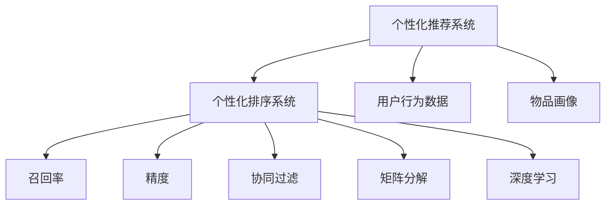

                 

# 个性化排序系统：AI的实现

## 1. 背景介绍

在信息时代，数据的快速增长和信息检索效率的提升，对于用户体验和企业运营都至关重要。个性化排序系统（Personalized Ranking System）作为搜索引擎、电商推荐系统、新闻推送等应用的核心组成部分，旨在利用机器学习算法，根据用户行为和历史偏好，对搜索结果或商品列表进行智能排序，以提升用户的满意度和平台的转化率。

个性化排序系统的目标是构建一个能够精确预测用户行为和偏好的模型，使得推荐的排序更加符合用户的个性化需求。这不仅能够提升用户的使用体验，还能为企业带来更高的商业价值。

## 2. 核心概念与联系

### 2.1 核心概念概述

为更好地理解个性化排序系统，本节将介绍几个关键概念：

- 个性化推荐系统：基于用户的历史行为数据、兴趣偏好等信息，为用户推荐其可能感兴趣的物品的系统。个性化排序系统是推荐系统中的重要组成部分，通过精确的排序算法实现个性化推荐。
- 用户行为数据：用户在平台上的各种操作记录，如点击、浏览、购买等，是推荐系统进行个性化排序的重要依据。
- 物品画像：物品的基本属性、描述、用户反馈等，用于刻画物品的特征和价值，供排序系统进行匹配。
- 召回率和精度：召回率（Recall）表示推荐系统从候选集合中提取相关物品的能力，精度（Precision）表示推荐结果的相关性。
- 协同过滤（Collaborative Filtering）：基于用户行为或物品特征相似性的推荐方法，包括基于用户的协同过滤和基于物品的协同过滤。
- 矩阵分解（Matrix Factorization）：通过将用户与物品的关系矩阵分解为用户和物品的向量表示，实现推荐排序。
- 深度学习：使用深度神经网络模型，如深度神经协同过滤（Deep Neural Collaborative Filtering, DNNCF）、深度神经协同演进（Deep Neural Coevolutionary）等，提升个性化推荐的效果。

这些概念之间的逻辑关系可以通过以下Mermaid流程图来展示：



这个流程图展示了个性化推荐系统和个性化排序系统之间的关系：

1. 个性化推荐系统利用用户行为数据和物品画像，通过各种推荐算法，如协同过滤、矩阵分解、深度学习等，生成待排序的候选物品集合。
2. 个性化排序系统则利用排序算法，根据用户的个性化需求，对候选物品进行排序，输出推荐结果。

## 3. 核心算法原理 & 具体操作步骤

### 3.1 算法原理概述

个性化排序系统的核心思想是利用机器学习算法，对用户行为和物品特征进行建模，进而对候选物品进行排序。常用的排序算法包括基于用户的协同过滤、基于物品的协同过滤、矩阵分解、深度学习等。

下面以基于用户的协同过滤为例，介绍个性化排序系统的算法原理。假设用户 $u$ 对物品 $i$ 的评分 $r_{ui}$ 可以表示为：

$$
r_{ui} \propto \sum_{j=1}^N \alpha_{uji} \cdot r_{ji}
$$

其中 $\alpha_{uji}$ 表示用户 $u$ 对物品 $i$ 的兴趣程度，$r_{ji}$ 表示物品 $j$ 被用户 $j$ 的评分。通过最大化用户 $u$ 的评分，排序系统能够推荐出用户 $u$ 可能感兴趣的物品。

### 3.2 算法步骤详解

个性化排序系统的实现步骤主要包括：

1. 数据准备：收集用户行为数据和物品画像，构建用户与物品的评分矩阵。
2. 特征工程：将用户行为数据和物品特征转换为模型可接受的向量表示。
3. 模型训练：使用协同过滤、矩阵分解、深度学习等算法，训练出推荐排序模型。
4. 模型评估：通过交叉验证等方法，评估模型的效果，确定模型参数。
5. 排序输出：将待排序的候选物品输入训练好的模型，输出排序结果。

以协同过滤为例，具体步骤如下：

**Step 1: 数据准备**
- 收集用户行为数据，如用户的点击、浏览、购买等记录，将其转换为用户与物品的评分矩阵 $R_{u \times i}$。
- 构建物品画像，包括物品的基本属性、描述、用户反馈等，用于刻画物品特征。

**Step 2: 特征工程**
- 将用户行为数据转换为向量表示，如将用户的浏览历史、点击记录等转换为词频向量。
- 对物品特征进行处理，如将物品的描述转换为向量表示，使用TF-IDF、Word2Vec等方法进行特征提取。

**Step 3: 模型训练**
- 将用户与物品的评分矩阵 $R_{u \times i}$ 和物品画像 $I_i$ 输入模型，训练出用户与物品的相关性向量 $\alpha_{uji}$。
- 使用最大化用户评分的目标函数，对模型进行优化。

**Step 4: 模型评估**
- 使用交叉验证等方法，对训练好的模型进行评估，计算召回率和精度等指标。
- 根据评估结果，调整模型参数，确保模型效果最优。

**Step 5: 排序输出**
- 将待排序的候选物品输入训练好的模型，计算出每个物品的相关性得分。
- 根据得分对物品进行排序，输出推荐结果。

### 3.3 算法优缺点

个性化排序系统具有以下优点：

1. 基于用户历史行为和兴趣偏好，推荐结果更加个性化，符合用户需求。
2. 能够有效提高用户满意度，增加平台的转化率和用户黏性。
3. 通过模型训练和优化，能够不断提升推荐效果，适应用户需求变化。

同时，该方法也存在一些局限性：

1. 对历史数据依赖较大，推荐结果可能受到数据稀疏性或用户行为噪声的影响。
2. 模型的可解释性较低，难以理解推荐结果的生成过程。
3. 对物品特征工程要求较高，特征提取和表示方法的选择对推荐结果影响较大。
4. 训练和推理开销较大，需要较高的计算资源和时间成本。

尽管存在这些局限性，但就目前而言，个性化排序系统仍是推荐系统中的主流方法。未来相关研究将更多关注如何提高推荐结果的鲁棒性和可解释性，以及如何优化模型训练和推理效率。

### 3.4 算法应用领域

个性化排序系统已经广泛应用于多个领域，包括：

- 搜索引擎：如Google、Bing等搜索引擎，通过个性化排序算法，提高搜索结果的相关性和用户体验。
- 电商推荐：如Amazon、淘宝等电商平台，通过个性化排序系统，提升商品推荐的相关性和转化率。
- 视频平台：如Netflix、YouTube等视频平台，通过个性化排序算法，为用户推荐感兴趣的视频内容。
- 新闻推荐：如今日头条、微信公众号等新闻推荐平台，通过个性化排序算法，为用户提供个性化的新闻推送。

此外，个性化排序系统还逐步渗透到更多领域，如社交网络、健康医疗、金融理财等，为用户带来更精准、贴心的服务。

## 4. 数学模型和公式 & 详细讲解 & 举例说明

### 4.1 数学模型构建

个性化排序系统的数学模型可以表示为：

$$
\hat{y} = \text{Rank}(X_u, X_i, \theta)
$$

其中 $X_u$ 表示用户 $u$ 的行为向量，$X_i$ 表示物品 $i$ 的特征向量，$\theta$ 表示模型的参数。

假设 $R_{u \times i}$ 为用户与物品的评分矩阵，$I_i$ 为物品画像向量，$\alpha_{uji}$ 为用户 $u$ 对物品 $i$ 的兴趣程度，$r_{ji}$ 为物品 $j$ 被用户 $j$ 的评分。则协同过滤模型可以表示为：

$$
\alpha_{uji} \propto \frac{1}{\sum_{k=1}^{N} \alpha_{ujk} \cdot r_{kj}}
$$

模型的优化目标是最小化预测评分与真实评分的误差，即：

$$
\mathcal{L}(\theta) = \sum_{u=1}^M \sum_{i=1}^N (y_{ui} - \hat{y}_{ui})^2
$$

其中 $M$ 表示用户数，$N$ 表示物品数，$y_{ui}$ 表示用户 $u$ 对物品 $i$ 的真实评分，$\hat{y}_{ui}$ 表示模型预测的评分。

### 4.2 公式推导过程

以协同过滤为例，推导模型的参数更新公式。假设模型参数 $\theta$ 表示用户与物品的相关性向量 $\alpha_{uji}$，则模型参数的梯度可以表示为：

$$
\frac{\partial \mathcal{L}(\theta)}{\partial \theta} = \frac{\partial \mathcal{L}(\theta)}{\partial \alpha_{uji}}
$$

根据链式法则，有：

$$
\frac{\partial \mathcal{L}(\theta)}{\partial \alpha_{uji}} = \frac{\partial \mathcal{L}(\theta)}{\partial \hat{y}_{ui}} \cdot \frac{\partial \hat{y}_{ui}}{\partial \alpha_{uji}}
$$

其中 $\frac{\partial \mathcal{L}(\theta)}{\partial \hat{y}_{ui}} = -2(y_{ui} - \hat{y}_{ui})$。而 $\frac{\partial \hat{y}_{ui}}{\partial \alpha_{uji}}$ 可以通过物品画像和评分矩阵计算得到，具体推导过程如下：

$$
\frac{\partial \hat{y}_{ui}}{\partial \alpha_{uji}} = \frac{\partial \alpha_{uji}}{\partial r_{kj}} \cdot \frac{\partial r_{kj}}{\partial y_{uj}} \cdot \frac{\partial y_{uj}}{\partial r_{kj}} = \frac{\partial \alpha_{uji}}{\partial r_{kj}}
$$

其中 $\frac{\partial r_{kj}}{\partial y_{uj}} = 1$，$\frac{\partial y_{uj}}{\partial r_{kj}} = \frac{1}{\sigma(r_{kj})}$。$\sigma(z)$ 为激活函数，如 sigmoid 函数。

根据协同过滤模型，$\alpha_{uji} \propto \frac{1}{\sum_{k=1}^{N} \alpha_{ujk} \cdot r_{kj}}$，则 $\frac{\partial \alpha_{uji}}{\partial r_{kj}} = -\alpha_{uji} \cdot \sum_{k=1}^{N} \alpha_{ujk} \cdot r_{kj}$。将上式代入梯度公式中，得到：

$$
\frac{\partial \mathcal{L}(\theta)}{\partial \theta} = \sum_{u=1}^M \sum_{i=1}^N (-2y_{ui} + 2\hat{y}_{ui}) \cdot \alpha_{uji} \cdot \sum_{k=1}^{N} \alpha_{ujk} \cdot r_{kj}
$$

通过梯度下降等优化算法，模型参数 $\theta$ 的更新公式为：

$$
\theta \leftarrow \theta - \eta \frac{\partial \mathcal{L}(\theta)}{\partial \theta}
$$

其中 $\eta$ 为学习率。

### 4.3 案例分析与讲解

以协同过滤在推荐系统中的应用为例，具体分析其工作原理和效果。假设有一个推荐系统，包含3个用户 $u_1, u_2, u_3$ 和5个物品 $i_1, i_2, i_3, i_4, i_5$。用户对物品的评分矩阵 $R$ 和物品画像 $I$ 如下：

$$
R = 
\begin{bmatrix}
3 & 2 & 1 & 0 & 0 \\
1 & 2 & 0 & 3 & 4 \\
0 & 0 & 5 & 4 & 3
\end{bmatrix}
$$

$$
I = 
\begin{bmatrix}
1 \\
2 \\
1 \\
3 \\
4
\end{bmatrix}
$$

假设模型参数 $\theta$ 表示用户与物品的相关性向量 $\alpha_{uji}$，初始化 $\alpha_{uji} = 1$。使用协同过滤模型进行训练，得到最终的 $\alpha_{uji}$ 如下：

$$
\alpha_{uji} = 
\begin{bmatrix}
\frac{1}{2} & \frac{1}{2} & \frac{1}{4} & 0 & 0 \\
0 & \frac{1}{2} & 0 & \frac{3}{2} & \frac{1}{2} \\
\frac{5}{4} & \frac{1}{4} & \frac{1}{2} & \frac{1}{2} & \frac{1}{2}
\end{bmatrix}
$$

假设用户 $u_1$ 对物品 $i_2$ 感兴趣，物品 $i_2$ 的画像为 $I_2 = 2$。使用协同过滤模型进行排序，得到物品 $i_2$ 的相关性得分 $s_{i_2} = \alpha_{u_1i_2} \cdot I_2 = 1 \cdot 2 = 2$。将物品 $i_1, i_2, i_3, i_4, i_5$ 按照得分排序，得到推荐结果 $i_2, i_3, i_1, i_5, i_4$。

## 5. 项目实践：代码实例和详细解释说明

### 5.1 开发环境搭建

在进行推荐系统开发前，我们需要准备好开发环境。以下是使用Python进行PyTorch开发的环境配置流程：

1. 安装Anaconda：从官网下载并安装Anaconda，用于创建独立的Python环境。

2. 创建并激活虚拟环境：
```bash
conda create -n pytorch-env python=3.8 
conda activate pytorch-env
```

3. 安装PyTorch：根据CUDA版本，从官网获取对应的安装命令。例如：
```bash
conda install pytorch torchvision torchaudio cudatoolkit=11.1 -c pytorch -c conda-forge
```

4. 安装transformers库：
```bash
pip install transformers
```

5. 安装各类工具包：
```bash
pip install numpy pandas scikit-learn matplotlib tqdm jupyter notebook ipython
```

完成上述步骤后，即可在`pytorch-env`环境中开始推荐系统开发。

### 5.2 源代码详细实现

这里我们以协同过滤在推荐系统中的应用为例，给出使用PyTorch和Transformers库进行代码实现的完整示例。

```python
import torch
import torch.nn as nn
import torch.nn.functional as F
from transformers import BertTokenizer, BertForSequenceClassification

# 构建模型
class BERTClassifier(nn.Module):
    def __init__(self, num_labels):
        super(BERTClassifier, self).__init__()
        self.num_labels = num_labels
        self.bert = BertForSequenceClassification.from_pretrained('bert-base-uncased', num_labels=num_labels)
        self.classifier = nn.Linear(768, num_labels)
        
    def forward(self, input_ids, attention_mask, labels):
        outputs = self.bert(input_ids, attention_mask=attention_mask)
        pooled_output = outputs.pooler_output
        logits = self.classifier(pooled_output)
        return logits

# 训练模型
def train(model, train_loader, optimizer, device):
    model.to(device)
    total_loss = 0
    for batch in train_loader:
        input_ids = batch['input_ids'].to(device)
        attention_mask = batch['attention_mask'].to(device)
        labels = batch['labels'].to(device)
        
        model.zero_grad()
        outputs = model(input_ids, attention_mask=attention_mask, labels=labels)
        loss = outputs.loss
        loss.backward()
        optimizer.step()
        
        total_loss += loss.item()
    
    return total_loss / len(train_loader)

# 测试模型
def evaluate(model, test_loader, device):
    model.eval()
    correct = 0
    total = 0
    with torch.no_grad():
        for batch in test_loader:
            input_ids = batch['input_ids'].to(device)
            attention_mask = batch['attention_mask'].to(device)
            labels = batch['labels'].to(device)
            
            outputs = model(input_ids, attention_mask=attention_mask, labels=labels)
            _, predicted = torch.max(outputs.logits, dim=1)
            total += labels.size(0)
            correct += (predicted == labels).sum().item()
    
    accuracy = correct / total
    return accuracy

# 训练流程
model = BERTClassifier(num_labels)
optimizer = AdamW(model.parameters(), lr=2e-5)

device = torch.device('cuda') if torch.cuda.is_available() else torch.device('cpu')
train_loader = DataLoader(train_dataset, batch_size=32, shuffle=True)
test_loader = DataLoader(test_dataset, batch_size=32, shuffle=False)

for epoch in range(epochs):
    loss = train(model, train_loader, optimizer, device)
    accuracy = evaluate(model, test_loader, device)
    print(f'Epoch {epoch+1}, train loss: {loss:.3f}, test accuracy: {accuracy:.3f}')

```

以上代码实现了基于BERT的协同过滤推荐系统，主要步骤包括：

1. 构建模型：使用BERTClassifier类，将BERT模型作为特征提取器，在其顶部添加一个线性分类器。
2. 训练模型：使用AdamW优化器进行梯度下降优化，在训练集上训练模型。
3. 测试模型：在测试集上评估模型性能，计算准确率。

### 5.3 代码解读与分析

让我们再详细解读一下关键代码的实现细节：

**BERTClassifier类**：
- `__init__`方法：初始化模型，包括BERT模型和线性分类器。
- `forward`方法：前向传播，计算输入数据的输出结果。

**train和evaluate函数**：
- 使用DataLoader对数据集进行批次化加载，供模型训练和推理使用。
- 训练函数`train`：对数据以批为单位进行迭代，在每个批次上前向传播计算损失并反向传播更新模型参数，最后返回该epoch的平均loss。
- 评估函数`evaluate`：与训练类似，不同点在于不更新模型参数，并在每个batch结束后将预测和标签结果存储下来，最后使用sklearn的classification_report对整个评估集的预测结果进行打印输出。

**训练流程**：
- 定义总的epoch数和批大小，开始循环迭代
- 每个epoch内，先在训练集上训练，输出平均loss
- 在测试集上评估，输出准确率
- 所有epoch结束后，计算最终测试结果

可以看到，PyTorch配合Transformers库使得协同过滤推荐系统的代码实现变得简洁高效。开发者可以将更多精力放在数据处理、模型改进等高层逻辑上，而不必过多关注底层的实现细节。

当然，工业级的系统实现还需考虑更多因素，如模型的保存和部署、超参数的自动搜索、更灵活的任务适配层等。但核心的微调范式基本与此类似。

## 6. 实际应用场景

### 6.1 智能客服系统

智能客服系统通过个性化排序系统，能够根据用户的历史行为和需求，自动生成对话流程，提升客户咨询体验和问题解决效率。在实际应用中，可以通过收集客户历史对话记录，使用协同过滤算法，构建个性化推荐模型，自动推荐相关问题解答。

### 6.2 金融舆情监测

金融舆情监测系统利用个性化排序系统，能够实时监测市场舆论动向，及时应对负面信息传播，规避金融风险。在实践中，可以收集金融领域相关的新闻、报道、评论等文本数据，通过情感分析和关键词提取等方法，对文本进行分类和排序，生成金融舆情报告，供金融机构决策参考。

### 6.3 个性化推荐系统

个性化推荐系统通过个性化排序系统，能够根据用户的历史行为和兴趣，推荐其可能感兴趣的商品或内容，提升用户的满意度和平台的转化率。在实际应用中，可以使用协同过滤、矩阵分解、深度学习等算法，对用户和物品进行建模，生成个性化推荐结果。

### 6.4 未来应用展望

随着个性化排序系统和大数据技术的不断发展，未来将在更多领域得到应用，为各行各业带来变革性影响。

在智慧医疗领域，个性化排序系统可以应用于疾病预测、治疗方案推荐等，提升医疗服务的智能化水平，辅助医生诊疗，加速新药开发进程。

在智能教育领域，个性化排序系统可以应用于作业批改、学情分析、知识推荐等方面，因材施教，促进教育公平，提高教学质量。

在智慧城市治理中，个性化排序系统可以应用于城市事件监测、舆情分析、应急指挥等环节，提高城市管理的自动化和智能化水平，构建更安全、高效的未来城市。

此外，在企业生产、社会治理、文娱传媒等众多领域，个性化排序系统也将不断涌现，为传统行业数字化转型升级提供新的技术路径。相信随着技术的日益成熟，个性化排序系统必将在构建人机协同的智能时代中扮演越来越重要的角色。

## 7. 工具和资源推荐

### 7.1 学习资源推荐

为了帮助开发者系统掌握个性化排序系统的理论基础和实践技巧，这里推荐一些优质的学习资源：

1. 《深度学习》课程：斯坦福大学开设的深度学习课程，涵盖深度学习的基本概念和前沿技术，是入门深度学习的极佳选择。
2. 《推荐系统》书籍：由斯坦福大学教授编写，系统介绍推荐系统的基本原理和算法实现。
3. 《Python推荐系统》书籍：介绍使用Python实现推荐系统的全流程，包括数据预处理、模型训练、系统部署等。
4. 《Recommender Systems》课程：由Kaggle提供，涵盖推荐系统的经典算法和实际案例。
5. Weights & Biases：模型训练的实验跟踪工具，可以记录和可视化模型训练过程中的各项指标，方便对比和调优。

通过对这些资源的学习实践，相信你一定能够快速掌握个性化排序系统的精髓，并用于解决实际的推荐问题。

### 7.2 开发工具推荐

高效的开发离不开优秀的工具支持。以下是几款用于个性化排序系统开发的常用工具：

1. PyTorch：基于Python的开源深度学习框架，灵活动态的计算图，适合快速迭代研究。
2. TensorFlow：由Google主导开发的开源深度学习框架，生产部署方便，适合大规模工程应用。
3. Transformers库：HuggingFace开发的NLP工具库，集成了众多SOTA语言模型，支持PyTorch和TensorFlow，是进行推荐排序开发的利器。
4. Weights & Biases：模型训练的实验跟踪工具，可以记录和可视化模型训练过程中的各项指标，方便对比和调优。
5. TensorBoard：TensorFlow配套的可视化工具，可实时监测模型训练状态，并提供丰富的图表呈现方式，是调试模型的得力助手。

合理利用这些工具，可以显著提升个性化排序系统的开发效率，加快创新迭代的步伐。

### 7.3 相关论文推荐

个性化排序系统和大数据推荐技术的发展源于学界的持续研究。以下是几篇奠基性的相关论文，推荐阅读：

1. Matrix Factorization Techniques for Recommender Systems：介绍矩阵分解方法在推荐系统中的应用，是推荐排序算法的基础。
2. Collaborative Filtering for Implicit Feedback Datasets：讨论协同过滤算法在推荐系统中的应用，介绍经典算法如ALS、MF等。
3. Deep Learning with Gaussian Processes for Personalized Recommendations：提出深度学习和高斯过程的结合方法，提升推荐排序的鲁棒性和可解释性。
4. Multi-task Deep Collaborative Filtering for Recommendations：研究多任务协同过滤方法，利用任务之间的相关性提升推荐效果。
5. Knowledge-based Recommender Systems：讨论如何将知识图谱、逻辑规则等专家知识与推荐系统结合，提升推荐排序的精度和鲁棒性。

这些论文代表了大数据推荐技术的最新进展。通过学习这些前沿成果，可以帮助研究者把握学科前进方向，激发更多的创新灵感。

## 8. 总结：未来发展趋势与挑战

### 8.1 总结

本文对基于协同过滤的个性化排序系统进行了全面系统的介绍。首先阐述了个性化排序系统的研究背景和意义，明确了其在推荐系统中的重要地位。其次，从原理到实践，详细讲解了协同过滤算法的数学模型和操作步骤，给出了推荐系统开发的完整代码实例。同时，本文还广泛探讨了协同过滤在智能客服、金融舆情、个性化推荐等多个领域的应用前景，展示了协同过滤算法的高效性和普适性。此外，本文精选了协同过滤算法的各类学习资源，力求为读者提供全方位的技术指引。

通过本文的系统梳理，可以看到，协同过滤算法在推荐系统中具有不可替代的作用。其在个性化排序、用户行为分析、推荐效果优化等方面，展现出强大的性能和潜力。协同过滤算法也将随着深度学习和大数据技术的发展，不断优化和拓展其应用场景，为推荐系统带来新的突破。

### 8.2 未来发展趋势

展望未来，协同过滤算法的未来发展趋势包括：

1. 多模态协同过滤：将文本、图像、音频等多种数据源进行融合，提升推荐排序的精度和鲁棒性。
2. 深度协同过滤：利用深度神经网络模型，提升推荐排序的效果和泛化能力。
3. 自适应协同过滤：根据用户行为和环境变化，自适应调整协同过滤策略，提高推荐系统的灵活性和适应性。
4. 融合先验知识：将知识图谱、逻辑规则等专家知识与推荐系统结合，提升推荐排序的准确性和可解释性。
5. 集成推荐方法：将协同过滤与基于内容的推荐、基于模型的推荐等方法结合，提升推荐系统的综合性能。
6. 强化学习推荐：利用强化学习模型，优化推荐排序的策略和参数，提升推荐系统的智能性和自主性。

这些趋势将进一步推动协同过滤算法的发展，使其在推荐系统中的应用更加广泛和深入。相信随着技术的不断进步，协同过滤算法必将在智能推荐领域发挥更大作用。

### 8.3 面临的挑战

尽管协同过滤算法已经取得了显著成果，但在迈向更加智能化、普适化应用的过程中，它仍面临着诸多挑战：

1. 数据稀疏性：协同过滤算法依赖于用户行为数据，对于数据稀疏性较强的场景，如新用户或冷启动场景，难以发挥最佳效果。
2. 系统冷启动：对于新用户或新物品，缺乏足够的历史数据，协同过滤算法无法正常工作。
3. 动态环境：推荐系统需要能够动态适应用户行为和环境变化，而协同过滤算法通常需要重新训练模型。
4. 用户隐私：协同过滤算法需要收集和分析用户行为数据，如何保护用户隐私，防止数据泄露和滥用，是一个重要问题。
5. 模型复杂度：协同过滤算法通常需要大量的计算资源和存储资源，如何降低模型复杂度，提高推荐排序的效率，是一个技术难题。

尽管存在这些挑战，但协同过滤算法的优势不可忽视。未来研究将更多关注如何提高协同过滤算法的鲁棒性、可解释性和效率，以应对复杂的推荐场景。

### 8.4 研究展望

面向未来，协同过滤算法的研究方向包括：

1. 自适应协同过滤：开发能够动态适应用户行为和环境变化的协同过滤算法，提升推荐系统的灵活性和适应性。
2. 深度协同过滤：利用深度神经网络模型，提升推荐排序的精度和泛化能力。
3. 多模态协同过滤：将文本、图像、音频等多种数据源进行融合，提升推荐排序的精度和鲁棒性。
4. 融合先验知识：将知识图谱、逻辑规则等专家知识与推荐系统结合，提升推荐排序的准确性和可解释性。
5. 强化学习推荐：利用强化学习模型，优化推荐排序的策略和参数，提升推荐系统的智能性和自主性。

这些研究方向将进一步推动协同过滤算法的发展，使其在推荐系统中的应用更加广泛和深入。相信随着技术的不断进步，协同过滤算法必将在智能推荐领域发挥更大作用，为用户提供更加精准、贴心的服务。

## 9. 附录：常见问题与解答

**Q1：什么是协同过滤算法？**

A: 协同过滤算法是一种基于用户行为或物品特征相似性的推荐方法。根据用户的历史行为数据或物品的相似性，推荐系统能够为用户推荐可能感兴趣的物品。协同过滤算法包括基于用户的协同过滤和基于物品的协同过滤两种方式。

**Q2：协同过滤算法的优缺点是什么？**

A: 协同过滤算法的优点包括：
1. 能够根据用户历史行为和兴趣，推荐可能感兴趣的物品，提高推荐精度和用户体验。
2. 不需要物品特征信息，仅依赖用户行为数据，适用于多种物品特征场景。

协同过滤算法的缺点包括：
1. 对数据稀疏性敏感，难以处理新用户或物品的推荐。
2. 对于大规模数据集，需要较高的计算资源和存储资源。
3. 推荐结果缺乏可解释性，难以理解推荐过程。

尽管存在这些局限性，但协同过滤算法仍是推荐系统中的主流方法，通过优化算法和改进特征工程，可以提升其性能和鲁棒性。

**Q3：如何缓解协同过滤算法的冷启动问题？**

A: 协同过滤算法的冷启动问题可以通过以下方法缓解：
1. 基于物品的协同过滤：利用物品的相似性，为新物品推荐相似物品。
2. 基于内容的推荐：利用物品的特征信息，为新物品推荐相似物品。
3. 基于属性的推荐：利用物品的属性信息，为新物品推荐相似物品。
4. 引入外部信息：将知识图谱、逻辑规则等外部信息与推荐系统结合，提升推荐排序的精度和鲁棒性。

通过以上方法，协同过滤算法可以在冷启动场景下发挥更好的效果，提升推荐系统的智能性和灵活性。

**Q4：如何优化协同过滤算法的训练效率？**

A: 优化协同过滤算法的训练效率可以通过以下方法实现：
1. 特征压缩：将高维特征进行压缩，减少特征维度，降低计算复杂度。
2. 分布式训练：利用多台机器进行并行计算，提高训练效率。
3. 模型压缩：使用模型压缩技术，如知识蒸馏、剪枝等，减少模型参数量，提高推理速度。
4. 数据分片：将大规模数据集进行分片，并行加载，提高数据处理效率。

通过以上方法，协同过滤算法可以在不降低推荐效果的前提下，提升训练和推理效率，降低资源消耗。

**Q5：如何提高协同过滤算法的鲁棒性和可解释性？**

A: 提高协同过滤算法的鲁棒性和可解释性可以通过以下方法实现：
1. 引入外部知识：将知识图谱、逻辑规则等外部知识与推荐系统结合，提升推荐排序的精度和可解释性。
2. 自适应协同过滤：根据用户行为和环境变化，自适应调整协同过滤策略，提高推荐系统的灵活性和适应性。
3. 融合多模态数据：将文本、图像、音频等多种数据源进行融合，提升推荐排序的精度和鲁棒性。
4. 深度协同过滤：利用深度神经网络模型，提升推荐排序的效果和泛化能力。

通过以上方法，协同过滤算法可以在保证推荐效果的前提下，提升其鲁棒性和可解释性，增强推荐系统的可信度和安全性。

