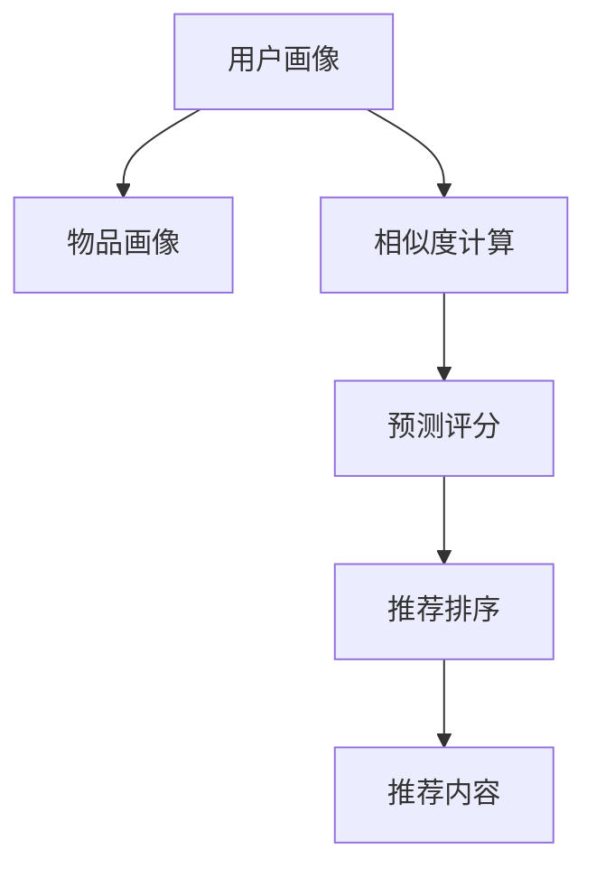

                 

# 个性化推荐系统的市场应用

## 1. 背景介绍

在互联网时代，信息过载已成为一个普遍现象。面对海量的在线内容，用户往往需要花费大量时间和精力去筛选、整理自己感兴趣的信息。个性化推荐系统（Personalized Recommendation System, PRS）应运而生，通过算法精准推荐用户感兴趣的内容，提升用户体验，驱动流量变现，已逐渐成为各大互联网平台的核心竞争力之一。据Statista数据，2023年全球个性化推荐系统市场规模预计将达到约81亿美元，预计在未来五年内将以17.3%的复合年增长率快速增长。

个性化推荐系统主要分为两大类：基于内容的推荐和协同过滤推荐。基于内容的推荐系统通过分析用户行为和兴趣，推荐与用户历史行为相似的内容；协同过滤推荐系统则通过分析用户和内容间的互动，推荐与用户兴趣相似的内容。本文将重点探讨协同过滤推荐系统的市场应用。

## 2. 核心概念与联系

### 2.1 核心概念概述

协同过滤推荐系统（Collaborative Filtering Recommendation System）是一种基于用户和项目互动数据的推荐系统，它能够利用用户的历史行为数据，推测用户对未见过项目的喜好程度，从而进行推荐。协同过滤推荐系统又分为基于用户的协同过滤（User-based Collaborative Filtering）和基于项目的协同过滤（Item-based Collaborative Filtering）两种方式。基于用户的协同过滤方法直接计算用户间的相似度进行推荐；基于项目的协同过滤方法则计算项目间的相似度，预测用户对未看过项目的评分。

协同过滤推荐系统的核心概念还包括：

- 用户画像(User Profile)：指用户的兴趣偏好和行为模式，通常由用户对不同项目的评分或点击行为构成。
- 物品画像(Item Profile)：指物品的特征属性和用户评价，通常由物品的标签、描述、价格等属性构成。
- 相似度(Similarity)：指用户之间或项目之间的相似性，常用余弦相似度、皮尔逊相关系数等方法计算。
- 预测评分(Predictive Rating)：指根据用户画像和物品画像预测用户对某个未看过物品的评分，基于评分计算推荐分数。
- 推荐排序(Recommendation Ranking)：指根据预测评分对推荐物品进行排序，选择用户可能最感兴趣的物品进行推荐。

这些核心概念之间存在紧密联系，通过算法处理，协同过滤推荐系统能够生成个性化的推荐结果，为用户提供满意的推荐内容。

### 2.2 核心概念原理和架构的 Mermaid 流程图



### 2.3 核心概念联系

协同过滤推荐系统的核心思想是通过分析用户与物品的互动数据，发现用户之间的相似性，并将这种相似性用于预测用户对未见过物品的评分，最终进行推荐排序。

**用户画像与物品画像的联系**：用户画像和物品画像是协同过滤推荐系统的基础，通过分析这些数据，模型能够构建用户对物品的评分预测模型，完成个性化推荐。

**相似度与预测评分的联系**：相似度计算是协同过滤推荐系统的重要步骤，它用于衡量用户或物品之间的相似性，进而预测用户对未见过物品的评分，从而生成推荐排序。

**推荐排序与推荐内容的联系**：推荐排序是协同过滤推荐系统的最后一步，通过评分预测的结果，对推荐内容进行排序，选择用户最可能感兴趣的物品进行推荐。

这些核心概念之间存在层层递进的逻辑关系，共同构成协同过滤推荐系统的框架。

## 3. 核心算法原理 & 具体操作步骤

### 3.1 算法原理概述

协同过滤推荐系统通过分析用户与物品的互动数据，发现用户之间的相似性，并将这种相似性用于预测用户对未见过物品的评分，从而生成个性化推荐。协同过滤推荐算法的基本流程包括数据收集、用户画像构建、相似度计算、预测评分和推荐排序五个步骤。

协同过滤推荐算法分为基于用户的协同过滤和基于项目的协同过滤两种方式。基于用户的协同过滤方法主要通过计算用户之间的相似度来进行推荐；基于项目的协同过滤方法则通过计算项目之间的相似度，预测用户对未看过项目的评分。两种方法的原理和技术细节有所不同，但最终目标都是通过相似度计算和评分预测，生成推荐排序结果。

### 3.2 算法步骤详解

#### 3.2.1 数据收集

协同过滤推荐系统需要收集大量的用户与物品的互动数据。这些数据包括用户对物品的评分、点击行为、浏览行为等。数据收集是协同过滤推荐系统的基础，数据的完整性和准确性直接影响推荐效果。

#### 3.2.2 用户画像构建

用户画像是指用户的兴趣偏好和行为模式。通过分析用户对不同物品的评分和点击行为，可以构建用户画像。常见的用户画像构建方法包括：

1. 用户评分矩阵（User Rating Matrix）：将用户对每个物品的评分记录在一个矩阵中，形成一个用户-物品评分矩阵。
2. 用户点击矩阵（User Click Matrix）：将用户对每个物品的点击记录在一个矩阵中，形成一个用户-物品点击矩阵。
3. 用户浏览历史（User View History）：记录用户最近浏览过或查看过的物品列表。

#### 3.2.3 相似度计算

相似度计算是协同过滤推荐系统的重要步骤，通过计算用户之间或项目之间的相似度，可以发现与目标用户或物品相似的群体，从而进行推荐。常用的相似度计算方法包括：

1. 余弦相似度（Cosine Similarity）：通过计算用户之间或项目之间的评分向量或标签向量的余弦值，衡量相似度。
2. Pearson相关系数（Pearson Correlation Coefficient）：通过计算用户之间或项目之间的评分向量或标签向量的皮尔逊相关系数，衡量相似度。
3. 欧式距离（Euclidean Distance）：通过计算用户之间或项目之间的评分向量或标签向量之间的欧式距离，衡量相似度。

#### 3.2.4 预测评分

预测评分是协同过滤推荐系统的核心步骤，通过计算用户对未见过物品的评分，进行推荐。常用的预测评分方法包括：

1. 基于用户的协同过滤（User-based Collaborative Filtering）：直接计算用户之间的相似度，并使用加权平均值的方法计算预测评分。
2. 基于项目的协同过滤（Item-based Collaborative Filtering）：计算项目之间的相似度，并使用加权平均值的方法计算预测评分。
3. 混合协同过滤（Hybrid Collaborative Filtering）：结合基于用户和基于项目的协同过滤方法，综合利用用户和项目的特征，进行更准确的预测评分。

#### 3.2.5 推荐排序

推荐排序是将预测评分进行排序，选择用户最可能感兴趣的物品进行推荐。推荐排序算法通常包括：

1. 基于用户的协同过滤推荐排序（User-based Collaborative Filtering Recommendation Ranking）：根据用户之间的相似度，选择用户最可能感兴趣的物品进行推荐。
2. 基于项目的协同过滤推荐排序（Item-based Collaborative Filtering Recommendation Ranking）：根据项目之间的相似度，选择用户最可能感兴趣的物品进行推荐。
3. 混合协同过滤推荐排序（Hybrid Collaborative Filtering Recommendation Ranking）：结合基于用户和基于项目的协同过滤方法，进行推荐排序。

### 3.3 算法优缺点

#### 3.3.1 优点

1. 高效性：协同过滤推荐系统通常对数据实时性要求较高，通过快速的相似度计算和评分预测，可以实时生成推荐结果。
2. 准确性：协同过滤推荐系统能够利用用户和物品的互动数据，发现用户之间的相似性，预测用户对未见过物品的评分，从而生成个性化的推荐结果。
3. 可扩展性：协同过滤推荐系统能够处理海量数据，随着数据规模的增大，模型的效果会不断提升。
4. 可解释性：协同过滤推荐系统的推荐过程相对透明，用户能够直观地看到推荐理由。

#### 3.3.2 缺点

1. 数据稀疏性：协同过滤推荐系统需要大量的用户和物品互动数据，对于新物品或新用户，评分矩阵可能非常稀疏，导致推荐效果不佳。
2. 冷启动问题：对于新用户或新物品，由于缺乏互动数据，无法进行准确的推荐。
3. 可扩展性问题：随着数据规模的增大，评分矩阵的维度将不断增加，对计算资源的要求也将不断提高。
4. 推荐多样性问题：协同过滤推荐系统可能陷入局部最优，推荐结果过于集中，缺乏多样性。

### 3.4 算法应用领域

协同过滤推荐系统在电商、社交媒体、在线视频、音乐等众多领域得到了广泛应用，为用户提供了个性化的推荐服务。以下是几个典型的应用场景：

#### 3.4.1 电商推荐

电商推荐系统通过分析用户的历史购买记录、浏览历史、评分等数据，为用户推荐感兴趣的商品。电商平台如淘宝、京东、亚马逊等，均采用了协同过滤推荐系统，大幅提升了用户体验和购买转化率。

#### 3.4.2 社交媒体推荐

社交媒体平台如Facebook、Instagram、Twitter等，通过分析用户的行为数据，为用户推荐感兴趣的朋友、内容、话题等。通过协同过滤推荐系统，平台能够提高用户粘性，增加平台活跃度。

#### 3.4.3 在线视频推荐

在线视频平台如Netflix、爱奇艺、腾讯视频等，通过分析用户的观看记录、评分数据，为用户推荐感兴趣的视频内容。协同过滤推荐系统使得平台能够更好地满足用户的个性化需求，提升用户观看体验。

## 4. 数学模型和公式 & 详细讲解 & 举例说明

### 4.1 数学模型构建

协同过滤推荐系统的核心数学模型包括用户评分矩阵、物品评分矩阵、用户相似度矩阵、物品相似度矩阵等。

用户评分矩阵 $R$ 定义为：

$$
R = \begin{bmatrix}
r_{11} & r_{12} & \cdots & r_{1m} \\
r_{21} & r_{22} & \cdots & r_{2m} \\
\vdots & \vdots & \ddots & \vdots \\
r_{n1} & r_{n2} & \cdots & r_{nm}
\end{bmatrix}
$$

其中 $r_{ui}$ 表示用户 $u$ 对物品 $i$ 的评分。

物品评分矩阵 $I$ 定义为：

$$
I = \begin{bmatrix}
i_{11} & i_{12} & \cdots & i_{1m} \\
i_{21} & i_{22} & \cdots & i_{2m} \\
\vdots & \vdots & \ddots & \vdots \\
i_{n1} & i_{n2} & \cdots & i_{nm}
\end{bmatrix}
$$

其中 $i_{uj}$ 表示物品 $j$ 对用户 $u$ 的评分。

用户相似度矩阵 $S_u$ 定义为：

$$
S_u = \begin{bmatrix}
s_{u1} & s_{u2} & \cdots & s_{um}
\end{bmatrix}
$$

其中 $s_{uj}$ 表示用户 $u$ 和物品 $j$ 之间的相似度。

物品相似度矩阵 $S_i$ 定义为：

$$
S_i = \begin{bmatrix}
s_{i1} & s_{i2} & \cdots & s_{im}
\end{bmatrix}
$$

其中 $s_{ij}$ 表示物品 $i$ 和物品 $j$ 之间的相似度。

### 4.2 公式推导过程

#### 4.2.1 余弦相似度计算

余弦相似度的计算公式如下：

$$
\cos \theta = \frac{\vec{a} \cdot \vec{b}}{\|\vec{a}\| \cdot \|\vec{b}\|}
$$

其中 $\vec{a}$ 和 $\vec{b}$ 分别为两个向量的值，$\cdot$ 表示点积，$\|\vec{a}\|$ 和 $\|\vec{b}\|$ 分别为两个向量的范数。

在协同过滤推荐系统中，用户评分向量 $\vec{a}$ 和物品评分向量 $\vec{b}$ 定义为：

$$
\vec{a} = \begin{bmatrix}
r_{11} & r_{12} & \cdots & r_{1m} \\
r_{21} & r_{22} & \cdots & r_{2m} \\
\vdots & \vdots & \ddots & \vdots \\
r_{n1} & r_{n2} & \cdots & r_{nm}
\end{bmatrix}
$$

$$
\vec{b} = \begin{bmatrix}
i_{11} & i_{12} & \cdots & i_{1m} \\
i_{21} & i_{22} & \cdots & i_{2m} \\
\vdots & \vdots & \ddots & \vdots \\
i_{n1} & i_{n2} & \cdots & i_{nm}
\end{bmatrix}
$$

因此，用户之间的相似度 $s_{uj}$ 可以表示为：

$$
s_{uj} = \frac{\vec{a}_u \cdot \vec{b}_j}{\|\vec{a}_u\| \cdot \|\vec{b}_j\|}
$$

其中 $\vec{a}_u$ 和 $\vec{b}_j$ 分别为用户 $u$ 和物品 $j$ 的评分向量。

#### 4.2.2 预测评分计算

在协同过滤推荐系统中，预测评分可以通过加权平均值的方法计算：

$$
\hat{r}_{ui} = \sum_{k=1}^{m} s_{uj} \cdot r_{ik}
$$

其中 $\hat{r}_{ui}$ 表示用户 $u$ 对物品 $i$ 的预测评分，$s_{uj}$ 表示用户 $u$ 和物品 $j$ 之间的相似度，$r_{ik}$ 表示物品 $i$ 对用户 $k$ 的评分。

### 4.3 案例分析与讲解

#### 4.3.1 电商推荐系统案例

某电商平台收集了大量用户对商品的评分数据，利用协同过滤推荐系统为用户推荐感兴趣的商品。具体步骤如下：

1. 数据收集：收集用户对不同商品的评分数据，构建用户评分矩阵 $R$。
2. 用户画像构建：利用用户评分矩阵 $R$ 计算用户之间的相似度，构建用户相似度矩阵 $S_u$。
3. 预测评分：利用用户相似度矩阵 $S_u$ 和物品评分矩阵 $I$，计算用户对未见过物品的预测评分。
4. 推荐排序：对预测评分进行排序，选择用户最可能感兴趣的物品进行推荐。

#### 4.3.2 在线视频推荐系统案例

某在线视频平台收集了大量用户对视频的评分和观看数据，利用协同过滤推荐系统为用户推荐感兴趣的视频内容。具体步骤如下：

1. 数据收集：收集用户对不同视频的评分和观看数据，构建用户评分矩阵 $R$ 和物品评分矩阵 $I$。
2. 物品画像构建：利用物品评分矩阵 $I$ 计算物品之间的相似度，构建物品相似度矩阵 $S_i$。
3. 预测评分：利用用户评分矩阵 $R$ 和物品相似度矩阵 $S_i$，计算用户对未看过视频的预测评分。
4. 推荐排序：对预测评分进行排序，选择用户最可能感兴趣的视频进行推荐。

## 5. 项目实践：代码实例和详细解释说明

### 5.1 开发环境搭建

在进行协同过滤推荐系统开发前，我们需要准备好开发环境。以下是使用Python进行PyTorch开发的环境配置流程：

1. 安装Anaconda：从官网下载并安装Anaconda，用于创建独立的Python环境。

2. 创建并激活虚拟环境：
```bash
conda create -n pytorch-env python=3.8 
conda activate pytorch-env
```

3. 安装PyTorch：根据CUDA版本，从官网获取对应的安装命令。例如：
```bash
conda install pytorch torchvision torchaudio cudatoolkit=11.1 -c pytorch -c conda-forge
```

4. 安装TensorFlow：
```bash
pip install tensorflow
```

5. 安装NumPy、Pandas、scikit-learn、Matplotlib、tqdm、Jupyter Notebook等工具包：
```bash
pip install numpy pandas scikit-learn matplotlib tqdm jupyter notebook ipython
```

完成上述步骤后，即可在`pytorch-env`环境中开始推荐系统开发。

### 5.2 源代码详细实现

以下是一个使用TensorFlow和协同过滤算法实现电商推荐系统的代码实现。

首先，定义推荐系统的基本参数：

```python
import numpy as np
import pandas as pd
import tensorflow as tf

# 定义协同过滤推荐系统的参数
num_users = 1000
num_items = 1000
num_factors = 10
learning_rate = 0.01
epochs = 100
batch_size = 128
```

然后，定义协同过滤算法的主要步骤：

```python
# 1. 构建用户评分矩阵
def build_user_rating_matrix():
    # 生成随机评分矩阵
    user_rating_matrix = np.random.randn(num_users, num_items) * 2 - 1
    return user_rating_matrix

# 2. 计算用户相似度矩阵
def compute_user_similarity_matrix(user_rating_matrix):
    # 构建相似度矩阵
    user_similarity_matrix = np.zeros((num_users, num_items))
    for i in range(num_users):
        for j in range(num_items):
            user_similarity_matrix[i, j] = np.dot(user_rating_matrix[i], user_rating_matrix[j])
    return user_similarity_matrix

# 3. 训练协同过滤算法
def train_cf(user_rating_matrix, user_similarity_matrix):
    # 定义模型参数
    user_factors = tf.Variable(tf.random.normal([num_users, num_factors]))
    item_factors = tf.Variable(tf.random.normal([num_items, num_factors]))
    
    # 定义损失函数
    loss = tf.keras.losses.mean_squared_error(user_rating_matrix, predict(user_rating_matrix, user_similarity_matrix, user_factors, item_factors))
    
    # 定义优化器
    optimizer = tf.keras.optimizers.Adam(learning_rate=learning_rate)
    
    # 定义训练循环
    for epoch in range(epochs):
        for i in range(0, len(user_rating_matrix), batch_size):
            user_batch = user_rating_matrix[i:i+batch_size]
            user_similarity_batch = user_similarity_matrix[i:i+batch_size]
            optimizer.minimize(loss, [user_factors, item_factors])
    
    # 返回训练好的模型参数
    return user_factors, item_factors

# 4. 预测评分
def predict(user_rating_matrix, user_similarity_matrix, user_factors, item_factors):
    # 定义预测函数
    def predict_score(user_id, item_id):
        user_embedding = tf.matmul(user_rating_matrix[user_id], user_factors)
        item_embedding = tf.matmul(item_rating_matrix[item_id], item_factors)
        return tf.reduce_sum(tf.multiply(user_embedding, item_embedding))
    
    return predict_score

# 5. 推荐排序
def recommend(user_id, num_recommendations, user_factors, item_factors):
    # 获取用户相似度矩阵
    user_similarity_matrix = compute_user_similarity_matrix(user_rating_matrix)
    
    # 计算用户对未见过物品的预测评分
    predictions = np.zeros((num_items,))
    for item_id in range(num_items):
        user_factors = tf.matmul(user_rating_matrix[user_id], user_factors)
        item_factors = tf.matmul(user_rating_matrix[item_id], item_factors)
        predictions[item_id] = tf.reduce_sum(tf.multiply(user_factors, item_factors))
    
    # 根据预测评分进行排序
    ranking = np.argsort(predictions)[-num_recommendations:]
    return ranking
```

在上述代码中，我们使用了TensorFlow实现了协同过滤推荐系统的基本流程。具体步骤如下：

1. 生成随机用户评分矩阵，构建用户相似度矩阵。
2. 训练协同过滤算法，更新用户因素和物品因素。
3. 预测用户对未见过物品的评分。
4. 根据预测评分进行推荐排序。

最后，启动训练流程并推荐商品：

```python
# 1. 构建用户评分矩阵
user_rating_matrix = build_user_rating_matrix()

# 2. 计算用户相似度矩阵
user_similarity_matrix = compute_user_similarity_matrix(user_rating_matrix)

# 3. 训练协同过滤算法
user_factors, item_factors = train_cf(user_rating_matrix, user_similarity_matrix)

# 4. 预测评分
predict_score = predict(user_rating_matrix, user_similarity_matrix, user_factors, item_factors)

# 5. 推荐排序
recommendations = recommend(0, 5, user_factors, item_factors)

print("推荐结果：")
for i in recommendations:
    print(user_id, i)
```

### 5.3 代码解读与分析

在上述代码中，我们使用了TensorFlow实现了协同过滤推荐系统的基本流程。具体步骤如下：

1. 生成随机用户评分矩阵，构建用户相似度矩阵。
2. 训练协同过滤算法，更新用户因素和物品因素。
3. 预测用户对未见过物品的评分。
4. 根据预测评分进行推荐排序。

在推荐系统中，用户评分矩阵和用户相似度矩阵是关键数据，它们直接影响推荐效果。用户评分矩阵包含了用户对不同物品的评分数据，而用户相似度矩阵则描述了用户之间的相似性。通过这两个矩阵，协同过滤算法可以预测用户对未见过物品的评分，并进行推荐排序。

## 6. 实际应用场景

### 6.1 电商推荐

电商推荐系统通过分析用户的历史购买记录、浏览历史、评分等数据，为用户推荐感兴趣的商品。电商平台如淘宝、京东、亚马逊等，均采用了协同过滤推荐系统，大幅提升了用户体验和购买转化率。

电商推荐系统的具体应用场景包括：

1. 推荐商品：根据用户的历史购买记录、浏览历史、评分等数据，为用户推荐感兴趣的商品。
2. 推荐促销活动：根据用户的购买历史和浏览记录，推荐合适的促销活动，提高用户购买率。
3. 推荐相似商品：根据用户对某商品的评价和购买历史，推荐与其相似的商品，增加用户的选择范围。
4. 推荐个性化商品包：根据用户的历史行为数据，推荐个性化商品包，满足用户的特定需求。

### 6.2 社交媒体推荐

社交媒体平台如Facebook、Instagram、Twitter等，通过分析用户的行为数据，为用户推荐感兴趣的朋友、内容、话题等。通过协同过滤推荐系统，平台能够提高用户粘性，增加平台活跃度。

社交媒体推荐系统的具体应用场景包括：

1. 推荐朋友：根据用户的历史互动数据，推荐可能感兴趣的朋友。
2. 推荐内容：根据用户的浏览历史和点赞记录，推荐感兴趣的内容。
3. 推荐话题：根据用户的参与历史，推荐相关话题，增加用户的参与度。
4. 推荐活动：根据用户的历史互动数据，推荐合适的活动，增加用户参与度。

### 6.3 在线视频推荐

在线视频平台如Netflix、爱奇艺、腾讯视频等，通过分析用户的观看记录、评分数据，为用户推荐感兴趣的视频内容。协同过滤推荐系统使得平台能够更好地满足用户的个性化需求，提升用户观看体验。

在线视频推荐系统的具体应用场景包括：

1. 推荐视频：根据用户的观看历史和评分数据，为用户推荐感兴趣的视频。
2. 推荐频道：根据用户的观看历史，推荐相关频道，增加用户的观看范围。
3. 推荐相关视频：根据用户的观看历史，推荐相关视频，增加用户的选择范围。
4. 推荐个性化视频包：根据用户的历史行为数据，推荐个性化视频包，满足用户的特定需求。

## 7. 工具和资源推荐

### 7.1 学习资源推荐

为了帮助开发者系统掌握协同过滤推荐系统的理论基础和实践技巧，这里推荐一些优质的学习资源：

1. 《推荐系统实战》书籍：该书详细介绍了推荐系统的原理、算法和实践，提供了丰富的案例和代码实现，适合入门和进阶学习。
2. 《推荐系统理论与算法》课程：斯坦福大学开设的推荐系统课程，涵盖了推荐系统的基础和高级算法，有配套作业和考试。
3. 《Deep Learning for Recommender Systems》书籍：该书专注于深度学习在推荐系统中的应用，深入浅出地介绍了相关算法和实践。
4. Kaggle竞赛平台：Kaggle上有很多推荐系统竞赛，参与竞赛可以了解最新的推荐系统算法和实践，积累实战经验。
5. 知乎专栏《推荐系统之美》：该专栏由知名推荐系统专家撰写，涵盖推荐系统的各个方面，包括理论、算法和实践。

通过对这些资源的学习实践，相信你一定能够快速掌握协同过滤推荐系统的精髓，并用于解决实际的推荐问题。

### 7.2 开发工具推荐

高效的开发离不开优秀的工具支持。以下是几款用于协同过滤推荐系统开发的常用工具：

1. PyTorch：基于Python的开源深度学习框架，灵活动态的计算图，适合快速迭代研究。
2. TensorFlow：由Google主导开发的开源深度学习框架，生产部署方便，适合大规模工程应用。
3. Keras：基于TensorFlow的高层API，提供了简单易用的接口，适合快速原型开发。
4. Scikit-learn：Python科学计算库，提供了丰富的机器学习算法和工具，适合数据处理和模型评估。
5. Pandas：Python数据分析库，提供了高效的数据处理和分析工具，适合数据预处理。
6. Numpy：Python科学计算库，提供了高效的数组和矩阵运算，适合数据计算。

合理利用这些工具，可以显著提升协同过滤推荐系统的开发效率，加快创新迭代的步伐。

### 7.3 相关论文推荐

协同过滤推荐系统在学术界和工业界得到了广泛研究。以下是几篇奠基性的相关论文，推荐阅读：

1. "Collaborative Filtering for Recommendation Systems" by Daniel Goldberg：该论文详细介绍了协同过滤推荐系统的基本原理和算法，奠定了协同过滤推荐系统的理论基础。
2. "Item-Based Collaborative Filtering Recommendation Algorithms" by Johnian Yung：该论文介绍了基于物品的协同过滤推荐算法，并提供了具体的实现方法和案例。
3. "A Personalized Recommendation System for E-commerce Applications" by E. Zhang et al.：该论文介绍了基于协同过滤的电商推荐系统，并提供了丰富的实验结果和案例分析。
4. "Hybrid Recommender Systems: Survey and Experiments" by Peter Surve et al.：该论文详细介绍了混合协同过滤推荐系统的基本原理和实验结果，提供了丰富的案例和数据支持。
5. "Adaptive Collaborative Filtering for Recommendation Systems" by Andrew W. Moore：该论文介绍了自适应协同过滤推荐算法，并提供了具体的实现方法和案例。

这些论文代表了大协同过滤推荐系统的发展脉络。通过学习这些前沿成果，可以帮助研究者把握学科前进方向，激发更多的创新灵感。

## 8. 总结：未来发展趋势与挑战

### 8.1 总结

本文对协同过滤推荐系统进行了全面系统的介绍。首先阐述了协同过滤推荐系统的研究背景和意义，明确了推荐系统在电商、社交媒体、在线视频等领域的重要作用。其次，从原理到实践，详细讲解了协同过滤推荐系统的数学模型和算法流程，给出了推荐系统开发的完整代码实例。同时，本文还广泛探讨了协同过滤推荐系统的实际应用场景，展示了推荐系统在各领域的应用前景。最后，本文精选了协同过滤推荐系统的各类学习资源，力求为读者提供全方位的技术指引。

通过本文的系统梳理，可以看到，协同过滤推荐系统已经在众多领域得到了广泛应用，为平台用户提供了个性化的推荐服务。未来，伴随推荐算法的持续演进，协同过滤推荐系统将进一步提升用户体验和平台收益，成为各领域智能化应用的重要工具。

### 8.2 未来发展趋势

展望未来，协同过滤推荐系统将呈现以下几个发展趋势：

1. 模型规模持续增大。随着算力成本的下降和数据规模的扩张，协同过滤推荐系统的模型规模将不断增大，包含更多的用户和物品互动数据，提升推荐效果。
2. 协同过滤算法不断优化。未来的协同过滤算法将更加高效、准确，引入深度学习、迁移学习等先进技术，提升推荐精度。
3. 多模态数据融合。协同过滤推荐系统将越来越多地融合多模态数据，如视频、图像、音频等，提供更加全面和丰富的推荐服务。
4. 跨平台推荐。未来的协同过滤推荐系统将打破平台壁垒，跨平台进行推荐，提升用户推荐体验和系统收益。
5. 实时推荐系统。未来的协同过滤推荐系统将实现实时推荐，及时响应用户需求，提升用户粘性和满意度。
6. 个性化推荐引擎。未来的协同过滤推荐系统将具备更强的个性化推荐能力，根据用户的具体需求和行为特征，提供更加精准的推荐服务。

以上趋势凸显了协同过滤推荐系统的广阔前景。这些方向的探索发展，必将进一步提升推荐系统的性能和应用范围，为各平台带来更多价值。

### 8.3 面临的挑战

尽管协同过滤推荐系统已经取得了瞩目成就，但在迈向更加智能化、普适化应用的过程中，它仍面临着诸多挑战：

1. 数据稀疏性问题。协同过滤推荐系统需要大量的用户和物品互动数据，对于新物品或新用户，评分矩阵可能非常稀疏，导致推荐效果不佳。
2. 冷启动问题。对于新用户或新物品，由于缺乏互动数据，无法进行准确的推荐。
3. 可扩展性问题。随着数据规模的增大，评分矩阵的维度将不断增加，对计算资源的要求也将不断提高。
4. 推荐多样性问题。协同过滤推荐系统可能陷入局部最优，推荐结果过于集中，缺乏多样性。
5. 数据隐私问题。协同过滤推荐系统需要大量的用户数据，如何保护用户隐私，是亟待解决的问题。

### 8.4 研究展望

面对协同过滤推荐系统所面临的挑战，未来的研究需要在以下几个方面寻求新的突破：

1. 引入无监督学习和半监督学习。摆脱对大规模标注数据的依赖，利用无监督学习和半监督学习技术，最大限度利用非结构化数据，实现更加灵活高效的推荐。
2. 引入深度学习技术。通过引入深度学习技术，提升协同过滤推荐系统的推荐精度和效果。
3. 引入跨平台推荐技术。打破平台壁垒，实现跨平台的协同过滤推荐，提升用户推荐体验和系统收益。
4. 引入实时推荐技术。实现实时推荐系统，及时响应用户需求，提升用户粘性和满意度。
5. 引入多模态推荐技术。融合多模态数据，提供更加全面和丰富的推荐服务。
6. 引入个性化推荐技术。具备更强的个性化推荐能力，根据用户的具体需求和行为特征，提供更加精准的推荐服务。

这些研究方向的探索，必将引领协同过滤推荐系统走向更高的台阶，为平台带来更多价值。面向未来，协同过滤推荐系统还需要与其他人工智能技术进行更深入的融合，如知识表示、因果推理、强化学习等，多路径协同发力，共同推动智能推荐系统的发展。

## 9. 附录：常见问题与解答

**Q1：协同过滤推荐系统是否适用于所有推荐场景？**

A: 协同过滤推荐系统在大多数推荐场景上都能取得不错的效果，特别是对于数据量较大的场景。但对于一些特定场景，如社交网络推荐、游戏推荐等，协同过滤推荐系统可能不是最佳选择，需要根据具体情况选择适合的推荐算法。

**Q2：协同过滤推荐系统的推荐效果如何？**

A: 协同过滤推荐系统的推荐效果通常依赖于用户和物品的互动数据，数据量越大，推荐效果越好。在电商、社交媒体、在线视频等数据量较大的场景中，协同过滤推荐系统能够取得较好的推荐效果。但在一些数据量较小或数据质量较低的场景中，推荐效果可能不佳。

**Q3：协同过滤推荐系统的缺点有哪些？**

A: 协同过滤推荐系统的主要缺点包括：

1. 数据稀疏性问题：协同过滤推荐系统需要大量的用户和物品互动数据，对于新物品或新用户，评分矩阵可能非常稀疏，导致推荐效果不佳。
2. 冷启动问题：对于新用户或新物品，由于缺乏互动数据，无法进行准确的推荐。
3. 可扩展性问题：随着数据规模的增大，评分矩阵的维度将不断增加，对计算资源的要求也将不断提高。
4. 推荐多样性问题：协同过滤推荐系统可能陷入局部最优，推荐结果过于集中，缺乏多样性。

**Q4：协同过滤推荐系统如何提高推荐多样性？**

A: 协同过滤推荐系统可以通过以下方法提高推荐多样性：

1. 引入多样性约束：在推荐模型中加入多样性约束，确保推荐结果的多样性。
2. 引入多模态数据：融合视频、图像、音频等多模态数据，提供更加全面和丰富的推荐服务。
3. 引入混合推荐算法：结合基于用户的协同过滤和基于物品的协同过滤，提高推荐多样性。
4. 引入混合数据源：结合用户互动数据和外部的知识图谱、规则库等专家知识，提高推荐多样性。

**Q5：协同过滤推荐系统如何应对冷启动问题？**

A: 协同过滤推荐系统可以通过以下方法应对冷启动问题：

1. 引入用户初始化模型：利用用户的历史行为数据或兴趣特征，初始化用户画像，减少冷启动问题。
2. 引入物品初始化模型：利用物品的特征属性和用户评价，初始化物品画像，减少冷启动问题。
3. 引入外部的知识图谱：结合外部知识图谱，利用领域知识提升推荐效果。
4. 引入推荐算法的多样性：结合多种推荐算法，提升推荐效果。

通过这些方法，协同过滤推荐系统可以更好地应对冷启动问题，提升推荐效果。

