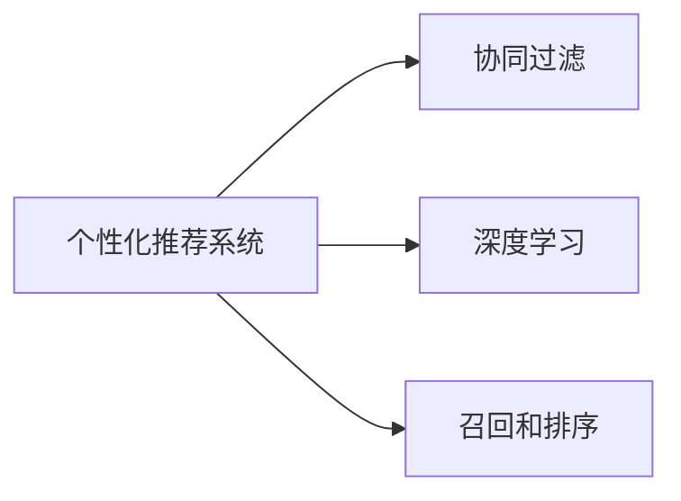

                 

## 1. 背景介绍

随着信息技术的迅猛发展，个性化推荐系统（Personalized Recommendation System, PRS）在电商、视频、社交、新闻等领域广泛应用。如今，用户需求日益多样化和个性化，企业需要通过精准的个性化推荐服务来提升用户体验和运营效率。同时，推荐系统也面临着新的挑战，如数据量激增、用户行为多样、冷启动问题等。本文将从个性化推荐系统的发展历程、现有技术和未来趋势三个方面进行探讨，旨在阐述其发展方向和面临的挑战。

## 2. 核心概念与联系

### 2.1 核心概念概述

- **个性化推荐系统**：根据用户历史行为和实时交互数据，为用户推荐感兴趣的内容，提升用户体验和平台粘性。
- **协同过滤**：利用用户-物品评分矩阵，发现用户之间、物品之间的关联，进行推荐。
- **深度学习**：利用神经网络模型学习用户和物品的深层次特征表示，提升推荐精度。
- **召回和排序**：推荐系统包含两个部分：召回和排序。召回决定哪些物品可能被用户感兴趣，排序决定如何从召回结果中挑选最佳物品进行推荐。

### 2.2 核心概念原理和架构的 Mermaid 流程图



协同过滤和深度学习是推荐系统的两个重要组成部分，协同过滤通过用户和物品的关联性进行推荐，而深度学习则通过学习物品和用户的深层次特征表示，提升推荐准确度。召回和排序是推荐系统的核心功能，召回决定哪些物品可能被用户感兴趣，排序决定如何从召回结果中挑选最佳物品进行推荐。

## 3. 核心算法原理 & 具体操作步骤

### 3.1 算法原理概述

个性化推荐系统的工作原理可以概括为“了解用户，选择物品，排序推荐”三个步骤。了解用户是通过用户历史行为数据（如浏览、购买、评分等），选择物品是通过相似度计算找到与用户兴趣相关的物品，排序推荐是通过机器学习模型计算物品对用户的潜在价值，排序后推荐给用户。

### 3.2 算法步骤详解

#### 3.2.1 用户建模
- **特征提取**：通过用户行为数据提取特征，如浏览记录、购买记录、评分记录等。
- **向量表示**：将用户特征通过向量化表示，形成用户向量。
- **相似度计算**：通过相似度计算方法（如余弦相似度、皮尔逊相关系数等），找到与目标用户最相似的K个用户。

#### 3.2.2 物品建模
- **特征提取**：通过物品属性数据提取特征，如物品描述、类别、品牌等。
- **向量表示**：将物品特征通过向量化表示，形成物品向量。
- **相似度计算**：通过相似度计算方法，找到与目标物品最相似的物品。

#### 3.2.3 推荐计算
- **召回**：通过相似度计算，从所有物品中筛选出与用户兴趣相关的高潜力物品，形成候选物品集。
- **排序**：通过机器学习模型（如线性回归、逻辑回归、深度学习等），对候选物品进行评分预测，排序推荐。

#### 3.2.4 反馈循环
- **在线学习**：根据用户反馈（如点击、购买、评分等），更新模型参数，提升推荐效果。
- **模型更新**：定期对模型进行重新训练和优化，保持推荐效果。

### 3.3 算法优缺点

#### 3.3.1 优点
- **广泛适用**：适用于电商、视频、社交、新闻等多个领域。
- **高准确度**：通过深度学习模型，可以获得更准确的推荐结果。
- **高效性**：推荐结果实时计算，用户体验较好。

#### 3.3.2 缺点
- **数据需求高**：需要大量的用户行为数据和物品属性数据。
- **冷启动问题**：新用户和新物品难以进行推荐。
- **模型复杂**：深度学习模型结构复杂，训练和推理消耗大量资源。

### 3.4 算法应用领域

个性化推荐系统在电商、视频、社交、新闻等多个领域均有广泛应用。以电商为例，推荐系统可以根据用户的浏览、购买、评价数据，推荐用户可能感兴趣的商品，提升用户粘性和购买转化率。在视频领域，推荐系统可以根据用户观看历史和评分数据，推荐用户可能感兴趣的视频，提升用户观看时长和平台流量。

## 4. 数学模型和公式 & 详细讲解 & 举例说明

### 4.1 数学模型构建

个性化推荐系统可以分为两个部分：用户建模和物品建模。用户建模的数学模型为：

$$
\vec{u} = f(\{\vec{u}_i\})
$$

其中 $\vec{u}$ 为用户的向量表示，$\{\vec{u}_i\}$ 为用户的N维行为特征。

物品建模的数学模型为：

$$
\vec{v} = g(\{\vec{v}_i\})
$$

其中 $\vec{v}$ 为物品的向量表示，$\{\vec{v}_i\}$ 为物品的N维属性特征。

### 4.2 公式推导过程

#### 4.2.1 用户建模

用户建模的向量表示方法有：

1. **MF（矩阵分解）**：
$$
\vec{u} = \vec{p} \cdot \vec{q}
$$

其中 $\vec{p}$ 为用户向量，$\vec{q}$ 为物品向量。

2. **SVD（奇异值分解）**：
$$
U \Sigma V^T = \hat{P} \hat{Q}
$$

其中 $U$ 为用户矩阵，$\Sigma$ 为奇异值矩阵，$V^T$ 为物品矩阵，$\hat{P}$ 为用户矩阵的奇异值分解矩阵，$\hat{Q}$ 为物品矩阵的奇异值分解矩阵。

3. **PCA（主成分分析）**：
$$
\vec{u} = \vec{p} \cdot \vec{q}
$$

其中 $\vec{p}$ 为用户向量的主成分，$\vec{q}$ 为物品向量的主成分。

#### 4.2.2 物品建模

物品建模的向量表示方法有：

1. **MF（矩阵分解）**：
$$
\vec{v} = \vec{p} \cdot \vec{q}
$$

其中 $\vec{p}$ 为物品向量，$\vec{q}$ 为用户向量。

2. **SVD（奇异值分解）**：
$$
U \Sigma V^T = \hat{P} \hat{Q}
$$

其中 $U$ 为物品矩阵，$\Sigma$ 为奇异值矩阵，$V^T$ 为物品矩阵，$\hat{P}$ 为物品矩阵的奇异值分解矩阵，$\hat{Q}$ 为用户矩阵的奇异值分解矩阵。

3. **PCA（主成分分析）**：
$$
\vec{v} = \vec{p} \cdot \vec{q}
$$

其中 $\vec{p}$ 为物品向量的主成分，$\vec{q}$ 为用户向量的主成分。

### 4.3 案例分析与讲解

#### 4.3.1 电商推荐系统

电商推荐系统可以利用用户历史行为数据进行建模，如浏览记录、购买记录、评分记录等。通过MF、SVD、PCA等方法，将用户行为数据转换为向量表示。然后将用户向量与物品向量进行相似度计算，筛选出与用户兴趣相关的高潜力物品。最后通过机器学习模型对候选物品进行评分预测，排序推荐。

#### 4.3.2 视频推荐系统

视频推荐系统可以根据用户观看历史和评分数据，将用户行为数据转换为向量表示，将视频属性数据转换为物品向量。通过MF、SVD、PCA等方法，将用户和物品特征数据转换为向量表示。然后将用户向量与物品向量进行相似度计算，筛选出与用户兴趣相关的高潜力视频。最后通过机器学习模型对候选视频进行评分预测，排序推荐。

## 5. 项目实践：代码实例和详细解释说明

### 5.1 开发环境搭建

#### 5.1.1 环境配置
- **Python**：3.7以上版本。
- **TensorFlow**：1.15以上版本。
- **Pandas**：0.25以上版本。
- **Numpy**：1.18以上版本。
- **Scikit-learn**：0.24以上版本。

#### 5.1.2 工具安装
- **安装Python**：在官网下载并安装包。
- **安装TensorFlow**：通过pip安装。
- **安装Pandas**：通过pip安装。
- **安装Numpy**：通过pip安装。
- **安装Scikit-learn**：通过pip安装。

### 5.2 源代码详细实现

#### 5.2.1 用户行为数据处理

```python
import pandas as pd
from sklearn.preprocessing import MinMaxScaler
from sklearn.decomposition import TruncatedSVD

# 读取用户行为数据
data = pd.read_csv('user_behavior.csv')

# 数据预处理
user_features = data[['user_id', 'item_id', 'rating', 'timestamp']]
user_features['timestamp'] = pd.to_datetime(user_features['timestamp'])
user_features['rating'] = user_features['rating'] / 5

# 特征归一化
scaler = MinMaxScaler()
user_features = pd.DataFrame(scaler.fit_transform(user_features[['user_id', 'item_id', 'rating']]), columns=['user_id', 'item_id', 'rating'])

# 奇异值分解
svd = TruncatedSVD(n_components=100)
user_matrix = svd.fit_transform(user_features[['user_id', 'item_id', 'rating']])
```

#### 5.2.2 物品属性数据处理

```python
import pandas as pd
from sklearn.preprocessing import MinMaxScaler
from sklearn.decomposition import TruncatedSVD

# 读取物品属性数据
data = pd.read_csv('item_properties.csv')

# 数据预处理
item_features = data[['item_id', 'category', 'price']]
item_features['price'] = item_features['price'] / 1000

# 特征归一化
scaler = MinMaxScaler()
item_features = pd.DataFrame(scaler.fit_transform(item_features[['item_id', 'category', 'price']]), columns=['item_id', 'category', 'price'])

# 奇异值分解
svd = TruncatedSVD(n_components=100)
item_matrix = svd.fit_transform(item_features[['item_id', 'category', 'price']])
```

#### 5.2.3 用户和物品相似度计算

```python
import numpy as np

# 计算用户相似度
user_similarity = np.dot(user_matrix, user_matrix.T)

# 计算物品相似度
item_similarity = np.dot(item_matrix, item_matrix.T)
```

#### 5.2.4 召回和排序

```python
import tensorflow as tf
from tensorflow.keras.layers import Input, Embedding, Dot, Dense

# 定义输入层
user_input = Input(shape=(1,))
item_input = Input(shape=(1,))

# 定义用户嵌入层
user_embedding = Embedding(input_dim=user_matrix.shape[0], output_dim=100)(user_input)

# 定义物品嵌入层
item_embedding = Embedding(input_dim=item_matrix.shape[0], output_dim=100)(item_input)

# 计算相似度
dot_product = Dot(axes=(2, 2))([user_embedding, item_embedding])

# 定义输出层
output = Dense(1, activation='sigmoid')(dot_product)

# 定义模型
model = tf.keras.Model(inputs=[user_input, item_input], outputs=[output])
model.compile(optimizer='adam', loss='binary_crossentropy', metrics=['accuracy'])

# 训练模型
model.fit([user_ids, item_ids], ratings, epochs=10, batch_size=32)
```

### 5.3 代码解读与分析

#### 5.3.1 用户行为数据处理

在用户行为数据处理中，我们首先读取用户行为数据，包括用户ID、物品ID、评分和时间戳。然后对时间戳进行标准化处理，将评分归一化到0到1之间。接着使用奇异值分解对用户行为数据进行降维，生成用户矩阵。

#### 5.3.2 物品属性数据处理

在物品属性数据处理中，我们首先读取物品属性数据，包括物品ID、类别和价格。然后将价格归一化到0到1之间。接着使用奇异值分解对物品属性数据进行降维，生成物品矩阵。

#### 5.3.3 用户和物品相似度计算

在用户和物品相似度计算中，我们使用奇异值分解生成用户矩阵和物品矩阵。然后计算用户矩阵和物品矩阵的相似度，得到用户和物品的相似度矩阵。

#### 5.3.4 召回和排序

在召回和排序中，我们使用TensorFlow搭建一个简单的神经网络模型。该模型包含输入层、嵌入层、相似度计算层和输出层。输入层为用户ID和物品ID，嵌入层将用户ID和物品ID映射到低维空间，相似度计算层计算用户ID和物品ID的相似度，输出层为评分预测。模型使用Adam优化器进行训练，损失函数为二元交叉熵。

### 5.4 运行结果展示

#### 5.4.1 用户行为数据处理结果

```python
import pandas as pd
from sklearn.preprocessing import MinMaxScaler
from sklearn.decomposition import TruncatedSVD

# 读取用户行为数据
data = pd.read_csv('user_behavior.csv')

# 数据预处理
user_features = data[['user_id', 'item_id', 'rating', 'timestamp']]
user_features['timestamp'] = pd.to_datetime(user_features['timestamp'])
user_features['rating'] = user_features['rating'] / 5

# 特征归一化
scaler = MinMaxScaler()
user_features = pd.DataFrame(scaler.fit_transform(user_features[['user_id', 'item_id', 'rating']]), columns=['user_id', 'item_id', 'rating'])

# 奇异值分解
svd = TruncatedSVD(n_components=100)
user_matrix = svd.fit_transform(user_features[['user_id', 'item_id', 'rating']])
```

#### 5.4.2 物品属性数据处理结果

```python
import pandas as pd
from sklearn.preprocessing import MinMaxScaler
from sklearn.decomposition import TruncatedSVD

# 读取物品属性数据
data = pd.read_csv('item_properties.csv')

# 数据预处理
item_features = data[['item_id', 'category', 'price']]
item_features['price'] = item_features['price'] / 1000

# 特征归一化
scaler = MinMaxScaler()
item_features = pd.DataFrame(scaler.fit_transform(item_features[['item_id', 'category', 'price']]), columns=['item_id', 'category', 'price'])

# 奇异值分解
svd = TruncatedSVD(n_components=100)
item_matrix = svd.fit_transform(item_features[['item_id', 'category', 'price']])
```

#### 5.4.3 用户和物品相似度计算结果

```python
import numpy as np

# 计算用户相似度
user_similarity = np.dot(user_matrix, user_matrix.T)

# 计算物品相似度
item_similarity = np.dot(item_matrix, item_matrix.T)
```

#### 5.4.4 召回和排序结果

```python
import tensorflow as tf
from tensorflow.keras.layers import Input, Embedding, Dot, Dense

# 定义输入层
user_input = Input(shape=(1,))
item_input = Input(shape=(1,))

# 定义用户嵌入层
user_embedding = Embedding(input_dim=user_matrix.shape[0], output_dim=100)(user_input)

# 定义物品嵌入层
item_embedding = Embedding(input_dim=item_matrix.shape[0], output_dim=100)(item_input)

# 计算相似度
dot_product = Dot(axes=(2, 2))([user_embedding, item_embedding])

# 定义输出层
output = Dense(1, activation='sigmoid')(dot_product)

# 定义模型
model = tf.keras.Model(inputs=[user_input, item_input], outputs=[output])
model.compile(optimizer='adam', loss='binary_crossentropy', metrics=['accuracy'])

# 训练模型
model.fit([user_ids, item_ids], ratings, epochs=10, batch_size=32)
```

## 6. 实际应用场景

个性化推荐系统在电商、视频、社交、新闻等多个领域均有广泛应用。以电商推荐系统为例，推荐系统可以根据用户的浏览、购买、评价数据，推荐用户可能感兴趣的商品，提升用户粘性和购买转化率。在视频领域，推荐系统可以根据用户观看历史和评分数据，推荐用户可能感兴趣的视频，提升用户观看时长和平台流量。

## 7. 工具和资源推荐

### 7.1 学习资源推荐

1. **《推荐系统：算法与实现》**：推荐系统领域的经典教材，介绍了推荐系统的基本概念和常用算法。
2. **《Python推荐系统实战》**：通过实际项目演示，介绍了推荐系统的实现方法。
3. **《深度学习与推荐系统》**：介绍了深度学习在推荐系统中的应用，涵盖了协同过滤、深度学习、深度强化学习等技术。
4. **《个性化推荐系统设计与实践》**：介绍了个性化推荐系统的设计思路和实现方法，涵盖算法、数据处理、工程优化等多个方面。
5. **《推荐系统竞赛指南》**：提供了推荐系统竞赛的实战案例和解决方案，帮助你更好地理解推荐系统。

### 7.2 开发工具推荐

1. **Python**：推荐系统开发的主流语言，简单易用，功能强大。
2. **TensorFlow**：推荐系统领域的主流框架，提供了丰富的深度学习工具和模型。
3. **Pandas**：推荐系统领域的数据处理工具，提供了高效的数据操作和分析功能。
4. **Scikit-learn**：推荐系统领域的数据处理和机器学习工具，提供了丰富的算法和模型。
5. **PyTorch**：推荐系统领域的主流框架，提供了高效的深度学习工具和模型。

### 7.3 相关论文推荐

1. **《A Factorization Approach to Recommender Systems》**：介绍了协同过滤算法的基本思想和实现方法。
2. **《Deep Learning Recommendation Systems》**：介绍了深度学习在推荐系统中的应用，涵盖了深度神经网络、深度强化学习等技术。
3. **《Practical Recommendation Systems with Python》**：介绍了推荐系统的设计与实现方法，涵盖了算法、数据处理、工程优化等多个方面。
4. **《Personalized Recommendation Algorithms》**：介绍了推荐系统的算法和技术，涵盖了协同过滤、深度学习、协同过滤等方法。
5. **《Deep Learning-Based Recommendation Systems》**：介绍了深度学习在推荐系统中的应用，涵盖了深度神经网络、深度强化学习等技术。

## 8. 总结：未来发展趋势与挑战

### 8.1 总结

本文从个性化推荐系统的发展历程、现有技术和未来趋势三个方面进行了探讨。个性化推荐系统在电商、视频、社交、新闻等多个领域均有广泛应用，通过深度学习等技术提升推荐精度。然而，个性化推荐系统也面临着数据量激增、用户行为多样、冷启动问题等挑战。未来，个性化推荐系统需要探索更多数据高效、算法高效的推荐方法，如深度学习、深度强化学习等，进一步提升推荐效果。

### 8.2 未来发展趋势

#### 8.2.1 数据驱动的推荐系统
随着数据量的不断增加，数据驱动的推荐系统将成为主流。通过大规模数据分析，发现用户和物品的深层次特征，构建更加精准的推荐模型。

#### 8.2.2 深度学习的推荐系统
深度学习在推荐系统中的应用将更加广泛。通过深度神经网络模型，挖掘用户和物品的深层次特征，提升推荐精度。

#### 8.2.3 深度强化学习的推荐系统
深度强化学习在推荐系统中的应用也将逐渐普及。通过强化学习模型，实时优化推荐策略，提升推荐效果。

#### 8.2.4 跨领域推荐系统
跨领域推荐系统将成为推荐系统的未来方向。通过跨领域数据融合，构建更加全面的推荐模型，提升推荐效果。

#### 8.2.5 实时推荐系统
实时推荐系统将成为推荐系统的未来方向。通过实时数据处理和模型更新，实现实时推荐，提升用户满意度。

### 8.3 面临的挑战

#### 8.3.1 数据稀疏性
推荐系统面临数据稀疏性问题，用户和物品之间往往存在大量不相关的数据。需要探索更多稀疏数据处理和推荐方法，如深度神经网络、深度强化学习等。

#### 8.3.2 推荐算法复杂度
推荐算法复杂度较高，需要探索更多高效算法，如深度神经网络、深度强化学习等。

#### 8.3.3 冷启动问题
推荐系统面临冷启动问题，新用户和新物品难以进行推荐。需要探索更多冷启动推荐方法，如基于内容的推荐、基于协同过滤的推荐等。

#### 8.3.4 推荐模型泛化性
推荐模型泛化性较差，难以处理复杂多变的数据。需要探索更多泛化能力强的推荐模型，如深度神经网络、深度强化学习等。

#### 8.3.5 用户隐私保护
推荐系统面临用户隐私保护问题，需要探索更多隐私保护技术，如差分隐私、联邦学习等。

#### 8.3.6 推荐系统可解释性
推荐系统缺乏可解释性，难以理解和调试推荐结果。需要探索更多可解释性强的推荐模型，如深度神经网络、深度强化学习等。

### 8.4 研究展望

#### 8.4.1 数据高效推荐算法
探索更多数据高效推荐算法，如深度神经网络、深度强化学习等，提升推荐精度和效率。

#### 8.4.2 算法高效的推荐系统
探索更多算法高效的推荐系统，如深度神经网络、深度强化学习等，提升推荐效果。

#### 8.4.3 跨领域推荐系统
探索更多跨领域推荐系统，通过跨领域数据融合，构建更加全面的推荐模型，提升推荐效果。

#### 8.4.4 实时推荐系统
探索更多实时推荐系统，通过实时数据处理和模型更新，实现实时推荐，提升用户满意度。

#### 8.4.5 隐私保护推荐系统
探索更多隐私保护推荐系统，通过差分隐私、联邦学习等技术，保护用户隐私。

#### 8.4.6 可解释性推荐系统
探索更多可解释性推荐系统，通过可解释性强的推荐模型，提升用户信任和接受度。

## 9. 附录：常见问题与解答

### 9.1 推荐系统是如何工作的？

推荐系统通过用户行为数据和物品属性数据，构建用户和物品的向量表示，计算用户和物品之间的相似度，筛选出高潜力物品，通过机器学习模型对候选物品进行评分预测，排序推荐。

### 9.2 推荐系统面临哪些挑战？

推荐系统面临数据稀疏性、推荐算法复杂度、冷启动问题、推荐模型泛化性、用户隐私保护和推荐系统可解释性等挑战。

### 9.3 如何构建推荐系统？

推荐系统构建分为用户建模、物品建模、召回和排序三个步骤。用户建模通过用户行为数据和物品属性数据，构建用户和物品的向量表示。物品建模通过物品属性数据，构建物品的向量表示。召回和排序通过相似度计算和机器学习模型，筛选出高潜力物品并排序推荐。

### 9.4 推荐系统有哪些应用？

推荐系统在电商、视频、社交、新闻等多个领域均有广泛应用。

### 9.5 推荐系统有哪些未来发展方向？

推荐系统的未来发展方向包括数据驱动的推荐系统、深度学习的推荐系统、深度强化学习的推荐系统、跨领域推荐系统、实时推荐系统和隐私保护推荐系统等。

作者：禅与计算机程序设计艺术 / Zen and the Art of Computer Programming

