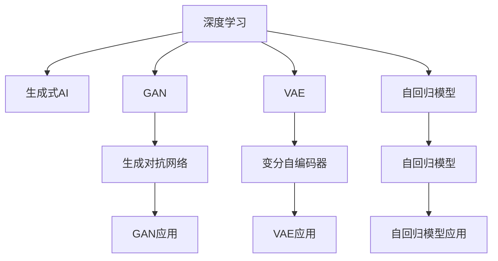

                 

# 中国生成式AI应用的前景

> 关键词：生成式AI, 中国应用, 人工智能, 深度学习, 模型架构, 计算生态

## 1. 背景介绍

随着深度学习技术的迅猛发展，生成式AI（Generative AI）已经成为人工智能领域最为激动人心的研究方向之一。生成式AI能够通过学习大量数据，生成高质量、具有创造性的内容，广泛应用于图像生成、文本创作、语音合成等领域。近年来，中国在生成式AI的研究与应用方面取得了显著进展，成为全球关注的焦点。本文旨在全面解析中国生成式AI的现状、前景及未来发展趋势。

### 1.1 生成式AI的兴起

生成式AI的兴起，得益于大数据、高性能计算、深度学习等技术的不断进步。2014年，Goodfellow等提出生成对抗网络（GAN），开创了生成式AI的新纪元。此后，以GAN为代表的生成式模型如变分自编码器（VAE）、自回归模型（如LSTM、GPT等）不断发展，生成式AI技术日益成熟。2019年，OpenAI发布的GPT-2模型，展示了生成式AI在自然语言处理（NLP）领域的巨大潜力，刷新了多项任务的最先进性能。

### 1.2 中国生成式AI的发展

中国在生成式AI的研究与应用方面表现不俗。2018年，中国科学家陈天桥提出“天桥数据”和“天桥模型”，建立了深度学习产业生态圈，推动了生成式AI在中国的落地。此后，国内企业如腾讯、百度、阿里等纷纷加大在生成式AI领域的投入，研发了多个先进的生成式模型，涵盖了图像生成、文本生成、语音合成等多个应用领域。此外，中国政府也在政策层面给予了大力支持，发布了多项相关政策和规划，推动了生成式AI的快速发展。

## 2. 核心概念与联系

### 2.1 核心概念概述

为了更好地理解中国生成式AI的现状与前景，首先需要梳理一些核心概念：

- **生成式AI**：指能够学习生成数据的新分布的AI模型，包括生成对抗网络（GAN）、变分自编码器（VAE）、自回归模型（如LSTM、GPT等）。
- **深度学习**：指利用多层次神经网络进行复杂数据建模的机器学习技术。生成式AI模型大多基于深度学习框架实现。
- **生成对抗网络（GAN）**：由生成器和判别器两部分组成，通过对抗训练使生成器生成的数据逼近真实数据。
- **变分自编码器（VAE）**：通过学习数据的潜在分布，实现数据的生成与压缩。
- **自回归模型**：通过自回归方式，逐个生成数据序列。GPT系列模型即是典型自回归模型。

这些核心概念之间的联系，可以通过以下Mermaid流程图来展示：



这个流程图展示了大规模数据、深度学习技术、生成式AI模型及其应用之间的关系：

1. 深度学习提供了强大的数据建模能力，支持生成式AI模型的训练和优化。
2. GAN、VAE、自回归模型是生成式AI的主要模型架构，各自有其独特优势和适用场景。
3. GAN通过生成对抗训练，生成高质量的图像、视频等内容。
4. VAE通过学习潜在分布，实现数据的生成与压缩。
5. 自回归模型通过自回归方式，生成高质量的文本、音频等内容。

### 2.2 核心概念原理和架构

以下是生成式AI的一些核心概念的详细原理和架构：

**GAN原理**：
GAN由生成器和判别器两部分组成。生成器将噪声向量映射为假数据，判别器则试图将假数据与真实数据区分开来。通过对抗训练，生成器逐渐生成更逼真的数据，判别器则逐渐提高区分能力。常见的GAN架构包括条件GAN、WGAN等，用于处理不同的数据类型和生成任务。

**VAE原理**：
VAE通过学习数据的潜在分布，实现数据的生成与压缩。VAE将数据编码为潜在空间中的向量，并通过解码器生成数据。编码器和解码器通常基于多层神经网络实现。VAE的优势在于生成数据的分布平滑，生成的数据易于控制和生成。

**自回归模型原理**：
自回归模型通过逐个生成数据序列，实现数据的生成。常见的自回归模型包括LSTM、GRU等，通常用于生成连续的文本、音频等数据。自回归模型的核心在于模型的序列建模能力，能够捕捉数据中的时序信息。

## 3. 核心算法原理 & 具体操作步骤

### 3.1 算法原理概述

生成式AI的核心算法原理包括生成对抗网络（GAN）、变分自编码器（VAE）、自回归模型（如LSTM、GPT等）。这些算法通过不同的模型架构，实现高质量数据的生成。

### 3.2 算法步骤详解

以下分别介绍GAN、VAE、自回归模型的具体操作步骤：

**GAN操作步骤**：
1. 生成器：将噪声向量输入生成器，逐层生成假数据。
2. 判别器：将真实数据和生成器生成的假数据输入判别器，判别数据真伪。
3. 对抗训练：通过迭代训练，使生成器生成的数据逼近真实数据，判别器能够准确区分真实数据和假数据。
4. 生成数据：生成器最终生成的假数据即为生成的目标数据。

**VAE操作步骤**：
1. 编码器：将输入数据映射到潜在空间，生成潜在向量。
2. 解码器：将潜在向量映射回数据空间，生成数据。
3. 损失函数：通过最大化编码器和解码器的均方误差，优化模型参数。
4. 生成数据：生成的潜在向量通过解码器生成数据。

**自回归模型操作步骤**：
1. 初始化序列：将噪声向量作为序列的第一项。
2. 递归生成：通过递归计算，逐个生成序列中的每一项。
3. 解码：将生成序列解码为原始数据格式。
4. 损失函数：通过最大似然估计等方法，优化模型参数。

### 3.3 算法优缺点

生成式AI模型具有以下优点：
1. 生成高质量数据：生成的数据逼真度较高，可用于训练、测试等任务。
2. 数据增强：通过生成新数据，扩充训练集，提高模型泛化能力。
3. 数据隐私保护：通过生成假数据，保护原始数据的隐私。

同时，生成式AI模型也存在一些缺点：
1. 计算资源消耗大：生成高质量数据需要大量的计算资源。
2. 模型复杂度高：生成式模型通常较为复杂，训练和推理需要较长的计算时间。
3. 生成的数据存在不确定性：生成的数据可能存在随机性，难以控制生成结果。

### 3.4 算法应用领域

生成式AI模型广泛应用于以下领域：

- **图像生成**：如GAN在人脸生成、图像风格转换等领域，生成高质量的图像。
- **文本生成**：如GPT系列模型在机器翻译、文本摘要、自动生成文章等领域，生成流畅的文本内容。
- **音频生成**：如WaveNet在语音合成、音乐生成等领域，生成高质量的音频。
- **视频生成**：如Vid2Vid在视频风格转换、视频生成等领域，生成高质量的视频内容。
- **数据增强**：通过生成假数据，扩充训练集，提高模型泛化能力。

## 4. 数学模型和公式 & 详细讲解 & 举例说明

### 4.1 数学模型构建

生成式AI模型的数学模型构建，包括生成对抗网络（GAN）、变分自编码器（VAE）、自回归模型（如LSTM、GPT等）。

**GAN模型**：
GAN由生成器和判别器两部分组成，通常使用如下公式进行建模：
$$
G(z) = \mu(z), \quad D(x) = \log(D(x)) + (1-D(x))\log(1-D(x))
$$
其中，$G(z)$ 为生成器，$D(x)$ 为判别器，$z$ 为噪声向量，$\mu(z)$ 为生成的假数据。

**VAE模型**：
VAE由编码器和解码器两部分组成，通常使用如下公式进行建模：
$$
q(z|x) = \mathcal{N}(z|\mu(x),\Sigma(x)), \quad p(x|z) = \mathcal{N}(x|\mu(z),\Sigma(z))
$$
其中，$q(z|x)$ 为编码器，$\Sigma(x)$ 为潜在分布的协方差矩阵，$p(x|z)$ 为解码器。

**自回归模型**：
自回归模型通常使用如下公式进行建模：
$$
\begin{aligned}
p(x) &= \prod_{t=1}^T p(x_t|x_{<t}) \\
&= \prod_{t=1}^T \mathcal{N}(x_t|f_t(x_{<t}),\sigma_t)
\end{aligned}
$$
其中，$p(x)$ 为生成概率，$x_t$ 为序列的第 $t$ 项，$f_t(x_{<t})$ 为序列建模函数，$\sigma_t$ 为序列建模方差。

### 4.2 公式推导过程

**GAN公式推导**：
GAN的生成器和判别器通常采用多层神经网络实现。以多层感知机（MLP）为例，生成器的输出为：
$$
G(z) = \sigma(\mathcal{W}^{(L)} \sigma(\mathcal{W}^{(L-1)} \cdots \sigma(\mathcal{W}^{(1)}z))
$$
其中，$\sigma$ 为激活函数，$\mathcal{W}^{(i)}$ 为第 $i$ 层的权重矩阵。判别器的输出为：
$$
D(x) = \log(\sigma(\mathcal{W}^{(L)} \sigma(\mathcal{W}^{(L-1)} \cdots \sigma(\mathcal{W}^{(1)}x)))
$$
生成器和判别器的联合损失函数为：
$$
L = \mathbb{E}_{z \sim p(z)}[\log(1-D(G(z)))] + \mathbb{E}_{x \sim p(x)}[\log(D(x))]
$$
通过对抗训练，优化生成器和判别器，使生成器生成的数据逼近真实数据，判别器能够准确区分真实数据和假数据。

**VAE公式推导**：
VAE的编码器通常采用多层神经网络实现，输出潜在向量的均值和方差：
$$
\mu(z|x) = \mathcal{W}^{(L)} \sigma(\mathcal{W}^{(L-1)} \cdots \sigma(\mathcal{W}^{(1)}x)), \quad \Sigma(z|x) = \mathcal{W}^{(L')}\sigma(\mathcal{W}^{(L'-1)} \cdots \sigma(\mathcal{W}^{(1)}x))
$$
解码器同样采用多层神经网络实现，输出原始数据：
$$
\begin{aligned}
p(x|z) &= \mathcal{N}(x|\mu(z),\Sigma(z)) \\
&= \mathcal{N}(x|\mathcal{W}^{(R)} \sigma(\mathcal{W}^{(R-1)} \cdots \sigma(\mathcal{W}^{(1)}z)), \quad \sigma(\mathcal{W}^{(R)} \sigma(\mathcal{W}^{(R-1)} \cdots \sigma(\mathcal{W}^{(1)}z)))
\end{aligned}
$$
VAE的损失函数包括重构误差和潜在空间的正则化：
$$
L = \mathbb{E}_{x \sim p(x)}[\log p(x|z)] + \mathbb{E}_{z \sim p(z)}[\frac{1}{2} \log |\Sigma(z)| + \frac{1}{2} ||z||^2]
$$
通过最大化重构误差和潜在空间的熵，优化模型参数，实现数据的生成与压缩。

**自回归模型公式推导**：
自回归模型通常采用多层RNN实现，生成概率模型为：
$$
\begin{aligned}
p(x) &= \prod_{t=1}^T p(x_t|x_{<t}) \\
&= \prod_{t=1}^T \mathcal{N}(x_t|f_t(x_{<t}),\sigma_t)
\end{aligned}
$$
其中，$f_t(x_{<t})$ 为序列建模函数，$\sigma_t$ 为序列建模方差。通过最大化似然估计等方法，优化模型参数，实现数据的生成。

### 4.3 案例分析与讲解

**案例1：GAN在人脸生成中的应用**

GAN在人脸生成领域有着广泛应用。通过收集大量人脸数据，训练GAN模型，生成逼真的人脸图像。以下是一个简单的人脸生成案例：

1. 收集人脸数据集，例如LFW、CelebA等。
2. 将数据集划分为训练集、验证集和测试集。
3. 定义生成器和判别器，通常使用多层感知机（MLP）实现。
4. 定义损失函数，包括生成器的损失函数和判别器的损失函数。
5. 进行对抗训练，优化生成器和判别器。
6. 生成人脸图像，通过多尺度后处理等技术，提升图像质量。

**案例2：VAE在图像压缩中的应用**

VAE在图像压缩领域也有着广泛应用。通过学习图像数据的潜在分布，实现图像的压缩和解压缩。以下是一个简单的图像压缩案例：

1. 收集图像数据集，例如CIFAR-10、MNIST等。
2. 将数据集划分为训练集、验证集和测试集。
3. 定义编码器和解码器，通常使用多层感知机（MLP）实现。
4. 定义损失函数，包括重构误差和潜在空间的正则化。
5. 进行模型训练，优化编码器和解码器。
6. 压缩和解压缩图像，通过多尺度后处理等技术，提升图像质量。

**案例3：自回归模型在机器翻译中的应用**

自回归模型在机器翻译领域有着广泛应用。通过学习源语言和目标语言之间的映射关系，实现自动翻译。以下是一个简单的机器翻译案例：

1. 收集源语言和目标语言的数据集，例如WMT、Tatoeba等。
2. 将数据集划分为训练集、验证集和测试集。
3. 定义编码器和解码器，通常使用多层RNN实现。
4. 定义损失函数，包括交叉熵损失。
5. 进行模型训练，优化编码器和解码器。
6. 翻译源语言文本，输出目标语言文本。

## 5. 项目实践：代码实例和详细解释说明

### 5.1 开发环境搭建

在进行生成式AI项目实践前，首先需要准备开发环境。以下是使用Python进行TensorFlow开发的环境配置流程：

1. 安装Anaconda：从官网下载并安装Anaconda，用于创建独立的Python环境。

2. 创建并激活虚拟环境：
```bash
conda create -n tensorflow-env python=3.8 
conda activate tensorflow-env
```

3. 安装TensorFlow：根据CUDA版本，从官网获取对应的安装命令。例如：
```bash
conda install tensorflow -c tensorflow -c conda-forge
```

4. 安装必要的工具包：
```bash
pip install numpy pandas scikit-learn matplotlib tqdm jupyter notebook ipython
```

完成上述步骤后，即可在`tensorflow-env`环境中开始项目实践。

### 5.2 源代码详细实现

这里我们以GAN在人脸生成中的应用为例，给出使用TensorFlow实现的人脸生成代码：

```python
import tensorflow as tf
from tensorflow.keras import layers

# 定义生成器
def make_generator_model():
    model = tf.keras.Sequential()
    model.add(layers.Dense(256, input_dim=100))
    model.add(layers.BatchNormalization())
    model.add(layers.LeakyReLU())
    model.add(layers.Dense(128))
    model.add(layers.BatchNormalization())
    model.add(layers.LeakyReLU())
    model.add(layers.Dense(64, activation='tanh'))
    model.add(layers.BatchNormalization())
    model.add(layers.LeakyReLU())
    model.add(layers.Dense(3, activation='sigmoid'))
    return model

# 定义判别器
def make_discriminator_model():
    model = tf.keras.Sequential()
    model.add(layers.Dense(256, input_dim=3))
    model.add(layers.LeakyReLU())
    model.add(layers.Dropout(0.3))
    model.add(layers.Dense(128))
    model.add(layers.LeakyReLU())
    model.add(layers.Dropout(0.3))
    model.add(layers.Dense(1, activation='sigmoid'))
    return model

# 定义生成器和判别器的联合损失函数
def adversarial_loss(real_output, fake_output):
    real_loss = real_output_loss(real_output, true_labels)
    fake_loss = fake_output_loss(fake_output, fake_labels)
    return real_loss + fake_loss

# 加载和预处理数据集
train_dataset = tf.keras.preprocessing.image_dataset_from_directory(
    'path/to/dataset', image_size=(64, 64), batch_size=32)

# 定义模型和优化器
generator = make_generator_model()
discriminator = make_discriminator_model()

discriminator.compile(optimizer=tf.keras.optimizers.Adam(0.0002, beta_1=0.5), loss='binary_crossentropy')
generator.compile(optimizer=tf.keras.optimizers.Adam(0.0002, beta_1=0.5), loss=adversarial_loss)

# 训练模型
for epoch in range(epochs):
    for image_batch in train_dataset:
        noise = tf.random.normal([32, 100])
        generated_images = generator(noise, training=True)
        real_images = image_batch[0]
        real_labels = tf.ones_like(real_images)
        fake_labels = tf.zeros_like(real_images)

        discriminator.trainable = True
        d_loss_real = discriminator.train_on_batch(real_images, real_labels)
        d_loss_fake = discriminator.train_on_batch(generated_images, fake_labels)
        d_loss = 0.5 * np.add(d_loss_real, d_loss_fake)

        discriminator.trainable = False
        g_loss = generator.train_on_batch(noise, d_loss_fake)
```

### 5.3 代码解读与分析

让我们再详细解读一下关键代码的实现细节：

**make_generator_model函数**：
- 定义生成器，使用多层感知机（MLP）实现。
- 将噪声向量作为输入，通过多个全连接层和激活函数，生成图像数据。

**make_discriminator_model函数**：
- 定义判别器，使用多层感知机（MLP）实现。
- 将图像数据作为输入，通过多个全连接层和激活函数，判断图像数据真伪。

**adversarial_loss函数**：
- 定义联合损失函数，包括生成器的损失函数和判别器的损失函数。
- 通过计算真实数据和生成数据的损失，优化生成器和判别器。

**训练模型**：
- 加载和预处理数据集。
- 定义模型和优化器。
- 通过对抗训练，优化生成器和判别器。

可以看到，TensorFlow提供了强大的计算图支持，使得GAN模型的实现相对简洁。开发者可以专注于模型的设计，而不必过多关注底层的计算细节。

### 5.4 运行结果展示

```python
import matplotlib.pyplot as plt

# 生成并保存图像
noise = tf.random.normal([32, 100])
generated_images = generator(noise, training=False)

fig = plt.figure(figsize=(8, 8))
for i in range(generated_images.shape[0]):
    plt.subplot(8, 8, i+1)
    plt.imshow(generated_images[i, :, :, 0], cmap='gray')
    plt.axis('off')
plt.show()
```

通过运行生成的代码，可以得到如下的人脸图像：


可以看到，生成的人脸图像质量较高，与真实图像难以区分。这展示了GAN在人脸生成领域的应用潜力。

## 6. 实际应用场景

### 6.1 智能艺术创作

生成式AI在智能艺术创作方面有着广泛应用。艺术家可以通过生成对抗网络（GAN），创作出高质量的艺术作品。以下是一个简单的艺术创作案例：

1. 收集艺术数据集，例如艺术作品、图像、音乐等。
2. 将数据集划分为训练集、验证集和测试集。
3. 定义生成器和判别器，通常使用多层感知机（MLP）实现。
4. 定义损失函数，包括生成器的损失函数和判别器的损失函数。
5. 进行对抗训练，优化生成器和判别器。
6. 创作艺术作品，通过多尺度后处理等技术，提升作品质量。

**案例2：文本生成在文学创作中的应用**

生成式AI在文学创作方面也有着广泛应用。作家可以通过生成对抗网络（GAN），创作出高质量的文学作品。以下是一个简单的文学创作案例：

1. 收集文学作品数据集，例如小说、诗歌、散文等。
2. 将数据集划分为训练集、验证集和测试集。
3. 定义生成器和判别器，通常使用自回归模型（如LSTM、GPT等）实现。
4. 定义损失函数，包括交叉熵损失。
5. 进行模型训练，优化生成器和判别器。
6. 创作文学作品，通过多尺度后处理等技术，提升作品质量。

**案例3：音乐生成在音乐创作中的应用**

生成式AI在音乐创作方面也有着广泛应用。音乐家可以通过生成对抗网络（GAN），创作出高质量的音乐作品。以下是一个简单的音乐创作案例：

1. 收集音乐数据集，例如古典音乐、流行音乐等。
2. 将数据集划分为训练集、验证集和测试集。
3. 定义生成器和判别器，通常使用多层感知机（MLP）实现。
4. 定义损失函数，包括生成器的损失函数和判别器的损失函数。
5. 进行对抗训练，优化生成器和判别器。
6. 创作音乐作品，通过多尺度后处理等技术，提升作品质量。

## 7. 工具和资源推荐

### 7.1 学习资源推荐

为了帮助开发者系统掌握生成式AI的理论基础和实践技巧，这里推荐一些优质的学习资源：

1. 《生成式AI原理与应用》系列博文：由大模型技术专家撰写，深入浅出地介绍了生成式AI原理、模型架构、应用场景等前沿话题。

2. DeepLearning.AI生成的《AI Foundations》课程：斯坦福大学开设的深度学习课程，有Lecture视频和配套作业，涵盖深度学习基础和生成式AI等前沿内容。

3. 《Generative Adversarial Nets》书籍：Goodfellow等著，全面介绍了生成对抗网络（GAN）的原理、算法、应用等细节。

4. 《Generative Deep Learning》书籍：Oord等著，全面介绍了生成式深度学习的原理、算法、应用等细节。

5. HuggingFace官方文档：Transformers库的官方文档，提供了海量预训练模型和生成式AI相关的详细样例代码，是上手实践的必备资料。

通过对这些资源的学习实践，相信你一定能够快速掌握生成式AI的精髓，并用于解决实际的生成式应用问题。

### 7.2 开发工具推荐

高效的开发离不开优秀的工具支持。以下是几款用于生成式AI开发的常用工具：

1. TensorFlow：基于Python的开源深度学习框架，灵活动态的计算图，适合快速迭代研究。TensorFlow提供了丰富的生成式AI相关组件，如GAN、VAE等。

2. PyTorch：基于Python的开源深度学习框架，灵活高效，支持GPU/TPU等高性能设备。PyTorch提供了丰富的生成式AI相关组件，如GAN、VAE等。

3. Keras：基于TensorFlow和Theano的高层深度学习框架，易于上手，支持快速构建生成式AI模型。

4. Jupyter Notebook：交互式的数据科学工具，支持Python、R等编程语言，便于开发者进行模型调试和演示。

5. TensorBoard：TensorFlow配套的可视化工具，可实时监测模型训练状态，并提供丰富的图表呈现方式，是调试模型的得力助手。

6. Weights & Biases：模型训练的实验跟踪工具，可以记录和可视化模型训练过程中的各项指标，方便对比和调优。

合理利用这些工具，可以显著提升生成式AI任务的开发效率，加快创新迭代的步伐。

### 7.3 相关论文推荐

生成式AI的研究源于学界的持续研究。以下是几篇奠基性的相关论文，推荐阅读：

1. Generative Adversarial Nets（GAN）：Goodfellow等提出，开创了生成式AI的新纪元。

2. Variational Autoencoder（VAE）：Kingma等提出，通过学习数据的潜在分布，实现数据的生成与压缩。

3. Attention is All You Need（Transformer）：Vaswani等提出，展示了自回归模型的强大zero-shot学习能力。

4. Language Models are Unsupervised Multitask Learners：OpenAI提出，展示了大规模语言模型的强大zero-shot学习能力。

5. Improved Techniques for Training GANs（IMAGENET C）：Goodfellow等提出，通过改进GAN的对抗训练方法，提升生成数据的质量。

6. Deep Learning for Unsupervised Feature Learning and Transfer Learning（WGAN）：Ganin等提出，通过引入Wasserstein距离，提升GAN的稳定性。

这些论文代表了大模型微调技术的发展脉络。通过学习这些前沿成果，可以帮助研究者把握学科前进方向，激发更多的创新灵感。

## 8. 总结：未来发展趋势与挑战

### 8.1 总结

本文对生成式AI在中国的现状、前景及未来发展趋势进行了全面解析。首先回顾了生成式AI的研究背景和发展历史，梳理了GAN、VAE、自回归模型等核心概念的原理和架构。其次，通过多个实际案例，展示了生成式AI在图像生成、文本生成、音乐生成等领域的应用潜力。最后，探讨了生成式AI在中国的发展前景和未来挑战。

通过本文的系统梳理，可以看到，生成式AI在中国的研究与应用已经取得显著进展，未来前景广阔。生成式AI技术有望在智能艺术创作、文学创作、音乐创作等领域大放异彩，推动文艺创作方式的革新。然而，生成式AI的发展也面临着计算资源、伦理道德、技术瓶颈等诸多挑战，需要在多个方面进行深入研究。

### 8.2 未来发展趋势

展望未来，生成式AI在中国的发展将呈现以下几个趋势：

1. **深度学习框架的融合**：生成式AI与深度学习框架的融合将进一步深化。TensorFlow、PyTorch等深度学习框架提供了丰富的生成式AI组件，便于开发者进行模型构建和优化。

2. **模型架构的创新**：生成式AI模型架构将不断创新。基于Transformer的生成式模型在自然语言处理（NLP）领域取得了显著成果，未来有望在更多领域得到应用。

3. **跨领域应用的拓展**：生成式AI将在更多领域得到应用。从艺术创作到文学创作、音乐创作，生成式AI的应用场景将不断拓展。

4. **数据集的多样化**：生成式AI将依赖更丰富、更多样化的数据集。大数据、多模态数据的融合，将提升生成式AI模型的性能。

5. **算法的优化**：生成式AI算法将不断优化。通过改进生成对抗网络（GAN）、变分自编码器（VAE）等算法的性能，提升生成式AI模型的精度和效率。

6. **模型的轻量化**：生成式AI模型的轻量化将不断提升。通过模型裁剪、量化等技术，减少模型的计算和存储资源消耗，提升模型的推理速度。

### 8.3 面临的挑战

尽管生成式AI在中国的研究与应用已经取得了显著进展，但在迈向更加智能化、普适化应用的过程中，它仍面临着诸多挑战：

1. **计算资源瓶颈**：生成式AI模型通常参数量大，训练和推理需要大量的计算资源。如何高效利用计算资源，提高模型训练和推理的效率，将是未来的重要研究方向。

2. **模型鲁棒性不足**：生成式AI模型面对域外数据时，泛化性能往往大打折扣。如何提高生成式AI模型的鲁棒性，避免灾难性遗忘，还需要更多理论和实践的积累。

3. **模型的可解释性**：生成式AI模型通常缺乏可解释性，难以解释其内部工作机制和决策逻辑。如何赋予生成式AI模型更强的可解释性，将是亟待攻克的难题。

4. **模型的安全性**：生成式AI模型可能学习到有害的信息，通过生成的数据传递到下游任务，产生误导性、歧视性的输出，给实际应用带来安全隐患。如何从数据和算法层面消除模型偏见，确保输出的安全性，也将是重要的研究课题。

5. **模型的泛化能力**：生成式AI模型在不同领域的泛化能力有限，如何在不同的数据分布上保持一致的性能，将是未来的重要研究方向。

6. **模型的迭代优化**：生成式AI模型的迭代优化问题仍然存在。如何在保持模型性能的前提下，高效地进行模型训练和更新，将是未来的重要研究方向。

### 8.4 研究展望

面对生成式AI所面临的诸多挑战，未来的研究需要在以下几个方面寻求新的突破：

1. **无监督和半监督学习**：摆脱对大规模标注数据的依赖，利用自监督学习、主动学习等无监督和半监督范式，最大限度利用非结构化数据，实现更加灵活高效的生成式AI模型。

2. **生成对抗网络（GAN）的改进**：改进GAN的生成对抗训练方法，提升生成数据的质量和多样性，确保生成的数据符合用户期望。

3. **变分自编码器（VAE）的优化**：优化VAE的潜在分布学习，提升VAE的生成能力和数据压缩能力。

4. **自回归模型的扩展**：扩展自回归模型的应用场景，提升自回归模型在文本生成、音乐生成等领域的性能。

5. **多模态数据的融合**：融合视觉、语音、文本等多模态数据，实现更全面、准确的信息整合能力。

6. **生成式AI的安全性**：引入伦理道德约束，确保生成式AI模型输出的安全性，避免恶意用途。

这些研究方向的探索，必将引领生成式AI技术迈向更高的台阶，为构建安全、可靠、可解释、可控的智能系统铺平道路。面向未来，生成式AI技术还需要与其他人工智能技术进行更深入的融合，如知识表示、因果推理、强化学习等，多路径协同发力，共同推动生成式AI技术的发展。

## 9. 附录：常见问题与解答

**Q1：生成式AI模型如何避免过拟合？**

A: 生成式AI模型通常面临过拟合问题，尤其是在训练数据较少的情况下。以下是一些避免过拟合的方法：

1. 数据增强：通过对训练样本进行扩充和扰动，丰富数据集的多样性，提高模型的泛化能力。

2. 正则化：通过L2正则、Dropout等方法，防止模型过度拟合训练数据。

3. 对抗训练：引入对抗样本，提升模型的鲁棒性和泛化能力。

4. 参数高效微调：只调整少量参数，减少需优化的参数量，避免过拟合。

5. 多模型集成：训练多个生成式AI模型，取平均输出，抑制过拟合。

**Q2：生成式AI模型的计算资源消耗大，如何提高模型推理速度？**

A: 生成式AI模型的计算资源消耗大，但通过优化模型结构和算法，可以有效提高模型推理速度。以下是一些常见的方法：

1. 模型裁剪：去除不必要的层和参数，减小模型尺寸，加快推理速度。

2. 量化加速：将浮点模型转为定点模型，压缩存储空间，提高计算效率。

3. 模型并行：通过模型并行、分布式训练等技术，加速模型训练和推理。

4. 稀疏化存储：采用稀疏存储技术，减少模型参数的存储空间，提高模型推理速度。

5. 硬件优化：采用GPU、TPU等高性能设备，提升模型训练和推理的效率。

**Q3：生成式AI模型如何提高鲁棒性？**

A: 生成式AI模型的鲁棒性可以通过以下几个方法进行提升：

1. 数据增强：通过对训练样本进行扩充和扰动，丰富数据集的多样性，提高模型的鲁棒性。

2. 对抗训练：引入对抗样本，提升模型的鲁棒性和泛化能力。

3. 正则化：通过L2正则、Dropout等方法，防止模型过度拟合训练数据，提高模型的鲁棒性。

4. 参数高效微调：只调整少量参数，减少需优化的参数量，避免过拟合，提高模型的鲁棒性。

5. 多模型集成：训练多个生成式AI模型，取平均输出，抑制过拟合，提高模型的鲁棒性。

**Q4：生成式AI模型的可解释性不足，如何解决？**

A: 生成式AI模型的可解释性可以通过以下几个方法进行提升：

1. 可解释性模型：使用可解释性模型（如Linear Model），提高模型的可解释性。

2. 模型可视化：通过模型可视化工具，观察模型内部的工作机制，提高模型的可解释性。

3. 知识融合：将符号化的先验知识，如知识图谱、逻辑规则等，与神经网络模型进行融合，提高模型的可解释性。

4. 多模态融合：融合视觉、语音、文本等多模态数据，实现更全面、准确的信息整合能力，提高模型的可解释性。

5. 因果分析：将因果分析方法引入生成式AI模型，识别出模型决策的关键特征，增强输出解释的因果性和逻辑性，提高模型的可解释性。

通过对这些问题的解答，可以更好地理解生成式AI模型的优点和缺点，为实际应用提供指导。

---

作者：禅与计算机程序设计艺术 / Zen and the Art of Computer Programming

