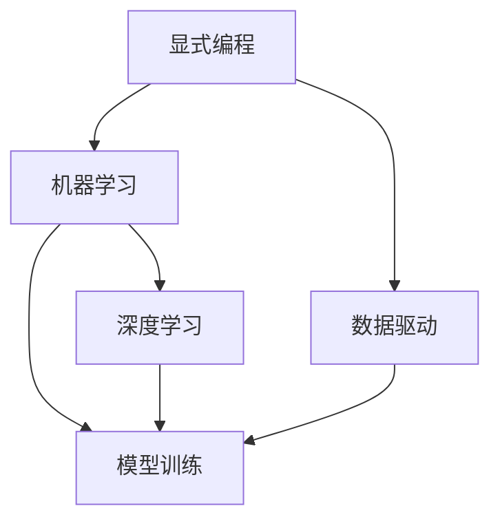

                 

# 为什么收集数据比显式编程更容易解决复杂问题

> 关键词：数据驱动, 数据集构建, 机器学习, 模型训练, 复杂问题解决

## 1. 背景介绍

### 1.1 问题由来
在现代信息科技飞速发展的今天，面对复杂多变的现实问题，传统的显式编程方法往往难以胜任。比如，传统的程序设计需要开发者在遇到问题时，深入分析问题特性，设计出解决问题的算法流程，并编写代码实现。然而，现实世界的问题往往过于复杂，难以通过人工编程完全解决。

以图像识别为例，传统的图像处理算法需要开发者手动设计和实现特征提取、分类器设计等模块。然而，随着图像数据的复杂性增加，手动设计和实现特征提取器变得既费时又费力，且容易出错。相反，通过构建并利用数据集，机器学习模型可以快速学习图像特征，直接输出识别结果，大大提高了问题解决的效率和准确性。

### 1.2 问题核心关键点
这一问题的核心在于理解数据在解决复杂问题中的重要作用，以及机器学习模型在数据驱动下解决问题的便捷性和高效性。面对复杂问题，显式编程通常需要耗费大量时间和精力设计算法，且难以处理高维度和非线性问题。而数据驱动的机器学习模型，特别是深度学习模型，能够从大规模数据集中自动学习并提取特征，快速适应和解决问题，有效降低编程复杂度。

## 2. 核心概念与联系

### 2.1 核心概念概述

为了更好地理解为什么收集数据比显式编程更容易解决复杂问题，本节将介绍几个密切相关的核心概念：

- **显式编程**：开发者需要手动编写代码实现算法，通过指令和流程来控制程序执行。
- **数据驱动**：通过收集和利用大量数据，自动学习特征并训练模型，以数据为驱动进行问题解决。
- **机器学习**：利用统计学和计算方法，使机器能够从数据中自动学习并提取规律，解决特定问题。
- **深度学习**：一种特殊的机器学习技术，通过多层次的神经网络，自动提取高层次的抽象特征，解决复杂问题。
- **数据集构建**：从现实世界收集并标注数据，构建可用于训练模型的数据集。
- **模型训练**：通过数据集训练机器学习模型，使其学习到特征并进行问题解决。

这些核心概念之间的逻辑关系可以通过以下Mermaid流程图来展示：



这个流程图展示了大语言模型的核心概念及其之间的关系：

1. 显式编程是传统的问题解决方式，通过编程实现算法。
2. 数据驱动是现代问题解决的重要方式，通过数据自动提取特征和规律。
3. 机器学习是数据驱动的核心技术，自动从数据中学习并解决问题。
4. 深度学习是机器学习的一种高级形式，通过多层次网络自动学习高层次特征。
5. 模型训练是机器学习模型的核心步骤，从数据中学习模型参数。

这些概念共同构成了复杂问题解决的现代框架，使得数据驱动的机器学习模型在解决复杂问题时，相较于显式编程，具有显著优势。

## 3. 核心算法原理 & 具体操作步骤
### 3.1 算法原理概述

数据驱动的机器学习模型，通过从数据集中自动提取特征，训练得到模型参数，进而解决复杂问题。其核心思想是：利用大量标注数据，通过迭代训练，优化模型参数，使得模型能够准确地预测和分类输入数据，从而实现问题解决。

具体而言，数据驱动的模型训练步骤如下：

1. 收集和预处理数据集。
2. 设计并训练机器学习模型。
3. 评估模型性能。
4. 迭代优化模型参数。
5. 应用模型进行预测和分类。

其中，数据集构建是关键环节，决定了模型的性能和解决问题的能力。

### 3.2 算法步骤详解

以图像识别任务为例，数据驱动的机器学习模型训练步骤如下：

**Step 1: 数据集构建**
- 收集大量图像数据集，包括正负样本。
- 对图像进行预处理，如归一化、缩放、旋转等。
- 对图像进行标注，定义正负样本类别。

**Step 2: 模型设计**
- 选择合适的机器学习模型，如卷积神经网络(CNN)。
- 设计模型架构，包括卷积层、池化层、全连接层等。
- 定义损失函数，如交叉熵损失。

**Step 3: 模型训练**
- 使用优化器，如SGD、Adam等，优化模型参数。
- 在训练集上进行迭代训练，计算损失函数。
- 在验证集上评估模型性能，根据损失函数调整模型参数。

**Step 4: 模型评估**
- 在测试集上测试模型性能，计算准确率、召回率等指标。
- 根据测试结果，调整模型超参数，如学习率、批次大小等。

**Step 5: 模型应用**
- 应用训练好的模型进行预测，分类新输入的图像数据。
- 不断迭代改进模型，以适应新数据和新任务。

### 3.3 算法优缺点

数据驱动的机器学习模型具有以下优点：

1. 自动化处理高维度数据。机器学习模型可以自动处理高维度、非线性的数据，无需人工设计特征提取器。
2. 快速迭代优化。通过大量数据训练，模型可以快速迭代优化，提升性能。
3. 适用于复杂问题。机器学习模型可以处理复杂多变的现实问题，具备较强的泛化能力。
4. 可解释性强。通过可视化工具，可以直观展示模型特征和学习过程。

同时，该方法也存在一定的局限性：

1. 数据需求量大。机器学习模型需要大量标注数据进行训练，获取高质量数据成本较高。
2. 模型解释性差。数据驱动模型通常视为"黑盒"，难以解释模型内部决策过程。
3. 容易过拟合。面对大规模数据，模型容易过拟合，泛化性能不足。
4. 训练时间较长。模型训练过程耗时较长，对于大规模数据集尤为明显。

尽管存在这些局限性，但数据驱动的机器学习模型在解决复杂问题时，相较于显式编程，仍具有显著优势。未来相关研究的重点在于如何进一步降低数据需求，提高模型解释性和鲁棒性，同时兼顾训练效率，以推动其在更广泛的应用场景中发挥作用。

### 3.4 算法应用领域

数据驱动的机器学习模型在众多领域中得到了广泛应用，例如：

- 自然语言处理：文本分类、情感分析、机器翻译、问答系统等。通过收集大量文本数据，训练语言模型进行问题解决。
- 计算机视觉：图像分类、目标检测、图像生成、图像分割等。通过构建大规模图像数据集，训练卷积神经网络进行问题解决。
- 信号处理：语音识别、音频分类、视频分析、时间序列预测等。通过收集大量信号数据，训练特征提取器和分类器进行问题解决。
- 生物信息学：基因序列分析、蛋白质结构预测、药物发现等。通过收集和标注生物数据，训练生物信息学模型进行问题解决。
- 金融风控：信用评分、欺诈检测、投资分析等。通过收集和标注金融数据，训练模型进行风险评估和预测。

除了上述这些经典领域外，数据驱动的机器学习模型还被创新性地应用到更多场景中，如智能推荐、智能制造、智能交通等，为各行业带来了新的技术和应用突破。随着数据和计算技术的不断进步，相信数据驱动的机器学习模型必将在更多领域得到应用，为经济社会发展注入新的动力。

## 4. 数学模型和公式 & 详细讲解 & 举例说明

### 4.1 数学模型构建

本节将使用数学语言对数据驱动的机器学习模型训练过程进行更加严格的刻画。

记数据集为 $D=\{(x_i, y_i)\}_{i=1}^N$，其中 $x_i \in \mathcal{X}$ 为输入样本， $y_i \in \mathcal{Y}$ 为输出标签。假设模型为 $M_{\theta}(x)$，其中 $\theta$ 为模型参数。定义模型在数据样本 $(x,y)$ 上的损失函数为 $\ell(M_{\theta}(x),y)$，则在数据集 $D$ 上的经验风险为：

$$
\mathcal{L}(\theta) = \frac{1}{N} \sum_{i=1}^N \ell(M_{\theta}(x_i),y_i)
$$

模型训练的目标是最小化经验风险，即找到最优参数：

$$
\theta^* = \mathop{\arg\min}_{\theta} \mathcal{L}(\theta)
$$

在实践中，我们通常使用基于梯度的优化算法（如SGD、Adam等）来近似求解上述最优化问题。设 $\eta$ 为学习率，$\lambda$ 为正则化系数，则参数的更新公式为：

$$
\theta \leftarrow \theta - \eta \nabla_{\theta}\mathcal{L}(\theta) - \eta\lambda\theta
$$

其中 $\nabla_{\theta}\mathcal{L}(\theta)$ 为损失函数对参数 $\theta$ 的梯度，可通过反向传播算法高效计算。

### 4.2 公式推导过程

以下我们以二分类任务为例，推导交叉熵损失函数及其梯度的计算公式。

假设模型 $M_{\theta}$ 在输入 $x$ 上的输出为 $\hat{y}=M_{\theta}(x) \in [0,1]$，表示样本属于正类的概率。真实标签 $y \in \{0,1\}$。则二分类交叉熵损失函数定义为：

$$
\ell(M_{\theta}(x),y) = -[y\log \hat{y} + (1-y)\log (1-\hat{y})]
$$

将其代入经验风险公式，得：

$$
\mathcal{L}(\theta) = -\frac{1}{N}\sum_{i=1}^N [y_i\log M_{\theta}(x_i)+(1-y_i)\log(1-M_{\theta}(x_i))]
$$

根据链式法则，损失函数对参数 $\theta_k$ 的梯度为：

$$
\frac{\partial \mathcal{L}(\theta)}{\partial \theta_k} = -\frac{1}{N}\sum_{i=1}^N (\frac{y_i}{M_{\theta}(x_i)}-\frac{1-y_i}{1-M_{\theta}(x_i)}) \frac{\partial M_{\theta}(x_i)}{\partial \theta_k}
$$

其中 $\frac{\partial M_{\theta}(x_i)}{\partial \theta_k}$ 可进一步递归展开，利用自动微分技术完成计算。

在得到损失函数的梯度后，即可带入参数更新公式，完成模型的迭代优化。重复上述过程直至收敛，最终得到适应数据集 $D$ 的最优模型参数 $\theta^*$。

### 4.3 案例分析与讲解

以图像识别任务为例，详细讲解数据驱动的机器学习模型训练过程。

假设我们要训练一个图像识别模型，将手写数字图像分类为0到9中的某一个数字。首先，我们收集并标注大量手写数字图像数据集 $D$，每个图像都附有一个标签 $y_i \in \{0,1,2,\ldots,9\}$。接着，我们将数据集 $D$ 划分为训练集、验证集和测试集。

然后，我们选择一个卷积神经网络作为模型架构，包括卷积层、池化层、全连接层等。设置损失函数为交叉熵损失，优化器为Adam，学习率为 $10^{-4}$，正则化系数为 $10^{-2}$。

接下来，我们使用训练集对模型进行迭代训练，每次迭代计算损失函数，更新模型参数。在每个epoch结束时，我们在验证集上评估模型性能，检查是否过拟合，并根据性能调整学习率。训练完成后，在测试集上评估模型性能，输出准确率、召回率等指标。

## 5. 项目实践：代码实例和详细解释说明
### 5.1 开发环境搭建

在进行机器学习模型训练前，我们需要准备好开发环境。以下是使用Python进行TensorFlow开发的环境配置流程：

1. 安装Anaconda：从官网下载并安装Anaconda，用于创建独立的Python环境。

2. 创建并激活虚拟环境：
```bash
conda create -n pytorch-env python=3.8 
conda activate pytorch-env
```

3. 安装TensorFlow：根据CUDA版本，从官网获取对应的安装命令。例如：
```bash
conda install tensorflow -c pytorch -c conda-forge
```

4. 安装各类工具包：
```bash
pip install numpy pandas scikit-learn matplotlib tqdm jupyter notebook ipython
```

完成上述步骤后，即可在`pytorch-env`环境中开始机器学习模型训练实践。

### 5.2 源代码详细实现

下面我以手写数字识别任务为例，给出使用TensorFlow构建并训练卷积神经网络(CNN)的代码实现。

首先，定义模型架构和超参数：

```python
import tensorflow as tf

model = tf.keras.Sequential([
    tf.keras.layers.Conv2D(32, (3, 3), activation='relu', input_shape=(28, 28, 1)),
    tf.keras.layers.MaxPooling2D((2, 2)),
    tf.keras.layers.Flatten(),
    tf.keras.layers.Dense(10, activation='softmax')
])

learning_rate = 1e-4
decay = 1e-6
batch_size = 128
epochs = 10
optimizer = tf.keras.optimizers.Adam(learning_rate=learning_rate, decay=decay)
```

然后，定义数据集和模型损失函数：

```python
from tensorflow.keras.datasets import mnist
(x_train, y_train), (x_test, y_test) = mnist.load_data()

x_train = x_train.reshape((x_train.shape[0], 28, 28, 1))
x_test = x_test.reshape((x_test.shape[0], 28, 28, 1))

x_train = x_train / 255.0
x_test = x_test / 255.0

y_train = tf.keras.utils.to_categorical(y_train, 10)
y_test = tf.keras.utils.to_categorical(y_test, 10)

model.compile(optimizer=optimizer, loss='categorical_crossentropy', metrics=['accuracy'])
```

接着，训练模型并评估：

```python
model.fit(x_train, y_train, batch_size=batch_size, epochs=epochs, validation_data=(x_test, y_test))
loss, acc = model.evaluate(x_test, y_test)
print('Test loss:', loss)
print('Test accuracy:', acc)
```

最后，测试模型并进行模型保存：

```python
model.save('mnist_cnn.h5')
```

以上就是使用TensorFlow进行手写数字识别任务机器学习模型训练的完整代码实现。可以看到，TensorFlow提供了强大的高级API，使得构建和训练模型变得异常简洁高效。

### 5.3 代码解读与分析

让我们再详细解读一下关键代码的实现细节：

**Sequential模型定义**：
- `Sequential` 表示顺序模型，可以方便地定义一系列层，每个层都按顺序依次执行。
- 使用 `tf.keras.layers.Conv2D` 定义卷积层，参数为卷积核大小、数量、激活函数等。
- 使用 `tf.keras.layers.MaxPooling2D` 定义池化层，参数为池化大小。
- 使用 `tf.keras.layers.Flatten` 将多维张量扁平化，方便全连接层的输入。
- 使用 `tf.keras.layers.Dense` 定义全连接层，参数为输出维度、激活函数等。

**超参数定义**：
- `learning_rate` 和 `decay` 分别表示学习率和衰减系数，用于控制模型更新速度和防止过拟合。
- `batch_size` 和 `epochs` 分别表示批次大小和迭代次数。

**模型编译和训练**：
- `model.compile` 用于编译模型，设置优化器、损失函数、评价指标等。
- `model.fit` 用于训练模型，在每个epoch结束时评估模型在验证集上的性能。
- `model.evaluate` 用于在测试集上评估模型性能。

**模型保存**：
- 使用 `model.save` 保存模型，以便后续调用和继续训练。

可以看到，TensorFlow提供了丰富的API，使得构建和训练模型变得异常便捷。开发者可以专注于算法设计和模型调参，而无需过多关注底层实现细节。

## 6. 实际应用场景
### 6.1 智能推荐系统

数据驱动的机器学习模型在智能推荐系统中的应用非常广泛。传统推荐系统通常依赖用户的历史行为数据，如浏览记录、评分等，进行物品推荐。然而，这些数据往往不完整、不全面，无法全面了解用户偏好。

基于数据驱动的机器学习模型，可以通过分析用户画像、社交网络、兴趣标签等多维度数据，构建更加全面和准确的用户模型。通过训练多模态融合的模型，能够综合利用用户的多种信息，输出更精准、多样化的推荐结果。例如，某电商网站通过收集用户浏览、点击、评论等数据，训练用户兴趣模型，推荐用户可能感兴趣的商品，提升用户体验和满意度。

### 6.2 金融风险评估

在金融领域，风险评估是核心任务之一。传统的金融风控模型通常依赖专家知识，设计复杂的算法流程，手动提取特征。然而，现实世界的数据往往高度复杂，难以通过显式编程实现。

数据驱动的机器学习模型可以自动从大量金融数据中学习特征，进行风险评估和预测。例如，某银行通过收集用户的交易记录、信用评分、历史还款情况等数据，训练风险评估模型，预测用户信用风险，优化信贷审批流程。

### 6.3 医疗影像分析

医疗影像分析是数据驱动机器学习的重要应用领域。传统影像分析需要医生手动标注图像、提取特征，效率低、成本高。

基于数据驱动的机器学习模型，可以通过自动标注大量医疗影像数据，训练影像分类、分割、标注等模型。例如，某医院通过收集大量CT、MRI等影像数据，训练影像分类模型，辅助医生诊断疾病，提升医疗诊断准确性和效率。

### 6.4 未来应用展望

随着数据驱动的机器学习模型的不断发展，其在解决复杂问题方面的潜力将进一步释放。未来，数据驱动的机器学习模型将在更多领域得到应用，为经济社会发展注入新的动力。

在智慧城市治理中，数据驱动的机器学习模型可应用于城市事件监测、舆情分析、应急指挥等环节，提高城市管理的自动化和智能化水平，构建更安全、高效的未来城市。

在智能制造中，通过数据驱动的机器学习模型，可以实时监测生产线状态，预测设备故障，优化生产流程，提升生产效率和质量。

在智能交通中，数据驱动的机器学习模型可以分析交通流量、路况信息，进行交通预测和优化，提升交通管理水平和用户体验。

此外，在更多领域，如智慧农业、智能家居、智能医疗等，数据驱动的机器学习模型也将发挥重要作用。相信随着数据和计算技术的不断进步，数据驱动的机器学习模型必将在更多领域得到应用，为经济社会发展注入新的动力。

## 7. 工具和资源推荐
### 7.1 学习资源推荐

为了帮助开发者系统掌握机器学习模型训练的理论基础和实践技巧，这里推荐一些优质的学习资源：

1. 《深度学习》（Ian Goodfellow、Yoshua Bengio 和 Aaron Courville 著）：深入介绍深度学习的基本原理和算法，涵盖机器学习模型训练的各个方面。

2. Coursera《深度学习专项课程》：由Andrew Ng教授主讲的深度学习课程，涵盖神经网络、卷积神经网络、循环神经网络等重要概念，适合初学者入门。

3. TensorFlow官方文档：TensorFlow的官方文档，提供丰富的API介绍、示例代码和社区资源，是学习和实践深度学习模型的重要参考资料。

4. PyTorch官方文档：PyTorch的官方文档，提供丰富的API介绍、示例代码和社区资源，是学习和实践深度学习模型的重要参考资料。

5. Kaggle：数据科学竞赛平台，提供丰富的数据集和比赛，可以实践和展示机器学习模型的应用能力。

通过对这些资源的学习实践，相信你一定能够快速掌握机器学习模型的训练方法和优化技巧，将数据驱动的机器学习模型应用于更多实际场景中。

### 7.2 开发工具推荐

高效的开发离不开优秀的工具支持。以下是几款用于机器学习模型训练开发的常用工具：

1. TensorFlow：由Google主导开发的开源深度学习框架，生产部署方便，适合大规模工程应用。

2. PyTorch：由Facebook主导开发的开源深度学习框架，灵活动态的计算图，适合快速迭代研究。

3. Keras：基于TensorFlow和Theano的高级API，提供简单易用的深度学习模型构建接口，适合快速开发和实验。

4. Jupyter Notebook：开源的交互式计算环境，支持Python、R等编程语言，方便实验和记录代码。

5. Weights & Biases：模型训练的实验跟踪工具，可以记录和可视化模型训练过程中的各项指标，方便对比和调优。

6. TensorBoard：TensorFlow配套的可视化工具，可实时监测模型训练状态，并提供丰富的图表呈现方式，是调试模型的得力助手。

合理利用这些工具，可以显著提升机器学习模型训练的开发效率，加快创新迭代的步伐。

### 7.3 相关论文推荐

数据驱动的机器学习模型的发展源于学界的持续研究。以下是几篇奠基性的相关论文，推荐阅读：

1. AlexNet: ImageNet Classification with Deep Convolutional Neural Networks：提出卷积神经网络，通过在ImageNet数据集上的训练，展示了深度学习在图像识别中的应用潜力。

2. ImageNet Large Scale Visual Recognition Challenge：ImageNet数据集的成功应用，推动了深度学习在图像识别领域的快速发展。

3. Deep Residual Learning for Image Recognition：提出残差网络，解决了深度神经网络中的梯度消失问题，提高了深度学习的训练效率和模型性能。

4. Inception-Net：提出Inception模块，提高了深度神经网络的特征提取能力，推动了深度学习在图像识别和计算机视觉领域的应用。

5. Natural Language Processing (almost) from Scratch：提出使用Transformer模型进行语言处理的思路，展示了数据驱动的机器学习模型在自然语言处理中的应用潜力。

这些论文代表了大语言模型微调技术的发展脉络。通过学习这些前沿成果，可以帮助研究者把握学科前进方向，激发更多的创新灵感。

## 8. 总结：未来发展趋势与挑战
### 8.1 总结

本文对数据驱动的机器学习模型训练方法进行了全面系统的介绍。首先阐述了数据驱动的机器学习模型在解决复杂问题中的重要作用，明确了数据驱动在机器学习模型训练中的核心地位。其次，从原理到实践，详细讲解了机器学习模型训练的数学原理和关键步骤，给出了机器学习模型训练的完整代码实例。同时，本文还广泛探讨了数据驱动的机器学习模型在智能推荐、金融风险评估、医疗影像分析等诸多领域的应用前景，展示了数据驱动的机器学习模型在各行各业中的广泛应用。

通过本文的系统梳理，可以看到，数据驱动的机器学习模型在解决复杂问题时，相较于显式编程，具有显著优势。数据驱动的机器学习模型通过从大量数据中自动提取特征和规律，解决了显式编程难以处理的复杂问题，大大提高了问题解决的效率和准确性。未来相关研究的重点在于如何进一步降低数据需求，提高模型解释性和鲁棒性，同时兼顾训练效率，以推动其在更广泛的应用场景中发挥作用。

### 8.2 未来发展趋势

展望未来，数据驱动的机器学习模型将呈现以下几个发展趋势：

1. 数据需求逐步降低。随着深度学习模型和算法的发展，数据驱动模型逐步摆脱对大规模标注数据的依赖，实现更高效的数据利用。

2. 模型可解释性增强。通过可视化工具，可以更加直观地展示模型的内部特征和决策过程，提高模型的可解释性。

3. 模型鲁棒性提升。通过数据增强、对抗训练等技术，提升模型对异常数据和干扰的鲁棒性，避免过拟合和泛化性能不足的问题。

4. 模型融合多样化。将多种模型和算法进行融合，构建更加复杂和强大的模型，提升模型的适应性和泛化能力。

5. 多模态数据融合。融合视觉、听觉、文本等多模态数据，提升模型的全面性和准确性，推动跨领域应用。

6. 持续学习机制。引入持续学习技术，使模型能够不断学习和适应新数据，保持模型的时效性和泛化能力。

以上趋势凸显了数据驱动的机器学习模型的广阔前景。这些方向的探索发展，必将进一步提升机器学习模型在复杂问题解决中的性能和应用范围，为经济社会发展注入新的动力。

### 8.3 面临的挑战

尽管数据驱动的机器学习模型在解决复杂问题方面具有显著优势，但在迈向更加智能化、普适化应用的过程中，仍面临诸多挑战：

1. 数据隐私和安全。大量数据的收集和存储，涉及隐私保护和数据安全问题，需要制定严格的数据隐私保护策略。

2. 数据标注成本高。获取高质量标注数据成本较高，且标注过程繁琐耗时，数据集构建面临挑战。

3. 模型过拟合。面对复杂数据，模型容易过拟合，泛化性能不足，需要采取多种正则化技术。

4. 模型可解释性差。数据驱动模型通常视为"黑盒"，难以解释模型内部决策过程，存在一定安全隐患。

5. 计算资源消耗大。大规模深度学习模型需要大量计算资源，需采用分布式训练和模型压缩等技术进行优化。

6. 数据分布不均衡。现实世界的数据分布往往不均衡，训练模型时需要解决数据不平衡问题。

正视这些挑战，积极应对并寻求突破，将是大数据驱动的机器学习模型迈向成熟的必由之路。相信随着学界和产业界的共同努力，这些挑战终将一一被克服，数据驱动的机器学习模型必将在构建人机协同的智能时代中扮演越来越重要的角色。

### 8.4 研究展望

面对数据驱动的机器学习模型所面临的种种挑战，未来的研究需要在以下几个方面寻求新的突破：

1. 探索无监督和半监督学习方法。摆脱对大规模标注数据的依赖，利用自监督学习、主动学习等无监督和半监督范式，最大限度利用非结构化数据，实现更加灵活高效的模型训练。

2. 研究参数高效和计算高效的模型构建方法。开发更加参数高效的模型，在固定大部分预训练参数的同时，只更新极少量的任务相关参数。同时优化模型计算图，减少前向传播和反向传播的资源消耗，实现更加轻量级、实时性的部署。

3. 引入因果分析和博弈论工具。将因果分析方法引入模型，识别出模型决策的关键特征，增强输出解释的因果性和逻辑性。借助博弈论工具刻画人机交互过程，主动探索并规避模型的脆弱点，提高系统稳定性。

4. 纳入伦理道德约束。在模型训练目标中引入伦理导向的评估指标，过滤和惩罚有偏见、有害的输出倾向。同时加强人工干预和审核，建立模型行为的监管机制，确保输出符合人类价值观和伦理道德。

这些研究方向的探索，必将引领数据驱动的机器学习模型迈向更高的台阶，为构建安全、可靠、可解释、可控的智能系统铺平道路。面向未来，数据驱动的机器学习模型还需要与其他人工智能技术进行更深入的融合，如知识表示、因果推理、强化学习等，多路径协同发力，共同推动人工智能技术的进步。只有勇于创新、敢于突破，才能不断拓展数据驱动的机器学习模型的边界，让智能技术更好地造福人类社会。

## 9. 附录：常见问题与解答

**Q1：数据驱动的机器学习模型是否适用于所有问题？**

A: 数据驱动的机器学习模型在处理数据密集型问题时表现尤为出色，但面对一些特定问题，如需要高度人工干预的领域（如医疗诊断、司法判决等），模型可能难以达到理想效果。此时需要结合人工知识和专家经验，进行模型设计和优化。

**Q2：如何选择合适的学习率？**

A: 选择学习率需要考虑多个因素，如数据集大小、模型复杂度、优化器类型等。通常建议从小学习率开始，逐步增加学习率，直至模型收敛或过拟合。常用的学习率策略包括学习率衰减、学习率冷却等。

**Q3：数据驱动的机器学习模型是否需要大量的标注数据？**

A: 数据驱动的机器学习模型需要大量标注数据进行训练，但随着模型的进步，对标注数据的需求也在逐步降低。当前许多先进模型，如自监督学习、对抗训练等，已经能够在少量标注数据下进行训练和优化。

**Q4：数据驱动的机器学习模型训练时间是否过长？**

A: 训练深度学习模型通常需要大量计算资源和时间，但随着硬件设备和算法优化，训练时间也在逐步缩短。目前许多高性能GPU和分布式训练技术，能够在较短时间内完成大规模模型训练。

**Q5：数据驱动的机器学习模型是否容易过拟合？**

A: 数据驱动的机器学习模型容易过拟合，特别是面对复杂和高维度数据集。需要采取正则化技术，如L2正则、Dropout等，以及对抗训练等方法，避免过拟合，提高模型泛化性能。

**Q6：数据驱动的机器学习模型是否可解释性强？**

A: 数据驱动的机器学习模型通常视为"黑盒"，难以解释模型内部决策过程。需要结合可视化工具，如图像可视化、特征分析等方法，增强模型的可解释性，提高可信度。

**Q7：数据驱动的机器学习模型是否容易受到异常数据干扰？**

A: 数据驱动的机器学习模型容易受到异常数据干扰，特别是面对数据噪声和噪声攻击。需要采取数据增强、对抗训练等技术，增强模型的鲁棒性，避免模型泛化性能下降。

**Q8：数据驱动的机器学习模型是否适合多模态数据融合？**

A: 数据驱动的机器学习模型适合多模态数据融合，通过融合视觉、听觉、文本等多种数据，构建更加全面和准确的模型。例如，某视频分析系统通过融合视觉、语音、文本等多种模态数据，实现多维度信息分析，提升系统性能。

**Q9：数据驱动的机器学习模型是否适合持续学习？**

A: 数据驱动的机器学习模型适合持续学习，通过不断吸收新数据，更新模型参数，保持模型的时效性和泛化能力。例如，某推荐系统通过不断收集用户行为数据，实时更新模型，提升推荐效果。

总之，数据驱动的机器学习模型在解决复杂问题时，相较于显式编程，具有显著优势。通过数据驱动的机器学习模型，可以从大规模数据集中自动学习特征和规律，快速适应和解决问题，提高问题解决的效率和准确性。未来相关研究的重点在于如何进一步降低数据需求，提高模型解释性和鲁棒性，同时兼顾训练效率，以推动其在更广泛的应用场景中发挥作用。

---

作者：禅与计算机程序设计艺术 / Zen and the Art of Computer Programming

