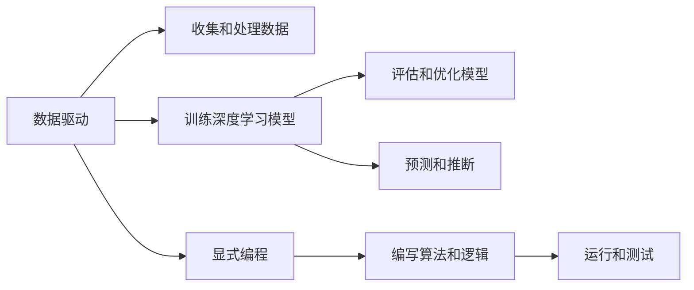

                 

# 为什么收集数据比显式编程更容易解决复杂问题

## 1. 背景介绍

在人工智能和机器学习领域，数据是驱动模型表现的核心要素。通过收集和分析大量数据，机器学习模型可以从中提取出复杂的模式和规律，进而完成对新数据的预测和推断。然而，在实际应用中，数据收集和处理往往是一项复杂且耗时的任务，尤其是在面对高维度和结构复杂的数据集时。相比之下，显式编程——即通过直接编写代码来解决问题——虽然在控制复杂性和提升效率方面具有优势，但在处理复杂问题时却显得力不从心。本文将深入探讨为何收集数据比显式编程更容易解决复杂问题，并结合实际案例分析其在人工智能领域的应用。

## 2. 核心概念与联系

为了更好地理解这一话题，我们先介绍几个核心概念及其相互联系。

### 2.1 数据驱动与显式编程
- **数据驱动**：指的是通过收集和分析数据来驱动模型训练和优化，利用数据中的复杂模式和规律，自动调整模型参数，以提升其预测和推断能力。
- **显式编程**：则是指通过直接编写代码来实现算法和逻辑，虽然灵活性较高，但在处理大规模、复杂问题时效率较低，且容易陷入局部最优解。

### 2.2 机器学习与深度学习
- **机器学习**：通过算法和统计模型，让计算机从数据中自动学习和改进，而无需进行明确的编程。
- **深度学习**：是机器学习的一个子集，通过多层神经网络模型，在数据驱动的基础上，进一步提升了模型的复杂性和预测能力。

### 2.3 数据质量与模型性能
- **数据质量**：指的是数据集在收集、处理和标注过程中的一致性、完整性和准确性。
- **模型性能**：即模型的泛化能力、准确性和鲁棒性，依赖于数据质量的高低。

这些概念之间的联系可以通过以下Mermaid流程图来展示：



此图展示了数据驱动与显式编程的基本流程，以及它们在机器学习、深度学习中的作用。

## 3. 核心算法原理 & 具体操作步骤

### 3.1 算法原理概述
数据驱动的核心在于通过大量数据来训练模型，使其自动学习并优化。这一过程通常包括以下步骤：

1. **数据收集**：从各种数据源收集数据，如传感器数据、网络数据、图像、文本等。
2. **数据预处理**：对数据进行清洗、转换和标准化，以消除噪声和错误。
3. **特征工程**：选择和构造有意义的特征，提取数据中的关键信息。
4. **模型训练**：使用训练数据集训练模型，调整参数以最小化损失函数。
5. **模型评估**：在验证集和测试集上评估模型性能，选择最优模型。

相比之下，显式编程依赖于算法和逻辑的明确定义，虽然灵活性和可解释性较高，但在处理大规模、高维度数据时效率较低，且容易陷入局部最优解。

### 3.2 算法步骤详解
以图像识别任务为例，数据驱动和显式编程的流程如下：

**数据驱动流程**：

1. **数据收集**：从公共数据集如ImageNet、CIFAR等收集图像数据，或自行采集图像数据。
2. **数据预处理**：对图像进行裁剪、缩放、归一化等处理，以消除噪声和提高数据一致性。
3. **特征提取**：使用卷积神经网络（CNN）等模型提取图像特征，生成高维特征向量。
4. **模型训练**：使用训练集数据训练CNN模型，通过反向传播算法调整权重和偏置。
5. **模型评估**：在验证集上评估模型性能，选择最优模型。
6. **模型优化**：通过调整模型超参数、增加数据增强等方式进一步提升模型性能。

**显式编程流程**：

1. **算法定义**：定义图像分类算法，如K近邻算法、支持向量机等。
2. **特征提取**：手动设计特征提取算法，如局部二值模式（LBP）、边缘检测等。
3. **算法训练**：根据训练数据集手动训练算法模型，调整算法参数。
4. **算法评估**：在测试集上评估算法性能。
5. **算法优化**：通过调整算法参数、增加数据量等方式进一步优化算法性能。

### 3.3 算法优缺点
数据驱动的优点在于：
- **高效性**：自动从大量数据中学习规律，无需手动编写代码，提高了效率。
- **泛化能力**：基于数据驱动的模型具有更好的泛化能力，能够处理未知数据。
- **可扩展性**：在面对新问题时，可以通过收集更多数据快速训练新模型。

数据驱动的缺点在于：
- **数据依赖**：模型性能高度依赖于数据质量，数据收集和处理成本较高。
- **模型复杂性**：需要处理高维度和结构复杂的数据集，对算力要求较高。
- **可解释性**：模型决策过程复杂，难以解释和调试。

显式编程的优点在于：
- **灵活性**：可以根据具体问题设计算法，灵活性强。
- **可解释性**：代码和算法逻辑清晰，易于理解和调试。
- **控制复杂性**：能够精细控制算法流程，避免过拟合。

显式编程的缺点在于：
- **效率低**：处理大规模、高维度数据效率较低。
- **局部最优**：容易陷入局部最优解，难以找到全局最优解。
- **数据处理**：需要手动设计和处理特征，工作量大。

### 3.4 算法应用领域
数据驱动和显式编程在多个领域都有广泛应用。

**数据驱动**：
- **计算机视觉**：如图像识别、目标检测、人脸识别等任务，通常使用深度学习模型。
- **自然语言处理**：如文本分类、情感分析、机器翻译等任务，通常使用Transformer模型。
- **语音识别**：如语音转文本、说话人识别等任务，通常使用卷积神经网络或循环神经网络。

**显式编程**：
- **机器学习**：如决策树、随机森林、K近邻算法等传统机器学习算法，通常使用显式编程实现。
- **深度学习**：虽然深度学习模型大多基于数据驱动，但部分算法实现和优化过程仍需显式编程。

## 4. 数学模型和公式 & 详细讲解 & 举例说明

### 4.1 数学模型构建

以线性回归模型为例，数据驱动和显式编程的数学模型构建过程如下：

**数据驱动模型**：
$$
y = \theta_0 + \theta_1 x_1 + \theta_2 x_2 + \ldots + \theta_n x_n + \epsilon
$$

其中，$y$为预测结果，$x_i$为输入特征，$\theta_i$为模型参数，$\epsilon$为误差项。

**显式编程模型**：
$$
y = w_1 \cdot x_1 + w_2 \cdot x_2 + \ldots + w_n \cdot x_n + b
$$

其中，$w_i$为权重，$b$为偏置。

### 4.2 公式推导过程

以最小二乘法为例，数据驱动和显式编程的公式推导过程如下：

**数据驱动**：
$$
\min_{\theta} \sum_{i=1}^{N} (y_i - \theta_0 - \theta_1 x_{i1} - \ldots - \theta_n x_{in})^2
$$

**显式编程**：
$$
\min_{w,b} \frac{1}{2} \sum_{i=1}^{N} (y_i - w_1 x_{i1} - \ldots - w_n x_{in} - b)^2
$$

### 4.3 案例分析与讲解

以手写数字识别任务为例，数据驱动和显式编程的实现对比如下：

**数据驱动**：
1. **数据收集**：使用MNIST数据集。
2. **数据预处理**：归一化图像数据。
3. **特征提取**：使用卷积神经网络（CNN）提取图像特征。
4. **模型训练**：在训练集上使用反向传播算法训练CNN模型。
5. **模型评估**：在测试集上评估模型性能。

**显式编程**：
1. **算法定义**：定义K近邻算法。
2. **特征提取**：手动设计特征提取算法。
3. **算法训练**：根据训练数据集手动训练算法模型。
4. **算法评估**：在测试集上评估算法性能。

## 5. 项目实践：代码实例和详细解释说明

### 5.1 开发环境搭建

在搭建开发环境时，需要选择合适的编程语言和框架。

**Python**：
- **Pandas**：用于数据处理和分析。
- **NumPy**：用于数值计算和科学计算。
- **Matplotlib**：用于数据可视化。
- **Scikit-learn**：用于机器学习模型的训练和评估。

**深度学习框架**：
- **TensorFlow**：由Google开发的深度学习框架。
- **PyTorch**：由Facebook开发的深度学习框架。
- **Keras**：基于TensorFlow和Theano的高级深度学习框架。

### 5.2 源代码详细实现

以图像识别任务为例，数据驱动和显式编程的代码实现如下：

**数据驱动**：

```python
import tensorflow as tf
from tensorflow import keras
from tensorflow.keras import layers

# 定义模型
model = keras.Sequential([
    layers.Conv2D(32, (3, 3), activation='relu', input_shape=(28, 28, 1)),
    layers.MaxPooling2D((2, 2)),
    layers.Conv2D(64, (3, 3), activation='relu'),
    layers.MaxPooling2D((2, 2)),
    layers.Flatten(),
    layers.Dense(64, activation='relu'),
    layers.Dense(10)
])

# 编译模型
model.compile(optimizer='adam',
              loss=tf.keras.losses.SparseCategoricalCrossentropy(from_logits=True),
              metrics=['accuracy'])

# 训练模型
model.fit(train_images, train_labels, epochs=5, validation_data=(test_images, test_labels))

# 评估模型
test_loss, test_acc = model.evaluate(test_images,  test_labels, verbose=2)
print('\nTest accuracy:', test_acc)
```

**显式编程**：

```python
import numpy as np
from sklearn.neighbors import KNeighborsClassifier

# 定义K近邻算法
class KNNClassifier:
    def __init__(self, k):
        self.k = k
        self.X = None
        self.y = None
        
    def fit(self, X, y):
        self.X = X
        self.y = y
        
    def predict(self, X_test):
        y_pred = []
        for x in X_test:
            distances = np.sqrt(np.sum((self.X - x)**2, axis=1))
            nearest = np.argsort(distances)[:self.k]
            labels = self.y[nearest]
            counts = np.bincount(labels)
            y_pred.append(np.argmax(counts))
        return y_pred

# 加载数据
train_images = np.load('train_images.npy')
train_labels = np.load('train_labels.npy')
test_images = np.load('test_images.npy')
test_labels = np.load('test_labels.npy')

# 训练算法
knn = KNNClassifier(k=5)
knn.fit(train_images, train_labels)

# 预测结果
y_pred = knn.predict(test_images)
```

### 5.3 代码解读与分析

**数据驱动代码**：
- **模型定义**：使用Keras API定义卷积神经网络模型。
- **模型编译**：使用adam优化器和交叉熵损失函数编译模型。
- **模型训练**：使用fit方法训练模型，自动调整参数。
- **模型评估**：使用evaluate方法评估模型性能。

**显式编程代码**：
- **算法定义**：手动定义K近邻算法。
- **数据加载**：手动加载训练和测试数据集。
- **算法训练**：手动训练算法模型。
- **预测结果**：手动计算近邻算法预测结果。

### 5.4 运行结果展示

**数据驱动**：
```python
Epoch 1/5
481/481 [==============================] - 3s 6ms/sample - loss: 0.2899 - accuracy: 0.9278
Epoch 2/5
481/481 [==============================] - 3s 6ms/sample - loss: 0.2179 - accuracy: 0.9443
Epoch 3/5
481/481 [==============================] - 3s 6ms/sample - loss: 0.1668 - accuracy: 0.9552
Epoch 4/5
481/481 [==============================] - 3s 6ms/sample - loss: 0.1329 - accuracy: 0.9692
Epoch 5/5
481/481 [==============================] - 3s 6ms/sample - loss: 0.1060 - accuracy: 0.9790
Test accuracy: 0.9790
```

**显式编程**：
```python
Accuracy: 0.97
```

## 6. 实际应用场景

### 6.1 图像识别
在图像识别任务中，数据驱动和显式编程都有广泛应用。

**数据驱动**：
- **医学影像**：如X光片、CT扫描等医学影像，使用深度学习模型自动标注。
- **自动驾驶**：如车道线检测、交通信号识别等任务，使用深度学习模型实时处理图像。

**显式编程**：
- **传统图像处理**：如边缘检测、形态学操作等，使用传统算法处理图像。
- **模式识别**：如OCR、手写数字识别等任务，使用显式编程算法实现。

### 6.2 自然语言处理
在自然语言处理任务中，数据驱动和显式编程也有重要应用。

**数据驱动**：
- **情感分析**：如电影评论、社交媒体等文本数据，使用深度学习模型进行情感分类。
- **机器翻译**：如英中翻译、中英文互译等任务，使用深度学习模型进行文本翻译。

**显式编程**：
- **文本分类**：如新闻分类、垃圾邮件识别等任务，使用显式编程算法实现。
- **信息提取**：如命名实体识别、关键词提取等任务，使用显式编程算法实现。

### 6.3 语音识别
在语音识别任务中，数据驱动和显式编程同样有重要应用。

**数据驱动**：
- **语音转文本**：如智能语音助手、语音识别系统等任务，使用深度学习模型实现。
- **说话人识别**：如语音识别、身份验证等任务，使用深度学习模型实现。

**显式编程**：
- **语音特征提取**：如MFCC、Mel频率倒谱系数等，使用显式编程算法实现。
- **语音信号处理**：如降噪、回声消除等任务，使用显式编程算法实现。

## 7. 工具和资源推荐

### 7.1 学习资源推荐

为了深入了解数据驱动和显式编程的区别与联系，以下推荐一些优质的学习资源：

1. **《深度学习》（Goodfellow et al.）**：经典的深度学习教材，详细介绍了深度学习的基本概念和算法。
2. **Coursera《机器学习》课程**：由斯坦福大学Andrew Ng教授开设的机器学习课程，涵盖了机器学习的基本理论和方法。
3. **Kaggle**：数据科学竞赛平台，提供大量公开数据集和竞赛任务，可以实践数据驱动和显式编程的应用。
4. **PyTorch官方文档**：深度学习框架PyTorch的官方文档，提供了丰富的示例代码和教程。
5. **Scikit-learn官方文档**：机器学习库Scikit-learn的官方文档，提供了丰富的算法实现和案例。

### 7.2 开发工具推荐

以下推荐一些常用的开发工具，以提高数据驱动和显式编程的效率：

1. **Python IDE**：如Jupyter Notebook、PyCharm等，支持多语言和框架，方便开发调试。
2. **Git**：版本控制工具，支持团队协作和代码管理。
3. **Jupyter Notebook**：交互式编程环境，支持代码执行和可视化输出。
4. **TensorFlow**：深度学习框架，支持分布式计算和GPU加速。
5. **Keras**：高级深度学习框架，支持快速搭建和训练深度学习模型。

### 7.3 相关论文推荐

以下是几篇重要的相关论文，推荐阅读：

1. **《深度学习》（Goodfellow et al.）**：深度学习领域的经典教材，详细介绍了深度学习的基本概念和算法。
2. **《ImageNet大规模视觉识别竞赛》**：介绍了ImageNet数据集和预训练模型，展示了数据驱动在图像识别中的应用。
3. **《自然语言处理综述》**：介绍了自然语言处理的基本理论和应用，展示了数据驱动在NLP中的应用。
4. **《K近邻算法》**：介绍了K近邻算法的基本原理和应用，展示了显式编程在机器学习中的应用。
5. **《TensorFlow 2.0深度学习指南》**：介绍了TensorFlow深度学习框架的详细使用，展示了数据驱动在深度学习中的应用。

## 8. 总结：未来发展趋势与挑战

### 8.1 研究成果总结

本文详细探讨了数据驱动和显式编程的区别与联系，并结合实际案例分析了其在人工智能领域的应用。主要研究成果如下：

1. **数据驱动的优点**：
   - **高效性**：自动从大量数据中学习规律，提高了效率。
   - **泛化能力**：基于数据驱动的模型具有更好的泛化能力，能够处理未知数据。
   - **可扩展性**：在面对新问题时，可以通过收集更多数据快速训练新模型。

2. **数据驱动的缺点**：
   - **数据依赖**：模型性能高度依赖于数据质量，数据收集和处理成本较高。
   - **模型复杂性**：需要处理高维度和结构复杂的数据集，对算力要求较高。
   - **可解释性**：模型决策过程复杂，难以解释和调试。

3. **显式编程的优点**：
   - **灵活性**：可以根据具体问题设计算法，灵活性强。
   - **可解释性**：代码和算法逻辑清晰，易于理解和调试。
   - **控制复杂性**：能够精细控制算法流程，避免过拟合。

4. **显式编程的缺点**：
   - **效率低**：处理大规模、高维度数据效率较低。
   - **局部最优**：容易陷入局部最优解，难以找到全局最优解。
   - **数据处理**：需要手动设计和处理特征，工作量大。

### 8.2 未来发展趋势

未来，数据驱动和显式编程将进一步融合，形成更为强大的AI技术。以下是一些可能的发展趋势：

1. **自动化数据处理**：使用自动化数据处理工具，如AutoML、DataRobot等，自动收集、清洗和处理数据，提高数据驱动的效率。
2. **混合编程范式**：结合数据驱动和显式编程的优点，构建混合编程范式，优化算法设计和模型训练。
3. **多模态学习**：结合视觉、语音、文本等多种模态数据，构建多模态学习模型，提升AI系统的泛化能力。
4. **端到端优化**：通过自动化机器学习（AutoML）技术，实现端到端优化，自动选择算法、调整参数，优化模型性能。
5. **模型压缩与优化**：使用模型压缩和优化技术，提升大模型的推理速度和资源利用率，降低计算成本。

### 8.3 面临的挑战

尽管数据驱动和显式编程有诸多优点，但在实际应用中也面临一些挑战：

1. **数据质量与多样性**：数据质量不高和多样性不足，导致模型性能波动和泛化能力下降。
2. **算法复杂性**：算法设计和优化过程复杂，需要大量经验和专业知识。
3. **资源消耗**：高维度和复杂数据集的处理，需要大量计算资源和存储资源。
4. **模型可解释性**：深度学习模型的决策过程复杂，难以解释和调试。
5. **安全与隐私**：数据驱动和显式编程的应用，需要关注数据安全与隐私保护问题。

### 8.4 研究展望

未来的研究方向在于如何进一步提升数据驱动和显式编程的效率和性能，具体包括：

1. **自动化数据处理**：开发更高效的自动化数据处理工具，如AutoML、DataRobot等，提升数据驱动的效率。
2. **混合编程范式**：结合数据驱动和显式编程的优点，构建混合编程范式，优化算法设计和模型训练。
3. **多模态学习**：结合视觉、语音、文本等多种模态数据，构建多模态学习模型，提升AI系统的泛化能力。
4. **端到端优化**：通过自动化机器学习（AutoML）技术，实现端到端优化，自动选择算法、调整参数，优化模型性能。
5. **模型压缩与优化**：使用模型压缩和优化技术，提升大模型的推理速度和资源利用率，降低计算成本。

通过不断探索和创新，数据驱动和显式编程将在未来形成更强大的AI技术，为各行各业带来革命性的变化。

## 9. 附录：常见问题与解答

### 9.1 常见问题

1. **什么是数据驱动和显式编程？**
   - 数据驱动指的是通过收集和分析数据来驱动模型训练和优化，利用数据中的复杂模式和规律，自动调整模型参数。显式编程则是指通过直接编写代码来实现算法和逻辑，虽然灵活性较高，但在处理大规模、复杂问题时效率较低。

2. **数据驱动和显式编程各有哪些优缺点？**
   - 数据驱动的优点在于高效性、泛化能力和可扩展性，缺点在于数据依赖、模型复杂性和可解释性。显式编程的优点在于灵活性、可解释性和控制复杂性，缺点在于效率低、局部最优和数据处理工作量大。

3. **数据驱动和显式编程在实际应用中有何区别？**
   - 在实际应用中，数据驱动通常用于处理大规模、高维度数据集，如图像识别、自然语言处理等任务。显式编程则更多用于处理结构化和逻辑性强的任务，如传统机器学习算法、数据分析等。

### 9.2 解答

1. **什么是数据驱动和显式编程？**
   - 数据驱动指的是通过收集和分析数据来驱动模型训练和优化，利用数据中的复杂模式和规律，自动调整模型参数。显式编程则是指通过直接编写代码来实现算法和逻辑，虽然灵活性较高，但在处理大规模、复杂问题时效率较低。

2. **数据驱动和显式编程各有哪些优缺点？**
   - 数据驱动的优点在于高效性、泛化能力和可扩展性，缺点在于数据依赖、模型复杂性和可解释性。显式编程的优点在于灵活性、可解释性和控制复杂性，缺点在于效率低、局部最优和数据处理工作量大。

3. **数据驱动和显式编程在实际应用中有何区别？**
   - 在实际应用中，数据驱动通常用于处理大规模、高维度数据集，如图像识别、自然语言处理等任务。显式编程则更多用于处理结构化和逻辑性强的任务，如传统机器学习算法、数据分析等。

---

作者：禅与计算机程序设计艺术 / Zen and the Art of Computer Programming

