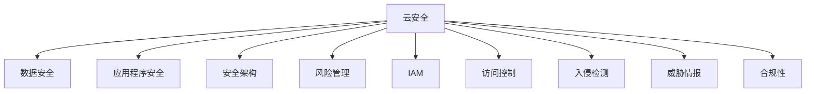

                 

# 云安全最佳实践：保护云端数据和应用程序

> 关键词：云安全,数据保护,应用程序安全,安全架构,风险管理,身份验证,密码管理,入侵检测,威胁情报,合规性

## 1. 背景介绍

### 1.1 问题由来
随着云计算的迅速普及，越来越多的企业和个人开始将数据和应用程序迁移到云平台。云环境的安全挑战也随之增加。由于云计算平台跨越不同的地域、用户和数据中心，这使得传统的网络边界不再清晰。此外，云服务提供商的服务级别协议(SLA)和责任分工也存在一定的模糊性。因此，企业需要针对云环境设计一套完整且有效的安全策略，以保障数据和应用程序的安全。

### 1.2 问题核心关键点
云安全涉及多个层面，包括基础设施安全、数据安全、应用程序安全和合规性管理。企业需要综合考虑云环境中的物理安全、网络安全、数据加密、身份验证、访问控制和威胁检测等，确保云平台能够满足业务需求并符合法规要求。

本文将从云安全架构设计、风险管理、身份验证和访问控制等角度，阐述如何构建云安全的最佳实践，以确保云端数据和应用程序的安全。

### 1.3 问题研究意义
云安全已成为企业云迁移和数字化转型中的重要一环。在数据安全事故频发的今天，确保云平台的安全性和合规性，对于保护企业资产、避免法律风险至关重要。通过合理的云安全策略，企业可以在享受云计算带来的便捷性的同时，有效降低安全风险。

## 2. 核心概念与联系

### 2.1 核心概念概述

为更好地理解云安全最佳实践，本节将介绍几个核心概念：

- 云安全(Cloud Security)：指云计算平台和相关基础设施的安全性。包括云基础设施安全、数据安全、身份验证、访问控制等。
- 数据安全(Data Security)：确保数据在存储、传输和处理过程中的机密性、完整性和可用性。
- 应用程序安全(Application Security)：保护云环境中应用程序的安全，防止恶意软件、攻击和漏洞。
- 安全架构(Security Architecture)：描述企业云环境中的安全策略、组件和流程。
- 风险管理(Risk Management)：评估和管理安全风险的过程。
- 身份验证(Identity and Access Management, IAM)：通过认证和授权确保只有授权人员才能访问云资源。
- 访问控制(Access Control)：限制用户或系统对资源的访问权限，防止未授权访问。
- 入侵检测(Intrusion Detection)：监控网络流量以检测异常行为，及时发现和响应安全威胁。
- 威胁情报(Threat Intelligence)：收集、分析和传播有关威胁和攻击的信息，帮助企业及时采取防御措施。
- 合规性(Compliance)：确保云平台和数据处理活动符合相关法规和行业标准。

这些核心概念之间的逻辑关系可以通过以下Mermaid流程图来展示：



这个流程图展示了大安全管理的各个关键环节及其相互关系：

1. 云安全是整个安全架构的核心，涉及数据安全、应用程序安全、风险管理等多个方面。
2. 数据安全是云环境中的基础，保护数据的机密性和完整性。
3. 应用程序安全关注应用程序的防护，防止攻击和漏洞。
4. 安全架构描述了如何构建和部署云环境的安全策略。
5. 风险管理用于评估和管理安全风险，确保应对措施的有效性。
6. IAM和访问控制是保障云平台访问安全的关键技术。
7. 入侵检测通过实时监控，及时发现和响应安全威胁。
8. 威胁情报提供关于当前和潜在安全威胁的信息，帮助企业提高防御能力。
9. 合规性确保企业遵循相关法规和行业标准，降低法律风险。

这些概念共同构成了云安全的全面管理体系，是构建云安全策略的基础。

## 3. 核心算法原理 & 具体操作步骤
### 3.1 算法原理概述

云安全的最佳实践通常围绕以下几个核心算法和操作步骤：

1. **数据加密**：保护数据的机密性，确保数据在传输和存储过程中不被窃取或篡改。
2. **访问控制**：通过身份验证和授权，限制用户对资源的访问权限。
3. **入侵检测**：实时监控网络流量，检测异常行为和潜在威胁。
4. **威胁情报**：收集和分析有关威胁和攻击的信息，提高防御能力。
5. **合规性管理**：确保云平台符合相关法规和标准，降低法律风险。

这些算法和技术共同构成了云安全管理的框架，旨在保护云端数据和应用程序的安全。

### 3.2 算法步骤详解

云安全的实施通常遵循以下步骤：

1. **风险评估**：评估云环境中的安全风险，包括物理安全、网络安全、数据安全等方面。
2. **架构设计**：根据风险评估结果，设计并部署云安全架构，包括数据加密、访问控制、入侵检测等组件。
3. **身份验证和访问控制**：实施IAM策略，确保只有授权人员才能访问云资源。
4. **数据加密和存储**：对敏感数据进行加密，确保数据在存储和传输过程中的机密性。
5. **入侵检测和响应**：部署入侵检测系统(IDS)，实时监控网络流量，检测异常行为和潜在威胁。
6. **威胁情报收集**：收集和分析威胁情报，了解最新的攻击手段和漏洞，及时调整安全策略。
7. **合规性管理**：确保云平台和数据处理活动符合相关法规和标准，如GDPR、HIPAA等。

### 3.3 算法优缺点

云安全最佳实践具有以下优点：

1. **综合防护**：涵盖数据安全、应用程序安全、入侵检测等多个环节，提供全面的安全保障。
2. **灵活性**：云平台具有弹性扩展能力，可以根据业务需求动态调整安全策略。
3. **成本效益**：通过自动化和集中管理，减少安全管理的复杂性和成本。
4. **合规性**：确保云平台符合相关法规和标准，降低法律风险。

同时，这些实践也存在一些局限性：

1. **依赖云服务商**：云平台的安全很大程度上依赖于云服务商的安全措施，自身无法完全控制。
2. **管理复杂**：云环境涉及多个层级和组件，管理复杂度较高。
3. **成本较高**：部署和维护高级安全组件需要投入较大的人力和资金。

### 3.4 算法应用领域

云安全最佳实践可以广泛应用于以下领域：

1. **公共云**：保护云服务提供商提供的公共云基础设施和数据。
2. **私有云**：保护企业自建或自用的私有云环境。
3. **混合云**：综合考虑公共云和私有云的安全需求。
4. **多云环境**：在不同云平台之间提供一致的安全防护。
5. **SaaS应用**：保护使用云服务的第三方应用程序。

## 4. 数学模型和公式 & 详细讲解  
### 4.1 数学模型构建

云安全管理涉及多个数学模型，本节将简要介绍几个关键模型的构建。

- **风险评估模型**：通过量化评估云环境中的安全风险，如物理安全风险、网络安全风险等。
- **入侵检测模型**：通过异常检测算法，如基于规则的检测和基于机器学习的检测，发现网络中的异常行为。
- **数据加密模型**：利用对称加密和非对称加密算法，确保数据在传输和存储过程中的安全。

### 4.2 公式推导过程

以数据加密模型为例，假设我们需要对数据进行加密和解密，可以使用以下公式：

- **对称加密**：使用相同的密钥进行加密和解密，如AES算法。
  $$
  C = E_k(P), P = D_k(C)
  $$
  其中，$C$为密文，$P$为明文，$E_k$为加密函数，$D_k$为解密函数，$k$为加密密钥。

- **非对称加密**：使用一对密钥进行加密和解密，如RSA算法。
  $$
  C = E_{pk}(P), P = D_{sk}(C)
  $$
  其中，$C$为密文，$P$为明文，$E_{pk}$为公钥加密函数，$D_{sk}$为私钥解密函数，$pk$为公钥，$sk$为私钥。

### 4.3 案例分析与讲解

在实际应用中，数据加密通常与访问控制和入侵检测结合使用。例如，在云平台上存储敏感数据时，可以采用AES对称加密算法对数据进行加密。同时，通过IAM策略，确保只有授权用户才能访问存储数据的密钥。此外，部署入侵检测系统(IDS)，监控数据传输和存储过程中的异常行为，及时发现和响应潜在的安全威胁。

## 5. 项目实践：代码实例和详细解释说明
### 5.1 开发环境搭建

在进行云安全项目实践前，我们需要准备好开发环境。以下是使用Python进行OpenSSL开发的环境配置流程：

1. 安装OpenSSL：从官网下载并安装OpenSSL，用于进行加密和解密操作。

2. 编写Python脚本：使用Python编写加密和解密函数，使用OpenSSL库进行加密和解密。

3. 测试和优化：对加密和解密函数进行测试，确保其正确性和性能，并根据需要进行优化。

完成上述步骤后，即可在Python环境中开始云安全实践。

### 5.2 源代码详细实现

下面我们以AES对称加密为例，给出使用Python进行数据加密和解密的代码实现。

```python
from Crypto.Cipher import AES
from Crypto.Random import get_random_bytes
import base64

def encrypt(data, key):
    iv = get_random_bytes(AES.block_size)
    cipher = AES.new(key, AES.MODE_CBC, iv)
    padded_data = pad(data)
    ciphertext = iv + cipher.encrypt(padded_data)
    return base64.b64encode(ciphertext).decode('utf-8')

def decrypt(ciphertext, key):
    ciphertext = base64.b64decode(ciphertext)
    iv = ciphertext[:AES.block_size]
    ciphertext = ciphertext[AES.block_size:]
    cipher = AES.new(key, AES.MODE_CBC, iv)
    plaintext = cipher.decrypt(ciphertext)
    return unpad(plaintext)

def pad(data):
    block_size = AES.block_size
    padding_len = block_size - len(data) % block_size
    padding = bytes([padding_len]) * padding_len
    return data + padding

def unpad(data):
    padding_len = data[-1]
    return data[:-padding_len]

# 测试代码
data = b'Hello, world!'
key = b'Sixteen byte key'
ciphertext = encrypt(data, key)
print('加密后的密文：', ciphertext)
plaintext = decrypt(ciphertext, key)
print('解密后的明文：', plaintext)
```

### 5.3 代码解读与分析

让我们再详细解读一下关键代码的实现细节：

**encrypt函数**：
- 使用AES算法进行加密，随机生成一个初始化向量(IV)，确保加密后的密文不可预测。
- 对明文进行填充，确保其长度为AES块大小。
- 将IV和加密后的密文进行base64编码，返回加密后的字符串。

**decrypt函数**：
- 对加密后的密文进行base64解码，分离出IV和密文。
- 使用IV和密文进行解密，得到填充后的明文。
- 对填充后的明文进行去填充，得到原始明文。

**pad和unpad函数**：
- 填充函数pad用于将明文长度扩展到AES块大小。
- 去填充函数unpad用于去除填充字节，还原原始明文。

这些函数共同构成了对称加密的基本流程，可以用于保护云平台中的敏感数据。

## 6. 实际应用场景
### 6.1 云计算平台的安全

云计算平台作为云安全的核心，其安全性和合规性直接影响到整个云环境的安全。企业需要采用多层防御策略，确保云平台的物理安全、网络安全、数据安全等各个环节。

具体而言，可以采取以下措施：

1. **物理安全**：确保云基础设施的物理环境安全，包括数据中心的安全性、火灾和电力故障的预防和处理等。
2. **网络安全**：部署防火墙、入侵检测系统(IDS)和入侵防御系统(IPS)，保护云平台的网络安全。
3. **数据安全**：对云平台中的敏感数据进行加密存储和传输，确保数据机密性和完整性。
4. **身份验证和访问控制**：使用IAM策略，确保只有授权用户才能访问云资源。
5. **合规性管理**：确保云平台符合相关法规和标准，如GDPR、HIPAA等。

通过这些措施，企业可以构建一个全面的云平台安全防护体系。

### 6.2 应用程序的安全

应用程序的安全是云安全管理中的重要一环。应用程序可能面临多种威胁，如SQL注入、跨站脚本攻击(XSS)、跨站请求伪造(CSRF)等。企业需要采取多层次的安全措施，保障应用程序的安全。

具体而言，可以采取以下措施：

1. **代码审计**：定期对应用程序代码进行审计，识别和修复潜在的安全漏洞。
2. **安全测试**：使用自动化工具进行渗透测试，发现和修复应用程序的安全问题。
3. **API安全**：保护云平台上的API接口，防止未授权访问和数据泄露。
4. **日志管理**：记录和分析应用程序的日志，及时发现和响应安全事件。
5. **威胁情报**：收集和分析威胁情报，了解最新的攻击手段和漏洞，及时调整安全策略。

通过这些措施，企业可以构建一个安全可靠的应用程序防护体系。

### 6.3 数据加密和存储

数据加密和存储是云安全管理的核心技术之一。云平台中的数据在存储和传输过程中，可能面临被窃取或篡改的风险。因此，企业需要采取多重加密措施，确保数据的安全性。

具体而言，可以采取以下措施：

1. **数据加密**：对敏感数据进行加密存储，确保数据机密性。
2. **传输加密**：使用TLS/SSL等协议，对数据传输进行加密，确保数据完整性和机密性。
3. **密钥管理**：使用非对称加密算法管理密钥，确保密钥的安全性和可控性。
4. **数据备份**：定期备份重要数据，确保数据可用性和恢复能力。
5. **数据脱敏**：对敏感数据进行脱敏处理，防止敏感数据泄露。

通过这些措施，企业可以构建一个安全可靠的数据保护体系。

### 6.4 未来应用展望

随着云技术的不断发展，云安全将面临更多新的挑战。未来，云安全将朝着以下几个方向发展：

1. **自动化和智能化**：通过AI技术实现自动化威胁检测和响应，提升安全防护的效率和准确性。
2. **多云安全管理**：在多云环境中，实现统一的安全管理和监控，确保各云平台的安全。
3. **零信任架构**：基于零信任安全模型，严格验证每个访问请求，确保访问的安全性。
4. **云原生安全**：结合云原生技术，如Kubernetes和容器化，提供更安全的应用程序和基础设施。
5. **区块链和分布式账本技术**：利用区块链和分布式账本技术，提升数据的安全性和可信度。

## 7. 工具和资源推荐
### 7.1 学习资源推荐

为了帮助开发者系统掌握云安全的最佳实践，这里推荐一些优质的学习资源：

1. 《云安全指南》系列博文：由云安全专家撰写，全面介绍云安全的基本概念、最佳实践和最新技术。
2. 《云安全高级实践》课程：由云安全权威机构开设的高级课程，涵盖云安全管理、风险评估、威胁情报等内容。
3. 《云安全技术》书籍：全面介绍云安全技术和管理策略，包括数据加密、访问控制、入侵检测等内容。
4. 《云安全实战》书籍：通过真实案例，介绍云安全的具体实现和优化方法，适合实践操作。
5. 云安全标准和规范：如ISO 27001、NIST SP 800-53、CIS Cloud Controls等，了解最新的云安全标准和最佳实践。

通过对这些资源的学习实践，相信你一定能够快速掌握云安全的最佳实践，并用于保护云平台的安全。
###  7.2 开发工具推荐

高效的开发离不开优秀的工具支持。以下是几款用于云安全开发的常用工具：

1. OpenSSL：开源的加密库，支持对称加密和非对称加密算法，是进行数据加密的基础工具。
2. AWS CloudTrail：AWS提供的日志管理服务，记录和分析API调用日志，帮助企业监控云平台的安全活动。
3. AWS Shield：AWS提供的网络保护服务，保护云平台免受DDoS攻击。
4. AWS Security Hub：AWS提供的安全管理服务，帮助企业全面评估和管理云平台的安全性。
5. AWS Key Management Service：AWS提供的密钥管理服务，帮助企业安全管理加密密钥。
6. Splunk：日志管理和分析工具，帮助企业收集、存储和分析云平台日志数据。
7. Kibana：基于Elasticsearch的开源可视化工具，帮助企业实时监控和分析云平台的安全状态。

合理利用这些工具，可以显著提升云安全管理的开发效率，加快创新迭代的步伐。

### 7.3 相关论文推荐

云安全技术的发展源于学界的持续研究。以下是几篇奠基性的相关论文，推荐阅读：

1. Cloud Computing and Security（IEEE JCS）：介绍云环境下的安全问题、技术和解决方案。
2. Data Security in the Cloud: A Survey（IEEE Transactions on Dependable and Secure Computing）：综述云平台中的数据安全问题，提出多种安全技术和策略。
3. Cloud Security Model and Practices（IEEE Security & Privacy）：提出云安全的框架和最佳实践，涵盖身份验证、数据加密、入侵检测等内容。
4. Cloud Security Solutions: An Overview（ACM Computing Surveys）：全面综述云安全解决方案，包括安全架构、访问控制、威胁情报等内容。
5. Secure Cloud Storage for Smartphones（IEEE Transactions on Mobile Computing）：提出安全的云存储方案，保护移动设备中的敏感数据。

这些论文代表了大安全管理的最新研究成果，有助于深入理解云安全技术的发展脉络。

## 8. 总结：未来发展趋势与挑战
### 8.1 总结

本文对云安全的最佳实践进行了全面系统的介绍。首先阐述了云安全的重要性和研究背景，明确了云安全管理的核心要素。其次，从云平台、应用程序和数据安全等多个方面，详细讲解了云安全的最佳实践，并给出了具体的实现方法。

通过本文的系统梳理，可以看到，云安全技术在保护云端数据和应用程序方面具有重要的作用，可以为企业的云迁移和数字化转型提供强有力的安全保障。未来，随着云技术的不断演进，云安全也将面临更多的挑战和机遇，需要持续关注和研究。

### 8.2 未来发展趋势

展望未来，云安全将呈现以下几个发展趋势：

1. **自动化和智能化**：AI技术将进一步应用于云安全管理，提升安全防护的效率和准确性。
2. **多云安全管理**：随着多云环境的应用越来越广泛，多云安全管理将成为企业的重要需求。
3. **零信任架构**：基于零信任安全模型，严格验证每个访问请求，确保访问的安全性。
4. **云原生安全**：结合云原生技术，提供更安全的应用程序和基础设施。
5. **区块链和分布式账本技术**：利用区块链和分布式账本技术，提升数据的安全性和可信度。
6. **安全意识提升**：通过教育和培训，提升员工的安全意识，降低人为因素对云安全的影响。

这些趋势将推动云安全技术的不断进步，为企业提供更安全、更可靠、更智能的云平台。

### 8.3 面临的挑战

尽管云安全技术在不断发展，但在迈向更加智能化、普适化应用的过程中，仍面临诸多挑战：

1. **依赖云服务商**：云平台的安全很大程度上依赖于云服务商的安全措施，自身无法完全控制。
2. **管理复杂**：云环境涉及多个层级和组件，管理复杂度较高。
3. **成本较高**：部署和维护高级安全组件需要投入较大的人力和资金。
4. **技术演进**：云平台和应用程序的安全需求不断变化，需要持续跟进新技术。
5. **合规风险**：云平台需要符合不同国家和地区的法规和标准，增加了合规性管理的复杂度。
6. **人为因素**：员工的安全意识和行为对云平台的安全性有重要影响，需要持续培训和教育。

正视云安全面临的这些挑战，积极应对并寻求突破，将是云安全技术迈向成熟的必由之路。相信随着学界和产业界的共同努力，这些挑战终将一一被克服，云安全技术必将在构建安全、可靠、智能的云平台中扮演越来越重要的角色。

### 8.4 研究展望

面对云安全面临的挑战，未来的研究需要在以下几个方面寻求新的突破：

1. **自动化和智能化**：开发更加智能化和安全自动化工具，减少人为因素对云安全的影响。
2. **多云安全管理**：研究跨云平台的安全策略和机制，实现多云环境的统一管理。
3. **零信任架构**：深入研究零信任安全模型，提出新的安全策略和方法。
4. **云原生安全**：研究云原生技术和安全技术的结合，提出更安全的应用程序和基础设施。
5. **区块链和分布式账本技术**：利用区块链和分布式账本技术，提升数据的安全性和可信度。
6. **安全意识提升**：通过教育和培训，提升员工的安全意识，减少人为因素对云安全的影响。

这些研究方向的探索，将引领云安全技术迈向更高的台阶，为构建安全、可靠、智能的云平台提供强有力的支持。面向未来，云安全技术还需要与其他人工智能技术进行更深入的融合，如AI技术、区块链技术等，共同推动云安全技术的进步。

## 9. 附录：常见问题与解答

**Q1：云平台的安全性和应用程序的安全性如何统一管理？**

A: 云平台和应用程序的安全性管理需要统一规划和实施。企业可以采用多层次的安全策略，确保整体的安全性。具体而言，可以采取以下措施：

1. **统一的安全策略**：制定统一的安全策略，确保云平台和应用程序的安全需求一致。
2. **统一的身份验证和访问控制**：使用统一的IAM策略，确保只有授权用户才能访问云平台和应用程序。
3. **统一的安全监控**：建立统一的安全监控体系，实时监控云平台和应用程序的安全状态。
4. **统一的安全培训**：对员工进行统一的安全培训，提升整体的安全意识和能力。

**Q2：如何保护云平台中的数据安全？**

A: 保护云平台中的数据安全，需要从多个方面进行综合考虑：

1. **数据加密**：对敏感数据进行加密存储和传输，确保数据机密性和完整性。
2. **密钥管理**：使用非对称加密算法管理密钥，确保密钥的安全性和可控性。
3. **数据备份**：定期备份重要数据，确保数据可用性和恢复能力。
4. **数据脱敏**：对敏感数据进行脱敏处理，防止敏感数据泄露。

**Q3：云平台的安全性和合规性管理如何结合？**

A: 云平台的安全性和合规性管理需要紧密结合，确保云平台符合相关法规和标准，降低法律风险。具体而言，可以采取以下措施：

1. **合规性评估**：定期进行合规性评估，确保云平台符合相关法规和标准。
2. **合规性监控**：建立合规性监控体系，实时监控云平台的安全状态和合规性。
3. **合规性培训**：对员工进行合规性培训，提升整体的安全意识和能力。
4. **合规性审计**：定期进行合规性审计，确保合规性管理的有效性。

**Q4：云安全管理和运维的复杂性如何降低？**

A: 云安全管理和运维的复杂性可以通过以下几个方面进行降低：

1. **自动化工具**：使用自动化工具进行安全管理和运维，减少人为因素对安全的影响。
2. **集中管理平台**：建立集中管理平台，实现安全策略的统一管理和监控。
3. **持续改进**：定期对安全策略进行审查和改进，确保其适应最新的安全需求。
4. **员工培训**：对员工进行安全培训，提升整体的安全意识和能力。

**Q5：云安全管理中面临的主要挑战是什么？**

A: 云安全管理中面临的主要挑战包括：

1. **依赖云服务商**：云平台的安全很大程度上依赖于云服务商的安全措施，自身无法完全控制。
2. **管理复杂**：云环境涉及多个层级和组件，管理复杂度较高。
3. **成本较高**：部署和维护高级安全组件需要投入较大的人力和资金。
4. **技术演进**：云平台和应用程序的安全需求不断变化，需要持续跟进新技术。
5. **合规风险**：云平台需要符合不同国家和地区的法规和标准，增加了合规性管理的复杂度。
6. **人为因素**：员工的安全意识和行为对云平台的安全性有重要影响，需要持续培训和教育。

这些挑战需要企业综合考虑，采取多种措施进行应对和解决。

---

作者：禅与计算机程序设计艺术 / Zen and the Art of Computer Programming

