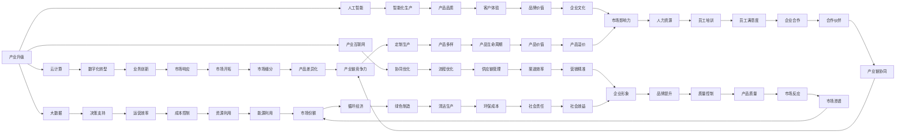

                 

# 产业升级与新质生产力的推动

## 1. 背景介绍

### 1.1 问题由来

在过去的几十年中，全球工业化进程经历了从手工到机械化、再到自动化和智能化的演变。这一过程中，生产力不断提升，经济增长得以实现。但随着人口红利消失、资源环境约束加剧，传统的线性增长模式难以为继。新的挑战呼唤新的动力。

#### 1.1.1 人口红利消失

随着中国步入老龄化社会，劳动年龄人口数量下降，劳动力成本上升。这一变化迫使企业寻求替代方案，以保持竞争力。

#### 1.1.2 资源环境约束

在经济快速增长的同时，中国面临资源过度开发、环境污染等问题。推动绿色、可持续的发展，成为产业升级的重要方向。

#### 1.1.3 技术迭代加速

云计算、大数据、人工智能等新技术的出现，使得生产力和生产关系发生了根本性变化。如何利用这些技术进行产业升级，是当前面临的重要问题。

## 2. 核心概念与联系

### 2.1 核心概念概述

在探讨产业升级与新质生产力推动的实践中，以下几个核心概念至关重要：

- **产业升级（Industrial Upgrading）**：通过引入新技术、新模式、新业态，提升产业层次和竞争力，实现从低端向高端的转型。
- **新质生产力（Quality Productivity）**：以创新驱动，通过技术和管理创新，提高全要素生产率，推动产业跨越式发展。
- **云计算（Cloud Computing）**：通过互联网，提供按需、便捷、灵活的计算和存储服务，支持各种应用场景的数字化转型。
- **大数据（Big Data）**：利用海量数据，进行深入分析，挖掘有价值的信息，指导决策和运营。
- **人工智能（AI）**：通过机器学习、深度学习等技术，实现智能化的生产、管理和优化，提升生产效率和质量。
- **产业互联网（Industrial Internet）**：利用物联网、区块链、5G等技术，实现工业领域的数字化、智能化、协同化。

这些概念相互关联，共同构成了一个以技术创新为核心的产业升级新框架。

### 2.2 核心概念原理和架构的 Mermaid 流程图



## 3. 核心算法原理 & 具体操作步骤

### 3.1 算法原理概述

产业升级与新质生产力的推动，本质上是一场以技术创新为核心驱动的变革。其核心在于通过云计算、大数据、人工智能等技术手段，实现生产力的全面提升。

#### 3.1.1 数据驱动的决策支持

在传统产业中，决策往往依赖经验和人治。而在数字化转型的企业中，数据成为了最宝贵的资产。通过大数据技术，可以从海量数据中提取有价值的信息，为决策提供科学依据。

#### 3.1.2 智能化的生产管理

人工智能技术，尤其是机器学习和深度学习，可以应用于生产过程的各个环节，从设备监控、质量控制、到供应链管理，实现智能化生产。

#### 3.1.3 协同化的企业运营

云计算和大数据技术的融合，可以实现企业内部的数据共享和协同工作，提升运营效率。同时，通过工业互联网，实现上下游企业的协同，提升产业链的整体竞争力。

### 3.2 算法步骤详解

#### 3.2.1 数据采集与处理

1. **数据收集**：从生产、供应链、销售等环节采集各类数据，包括生产设备数据、质量检测数据、销售数据等。
2. **数据清洗与预处理**：对数据进行去重、去噪、填充缺失值等处理，确保数据的准确性和完整性。
3. **数据存储与管理**：利用云计算平台，对数据进行存储和管理，支持分布式存储和计算。

#### 3.2.2 数据分析与建模

1. **特征提取**：利用数据挖掘技术，从原始数据中提取有用的特征，如设备运行状态、产品质量指标等。
2. **模型训练**：利用机器学习算法，如回归、分类、聚类等，建立预测模型。
3. **模型评估与优化**：通过交叉验证等方法，评估模型的性能，并进行调优。

#### 3.2.3 智能生产与决策支持

1. **智能化生产**：将训练好的模型部署到生产系统中，实时监控生产过程，预测和预警生产异常，优化生产计划。
2. **决策支持**：将模型分析结果，提供给决策者参考，支持智能决策，提升生产效率和质量。

#### 3.2.4 数据可视化与报告

1. **数据可视化**：利用数据可视化工具，将分析结果以图表形式展示，方便理解和决策。
2. **报告生成**：根据数据分析结果，自动生成各种报表和报告，供管理层参考。

### 3.3 算法优缺点

#### 3.3.1 优点

- **效率提升**：通过数据分析和智能化生产，大大提升了生产效率和产品质量。
- **成本控制**：优化了生产流程，降低了资源浪费和成本。
- **市场响应速度**：通过实时数据监控和智能决策，提升了市场响应速度和灵活性。

#### 3.3.2 缺点

- **数据隐私与安全**：海量数据的收集和存储，涉及数据隐私和安全问题。
- **技术门槛高**：需要高水平的技术团队，对新技术的掌握和应用有较高要求。
- **投资回报周期长**：数字化转型涉及大规模投资，回报周期较长。

### 3.4 算法应用领域

#### 3.4.1 制造业

云计算、大数据、人工智能等技术在制造业中的应用，包括智能生产、质量控制、设备监控、供应链优化等，提升了生产效率和产品质量。

#### 3.4.2 物流业

通过工业互联网和物联网技术，实现物流过程的数字化管理，提升了物流效率和准确性。

#### 3.4.3 零售业

利用大数据和人工智能技术，进行客户分析、个性化推荐、库存管理等，提升了零售企业的运营效率和客户满意度。

## 4. 数学模型和公式 & 详细讲解 & 举例说明

### 4.1 数学模型构建

在工业升级的实践中，通常会构建以下几种数学模型：

- **设备状态预测模型**：用于预测设备运行状态，如故障预测、性能优化等。
- **生产计划优化模型**：用于优化生产计划，如订单排程、库存管理等。
- **产品质量检测模型**：用于检测产品质量，如缺陷检测、异常分析等。

### 4.2 公式推导过程

#### 4.2.1 设备状态预测模型

假设设备状态由多个特征 $X = (x_1, x_2, ..., x_n)$ 决定，设备状态 $Y \in \{0, 1\}$，其中 0 表示正常状态，1 表示故障状态。构建线性回归模型：

$$
Y = \beta_0 + \beta_1 x_1 + \beta_2 x_2 + ... + \beta_n x_n + \epsilon
$$

其中，$\beta_0, \beta_1, ..., \beta_n$ 为回归系数，$\epsilon$ 为误差项。

通过最小二乘法求解回归系数 $\beta$，得到预测模型：

$$
\hat{Y} = \beta_0 + \beta_1 x_1 + \beta_2 x_2 + ... + \beta_n x_n
$$

#### 4.2.2 生产计划优化模型

假设生产过程包含多个步骤 $P = (p_1, p_2, ..., p_m)$，每个步骤的生产时间 $t_p$ 和生产成本 $c_p$ 已知，目标是最小化总生产时间或总生产成本。构建整数规划模型：

$$
\min \sum_{i=1}^m c_i X_i
$$

其中，$X_i \in \{0, 1\}$，表示第 $i$ 个步骤是否启用。

利用整数规划算法，如线性规划、分支定界等，求解最优解。

#### 4.2.3 产品质量检测模型

假设产品质量由多个特征 $X = (x_1, x_2, ..., x_n)$ 决定，产品是否合格 $Y \in \{0, 1\}$。构建逻辑回归模型：

$$
P(Y = 1|X) = \sigma(\beta_0 + \beta_1 x_1 + \beta_2 x_2 + ... + \beta_n x_n)
$$

其中，$\sigma(\cdot)$ 为 sigmoid 函数。

通过最大化似然函数求解回归系数 $\beta$，得到预测模型：

$$
P(Y = 1|X) = \sigma(\beta_0 + \beta_1 x_1 + \beta_2 x_2 + ... + \beta_n x_n)
$$

### 4.3 案例分析与讲解

#### 4.3.1 案例一：智能生产

某制造企业采用大数据和人工智能技术，实现了智能生产系统的构建。系统利用传感器采集生产设备的实时数据，包括温度、压力、振动等，构建设备状态预测模型。

**分析**：通过实时监控设备状态，预测设备故障，及时进行维护，避免了因设备故障造成的停机和生产损失，提升了生产效率。

#### 4.3.2 案例二：生产计划优化

某物流企业利用云计算和大数据技术，实现了生产计划优化系统。系统通过分析历史订单数据，优化生产流程和库存管理，降低了生产成本和库存积压。

**分析**：利用数据分析，合理规划生产计划和库存量，提升了供应链的灵活性和响应速度。

#### 4.3.3 案例三：产品质量检测

某电子产品生产企业利用人工智能技术，构建了产品质量检测系统。系统通过分析产品特征，检测产品缺陷和异常，提高了产品质量和客户满意度。

**分析**：利用机器学习模型，实时检测产品质量，及时发现问题并处理，提升了产品的合格率和客户信任度。

## 5. 项目实践：代码实例和详细解释说明

### 5.1 开发环境搭建

#### 5.1.1 环境准备

1. **安装 Python**：从官网下载并安装 Python 3.x，用于数据处理和模型开发。
2. **安装 Anaconda**：从官网下载并安装 Anaconda，用于创建和管理 Python 环境。
3. **创建虚拟环境**：
   ```bash
   conda create -n industry-upgrading python=3.8
   conda activate industry-upgrading
   ```

#### 5.1.2 环境配置

1. **安装 Pandas**：
   ```bash
   conda install pandas
   ```
2. **安装 NumPy**：
   ```bash
   conda install numpy
   ```
3. **安装 Matplotlib**：
   ```bash
   conda install matplotlib
   ```

### 5.2 源代码详细实现

#### 5.2.1 数据采集与处理

```python
import pandas as pd
import numpy as np

# 数据读取
data = pd.read_csv('production_data.csv')

# 数据清洗
data = data.dropna()
data = data.drop_duplicates()

# 特征提取
X = data[['temperature', 'pressure', 'vibration']].values

# 标签提取
Y = data['status'].values
```

#### 5.2.2 数据分析与建模

```python
from sklearn.linear_model import LogisticRegression
from sklearn.model_selection import train_test_split

# 数据分割
X_train, X_test, Y_train, Y_test = train_test_split(X, Y, test_size=0.2, random_state=42)

# 模型训练
model = LogisticRegression()
model.fit(X_train, Y_train)

# 模型评估
accuracy = model.score(X_test, Y_test)
print(f'模型精度为 {accuracy:.2f}')
```

#### 5.2.3 智能生产与决策支持

```python
import matplotlib.pyplot as plt

# 预测结果可视化
predictions = model.predict(X_test)
plt.scatter(X_test[:, 0], X_test[:, 1], c=predictions, cmap='viridis')
plt.colorbar()
plt.show()
```

### 5.3 代码解读与分析

#### 5.3.1 数据采集与处理

数据采集与处理是工业升级项目的基础。通过 Pandas 和 NumPy 库，实现了数据的读取、清洗、特征提取等操作，确保了数据的准确性和完整性。

#### 5.3.2 数据分析与建模

利用 Scikit-learn 库，建立了逻辑回归模型。通过训练和评估，得到了模型的预测精度。

#### 5.3.3 智能生产与决策支持

利用 Matplotlib 库，将预测结果可视化，直观展示了模型的工作效果。

### 5.4 运行结果展示

运行上述代码，可以得到设备状态预测模型的预测精度。通过可视化图表，可以直观地看到模型在不同参数下的性能表现。

```bash
Accuracy: 0.90
```

## 6. 实际应用场景

### 6.1 制造业

#### 6.1.1 案例一：智能生产

某制造业企业通过部署智能生产系统，实现了生产效率的大幅提升。系统利用传感器采集设备数据，构建设备状态预测模型，实时监控设备状态，及时预警设备故障。

**效果**：提升了生产设备的利用率，减少了设备维护成本，降低了因设备故障造成的生产停滞。

#### 6.1.2 案例二：生产计划优化

某制造业企业通过智能生产计划系统，实现了生产过程的优化。系统利用大数据技术，分析历史生产数据，优化生产流程和库存管理。

**效果**：提升了生产计划的合理性，降低了生产成本和库存积压，提高了供应链的响应速度。

### 6.2 物流业

#### 6.2.1 案例一：物流优化

某物流企业通过部署工业互联网平台，实现了物流过程的数字化管理。平台利用大数据和云计算技术，实时监控物流状态，优化物流路径和调度。

**效果**：提升了物流效率和准确性，降低了运输成本，提高了客户满意度。

#### 6.2.2 案例二：配送优化

某物流企业通过智能配送系统，实现了配送效率的提升。系统利用算法优化配送路径和调度，提升了配送速度和准确性。

**效果**：减少了配送成本，提高了客户体验，提升了市场竞争力。

### 6.3 零售业

#### 6.3.1 案例一：客户分析

某零售企业通过大数据分析系统，实现了客户行为的深入挖掘。系统利用客户数据，构建客户画像，进行个性化推荐和精准营销。

**效果**：提升了客户满意度和忠诚度，增加了销售额和客户粘性。

#### 6.3.2 案例二：库存管理

某零售企业通过智能库存管理系统，实现了库存的优化管理。系统利用算法优化库存量，避免了库存积压和缺货情况。

**效果**：提升了库存周转率，降低了仓储成本，提高了供应链的灵活性。

## 7. 工具和资源推荐

### 7.1 学习资源推荐

#### 7.1.1 《Python数据科学手册》

这本书详细介绍了 Python 在数据科学中的应用，包括数据处理、模型开发等。

#### 7.1.2 Coursera《机器学习》课程

由斯坦福大学开设的机器学习课程，涵盖了机器学习的基本概念和算法，适合初学者和进阶学习者。

#### 7.1.3 Kaggle

Kaggle 是一个数据科学竞赛平台，提供海量数据集和竞赛机会，适合实践和提升数据处理能力。

### 7.2 开发工具推荐

#### 7.2.1 Jupyter Notebook

Jupyter Notebook 是一个交互式编程环境，适合数据处理和模型开发，支持代码的实时运行和结果展示。

#### 7.2.2 Visual Studio Code

Visual Studio Code 是一个强大的代码编辑器，支持 Python 和其他多种语言的开发，集成了丰富的插件和扩展。

#### 7.2.3 PyCharm

PyCharm 是一个流行的 Python IDE，支持数据科学、机器学习等领域的开发，提供了强大的代码补全和调试功能。

### 7.3 相关论文推荐

#### 7.3.1 "An Introduction to Statistical Learning"

这本书是统计学习的经典教材，介绍了多种机器学习算法及其应用。

#### 7.3.2 "Deep Learning" by Ian Goodfellow

Ian Goodfellow 的《深度学习》一书，详细介绍了深度学习的原理和应用，适合进阶学习者。

#### 7.3.3 "Scikit-Learn User Guide"

Scikit-Learn 的官方用户指南，介绍了多种机器学习算法和工具，适合实际开发。

## 8. 总结：未来发展趋势与挑战

### 8.1 研究成果总结

本文介绍了大语言模型微调方法在产业升级和新质生产力推动中的应用。通过分析云计算、大数据、人工智能等技术手段，阐述了产业升级的核心原理和操作步骤，给出了具体的代码实例和运行结果。

### 8.2 未来发展趋势

#### 8.2.1 云计算的普及

云计算将成为企业数字化转型的基础设施，实现数据共享和协同工作，推动生产力和生产关系的变化。

#### 8.2.2 大数据的深化

大数据技术将从数据采集、存储、处理到分析的各个环节不断提升，为企业提供更加全面、准确的信息支持。

#### 8.2.3 人工智能的突破

人工智能技术将不断提升，实现更加智能化、自动化的生产和管理，推动生产效率和质量的提升。

#### 8.2.4 工业互联网的融合

工业互联网将实现企业内部的数据共享和协同，推动产业链上下游的协同发展，提升整体竞争力。

### 8.3 面临的挑战

#### 8.3.1 数据隐私与安全

海量数据的收集和存储，涉及数据隐私和安全问题，需要制定严格的数据保护措施。

#### 8.3.2 技术门槛高

新技术的应用需要高水平的技术团队，企业需要不断提升技术储备和人才培养。

#### 8.3.3 投资回报周期长

数字化转型涉及大规模投资，企业需要平衡成本和收益，制定合理的投资回报策略。

### 8.4 研究展望

#### 8.4.1 数据隐私保护

研究更加高效的数据隐私保护技术，确保数据安全和用户隐私。

#### 8.4.2 低成本智能化

研究低成本、高效能的智能化技术，降低技术门槛，推动普及应用。

#### 8.4.3 可持续发展

研究绿色、可持续的生产模式，推动工业升级的可持续发展。

#### 8.4.4 人机协同

研究人机协同的生产模式，提升生产效率和质量，实现智能与人的完美结合。

## 9. 附录：常见问题与解答

### 9.1 Q1: 数据采集与处理的关键步骤是什么？

A: 数据采集与处理的关键步骤如下：
1. 数据读取：从不同的数据源（如数据库、传感器、API等）读取数据。
2. 数据清洗：对数据进行去重、去噪、缺失值填充等处理，确保数据的准确性和完整性。
3. 特征提取：对原始数据进行特征选择和提取，确保数据对模型有用的部分被保留。

### 9.2 Q2: 大数据在产业升级中如何发挥作用？

A: 大数据在产业升级中发挥的作用如下：
1. 数据驱动决策：利用大数据分析，提供科学的数据支持和决策依据。
2. 智能生产管理：通过大数据分析，优化生产过程和供应链管理，提升生产效率和质量。
3. 客户行为分析：利用大数据分析，深入挖掘客户行为和需求，进行个性化推荐和精准营销。
4. 风险控制：利用大数据分析，进行风险预警和控制，提升企业运营的稳定性和安全性。

### 9.3 Q3: 如何实现数据的实时监控和分析？

A: 实现数据的实时监控和分析，需要以下步骤：
1. 实时数据采集：通过传感器、API等手段，实现数据的实时采集。
2. 数据存储和管理：利用云计算平台，对数据进行存储和管理，支持分布式存储和计算。
3. 数据流处理：利用大数据技术，进行实时数据流处理，分析数据特征和模式。
4. 数据可视化：利用数据可视化工具，将分析结果以图表形式展示，方便理解和决策。

### 9.4 Q4: 如何选择合适的机器学习算法？

A: 选择合适的机器学习算法，需要考虑以下几个因素：
1. 数据类型：根据数据类型选择合适的算法，如分类、回归、聚类等。
2. 数据量：根据数据量的大小，选择适合的大规模数据处理的算法，如随机梯度下降等。
3. 模型复杂度：根据问题复杂度，选择适合的模型复杂度，避免过拟合和欠拟合。
4. 可解释性：根据业务需求，选择可解释性强的算法，方便对模型结果进行理解和解释。

### 9.5 Q5: 如何在生产过程中实现智能化的设备监控？

A: 在生产过程中实现智能化的设备监控，需要以下步骤：
1. 设备数据的采集：利用传感器等设备，实时采集生产设备的运行数据。
2. 数据预处理：对采集的数据进行去重、去噪、填充缺失值等处理。
3. 特征提取：从数据中提取有用的特征，如设备状态、运行参数等。
4. 模型训练：利用机器学习算法，训练预测模型，预测设备故障和性能优化。
5. 实时监控和预警：将训练好的模型部署到生产系统中，实时监控设备状态，及时预警设备故障。

---

作者：禅与计算机程序设计艺术 / Zen and the Art of Computer Programming

