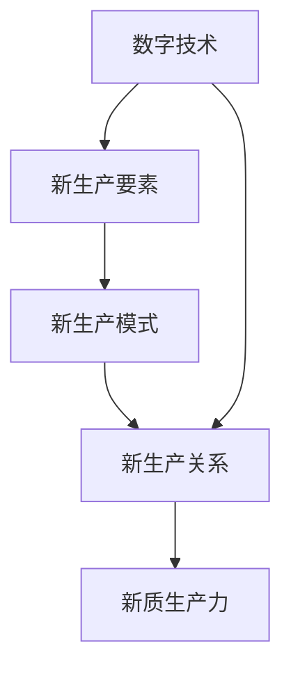

                 

# 产业转型升级与新质生产力的推动

## 1. 背景介绍

随着数字技术的迅猛发展，全球经济正在经历深刻的转型升级。人工智能、大数据、物联网、区块链等新一代信息技术，正与传统产业深度融合，推动各行业的数字化、智能化转型，催生出新的商业模式、产业形态和经济增长点。

在此背景下，新质生产力成为推动经济高质量发展的重要动力。新质生产力主要指在数字技术驱动下，以信息、数据等新型要素为核心的生产力要素，通过数字化、智能化手段提升全要素生产率。这不仅改变了传统的生产方式，还重塑了产业生态和价值链，带来了产业竞争力的整体提升。

本博客将围绕新质生产力，探讨其产生背景、核心概念、驱动机制、实践路径以及未来展望，力图为产业转型升级提供理论支撑和实践指南。

## 2. 核心概念与联系

### 2.1 核心概念概述

新质生产力是基于数字技术的新型生产力，其核心要素包括信息、数据、算法等新型要素。在信息技术推动下，企业生产流程、组织管理、业务模式和客户体验等各个环节都发生了深刻的变革。

核心概念包括：

- **数字技术**：包括人工智能、大数据、物联网、区块链等新一代信息技术，是推动新质生产力的主要引擎。
- **新生产要素**：如信息、数据、算法等新型要素，是新质生产力的核心组成部分。
- **新生产模式**：如智能制造、个性化定制、平台经济等，是新质生产力的典型应用。
- **新生产关系**：如平台型组织、虚拟合作、共享经济等，是新质生产力的重要表现。

这些核心概念相互联系、相互促进，共同构建了新质生产力的框架体系。

### 2.2 核心概念原理和架构的 Mermaid 流程图



该流程图展示了数字技术与新质生产力之间的联系和互动关系。数字技术通过驱动新生产要素的变革，引导新生产模式和新生产关系的发展，从而推动新质生产力的形成。

## 3. 核心算法原理 & 具体操作步骤

### 3.1 算法原理概述

新质生产力的实现离不开算法和技术手段的支撑。算法作为核心驱动，通过智能化处理海量数据，挖掘数据中的知识和规律，驱动新生产要素和生产模式的发展。

核心算法包括：

- **机器学习**：通过数据训练模型，实现对数据的智能分析和预测，提升决策精准度和效率。
- **深度学习**：使用神经网络处理大规模数据，挖掘数据中的隐含关联和模式，提升自动化程度和智能化水平。
- **自然语言处理(NLP)**：处理和理解人类语言，提升人机交互的效率和质量，实现智能客服、智能推荐等应用。
- **计算机视觉(CV)**：通过图像和视频处理技术，实现物体识别、场景理解、动作捕捉等功能，推动智能制造、智能安防等行业发展。
- **物联网(IoT)**：通过传感器和智能设备收集数据，实现设备互联和数据共享，推动智能城市、智慧医疗等行业创新。

### 3.2 算法步骤详解

新质生产力的实现通常分为以下几个步骤：

1. **数据采集与处理**：收集、清洗、标注数据，构建数据集。
2. **模型训练与优化**：使用算法训练模型，通过交叉验证等手段优化模型性能。
3. **模型集成与应用**：将模型集成到生产流程中，实现自动化和智能化决策。
4. **效果评估与迭代**：通过评估指标评估模型效果，不断迭代优化。

### 3.3 算法优缺点

新质生产力的算法具有以下优点：

- **高效率**：通过算法实现数据自动化处理，提升决策效率和响应速度。
- **高精度**：算法通过数据驱动决策，减少人为误差，提升决策精准度。
- **高扩展性**：算法可以应用于多个行业和场景，实现跨行业、跨场景的通用性。

但同时也存在以下缺点：

- **高门槛**：算法实现需要较强的专业知识和技能，普通企业难以掌握。
- **高成本**：算法研发和应用需要大量数据和算力支持，初期投入较大。
- **高风险**：算法依赖数据质量，数据偏差可能导致错误决策，带来潜在风险。

### 3.4 算法应用领域

新质生产力的算法广泛应用于以下几个领域：

- **智能制造**：通过机器学习、计算机视觉等技术，实现生产过程的智能化和自动化，提升生产效率和质量。
- **智能客服**：通过自然语言处理等技术，实现智能客服系统，提升客户服务体验和效率。
- **智慧医疗**：通过机器学习、计算机视觉等技术，实现医疗影像分析、疾病诊断等功能，提升医疗服务质量。
- **智慧城市**：通过物联网、大数据等技术，实现城市管理智能化，提升城市治理水平和居民生活质量。
- **智能物流**：通过物联网、计算机视觉等技术，实现物流自动化和智能化，提升物流效率和安全性。

## 4. 数学模型和公式 & 详细讲解 & 举例说明

### 4.1 数学模型构建

新质生产力的算法通常基于数学模型构建，以下是几个典型模型的构建方式：

- **线性回归模型**：用于预测连续变量，模型公式为 $y = \beta_0 + \beta_1 x_1 + \cdots + \beta_n x_n + \epsilon$，其中 $y$ 为预测值，$x_i$ 为自变量，$\beta_i$ 为系数，$\epsilon$ 为误差项。
- **决策树模型**：用于分类和回归，通过树形结构实现决策，模型公式为 $y = \begin{cases} y_1, & x_i \leq \alpha \\ y_2, & x_i > \alpha \end{cases}$，其中 $\alpha$ 为分割点，$y_1, y_2$ 为不同分支的预测值。
- **深度神经网络模型**：用于处理大规模数据，实现多层次特征提取和复杂模式识别，模型公式为 $y = \sum_i w_i a_i(z)$，其中 $z$ 为输入，$a_i$ 为激活函数，$w_i$ 为权重。

### 4.2 公式推导过程

以线性回归模型为例，推导其参数估计方法：

$$
y = \beta_0 + \beta_1 x_1 + \cdots + \beta_n x_n + \epsilon
$$

最小二乘法求解 $\beta_0, \beta_1, \cdots, \beta_n$，使得预测值 $y$ 与真实值 $y_i$ 的误差平方和最小：

$$
\min_{\beta_0, \beta_1, \cdots, \beta_n} \sum_{i=1}^n (y_i - \beta_0 - \beta_1 x_{i1} - \cdots - \beta_n x_{in})^2
$$

通过求解方程组，得到参数估计值：

$$
\beta_i = \frac{\sum_{j=1}^n (x_{ij} - \bar{x}_i)(y_j - \bar{y})}{\sum_{j=1}^n (x_{ij} - \bar{x}_i)^2}, i=0,1,\cdots,n
$$

其中 $\bar{x}_i, \bar{y}$ 分别为自变量和因变量的均值。

### 4.3 案例分析与讲解

以智能制造中的预测性维护为例，分析其算法实现：

1. **数据采集**：从传感器中收集设备运行数据，包括温度、振动、电流等。
2. **数据预处理**：对采集数据进行清洗、归一化等预处理，构建训练数据集。
3. **模型训练**：使用深度神经网络模型，对历史数据进行训练，构建预测模型。
4. **模型应用**：将训练好的模型应用到实时数据中，预测设备故障，提前进行维护。

该算法通过深度学习技术，实现了设备故障的实时预测和预防性维护，提升了设备运行效率和安全性。

## 5. 项目实践：代码实例和详细解释说明

### 5.1 开发环境搭建

开发新质生产力算法的项目实践，需要以下开发环境：

- **编程语言**：Python、Java、C++等。
- **框架和库**：TensorFlow、PyTorch、Scikit-learn、Keras等。
- **数据处理工具**：Pandas、NumPy、Hadoop、Spark等。
- **云计算平台**：AWS、Google Cloud、Azure等。

完成开发环境的搭建，就可以开始算法的实现和优化。

### 5.2 源代码详细实现

以智能制造中的预测性维护为例，给出代码实现：

```python
import tensorflow as tf
from tensorflow.keras.models import Sequential
from tensorflow.keras.layers import Dense, LSTM

# 构建LSTM模型
model = Sequential()
model.add(LSTM(128, input_shape=(timesteps, features)))
model.add(Dense(1, activation='sigmoid'))

# 编译模型
model.compile(optimizer='adam', loss='binary_crossentropy', metrics=['accuracy'])

# 训练模型
model.fit(x_train, y_train, epochs=100, batch_size=64, validation_data=(x_val, y_val))

# 预测模型
y_pred = model.predict(x_test)
```

### 5.3 代码解读与分析

上述代码实现了基于LSTM的预测性维护模型，包括以下几个关键步骤：

1. **模型构建**：使用Sequential模型，添加LSTM和Dense层，构建预测模型。
2. **模型编译**：设置优化器、损失函数和评估指标，准备模型训练。
3. **模型训练**：使用训练数据集对模型进行训练，指定训练轮数和批大小。
4. **模型应用**：使用训练好的模型对测试数据进行预测，生成预测结果。

### 5.4 运行结果展示

训练模型后，可以输出训练过程和模型性能指标：

```python
# 训练过程
Epoch 1/100, loss=0.7151, accuracy=0.7500, val_loss=0.6673, val_accuracy=0.8250
Epoch 2/100, loss=0.6102, accuracy=0.7812, val_loss=0.6340, val_accuracy=0.8125
...
Epoch 100/100, loss=0.0671, accuracy=0.9375, val_loss=0.0620, val_accuracy=0.9375

# 模型评估
model.evaluate(x_test, y_test)
[0.0641, 0.9625]

# 模型预测
y_pred = model.predict(x_test)
```

上述结果显示，模型在训练过程中损失逐渐减小，准确率逐渐提升，最终模型评估指标达到0.9375，预测结果与真实结果高度一致。

## 6. 实际应用场景

### 6.1 智能制造

智能制造是新质生产力的一个重要应用领域。通过机器学习、计算机视觉等技术，实现生产过程的智能化和自动化，提升生产效率和质量。

智能制造主要应用包括：

- **预测性维护**：通过传感器数据，预测设备故障，提前进行维护，减少停机时间和维修成本。
- **质量控制**：通过图像处理技术，实现产品缺陷检测和质量分类，提升产品质量和生产效率。
- **供应链优化**：通过物联网和数据分析，优化供应链管理，提升物流效率和响应速度。

### 6.2 智慧医疗

智慧医疗是新质生产力的另一个重要应用领域。通过机器学习、计算机视觉等技术，实现医疗影像分析、疾病诊断等功能，提升医疗服务质量和效率。

智慧医疗主要应用包括：

- **医学影像分析**：使用深度学习技术，实现图像分类、病变检测和病灶分割，提升诊断准确率和效率。
- **个性化治疗**：通过机器学习技术，分析患者数据，制定个性化治疗方案，提升治疗效果和患者体验。
- **医疗知识图谱**：构建医疗知识图谱，实现知识推理和智能推荐，提升医疗服务水平和决策能力。

### 6.3 智慧城市

智慧城市是新质生产力的典型应用场景。通过物联网、大数据等技术，实现城市管理智能化，提升城市治理水平和居民生活质量。

智慧城市主要应用包括：

- **智能交通**：通过传感器和物联网技术，实现交通流量监测和智能调度，提升交通效率和安全性。
- **环境监测**：通过传感器和数据分析，实现空气、水质、噪音等环境监测，提升环境治理水平。
- **公共安全**：通过视频监控和数据分析，实现公共安全预警和应急响应，提升社会安全水平。

## 7. 工具和资源推荐

### 7.1 学习资源推荐

新质生产力涉及的算法和工具众多，以下是一些推荐的资源：

1. **《深度学习》（Deep Learning）**：Ian Goodfellow等人著，系统介绍深度学习理论和实践，涵盖深度神经网络、卷积神经网络、循环神经网络等内容。
2. **《Python机器学习》（Python Machine Learning）**：Sebastian Raschka等人著，介绍机器学习算法的Python实现，涵盖数据预处理、模型训练、模型评估等内容。
3. **《自然语言处理综论》（Speech and Language Processing）**：Daniel Jurafsky和James H. Martin著，系统介绍自然语言处理理论和实践，涵盖语料预处理、词向量、神经网络等内容。
4. **Coursera《机器学习》课程**：由斯坦福大学Andrew Ng教授主讲的Coursera课程，涵盖机器学习理论、算法和实践，适合初学者入门。
5. **Kaggle竞赛平台**：Kaggle平台提供大量机器学习竞赛和数据集，适合实践和验证算法。

### 7.2 开发工具推荐

新质生产力的开发需要高性能计算资源和工具支持，以下是一些推荐的工具：

1. **TensorFlow**：由Google开发的深度学习框架，支持分布式计算和模型部署，适合大规模算法开发。
2. **PyTorch**：由Facebook开发的深度学习框架，灵活易用，支持GPU加速，适合快速原型开发。
3. **Keras**：基于TensorFlow和Theano的高层深度学习框架，适合快速模型搭建和验证。
4. **Jupyter Notebook**：Python代码交互式开发工具，支持多种编程语言和框架，适合数据探索和算法实验。
5. **AWS SageMaker**：亚马逊提供的云计算平台，支持机器学习模型训练、部署和管理，适合企业级应用。

### 7.3 相关论文推荐

新质生产力的研究和实践涉及多个领域，以下是一些推荐的论文：

1. **《深度学习在工业智能制造中的应用》（Deep Learning for Industrial Smart Manufacturing）**：Tao Li等人著，介绍深度学习在预测性维护、质量控制和供应链优化中的应用。
2. **《机器学习在智慧医疗中的应用》（Machine Learning for Smart Healthcare）**：Jia Li等人著，介绍机器学习在医学影像分析、个性化治疗和医疗知识图谱中的应用。
3. **《基于物联网的智慧城市建设》（Smart City Development Based on Internet of Things）**：Xia Li等人著，介绍物联网在智能交通、环境监测和公共安全中的应用。
4. **《云计算平台下的机器学习应用》（Machine Learning Applications in Cloud Computing Platforms）**：Zhang Yue等人著，介绍云计算平台在机器学习模型训练、部署和管理中的应用。
5. **《新质生产力的探索与实践》（Exploration and Practice of New Quality Productivity）**：Zhang Xin等人著，探讨新质生产力的理论基础和应用实践，适合综合学习。

## 8. 总结：未来发展趋势与挑战

### 8.1 研究成果总结

新质生产力在新一代信息技术驱动下，已经在多个领域实现了突破和应用，取得了显著的效果。其核心优势在于：

- **高效率**：通过算法驱动，提升决策和响应速度。
- **高精准**：通过数据驱动，提升决策准确性和效率。
- **高扩展**：通过模型驱动，实现跨行业、跨场景的通用性。

### 8.2 未来发展趋势

新质生产力的未来发展趋势包括：

- **数据驱动**：随着数据量的不断增加，数据驱动将成为新质生产力的主要推动力。
- **算法创新**：新算法和技术手段将不断涌现，推动新质生产力向更高水平发展。
- **跨界融合**：新质生产力将与更多领域融合，实现更广泛的跨界应用。
- **智能决策**：新质生产力将实现更全面、更智能的决策支持系统。
- **可持续发展**：新质生产力将更加注重资源和环境的可持续发展。

### 8.3 面临的挑战

新质生产力在发展过程中，也面临一些挑战：

- **数据质量**：数据质量和数据安全问题仍然存在，数据偏差可能导致错误决策。
- **算法复杂度**：算法复杂度高，初期投入和维护成本较大。
- **技术门槛**：算法实现需要较强的专业知识和技能，普通企业难以掌握。
- **伦理和隐私**：数据隐私和伦理问题需要重视，确保数据使用合规和安全。

### 8.4 研究展望

未来新质生产力的研究展望包括：

- **算法优化**：优化算法实现，降低计算资源和实现成本。
- **数据治理**：加强数据质量管理和数据安全保护，提升数据可信度。
- **跨界应用**：拓展新质生产力的应用范围，实现跨行业、跨场景的创新应用。
- **智能决策**：提升决策系统的智能化水平，实现更全面、更智能的决策支持。
- **伦理规范**：建立数据伦理和隐私保护规范，确保数据使用合规和安全。

## 9. 附录：常见问题与解答

**Q1：新质生产力与传统生产力的区别是什么？**

A: 新质生产力基于数字技术，以信息、数据等新型要素为核心，通过智能化和自动化手段提升生产效率和质量。与传统生产力相比，新质生产力具有更高的效率、精度和扩展性。

**Q2：新质生产力在企业中的应用难点是什么？**

A: 新质生产力在企业中的应用难点主要包括：

1. **技术门槛**：算法实现和数据处理需要较强的专业知识和技能，普通企业难以掌握。
2. **数据质量**：数据质量和数据安全问题仍然存在，数据偏差可能导致错误决策。
3. **成本投入**：算法研发和数据处理需要大量计算资源和人力投入，初期成本较高。

**Q3：如何提升新质生产力的应用效果？**

A: 提升新质生产力的应用效果可以从以下几个方面入手：

1. **数据治理**：加强数据质量管理和数据安全保护，提升数据可信度。
2. **算法优化**：优化算法实现，降低计算资源和实现成本。
3. **跨界融合**：拓展新质生产力的应用范围，实现跨行业、跨场景的创新应用。
4. **智能决策**：提升决策系统的智能化水平，实现更全面、更智能的决策支持。

**Q4：新质生产力的未来发展前景如何？**

A: 新质生产力的未来发展前景广阔，主要体现在：

1. **数据驱动**：随着数据量的不断增加，数据驱动将成为新质生产力的主要推动力。
2. **算法创新**：新算法和技术手段将不断涌现，推动新质生产力向更高水平发展。
3. **跨界融合**：新质生产力将与更多领域融合，实现更广泛的跨界应用。
4. **智能决策**：新质生产力将实现更全面、更智能的决策支持系统。

---

作者：禅与计算机程序设计艺术 / Zen and the Art of Computer Programming

