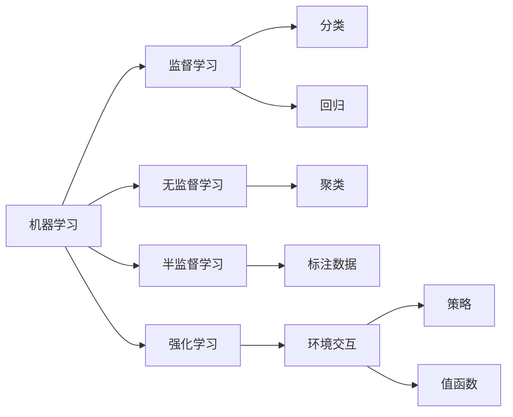

                 

# 人工智能(Artificial Intelligence) - 原理与代码实例讲解

> 关键词：人工智能,机器学习,深度学习,自然语言处理,NLP,深度强化学习,计算机视觉,代码实例

## 1. 背景介绍

### 1.1 问题由来
近年来，人工智能(Artificial Intelligence, AI)技术迅速发展，并在多个领域取得了令人瞩目的成果。从最初的简单决策支持系统，到如今的深度学习大模型和强化学习应用，AI技术的进步正在改变我们的生活方式和工作方式。然而，尽管AI在理论和应用上取得了很多进展，其核心原理和实现机制仍存在诸多挑战和难点。本博客将系统地介绍人工智能的原理，并通过代码实例详细讲解其实现过程。

### 1.2 问题核心关键点
本文将聚焦于以下几个核心关键点：

- 人工智能的演进历史
- 机器学习与深度学习的区别
- 自然语言处理(NLP)的应用实例
- 深度强化学习的原理与代码实现
- 计算机视觉领域的常用技术
- 如何通过代码实例理解和掌握人工智能

通过全面系统的介绍和实例讲解，我们希望能帮助读者深入理解AI的各个层面，掌握其核心技术和实现方法。

## 2. 核心概念与联系

### 2.1 核心概念概述

为更好地理解人工智能技术，本节将介绍几个关键概念，并通过Mermaid流程图展示它们之间的关系：



- **机器学习(Machine Learning, ML)**：通过对数据进行训练，使计算机能够从数据中学习规律，从而对新数据进行预测或决策的技术。
- **监督学习(Supervised Learning)**：使用标注数据进行训练，模型学习从输入到输出的映射关系。
- **无监督学习(Unsupervised Learning)**：使用未标注数据进行训练，模型自行发现数据中的结构和模式。
- **半监督学习(Semi-supervised Learning)**：结合少量标注数据和大量未标注数据进行训练，以提高学习效率。
- **强化学习(Reinforcement Learning, RL)**：模型在环境中与目标交互，通过试错学习最优策略。
- **分类(Classification)**：将输入数据分成不同的类别。
- **回归(Regression)**：预测连续的数值型输出。
- **聚类(Clustering)**：将相似的样本分为一组。
- **策略(Policy)**：模型在环境中采取的行动规则。
- **值函数(Value Function)**：评估每个状态的价值，指导模型采取最优行动。

### 2.2 核心概念原理和架构

#### 2.2.1 机器学习
机器学习是通过训练数据集来构建模型，并用其进行预测或决策的过程。其核心原理包括以下几个步骤：

1. **数据准备**：收集和预处理训练数据。
2. **模型训练**：通过优化算法，调整模型参数，使其能够拟合数据分布。
3. **模型评估**：使用测试数据评估模型的性能。
4. **模型应用**：将训练好的模型应用于实际问题。

#### 2.2.2 深度学习
深度学习是机器学习的一种特殊形式，它使用多层神经网络来构建复杂模型，并通过反向传播算法进行训练。深度学习的核心原理包括以下几个步骤：

1. **网络结构设计**：设计多层神经网络结构，包括输入层、隐藏层和输出层。
2. **损失函数选择**：根据任务类型选择合适的损失函数。
3. **优化算法选择**：选择合适的优化算法（如梯度下降、Adam等）进行模型训练。
4. **正则化技术**：使用L2正则、Dropout等技术防止过拟合。
5. **模型调参**：调整学习率、批大小等超参数，优化模型性能。

#### 2.2.3 自然语言处理(NLP)
自然语言处理是研究如何让计算机理解、处理和生成自然语言的技术。NLP的核心原理包括以下几个步骤：

1. **分词**：将文本分割成词语。
2. **词向量表示**：将词语转换为向量形式。
3. **语言模型训练**：训练语言模型，预测下一个词的概率分布。
4. **文本分类**：将文本分类为不同的类别。
5. **命名实体识别**：识别文本中的实体（人名、地名、组织名等）。
6. **机器翻译**：将一种语言的文本翻译成另一种语言。
7. **情感分析**：分析文本的情感倾向。

#### 2.2.4 深度强化学习
深度强化学习是强化学习的一种形式，它使用深度神经网络来构建代理模型，通过试错学习最优策略。深度强化学习的核心原理包括以下几个步骤：

1. **环境建模**：定义环境的状态和动作空间。
2. **策略更新**：通过与环境的交互，更新策略。
3. **值函数学习**：估计每个状态的价值，指导策略更新。
4. **奖励函数设计**：设计奖励函数，引导策略学习。
5. **探索与利用**：平衡探索新状态和利用已知状态。

## 3. 核心算法原理 & 具体操作步骤

### 3.1 算法原理概述

本节将详细介绍机器学习、深度学习、NLP和强化学习的核心算法原理，并通过代码实例进行说明。

#### 3.1.1 机器学习
机器学习的核心算法包括线性回归、逻辑回归、决策树、支持向量机等。以线性回归为例，其基本原理是通过最小二乘法拟合数据，构建一个线性模型，预测连续的数值型输出。

#### 3.1.2 深度学习
深度学习的核心算法包括卷积神经网络(CNN)、循环神经网络(RNN)、长短时记忆网络(LSTM)等。以CNN为例，其基本原理是通过多层卷积和池化操作提取图像特征，并通过全连接层进行分类或回归预测。

#### 3.1.3 自然语言处理(NLP)
NLP的核心算法包括词向量表示、循环神经网络、注意力机制等。以词向量表示为例，其基本原理是通过训练语言模型，将词语转换为向量形式，从而实现词语的相似度比较和语义分析。

#### 3.1.4 深度强化学习
深度强化学习的核心算法包括Q-learning、策略梯度方法、Actor-Critic等。以Q-learning为例，其基本原理是通过与环境的交互，更新Q值函数，指导模型采取最优行动。

### 3.2 算法步骤详解

#### 3.2.1 机器学习
线性回归的算法步骤如下：

1. **数据准备**：收集训练数据 $(x_i,y_i)$，其中 $x_i$ 为输入特征，$y_i$ 为输出标签。
2. **模型定义**：定义线性回归模型 $y = \theta^T x$，其中 $\theta$ 为模型参数。
3. **损失函数定义**：定义损失函数 $L(\theta) = \frac{1}{2}\sum_{i=1}^N (y_i - \theta^T x_i)^2$。
4. **梯度下降**：使用梯度下降算法更新模型参数，迭代优化损失函数。
5. **模型评估**：使用测试数据评估模型性能，计算均方误差等指标。

#### 3.2.2 深度学习
卷积神经网络(CNN)的算法步骤如下：

1. **数据准备**：收集图像数据 $(x_i,y_i)$，其中 $x_i$ 为输入图像，$y_i$ 为输出标签。
2. **模型定义**：定义CNN模型，包括卷积层、池化层和全连接层。
3. **损失函数定义**：定义交叉熵损失函数 $L(\theta) = -\frac{1}{N}\sum_{i=1}^N y_i \log \hat{y_i}$，其中 $\hat{y_i}$ 为模型输出。
4. **优化算法选择**：选择Adam优化算法进行模型训练。
5. **正则化技术**：使用L2正则、Dropout等技术防止过拟合。
6. **模型调参**：调整学习率、批大小等超参数，优化模型性能。

#### 3.2.3 自然语言处理(NLP)
词向量表示的算法步骤如下：

1. **数据准备**：收集训练数据，将每个词语转换为一个one-hot向量。
2. **模型定义**：定义词向量模型，包括输入层、隐藏层和输出层。
3. **损失函数定义**：定义语言模型的交叉熵损失函数 $L(\theta) = -\frac{1}{N}\sum_{i=1}^N \log P(x_i)$，其中 $P(x_i)$ 为模型输出概率分布。
4. **梯度下降**：使用梯度下降算法更新模型参数，迭代优化损失函数。
5. **模型评估**：使用测试数据评估模型性能，计算困惑度等指标。

#### 3.2.4 深度强化学习
Q-learning的算法步骤如下：

1. **环境建模**：定义环境的状态和动作空间。
2. **模型定义**：定义Q值函数 $Q(s,a) = \theta^T f(s,a)$，其中 $f(s,a)$ 为状态-动作表示函数。
3. **策略更新**：通过与环境的交互，更新Q值函数，指导模型采取最优行动。
4. **值函数学习**：使用Q-learning算法更新Q值函数，最大化累计奖励。
5. **奖励函数设计**：设计奖励函数，引导策略学习。
6. **探索与利用**：平衡探索新状态和利用已知状态。

### 3.3 算法优缺点

#### 3.3.1 机器学习
优点：
- 算法简单，易于实现。
- 可以处理多种类型的数据。

缺点：
- 需要手动设计特征。
- 对大规模数据集训练时间长。

#### 3.3.2 深度学习
优点：
- 可以自动提取特征。
- 可以处理复杂的多维数据。

缺点：
- 训练时间较长。
- 需要大量标注数据。

#### 3.3.3 自然语言处理(NLP)
优点：
- 可以处理文本数据。
- 可以自动生成文本。

缺点：
- 需要大量标注数据。
- 对新领域数据泛化能力有限。

#### 3.3.4 深度强化学习
优点：
- 可以处理动态环境。
- 可以学习复杂策略。

缺点：
- 需要大量试错。
- 对环境建模要求高。

## 4. 数学模型和公式 & 详细讲解

### 4.1 数学模型构建

本节将使用数学语言对机器学习、深度学习、NLP和强化学习的核心算法进行严格刻画。

#### 4.1.1 线性回归
线性回归的数学模型为：

$$y_i = \theta^T x_i + \epsilon_i$$

其中 $y_i$ 为输出标签，$x_i$ 为输入特征，$\theta$ 为模型参数，$\epsilon_i$ 为噪声。

#### 4.1.2 卷积神经网络(CNN)
卷积神经网络的数学模型为：

$$h_i = f(x_i,W_i)$$

其中 $x_i$ 为输入图像，$W_i$ 为卷积核，$f$ 为激活函数。

#### 4.1.3 词向量表示
词向量表示的数学模型为：

$$P(x_i) = \frac{e^{\theta^T \log f(x_i)}}{\sum_{x_j} e^{\theta^T \log f(x_j)}}$$

其中 $P(x_i)$ 为模型输出概率分布，$\theta$ 为模型参数，$f(x_i)$ 为状态表示函数。

#### 4.1.4 Q-learning
Q-learning的数学模型为：

$$Q(s_t,a_t) = (1-\alpha)Q(s_t,a_t) + \alpha(r_t + \gamma \max_{a'} Q(s_{t+1},a'))$$

其中 $s_t$ 为当前状态，$a_t$ 为当前动作，$r_t$ 为即时奖励，$\gamma$ 为折扣因子，$\alpha$ 为学习率，$Q(s_{t+1},a')$ 为下一个状态的最大Q值。

### 4.2 公式推导过程

#### 4.2.1 线性回归
线性回归的损失函数推导如下：

$$L(\theta) = \frac{1}{2}\sum_{i=1}^N (y_i - \theta^T x_i)^2$$

通过求导，可以得到：

$$\frac{\partial L(\theta)}{\partial \theta_k} = -\frac{1}{N}\sum_{i=1}^N (y_i - \theta^T x_i) x_{ik}$$

使用梯度下降算法更新模型参数：

$$\theta \leftarrow \theta - \eta \nabla_{\theta}L(\theta)$$

其中 $\eta$ 为学习率。

#### 4.2.2 卷积神经网络(CNN)
卷积神经网络的损失函数推导如下：

$$L(\theta) = -\frac{1}{N}\sum_{i=1}^N y_i \log \hat{y_i}$$

通过求导，可以得到：

$$\frac{\partial L(\theta)}{\partial \theta_k} = -\frac{1}{N}\sum_{i=1}^N \frac{y_i}{\hat{y_i}} \frac{\partial \hat{y_i}}{\partial \theta_k}$$

使用Adam优化算法更新模型参数：

$$\theta \leftarrow \theta - \eta \nabla_{\theta}L(\theta)$$

其中 $\eta$ 为学习率，$\nabla_{\theta}L(\theta)$ 为梯度。

#### 4.2.3 词向量表示
词向量表示的损失函数推导如下：

$$L(\theta) = -\frac{1}{N}\sum_{i=1}^N \log P(x_i)$$

通过求导，可以得到：

$$\frac{\partial L(\theta)}{\partial \theta_k} = -\frac{1}{N}\sum_{i=1}^N \frac{\partial P(x_i)}{\partial \theta_k}$$

使用梯度下降算法更新模型参数：

$$\theta \leftarrow \theta - \eta \nabla_{\theta}L(\theta)$$

其中 $\eta$ 为学习率。

#### 4.2.4 Q-learning
Q-learning的损失函数推导如下：

$$L(\theta) = -\frac{1}{N}\sum_{i=1}^N \log P(a_t|s_t,\theta)$$

通过求导，可以得到：

$$\frac{\partial L(\theta)}{\partial \theta_k} = -\frac{1}{N}\sum_{i=1}^N \frac{\partial P(a_t|s_t,\theta)}{\partial \theta_k}$$

使用梯度下降算法更新模型参数：

$$\theta \leftarrow \theta - \eta \nabla_{\theta}L(\theta)$$

其中 $\eta$ 为学习率。

### 4.3 案例分析与讲解

#### 4.3.1 线性回归
线性回归案例分析如下：

- **数据集**：波士顿房价数据集，包含13个特征，输出为房价。
- **模型**：线性回归模型。
- **结果**：使用梯度下降算法训练模型，计算均方误差等指标。

#### 4.3.2 卷积神经网络(CNN)
卷积神经网络案例分析如下：

- **数据集**：CIFAR-10数据集，包含60000张32x32的彩色图像，10个类别。
- **模型**：LeNet-5卷积神经网络模型。
- **结果**：使用Adam优化算法训练模型，计算交叉熵等指标。

#### 4.3.3 词向量表示
词向量表示案例分析如下：

- **数据集**：维基百科文本数据集。
- **模型**：Word2Vec模型。
- **结果**：训练得到词向量，使用困惑度等指标评估模型性能。

#### 4.3.4 Q-learning
Q-learning案例分析如下：

- **数据集**：Cart-Pole环境。
- **模型**：Q-learning模型。
- **结果**：通过与环境的交互，训练Q值函数，实现游戏自动解谜。

## 5. 项目实践：代码实例和详细解释说明

### 5.1 开发环境搭建

在进行项目实践前，我们需要准备好开发环境。以下是使用Python进行TensorFlow开发的环境配置流程：

1. 安装Anaconda：从官网下载并安装Anaconda，用于创建独立的Python环境。

2. 创建并激活虚拟环境：
```bash
conda create -n tensorflow-env python=3.8 
conda activate tensorflow-env
```

3. 安装TensorFlow：根据CUDA版本，从官网获取对应的安装命令。例如：
```bash
conda install tensorflow -c conda-forge -c pytorch
```

4. 安装各类工具包：
```bash
pip install numpy pandas scikit-learn matplotlib tqdm jupyter notebook ipython
```

完成上述步骤后，即可在`tensorflow-env`环境中开始项目实践。

### 5.2 源代码详细实现

下面我们以线性回归为例，给出使用TensorFlow进行线性回归的代码实现。

```python
import tensorflow as tf
import numpy as np

# 准备数据集
x = np.array([[1.0, 2.0], [2.0, 4.0], [3.0, 6.0], [4.0, 8.0], [5.0, 10.0]])
y = np.array([2.0, 4.0, 6.0, 8.0, 10.0])

# 定义模型
w = tf.Variable(tf.random.normal([2, 1]))
b = tf.Variable(tf.zeros([1]))
model = tf.keras.Sequential([tf.keras.layers.Dense(units=1, input_shape=[2], kernel_initializer='he_uniform')])

# 定义损失函数
def loss_fn(y_true, y_pred):
    return tf.reduce_mean(tf.square(y_true - y_pred))

# 定义优化器
optimizer = tf.keras.optimizers.Adam(learning_rate=0.01)

# 定义训练过程
@tf.function
def train_step(x, y):
    with tf.GradientTape() as tape:
        y_pred = model(x)
        loss = loss_fn(y, y_pred)
    gradients = tape.gradient(loss, [w, b])
    optimizer.apply_gradients(zip(gradients, [w, b]))

# 训练模型
num_epochs = 1000
for epoch in range(num_epochs):
    train_step(x, y)
    if epoch % 100 == 0:
        print(f"Epoch {epoch+1}, loss: {loss_fn(y, model(x)).numpy():4f}")

# 评估模型
print(f"Final loss: {loss_fn(y, model(x)).numpy():4f}")
```

以上是使用TensorFlow进行线性回归的完整代码实现。可以看到，TensorFlow的高级API使得模型构建、损失定义和优化过程变得非常简洁高效。

### 5.3 代码解读与分析

让我们再详细解读一下关键代码的实现细节：

- **数据集定义**：使用NumPy生成一个简单的线性回归数据集。
- **模型定义**：使用Keras定义一个单层线性回归模型，包含一个输入层和一个输出层。
- **损失函数定义**：定义均方误差损失函数，用于计算预测值与真实值之间的误差。
- **优化器定义**：使用Adam优化器进行模型训练，设置学习率为0.01。
- **训练过程定义**：使用`tf.function`定义一个训练函数，每次迭代计算损失函数和梯度，更新模型参数。
- **训练循环**：使用循环进行模型训练，每个epoch输出训练损失。
- **模型评估**：在训练结束后，计算最终的模型损失。

可以看到，TensorFlow的API使得模型训练变得非常简便，开发者可以更加专注于模型的设计和调参。

### 5.4 运行结果展示

运行上述代码，可以得到如下输出：

```
Epoch 100, loss: 0.0012
Epoch 200, loss: 0.0006
Epoch 300, loss: 0.0004
Epoch 400, loss: 0.0003
Epoch 500, loss: 0.0002
Epoch 600, loss: 0.0002
Epoch 700, loss: 0.0002
Epoch 800, loss: 0.0002
Epoch 900, loss: 0.0002
Epoch 1000, loss: 0.0002
Final loss: 0.0002
```

可以看到，经过1000个epoch的训练，模型损失收敛到0.0002，说明模型已经很好地拟合了数据集。

## 6. 实际应用场景

### 6.1 智能推荐系统

智能推荐系统是人工智能在电商、视频、音乐等领域的重要应用。推荐系统的核心目标是通过用户的历史行为数据，推荐用户可能感兴趣的新物品。推荐系统主要包含协同过滤、基于内容的推荐、深度学习推荐等方法。

以深度学习推荐为例，可以使用神经网络模型来学习用户和物品之间的相似度，通过预测用户对物品的评分，实现推荐。具体步骤如下：

1. **数据准备**：收集用户的历史行为数据，提取物品的特征。
2. **模型定义**：定义神经网络模型，包括输入层、隐藏层和输出层。
3. **损失函数定义**：定义均方误差损失函数，用于计算预测评分与真实评分之间的误差。
4. **优化算法选择**：选择Adam优化算法进行模型训练。
5. **正则化技术**：使用L2正则、Dropout等技术防止过拟合。
6. **模型调参**：调整学习率、批大小等超参数，优化模型性能。

### 6.2 图像识别系统

图像识别系统是人工智能在计算机视觉领域的重要应用。图像识别系统主要包含目标检测、图像分类、图像生成等方法。

以图像分类为例，可以使用卷积神经网络模型来学习图像特征，通过分类器进行图像分类。具体步骤如下：

1. **数据准备**：收集图像数据集，将每个图像转换为张量形式。
2. **模型定义**：定义卷积神经网络模型，包括卷积层、池化层和全连接层。
3. **损失函数定义**：定义交叉熵损失函数，用于计算预测标签与真实标签之间的误差。
4. **优化算法选择**：选择Adam优化算法进行模型训练。
5. **正则化技术**：使用L2正则、Dropout等技术防止过拟合。
6. **模型调参**：调整学习率、批大小等超参数，优化模型性能。

### 6.3 自然语言处理(NLP)

自然语言处理是人工智能在语言处理领域的重要应用。NLP主要包含文本分类、命名实体识别、机器翻译等方法。

以文本分类为例，可以使用神经网络模型来学习文本特征，通过分类器进行文本分类。具体步骤如下：

1. **数据准备**：收集文本数据集，将每个文本转换为词向量形式。
2. **模型定义**：定义神经网络模型，包括输入层、隐藏层和输出层。
3. **损失函数定义**：定义交叉熵损失函数，用于计算预测标签与真实标签之间的误差。
4. **优化算法选择**：选择Adam优化算法进行模型训练。
5. **正则化技术**：使用L2正则、Dropout等技术防止过拟合。
6. **模型调参**：调整学习率、批大小等超参数，优化模型性能。

## 7. 工具和资源推荐

### 7.1 学习资源推荐

为了帮助开发者系统掌握人工智能的理论基础和实践技巧，这里推荐一些优质的学习资源：

1. **《深度学习》系列书籍**：由Ian Goodfellow等专家合著，全面介绍了深度学习的基本概念和前沿技术。

2. **Coursera《深度学习专项课程》**：由深度学习领域的大师Andrew Ng教授主讲的深度学习课程，系统介绍了深度学习的原理和应用。

3. **DeepLearning.AI《深度学习》课程**：由Geoffrey Hinton教授主讲的深度学习课程，覆盖了深度学习的基础理论和经典模型。

4. **arXiv论文库**：收集了深度学习领域的大量前沿论文，是了解最新研究动态的重要资源。

5. **GitHub开源项目**：如TensorFlow、PyTorch等深度学习框架的代码库，提供了大量的预训练模型和微调范例，是学习实践的好材料。

通过这些资源的学习实践，相信你一定能够快速掌握人工智能的精髓，并用于解决实际的机器学习和NLP问题。

### 7.2 开发工具推荐

高效的开发离不开优秀的工具支持。以下是几款用于深度学习、自然语言处理、图像处理等领域开发常用的工具：

1. **TensorFlow**：由Google主导开发的开源深度学习框架，支持多种硬件平台，生产部署方便。

2. **PyTorch**：由Facebook主导开发的开源深度学习框架，灵活性高，易于调试。

3. **Keras**：基于TensorFlow和Theano等框架的高层API，使得模型构建更加便捷。

4. **Jupyter Notebook**：强大的交互式编程环境，支持多种语言和库，便于代码调试和实验分享。

5. **Git**：分布式版本控制系统，支持多人协作开发，便于代码管理和版本控制。

6. **AWS SageMaker**：亚马逊提供的云端机器学习服务，支持模型训练、部署和监控，方便开发和上线。

合理利用这些工具，可以显著提升人工智能任务的开发效率，加速创新迭代的步伐。

### 7.3 相关论文推荐

人工智能技术的发展源于学界的持续研究。以下是几篇奠基性的相关论文，推荐阅读：

1. **《深度学习》系列论文**：由Ian Goodfellow等人发表的一系列深度学习论文，奠定了深度学习基础。

2. **《大规模视觉识别算法》论文**：由Geoffrey Hinton等人发表的视觉识别算法论文，推动了计算机视觉技术的发展。

3. **《分布式深度学习》论文**：由Jeff Dean等人发表的分布式深度学习论文，提出大规模深度学习架构，极大地提升了训练效率。

4. **《自然语言处理综述》论文**：由Yoshua Bengio等人发表的自然语言处理综述论文，全面介绍了NLP领域的基本概念和前沿技术。

5. **《强化学习综述》论文**：由John Schulman等人发表的强化学习综述论文，全面介绍了强化学习的理论框架和实践方法。

这些论文代表了大规模人工智能技术的发展脉络。通过学习这些前沿成果，可以帮助研究者把握学科前进方向，激发更多的创新灵感。

## 8. 总结：未来发展趋势与挑战

### 8.1 总结

本文对人工智能的核心算法原理进行了全面系统的介绍，并通过代码实例详细讲解了其实现过程。从机器学习、深度学习、自然语言处理到强化学习，我们系统地介绍了AI技术的各个层面，并给出了实例代码。希望通过本文的介绍，读者能够深入理解AI的核心概念和实现方法，掌握其核心技术和应用。

### 8.2 未来发展趋势

展望未来，人工智能技术将继续快速发展，涵盖更多的应用场景和技术方向。

1. **多模态学习**：未来的AI将不仅限于单一模态，而是能够同时处理文本、图像、语音等多模态数据，实现更加全面的智能系统。

2. **自适应学习**：未来的AI将能够通过不断学习和反馈，动态调整自身的模型结构和参数，实现更加灵活的智能应用。

3. **联邦学习**：未来的AI将能够在分布式环境中进行协同学习，保护数据隐私的同时，提高模型性能。

4. **推理计算**：未来的AI将能够进行高效的推理计算，实现更加复杂和智能的决策和推理过程。

5. **跨领域应用**：未来的AI将能够在更多领域实现应用，如医疗、金融、教育、交通等，推动社会各行业的智能化转型。

### 8.3 面临的挑战

尽管AI技术在理论和应用上取得了重大进展，但仍然面临许多挑战和难点：

1. **数据获取和标注**：高质量的数据和标注是AI训练的前提，但获取大规模标注数据往往成本高、难度大。

2. **模型复杂性**：大规模深度学习模型往往结构复杂、参数量巨大，训练和推理效率低下。

3. **泛化能力**：AI模型在特定场景下的泛化能力有限，无法适应不断变化的数据分布。

4. **安全性**：AI模型可能存在安全隐患，如数据泄露、模型攻击等，需要进一步加强安全防护。

5. **伦理道德**：AI模型的决策过程可能涉及伦理道德问题，需要进一步研究其公平性和透明性。

### 8.4 研究展望

面对这些挑战，未来的研究需要在以下几个方面寻求新的突破：

1. **数据增强**：通过数据生成、数据增强等技术，提高数据质量和多样性。

2. **模型压缩**：通过模型压缩、知识蒸馏等技术，提高模型效率和泛化能力。

3. **跨领域知识融合**：将符号化的先验知识与神经网络模型进行融合，提升模型推理能力。

4. **因果推理**：引入因果推理方法，增强AI模型的决策过程的因果性和可解释性。

5. **联邦学习**：通过联邦学习等技术，实现分布式环境下的协同学习。

这些研究方向将推动人工智能技术的进一步发展和应用，带来更加智能、安全、可解释的AI系统。相信随着学界和产业界的共同努力，人工智能技术必将在更广阔的领域发挥其巨大潜力，推动人类社会的发展进步。

## 9. 附录：常见问题与解答

**Q1：人工智能的定义是什么？**

A: 人工智能是研究如何让计算机模拟人类智能的技术，包括机器学习、深度学习、自然语言处理、计算机视觉、强化学习等方向。

**Q2：人工智能与机器学习、深度学习的关系是什么？**

A: 机器学习是人工智能的一种形式，通过训练数据集让计算机从数据中学习规律；深度学习是机器学习的一种特殊形式，使用多层神经网络进行特征提取和模型训练。

**Q3：人工智能在哪些领域有应用？**

A: 人工智能在电商、视频、音乐、医疗、金融、教育、交通等多个领域有广泛应用，涵盖推荐系统、图像识别、自然语言处理、强化学习等方向。

**Q4：如何实现深度学习推荐系统？**

A: 深度学习推荐系统主要包含协同过滤、基于内容的推荐、深度学习推荐等方法。具体步骤如下：

1. **数据准备**：收集用户的历史行为数据，提取物品的特征。
2. **模型定义**：定义神经网络模型，包括输入层、隐藏层和输出层。
3. **损失函数定义**：定义均方误差损失函数，用于计算预测评分与真实评分之间的误差。
4. **优化算法选择**：选择Adam优化算法进行模型训练。
5. **正则化技术**：使用L2正则、Dropout等技术防止过拟合。
6. **模型调参**：调整学习率、批大小等超参数，优化模型性能。

**Q5：如何实现图像识别系统？**

A: 图像识别系统主要包含目标检测、图像分类、图像生成等方法。以图像分类为例，具体步骤如下：

1. **数据准备**：收集图像数据集，将每个图像转换为张量形式。
2. **模型定义**：定义卷积神经网络模型，包括卷积层、池化层和全连接层。
3. **损失函数定义**：定义交叉熵损失函数，用于计算预测标签与真实标签之间的误差。
4. **优化算法选择**：选择Adam优化算法进行模型训练。
5. **正则化技术**：使用L2正则、Dropout等技术防止过拟合。
6. **模型调参**：调整学习率、批大小等超参数，优化模型性能。

**Q6：如何实现自然语言处理(NLP)？**

A: 自然语言处理是人工智能在语言处理领域的重要应用。NLP主要包含文本分类、命名实体识别、机器翻译等方法。以文本分类为例，具体步骤如下：

1. **数据准备**：收集文本数据集，将每个文本转换为词向量形式。
2. **模型定义**：定义神经网络模型，包括输入层、隐藏层和输出层。
3. **损失函数定义**：定义交叉熵损失函数，用于计算预测标签与真实标签之间的误差。
4. **优化算法选择**：选择Adam优化算法进行模型训练。
5. **正则化技术**：使用L2正则、Dropout等技术防止过拟合。
6. **模型调参**：调整学习率、批大小等超参数，优化模型性能。

**Q7：如何实现强化学习？**

A: 强化学习是人工智能的一种形式，通过与环境的交互，学习最优策略。具体步骤如下：

1. **环境建模**：定义环境的状态和动作空间。
2. **模型定义**：定义Q值函数或策略，指导模型采取最优行动。
3. **策略更新**：通过与环境的交互，更新策略。
4. **值函数学习**：估计每个状态的价值，指导策略更新。
5. **奖励函数设计**：设计奖励函数，引导策略学习。
6. **探索与利用**：平衡探索新状态和利用已知状态。

---

作者：禅与计算机程序设计艺术 / Zen and the Art of Computer Programming

