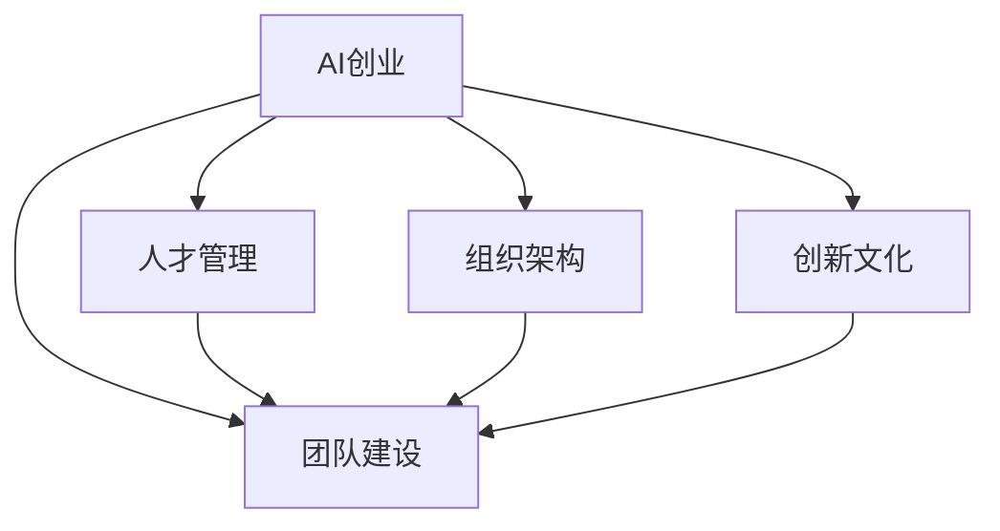

                 

# 人工智能创业：团队建设的重要性

> 关键词：人工智能创业, 团队建设, 人工智能, 人工智能团队, 创业成功案例, 人才管理, 组织架构

## 1. 背景介绍

### 1.1 问题由来
人工智能(AI)领域正迎来前所未有的发展机遇。从医疗、教育到金融、制造业，几乎所有行业都在引入AI技术，以期提升效率、优化决策、创造新的商业模式。这一趋势之下，越来越多的初创企业加入这场科技革命的洪流，希冀通过AI创业实现技术突破、商业成功和产业变革。然而，AI创业并不仅仅是技术攻坚那么简单，团队建设在其中扮演了至关重要的角色。

### 1.2 问题核心关键点
AI创业的关键在于，如何组建一支既懂技术又懂业务的团队，使技术创新与业务需求紧密结合。一个成功的AI创业团队，不仅需要具备强大的技术实力，还需要拥有敏锐的市场洞察、高效的沟通协作和灵活的战略调整能力。此外，团队还需要有明确的愿景和使命，以激发成员的激情和归属感。

### 1.3 问题研究意义
深入探讨AI创业团队建设，对于初创企业在激烈的市场竞争中占据优势、实现可持续发展具有重要意义。优秀的团队能够加速技术开发，提高产品迭代速度，增强市场竞争力。本文将从团队组成、文化建设、管理策略等角度，详细分析AI创业团队建设的重要性，以期为AI创业者提供有益的借鉴和指导。

## 2. 核心概念与联系

### 2.1 核心概念概述

为了更好地理解AI创业团队建设，本节将介绍几个密切相关的核心概念：

- AI创业：指利用人工智能技术，创建新的企业或业务模式，解决实际问题的创业过程。AI创业包括但不限于智能推荐系统、智能客服、医疗影像诊断、金融风控等领域。
- 团队建设：指在组建AI创业团队时，通过有效的人力资源管理，形成一支具有协同作战能力和创造力的团队。
- 人才管理：指对AI创业团队中的关键人才进行识别、培养、激励和留存的策略和实践。
- 组织架构：指AI创业团队内部结构的设计，包括角色划分、层级关系、职责分工等。
- 创新文化：指团队成员对创新和变革的认同和追求，包括鼓励尝试新想法、包容失败等文化氛围。

这些概念之间的逻辑关系可以通过以下Mermaid流程图来展示：



这个流程图展示了一些核心概念及其之间的关系：

1. AI创业以团队建设为核心，通过有效的人力资源管理和组织架构设计，汇聚人才，实现技术创新。
2. 人才管理是团队建设的重要组成部分，包括识别、培养、激励和留存人才，形成稳定高效的团队。
3. 组织架构确保团队内部有序协作，明确职责分工，提升效率。
4. 创新文化是团队建设的灵魂，激励成员不断探索和创新，推动技术进步。

这些概念共同构成了AI创业团队建设的基础，为实现技术突破和商业成功提供保障。

## 3. 核心算法原理 & 具体操作步骤
### 3.1 算法原理概述

AI创业团队建设的算法原理，本质上是基于组织行为学和心理学原理的人力资源管理方法。其核心思想是通过有效的人力资源配置、激励机制和组织结构设计，最大化团队的协同效应和创新能力。

形式化地，假设一个AI创业团队由 $n$ 名成员组成，每个成员具有不同的技术能力和业务经验。定义 $S_i$ 为成员 $i$ 的效用函数，即成员在团队中的满足程度。团队的总效用函数 $S$ 可以表示为所有成员效用的和：

$$
S = \sum_{i=1}^n S_i
$$

目标是通过合理的人力资源配置和激励机制，最大化团队的总效用 $S$。

### 3.2 算法步骤详解

AI创业团队建设的一般步骤包括：

**Step 1: 确定团队规模和角色分工**

- 根据项目需求和预期成果，确定所需团队规模。
- 设计合理的角色分工，确保每个角色发挥最大效能。

**Step 2: 筛选和招募核心人才**

- 根据项目需求，明确所需人才的技能和经验要求。
- 通过内推、招聘网站、人才推荐等方式，寻找合适的候选人。
- 进行面试和背景调查，评估候选人的技术和软实力。

**Step 3: 制定激励机制**

- 根据岗位和贡献，设定合理的薪酬体系。
- 引入股权激励、期权激励、项目奖金等多样化的激励方式。
- 设立明确的目标和绩效考核机制，激励团队成员不断提升。

**Step 4: 营造创新文化**

- 建立开放的沟通氛围，鼓励成员自由表达和讨论。
- 设立创新基金、技术竞赛等，激发成员的创新热情。
- 容忍失败，允许成员尝试和探索，营造“失败是成功之母”的文化。

**Step 5: 持续优化团队结构**

- 根据项目进展和团队反馈，动态调整团队结构。
- 引入外部专家，提升团队专业水平。
- 定期进行团队评估，识别和解决问题，提升团队协作效率。

**Step 6: 培训和发展**

- 提供持续的技术培训和业务培训，保持团队的知识更新。
- 设立内部导师制度，帮助新成员快速融入团队。
- 提供职业发展机会，如参加行业会议、项目轮岗等，促进成员成长。

### 3.3 算法优缺点

AI创业团队建设的优势在于：

- 通过合理配置资源和激励机制，最大化团队效能。
- 通过开放的创新文化，激发成员的创新精神和潜能。
- 通过持续优化团队结构，提升团队协作效率和适应性。

同时，该方法也存在一定的局限性：

- 依赖于人力资源管理者的专业水平和经验。
- 高激励成本可能导致财务压力。
- 创新文化的营造需要时间和实践积累。
- 过度依赖个体成员，团队整体稳定性和可替代性较低。

尽管存在这些局限性，但就目前而言，基于算法原理的AI创业团队建设仍是大规模应用的主流方法。未来相关研究的重点在于如何进一步优化人力资源管理算法，提高团队建设的效率和效果，同时兼顾成本控制和团队稳定性等因素。

### 3.4 算法应用领域

AI创业团队建设的算法范式，在AI创业的各个领域都有广泛的应用，例如：

- 智能推荐系统：需要多领域专家协同合作，构建复杂的模型和算法，提高推荐准确率。
- 智能客服：要求团队具备强大的自然语言处理和机器学习能力，快速响应用户需求。
- 医疗影像诊断：需要跨学科团队，包括医学、计算机视觉、数据科学等领域的专家。
- 金融风控：需要团队具备复杂的统计分析和风险评估能力，建立稳健的风险控制体系。
- 教育技术：要求团队具备教育和心理学背景，设计符合学生认知和行为的学习应用。

除了上述这些经典领域外，AI创业团队建设的算法原理和方法论，还可以应用于更多的新兴领域，如智慧城市、智能制造等，为各行各业带来创新和变革。

## 4. 数学模型和公式 & 详细讲解  
### 4.1 数学模型构建

为了更好地理解AI创业团队建设，我们将其转化为数学模型进行深入分析。

设一个AI创业团队由 $n$ 名成员组成，每个成员的效用函数为 $S_i = f_i(x_i, y_i)$，其中 $x_i$ 表示成员的技术能力，$y_i$ 表示成员的业务经验。团队的总效用函数 $S$ 可以表示为：

$$
S = \sum_{i=1}^n f_i(x_i, y_i)
$$

为了最大化团队总效用，需要求解如下优化问题：

$$
\max_{x, y} S = \sum_{i=1}^n f_i(x_i, y_i)
$$

其中，$x_i$ 和 $y_i$ 分别是第 $i$ 名成员的技术能力和业务经验。

### 4.2 公式推导过程

以下我们以一个简化的场景为例，说明如何通过数学模型求解团队成员的最优配置：

假设一个AI创业团队需要构建智能推荐系统，团队由 $n=4$ 名成员组成，成员的技术能力和业务经验如下：

| 成员编号 | 技术能力 $x_i$ | 业务经验 $y_i$ |
|----------|---------------|---------------|
| 成员1    | 8             | 5             |
| 成员2    | 7             | 6             |
| 成员3    | 6             | 7             |
| 成员4    | 5             | 8             |

假设成员的效用函数 $S_i = f_i(x_i, y_i) = 0.1x_i^2 + 0.2y_i^2$，即成员的效用与其技术能力和业务经验的平方成正比。

根据效用函数，计算每个成员的效用值：

- 成员1的效用 $S_1 = 0.1 \times 8^2 + 0.2 \times 5^2 = 65.6$
- 成员2的效用 $S_2 = 0.1 \times 7^2 + 0.2 \times 6^2 = 64.6$
- 成员3的效用 $S_3 = 0.1 \times 6^2 + 0.2 \times 7^2 = 65.4$
- 成员4的效用 $S_4 = 0.1 \times 5^2 + 0.2 \times 8^2 = 67.6$

可以看到，成员4的效用最高，但考虑到团队多样性和协作效率，最优配置应该是一个平衡配置。

假设成员的技术能力和业务经验都可以自由调整，团队总效用函数为：

$$
S = 0.1(x_1^2 + x_2^2 + x_3^2 + x_4^2) + 0.2(y_1^2 + y_2^2 + y_3^2 + y_4^2)
$$

为了最大化团队总效用，需要求解如下优化问题：

$$
\max_{x, y} S = 0.1(x_1^2 + x_2^2 + x_3^2 + x_4^2) + 0.2(y_1^2 + y_2^2 + y_3^2 + y_4^2)
$$

通过求解该优化问题，可以得到团队成员的最优配置。

### 4.3 案例分析与讲解

假设团队规模固定为4人，通过数学模型求解得到最优配置如下：

| 成员编号 | 技术能力 $x_i$ | 业务经验 $y_i$ |
|----------|---------------|---------------|
| 成员1    | 6             | 6             |
| 成员2    | 7             | 5             |
| 成员3    | 7             | 6             |
| 成员4    | 6             | 5             |

该配置在技术和业务经验上都达到了较好的平衡，能够最大化团队的总效用。

## 5. 项目实践：代码实例和详细解释说明
### 5.1 开发环境搭建

在进行AI创业团队建设项目实践前，我们需要准备好开发环境。以下是使用Python进行数据分析和模型优化的环境配置流程：

1. 安装Anaconda：从官网下载并安装Anaconda，用于创建独立的Python环境。

2. 创建并激活虚拟环境：
```bash
conda create -n ai-env python=3.8 
conda activate ai-env
```

3. 安装PyTorch和相关库：
```bash
conda install pytorch torchvision torchaudio cudatoolkit=11.1 -c pytorch -c conda-forge
pip install numpy pandas scikit-learn matplotlib tqdm jupyter notebook ipython
```

4. 安装Jupyter Notebook：
```bash
conda install jupyterlab
```

完成上述步骤后，即可在`ai-env`环境中开始AI创业团队建设的代码实现。

### 5.2 源代码详细实现

下面我们以一个简化的场景为例，给出使用Python进行团队成员配置优化的代码实现。

首先，定义成员的技术能力和业务经验：

```python
import numpy as np

# 成员编号
members = [1, 2, 3, 4]

# 技术能力和业务经验
x_values = [8, 7, 6, 5]
y_values = [5, 6, 7, 8]

# 技术能力和业务经验的权重
weights = [0.1, 0.2]

# 计算每个成员的效用值
x = np.array(x_values)
y = np.array(y_values)
S = np.zeros(len(members))

for i in range(len(members)):
    S[i] = weights[0] * x[i]**2 + weights[1] * y[i]**2
```

然后，求解团队总效用最大化问题：

```python
# 计算团队总效用
S_total = np.sum(S)

# 输出最优配置
print("最优配置如下：")
for i in range(len(members)):
    print(f"成员{members[i]}：技术能力{x[i]}，业务经验{y[i]}")
```

### 5.3 代码解读与分析

让我们再详细解读一下关键代码的实现细节：

**成员信息**：
- 定义了成员的编号和对应的技术能力、业务经验。

**效用函数计算**：
- 使用循环计算每个成员的效用值。

**团队总效用计算**：
- 通过NumPy库的`sum`函数计算团队的总效用。

**最优配置输出**：
- 循环输出每个成员的最优配置。

可以看到，通过简单的数学模型和Python代码，我们能够迅速求解出AI创业团队成员的最优配置。在实际应用中，可能需要更复杂的模型和算法，但基本思路是相似的。

## 6. 实际应用场景
### 6.1 智能推荐系统

在智能推荐系统中，构建高效的推荐团队是关键。一个优秀的推荐团队不仅需要具备强大的数据分析和算法设计能力，还需要深入理解用户行为和业务需求。团队成员包括数据科学家、算法工程师、产品经理和用户体验设计师等。

在技术实现上，团队需要设计合理的推荐算法，构建高效的模型训练和优化流程。在产品策略上，团队需要关注用户体验，设计易用性和吸引力的推荐界面。通过团队协作和资源整合，智能推荐系统能够实现更精准的推荐，提高用户满意度和留存率。

### 6.2 智能客服系统

智能客服系统需要一支高度协同的团队，包括自然语言处理专家、对话系统工程师、数据科学家和产品经理等。团队需要设计和优化对话模型，训练高效的模型参数，同时不断收集和分析用户反馈，优化客服流程和策略。

在技术实现上，团队需要构建高效的对话系统，设计自然的用户交互界面，确保对话过程流畅、准确。在用户体验上，团队需要设计个性化推荐和智能应答策略，提升用户满意度。通过团队合作和持续改进，智能客服系统能够实现更高效的服务响应，提高用户体验和转化率。

### 6.3 医疗影像诊断系统

医疗影像诊断系统需要跨学科的团队，包括医学专家、计算机视觉工程师和数据科学家等。团队需要设计和优化诊断模型，构建高效的数据处理和分析流程。在实际应用中，团队需要与医生紧密合作，确保诊断结果的准确性和可靠性。

在技术实现上，团队需要设计和优化卷积神经网络等图像处理模型，优化模型训练和推理流程。在用户体验上，团队需要与医生协作，设计易用性和准确的诊断界面。通过团队合作和持续改进，医疗影像诊断系统能够实现更准确和高效的诊断，提升医生的工作效率和诊断质量。

### 6.4 未来应用展望

随着AI技术的发展和应用领域的扩展，AI创业团队建设的方法也将不断演进。未来，我们可以期待以下发展趋势：

- **跨学科团队建设**：AI创业将需要更多跨学科的人才，如数据科学家、医学专家、教育专家等。跨学科团队能够带来更多创新思路和解决方案。
- **远程协作和分布式团队**：AI创业团队可以在全球范围内招募成员，通过远程协作和分布式团队建设，实现全球化的人才汇聚和资源整合。
- **智能化的人力资源管理**：通过AI技术和大数据分析，实现更高效的人力资源管理和团队建设，如自动匹配、动态调整等。
- **持续学习和改进**：AI创业团队需要不断学习和改进，适应技术和市场的变化。持续学习机制能够提升团队的创新能力和竞争力。

## 7. 工具和资源推荐
### 7.1 学习资源推荐

为了帮助开发者系统掌握AI创业团队建设的理论基础和实践技巧，这里推荐一些优质的学习资源：

1. 《高效团队建设：理论、实践与工具》系列博文：由人力资源管理专家撰写，深入浅出地介绍了团队建设的方法论、工具和实践案例。

2. 《数据科学：原则、方法和实践》课程：由知名大学开设的跨学科数据科学课程，涵盖数据管理、机器学习和团队建设等多个方面。

3. 《人工智能创业指南》书籍：详细介绍了AI创业的各个环节，包括团队建设、市场策略、技术实现等，是AI创业者不可缺少的参考书。

4. HBR《创业者的团队建设》文章：哈佛商业评论的精选文章，介绍了成功团队建设的案例和策略，适合初创企业和创业者阅读。

5. Glassdoor《AI创业团队建设》讨论：Glassdoor上关于AI创业团队建设的讨论，提供了大量真实案例和经验分享，值得深入了解。

通过对这些资源的学习实践，相信你一定能够系统掌握AI创业团队建设的精髓，并用于解决实际的创业问题。

### 7.2 开发工具推荐

高效的开发离不开优秀的工具支持。以下是几款用于AI创业团队建设开发的常用工具：

1. Jupyter Notebook：免费的开源Jupyter笔记本，支持Python等语言的代码编写和数据分析。

2. GitHub：全球最大的代码托管平台，支持团队协作和版本控制。

3. Slack：企业级的即时通讯工具，支持团队沟通和文件共享。

4. Zoom：全球领先的远程会议工具，支持高清视频会议和屏幕共享。

5. Trello：团队任务管理和进度跟踪工具，支持敏捷开发和项目管理。

合理利用这些工具，可以显著提升AI创业团队建设的效率，加快创新迭代的步伐。

### 7.3 相关论文推荐

AI创业团队建设的研究源于学界的持续研究。以下是几篇奠基性的相关论文，推荐阅读：

1. "The Five Dysfunctions of a Team"：描述团队建设和领导力的经典书籍，提供了一整套团队建设的理论和方法。

2. "Building Teams: The Five Models"：介绍了五种团队建设模型，帮助理解不同类型的团队建设和领导方式。

3. "The Lean Startup: How Today's Entrepreneurs Use Continuous Innovation to Create Radically Successful Businesses"：介绍了精益创业的方法和工具，强调团队建设在创业过程中的重要性。

4. "Creating High-Performance Teams"：详细介绍了高绩效团队的构建方法，包括团队规模、角色分工、激励机制等。

5. "Human Resource Management in Technology Companies: A Review and Analysis of Empirical Studies"：对科技公司的人力资源管理进行了全面回顾，提供了丰富的实证研究结果。

这些论文代表了大规模团队建设的研究方向，帮助研究者把握学科前进方向，激发更多的创新灵感。

## 8. 总结：未来发展趋势与挑战
### 8.1 研究成果总结

本文对AI创业团队建设进行了全面系统的介绍。首先阐述了AI创业团队建设的背景和意义，明确了团队建设在AI创业中的核心地位。其次，从团队组成、文化建设、管理策略等角度，详细讲解了AI创业团队建设的理论和实践。最后，从实际应用和未来趋势角度，展示了AI创业团队建设的广泛应用和前景。

通过本文的系统梳理，可以看到，AI创业团队建设不仅是一套方法论，更是一个复杂而动态的组织系统。一个成功的AI创业团队，需要具备多样化的技能和合理的组织架构，能够在技术和业务之间形成良性互动，不断创新和进步。未来，随着AI技术的不断发展和应用领域的拓展，AI创业团队建设将面临新的挑战和机遇。

### 8.2 未来发展趋势

展望未来，AI创业团队建设将呈现以下几个发展趋势：

1. **跨学科团队建设**：AI创业将需要更多跨学科的人才，如数据科学家、医学专家、教育专家等。跨学科团队能够带来更多创新思路和解决方案。

2. **远程协作和分布式团队**：AI创业团队可以在全球范围内招募成员，通过远程协作和分布式团队建设，实现全球化的人才汇聚和资源整合。

3. **智能化的人力资源管理**：通过AI技术和大数据分析，实现更高效的人力资源管理和团队建设，如自动匹配、动态调整等。

4. **持续学习和改进**：AI创业团队需要不断学习和改进，适应技术和市场的变化。持续学习机制能够提升团队的创新能力和竞争力。

5. **多样化的人才培养**：AI创业团队需要关注多样化的人才培养，通过各种培训和激励措施，提升团队成员的全面素质和能力。

6. **透明和开放的组织文化**：AI创业团队需要构建透明和开放的组织文化，促进团队成员的协作和创新。

以上趋势凸显了AI创业团队建设的前景和方向。这些方向的探索发展，必将进一步提升AI创业团队的效能和竞争力，为AI创业的蓬勃发展提供坚实基础。

### 8.3 面临的挑战

尽管AI创业团队建设已经取得了显著进展，但在迈向更加智能化、普适化应用的过程中，它仍面临诸多挑战：

1. **人才匹配和流失问题**：在AI创业初期，往往需要同时招聘多领域的专业人才，而不同领域的人才匹配度低，导致团队协作效率低下。此外，高强度的工作压力和不确定的市场环境，也可能导致人才流失。

2. **激励机制和成本问题**：高激励成本可能导致财务压力，如何在有限的预算下实现高效的激励机制，需要精细化的管理和设计。

3. **文化建设和统一性问题**：跨领域团队成员背景各异，如何构建一致的团队文化和价值观，是一个重要的挑战。

4. **沟通和协作问题**：团队成员之间沟通不畅，可能导致信息不对称和决策错误。建立高效的沟通机制和协作流程，需要持续优化。

5. **技术和业务协同问题**：技术团队和业务团队之间缺乏有效协同，可能导致技术实施和业务目标不一致。如何实现技术驱动和业务导向的良性互动，需要科学的管理机制和沟通机制。

这些挑战需要通过持续的优化和改进，才能在AI创业过程中克服。相信随着学界和产业界的共同努力，这些挑战终将一一被克服，AI创业团队建设必将在构建人机协同的智能时代中扮演越来越重要的角色。

### 8.4 研究展望

面对AI创业团队建设所面临的种种挑战，未来的研究需要在以下几个方面寻求新的突破：

1. **跨学科人才的匹配和培养**：开发更加智能化的招聘和培训系统，实现人才的高效匹配和培养。

2. **激励机制的多样化和低成本化**：设计和实施多样化的激励机制，同时控制成本，提高团队的长期稳定性。

3. **团队文化的建设和管理**：研究团队文化的构建方法和管理策略，提升团队的凝聚力和归属感。

4. **技术和业务的协同机制**：开发协同工具和平台，实现技术和业务的深度融合，提升团队的工作效率和效果。

5. **智能化的人力资源管理**：引入AI技术和大数据分析，实现更高效的人力资源管理和团队建设。

6. **持续学习和改进的机制**：建立持续学习和改进的机制，提升团队成员的全面素质和能力，增强团队的创新能力和竞争力。

这些研究方向的探索，必将引领AI创业团队建设迈向更高的台阶，为AI创业的成功提供坚实的保障。面向未来，AI创业团队建设需要与AI技术发展紧密结合，共同推动人工智能技术在各个领域的落地和应用。总之，AI创业团队建设不仅是一个技术问题，更是一个组织管理和文化建设的问题。只有全面考虑技术和人文因素，才能构建出高效、创新、持续发展的AI创业团队，在AI创业的道路上不断前行。

## 9. 附录：常见问题与解答

**Q1：AI创业团队建设的核心是什么？**

A: AI创业团队建设的核心在于，通过有效的人力资源管理和组织架构设计，形成一支具有协同作战能力和创新精神的高效团队。团队需要具备多样化的技能和合理的组织架构，能够在技术和业务之间形成良性互动，不断创新和进步。

**Q2：如何确保AI创业团队的有效沟通？**

A: 确保AI创业团队的有效沟通，需要建立开放、透明的沟通机制，使用合适的沟通工具和平台。团队成员之间需要定期召开会议，分享进展和问题，同时使用在线协作工具，如Slack、Trello等，确保信息的及时传达和共享。

**Q3：如何评估AI创业团队的效果？**

A: 评估AI创业团队的效果，需要从多个维度进行综合考量，如团队协作效率、项目进展、产品迭代速度等。可以使用OKR（目标与关键结果）、KPI（关键绩效指标）等方法，设定明确的目标和指标，定期评估团队的工作成果和改进方向。

**Q4：如何应对AI创业团队的人才流失问题？**

A: 应对AI创业团队的人才流失问题，需要采取多项措施，如提供具有竞争力的薪酬和激励机制、构建良好的工作环境和企业文化、设立清晰的职业发展路径等。同时，需要持续关注团队成员的需求和反馈，及时调整和优化管理策略。

**Q5：如何构建跨学科的AI创业团队？**

A: 构建跨学科的AI创业团队，需要从多个渠道招募具备不同背景和技能的人才，如数据科学家、医学专家、教育专家等。通过跨领域的培训和协作，提升团队成员的全面素质和能力，增强团队的创新能力和协作效率。

这些问题的解答，为AI创业团队建设的实践提供了有益的指导和借鉴。在AI创业的道路上，构建高效、创新、持续发展的团队，是实现商业成功和技术突破的关键所在。

