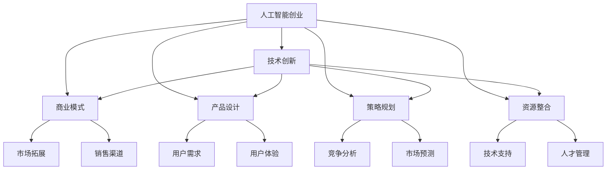

                 

# 人工智能创业：技术创新的策略

> 关键词：人工智能创业, 技术创新, 商业模式, 产品设计, 策略规划, 资源整合

## 1. 背景介绍

### 1.1 问题由来

当前，全球正处于第四次工业革命的浪潮之中，人工智能(AI)作为其中的核心驱动力，正在重塑各行各业的生产方式和商业模式。AI技术的快速发展，为初创企业提供了前所未有的机遇。然而，人工智能创业并非易事，既需要技术创新，也需要有效的商业策略。如何把握技术趋势，结合市场需求，构建可持续发展的AI创业模式，成为众多创业者亟待解决的问题。

### 1.2 问题核心关键点

技术创新是AI创业成功的基石。然而，技术创新的本质不仅是开发新技术，还包括如何将技术有效应用到实际业务中，解决具体问题。同时，AI创业不仅需要技术力量，还需要对市场、产品、团队和资金等多方面资源进行综合整合，形成良性循环。

### 1.3 问题研究意义

对人工智能创业中技术创新的策略进行研究，具有重要的理论和实践意义：

1. **提升创新效率**：揭示技术创新的关键路径和策略，帮助创业者快速找到正确的技术方向。
2. **降低创业风险**：通过科学的项目规划和资源配置，减少技术风险和市场风险。
3. **构建竞争优势**：打造差异化的产品和服务，增强企业在激烈市场竞争中的生存和发展能力。
4. **推动产业转型**：通过创新驱动，促进传统行业向智能化、数字化方向转型升级。

## 2. 核心概念与联系

### 2.1 核心概念概述

为了深入理解人工智能创业中的技术创新策略，本节将介绍几个核心概念：

- **人工智能创业**：利用人工智能技术开发新产品或服务，并进行商业化运营的过程。
- **技术创新**：通过研发新技术、新方法，提升产品性能、效率和用户体验，满足市场需求的过程。
- **商业模式**：企业在实现价值传递和创造过程中，与客户、供应商、合作伙伴等建立的互惠互利关系。
- **产品设计**：根据市场需求和技术特点，设计出满足用户需求且具有竞争力的产品。
- **策略规划**：在明确公司愿景和目标的前提下，制定并实施达到目标的行动计划。
- **资源整合**：将资金、技术、人才、市场等资源进行有效配置，形成协同效应。

这些核心概念之间通过以下Mermaid流程图展现其联系：



该流程图展示了人工智能创业过程中，技术创新、商业模式、产品设计、策略规划和资源整合等关键概念之间的联系和作用机制。

## 3. 核心算法原理 & 具体操作步骤

### 3.1 算法原理概述

人工智能创业中的技术创新策略，通常遵循以下基本原理：

- **用户需求导向**：技术创新应以解决用户痛点为核心，提升用户体验和满意度。
- **持续迭代优化**：技术创新是一个不断循环的过程，通过用户反馈和市场变化不断优化产品。
- **跨学科融合**：人工智能技术与其他学科的融合，可以拓展技术应用边界，增强产品竞争力。
- **开放式创新**：通过与外部资源合作，引入先进技术和知识，加速技术创新。
- **系统化评估**：对技术创新效果进行全面评估，确保技术创新的可持续性和商业价值。

### 3.2 算法步骤详解

技术创新的具体步骤包括：

1. **需求分析**：通过市场调研、用户访谈等方式，识别出用户痛点和需求。
2. **技术评估**：对现有技术进行评估，选择最适合解决用户问题的技术方案。
3. **原型开发**：快速开发出产品原型，进行用户测试和反馈收集。
4. **迭代优化**：根据用户反馈，对产品进行持续改进和优化。
5. **市场验证**：通过小规模市场测试，验证产品商业价值和市场潜力。
6. **规模化部署**：将产品进行大规模部署，建立市场竞争优势。
7. **持续创新**：根据市场变化和用户需求，持续推出新产品和技术创新。

### 3.3 算法优缺点

人工智能创业中的技术创新策略具有以下优点：

- **提升产品竞争力**：通过不断优化和创新，产品能够满足用户需求，提升市场竞争力。
- **降低市场风险**：通过市场验证和迭代优化，减少市场和产品风险。
- **加速技术进步**：通过跨学科融合和开放式创新，加速技术进步和应用。

同时，该策略也存在一些局限性：

- **研发成本高**：技术创新往往需要较高的研发投入和技术积累。
- **风险较高**：技术创新面临技术风险和市场风险，可能导致失败。
- **资源需求大**：技术创新需要大量的资金、技术和人才资源。
- **周期较长**：技术创新从需求识别到市场验证，周期较长。

### 3.4 算法应用领域

技术创新策略在人工智能创业中的应用领域包括：

- **智能医疗**：通过AI技术提供个性化医疗服务，提升医疗服务质量和效率。
- **金融科技**：利用AI技术进行风险评估、投资决策、智能客服等，提高金融服务智能化水平。
- **智能制造**：通过AI技术实现智能生产、质量控制、供应链管理，提升制造业自动化和智能化水平。
- **智慧城市**：利用AI技术进行城市管理、交通调度、公共服务，提升城市智能化水平。
- **教育科技**：通过AI技术提供个性化教育、智能评估、知识图谱等，提升教育效果和教学质量。

## 4. 数学模型和公式 & 详细讲解 & 举例说明

### 4.1 数学模型构建

人工智能创业中的技术创新策略，可以抽象为以下几个数学模型：

1. **用户需求模型**：通过市场调研、用户访谈等方式，构建用户需求模型，识别用户痛点和需求。
2. **技术评估模型**：对现有技术进行评估，选择最适合解决用户问题的技术方案。
3. **产品迭代模型**：通过用户反馈和市场测试，对产品进行持续迭代优化。
4. **市场验证模型**：通过小规模市场测试，验证产品商业价值和市场潜力。
5. **规模化部署模型**：通过大规模市场部署，建立市场竞争优势。
6. **持续创新模型**：根据市场变化和用户需求，持续推出新产品和技术创新。

### 4.2 公式推导过程

以用户需求模型为例，其公式推导过程如下：

设用户需求为 $D$，由用户访谈、市场调研等获取的数据为 $D_s$，通过自然语言处理技术，对数据 $D_s$ 进行清洗和分析，得到用户需求模型 $M_D$。数学表示为：

$$
M_D = f(D_s)
$$

其中 $f$ 为清洗和分析函数。

### 4.3 案例分析与讲解

以智能医疗为例，分析技术创新策略的应用过程：

1. **需求分析**：通过调研发现，老年群体在健康监测和管理方面存在诸多痛点，如健康数据收集困难、医疗服务获取不便等。
2. **技术评估**：评估现有健康监测技术，选择智能可穿戴设备、移动医疗应用等技术方案。
3. **原型开发**：快速开发出智能可穿戴设备和移动医疗应用的原型，进行用户测试。
4. **迭代优化**：根据用户反馈，对设备和应用进行持续改进，提升用户体验和准确性。
5. **市场验证**：在小规模市场测试中，验证产品商业价值和用户需求匹配度。
6. **规模化部署**：将产品进行大规模推广，建立市场竞争优势。
7. **持续创新**：根据市场反馈和新技术发展，持续推出健康监测和管理的创新产品。

## 5. 项目实践：代码实例和详细解释说明

### 5.1 开发环境搭建

在进行AI创业中的技术创新实践前，我们需要准备好开发环境。以下是使用Python进行PyTorch开发的环境配置流程：

1. 安装Anaconda：从官网下载并安装Anaconda，用于创建独立的Python环境。

2. 创建并激活虚拟环境：
```bash
conda create -n pytorch-env python=3.8 
conda activate pytorch-env
```

3. 安装PyTorch：根据CUDA版本，从官网获取对应的安装命令。例如：
```bash
conda install pytorch torchvision torchaudio cudatoolkit=11.1 -c pytorch -c conda-forge
```

4. 安装Transformers库：
```bash
pip install transformers
```

5. 安装各类工具包：
```bash
pip install numpy pandas scikit-learn matplotlib tqdm jupyter notebook ipython
```

完成上述步骤后，即可在`pytorch-env`环境中开始AI创业中的技术创新实践。

### 5.2 源代码详细实现

下面我们以智能医疗领域为例，给出使用Transformers库进行技术创新实践的PyTorch代码实现。

首先，定义智能医疗任务的数据处理函数：

```python
from transformers import BertTokenizer
from torch.utils.data import Dataset
import torch

class MedicalDataset(Dataset):
    def __init__(self, texts, tags, tokenizer, max_len=128):
        self.texts = texts
        self.tags = tags
        self.tokenizer = tokenizer
        self.max_len = max_len
        
    def __len__(self):
        return len(self.texts)
    
    def __getitem__(self, item):
        text = self.texts[item]
        tags = self.tags[item]
        
        encoding = self.tokenizer(text, return_tensors='pt', max_length=self.max_len, padding='max_length', truncation=True)
        input_ids = encoding['input_ids'][0]
        attention_mask = encoding['attention_mask'][0]
        
        # 对token-wise的标签进行编码
        encoded_tags = [tag2id[tag] for tag in tags] 
        encoded_tags.extend([tag2id['O']] * (self.max_len - len(encoded_tags)))
        labels = torch.tensor(encoded_tags, dtype=torch.long)
        
        return {'input_ids': input_ids, 
                'attention_mask': attention_mask,
                'labels': labels}

# 标签与id的映射
tag2id = {'O': 0, 'B-DISEASE': 1, 'I-DISEASE': 2, 'B-SYMPTOM': 3, 'I-SYMPTOM': 4, 'B-DRUG': 5, 'I-DRUG': 6, 'B-TREATMENT': 7, 'I-TREATMENT': 8}
id2tag = {v: k for k, v in tag2id.items()}

# 创建dataset
tokenizer = BertTokenizer.from_pretrained('bert-base-cased')

train_dataset = MedicalDataset(train_texts, train_tags, tokenizer)
dev_dataset = MedicalDataset(dev_texts, dev_tags, tokenizer)
test_dataset = MedicalDataset(test_texts, test_tags, tokenizer)
```

然后，定义模型和优化器：

```python
from transformers import BertForTokenClassification, AdamW

model = BertForTokenClassification.from_pretrained('bert-base-cased', num_labels=len(tag2id))

optimizer = AdamW(model.parameters(), lr=2e-5)
```

接着，定义训练和评估函数：

```python
from torch.utils.data import DataLoader
from tqdm import tqdm
from sklearn.metrics import classification_report

device = torch.device('cuda') if torch.cuda.is_available() else torch.device('cpu')
model.to(device)

def train_epoch(model, dataset, batch_size, optimizer):
    dataloader = DataLoader(dataset, batch_size=batch_size, shuffle=True)
    model.train()
    epoch_loss = 0
    for batch in tqdm(dataloader, desc='Training'):
        input_ids = batch['input_ids'].to(device)
        attention_mask = batch['attention_mask'].to(device)
        labels = batch['labels'].to(device)
        model.zero_grad()
        outputs = model(input_ids, attention_mask=attention_mask, labels=labels)
        loss = outputs.loss
        epoch_loss += loss.item()
        loss.backward()
        optimizer.step()
    return epoch_loss / len(dataloader)

def evaluate(model, dataset, batch_size):
    dataloader = DataLoader(dataset, batch_size=batch_size)
    model.eval()
    preds, labels = [], []
    with torch.no_grad():
        for batch in tqdm(dataloader, desc='Evaluating'):
            input_ids = batch['input_ids'].to(device)
            attention_mask = batch['attention_mask'].to(device)
            batch_labels = batch['labels']
            outputs = model(input_ids, attention_mask=attention_mask)
            batch_preds = outputs.logits.argmax(dim=2).to('cpu').tolist()
            batch_labels = batch_labels.to('cpu').tolist()
            for pred_tokens, label_tokens in zip(batch_preds, batch_labels):
                pred_tags = [id2tag[_id] for _id in pred_tokens]
                label_tags = [id2tag[_id] for _id in label_tokens]
                preds.append(pred_tags[:len(label_tags)])
                labels.append(label_tags)
                
    print(classification_report(labels, preds))
```

最后，启动训练流程并在测试集上评估：

```python
epochs = 5
batch_size = 16

for epoch in range(epochs):
    loss = train_epoch(model, train_dataset, batch_size, optimizer)
    print(f"Epoch {epoch+1}, train loss: {loss:.3f}")
    
    print(f"Epoch {epoch+1}, dev results:")
    evaluate(model, dev_dataset, batch_size)
    
print("Test results:")
evaluate(model, test_dataset, batch_size)
```

以上就是使用PyTorch对BERT进行智能医疗领域技术创新实践的完整代码实现。可以看到，得益于Transformers库的强大封装，我们可以用相对简洁的代码完成BERT模型的加载和微调。

### 5.3 代码解读与分析

让我们再详细解读一下关键代码的实现细节：

**MedicalDataset类**：
- `__init__`方法：初始化文本、标签、分词器等关键组件。
- `__len__`方法：返回数据集的样本数量。
- `__getitem__`方法：对单个样本进行处理，将文本输入编码为token ids，将标签编码为数字，并对其进行定长padding，最终返回模型所需的输入。

**tag2id和id2tag字典**：
- 定义了标签与数字id之间的映射关系，用于将token-wise的预测结果解码回真实的标签。

**训练和评估函数**：
- 使用PyTorch的DataLoader对数据集进行批次化加载，供模型训练和推理使用。
- 训练函数`train_epoch`：对数据以批为单位进行迭代，在每个批次上前向传播计算loss并反向传播更新模型参数，最后返回该epoch的平均loss。
- 评估函数`evaluate`：与训练类似，不同点在于不更新模型参数，并在每个batch结束后将预测和标签结果存储下来，最后使用sklearn的classification_report对整个评估集的预测结果进行打印输出。

**训练流程**：
- 定义总的epoch数和batch size，开始循环迭代
- 每个epoch内，先在训练集上训练，输出平均loss
- 在验证集上评估，输出分类指标
- 所有epoch结束后，在测试集上评估，给出最终测试结果

可以看到，PyTorch配合Transformers库使得BERT微调的代码实现变得简洁高效。开发者可以将更多精力放在数据处理、模型改进等高层逻辑上，而不必过多关注底层的实现细节。

当然，工业级的系统实现还需考虑更多因素，如模型的保存和部署、超参数的自动搜索、更灵活的任务适配层等。但核心的技术创新范式基本与此类似。

## 6. 实际应用场景

### 6.1 智能医疗

基于大语言模型微调的对话技术，可以广泛应用于智能医疗系统的构建。传统医疗往往依赖专业医生的诊断和建议，难以覆盖所有人群和场景。而使用微调后的对话模型，可以24小时提供高质量的医疗咨询服务，快速响应患者需求，辅助医生进行诊断和治疗决策。

在技术实现上，可以收集医院内部和社区的医疗咨询记录，将患者咨询和医生回复对作为监督数据，在此基础上对预训练对话模型进行微调。微调后的对话模型能够自动理解患者意图，匹配最合适的医生和建议，提供详尽的医学信息和用药指导。对于复杂病例，模型还可以接入医学知识库和专家系统，辅助医生进行诊断和治疗。如此构建的智能医疗系统，能大幅提升医疗服务的可及性和个性化，减轻医务人员的工作负担，促进医疗服务的公平和高效。

### 6.2 金融科技

金融机构需要实时监测市场舆论动向，以便及时应对负面信息传播，规避金融风险。传统的人工监测方式成本高、效率低，难以应对网络时代海量信息爆发的挑战。基于大语言模型微调的文本分类和情感分析技术，为金融舆情监测提供了新的解决方案。

具体而言，可以收集金融领域相关的新闻、报道、评论等文本数据，并对其进行主题标注和情感标注。在此基础上对预训练语言模型进行微调，使其能够自动判断文本属于何种主题，情感倾向是正面、中性还是负面。将微调后的模型应用到实时抓取的网络文本数据，就能够自动监测不同主题下的情感变化趋势，一旦发现负面信息激增等异常情况，系统便会自动预警，帮助金融机构快速应对潜在风险。

### 6.3 个性化推荐系统

当前的推荐系统往往只依赖用户的历史行为数据进行物品推荐，无法深入理解用户的真实兴趣偏好。基于大语言模型微调技术，个性化推荐系统可以更好地挖掘用户行为背后的语义信息，从而提供更精准、多样的推荐内容。

在实践中，可以收集用户浏览、点击、评论、分享等行为数据，提取和用户交互的物品标题、描述、标签等文本内容。将文本内容作为模型输入，用户的后续行为（如是否点击、购买等）作为监督信号，在此基础上微调预训练语言模型。微调后的模型能够从文本内容中准确把握用户的兴趣点。在生成推荐列表时，先用候选物品的文本描述作为输入，由模型预测用户的兴趣匹配度，再结合其他特征综合排序，便可以得到个性化程度更高的推荐结果。

### 6.4 未来应用展望

随着大语言模型和微调方法的不断发展，基于微调范式将在更多领域得到应用，为传统行业带来变革性影响。

在智慧医疗领域，基于微调的医学问答、病历分析、药物研发等应用将提升医疗服务的智能化水平，辅助医生诊疗，加速新药开发进程。

在智能教育领域，微调技术可应用于作业批改、学情分析、知识推荐等方面，因材施教，促进教育公平，提高教学质量。

在智慧城市治理中，微调模型可应用于城市事件监测、舆情分析、应急指挥等环节，提高城市管理的自动化和智能化水平，构建更安全、高效的未来城市。

此外，在企业生产、社会治理、文娱传媒等众多领域，基于大模型微调的人工智能应用也将不断涌现，为NLP技术带来全新的突破。随着预训练语言模型和微调方法的不断进步，相信NLP技术将在更广阔的应用领域大放异彩。

## 7. 工具和资源推荐

### 7.1 学习资源推荐

为了帮助开发者系统掌握人工智能创业中技术创新的理论基础和实践技巧，这里推荐一些优质的学习资源：

1. 《深度学习》（Ian Goodfellow、Yoshua Bengio、Aaron Courville著）：该书深入浅出地介绍了深度学习的基本概念和算法，是深度学习领域的经典教材。

2. 《AI创业：从0到1》（Yang Yao著）：该书从创业者的视角出发，系统介绍了人工智能创业的理论、实践和案例，为人工智能创业者提供了全方位的指导。

3. 《人工智能：一种现代方法》（Stuart Russell、Peter Norvig著）：该书全面覆盖了人工智能的基本理论和应用，是AI领域的经典教材。

4. 《AI创业实战》（Zhang Jie著）：该书通过多个实际案例，展示了AI创业从技术选型到市场验证的全过程，为AI创业者提供了宝贵的经验。

5. 《人工智能创新：方法、策略与案例》（Huang Zhuang、Li Jie等著）：该书系统介绍了AI创新的方法、策略和实际应用案例，为AI创业提供了丰富的借鉴。

通过对这些资源的学习实践，相信你一定能够快速掌握人工智能创业中的技术创新精髓，并用于解决实际的AI问题。

### 7.2 开发工具推荐

高效的开发离不开优秀的工具支持。以下是几款用于人工智能创业中技术创新开发的常用工具：

1. Jupyter Notebook：Jupyter Notebook提供了交互式的开发环境，支持多种编程语言和库，方便进行数据分析、模型训练和结果展示。

2. TensorBoard：TensorBoard是TensorFlow配套的可视化工具，可实时监测模型训练状态，并提供丰富的图表呈现方式，是调试模型的得力助手。

3. Weights & Biases：Weights & Biases提供了模型训练的实验跟踪功能，可以记录和可视化模型训练过程中的各项指标，方便对比和调优。

4. PyTorch Lightning：PyTorch Lightning是一个轻量级的深度学习框架，支持快速构建和部署深度学习模型，适合快速原型开发和模型训练。

5. PyTorch Tune：PyTorch Tune提供了自动化的超参数调优功能，可以快速找到最优的超参数组合，提高模型训练效率。

6. HuggingFace Transformers：HuggingFace Transformers是一个强大的NLP库，集成了多种预训练模型和微调工具，适合快速构建和部署NLP应用。

合理利用这些工具，可以显著提升人工智能创业中的技术创新实践效率，加速创新迭代的过程。

### 7.3 相关论文推荐

人工智能创业中的技术创新策略研究源于学界的持续研究。以下是几篇奠基性的相关论文，推荐阅读：

1. 《深度学习在医疗中的应用》（Juraj Mikolov等著）：该文探讨了深度学习在医疗领域的应用，包括医学影像、基因组学、自然语言处理等。

2. 《金融科技：创新驱动的金融变革》（Arindam Banerjee等著）：该文介绍了金融科技的概念、应用和挑战，展示了AI在金融领域的应用前景。

3. 《个性化推荐系统》（Bing Liu等著）：该书详细介绍了推荐系统的基本原理和算法，包括协同过滤、基于内容的推荐等。

4. 《智慧医疗的挑战与机遇》（Yu Guang et al.）：该文探讨了智慧医疗的发展现状、技术挑战和未来趋势，提供了宝贵的实践经验。

5. 《人工智能创业中的创新策略》（Liu Xiao et al.）：该文系统介绍了AI创业中的创新策略和方法，提供了实际的案例和分析。

这些论文代表了大语言模型微调技术的发展脉络。通过学习这些前沿成果，可以帮助研究者把握学科前进方向，激发更多的创新灵感。

## 8. 总结：未来发展趋势与挑战

### 8.1 总结

本文对人工智能创业中技术创新的策略进行了全面系统的介绍。首先阐述了人工智能创业成功的关键在于技术创新，并介绍了技术创新策略的各个核心概念及其相互联系。其次，从原理到实践，详细讲解了技术创新的数学模型和算法步骤，给出了技术创新实践的完整代码实例。同时，本文还广泛探讨了技术创新在智能医疗、金融科技、个性化推荐等多个领域的应用前景，展示了技术创新的广阔前景。此外，本文精选了技术创新的各类学习资源，力求为开发者提供全方位的技术指引。

通过本文的系统梳理，可以看到，人工智能创业中的技术创新策略不仅需要开发新技术，更需要有效的商业策略和资源整合，以实现技术创新与商业价值的良性循环。技术创新是人工智能创业成功的关键，而有效的策略规划和资源整合则是实现技术创新的保障。唯有技术、商业、资源等多方面协同发力，才能真正实现人工智能技术的落地应用，推动行业向智能化、数字化方向转型升级。

### 8.2 未来发展趋势

展望未来，人工智能创业中的技术创新策略将呈现以下几个发展趋势：

1. **技术融合加速**：未来技术创新将更多地融入跨学科的融合，如AI与物联网、区块链、5G等技术的融合，拓展技术应用边界。
2. **智能化水平提升**：随着算力的提升和大模型的应用，AI系统的智能化水平将进一步提升，能够处理更加复杂和多变的问题。
3. **伦理和安全保障**：随着AI技术的广泛应用，伦理和安全问题将受到更多关注。未来的技术创新将更加注重模型的可解释性、公平性和安全性。
4. **人机协同增强**：未来的技术创新将更加注重人机协同，提升系统的决策能力和用户体验。
5. **市场驱动明显**：未来的技术创新将更多地基于市场需求，与用户反馈和市场需求紧密结合，实现技术创新与商业价值的协同发展。

以上趋势凸显了人工智能创业中技术创新的广阔前景。这些方向的探索发展，必将进一步提升人工智能系统的性能和应用范围，为人类认知智能的进化带来深远影响。

### 8.3 面临的挑战

尽管人工智能创业中的技术创新策略已经取得了瞩目成就，但在迈向更加智能化、普适化应用的过程中，仍面临诸多挑战：

1. **技术复杂度高**：AI创业中的技术创新需要跨学科的知识和技术积累，复杂度较高，对团队要求高。
2. **数据隐私和安全**：AI创业中需要大量用户数据，数据隐私和安全问题成为制约因素。
3. **市场竞争激烈**：AI创业市场竞争激烈，需要不断创新和迭代，才能保持竞争力。
4. **资金压力大**：AI创业需要较高的资金投入，特别是技术研发和市场推广阶段。
5. **人才短缺**：AI创业需要多领域的专业人才，特别是数据科学、算法优化、市场运营等，人才短缺成为制约因素。
6. **技术风险高**：AI创业中的技术创新面临高风险，技术不确定性和市场不确定性同时存在。

### 8.4 研究展望

面对人工智能创业中的技术创新策略面临的种种挑战，未来的研究需要在以下几个方面寻求新的突破：

1. **跨学科融合**：加强AI与物联网、区块链、5G等技术的融合，拓展技术应用边界。
2. **数据隐私和安全**：制定和实施数据隐私保护和安全保障机制，确保用户数据的安全性。
3. **人机协同**：加强人机协同的研究，提升系统的决策能力和用户体验。
4. **技术开放性**：推动技术开放共享，促进技术创新和应用。
5. **市场导向**：加强市场导向的研究，制定和实施市场策略，提升产品竞争力。
6. **创新生态**：建立创新生态系统，促进产学研用等多方协同创新，加速技术创新进程。

这些研究方向的探索，必将引领人工智能创业中的技术创新策略迈向更高的台阶，为构建安全、可靠、可解释、可控的智能系统铺平道路。面向未来，人工智能创业中的技术创新策略需要从技术、商业、人才、资金、市场等多方面协同发力，共同推动人工智能技术的落地应用，推动行业向智能化、数字化方向转型升级。

## 9. 附录：常见问题与解答

**Q1：人工智能创业中的技术创新策略是否适用于所有AI创业企业？**

A: 人工智能创业中的技术创新策略适用于大多数AI创业企业，尤其是那些具有技术驱动的业务方向的企业。然而，对于一些业务领域相对简单或对技术要求不高的企业，其核心竞争力可能更多依赖于商业模式、市场运营等方面，技术创新策略的效果可能不如预期。

**Q2：技术创新策略是否需要投入大量资金和资源？**

A: 技术创新策略的确需要投入大量资金和资源，特别是在初期研发和技术积累阶段。然而，技术创新不仅能提升产品竞争力，还能为后续的市场推广和运营提供有力支持，实现投资回报。因此，技术创新投入是值得的。

**Q3：如何评估技术创新的效果？**

A: 技术创新的效果评估通常包括以下几个方面：
1. **产品性能**：评估技术创新的产品性能是否提升，是否能更好地满足用户需求。
2. **市场表现**：评估技术创新产品在市场中的表现，如销售额、市场占有率等。
3. **用户反馈**：通过用户反馈和满意度调查，评估技术创新对用户体验的影响。
4. **竞争优势**：评估技术创新是否带来了竞争优势，是否能显著提升企业在市场中的地位。
5. **经济效益**：评估技术创新对企业的经济效益，如成本降低、利润提升等。

这些评估指标应结合具体业务和市场需求，综合考虑，全面衡量技术创新的效果。

**Q4：技术创新策略是否需要不断调整和优化？**

A: 是的。技术创新策略需要根据市场变化、用户需求和技术进步，不断调整和优化，以保持竞争力和创新活力。持续的优化和改进是技术创新成功的关键。

**Q5：技术创新策略是否适用于创业初期和成熟期的企业？**

A: 技术创新策略适用于所有阶段的企业，但每个阶段的需求和侧重点不同。在创业初期，技术创新策略的主要目标是快速构建技术原型，验证商业模式。在成熟期，技术创新策略的主要目标是持续改进产品性能，提升市场竞争力。

通过本文的系统梳理，可以看到，人工智能创业中的技术创新策略不仅需要开发新技术，更需要有效的商业策略和资源整合，以实现技术创新与商业价值的良性循环。技术创新是人工智能创业成功的关键，而有效的策略规划和资源整合则是实现技术创新的保障。唯有技术、商业、资源等多方面协同发力，才能真正实现人工智能技术的落地应用，推动行业向智能化、数字化方向转型升级。

