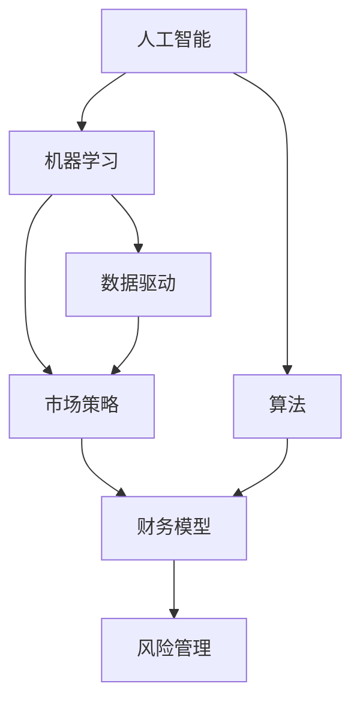

                 

# 人工智能创业：明确商业模式

> 关键词：人工智能创业, 商业模式, 机器学习, 算法, 数据驱动, 市场策略, 财务模型, 风险管理, 技术创新, 产品化, 创业融资

## 1. 背景介绍

在人工智能（AI）技术迅猛发展的今天，创业公司如雨后春笋般涌现，但成功者屈指可数。成功的关键不仅在于技术本身，更在于对商业模式的深刻理解。一个好的商业模式可以确保技术应用的可持续性和盈利性，进而推动企业长期发展。本文将围绕人工智能创业中的商业模式，从核心概念、算法原理、项目实践、应用场景等维度展开深入探讨。

### 1.1 问题由来

随着深度学习和机器学习技术的普及，越来越多的创业者选择以AI技术为基础开展创业。然而，技术只是冰山一角，商业模式才是决定企业成功的关键。AI创业公司面临的挑战包括但不限于：如何定价，如何实现商业化，如何管理风险等。这些问题看似简单，但其中蕴含的深层次商业逻辑往往复杂难解。明确商业模式，不仅能够帮助企业制定切实可行的市场策略，还能在激烈的市场竞争中脱颖而出。

### 1.2 问题核心关键点

人工智能创业中的商业模式涉及多个关键点，主要包括：

- **产品定位**：明确企业产品的核心竞争力，定位目标用户和市场需求。
- **定价策略**：制定符合市场定位的定价策略，确保盈利能力。
- **市场推广**：制定有效的市场推广策略，提高产品知名度和市场占有率。
- **渠道管理**：建立合适的销售和营销渠道，确保产品顺利进入市场。
- **成本控制**：管理好产品研发、生产、营销等各环节的成本，提高企业盈利水平。
- **风险管理**：识别潜在风险，制定应对策略，保障企业稳定运营。

本文将围绕这些关键点，深入解析人工智能创业中的商业模式。

## 2. 核心概念与联系

### 2.1 核心概念概述

为了更好地理解人工智能创业中的商业模式，我们需要掌握几个关键概念：

- **人工智能（AI）**：利用计算机算法模拟人类智能，实现信息处理、决策支持等功能的技术。
- **机器学习（ML）**：通过数据训练模型，使计算机具备自主学习、优化算法的能力。
- **算法**：实现特定功能的计算规则，如分类、聚类、回归等。
- **数据驱动**：通过数据分析和处理，驱动决策和产品设计。
- **市场策略**：制定并实施的，旨在提升市场竞争力的策略和方案。
- **财务模型**：用于评估企业财务状况和预测未来盈利能力的模型。
- **风险管理**：识别和评估风险，制定应对措施的过程。

这些概念紧密联系，共同构成了人工智能创业中商业模式的理论基础。通过理解这些概念，我们可以更清晰地把握商业模式的构建和运作。

### 2.2 核心概念原理和架构的 Mermaid 流程图(Mermaid 流程节点中不要有括号、逗号等特殊字符)



该流程图展示了人工智能创业中各概念的联系和互动关系。人工智能通过机器学习实现算法，数据驱动为市场策略提供依据，市场策略又影响财务模型，风险管理则贯穿其中，确保商业模式的健康运行。

## 3. 核心算法原理 & 具体操作步骤

### 3.1 算法原理概述

人工智能创业中的商业模式构建，涉及多个关键算法和计算过程。这些算法和计算过程包括但不限于：

- **数据收集和预处理**：从不同渠道收集数据，并进行清洗、标注和归一化，以提高模型训练效果。
- **模型选择和训练**：根据产品需求选择合适的机器学习算法，并进行模型训练和优化。
- **模型评估和验证**：使用交叉验证等方法评估模型性能，确保模型在实际应用中表现良好。
- **产品化策略**：将模型集成到产品中，进行测试和优化，确保产品功能符合市场需求。
- **市场推广策略**：根据产品特性和目标用户群，制定相应的市场推广策略。
- **财务预测和预算管理**：使用财务模型预测企业未来盈利能力和现金流状况，制定预算和财务计划。
- **风险评估和管理**：识别潜在风险，并制定应对策略，确保企业稳健运营。

### 3.2 算法步骤详解

下面详细介绍每个算法步骤的具体操作过程：

#### 3.2.1 数据收集和预处理

1. **数据收集**：通过爬虫、API接口、公开数据集等方式，收集与产品相关的各类数据，如用户行为数据、市场竞争数据、行业报告等。
2. **数据清洗**：处理缺失值、异常值，去除重复数据和无用数据，确保数据质量和一致性。
3. **数据标注**：根据业务需求对数据进行标注，如分类标签、评分、用户画像等。
4. **数据归一化**：将不同来源的数据进行归一化处理，使其具备可比性和一致性。

#### 3.2.2 模型选择和训练

1. **算法选择**：根据问题类型选择合适的机器学习算法，如分类算法、回归算法、聚类算法等。
2. **模型构建**：使用Python、TensorFlow、PyTorch等工具构建模型，并进行超参数调优。
3. **模型训练**：将清洗和标注后的数据输入模型进行训练，调整超参数以提高模型性能。
4. **模型验证**：使用交叉验证等方法评估模型在未见数据上的表现，防止过拟合。
5. **模型优化**：根据验证结果，调整模型结构或算法参数，进一步优化模型性能。

#### 3.2.3 产品化策略

1. **产品设计**：根据模型输出和市场需求，设计产品功能和用户界面。
2. **集成测试**：将模型集成到产品中，进行功能测试和性能测试，确保产品稳定性和可靠性。
3. **用户体验优化**：根据用户反馈，持续优化产品功能和界面，提升用户体验。

#### 3.2.4 市场推广策略

1. **市场调研**：分析目标用户群和市场需求，制定市场推广策略。
2. **品牌建设**：通过SEO、社交媒体、内容营销等方式，提升品牌知名度和用户信任度。
3. **渠道拓展**：选择合适的销售和营销渠道，如直销、代理商、在线平台等。
4. **市场活动**：组织线上线下市场活动，如产品发布会、线上直播、线下展会等，吸引用户关注。

#### 3.2.5 财务预测和预算管理

1. **财务模型构建**：根据历史财务数据，构建财务预测模型，预测未来收入、成本、利润等。
2. **预算制定**：根据财务预测结果，制定年度和月度预算，确保资金合理分配。
3. **成本控制**：监控和控制产品研发、生产、营销等各环节的成本，避免资源浪费。

#### 3.2.6 风险评估和管理

1. **风险识别**：识别潜在风险，如技术风险、市场风险、法律风险等。
2. **风险评估**：评估各类风险的可能性和影响程度，制定风险应对策略。
3. **风险控制**：采取相应措施，如保险、分散投资、备份机制等，降低风险影响。

### 3.3 算法优缺点

人工智能创业中的商业模式构建，存在以下优缺点：

#### 3.3.1 优点

1. **数据驱动决策**：通过数据驱动决策，减少主观判断，提高决策科学性和准确性。
2. **技术创新**：借助机器学习等前沿技术，实现产品功能和技术突破，提高市场竞争力。
3. **风险管理**：通过风险评估和管理，规避潜在风险，保障企业稳健运营。

#### 3.3.2 缺点

1. **高昂成本**：数据收集、模型训练、产品开发等环节成本较高，对资金需求较大。
2. **技术复杂性**：涉及多个技术环节，技术门槛较高，需要具备专业技能和经验。
3. **市场不确定性**：市场变化快速，产品需求难以预测，风险较大。

### 3.4 算法应用领域

人工智能创业中的商业模式构建，广泛应用于多个领域，包括但不限于：

1. **智能客服**：利用自然语言处理技术，构建智能客服系统，提升客户服务效率和满意度。
2. **智能推荐**：通过机器学习算法，实现个性化推荐，提高用户粘性和转化率。
3. **智能营销**：利用数据分析和预测模型，优化营销策略和渠道，提升广告效果和ROI。
4. **智能医疗**：通过深度学习算法，分析医疗数据，提供疾病预测、治疗建议等医疗服务。
5. **智能制造**：利用机器学习算法，优化生产流程和资源分配，提高生产效率和产品质量。
6. **智能金融**：通过数据分析和预测模型，提供风险控制、投资建议等金融服务。

这些应用领域展示了人工智能创业的广泛前景，也为商业模式构建提供了丰富的实践经验。

## 4. 数学模型和公式 & 详细讲解 & 举例说明

### 4.1 数学模型构建

人工智能创业中的商业模式构建，涉及多个数学模型和公式。以下是其中几个关键的数学模型：

1. **数据收集和预处理模型**：用于数据清洗、标注和归一化处理，确保数据质量和一致性。
2. **模型选择和训练模型**：用于选择和训练机器学习模型，评估模型性能。
3. **财务预测模型**：用于预测企业未来收入、成本和利润，制定预算和财务计划。
4. **风险评估模型**：用于识别和评估潜在风险，制定应对策略。

### 4.2 公式推导过程

#### 4.2.1 数据收集和预处理模型

假设从多个渠道收集到原始数据集 $D=\{(x_i, y_i)\}_{i=1}^N$，其中 $x_i$ 为输入特征，$y_i$ 为标签。数据预处理过程包括数据清洗、标注和归一化，可以使用以下公式表示：

$$
D_{\text{clean}} = \text{clean}(D) \\
D_{\text{annotated}} = \text{annotate}(D_{\text{clean}}) \\
D_{\text{normalized}} = \text{normalize}(D_{\text{annotated}})
$$

其中，$\text{clean}(D)$ 表示数据清洗过程，$\text{annotate}(D_{\text{clean}})$ 表示数据标注过程，$\text{normalize}(D_{\text{annotated}})$ 表示数据归一化过程。

#### 4.2.2 模型选择和训练模型

假设选择了一种机器学习算法 $M_{\theta}$，其中 $\theta$ 为模型参数。模型训练过程包括数据输入、模型构建、超参数调优和模型评估。可以使用以下公式表示：

$$
M_{\theta} = \text{train}(D_{\text{normalized}}, \lambda) \\
\text{loss}(M_{\theta}, D_{\text{normalized}}) = \frac{1}{N} \sum_{i=1}^N \ell(M_{\theta}(x_i), y_i) \\
\theta = \mathop{\arg\min}_{\theta} \text{loss}(M_{\theta}, D_{\text{normalized}})
$$

其中，$\text{train}(D_{\text{normalized}}, \lambda)$ 表示模型训练过程，$\ell(M_{\theta}(x_i), y_i)$ 表示损失函数，$\text{loss}(M_{\theta}, D_{\text{normalized}})$ 表示经验风险，$\mathop{\arg\min}_{\theta}$ 表示参数优化过程。

#### 4.2.3 财务预测模型

假设企业历史财务数据为 $F=\{(f_i, g_i)\}_{i=1}^N$，其中 $f_i$ 为输入特征，$g_i$ 为利润。财务预测模型可以使用回归算法进行构建，公式如下：

$$
M_{\text{financial}} = \text{train}(F, \lambda) \\
\text{predict}(D_{\text{financial}}, M_{\text{financial}}) = M_{\text{financial}}(D_{\text{financial}})
$$

其中，$\text{train}(F, \lambda)$ 表示财务模型训练过程，$\text{predict}(D_{\text{financial}}, M_{\text{financial}})$ 表示财务预测过程。

#### 4.2.4 风险评估模型

假设识别到的潜在风险为 $R=\{(r_j, p_j)\}_{j=1}^M$，其中 $r_j$ 为风险类型，$p_j$ 为风险概率。风险评估模型可以使用决策树、逻辑回归等算法进行构建，公式如下：

$$
M_{\text{risk}} = \text{train}(R, \lambda) \\
\text{evaluate}(D_{\text{risk}}, M_{\text{risk}}) = \frac{1}{M} \sum_{j=1}^M p_j \times \text{risk\_level}(r_j)
$$

其中，$\text{train}(R, \lambda)$ 表示风险评估模型训练过程，$\text{evaluate}(D_{\text{risk}}, M_{\text{risk}})$ 表示风险评估过程，$\text{risk\_level}(r_j)$ 表示风险等级评估。

### 4.3 案例分析与讲解

假设某AI创业公司，计划构建智能推荐系统。具体流程如下：

1. **数据收集和预处理**：
   - 从电商网站收集用户行为数据，如浏览记录、购买记录等。
   - 进行数据清洗，去除重复和异常数据。
   - 对数据进行标注，如用户评分、商品分类等。
   - 对数据进行归一化，确保数据一致性。

2. **模型选择和训练**：
   - 选择协同过滤算法，构建推荐模型。
   - 使用用户行为数据进行模型训练，调优超参数。
   - 使用交叉验证评估模型性能，确保模型泛化能力。

3. **产品化策略**：
   - 将推荐模型集成到电商网站，进行功能测试和性能测试。
   - 根据用户反馈，持续优化推荐算法和用户界面。

4. **市场推广策略**：
   - 通过SEO提升网站搜索排名。
   - 在社交媒体上发布产品介绍和用户评价。
   - 参与线上线下活动，吸引用户关注。

5. **财务预测和预算管理**：
   - 收集历史财务数据，构建财务预测模型。
   - 制定年度和月度预算，控制成本和资金分配。

6. **风险评估和管理**：
   - 识别潜在风险，如技术风险、市场风险等。
   - 评估风险概率和影响程度，制定风险应对策略。

通过以上案例，可以看出人工智能创业中商业模式的构建过程，涵盖了数据收集、模型训练、产品化、市场推广、财务预测和风险管理等多个环节。每个环节都需要精心设计和持续优化，才能确保商业模式的成功。

## 5. 项目实践：代码实例和详细解释说明

### 5.1 开发环境搭建

人工智能创业中商业模式的构建，离不开软件开发环境的支持。以下是Python开发环境的搭建流程：

1. **安装Python**：从官网下载并安装Python，推荐使用Python 3.8及以上版本。
2. **安装虚拟环境**：使用`virtualenv`或`conda`创建虚拟环境，隔绝不同项目之间的依赖冲突。
3. **安装必要的Python库**：使用`pip`安装必要的Python库，如Pandas、NumPy、Scikit-learn等。
4. **安装Jupyter Notebook**：使用`pip`安装Jupyter Notebook，提供交互式代码编辑和数据可视化功能。
5. **安装Git**：使用Git进行版本控制，便于代码协作和版本管理。

### 5.2 源代码详细实现

以下是一个基于Python的智能推荐系统实现案例，包含数据预处理、模型训练、产品化和市场推广等多个环节。

1. **数据预处理**

```python
import pandas as pd
from sklearn.preprocessing import StandardScaler

# 加载用户行为数据
data = pd.read_csv('user_behavior.csv')

# 数据清洗
data = data.drop_duplicates()
data = data.dropna()

# 数据标注
data['label'] = data['rating'].apply(lambda x: 1 if x > 3 else 0)

# 数据归一化
scaler = StandardScaler()
data['score'] = scaler.fit_transform(data['score'].values.reshape(-1, 1))
```

2. **模型训练**

```python
from sklearn.model_selection import train_test_split
from sklearn.ensemble import RandomForestRegressor

# 划分训练集和测试集
train_data, test_data = train_test_split(data, test_size=0.2, random_state=42)

# 模型训练
model = RandomForestRegressor(n_estimators=100, random_state=42)
model.fit(train_data.drop(['id', 'label', 'score'], axis=1), train_data['score'])

# 模型评估
score = model.score(test_data.drop(['id', 'label', 'score'], axis=1), test_data['score'])
print(f'Model score: {score}')
```

3. **产品化策略**

```python
from flask import Flask, request, jsonify

# 定义推荐服务
app = Flask(__name__)

@app.route('/recommend', methods=['POST'])
def recommend():
    user_id = request.json['user_id']
    item_ids = request.json['item_ids']
    
    # 加载模型和数据
    model = RandomForestRegressor(n_estimators=100, random_state=42)
    data = pd.read_csv('user_behavior.csv')
    
    # 数据预处理
    data = data.drop_duplicates()
    data = data.dropna()
    data['label'] = data['rating'].apply(lambda x: 1 if x > 3 else 0)
    data['score'] = scaler.fit_transform(data['score'].values.reshape(-1, 1))
    
    # 模型预测
    item_scores = []
    for item_id in item_ids:
        item_data = data[data['item_id'] == item_id]
        item_score = model.predict(item_data.drop(['item_id', 'label'], axis=1))
        item_scores.append(item_score[0])
    
    return jsonify(item_scores)

if __name__ == '__main__':
    app.run(debug=True)
```

4. **市场推广策略**

```python
import matplotlib.pyplot as plt
import seaborn as sns

# 绘制用户评分分布图
sns.histplot(data['rating'], bins=10, kde=True)
plt.show()

# 在社交媒体上发布产品介绍和用户评价
# ...
```

### 5.3 代码解读与分析

以上代码展示了智能推荐系统实现的基本流程，包括以下几个关键环节：

1. **数据预处理**：
   - 加载用户行为数据，进行数据清洗、标注和归一化处理。
   - 使用Pandas库进行数据操作，使用Scikit-learn库进行数据归一化。

2. **模型训练**：
   - 使用Scikit-learn库构建随机森林回归模型，进行训练和评估。
   - 使用交叉验证评估模型性能，确保模型泛化能力。

3. **产品化策略**：
   - 使用Flask框架构建推荐服务，提供API接口。
   - 通过JSON格式传输数据，实现用户行为数据与推荐模型的交互。

4. **市场推广策略**：
   - 使用Matplotlib和Seaborn库进行数据可视化，展示用户评分分布。
   - 在社交媒体上发布产品介绍和用户评价，吸引用户关注。

通过以上代码，可以看出人工智能创业中商业模式的构建，需要从数据预处理、模型训练、产品化和市场推广等多个环节进行全面设计。每个环节都需要精心设计和持续优化，才能确保商业模式的成功。

## 6. 实际应用场景

### 6.1 智能客服

在智能客服领域，AI创业公司可以利用自然语言处理技术，构建智能客服系统。具体应用场景包括：

1. **用户咨询**：用户通过文字或语音输入咨询问题，系统自动进行分析和解答。
2. **问题分类**：系统根据用户咨询内容，自动分类问题类型，匹配相应解决方案。
3. **人工转接**：对于复杂问题，系统自动转接到人工客服进行处理。

### 6.2 智能营销

在智能营销领域，AI创业公司可以利用数据分析和预测模型，优化营销策略和渠道。具体应用场景包括：

1. **客户画像**：通过分析用户行为数据，构建用户画像，实现精准营销。
2. **推荐系统**：利用推荐算法，向用户推荐相关产品或服务，提高转化率。
3. **市场分析**：通过分析市场数据，预测市场趋势，优化产品定价和推广策略。

### 6.3 智能制造

在智能制造领域，AI创业公司可以利用机器学习和深度学习技术，优化生产流程和资源分配。具体应用场景包括：

1. **设备维护**：通过分析设备运行数据，预测设备故障，实现设备维护和预防性维修。
2. **质量控制**：利用图像识别和机器学习技术，实现产品质量检测和控制。
3. **供应链管理**：通过数据分析和预测模型，优化供应链管理，提高生产效率和供应链响应速度。

### 6.4 未来应用展望

未来，人工智能创业中的商业模式将更加多样化和智能化。以下是几个可能的未来应用场景：

1. **智能医疗**：通过深度学习算法，分析医疗数据，提供疾病预测、治疗建议等医疗服务。
2. **智能金融**：利用数据分析和预测模型，提供风险控制、投资建议等金融服务。
3. **智能城市**：通过数据分析和预测模型，优化城市管理，实现智能交通、智能安防等功能。
4. **智能教育**：利用数据分析和推荐算法，提供个性化教育服务，提高教育质量和效率。

这些未来应用场景展示了人工智能创业的广阔前景，也为商业模式构建提供了丰富的实践经验。

## 7. 工具和资源推荐

### 7.1 学习资源推荐

为了帮助开发者系统掌握人工智能创业中的商业模式，这里推荐一些优质的学习资源：

1. **《人工智能创业指南》**：详细介绍了人工智能创业的各个环节，包括市场定位、商业模式构建、市场推广等。
2. **《深度学习》**：由Ian Goodfellow等人合著，系统介绍了深度学习的原理、算法和应用。
3. **《机器学习实战》**：通过实例演示，介绍了机器学习算法的实现和应用。
4. **Coursera《机器学习》课程**：由斯坦福大学教授Andrew Ng主讲，深入浅出地介绍了机器学习的基础知识和应用。
5. **Kaggle竞赛**：通过参加数据科学竞赛，积累实际项目经验，提升数据处理和模型构建能力。

### 7.2 开发工具推荐

为了提升人工智能创业中的商业模式构建效率，以下是几款常用的开发工具：

1. **Python**：简单易用、功能强大，是数据科学和机器学习领域的主流语言。
2. **Jupyter Notebook**：提供交互式代码编辑和数据可视化功能，方便开发者进行实验和演示。
3. **TensorFlow**：由Google开发的深度学习框架，支持分布式计算和GPU加速。
4. **PyTorch**：由Facebook开发的深度学习框架，灵活易用，适合科研和工程应用。
5. **Scikit-learn**：基于Python的机器学习库，提供了丰富的数据处理和模型构建工具。
6. **Flask**：Python的Web框架，用于构建API接口，方便数据交互和产品化。

### 7.3 相关论文推荐

为了深入理解人工智能创业中的商业模式构建，以下是几篇相关论文，推荐阅读：

1. **《商业模式创新与企业成长》**：系统介绍了商业模式创新的理论基础和实践应用，对AI创业有重要参考价值。
2. **《大数据驱动的商业模式创新》**：通过分析大数据在商业模式中的作用，探讨了AI创业的数据驱动策略。
3. **《基于机器学习的商业智能》**：介绍了机器学习在商业智能中的应用，为AI创业提供了新的思路和工具。
4. **《机器学习与商业预测模型构建》**：介绍了机器学习在预测模型中的应用，为AI创业中的财务预测提供了指导。
5. **《智能客服系统的设计与实现》**：详细介绍了智能客服系统的设计思路和实现方法，为AI创业提供了实际案例。

这些论文展示了人工智能创业中的商业模式构建理论基础和实践方法，为AI创业者提供了宝贵的参考和借鉴。

## 8. 总结：未来发展趋势与挑战

### 8.1 研究成果总结

本文详细探讨了人工智能创业中的商业模式构建，包括核心概念、算法原理、项目实践、实际应用场景等。通过分析人工智能创业中的商业模型构建过程，可以看出其涉及多个技术环节和商业逻辑，需要精心设计和持续优化。

### 8.2 未来发展趋势

未来，人工智能创业中的商业模式将更加多样化和智能化。以下是几个可能的未来发展趋势：

1. **数据驱动决策**：利用大数据和机器学习技术，实现数据驱动的决策制定，提升决策科学性和准确性。
2. **技术创新**：利用前沿技术，如深度学习、自然语言处理等，提升产品功能和市场竞争力。
3. **市场预测**：通过数据分析和预测模型，优化市场策略和渠道，提高市场占有率。
4. **风险管理**：利用风险评估和管理技术，规避潜在风险，保障企业稳健运营。
5. **多模态融合**：将视觉、语音、文本等多种模态数据进行融合，提升产品功能和用户体验。

### 8.3 面临的挑战

尽管人工智能创业中商业模式构建有着广阔前景，但仍面临诸多挑战：

1. **技术门槛高**：人工智能技术复杂，需要具备专业技能和经验。
2. **资金需求大**：数据收集、模型训练和产品化等环节成本较高，对资金需求较大。
3. **市场竞争激烈**：AI创业公司众多，市场竞争激烈，需要精准的市场定位和差异化策略。
4. **数据隐私和安全**：数据收集和使用过程中需要严格遵守数据隐私和安全法规，保障用户隐私和数据安全。

### 8.4 研究展望

为了应对上述挑战，未来的研究需要在以下几个方面寻求新的突破：

1. **技术普及**：通过教育和培训，提升AI技术普及率，降低技术门槛。
2. **开源社区**：利用开源社区的力量，共享数据、模型和工具，降低创业成本。
3. **跨学科融合**：将AI技术与各行业知识进行融合，提升产品功能和市场竞争力。
4. **政策支持**：政府应提供政策支持和资金扶持，促进AI创业公司的发展。
5. **伦理和法律**：制定和完善数据隐私和安全法规，保障用户权益和数据安全。

通过以上研究，相信人工智能创业中的商业模式构建将更加成熟和完善，AI技术将更好地服务于各个行业，推动社会进步和发展。

## 9. 附录：常见问题与解答

**Q1：人工智能创业中的商业模式构建有哪些关键点？**

A: 人工智能创业中的商业模式构建，涉及多个关键点，主要包括：产品定位、定价策略、市场推广、渠道管理、成本控制、风险管理等。

**Q2：如何选择适合的人工智能算法？**

A: 选择适合的算法需要考虑数据类型、问题类型、模型复杂度等因素。具体步骤如下：

1. 分析数据类型，选择适合的机器学习算法，如分类、回归、聚类等。
2. 分析问题类型，选择适合的深度学习算法，如卷积神经网络、循环神经网络、生成对抗网络等。
3. 考虑模型复杂度，选择适合的超参数调优算法，如网格搜索、随机搜索、贝叶斯优化等。

**Q3：如何提升人工智能产品的市场竞争力？**

A: 提升人工智能产品的市场竞争力，需要从多个方面进行优化：

1. 明确产品定位，针对目标用户群和市场需求进行精准营销。
2. 持续优化产品功能和用户体验，提高用户满意度和忠诚度。
3. 利用数据分析和预测模型，优化市场策略和渠道，提高市场占有率。
4. 建立品牌形象，提升品牌知名度和用户信任度。
5. 不断创新技术，提供前沿和差异化的产品功能。

**Q4：如何管理人工智能产品中的数据隐私和安全？**

A: 管理人工智能产品中的数据隐私和安全，需要采取以下措施：

1. 遵守数据隐私法律法规，如GDPR、CCPA等，保障用户隐私。
2. 数据匿名化处理，去除敏感信息，降低隐私泄露风险。
3. 数据加密存储和传输，保障数据安全。
4. 访问控制和权限管理，限制数据访问权限。
5. 安全审计和监控，定期检查和修复安全漏洞。

通过以上问题解答，可以看出人工智能创业中的商业模式构建，不仅需要技术创新，还需要商业逻辑和市场策略的深入理解。只有系统把握各个环节，全面优化，才能确保商业模式的成功。

---

作者：禅与计算机程序设计艺术 / Zen and the Art of Computer Programming

