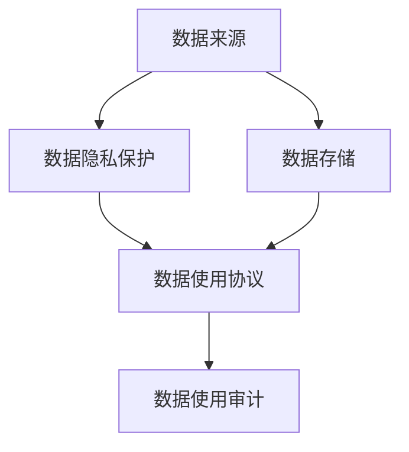

                 

# 人工智能创业：确保数据合法性

在人工智能(AI)领域，数据驱动创新已经成为了行业共识。无论是在商业AI产品开发，还是在AI研究中，高效、合规地获取和利用数据都是至关重要的。然而，随着数据量的激增和隐私保护的严格要求，确保数据的合法性成为AI创业公司和研究者的重要课题。本文将从数据合法性在AI创业中的重要性、关键概念与联系、核心算法与操作细节、数学模型与实践案例、应用场景与未来展望、工具与资源推荐以及总结与未来挑战等方面进行全面剖析。

## 1. 背景介绍

### 1.1 问题由来

在过去几十年中，数据驱动的AI技术已经取得了显著的突破，广泛应用于图像识别、自然语言处理、智能推荐等领域。但随着数据量的指数级增长，数据合法性问题逐渐凸显。具体而言，数据合法性问题包括数据的来源、收集、存储、使用等各个环节，涉及数据隐私保护、数据所有权、数据使用协议等多个方面。数据合法性问题的出现，不仅会影响AI技术的普及和应用，还可能带来法律和伦理上的风险。

### 1.2 问题核心关键点

数据合法性问题涉及多个关键点：

- **数据来源**：确保数据来自合法渠道，如用户同意、公开数据集等。
- **数据隐私**：保护用户隐私，确保数据不会被滥用或泄露。
- **数据存储**：合理存储数据，避免数据丢失或损坏。
- **数据使用**：明确数据使用范围，避免未经授权的数据访问和使用。
- **合规性检查**：定期检查数据使用合规性，及时发现和修正潜在风险。

在AI创业中，确保数据合法性是成功实施AI技术的基础。一旦数据合法性出现问题，可能导致项目失败甚至引发法律纠纷，对企业的声誉和商业价值产生严重影响。

## 2. 核心概念与联系

### 2.1 核心概念概述

为更好地理解数据合法性在AI创业中的重要性，本节将介绍几个关键概念：

- **数据隐私保护**：保护用户的个人信息和数据不被滥用或泄露，包括但不限于GDPR、CCPA等法规的要求。
- **数据所有权**：界定数据所有者，明确数据使用权，包括开源数据集和商业数据。
- **数据访问协议**：规定数据的使用权限和范围，确保数据使用的合规性。
- **数据使用审计**：对数据使用过程进行定期检查和审计，确保合规。

这些核心概念之间的逻辑关系可以通过以下Mermaid流程图来展示：



这个流程图展示了数据合法性的主要流程：

1. 数据来源合法。
2. 数据隐私得到保护。
3. 数据存储合理。
4. 数据使用协议明确。
5. 数据使用审计定期进行。

## 3. 核心算法原理 & 具体操作步骤
### 3.1 算法原理概述

确保数据合法性的核心算法原理包括以下几个方面：

1. **数据隐私保护算法**：利用加密、匿名化等技术，保护用户隐私，防止数据泄露。
2. **数据访问控制算法**：基于身份验证、权限控制等技术，确保数据访问的合规性。
3. **数据使用审计算法**：定期检查数据使用情况，发现和纠正潜在风险。

这些算法通常与具体的业务场景结合，形成一套完整的数据管理流程。

### 3.2 算法步骤详解

数据合法性的具体步骤包括：

1. **数据收集**：从合法渠道收集数据，如用户同意、公开数据集等。
2. **数据存储**：选择合适的存储方案，确保数据的安全和可访问性。
3. **数据使用**：根据数据使用协议，合理使用数据，确保不违反数据隐私保护法。
4. **数据审计**：定期检查数据使用情况，发现并纠正潜在风险。

### 3.3 算法优缺点

数据合法性的算法具有以下优点：

- **保护用户隐私**：通过加密和匿名化技术，保护用户隐私。
- **确保数据合规**：通过身份验证和权限控制，确保数据使用的合法性。
- **防范潜在风险**：通过定期审计，发现和修正数据使用的风险点。

但同时，这些算法也存在一些缺点：

- **技术复杂性高**：加密、匿名化等技术需要高水平的技术支持。
- **资源消耗大**：加密和匿名化技术对计算资源和存储空间有较高要求。
- **维护成本高**：数据访问控制和审计需要持续的维护和更新。

### 3.4 算法应用领域

确保数据合法性在多个领域都有广泛的应用，包括但不限于：

- **医疗AI**：确保患者隐私数据的安全。
- **金融AI**：保护客户敏感信息不被滥用。
- **零售AI**：保障用户购物数据的合法使用。
- **智慧城市**：保护公民的个人数据不被滥用。
- **智能制造**：确保生产数据的安全和合规。

这些应用场景中的数据合法性问题，需要通过合理的算法和技术手段进行管理和保障。

## 4. 数学模型和公式 & 详细讲解 & 举例说明

### 4.1 数学模型构建

数据合法性问题可以通过数学模型来建模和分析。常见的数学模型包括：

- **隐私保护模型**：利用差分隐私和同态加密技术，保护数据隐私。
- **访问控制模型**：基于角色访问控制(RBAC)和属性基访问控制(ABAC)等技术，控制数据访问。
- **审计模型**：通过数据分析和机器学习算法，定期检查数据使用情况。

### 4.2 公式推导过程

以差分隐私为例，其核心公式为：

$$
\epsilon = \frac{1}{2} \ln(\frac{1}{\delta} + \frac{2 | \mathcal{X} |}{\epsilon^2})
$$

其中，$\epsilon$ 为隐私预算，$\delta$ 为隐私失败概率，$\mathcal{X}$ 为数据集规模。这个公式计算的是隐私预算与隐私失败概率的关系，用于指导差分隐私算法的设计和实现。

### 4.3 案例分析与讲解

假设有一个零售公司需要利用用户购物数据进行AI训练，首先从合法渠道收集数据。然后，通过差分隐私技术，对用户购物数据进行匿名化处理，确保用户隐私不被泄露。在数据使用阶段，制定严格的数据访问协议，仅允许授权人员访问数据。最后，定期进行数据审计，检查数据使用情况，发现并纠正潜在风险。

## 5. 项目实践：代码实例和详细解释说明

### 5.1 开发环境搭建

在进行数据合法性项目实践前，我们需要准备好开发环境。以下是使用Python进行开发的必要步骤：

1. 安装Python：从官网下载并安装Python，确保版本稳定。
2. 安装PyTorch和TensorFlow：这两个框架在AI领域应用广泛，提供了强大的深度学习能力。
3. 安装Pandas和Scikit-Learn：用于数据处理和分析。
4. 安装加密库（如PyNaCl）和访问控制库（如Flask-Security）。

完成上述步骤后，即可在本地搭建开发环境。

### 5.2 源代码详细实现

下面以一个简单的数据收集和存储为例，展示数据合法性项目的具体实现：

```python
import pandas as pd
from nacl.encoding import Base64Encoder
from nacl.secret import SecretBox

# 假设数据集存储在CSV文件中
data_path = 'data.csv'
data = pd.read_csv(data_path)

# 使用加密库对数据进行加密
secret_key = b'my_secret_key'
encoder = Base64Encoder()
box = SecretBox(secret_key)
data_encoded = encoder.decode(box.encrypt(data.to_json(), encoder))

# 存储加密后的数据
with open('data_encrypted.json', 'wb') as f:
    f.write(data_encoded)
```

### 5.3 代码解读与分析

**代码解读**：

- `Base64Encoder` 和 `SecretBox` 类分别用于对数据进行编码和加密。
- `nacl` 库提供了NaCl加密算法，用于保证数据的安全性和隐私性。
- `data.to_json()` 将数据转换为JSON格式，以便进行加密。

**分析**：

- 数据加密过程需要生成一个密钥，密钥应妥善保管，避免泄露。
- 加密后，数据转换为Base64编码，便于存储和传输。
- 加密后的数据可以存储在本地或远程服务器，确保数据的安全性。

### 5.4 运行结果展示

运行上述代码后，可以在本地生成一个加密后的数据文件 `data_encrypted.json`，确保数据在存储和传输过程中不被泄露。

## 6. 实际应用场景

### 6.1 医疗AI中的数据合法性

在医疗AI领域，确保患者数据的安全和隐私至关重要。医疗数据通常包含敏感信息，如病历、体检结果等，任何泄露都可能对患者造成严重伤害。确保医疗数据的合法性，需要在数据收集、存储、使用等环节进行严格控制。

具体措施包括：

- **数据收集**：从合法渠道收集数据，如医院授权、患者同意等。
- **数据存储**：使用加密技术，确保数据在存储过程中的安全性。
- **数据使用**：严格限制数据访问权限，仅允许授权人员访问数据。
- **数据审计**：定期检查数据使用情况，发现并纠正潜在风险。

### 6.2 金融AI中的数据合法性

金融AI项目需要处理大量敏感数据，如用户交易记录、信用卡信息等。这些数据一旦泄露，将带来严重的经济损失。因此，确保金融数据的合法性，是金融AI项目成功的关键。

具体措施包括：

- **数据收集**：从合法渠道收集数据，如用户同意、金融监管机构授权等。
- **数据存储**：使用高强度加密技术，确保数据的安全性。
- **数据使用**：制定严格的数据访问协议，确保数据使用合规。
- **数据审计**：定期进行数据审计，发现并修正潜在风险。

### 6.3 智能制造中的数据合法性

智能制造需要处理大量的生产数据，包括设备状态、生产过程等。这些数据如果被非法获取或篡改，将对企业造成重大损失。因此，确保智能制造数据的合法性，是智能制造项目成功的重要保障。

具体措施包括：

- **数据收集**：从合法渠道收集数据，如设备制造商授权、生产过程监控等。
- **数据存储**：使用高强度加密技术，确保数据的安全性。
- **数据使用**：制定严格的数据访问协议，确保数据使用合规。
- **数据审计**：定期进行数据审计，发现并修正潜在风险。

## 7. 工具和资源推荐

### 7.1 学习资源推荐

为了帮助开发者系统掌握数据合法性的相关知识，这里推荐一些优质的学习资源：

1. **《数据隐私保护》课程**：由知名专家开设的在线课程，涵盖数据隐私保护的基本概念、技术手段和法律法规。
2. **《数据安全与隐私保护》书籍**：详细介绍了数据安全与隐私保护的技术和实践，适合深入学习。
3. **《人工智能伦理与安全》报告**：分析了AI技术在隐私保护和安全方面的挑战和解决方案，具有较高的参考价值。

### 7.2 开发工具推荐

确保数据合法性的开发离不开优秀的工具支持。以下是几款常用的开发工具：

1. **PyTorch和TensorFlow**：这两个深度学习框架在AI领域应用广泛，提供了强大的深度学习能力。
2. **NaCl**：提供了NaCl加密算法，用于保证数据的安全性和隐私性。
3. **Flask-Security**：基于Flask的访问控制库，用于实现基于角色的访问控制。
4. **TensorBoard**：TensorFlow配套的可视化工具，用于实时监测模型训练状态，并提供丰富的图表呈现方式。

### 7.3 相关论文推荐

数据合法性问题的研究源于学界的持续研究。以下是几篇奠基性的相关论文，推荐阅读：

1. **《差分隐私的理论与应用》**：介绍差分隐私的基本概念和应用场景，是隐私保护领域的重要文献。
2. **《基于角色的访问控制技术》**：介绍RBAC和ABAC等访问控制技术的基本原理和实现方法。
3. **《数据使用审计：方法与工具》**：分析了数据使用审计的基本方法和工具，提供了实际应用的参考。

这些论文代表了大数据合法性问题的研究进展。通过学习这些前沿成果，可以帮助研究者把握学科前进方向，激发更多的创新灵感。

## 8. 总结：未来发展趋势与挑战

### 8.1 总结

本文对数据合法性在AI创业中的重要性进行了全面系统的介绍。首先阐述了数据合法性问题的来源和核心关键点，明确了数据合法性对AI创业的重要性。其次，从原理到实践，详细讲解了数据合法性的数学模型和具体步骤，给出了数据合法性项目开发的完整代码实例。同时，本文还广泛探讨了数据合法性在医疗、金融、智能制造等多个领域的应用前景，展示了数据合法性的巨大潜力。此外，本文精选了数据合法性的各类学习资源，力求为读者提供全方位的技术指引。

通过本文的系统梳理，可以看到，确保数据合法性是AI创业成功的关键因素。未来，伴随数据合法性技术的持续演进，相信AI技术在各个领域的应用将会更加广泛和深入，为人类社会带来更多的价值和创新。

### 8.2 未来发展趋势

展望未来，数据合法性技术将呈现以下几个发展趋势：

1. **技术手段的多样化**：随着技术的不断进步，数据合法性将越来越多地采用先进的加密和匿名化技术，提高数据隐私保护的水平。
2. **合规要求的严格化**：随着数据隐私保护法规的不断完善，数据合法性将面临更高的合规要求，需要不断调整和优化数据管理策略。
3. **跨领域应用的广泛化**：数据合法性技术将逐步应用到更多领域，如智慧城市、智能制造等，提升数据管理的全面性和系统性。
4. **数据流动的灵活化**：未来数据合法性技术将更加注重数据在不同系统、平台之间的流动，确保数据合法性的一致性和稳定性。
5. **自动化工具的普及化**：自动化工具和平台将逐步普及，帮助企业更高效地管理数据合法性，减少人工干预和错误。

以上趋势凸显了数据合法性技术的广阔前景。这些方向的探索发展，必将进一步提升数据管理的规范性和安全性，为AI技术在更多领域的应用提供保障。

### 8.3 面临的挑战

尽管数据合法性技术已经取得了一定的进展，但在迈向更加智能化、普适化应用的过程中，它仍面临诸多挑战：

1. **技术复杂性高**：加密、匿名化等技术需要高水平的技术支持，对开发者提出了较高的技术要求。
2. **资源消耗大**：加密和匿名化技术对计算资源和存储空间有较高要求，可能对企业带来额外的成本压力。
3. **合规要求严格**：不同地区的数据隐私保护法规不同，需要根据不同法规进行数据管理和合规检查。
4. **数据流动复杂**：数据在不同系统、平台之间的流动需要确保数据合法性的一致性和稳定性，技术实现较为复杂。
5. **监管风险高**：数据合法性涉及多个利益相关方，需要协调多方关系，确保合规。

### 8.4 研究展望

面对数据合法性面临的挑战，未来的研究需要在以下几个方面寻求新的突破：

1. **自动化技术**：开发更加自动化的数据合法性工具，降低技术门槛，提高数据管理效率。
2. **隐私计算**：利用隐私计算技术，在不泄露数据隐私的情况下，实现数据的共享和分析。
3. **数据安全协议**：制定更加严格的数据安全协议，确保数据在传输和存储过程中的安全。
4. **跨领域标准**：制定跨领域的数据合法性标准，统一不同领域的数据管理要求。
5. **法规合规**：积极参与和推动数据隐私保护法规的制定和完善，为数据合法性提供法律保障。

这些研究方向的探索，必将引领数据合法性技术迈向更高的台阶，为构建安全、可靠、可控的AI系统提供更坚实的基础。

## 9. 附录：常见问题与解答

**Q1：数据合法性是否只适用于AI领域？**

A: 数据合法性不仅适用于AI领域，在金融、医疗、零售等多个领域都有广泛的应用。任何涉及数据的场景，都需要确保数据的合法性，以保护用户隐私和数据安全。

**Q2：如何选择合适的加密算法？**

A: 选择加密算法需要综合考虑数据类型、安全性需求和性能要求。常用的加密算法包括AES、RSA、ECC等。AES适用于对称加密，性能较好，RSA和ECC适用于非对称加密，安全性较高。在选择加密算法时，需要根据具体场景进行评估和选择。

**Q3：数据合法性在实际应用中需要注意哪些问题？**

A: 在实际应用中，数据合法性需要注意以下几个问题：

- **数据来源合法**：确保数据来自合法渠道，如用户同意、公开数据集等。
- **数据存储安全**：合理选择存储方案，确保数据的安全和可访问性。
- **数据访问控制**：制定严格的数据访问协议，确保数据使用的合规性。
- **数据审计**：定期检查数据使用情况，发现并纠正潜在风险。

**Q4：数据合法性技术如何与AI模型结合？**

A: 数据合法性技术可以与AI模型结合，确保AI模型在数据使用过程中的合法性和安全性。具体来说，可以在数据预处理阶段进行加密和匿名化，在模型训练和推理过程中进行数据访问控制和审计，确保数据使用的合规性和安全性。

通过本文的系统梳理，可以看到，确保数据合法性是AI创业成功的关键因素。未来，伴随数据合法性技术的持续演进，相信AI技术在各个领域的应用将会更加广泛和深入，为人类社会带来更多的价值和创新。总之，数据合法性需要开发者根据具体场景，不断迭代和优化技术、数据和算法，方能得到理想的效果。

---

作者：禅与计算机程序设计艺术 / Zen and the Art of Computer Programming

