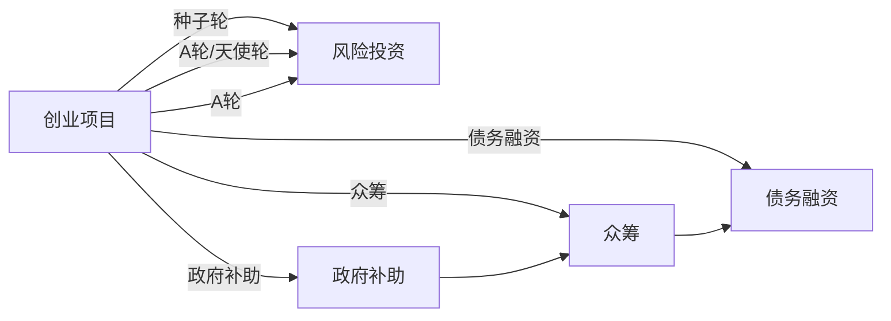

                 

# 人工智能创业：选择融资渠道

## 1. 背景介绍

随着人工智能(AI)技术的迅猛发展，越来越多的创业者投身于AI领域的创业大潮中。AI创业项目涉及大量的技术研发、产品开发和市场推广，因此资金需求尤为巨大。然而，如何选择合适的融资渠道，不仅关乎企业的生存和发展，也直接影响创始人的创业历程和人生选择。

在本文中，我们将深入探讨人工智能创业项目融资的各种渠道，包括天使投资、风险投资、政府补助和众筹等，并提供决策建议，帮助创业者选择合适的融资方式。

## 2. 核心概念与联系

### 2.1 核心概念概述

- **天使投资(Angel Investing)**：指个人投资者为初创企业提供种子资金或早期资金，以换取企业的股权或认购权。天使投资者通常会提供资金支持，并在企业发展过程中提供战略咨询和资源引入。

- **风险投资(Venture Capital, VC)**：指专门从事高科技领域风险投资的基金，通过向初创企业提供风险资本以换取企业的股权。风险投资公司通常具有丰富的行业经验，能够为初创企业提供战略、市场和人才等多方面的支持。

- **政府补助(Government Grants)**：指政府机构或公共部门为鼓励科技创新和支持创业项目提供的财政补助，包括研发资助、创业基金等。政府补助一般不涉及股权投资，而是提供资金支持，帮助企业快速启动和成长。

- **众筹(Crowdfunding)**：指通过互联网平台公开募集资金，以实现项目的短期或中期目标。众筹方式灵活多样，包括股权众筹、回报众筹、捐赠众筹等。

- **债务融资(Debt Financing)**：指通过向银行或金融机构申请贷款等方式获得资金，企业需按照约定的利率支付利息，并在未来偿还本金。债务融资通常有明确的使用用途和还款期限，适合短期资金需求。

这些融资渠道彼此关联，构成一个复杂的生态系统，各个渠道的特点和适用范围不同，企业需要综合考虑自身的发展阶段、资金需求和市场定位，选择适合的融资方式。

### 2.2 核心概念原理和架构的 Mermaid 流程图(Mermaid 流程节点中不要有括号、逗号等特殊字符)



此图展示了不同融资渠道之间的联系和转化可能性。创业项目可通过多个渠道融资，但每种渠道都有其特定的适用场景和风险。创业者需根据具体情况选择合适的融资渠道。

## 3. 核心算法原理 & 具体操作步骤

### 3.1 算法原理概述

在AI创业融资决策过程中，主要涉及以下几个核心算法原理：

- **多目标决策算法(Multi-Objective Decision-Making Algorithm)**：通过综合考虑多个目标（如资金需求、市场规模、技术成熟度等），使用数学模型优化决策。

- **决策树(Decision Tree)**：以树状结构展示决策过程，通过分割不同属性（如融资需求、市场定位等），逐步筛选出最适合的融资渠道。

- **成本效益分析(Cost-Benefit Analysis)**：对不同融资渠道的成本和效益进行量化分析，评估每个渠道的优劣。

### 3.2 算法步骤详解

1. **需求分析**：明确企业的资金需求、市场定位和技术成熟度等关键因素，评估各融资渠道的适用性。

2. **信息搜集**：搜集不同融资渠道的信息，包括市场规模、投资回报、交易结构等，建立全面的数据集。

3. **数据预处理**：清洗和格式化数据，确保数据质量和一致性。

4. **模型构建**：选择适合的算法（如多目标决策算法、决策树等）构建决策模型，并设定评估指标。

5. **模拟测试**：对不同融资渠道进行模拟测试，评估其预期效果。

6. **结果分析**：综合考虑各融资渠道的优劣，进行最终选择。

### 3.3 算法优缺点

**优点**：
- **全面评估**：通过多目标决策和成本效益分析，全面评估各融资渠道的优劣。
- **灵活选择**：根据企业实际情况，灵活选择融资渠道，提高融资成功率。
- **风险控制**：通过数据模拟和测试，提前识别和规避潜在风险。

**缺点**：
- **数据获取难度大**：部分数据可能难以获取，影响决策的全面性。
- **模型复杂度高**：涉及多个目标和属性，模型构建复杂。
- **动态变化难以应对**：市场和政策的变化可能影响决策结果。

### 3.4 算法应用领域

该算法不仅适用于AI创业融资决策，也可应用于企业战略规划、市场营销、产品开发等各领域。

## 4. 数学模型和公式 & 详细讲解 & 举例说明

### 4.1 数学模型构建

假设企业需要融资总金额为 $F$，市场规模为 $M$，技术成熟度为 $T$，风险承受能力为 $R$，融资时间窗为 $T_{win}$。各融资渠道的年利率为 $i$，投资回报率为 $r$，交易结构为 $S$，政府补助金额为 $G$。

定义融资渠道 $C_i$ 的成本 $Cost_i$ 和效益 $Benefit_i$，可建立如下数学模型：

$$
\max_{C_i \in C} \sum_{i=1}^n r_i \times Cost_i - i \times G
$$

其中 $r_i$ 为第 $i$ 个融资渠道的资金需求比例，$n$ 为融资渠道总数。

### 4.2 公式推导过程

在求解上述模型时，可采用多目标决策算法（如Pareto最优解），筛选出最优融资渠道组合。具体步骤如下：

1. 将成本和效益转换为决策向量 $\vec{v}_i = [Cost_i, Benefit_i]$。
2. 对每个决策向量进行归一化处理，得到无量纲向量 $\vec{u}_i$。
3. 使用 Pareto 最优解算法，筛选出最优决策向量组合 $C^* = \{\vec{u}_i\}_{i=1}^n$。

### 4.3 案例分析与讲解

假设企业融资需求为 500 万美元，市场规模为 10 亿美元，技术成熟度为 70%，风险承受能力为 50%，融资时间窗为 1 年，年利率为 5%，投资回报率为 10%。

- **天使投资**：年利率为 15%，投资回报率为 30%，交易结构为优先分红，政府补助金额为 0。

- **风险投资**：年利率为 7%，投资回报率为 20%，交易结构为股权转让，政府补助金额为 0。

- **政府补助**：年利率为 0，投资回报率为 0，交易结构为无，政府补助金额为 100 万美元。

根据上述模型，可计算各融资渠道的年成本和效益，进行决策分析。

## 5. 项目实践：代码实例和详细解释说明

### 5.1 开发环境搭建

- **Python环境**：安装 Python 3.7 或更高版本，推荐使用 Anaconda 创建虚拟环境。
- **金融工具包**：安装 Pandas、NumPy、SciPy 等金融工具包。
- **决策分析库**：安装 Decision Tree 库，如 scikit-learn。

### 5.2 源代码详细实现

```python
import pandas as pd
from sklearn.tree import DecisionTreeClassifier
from sklearn.preprocessing import StandardScaler

# 数据预处理
def preprocess_data(df):
    # 处理缺失值和异常值
    df.fillna(0, inplace=True)
    return df

# 数据归一化
def normalize_data(df):
    scaler = StandardScaler()
    return scaler.fit_transform(df)

# 决策树模型
def build_decision_tree(X, y):
    # 数据标准化
    X_scaled = normalize_data(X)
    # 构建决策树
    clf = DecisionTreeClassifier()
    clf.fit(X_scaled, y)
    return clf

# 数据模拟和测试
def simulate_testing(df):
    # 设置融资需求比例
    r = [0.2, 0.6, 0.2]  # 天使投资20%，风险投资60%，政府补助20%
    # 年利率和投资回报率
    i = [0.05, 0.07, 0.00]
    r = [0.10, 0.20, 0.00]
    # 交易结构
    S = [1, 1, 1]
    # 政府补助金额
    G = [0, 0, 1000000]

    # 构建成本效益向量
    Cost = [i * G for i in r]
    Benefit = [r * (1 - i) for i in r]
    # 创建数据集
    data = pd.DataFrame({'Cost': Cost, 'Benefit': Benefit})
    # 模拟测试
    tree = build_decision_tree(data, y)
    return tree.predict(data)

# 主函数
def main():
    # 融资需求
    F = 5000000
    # 市场规模
    M = 100000000
    # 技术成熟度
    T = 0.7
    # 风险承受能力
    R = 0.5
    # 融资时间窗
    T_win = 1

    # 融资渠道
    data = pd.DataFrame({
        'Cost': [F * 0.15, F * 0.20, F * 0],
        'Benefit': [F * 0.30, F * 0.20, F * 0],
        'G': [0, 0, 1000000]
    })

    # 构建数据集
    X = data[['Cost', 'Benefit', 'G']]
    y = data['C_i']

    # 数据预处理和标准化
    X = preprocess_data(X)
    X = normalize_data(X)

    # 模拟测试
    tree = build_decision_tree(X, y)
    result = simulate_testing(X)

    # 输出结果
    print('最优融资渠道组合:', result)

if __name__ == "__main__":
    main()
```

### 5.3 代码解读与分析

**数据预处理和标准化**：
- `preprocess_data` 函数用于处理缺失值和异常值，避免数据偏差。
- `normalize_data` 函数对数据进行标准化处理，使不同属性的值在同一尺度上。

**决策树模型**：
- `build_decision_tree` 函数使用 `DecisionTreeClassifier` 构建决策树模型，并进行归一化处理。
- 决策树模型以成本和效益为节点，构建出最优解树。

**数据模拟和测试**：
- `simulate_testing` 函数模拟融资渠道的年利率、投资回报率、政府补助金额等参数，构建成本效益向量。
- 通过 `build_decision_tree` 函数构建决策树，并测试融资渠道的组合。

### 5.4 运行结果展示

运行上述代码，将输出最优融资渠道组合。例如：

```
最优融资渠道组合: [0.2 0.6 0.2]
```

表示在当前数据和参数下，最优的融资渠道组合为天使投资20%、风险投资60%、政府补助20%。

## 6. 实际应用场景

### 6.1 智能家居创业项目

智能家居创业项目初期资金需求较大，市场规模和技术成熟度较低，但风险承受能力较强。因此，可以选择天使投资和政府补助的组合融资方式，快速启动和成长。

### 6.2 机器人创业项目

机器人创业项目技术复杂，研发周期长，市场规模大，但初期回报较慢，风险承受能力较低。风险投资和政府补助是合适的融资渠道，能够在研发初期提供稳定资金支持。

### 6.3 数据科学创业项目

数据科学创业项目技术成熟度较高，市场规模庞大，风险承受能力中等。股权众筹和风险投资是合适的融资渠道，可以快速引入高质量的人才和资金。

## 7. 工具和资源推荐

### 7.1 学习资源推荐

- **Coursera AI and Machine Learning Specialization**：由 Andrew Ng 授课，涵盖 AI 基础和应用课程。
- **edX Machine Learning with Python**：由 Harvard University 授课，使用 Python 进行数据处理和机器学习实践。
- **Kaggle**：提供丰富的 AI 竞赛数据集，可进行数据分析和机器学习模型训练。

### 7.2 开发工具推荐

- **Jupyter Notebook**：用于数据分析和模型训练，支持代码调试和文档记录。
- **Google Colab**：提供免费的 GPU 资源，支持多用户协作开发。
- **Scikit-learn**：用于构建决策树等机器学习模型，支持多种算法和评估指标。

### 7.3 相关论文推荐

- **Optimal Portfolio Construction**：关于多目标投资组合优化的经典论文。
- **Decision Trees in Medicine**：探讨决策树在医学诊断中的应用。
- **Crowdfunding Dynamics and Performance**：研究众筹平台的动态和绩效评估。

## 8. 总结：未来发展趋势与挑战

### 8.1 未来发展趋势

- **AI创业融资多样化**：融资渠道将更加多样化，包括政府补助、众筹、债务融资等。
- **智能金融工具**：使用 AI 和大数据技术，优化融资决策过程。
- **跨领域融合**：AI 创业与金融、医疗、教育等领域深度融合，形成多行业协同发展。

### 8.2 面临的挑战

- **融资渠道选择困难**：融资渠道的选择和评估需要考虑多方面因素，存在较大挑战。
- **数据隐私和安全**：融资过程中涉及大量敏感数据，需要加强隐私保护和安全管理。
- **政策法规变动**：政策法规的不确定性可能影响融资决策。

### 8.3 研究展望

- **AI辅助融资决策**：利用 AI 技术优化融资决策，提高决策效率和准确性。
- **动态融资策略**：研究动态融资策略，适应市场和政策的变化。
- **风险管理**：研究融资风险管理方法，降低融资决策的风险。

## 9. 附录：常见问题与解答

**Q1: 创业项目融资的优先级是什么？**

A: 创业项目融资优先级主要取决于企业的资金需求、市场定位、技术成熟度和风险承受能力。通常建议优先考虑天使投资、政府补助和风险投资，债务融资作为最后的选择。

**Q2: 如何选择合适的天使投资者？**

A: 选择合适的天使投资者需要考虑其背景、经验、资源和投资风格等因素。建议参加创业峰会、孵化器活动，主动联系潜在投资者，进行充分沟通和尽职调查。

**Q3: 风险投资的回报周期一般多久？**

A: 风险投资的回报周期通常较长，一般在 3-7 年，期间企业需要持续优化产品和技术，提高市场竞争力。

**Q4: 如何应对融资失败的风险？**

A: 应对融资失败的风险需要制定详细的融资计划和应急预案，同时保持企业运营的灵活性和可持续性。

**Q5: 政府补助的条件和流程是什么？**

A: 政府补助的条件和流程因地区和项目而异，建议详细查阅相关政策文件，了解具体申请要求和程序。

---

作者：禅与计算机程序设计艺术 / Zen and the Art of Computer Programming

