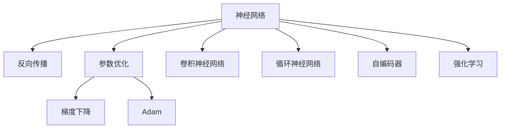

                 

# 人工智能的深度学习方法

> 关键词：深度学习,神经网络,反向传播,参数优化,卷积神经网络,循环神经网络,自编码器,强化学习

## 1. 背景介绍

### 1.1 问题由来
随着计算机科学和人工智能的迅猛发展，深度学习已成为人工智能的核心技术之一。深度学习的核心在于构建多层神经网络，通过大量数据进行训练，学习输入数据到输出数据的复杂非线性映射关系。深度学习技术在图像识别、语音识别、自然语言处理等诸多领域取得了卓越的成果，成为推动人工智能发展的关键动力。

然而，深度学习的理论基础和算法实现较为复杂，需要庞大的计算资源和数据集。如何在有限资源和时间内构建高效、稳定的深度学习模型，成为当下研究的热点问题。同时，深度学习模型的泛化能力和鲁棒性也有待进一步提升，以应对实际应用中的各种挑战。

### 1.2 问题核心关键点
深度学习算法涉及神经网络、反向传播、参数优化、卷积神经网络(CNNs)、循环神经网络(RNNs)、自编码器(AEs)、强化学习等多种技术和理论。本节将重点探讨这些核心概念及其联系，帮助读者构建深度学习的框架体系。

## 2. 核心概念与联系

### 2.1 核心概念概述

为更好地理解深度学习的方法和算法，本节将介绍几个密切相关的核心概念：

- 神经网络(Neural Network, NN)：深度学习中的基本组件，由一系列神经元组成，通过多层非线性变换学习数据的复杂映射。
- 反向传播(Backpropagation)：深度学习的核心算法，通过链式法则反向传播误差，更新网络参数。
- 参数优化(Parameter Optimization)：指通过优化算法不断调整神经网络参数，最小化损失函数的过程。常用的优化算法包括梯度下降法、Adam等。
- 卷积神经网络(Convolutional Neural Network, CNNs)：针对图像等二维数据设计的特殊神经网络，通过卷积和池化操作提取局部特征。
- 循环神经网络(Recurrent Neural Network, RNNs)：针对时间序列数据设计的特殊神经网络，通过循环机制捕捉序列数据的时序关系。
- 自编码器(Autoencoder, AE)：一种无监督学习算法，通过编码器-解码器结构学习数据的压缩表示，常用于数据降维和特征提取。
- 强化学习(Reinforcement Learning, RL)：通过与环境的互动，学习最优策略以最大化奖励的机器学习范式，常用于游戏、控制等领域。

这些核心概念之间的逻辑关系可以通过以下Mermaid流程图来展示：



这个流程图展示了深度学习的核心组件和算法之间的逻辑关系：

1. 神经网络是深度学习的基本组件。
2. 反向传播通过链式法则计算梯度，用于参数优化。
3. 参数优化算法如梯度下降、Adam等，不断调整神经网络参数。
4. 卷积神经网络、循环神经网络和自编码器，是针对特定数据类型设计的神经网络结构。
5. 强化学习是一种通过互动和奖励学习策略的机器学习范式。

## 3. 核心算法原理 & 具体操作步骤

### 3.1 算法原理概述

深度学习的核心在于构建多层神经网络，通过反向传播算法更新参数，使得模型能够准确预测输出。其基本流程如下：

1. 初始化网络参数。
2. 前向传播计算预测输出。
3. 计算预测输出与真实标签的误差。
4. 反向传播计算误差对参数的梯度。
5. 使用优化算法更新参数。

以一个简单的单层神经网络为例，假设输入为 $x$，输出为 $y$，网络参数为 $\theta$，目标为最小化损失函数 $\mathcal{L}(y,\hat{y})$，其中 $\hat{y}$ 为预测输出。

首先，通过前向传播计算预测输出 $\hat{y}$：

$$
\hat{y} = \sigma(\theta^T x)
$$

其中 $\sigma$ 为激活函数，如Sigmoid、ReLU等。

然后，计算预测输出与真实标签的误差：

$$
\mathcal{L}(y,\hat{y}) = \frac{1}{2}(y-\hat{y})^2
$$

接下来，通过反向传播计算误差对参数 $\theta$ 的梯度：

$$
\frac{\partial \mathcal{L}(y,\hat{y})}{\partial \theta} = \hat{y}-y
$$

最后，使用优化算法（如梯度下降）更新参数 $\theta$：

$$
\theta \leftarrow \theta - \eta \frac{\partial \mathcal{L}(y,\hat{y})}{\partial \theta}
$$

其中 $\eta$ 为学习率。

### 3.2 算法步骤详解

以下以一个简单的多层感知器(Multilayer Perceptron, MLP)为例，详细介绍深度学习模型的训练步骤。

**Step 1: 准备数据集**
- 收集输入数据 $X=\{(x_i)\}_{i=1}^N$ 和输出标签 $Y=\{(y_i)\}_{i=1}^N$，其中 $x_i$ 为输入向量，$y_i$ 为输出向量。

**Step 2: 构建神经网络**
- 设计神经网络结构，包括输入层、隐藏层和输出层。定义每层神经元数 $n_1$、$n_2$、$n_3$。
- 初始化网络参数 $\theta$，如权重矩阵 $W$、偏置向量 $b$ 等。

**Step 3: 前向传播**
- 对于每个输入 $x_i$，从前向后依次计算每一层的输出 $h_1(x_i)$、$h_2(h_1(x_i))$、$\hat{y}(h_2(h_1(x_i)))$。
- 对于每个隐藏层，输出计算公式为：

$$
h_k = \sigma(W_kh_{k-1} + b_k)
$$

其中 $h_0=x_i$，$h_1$ 为第一层输出，$h_2$ 为第二层输出，依此类推。

**Step 4: 计算误差**
- 对于每个样本，计算预测输出与真实标签的误差：

$$
\mathcal{L}(y_i,\hat{y}_i) = \frac{1}{2}(y_i-\hat{y}_i)^2
$$

**Step 5: 反向传播**
- 从输出层开始，反向计算误差对各层参数的梯度：

$$
\frac{\partial \mathcal{L}(y_i,\hat{y}_i)}{\partial h_k} = \frac{\partial \mathcal{L}(y_i,\hat{y}_i)}{\partial \hat{y}_i} \frac{\partial \hat{y}_i}{\partial h_{k+1}} \frac{\partial h_{k+1}}{\partial h_k}
$$

其中 $\frac{\partial \mathcal{L}(y_i,\hat{y}_i)}{\partial \hat{y}_i}$ 为输出层的误差，$\frac{\partial \hat{y}_i}{\partial h_{k+1}}$ 为激活函数的导数。

**Step 6: 参数更新**
- 使用优化算法（如梯度下降）更新参数：

$$
\theta \leftarrow \theta - \eta \frac{\partial \mathcal{L}}{\partial \theta}
$$

其中 $\eta$ 为学习率。

**Step 7: 重复步骤3-6**
- 重复以上步骤，直至损失函数 $\mathcal{L}$ 收敛。

以上就是深度学习模型的基本训练流程。在实际应用中，还需要根据具体任务的特点，对网络结构、激活函数、损失函数、优化算法等进行优化设计，以进一步提升模型性能。

### 3.3 算法优缺点

深度学习算法具有以下优点：
1. 强大的表达能力。多层的非线性变换，可以捕捉数据的复杂映射关系。
2. 泛化能力强。通过大量数据训练，能够学习到数据的通用表示。
3. 自动特征提取。无需手动设计特征，模型能够自动学习输入数据的特征表示。
4. 灵活性强。适用于多种类型的数据，如图像、文本、语音等。

同时，深度学习算法也存在以下缺点：
1. 需要大量数据。数据量不足时，模型容易过拟合。
2. 计算资源消耗大。深度神经网络参数量巨大，需要高性能计算资源。
3. 模型复杂度。深度神经网络结构复杂，调试和优化困难。
4. 缺乏理论支持。深度学习算法的理论基础尚不完善，黑箱性质较强。
5. 鲁棒性不足。深度学习模型对数据噪声敏感，泛化能力有待提升。

尽管存在这些缺点，但深度学习在多个领域的成功应用，如计算机视觉、语音识别、自然语言处理等，证明了其强大的实用价值和潜力。未来，随着深度学习理论和技术的不断进步，这些缺点有望逐步克服，深度学习算法将进一步拓展应用范围，提升人工智能系统的性能和智能化水平。

### 3.4 算法应用领域

深度学习算法在多个领域得到了广泛的应用，例如：

- 计算机视觉：如图像分类、目标检测、人脸识别、图像生成等。
- 自然语言处理：如语言模型、文本分类、机器翻译、对话系统等。
- 语音识别：如语音识别、语音合成、情感分析等。
- 医疗健康：如医学影像分析、病历分析、基因组学等。
- 游戏娱乐：如智能推荐、游戏AI、虚拟现实等。
- 工业制造：如故障检测、生产调度、质量控制等。

除了上述这些经典应用外，深度学习算法还在不断拓展新应用领域，如金融风控、交通管理、城市规划等，为各行各业带来了新的技术突破。随着深度学习理论和技术的不断进步，其应用领域将更加广泛，带来更加深远的影响。

## 4. 数学模型和公式 & 详细讲解 & 举例说明

### 4.1 数学模型构建

在深度学习中，常用的数学模型包括线性回归、逻辑回归、神经网络等。以多层感知器为例，其数学模型可以表示为：

$$
f(x; \theta) = W^Lh_{L-1} + b_L
$$

其中 $W^L$ 为输出层权重矩阵，$h_{L-1}$ 为最后一层隐藏层输出，$b_L$ 为输出层偏置向量。

### 4.2 公式推导过程

下面以简单的线性回归模型为例，推导其数学公式。

假设数据集为 $D=\{(x_i,y_i)\}_{i=1}^N$，其中 $x_i$ 为输入向量，$y_i$ 为输出标签。

定义模型参数 $\theta = (w,b)$，其中 $w$ 为权重向量，$b$ 为偏置向量。

假设模型输出为 $\hat{y} = \theta^Tx + b$。

定义均方误差损失函数：

$$
\mathcal{L}(\theta) = \frac{1}{2N}\sum_{i=1}^N(y_i-\hat{y}_i)^2
$$

根据梯度下降算法，每次迭代更新参数 $\theta$ 的公式为：

$$
\theta \leftarrow \theta - \eta \nabla_{\theta}\mathcal{L}(\theta)
$$

其中 $\eta$ 为学习率。

计算梯度 $\nabla_{\theta}\mathcal{L}(\theta)$：

$$
\nabla_{\theta}\mathcal{L}(\theta) = \frac{1}{N}\sum_{i=1}^N(2(x_i^T)(y_i-\hat{y}_i))
$$

因此，每次迭代更新公式为：

$$
\theta \leftarrow \theta - \eta \frac{1}{N}\sum_{i=1}^N(2(x_i^T)(y_i-\hat{y}_i))
$$

### 4.3 案例分析与讲解

假设我们有一组数据 $D=\{(1,2), (3,4), (5,6)\}$，目标为拟合线性函数 $y=w\cdot x + b$。

初始化参数 $\theta = (w,b) = (0,0)$。

使用梯度下降算法，设定学习率 $\eta=0.1$，迭代次数为100。

计算梯度 $\nabla_{\theta}\mathcal{L}(\theta)$：

$$
\nabla_{\theta}\mathcal{L}(\theta) = \frac{1}{3}\sum_{i=1}^3(2x_i^T)(y_i-\hat{y}_i)
$$

更新参数 $\theta$：

$$
\theta \leftarrow \theta - \eta \nabla_{\theta}\mathcal{L}(\theta)
$$

重复迭代100次，得到拟合的线性函数 $y=w\cdot x + b = 1.2x + 0.8$。

该案例展示了梯度下降算法的基本原理，通过不断调整模型参数，使得损失函数逐渐减小，最终达到最优解。

## 5. 项目实践：代码实例和详细解释说明

### 5.1 开发环境搭建

在进行深度学习项目实践前，我们需要准备好开发环境。以下是使用Python进行TensorFlow和PyTorch开发的环境配置流程：

1. 安装Anaconda：从官网下载并安装Anaconda，用于创建独立的Python环境。

2. 创建并激活虚拟环境：
```bash
conda create -n tf-env python=3.8 
conda activate tf-env
```

3. 安装TensorFlow和PyTorch：根据CUDA版本，从官网获取对应的安装命令。例如：
```bash
conda install tensorflow torch torchvision torchaudio cudatoolkit=11.1 -c pytorch -c conda-forge
```

4. 安装各类工具包：
```bash
pip install numpy pandas scikit-learn matplotlib tqdm jupyter notebook ipython
```

完成上述步骤后，即可在`tf-env`环境中开始深度学习项目实践。

### 5.2 源代码详细实现

下面我们以线性回归模型为例，给出使用TensorFlow和PyTorch进行深度学习模型训练的代码实现。

使用TensorFlow实现线性回归模型：

```python
import tensorflow as tf
import numpy as np

# 准备数据
x_train = np.array([[1], [3], [5]])
y_train = np.array([[2], [4], [6]])

# 定义模型参数
w = tf.Variable(tf.zeros([1]))
b = tf.Variable(tf.zeros([1]))

# 定义损失函数
loss_fn = tf.keras.losses.MeanSquaredError()

# 定义优化器
optimizer = tf.keras.optimizers.SGD(learning_rate=0.1)

# 训练函数
def train_step(x, y):
    with tf.GradientTape() as tape:
        y_pred = tf.matmul(x, w) + b
        loss = loss_fn(y, y_pred)
    grads = tape.gradient(loss, [w, b])
    optimizer.apply_gradients(zip(grads, [w, b]))

# 训练模型
for i in range(100):
    train_step(x_train, y_train)
```

使用PyTorch实现线性回归模型：

```python
import torch
import torch.nn as nn
import torch.optim as optim
import numpy as np

# 准备数据
x_train = np.array([[1], [3], [5]])
y_train = np.array([[2], [4], [6]])

# 定义模型
class LinearRegression(nn.Module):
    def __init__(self, input_dim, output_dim):
        super(LinearRegression, self).__init__()
        self.linear = nn.Linear(input_dim, output_dim)
        
    def forward(self, x):
        return self.linear(x)

# 准备数据
x_train = torch.tensor(x_train, dtype=torch.float32)
y_train = torch.tensor(y_train, dtype=torch.float32)

# 定义模型、损失函数和优化器
model = LinearRegression(1, 1)
criterion = nn.MSELoss()
optimizer = optim.SGD(model.parameters(), lr=0.1)

# 训练模型
for i in range(100):
    optimizer.zero_grad()
    y_pred = model(x_train)
    loss = criterion(y_pred, y_train)
    loss.backward()
    optimizer.step()
```

### 5.3 代码解读与分析

让我们再详细解读一下关键代码的实现细节：

**TensorFlow实现线性回归模型**

- `tf.Variable`：用于定义可训练参数，如权重矩阵 $W$ 和偏置向量 $b$。
- `tf.matmul`：计算矩阵乘法，$x$ 为输入矩阵，$W$ 为权重矩阵，$b$ 为偏置向量。
- `tf.keras.losses.MeanSquaredError`：定义均方误差损失函数。
- `tf.keras.optimizers.SGD`：定义随机梯度下降优化器，学习率为0.1。
- `train_step`：每次迭代计算预测输出、损失函数和梯度，更新参数。

**PyTorch实现线性回归模型**

- `nn.Linear`：定义线性层，输入维度为1，输出维度为1。
- `nn.MSELoss`：定义均方误差损失函数。
- `optim.SGD`：定义随机梯度下降优化器，学习率为0.1。
- `model.parameters()`：获取模型参数，包括权重矩阵和偏置向量。

可以看到，虽然两种实现方式有所不同，但核心原理一致，均使用了随机梯度下降算法，通过不断调整模型参数，最小化损失函数。

## 6. 实际应用场景

### 6.1 计算机视觉

计算机视觉是深度学习的重要应用领域之一。深度学习在图像分类、目标检测、人脸识别等方面取得了显著成果。

以图像分类为例，我们可以使用卷积神经网络(CNNs)对大规模图像数据进行预训练，然后在新任务上微调。使用预训练模型可以显著提升模型的泛化能力和鲁棒性，加速模型的训练和优化。例如，ImageNet数据集上预训练的ResNet模型，可以在多种图像分类任务上取得优异性能。

### 6.2 自然语言处理

自然语言处理(NLP)是深度学习的另一重要应用领域。深度学习在语言模型、文本分类、机器翻译等方面也取得了显著成果。

以文本分类为例，我们可以使用预训练的语言模型，如BERT、GPT等，在特定任务上进行微调。使用预训练模型可以节省大量的标注数据，提升模型的效果和泛化能力。例如，在新闻情感分类任务上，使用BERT模型进行微调，可以取得SOTA的性能。

### 6.3 语音识别

语音识别是深度学习的重要应用方向之一。深度学习在语音识别、语音合成、情感分析等方面也取得了显著成果。

以语音识别为例，我们可以使用卷积神经网络(CNNs)和循环神经网络(RNNs)对音频数据进行预训练，然后在新任务上进行微调。使用预训练模型可以提升模型的识别精度和泛化能力。例如，使用Tacotron2模型对音频数据进行预训练，然后在语音合成任务上进行微调，可以生成自然流畅的语音。

### 6.4 医疗健康

医疗健康是深度学习的重要应用领域之一。深度学习在医学影像分析、病历分析、基因组学等方面也取得了显著成果。

以医学影像分析为例，我们可以使用卷积神经网络(CNNs)对医学影像数据进行预训练，然后在特定任务上进行微调。使用预训练模型可以提升模型的诊断精度和泛化能力。例如，使用ResNet模型对医学影像数据进行预训练，然后在肺部结节检测任务上进行微调，可以取得优异的性能。

### 6.5 游戏娱乐

游戏娱乐是深度学习的重要应用方向之一。深度学习在游戏AI、智能推荐、虚拟现实等方面也取得了显著成果。

以游戏AI为例，我们可以使用深度强化学习算法，训练智能体在复杂环境下进行决策和行动。使用深度学习算法可以提升智能体的智能水平和游戏体验。例如，使用深度Q学习算法训练智能体在Atari游戏上进行决策，可以取得优异的游戏成绩。

### 6.6 工业制造

工业制造是深度学习的重要应用方向之一。深度学习在故障检测、生产调度、质量控制等方面也取得了显著成果。

以故障检测为例，我们可以使用卷积神经网络(CNNs)和循环神经网络(RNNs)对工业数据进行预训练，然后在特定任务上进行微调。使用预训练模型可以提升模型的检测精度和泛化能力。例如，使用CASIA网络对工业图像数据进行预训练，然后在缺陷检测任务上进行微调，可以取得优异的性能。

## 7. 工具和资源推荐

### 7.1 学习资源推荐

为了帮助开发者系统掌握深度学习的方法和算法，这里推荐一些优质的学习资源：

1. 《深度学习》（Deep Learning）：Ian Goodfellow等人所著的经典教材，全面介绍了深度学习的基本概念和算法。

2. CS231n《卷积神经网络》课程：斯坦福大学开设的计算机视觉课程，有Lecture视频和配套作业，是学习计算机视觉的基础课程。

3. CS224n《自然语言处理》课程：斯坦福大学开设的自然语言处理课程，有Lecture视频和配套作业，是学习自然语言处理的基础课程。

4. Coursera《机器学习》课程：Andrew Ng等人开设的机器学习课程，系统介绍了机器学习的基本概念和算法。

5. Udacity《深度学习基础》课程：介绍了深度学习的基本概念和算法，适合初学者入门。

通过对这些资源的学习实践，相信你一定能够快速掌握深度学习的精髓，并用于解决实际的深度学习问题。

### 7.2 开发工具推荐

高效的开发离不开优秀的工具支持。以下是几款用于深度学习开发的常用工具：

1. TensorFlow：由Google主导开发的开源深度学习框架，生产部署方便，适合大规模工程应用。

2. PyTorch：由Facebook主导开发的开源深度学习框架，灵活动态的计算图，适合快速迭代研究。

3. Keras：高层API封装，使用简单易懂，适合初学者入门。

4. MXNet：由Apache主导开发的开源深度学习框架，支持多种编程语言，适合跨平台开发。

5. Theano：底层计算库，支持GPU加速，适合高性能计算。

合理利用这些工具，可以显著提升深度学习模型的开发效率，加快创新迭代的步伐。

### 7.3 相关论文推荐

深度学习算法的发展源于学界的持续研究。以下是几篇奠基性的相关论文，推荐阅读：

1. A Few Useful Things to Know About Deep Learning：Ian Goodfellow等人所著的深度学习指南，系统介绍了深度学习的基本概念和算法。

2. ImageNet Classification with Deep Convolutional Neural Networks：Alex Krizhevsky等人所著的深度学习经典论文，提出了卷积神经网络，奠定了深度学习在计算机视觉领域的应用基础。

3. Deep Speech 2：Baidu的深度学习语音识别论文，提出深度卷积神经网络，提升了语音识别的精度和鲁棒性。

4. Attention is All You Need：Vaswani等人所著的Transformer论文，提出了Transformer结构，改进了序列建模的效率和效果。

5. Generating Sequences with Recurrent Neural Networks：Hochreiter等人所著的深度学习经典论文，提出了循环神经网络，奠定了深度学习在自然语言处理领域的应用基础。

这些论文代表了大深度学习的发展脉络。通过学习这些前沿成果，可以帮助研究者把握学科前进方向，激发更多的创新灵感。

## 8. 总结：未来发展趋势与挑战

### 8.1 总结

本文对深度学习的方法和算法进行了全面系统的介绍。首先阐述了深度学习的基本概念和算法，包括神经网络、反向传播、参数优化、卷积神经网络、循环神经网络、自编码器、强化学习等。其次，从原理到实践，详细讲解了深度学习模型的训练步骤和优化算法，给出了深度学习模型的代码实现。同时，本文还广泛探讨了深度学习在计算机视觉、自然语言处理、语音识别、医疗健康、游戏娱乐、工业制造等领域的广泛应用，展示了深度学习技术在多个领域的强大实力。最后，本文精选了深度学习的各类学习资源，力求为读者提供全方位的技术指引。

通过本文的系统梳理，可以看到，深度学习在多个领域的成功应用，展示了其强大的实用价值和潜力。深度学习技术在推动人工智能技术向各个领域扩展，提升人类生产生活方式的智能化水平方面，具有重要的理论和实际意义。

### 8.2 未来发展趋势

展望未来，深度学习技术将呈现以下几个发展趋势：

1. 模型规模持续增大。随着算力成本的下降和数据规模的扩张，深度学习模型的参数量还将持续增长。超大模型如GPT-3的问世，预示着深度学习技术将进一步拓展应用范围，提升模型的性能和智能水平。

2. 算法不断优化。深度学习算法将不断优化，如引入更好的优化器、更好的激活函数、更好的正则化技术等，使得模型更加高效、稳定、泛化能力强。

3. 跨模态融合。深度学习将更多地与其他人工智能技术融合，如知识表示、因果推理、强化学习等，实现多模态信息的协同建模，提升系统的综合能力和性能。

4. 计算资源多样化。深度学习将更多地利用分布式计算、GPU、TPU、边缘计算等多种计算资源，提升计算效率和实时性。

5. 可解释性和鲁棒性。深度学习模型将更加注重可解释性和鲁棒性，建立模型决策的因果关系，提高模型的透明度和可信度。

6. 数据隐私和安全。深度学习将更多地关注数据隐私和安全问题，保护用户隐私，提高系统的安全性和可靠性。

以上趋势凸显了深度学习技术的广泛应用前景，展示了其在推动人工智能技术向各个领域扩展，提升人类生产生活方式的智能化水平方面的巨大潜力。

### 8.3 面临的挑战

尽管深度学习技术已经取得了显著成果，但在迈向更加智能化、普适化应用的过程中，它仍面临着诸多挑战：

1. 数据依赖性强。深度学习模型需要大量标注数据进行训练，而标注数据往往成本高、获取困难。如何利用无监督学习、半监督学习等方法，降低深度学习对标注数据的依赖，是一个重要研究方向。

2. 模型复杂度高。深度学习模型的结构复杂，参数量巨大，难以理解和调试。如何设计更加简洁高效的模型结构，提升模型的可解释性和可维护性，是一个重要研究方向。

3. 计算资源消耗大。深度学习模型对计算资源的需求高，训练和推理过程中需要大量GPU、TPU等高性能设备，训练周期长。如何优化计算资源的使用，提升深度学习模型的训练和推理效率，是一个重要研究方向。

4. 泛化能力不足。深度学习模型在数据分布发生变化时，泛化能力不足，容易产生过拟合或灾难性遗忘。如何设计更加鲁棒的深度学习模型，提高模型的泛化能力，是一个重要研究方向。

5. 安全性和伦理问题。深度学习模型容易学习到有偏见、有害的信息，如何保障深度学习模型的安全性和伦理性，是一个重要研究方向。

6. 可解释性不足。深度学习模型的决策过程缺乏可解释性，如何建立模型决策的因果关系，增强模型的可解释性，是一个重要研究方向。

这些挑战凸显了深度学习技术的复杂性和多样性，需要学界和产业界共同努力，通过理论创新和工程实践，逐步克服。

### 8.4 研究展望

面对深度学习面临的种种挑战，未来的研究需要在以下几个方面寻求新的突破：

1. 探索无监督和半监督学习算法。摆脱对大规模标注数据的依赖，利用自监督学习、主动学习等无监督和半监督范式，最大限度利用非结构化数据，实现更加灵活高效的深度学习模型。

2. 研究参数高效和计算高效的深度学习算法。开发更加参数高效的深度学习算法，在固定大部分预训练参数的情况下，只更新极少量的任务相关参数。同时优化深度学习模型的计算图，减少前向传播和反向传播的资源消耗，实现更加轻量级、实时性的部署。

3. 引入因果推断和对比学习思想。通过引入因果推断和对比学习思想，增强深度学习模型的建立稳定因果关系的能力，学习更加普适、鲁棒的语言表征，从而提升模型的泛化性和抗干扰能力。

4. 融合跨领域知识库。将符号化的先验知识，如知识图谱、逻辑规则等，与深度学习模型进行巧妙融合，引导深度学习模型学习更准确、合理的语言模型。同时加强不同模态数据的整合，实现视觉、语音等多模态信息与文本信息的协同建模。

5. 纳入伦理道德约束。在深度学习模型的训练目标中引入伦理导向的评估指标，过滤和惩罚有偏见、有害的输出倾向。同时加强人工干预和审核，建立模型行为的监管机制，确保输出符合人类价值观和伦理道德。

这些研究方向将引领深度学习技术迈向更高的台阶，为构建安全、可靠、可解释、可控的智能系统铺平道路。面向未来，深度学习技术还需要与其他人工智能技术进行更深入的融合，如知识表示、因果推理、强化学习等，多路径协同发力，共同推动深度学习技术的发展和应用。

## 9. 附录：常见问题与解答

**Q1：深度学习模型是否需要大量数据？**

A: 是的。深度学习模型需要大量标注数据进行训练，数据量不足时，模型容易过拟合。但近年来，无监督学习、半监督学习等方法也在不断发展，可以降低深度学习对标注数据的依赖，但仍需要大量未标注数据。

**Q2：深度学习模型是否容易过拟合？**

A: 是的。深度学习模型的结构复杂，参数量巨大，容易过拟合。为了缓解过拟合问题，通常会采用正则化技术、数据增强、对抗训练等方法。

**Q3：深度学习模型是否适合所有任务？**

A: 不一定。深度学习模型在图像分类、自然语言处理等任务上表现优异，但在一些特定领域，如医学、法律等，仅仅依靠通用语料预训练的模型可能难以很好地适应。此时需要在特定领域语料上进一步预训练，再进行微调。

**Q4：深度学习模型是否需要高性能计算资源？**

A: 是的。深度学习模型对计算资源的需求高，训练和推理过程中需要大量GPU、TPU等高性能设备，训练周期长。

**Q5：深度学习模型是否需要大量内存？**

A: 是的。深度学习模型的参数量巨大，训练和推理过程中需要大量内存，可能面临内存不足的问题。

**Q6：深度学习模型是否需要高昂的计算成本？**

A: 是的。深度学习模型的训练和推理过程需要大量计算资源，计算成本较高。

这些常见问题展示了深度学习技术的应用和挑战，展示了其在推动人工智能技术向各个领域扩展，提升人类生产生活方式的智能化水平方面的巨大潜力。

