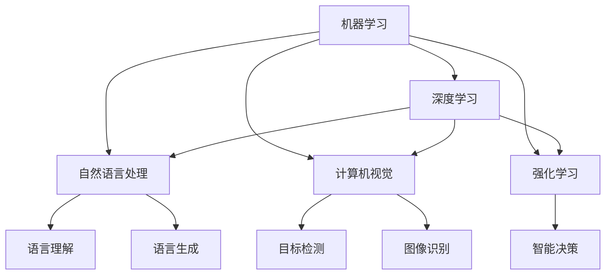

                 

# 人工智能研究的早期方向

> 关键词：人工智能,机器学习,深度学习,自然语言处理,NLP,算法优化,机器视觉,强化学习,专家系统

## 1. 背景介绍

### 1.1 问题由来
人工智能(AI)的研究可以追溯到20世纪50年代早期，那个时候的科学家们对机器模拟人脑的能力充满了无限憧憬。然而，早期的AI研究主要集中在符号主义和逻辑推理上，由于缺乏高效的数据处理和模型训练手段，这些方法在实际应用中往往表现不佳，直到机器学习(ML)和深度学习(Deep Learning, DL)技术的崛起。

机器学习和深度学习之所以能够脱颖而出，在于其充分利用了大规模数据和先进算法，能够自动地从数据中学习规律，进行模式识别和预测。它们不仅在图像识别、语音识别、自然语言处理(NLP)等任务上取得了突破，还在游戏、自动驾驶、推荐系统等领域展现出了巨大的潜力。

### 1.2 问题核心关键点
早期AI研究中的核心问题包括：
- 如何高效处理和分析大量数据，挖掘出其中的模式和规律？
- 如何在机器中模拟人类的认知和思维过程，实现自然语言的理解和生成？
- 如何在多模态数据中融合信息，实现跨领域的知识迁移和智能交互？
- 如何在复杂的系统中设计合理的算法，实现高效、稳定、可解释的人工智能应用？

这些问题引导了AI研究的多条早期发展方向，包括机器学习、深度学习、自然语言处理、计算机视觉、机器人学等。本文将通过梳理这些方向的核心概念、算法原理及应用场景，帮助读者系统了解人工智能研究的早期方向。

## 2. 核心概念与联系

### 2.1 核心概念概述

为更好地理解早期人工智能研究的核心方向，本节将介绍几个关键概念：

- 机器学习(Machine Learning, ML)：一种通过算法和模型，让计算机从数据中学习并做出预测或决策的过程。
- 深度学习(Deep Learning, DL)：一种使用多层神经网络，通过反向传播算法优化模型参数的ML方法。
- 自然语言处理(Natural Language Processing, NLP)：研究如何让计算机理解和处理人类语言，包括语言理解、生成、翻译等任务。
- 计算机视觉(Computer Vision, CV)：研究如何让计算机从视觉信息中提取特征，进行目标检测、图像识别等任务。
- 强化学习(Reinforcement Learning, RL)：一种通过智能体与环境的交互，学习最优策略的ML方法。
- 专家系统(Expert Systems)：一种基于规则和知识库，模拟人类专家的决策过程的AI系统。

这些核心概念之间的逻辑关系可以通过以下Mermaid流程图来展示：



这个流程图展示了许多关键技术领域之间的联系和相互影响：

1. 机器学习是各种AI技术的基础，深度学习是其重要的组成部分。
2. 自然语言处理、计算机视觉、强化学习等应用了机器学习的方法。
3. 自然语言处理中的语言理解、生成等任务，计算机视觉中的图像识别、目标检测等任务，强化学习中的智能决策等任务，都是深度学习的重要应用方向。

## 3. 核心算法原理 & 具体操作步骤
### 3.1 算法原理概述

早期人工智能研究中的核心算法原理主要包括：

- 监督学习(Supervised Learning)：使用已标注的数据，训练模型进行分类、回归等任务。
- 无监督学习(Unsupervised Learning)：不依赖标注数据，通过数据自聚类、降维等方法发现数据中的潜在规律。
- 半监督学习(Semi-supervised Learning)：结合少量标注数据和大量未标注数据，提升模型的泛化能力。
- 强化学习：通过智能体与环境的交互，学习最优决策策略。
- 神经网络：通过多层神经元进行信息处理，实现复杂的模式识别和预测。

这些算法原理构成了早期人工智能研究的基础，通过不断优化和改进，逐渐推动了AI技术的发展。

### 3.2 算法步骤详解

早期人工智能研究中的算法步骤一般包括以下几个关键步骤：

**Step 1: 数据预处理**
- 收集和清洗数据，确保数据质量。
- 数据标注，准备训练集和验证集。
- 数据增强，扩充训练集，提高模型泛化能力。

**Step 2: 模型构建与训练**
- 选择适当的模型，如线性回归、决策树、神经网络等。
- 初始化模型参数，选择合适的损失函数和优化器。
- 在训练集上进行模型训练，更新模型参数。

**Step 3: 模型评估与调优**
- 在验证集上评估模型性能，选择合适的超参数。
- 使用交叉验证、正则化等技术防止过拟合。
- 不断迭代优化模型，提升模型效果。

**Step 4: 模型部署与应用**
- 将训练好的模型部署到实际应用系统中。
- 收集新数据，重新训练和优化模型。

以上是早期人工智能研究中常用的算法步骤。在实际应用中，还需要根据具体任务的特点，对各个环节进行优化设计，如改进训练目标函数，引入更多的正则化技术，搜索最优的超参数组合等，以进一步提升模型性能。

### 3.3 算法优缺点

早期人工智能研究的算法具有以下优点：
1. 通用性强。各种算法都可以在不同的数据和任务上进行应用。
2. 算法成熟。经过多年的研究和实践，各种算法已经相当成熟，在学术界和工业界得到了广泛应用。
3. 结果可解释。早期人工智能算法往往具有较好的可解释性，便于理解和调试。

同时，这些算法也存在一定的局限性：
1. 数据依赖。许多早期算法依赖大量高质量标注数据，数据获取成本较高。
2. 训练时间长。由于缺乏高效的数据处理和模型训练手段，训练时间较长，难以快速迭代。
3. 可扩展性差。早期算法大多基于单个机器学习模型，难以处理大规模数据和多模态信息。

尽管存在这些局限性，但早期的AI研究为后续深度学习和强化学习的发展奠定了坚实基础，使得AI技术得以迅速发展和广泛应用。

### 3.4 算法应用领域

早期人工智能研究的算法广泛应用于各个领域，例如：

- 金融领域：使用机器学习进行信用评分、股票预测等。
- 医疗领域：使用深度学习进行医学影像分析、疾病预测等。
- 零售领域：使用强化学习进行库存管理、客户推荐等。
- 自然语言处理：使用自然语言处理技术进行文本分类、情感分析、机器翻译等。
- 计算机视觉：使用计算机视觉技术进行图像识别、目标检测、人脸识别等。

除了上述这些经典应用外，早期AI研究还为更多前沿技术的发展提供了方向，如生成对抗网络(GANs)、元学习(Meta Learning)、自监督学习等。

## 4. 数学模型和公式 & 详细讲解 & 举例说明

### 4.1 数学模型构建

本节将使用数学语言对早期人工智能研究的核心算法进行更加严格的刻画。

记机器学习模型为 $M_{\theta}:\mathcal{X} \rightarrow \mathcal{Y}$，其中 $\mathcal{X}$ 为输入空间，$\mathcal{Y}$ 为输出空间，$\theta \in \mathbb{R}^d$ 为模型参数。假设机器学习任务的训练集为 $D=\{(x_i,y_i)\}_{i=1}^N, x_i \in \mathcal{X}, y_i \in \mathcal{Y}$。

定义模型 $M_{\theta}$ 在数据样本 $(x,y)$ 上的损失函数为 $\ell(M_{\theta}(x),y)$，则在数据集 $D$ 上的经验风险为：

$$
\mathcal{L}(\theta) = \frac{1}{N} \sum_{i=1}^N \ell(M_{\theta}(x_i),y_i)
$$

模型的目标是最小化经验风险，即找到最优参数：

$$
\theta^* = \mathop{\arg\min}_{\theta} \mathcal{L}(\theta)
$$

在实践中，我们通常使用基于梯度的优化算法（如SGD、Adam等）来近似求解上述最优化问题。设 $\eta$ 为学习率，$\lambda$ 为正则化系数，则参数的更新公式为：

$$
\theta \leftarrow \theta - \eta \nabla_{\theta}\mathcal{L}(\theta) - \eta\lambda\theta
$$

其中 $\nabla_{\theta}\mathcal{L}(\theta)$ 为损失函数对参数 $\theta$ 的梯度，可通过反向传播算法高效计算。

### 4.2 公式推导过程

以下我们以线性回归为例，推导机器学习模型的数学公式及其梯度的计算过程。

假设模型 $M_{\theta}$ 为线性回归模型，即 $M_{\theta}(x) = \theta^T x + b$，其中 $\theta \in \mathbb{R}^n$ 为线性回归模型的参数向量，$x \in \mathbb{R}^n$ 为输入向量，$b \in \mathbb{R}$ 为偏置项。模型在输入 $x$ 上的预测值为 $M_{\theta}(x)$。

设真实标签 $y_i \in \mathbb{R}$，则二分类交叉熵损失函数定义为：

$$
\ell(M_{\theta}(x),y) = \frac{1}{2}(y - M_{\theta}(x))^2
$$

将其代入经验风险公式，得：

$$
\mathcal{L}(\theta) = \frac{1}{N}\sum_{i=1}^N (y_i - M_{\theta}(x_i))^2
$$

根据链式法则，损失函数对参数 $\theta_k$ 的梯度为：

$$
\frac{\partial \mathcal{L}(\theta)}{\partial \theta_k} = \sum_{i=1}^N -2(y_i - M_{\theta}(x_i))x_{i,k}
$$

在得到损失函数的梯度后，即可带入参数更新公式，完成模型的迭代优化。重复上述过程直至收敛，最终得到适应下游任务的最优模型参数 $\theta^*$。

### 4.3 案例分析与讲解

以机器学习中的线性回归为例，分析其模型构建和训练过程：

假设有一个线性回归问题，训练集为 $D=\{(x_i,y_i)\}_{i=1}^N, x_i \in \mathbb{R}^n, y_i \in \mathbb{R}$。模型的目标是最小化经验风险 $\mathcal{L}(\theta) = \frac{1}{N}\sum_{i=1}^N (y_i - M_{\theta}(x_i))^2$。

1. 数据预处理：收集数据，并进行清洗和标注，准备训练集和验证集。

2. 模型构建：选择线性回归模型 $M_{\theta}(x) = \theta^T x + b$，其中 $\theta \in \mathbb{R}^n$，$b \in \mathbb{R}$。

3. 参数初始化：随机初始化模型参数 $\theta$ 和偏置项 $b$。

4. 模型训练：使用梯度下降算法，在训练集 $D$ 上更新模型参数，直到损失函数收敛。

5. 模型评估：在验证集上评估模型性能，选择最优超参数。

6. 模型应用：将训练好的模型应用于新数据，进行预测和决策。

以下是使用Python实现线性回归模型的代码：

```python
import numpy as np
from sklearn.linear_model import LinearRegression
from sklearn.metrics import mean_squared_error

# 准备训练数据
X = np.array([[1, 2, 3], [4, 5, 6], [7, 8, 9], [10, 11, 12]])
y = np.array([2, 4, 6, 8])

# 训练模型
model = LinearRegression()
model.fit(X, y)

# 预测新数据
X_new = np.array([[13, 14, 15], [16, 17, 18]])
y_pred = model.predict(X_new)

# 评估模型性能
mse = mean_squared_error(y, y_pred)
print(f"均方误差: {mse}")
```

以上代码展示了使用scikit-learn库实现线性回归模型的全过程，包括数据准备、模型训练、预测和性能评估等步骤。

## 5. 项目实践：代码实例和详细解释说明

### 5.1 开发环境搭建

在进行机器学习研究前，我们需要准备好开发环境。以下是使用Python进行Scikit-learn开发的环境配置流程：

1. 安装Anaconda：从官网下载并安装Anaconda，用于创建独立的Python环境。

2. 创建并激活虚拟环境：
```bash
conda create -n sklearn-env python=3.8 
conda activate sklearn-env
```

3. 安装Scikit-learn：
```bash
conda install scikit-learn
```

4. 安装必要的工具包：
```bash
pip install numpy pandas matplotlib seaborn
```

完成上述步骤后，即可在`sklearn-env`环境中开始机器学习实践。

### 5.2 源代码详细实现

下面我们以线性回归为例，给出使用Scikit-learn库进行机器学习研究的完整代码实现。

```python
import numpy as np
from sklearn.linear_model import LinearRegression
from sklearn.metrics import mean_squared_error
import matplotlib.pyplot as plt

# 准备训练数据
X = np.array([[1, 2, 3], [4, 5, 6], [7, 8, 9], [10, 11, 12]])
y = np.array([2, 4, 6, 8])

# 训练模型
model = LinearRegression()
model.fit(X, y)

# 预测新数据
X_new = np.array([[13, 14, 15], [16, 17, 18]])
y_pred = model.predict(X_new)

# 评估模型性能
mse = mean_squared_error(y, y_pred)
print(f"均方误差: {mse}")

# 绘制模型预测与真实标签的对比图
plt.scatter(X_new, y_pred, color='blue')
plt.scatter(X_new, y, color='red')
plt.xlabel('X')
plt.ylabel('y')
plt.show()
```

以上就是使用Scikit-learn库进行线性回归研究的完整代码实现。可以看到，Scikit-learn库提供了强大的算法封装，开发者可以使用极少量的代码完成模型的训练和评估。

### 5.3 代码解读与分析

让我们再详细解读一下关键代码的实现细节：

1. `np.array`：用于创建NumPy数组，方便进行矩阵运算。
2. `LinearRegression`：Scikit-learn库中的线性回归模型，提供了丰富的参数配置和算法优化选项。
3. `model.fit(X, y)`：训练模型，使用`fit`方法拟合训练数据集`X`和目标变量`y`。
4. `model.predict(X_new)`：预测新数据，使用`predict`方法预测新数据集`X_new`的输出。
5. `mean_squared_error`：计算均方误差，用于评估模型预测的准确性。

## 6. 实际应用场景
### 6.1 金融风险预测

早期人工智能研究中的机器学习技术在金融领域得到了广泛应用，尤其是在风险预测方面。传统金融风险评估往往依赖人工审查，成本高、效率低，难以应对海量数据的挑战。机器学习算法能够自动分析历史数据，挖掘出隐藏的模式和规律，从而实现精准的风险预测。

例如，可以使用线性回归或逻辑回归模型，基于历史信用评分和贷款行为，预测客户的违约风险。通过多维特征工程，模型能够识别出信用评分、收入水平、负债率等关键因素，提高风险评估的准确性。在实时场景中，机器学习模型可以通过在线学习不断更新风险评估模型，适应市场变化，提升风控能力。

### 6.2 医疗疾病诊断

医疗领域对疾病诊断的准确性要求极高，早期人工智能研究中的机器学习技术在这方面发挥了重要作用。通过收集大量的病历数据和实验室检测结果，机器学习模型能够自动分析出疾病特征，辅助医生进行疾病诊断。

例如，可以使用支持向量机(SVM)或随机森林(Random Forest)模型，基于病人的症状、历史检查结果、家族病史等信息，预测疾病的可能性。通过模型融合和特征选择，可以提高诊断的精确率和召回率，减少误诊和漏诊的情况。

### 6.3 零售推荐系统

推荐系统是早期人工智能研究中的经典应用之一，通过机器学习技术，能够根据用户的历史行为数据，推荐用户可能感兴趣的商品。推荐系统不仅可以提高用户的购物体验，还能增加商家的销售额。

例如，可以使用协同过滤算法，基于用户的浏览记录和购买记录，推荐相似商品。通过用户行为建模和算法优化，推荐系统能够精准地预测用户偏好，提供个性化的商品推荐，提高用户的满意度和转化率。

### 6.4 自然语言处理

自然语言处理(NLP)是早期人工智能研究中的重要领域，机器学习技术在文本分类、情感分析、机器翻译等方面取得了显著成果。

例如，可以使用朴素贝叶斯(Naive Bayes)或逻辑回归模型，基于文本的词频和情感倾向，分类文本的情感极性。通过特征工程和算法优化，模型能够识别出重要的情感词汇和短语，提高文本分类的准确性。

## 7. 工具和资源推荐
### 7.1 学习资源推荐

为了帮助开发者系统掌握早期人工智能研究的核心技术，这里推荐一些优质的学习资源：

1. 《机器学习》课程：由斯坦福大学Andrew Ng教授开设，详细讲解了机器学习的基本概念和算法，是入门学习的首选资源。

2. 《深度学习》课程：由Ian Goodfellow等人编写，全面介绍了深度学习的基本原理和应用，是深入学习深度学习的必读之作。

3. 《自然语言处理综论》：Richard Socher等作者，系统介绍了自然语言处理的基本理论和前沿技术，适合进一步深造的读者。

4. 《Python机器学习》：Sebastian Raschka等作者，结合Python编程语言，详细介绍了机器学习算法的实现和应用。

5. Kaggle：机器学习竞赛平台，提供了丰富的数据集和模型评估工具，是练习和验证算法的最佳场所。

通过对这些资源的学习实践，相信你一定能够快速掌握早期人工智能研究的核心技术，并用于解决实际的AI问题。

### 7.2 开发工具推荐

高效的开发离不开优秀的工具支持。以下是几款用于早期人工智能研究的常用工具：

1. Scikit-learn：基于Python的机器学习库，提供了丰富的算法封装和评估工具，是机器学习研究的必备工具。

2. TensorFlow：由Google主导开发的深度学习框架，生产部署方便，适合大规模工程应用。

3. PyTorch：由Facebook开发的深度学习框架，灵活易用，适合研究和实验。

4. Jupyter Notebook：交互式编程环境，支持Python等编程语言，方便数据处理和算法实现。

5. Anaconda：Python环境管理工具，方便创建和管理Python虚拟环境，适合数据科学研究和开发。

6. Git和GitHub：版本控制工具和代码托管平台，方便代码管理和协作。

合理利用这些工具，可以显著提升早期人工智能研究的开发效率，加快创新迭代的步伐。

### 7.3 相关论文推荐

早期人工智能研究中的核心算法和技术，经历了多年的发展和积累，以下几篇经典论文值得仔细阅读：

1. "Pattern Recognition and Machine Learning" by Christopher Bishop：机器学习经典教材，详细讲解了监督学习和无监督学习的基本原理和方法。

2. "Deep Learning" by Ian Goodfellow, Yoshua Bengio, Aaron Courville：深度学习经典教材，全面介绍了深度学习的基本原理和应用。

3. "The Elements of Statistical Learning" by Trevor Hastie, Robert Tibshirani, Jerome Friedman：统计学习经典教材，讲解了各种统计学习算法的原理和实现。

4. "Natural Language Processing in Action" by Hassaballah & Cowan：自然语言处理经典教材，详细介绍了NLP的基本技术和应用。

5. "A Survey of Recommendation Engine Approaches" by Xiujun Ma, Jun Yan：推荐系统综述论文，全面介绍了推荐系统的主要算法和技术。

这些论文代表了大规模人工智能研究的发展脉络，通过学习这些前沿成果，可以帮助研究者把握学科前进方向，激发更多的创新灵感。

## 8. 总结：未来发展趋势与挑战

### 8.1 总结

本文对早期人工智能研究的核心方向进行了全面系统的介绍。首先阐述了早期AI研究的主要问题和核心概念，明确了机器学习、深度学习、自然语言处理、计算机视觉、强化学习等技术方向的研究意义。其次，从原理到实践，详细讲解了这些技术的基本算法和实现步骤，给出了具体的代码实例。同时，本文还广泛探讨了这些技术在金融、医疗、零售等领域的实际应用场景，展示了早期AI研究技术的巨大潜力。

通过本文的系统梳理，可以看到，早期人工智能研究为后续深度学习和强化学习的发展奠定了坚实基础，推动了AI技术在各个领域的广泛应用。未来，随着算力资源的不断提升和数据量的不断增长，基于早期AI研究的技术将会更加强大和高效，引领AI技术的不断进步。

### 8.2 未来发展趋势

展望未来，早期人工智能研究的未来发展趋势包括：

1. 深度学习的不断演进。深度学习算法将会更加高效和灵活，能够在更大的数据集和更复杂的任务上取得更好的效果。

2. 强化学习的突破。强化学习技术将会在更复杂的环境中发挥作用，如图像识别、自然语言理解等领域。

3. 跨领域知识迁移。早期AI研究中的知识迁移技术将更加成熟，能够更好地应用跨领域知识，提升模型的泛化能力。

4. 无监督学习和自监督学习的发展。无监督学习和自监督学习将会在更多任务中发挥作用，减少对标注数据的依赖。

5. 多模态学习的应用。早期AI研究中已经涉及多模态数据的处理，未来将会更加深入，如视觉、语音、文本等多模态数据的融合。

6. 增强学习的兴起。增强学习技术将会在更多场景中得到应用，如自动驾驶、游戏AI等。

以上趋势凸显了早期AI研究的广阔前景。这些方向的探索发展，必将进一步推动AI技术的进步和应用。

### 8.3 面临的挑战

尽管早期人工智能研究已经取得了显著进展，但在迈向更加智能化、普适化应用的过程中，它仍面临着诸多挑战：

1. 数据隐私和安全问题。大规模数据的收集和处理可能涉及隐私和安全问题，需要在技术上加以保障。

2. 算力资源瓶颈。尽管算力成本在不断下降，但一些复杂的AI任务仍然需要强大的计算资源，如大规模并行计算。

3. 模型的可解释性和透明度。早期AI研究中的模型往往是"黑盒"系统，难以解释其内部工作机制和决策逻辑。

4. 算法的公平性和公正性。早期AI研究中的算法可能存在偏见，需要引入公平性约束和公正性保证。

5. 伦理和法律问题。AI技术的应用可能带来伦理和法律问题，如就业替代、数据滥用等，需要从制度和技术两方面进行规范。

6. 环境和社会影响。AI技术的应用可能带来环境和社会影响，需要综合考虑经济效益和社会效益。

面对这些挑战，未来的研究需要在多个维度进行协同创新，如算法优化、数据管理、伦理治理等，方能构建安全、可靠、高效的人工智能系统。

### 8.4 研究展望

面对早期人工智能研究的挑战，未来的研究需要在以下几个方面寻求新的突破：

1. 引入先进的算法优化技术，提高模型的效率和效果。

2. 加强数据管理和隐私保护，确保数据安全和隐私。

3. 引入公平性和公正性约束，提升算法的伦理和社会价值。

4. 引入跨学科研究方法，综合考虑技术、经济、社会等各方面因素。

5. 加强国际合作和学术交流，共同推动人工智能技术的发展。

这些研究方向的探索，必将引领早期人工智能研究迈向更高的台阶，为构建安全、可靠、高效的人工智能系统铺平道路。面向未来，早期AI研究还需要与其他AI技术进行更深入的融合，如知识表示、因果推理、强化学习等，多路径协同发力，共同推动自然语言理解和智能交互系统的进步。只有勇于创新、敢于突破，才能不断拓展AI技术的边界，让智能技术更好地造福人类社会。

## 9. 附录：常见问题与解答

**Q1：早期AI研究中的机器学习算法有哪些优势？**

A: 早期AI研究中的机器学习算法具有以下优势：
1. 通用性强：各种算法都可以在不同的数据和任务上进行应用。
2. 算法成熟：经过多年的研究和实践，各种算法已经相当成熟，在学术界和工业界得到了广泛应用。
3. 结果可解释：早期AI算法往往具有较好的可解释性，便于理解和调试。

**Q2：早期AI研究中的深度学习算法有哪些局限性？**

A: 早期AI研究中的深度学习算法具有以下局限性：
1. 数据依赖：许多深度学习算法依赖大量高质量标注数据，数据获取成本较高。
2. 训练时间长：由于缺乏高效的数据处理和模型训练手段，训练时间较长，难以快速迭代。
3. 可扩展性差：早期深度学习算法大多基于单个神经网络模型，难以处理大规模数据和多模态信息。

**Q3：早期AI研究中的自然语言处理技术有哪些应用？**

A: 早期AI研究中的自然语言处理技术在文本分类、情感分析、机器翻译等方面取得了显著成果，具体应用包括：
1. 文本分类：基于文本的词频和情感倾向，分类文本的情感极性。
2. 情感分析：自动识别和分析文本中的情感信息。
3. 机器翻译：将一种语言的文本翻译成另一种语言。

**Q4：早期AI研究中的计算机视觉技术有哪些应用？**

A: 早期AI研究中的计算机视觉技术在图像识别、目标检测、人脸识别等方面取得了显著成果，具体应用包括：
1. 图像识别：自动识别图像中的物体和场景。
2. 目标检测：在图像中自动标注物体的位置和类别。
3. 人脸识别：自动识别和比对人脸图像。

**Q5：早期AI研究中的强化学习技术有哪些应用？**

A: 早期AI研究中的强化学习技术在智能决策、游戏AI等方面取得了显著成果，具体应用包括：
1. 智能决策：通过与环境的交互，学习最优决策策略。
2. 游戏AI：自动学习并优化游戏策略，提高游戏水平。

综上所述，早期人工智能研究为后续深度学习和强化学习的发展奠定了坚实基础，推动了AI技术在各个领域的广泛应用。未来，随着算力资源的不断提升和数据量的不断增长，基于早期AI研究的技术将会更加强大和高效，引领AI技术的不断进步。面向未来，早期AI研究还需要与其他AI技术进行更深入的融合，如知识表示、因果推理、强化学习等，多路径协同发力，共同推动自然语言理解和智能交互系统的进步。只有勇于创新、敢于突破，才能不断拓展AI技术的边界，让智能技术更好地造福人类社会。

---

作者：禅与计算机程序设计艺术 / Zen and the Art of Computer Programming

