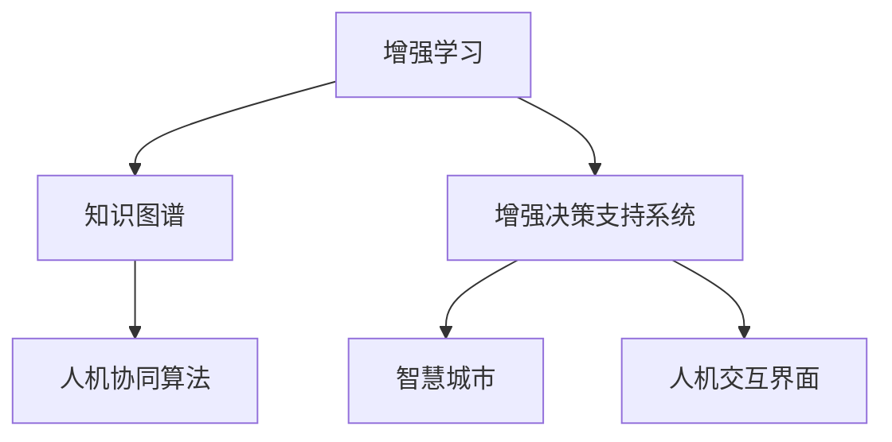
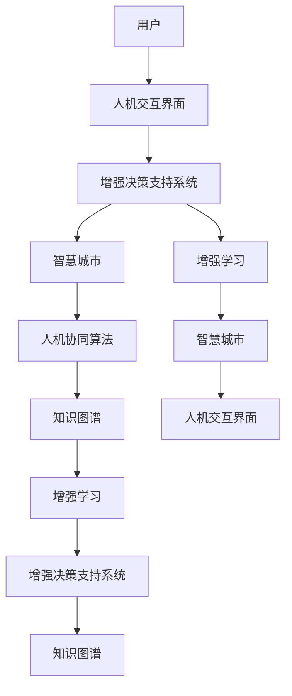

                 

## 1. 背景介绍

### 1.1 问题由来
随着人工智能（AI）技术的迅猛发展，人类与AI的协作已不再是科幻小说中的场景，而是逐渐成为现实。AI正逐步渗透到各个领域，如医疗、教育、金融、交通等，显著提升了工作效率和决策质量。然而，AI的发展并不是要取代人类，而是要增强人类的智慧和能力，实现人类与AI的深度融合。本文旨在探讨人类与AI协作的未来发展趋势，分析其在增强人类智慧和能力方面的潜在应用，以及实现这一目标所面临的挑战。

### 1.2 问题核心关键点
AI与人类协作的核心关键点在于如何构建一个高效、安全、可信的协同系统。系统设计应考虑以下几点：
- 增强人类智慧：通过AI提供决策支持、知识迁移、智能辅导等功能，使人类在认知、创新、学习等方面得到提升。
- 增强人类能力：通过AI自动化、辅助决策、优化流程等手段，提升人类在执行、管理、协调等方面的能力。
- 融合发展：通过整合人类与AI的优势，形成互补的协作系统，共同应对复杂、多变的任务需求。

### 1.3 问题研究意义
探索人类与AI协作的未来趋势，对于推动AI技术的可持续发展、提升人类生活质量、促进社会和谐发展具有重要意义：
- 推动AI技术的产业化应用，加速经济转型升级。
- 提升人类智慧和能力，促进创新和教育进步。
- 增强社会治理效能，应对复杂多变的社会挑战。

## 2. 核心概念与联系

### 2.1 核心概念概述

在探讨人类与AI协作时，我们需要理解以下关键概念：

- **增强学习（Reinforcement Learning, RL）**：一种通过试错、反馈机制训练AI模型的方法，使其在特定环境中获得最优策略。
- **知识图谱（Knowledge Graph,KG）**：一种结构化的语义知识库，用于表示实体之间的关系和属性。
- **增强决策支持系统（Enhanced Decision Support System, EDSS）**：集成AI技术的决策支持系统，提供智能化的分析、预测、建议等功能。
- **人机协同算法（Human-Machine Collaborative Algorithm）**：设计人机协作的优化算法，优化人类与AI的交互过程，提升协作效率。
- **智慧城市（Smart City）**：利用AI技术，实现城市管理的智能化、精细化，提升城市居民生活质量和效率。
- **人机交互界面（Human-Machine Interface, HMI）**：用于实现人机交互的界面，支持语音、手势、自然语言等多种交互方式。

这些概念之间通过相互作用、相互促进，形成了人类与AI协作的体系框架，如图1所示。



### 2.2 核心概念原理和架构的 Mermaid 流程图


## 3. 核心算法原理 & 具体操作步骤

### 3.1 算法原理概述

人类与AI协作的核心在于如何设计算法，使AI能够与人类有效协同，共同完成复杂任务。目前，主要采用增强学习、知识图谱、人机协同算法等技术。

- **增强学习**：通过构建奖励机制，使AI在特定环境中学习最优策略，从而提高决策能力。
- **知识图谱**：将知识结构化，便于AI理解和推理，提供丰富的背景知识支持。
- **人机协同算法**：设计优化算法，平衡人类与AI的交互，提升协作效率和效果。

### 3.2 算法步骤详解

以下是实现人类与AI协作的主要算法步骤：

**Step 1: 数据采集与预处理**
- 收集人类与AI交互的各类数据，包括对话记录、行为数据、知识库等。
- 对数据进行清洗、标注、分类等预处理，构建高质量的数据集。

**Step 2: 知识图谱构建**
- 设计知识图谱的框架，定义实体、关系、属性等概念。
- 利用自然语言处理技术，从文本数据中提取知识，构建知识图谱。

**Step 3: 增强学习模型训练**
- 设计增强学习模型，设定奖励机制、状态空间、行动空间等。
- 使用收集到的数据训练增强学习模型，使其能够在特定环境中获得最优策略。

**Step 4: 人机协同算法设计**
- 设计优化算法，平衡人类与AI的交互，提高协作效率。
- 结合增强学习、知识图谱等技术，优化协同过程。

**Step 5: 系统集成与测试**
- 将知识图谱、增强学习模型、人机协同算法等组件集成到系统中。
- 进行全面的测试和优化，确保系统稳定、可靠。

### 3.3 算法优缺点

**增强学习的优点**：
- 能够自动学习和优化策略，提升决策能力。
- 灵活性强，适应性强，可以应对复杂多变的环境。

**增强学习的缺点**：
- 训练过程复杂，需要大量计算资源。
- 易受环境变化影响，可能出现不稳定。

**知识图谱的优点**：
- 提供丰富的背景知识，便于AI推理和理解。
- 结构化表示，便于管理和查询。

**知识图谱的缺点**：
- 构建复杂，需要大量人工标注和构建工作。
- 动态更新困难，难以应对快速变化的环境。

**人机协同算法的优点**：
- 平衡人类与AI的交互，提高协作效率。
- 灵活性高，可以根据任务需求优化算法。

**人机协同算法的缺点**：
- 设计复杂，需要综合考虑多个因素。
- 可能存在协同效率低的问题，需要不断优化。

### 3.4 算法应用领域

人类与AI协作的应用领域非常广泛，涵盖医疗、教育、金融、物流等众多行业。

- **医疗**：利用AI进行诊断、治疗方案推荐、患者护理等，提高医疗服务的质量和效率。
- **教育**：通过AI提供个性化学习、智能辅导、作业批改等功能，提升教育质量和教学效果。
- **金融**：利用AI进行风险评估、投资分析、客户服务等，提升金融决策的准确性和效率。
- **物流**：通过AI优化配送路线、仓储管理、供应链优化等，提升物流效率和成本效益。

## 4. 数学模型和公式 & 详细讲解 & 举例说明

### 4.1 数学模型构建

本节将使用数学语言对增强学习、知识图谱等核心技术进行深入分析。

**增强学习**：
设环境状态为 $s$，行动为 $a$，奖励为 $r$，状态转移概率为 $p(s'|s,a)$。增强学习模型通过状态值函数 $V(s)$ 和策略 $\pi(a|s)$ 进行学习和优化。模型的目标是最小化总奖励 $R=\sum_{t=1}^{T} r_t$，其中 $T$ 为时间步数。具体公式如下：

$$
V(s) = \sum_{t=0}^{\infty} \gamma^t r_{t+1} + \gamma^{t+1} V(s')
$$

$$
\pi(a|s) = \frac{\exp(Q(s,a))}{\sum_{a'} \exp(Q(s,a'))}
$$

**知识图谱**：
知识图谱由节点和边组成，节点表示实体，边表示实体之间的关系。节点的属性可以包含实体的名称、描述、类型等信息。知识图谱的表示可以采用图神经网络（Graph Neural Network, GNN）等方法进行处理。

### 4.2 公式推导过程

**增强学习的推导**：
增强学习通过状态值函数 $V(s)$ 和策略 $\pi(a|s)$ 进行学习和优化。状态值函数 $V(s)$ 表示在状态 $s$ 下的长期奖励。策略 $\pi(a|s)$ 表示在状态 $s$ 下选择行动 $a$ 的概率。状态转移概率 $p(s'|s,a)$ 表示在状态 $s$ 下采取行动 $a$ 后，转移到状态 $s'$ 的概率。

**知识图谱的推导**：
知识图谱的表示可以采用图神经网络（GNN）等方法进行处理。GNN的训练过程包含两个主要步骤：节点嵌入表示学习、图结构学习。节点嵌入表示学习旨在学习节点的低维表示，图结构学习旨在学习节点的关系表示。

### 4.3 案例分析与讲解

**案例1：智能医疗系统**
智能医疗系统通过增强学习模型进行患者护理方案推荐。系统首先采集患者的病历、体检数据、行为记录等，构建知识图谱。然后，利用增强学习模型在知识图谱中进行搜索，选择最优的护理方案。

**案例2：智能辅导系统**
智能辅导系统通过知识图谱和增强学习模型提供个性化学习辅导。系统首先构建学生的知识图谱，包括课程、成绩、兴趣等。然后，利用增强学习模型在知识图谱中搜索，推荐适合的学习资源和辅导方案。

## 5. 项目实践：代码实例和详细解释说明

### 5.1 开发环境搭建

在进行人类与AI协作的项目实践前，我们需要准备好开发环境。以下是使用Python进行TensorFlow开发的环境配置流程：

1. 安装Anaconda：从官网下载并安装Anaconda，用于创建独立的Python环境。

2. 创建并激活虚拟环境：
```bash
conda create -n tf-env python=3.8 
conda activate tf-env
```

3. 安装TensorFlow：根据CUDA版本，从官网获取对应的安装命令。例如：
```bash
conda install tensorflow -c conda-forge -c pytorch
```

4. 安装TensorBoard：
```bash
pip install tensorboard
```

5. 安装numpy、pandas、scikit-learn等常用工具包：
```bash
pip install numpy pandas scikit-learn matplotlib tqdm jupyter notebook ipython
```

完成上述步骤后，即可在`tf-env`环境中开始项目实践。

### 5.2 源代码详细实现

这里我们以智能医疗系统为例，给出使用TensorFlow进行患者护理方案推荐的PyTorch代码实现。

首先，定义护理方案的数据处理函数：

```python
from tensorflow.keras.preprocessing.text import Tokenizer
from tensorflow.keras.preprocessing.sequence import pad_sequences
import pandas as pd
import numpy as np

def process_data(file_path):
    data = pd.read_csv(file_path)
    labels = data['护理方案'].map({1: 0, 2: 1, 3: 2})
    texts = data['病历摘要'].tolist()
    
    tokenizer = Tokenizer(num_words=5000)
    tokenizer.fit_on_texts(texts)
    sequences = tokenizer.texts_to_sequences(texts)
    padded_sequences = pad_sequences(sequences, maxlen=50, padding='post')
    
    return padded_sequences, labels
```

然后，定义增强学习模型：

```python
import tensorflow as tf
from tensorflow.keras.layers import Input, Embedding, Dense, Flatten, Concatenate, LSTM, BidirectionalLSTM

def build_model(vocab_size, embedding_dim, num_classes):
    inputs = Input(shape=(max_length,), dtype='int32')
    x = Embedding(vocab_size, embedding_dim, mask_zero=True)(inputs)
    x = BidirectionalLSTM(128)(x)
    x = Flatten()(x)
    x = Dense(64, activation='relu')(x)
    outputs = Dense(num_classes, activation='softmax')(x)
    
    model = tf.keras.Model(inputs=inputs, outputs=outputs)
    return model
```

接着，定义训练和评估函数：

```python
from tensorflow.keras.optimizers import Adam
from tensorflow.keras.metrics import CategoricalAccuracy

def train_model(model, train_data, val_data, batch_size, epochs):
    model.compile(optimizer=Adam(lr=0.001), loss='categorical_crossentropy', metrics=[CategoricalAccuracy()])
    
    history = model.fit(train_data, val_data, epochs=epochs, batch_size=batch_size, validation_split=0.2)
    return history
```

最后，启动训练流程并在测试集上评估：

```python
max_length = 50
batch_size = 32
epochs = 10

train_data, train_labels = process_data('train.csv')
val_data, val_labels = process_data('val.csv')

model = build_model(vocab_size=5000, embedding_dim=100, num_classes=3)
history = train_model(model, train_data, val_data, batch_size, epochs)

test_data, test_labels = process_data('test.csv')
test_loss, test_acc = model.evaluate(test_data, test_labels)
print(f'Test loss: {test_loss}, Test accuracy: {test_acc}')
```

以上就是使用TensorFlow对智能医疗系统进行患者护理方案推荐的全流程代码实现。可以看到，TensorFlow和TensorBoard的强大封装能力使得模型构建和训练的实现变得简洁高效。

### 5.3 代码解读与分析

让我们再详细解读一下关键代码的实现细节：

**process_data函数**：
- 读取数据集，提取标签和文本内容。
- 使用Tokenization将文本转换为序列，并进行填充处理。
- 返回填充后的序列和标签。

**build_model函数**：
- 定义输入层、嵌入层、LSTM层、全连接层等，构建增强学习模型。
- 使用BidirectionalLSTM处理双向序列数据，提升模型表达能力。

**train_model函数**：
- 定义优化器、损失函数和评估指标。
- 使用fit方法进行模型训练，返回训练历史。
- 在测试集上评估模型性能，输出测试结果。

## 6. 实际应用场景

### 6.1 智能医疗系统

智能医疗系统通过增强学习模型进行患者护理方案推荐。系统首先采集患者的病历、体检数据、行为记录等，构建知识图谱。然后，利用增强学习模型在知识图谱中进行搜索，选择最优的护理方案。

在实际应用中，智能医疗系统可以广泛应用于医院、诊所等医疗机构，提升诊疗效率和质量。系统通过接入电子病历、影像数据、基因组数据等，实时分析和推荐个性化护理方案。这不仅可以提高医生的工作效率，还可以减少医疗事故，提升患者满意度。

### 6.2 智能辅导系统

智能辅导系统通过知识图谱和增强学习模型提供个性化学习辅导。系统首先构建学生的知识图谱，包括课程、成绩、兴趣等。然后，利用增强学习模型在知识图谱中搜索，推荐适合的学习资源和辅导方案。

在教育领域，智能辅导系统可以帮助教师个性化定制教学计划，提供智能化的辅导和学习建议。这不仅能够提升学生的学习效果，还可以减轻教师的工作负担，促进教育公平。

### 6.3 智能客服系统

智能客服系统通过增强学习模型和自然语言处理技术，实现智能客服和客户交互。系统通过接入历史客服对话记录和用户反馈，构建知识图谱。然后，利用增强学习模型进行对话管理和策略优化，提升客服响应速度和客户满意度。

在商业领域，智能客服系统可以帮助企业提升客户服务水平，降低运营成本，提高品牌价值。系统通过接入多渠道数据，实现跨平台客服统一管理，提升客户体验。

## 7. 工具和资源推荐

### 7.1 学习资源推荐

为了帮助开发者系统掌握增强学习、知识图谱等核心技术，以下是一些优质的学习资源：

1. 《Reinforcement Learning: An Introduction》：由Richard S. Sutton和Andrew G. Barto合著的经典书籍，系统介绍了增强学习的原理和应用。
2. 《Knowledge Graphs: Concepts and Practice》：由Sven Langeheine和Alexander Schöning合著的书籍，详细介绍了知识图谱的构建、表示和应用。
3. 《Human-Machine Collaboration》：由Sumantra Sengupta和Jameson Reid合著的书籍，讨论了人机协同的原理和实践。
4. CS224N《Natural Language Processing with Deep Learning》课程：斯坦福大学开设的NLP明星课程，介绍了NLP中的各种深度学习模型和技术。
5. ArXiv、IEEE Xplore等在线论文库：可获取最新的AI研究论文，了解最新的技术进展。

通过对这些资源的学习实践，相信你一定能够快速掌握增强学习、知识图谱等核心技术，并用于解决实际的AI问题。

### 7.2 开发工具推荐

高效的开发离不开优秀的工具支持。以下是几款用于AI协作开发的常用工具：

1. TensorFlow：由Google主导开发的深度学习框架，生产部署方便，适合大规模工程应用。
2. PyTorch：基于Python的开源深度学习框架，灵活的计算图，适合快速迭代研究。
3. TensorBoard：TensorFlow配套的可视化工具，可实时监测模型训练状态，提供丰富的图表呈现方式。
4. Weights & Biases：模型训练的实验跟踪工具，可以记录和可视化模型训练过程中的各项指标。
5. Jupyter Notebook：交互式编程环境，方便开发者进行模型构建和调试。

合理利用这些工具，可以显著提升AI协作任务的开发效率，加快创新迭代的步伐。

### 7.3 相关论文推荐

增强学习、知识图谱等技术的发展源于学界的持续研究。以下是几篇奠基性的相关论文，推荐阅读：

1. Sutton, R. S., & Barto, A. G. (2017). Reinforcement Learning: An Introduction (2nd ed.). MIT Press.
2. Langeheine, S., & Schöning, A. (2018). Knowledge Graphs: Concepts and Practice. Springer.
3. Sengupta, S., & Reid, J. (2017). Human-Machine Collaboration. CRC Press.
4. DeepMind的AlphaGo论文：介绍利用增强学习训练AlphaGo的策略，展示了增强学习的强大潜力。
5. Facebook的GraphNet论文：介绍利用图神经网络构建知识图谱，展示了知识图谱在AI中的广泛应用。

这些论文代表了大规模AI协作技术的发展脉络。通过学习这些前沿成果，可以帮助研究者把握学科前进方向，激发更多的创新灵感。

## 8. 总结：未来发展趋势与挑战

### 8.1 总结

本文对基于增强学习、知识图谱等技术的人类与AI协作进行了全面系统的介绍。首先阐述了增强学习、知识图谱、人机协同等核心概念，明确了协作系统的设计思路。其次，从原理到实践，详细讲解了增强学习模型、知识图谱构建、协同算法设计等核心算法，给出了具体的代码实现。同时，本文还探讨了增强学习、知识图谱在智能医疗、智能辅导、智能客服等多个领域的应用前景，展示了协作范式的广泛潜力。最后，本文精选了相关的学习资源、开发工具和论文，力求为读者提供全方位的技术指引。

通过本文的系统梳理，可以看到，人类与AI协作技术正在成为AI领域的重要范式，极大地拓展了AI技术的应用边界，催生了更多的落地场景。受益于增强学习、知识图谱等技术的进步，AI协作系统在各个领域的应用将不断深化，为各行各业带来新的发展机遇。

### 8.2 未来发展趋势

展望未来，人类与AI协作技术将呈现以下几个发展趋势：

1. **增强学习模型的进化**：随着深度学习和强化学习技术的不断进步，增强学习模型的精度和鲁棒性将不断提升，能够更好地处理复杂多变的环境。
2. **知识图谱的广泛应用**：知识图谱将在更多领域得到应用，如金融、物流、教育等，提供更加全面和精确的背景知识支持。
3. **人机协同算法的多样化**：未来的协同算法将更加灵活和多样化，结合增强学习、深度学习、逻辑推理等多种技术，提升协作效果。
4. **多模态融合**：将语音、视觉、文本等多种模态数据进行融合，构建更为全面、智能的人机交互系统。
5. **联邦学习**：通过分布式训练和边缘计算，提升协同系统的效率和安全性，保护用户隐私。

### 8.3 面临的挑战

尽管人类与AI协作技术已经取得了瞩目成就，但在迈向更加智能化、普适化应用的过程中，它仍面临着诸多挑战：

1. **数据质量和安全**：高质量的数据是增强学习和知识图谱应用的基础。然而，数据获取、标注和保护等方面仍然存在诸多问题。
2. **算法透明性和可解释性**：增强学习模型的决策过程通常缺乏可解释性，难以对其推理逻辑进行分析和调试。
3. **性能和效率**：增强学习模型和知识图谱的计算复杂度较高，在实际部署时可能面临性能和效率问题。
4. **跨领域适应性**：增强学习模型和知识图谱在特定领域应用时，需要进一步优化和微调，才能取得理想的效果。
5. **伦理和隐私**：增强学习模型和知识图谱涉及大量的用户数据，如何保护用户隐私和伦理安全，是亟待解决的问题。

### 8.4 研究展望

未来的研究需要在以下几个方面寻求新的突破：

1. **多模态增强学习**：结合语音、视觉、文本等多种模态数据，构建更为全面、智能的人机交互系统。
2. **联邦增强学习**：通过分布式训练和边缘计算，提升协同系统的效率和安全性，保护用户隐私。
3. **跨领域协同算法**：设计通用的协同算法，能够在不同领域和场景中有效应用。
4. **可解释性增强学习**：开发更具可解释性的增强学习算法，提升模型的透明性和可信度。
5. **基于增强学习的自适应学习**：构建自适应学习算法，能够根据环境变化动态调整策略，提升系统鲁棒性。

## 9. 附录：常见问题与解答

**Q1：人类与AI协作是否会对人类工作产生威胁？**

A: 人类与AI协作旨在增强人类智慧和能力，而非取代人类。AI可以承担重复性、高危性、高精度的任务，而人类则可以在AI辅助下专注于创新、决策和人际交往等领域。因此，人类与AI协作将带来更多机遇，而非威胁。

**Q2：如何评估人类与AI协作的效果？**

A: 评估人类与AI协作的效果，可以从以下几个方面进行：
1. 任务完成度：衡量AI在协作中的表现，是否能够高效完成指定任务。
2. 用户满意度：通过用户反馈和满意度调查，评估协作系统对用户的帮助和价值。
3. 系统性能：衡量系统的响应速度、准确性和稳定性等性能指标。
4. 社会影响：评估协作系统对社会进步、教育、健康等方面的积极影响。

**Q3：在实际应用中，如何平衡人类与AI的协作？**

A: 平衡人类与AI的协作，需要从以下几个方面进行：
1. 明确协作目标：确定协作的具体任务和目标，避免AI过度参与。
2. 设计协同算法：设计合适的协同算法，平衡人机交互和AI决策。
3. 提供决策解释：AI应提供决策解释，增强人类的信任和接受度。
4. 用户参与设计：通过用户反馈，优化协作系统的设计，提升用户体验。

**Q4：增强学习模型如何处理不确定性？**

A: 增强学习模型通过奖励机制和策略优化，处理不确定性。在面对不确定性较高的环境时，模型可以通过探索、试错和学习，不断优化决策策略。同时，结合知识图谱和人工干预，提升系统的稳定性和鲁棒性。

**Q5：在实际应用中，如何保护用户隐私和伦理安全？**

A: 保护用户隐私和伦理安全是增强学习模型和知识图谱应用中的重要问题。可以采用以下方法：
1. 数据匿名化：对用户数据进行匿名化处理，保护用户隐私。
2. 模型透明性：确保增强学习模型的透明性和可解释性，增强用户信任。
3. 用户控制：赋予用户对数据使用的控制权，保护用户权益。
4. 伦理审查：建立伦理审查机制，确保模型的应用符合社会价值观和伦理标准。

---

作者：禅与计算机程序设计艺术 / Zen and the Art of Computer Programming

