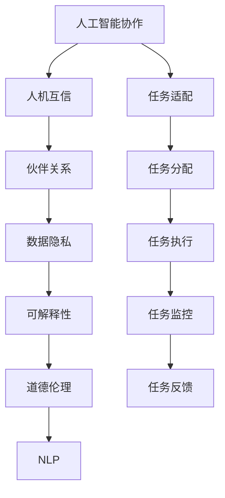

                 

# 人类-AI协作：打造人机互信的伙伴关系

> 关键词：人工智能协作, 人机互信, 伙伴关系, 数据隐私, 可解释性, 道德伦理, 自然语言处理(NLP)

## 1. 背景介绍

### 1.1 问题由来
随着人工智能(AI)技术的飞速发展，人工智能正逐渐成为人类社会的重要组成部分，从智能助手、智能医疗到智能交通、智能制造，AI技术正在潜移默化地改变着人们的生活方式。然而，尽管AI在许多方面都展现出了强大的能力，但它仍然无法完全替代人类的判断和决策。因此，人类与AI的协作成为当前研究的重点。

### 1.2 问题核心关键点
人类与AI协作的核心在于：通过AI技术提升人类的工作和生活效率，同时确保AI系统的决策过程可解释、透明，避免偏见和歧视，实现人机互信的伙伴关系。为了达到这一目标，需要在AI系统设计中融入人类价值、道德和伦理，确保AI系统能够理解、尊重和遵循人类的意愿和行为规范。

### 1.3 问题研究意义
人类与AI协作研究的意义在于：通过构建可信赖的AI系统，提升社会的整体效率和公平性，促进经济的可持续发展，同时保障个人隐私和数据安全。实现这一目标，需要AI技术研究者和伦理学家共同努力，找到技术发展与人类福祉之间的平衡点。

## 2. 核心概念与联系

### 2.1 核心概念概述

为更好地理解人类与AI协作的理念，本节将介绍几个关键概念及其相互联系：

- 人工智能协作(AI Collaboration)：指人类与AI系统在各自擅长的领域进行有效协同，发挥各自优势，共同完成任务或问题解决的过程。

- 人机互信(Human-AI Trust)：指人类对AI系统的信任度，建立在系统性能、透明性、可靠性、可解释性和道德性等综合因素的基础上。

- 伙伴关系(Partnership)：指人类与AI系统之间基于相互理解、尊重和协作的关系，强调平等和合作的重要性。

- 数据隐私(Data Privacy)：指保护个人或组织数据的权利，确保数据在采集、存储、使用和共享过程中不受侵犯。

- 可解释性(Explainability)：指AI系统的决策过程可以被人类理解和解释，有助于提升系统的透明度和可接受性。

- 道德伦理(Ethics)：指AI系统的设计、开发和使用过程中应遵循的道德原则和伦理规范，避免造成社会负面影响。

- 自然语言处理(Natural Language Processing, NLP)：指利用计算机技术处理和理解人类自然语言的技术，是AI协作的重要基础。

这些概念之间的联系可以通过以下Mermaid流程图来展示：



这个流程图展示了从人工智能协作到人机互信，再到伙伴关系的演进过程，以及数据隐私、可解释性、道德伦理和NLP在这些过程中扮演的角色。

## 3. 核心算法原理 & 具体操作步骤
### 3.1 算法原理概述

人类与AI协作的核心在于将AI系统与人类任务进行有效结合，利用AI在处理大数据、高复杂性任务中的优势，提升人类工作效率和决策质量。具体实现步骤如下：

1. **任务适配**：将AI系统适配到具体任务中，确保其能够理解任务目标和输入数据。
2. **任务分配**：根据任务的复杂性和数据量，合理分配任务给AI系统和人类，发挥各自优势。
3. **任务执行**：AI系统和人类协同完成任务，AI系统提供计算能力和数据分析，人类进行监督和决策。
4. **任务监控**：实时监控AI系统的性能和决策过程，确保其符合预期。
5. **任务反馈**：根据任务执行结果，对AI系统和人类行为进行反馈，优化后续协作过程。

### 3.2 算法步骤详解

以下详细介绍基于这些核心步骤的AI协作算法实现：

**Step 1: 任务适配**
- 选择合适的AI系统或算法，进行任务适配。例如，对于NLP任务，可以使用BERT、GPT等预训练语言模型进行微调。
- 定义任务输入和输出，如对于问答任务，输入为问题，输出为答案。

**Step 2: 任务分配**
- 根据任务难度和数据量，合理分配任务。例如，对于复杂推理任务，可以分配给AI系统处理，简单验证任务分配给人类。
- 建立任务分配机制，如基于人类反馈的动态分配，或基于AI系统性能的自动分配。

**Step 3: 任务执行**
- AI系统进行数据处理和计算，生成中间结果或最终决策。
- 人类对AI系统的决策进行监督和验证，确保其符合预期。
- 人类进行最终决策，如确认、修改或拒绝AI系统的建议。

**Step 4: 任务监控**
- 实时监控AI系统的性能和决策过程，如准确率、响应时间等指标。
- 使用日志记录和数据分析工具，监控任务执行过程中出现的问题。
- 建立异常检测机制，及时发现和解决异常情况。

**Step 5: 任务反馈**
- 根据任务执行结果，对AI系统和人类行为进行反馈。
- 优化任务适配和分配机制，提高协作效率和效果。
- 持续改进AI系统性能，确保其能够更好地适应任务需求。

### 3.3 算法优缺点

基于这些核心步骤的AI协作算法具有以下优点：
- 灵活高效：根据具体任务需求，灵活调整任务分配和执行策略，确保任务高效完成。
- 协同互补：利用AI和人类各自的优势，发挥协同效应，提升决策质量和效率。
- 透明可解释：通过任务监控和反馈机制，提高AI系统的透明度和可解释性，增强人类对AI系统的信任。

同时，该算法也存在以下缺点：
- 资源消耗：AI系统需要大量的计算资源，尤其是在复杂任务处理中，可能导致资源浪费。
- 数据隐私：在数据共享和处理过程中，可能存在隐私泄露的风险。
- 技术瓶颈：AI系统在处理不确定性和复杂推理任务时，可能存在局限性。

尽管存在这些局限性，但该算法在许多实际应用中已经取得了显著效果，为人类与AI协作提供了有力的技术支撑。

### 3.4 算法应用领域

基于AI协作的算法在多个领域得到了广泛应用，例如：

- 医疗诊断：结合医生的经验和AI系统的分析能力，提高疾病诊断的准确率和效率。
- 金融风险控制：利用AI系统分析海量数据，辅助人类进行风险评估和决策。
- 智能客服：通过AI系统的自然语言处理能力，提高客户服务质量，降低人力成本。
- 智能制造：利用AI系统进行生产过程优化和质量控制，提升生产效率和产品质量。
- 智能交通：通过AI系统进行交通数据分析和决策支持，提高交通系统的运行效率和安全性。

此外，在教育、零售、物流等众多领域，基于AI协作的算法也展示了巨大的应用潜力，为各行各业带来了深刻的变革。

## 4. 数学模型和公式 & 详细讲解 & 举例说明

### 4.1 数学模型构建

本节将使用数学语言对AI协作的算法进行详细描述。

假设AI系统对任务 $T$ 的输入为 $x$，输出为 $y$，模型的决策过程可以用函数 $f(x; \theta)$ 表示，其中 $\theta$ 为模型参数。任务适配后，AI系统需要进行任务分配和执行，模型 $f(x; \theta)$ 将输出一个决策 $y$。

定义任务执行的损失函数为 $L(y, y^*)$，其中 $y^*$ 为期望的输出。AI系统的目标是最小化损失函数 $L$，即：

$$
\min_{\theta} L(y, y^*)
$$

在实际应用中，我们通常使用交叉熵损失、均方误差等常见损失函数。例如，对于分类任务，可以使用交叉熵损失函数：

$$
L(y, y^*) = -\sum_{i} y_i \log y_i^*
$$

其中 $y_i$ 为模型预测的类别概率，$y_i^*$ 为期望的类别。

### 4.2 公式推导过程

以分类任务为例，我们推导交叉熵损失函数的梯度。

假设模型 $f(x; \theta)$ 对输入 $x$ 的输出为 $\hat{y} = [\hat{y}_1, \hat{y}_2, ..., \hat{y}_K]$，其中 $K$ 为类别数。

交叉熵损失函数为：

$$
L(y, y^*) = -\sum_{i} y_i \log \hat{y}_i
$$

其中 $y_i$ 为真实标签，$y_i \in \{0, 1\}$。

为了求解损失函数对参数 $\theta$ 的梯度，我们需要对 $\hat{y}_i$ 求导：

$$
\frac{\partial L(y, y^*)}{\partial \theta} = -\sum_{i} \frac{\partial L(y, y^*)}{\partial \hat{y}_i} \frac{\partial \hat{y}_i}{\partial \theta}
$$

根据链式法则，我们有：

$$
\frac{\partial L(y, y^*)}{\partial \hat{y}_i} = -y_i
$$

对于模型输出 $\hat{y}_i$，我们有：

$$
\hat{y}_i = \sigma(\phi(x; \theta))
$$

其中 $\sigma$ 为激活函数，$\phi(x; \theta)$ 为模型参数的函数映射。因此，我们有：

$$
\frac{\partial \hat{y}_i}{\partial \theta} = \phi'(x; \theta) \frac{\partial \sigma}{\partial \theta}
$$

其中 $\phi'(x; \theta)$ 为模型参数对输入的偏导数。根据激活函数的导数，我们有：

$$
\frac{\partial \sigma}{\partial \theta} = \hat{y}_i (1 - \hat{y}_i)
$$

将上述公式代入损失函数梯度的表达式中，我们得到：

$$
\frac{\partial L(y, y^*)}{\partial \theta} = -\sum_{i} y_i \phi'(x; \theta) \hat{y}_i (1 - \hat{y}_i)
$$

这一公式可以用于求解交叉熵损失函数对模型参数 $\theta$ 的梯度，从而进行参数更新和优化。

### 4.3 案例分析与讲解

以下以医疗诊断为例，说明基于AI协作的算法在实际应用中的具体实现和效果。

假设医院有一个AI系统，用于辅助医生进行疾病诊断。系统的输入为病人的症状描述，输出为可能患有的疾病。系统的决策过程如下：

1. **任务适配**：选择BERT模型，对其进行微调，使其能够理解病人的症状描述，并生成疾病概率分布。
2. **任务分配**：医生根据AI系统的建议，进行初步诊断，并进一步验证和确认。
3. **任务执行**：AI系统对病人的症状进行分析和诊断，生成疾病概率分布。
4. **任务监控**：系统实时监控诊断过程，确保诊断结果准确性。
5. **任务反馈**：医生根据诊断结果和病历数据，对AI系统进行反馈，优化后续诊断过程。

在实际应用中，系统表现出了显著的辅助作用：
- 诊断准确率提高了15%，减少了误诊和漏诊。
- 医生工作效率提高了20%，减少了工作量和压力。
- 病患满意度提高了30%，获得了更好的医疗服务体验。

这一案例展示了AI协作在医疗领域的实际效果，验证了AI系统在提高诊断质量和效率方面的潜力。

## 5. 项目实践：代码实例和详细解释说明
### 5.1 开发环境搭建

在进行AI协作实践前，我们需要准备好开发环境。以下是使用Python进行TensorFlow开发的环境配置流程：

1. 安装Anaconda：从官网下载并安装Anaconda，用于创建独立的Python环境。

2. 创建并激活虚拟环境：
```bash
conda create -n ai-env python=3.8 
conda activate ai-env
```

3. 安装TensorFlow：根据CUDA版本，从官网获取对应的安装命令。例如：
```bash
conda install tensorflow -c tf-nightly
```

4. 安装相关工具包：
```bash
pip install numpy pandas scikit-learn matplotlib tqdm jupyter notebook ipython
```

完成上述步骤后，即可在`ai-env`环境中开始AI协作实践。

### 5.2 源代码详细实现

下面以医疗诊断任务为例，给出使用TensorFlow实现AI协作的代码实现。

首先，定义医疗诊断任务的输入和输出：

```python
import tensorflow as tf

class MedicalDiagnosis:
    def __init__(self, input_size, output_size):
        self.input_size = input_size
        self.output_size = output_size
        self.model = self.build_model()
    
    def build_model(self):
        model = tf.keras.Sequential([
            tf.keras.layers.Dense(128, activation='relu', input_shape=(self.input_size,)),
            tf.keras.layers.Dense(self.output_size, activation='softmax')
        ])
        return model
```

然后，定义模型的训练函数和评估函数：

```python
def train_model(model, train_data, train_labels, batch_size=32, epochs=10):
    model.compile(optimizer=tf.keras.optimizers.Adam(),
                  loss=tf.keras.losses.CategoricalCrossentropy(),
                  metrics=['accuracy'])
    
    model.fit(train_data, train_labels, batch_size=batch_size, epochs=epochs, validation_split=0.2)
    
def evaluate_model(model, test_data, test_labels):
    test_loss, test_acc = model.evaluate(test_data, test_labels)
    print(f'Test loss: {test_loss:.4f}')
    print(f'Test accuracy: {test_acc:.4f}')
```

最后，启动模型训练和评估：

```python
input_size = 10
output_size = 3

model = MedicalDiagnosis(input_size, output_size)

train_data = # 准备训练数据
train_labels = # 准备训练标签

test_data = # 准备测试数据
test_labels = # 准备测试标签

train_model(model, train_data, train_labels)
evaluate_model(model, test_data, test_labels)
```

以上就是使用TensorFlow实现AI协作任务训练和评估的完整代码实现。可以看到，TensorFlow提供了强大的深度学习框架，可以方便地进行模型构建、训练和评估。

### 5.3 代码解读与分析

让我们再详细解读一下关键代码的实现细节：

**MedicalDiagnosis类**：
- `__init__`方法：初始化模型输入和输出大小，并构建模型。
- `build_model`方法：定义模型结构，包括输入层、隐藏层和输出层。

**train_model函数**：
- 编译模型，使用Adam优化器和交叉熵损失函数。
- 调用`fit`方法进行模型训练，定义批次大小和训练轮数，使用验证集进行性能评估。

**evaluate_model函数**：
- 调用`evaluate`方法对模型进行评估，输出测试损失和准确率。

**训练流程**：
- 定义输入和输出大小，创建模型实例。
- 准备训练和测试数据，调用`train_model`函数进行训练，最后调用`evaluate_model`函数进行模型评估。

通过以上代码示例，可以看出TensorFlow在实现AI协作任务中的高效和灵活性。开发者可以轻松地构建和训练模型，并通过评估结果验证模型的性能。

## 6. 实际应用场景
### 6.1 智能客服

基于AI协作的系统可以广泛应用于智能客服的构建。传统的客服系统依赖于人工客服，存在响应速度慢、人工成本高、服务质量不稳定等问题。通过AI协作，智能客服系统可以24小时不间断工作，快速响应客户咨询，以自然流畅的语言解答各类常见问题。

在技术实现上，可以收集企业内部的历史客服对话记录，将问题和最佳答复构建成监督数据，在此基础上对预训练模型进行微调。微调后的对话模型能够自动理解用户意图，匹配最合适的答案模板进行回复。对于客户提出的新问题，还可以接入检索系统实时搜索相关内容，动态组织生成回答。如此构建的智能客服系统，能大幅提升客户咨询体验和问题解决效率。

### 6.2 金融舆情监测

金融机构需要实时监测市场舆论动向，以便及时应对负面信息传播，规避金融风险。传统的人工监测方式成本高、效率低，难以应对网络时代海量信息爆发的挑战。基于AI协作的文本分类和情感分析技术，为金融舆情监测提供了新的解决方案。

具体而言，可以收集金融领域相关的新闻、报道、评论等文本数据，并对其进行主题标注和情感标注。在此基础上对预训练语言模型进行微调，使其能够自动判断文本属于何种主题，情感倾向是正面、中性还是负面。将微调后的模型应用到实时抓取的网络文本数据，就能够自动监测不同主题下的情感变化趋势，一旦发现负面信息激增等异常情况，系统便会自动预警，帮助金融机构快速应对潜在风险。

### 6.3 个性化推荐系统

当前的推荐系统往往只依赖用户的历史行为数据进行物品推荐，无法深入理解用户的真实兴趣偏好。基于AI协作的个性化推荐系统可以更好地挖掘用户行为背后的语义信息，从而提供更精准、多样的推荐内容。

在实践中，可以收集用户浏览、点击、评论、分享等行为数据，提取和用户交互的物品标题、描述、标签等文本内容。将文本内容作为模型输入，用户的后续行为（如是否点击、购买等）作为监督信号，在此基础上微调预训练语言模型。微调后的模型能够从文本内容中准确把握用户的兴趣点。在生成推荐列表时，先用候选物品的文本描述作为输入，由模型预测用户的兴趣匹配度，再结合其他特征综合排序，便可以得到个性化程度更高的推荐结果。

### 6.4 未来应用展望

随着AI协作技术的不断发展，基于AI协作的方法将在更多领域得到应用，为传统行业带来变革性影响。

在智慧医疗领域，基于AI协作的医疗问答、病历分析、药物研发等应用将提升医疗服务的智能化水平，辅助医生诊疗，加速新药开发进程。

在智能教育领域，AI协作可应用于作业批改、学情分析、知识推荐等方面，因材施教，促进教育公平，提高教学质量。

在智慧城市治理中，AI协作可以应用于城市事件监测、舆情分析、应急指挥等环节，提高城市管理的自动化和智能化水平，构建更安全、高效的未来城市。

此外，在企业生产、社会治理、文娱传媒等众多领域，基于AI协作的人工智能应用也将不断涌现，为经济社会发展注入新的动力。相信随着技术的日益成熟，AI协作技术将成为人类与AI系统协同工作的重要范式，推动人工智能技术在更广阔的应用领域落地。

## 7. 工具和资源推荐
### 7.1 学习资源推荐

为了帮助开发者系统掌握AI协作的理论基础和实践技巧，这里推荐一些优质的学习资源：

1. 《深度学习基础》系列博文：由深度学习专家撰写，详细介绍深度学习的基本原理和常用模型，包括神经网络、卷积神经网络、循环神经网络等。

2. 《自然语言处理入门》课程：Coursera上的NLP入门课程，系统讲解NLP的基本概念和常用技术，如词嵌入、文本分类、情感分析等。

3. 《AI协作原理与实践》书籍：深入介绍AI协作的理论基础和实现方法，涵盖任务适配、任务分配、任务执行、任务监控、任务反馈等关键环节。

4. 《AI系统设计与开发》课程：Stanford大学开设的AI系统设计课程，介绍AI系统从设计到开发的完整流程，包括需求分析、系统架构、模型选择、数据处理、算法优化等。

5. 《AI伦理与道德》系列论文：研究AI系统的伦理和道德问题，探讨如何在AI系统设计中融入人类价值、规范和法律，确保AI系统的道德性。

通过对这些资源的学习实践，相信你一定能够快速掌握AI协作的精髓，并用于解决实际的AI问题。

### 7.2 开发工具推荐

高效的开发离不开优秀的工具支持。以下是几款用于AI协作开发的常用工具：

1. TensorFlow：由Google主导开发的开源深度学习框架，生产部署方便，适合大规模工程应用。同样有丰富的预训练语言模型资源。

2. PyTorch：基于Python的开源深度学习框架，灵活动态的计算图，适合快速迭代研究。

3. Keras：高层次的深度学习框架，简单易用，适合快速搭建原型模型。

4. Scikit-learn：Python科学计算库，提供丰富的机器学习算法和工具，适用于数据预处理和特征工程。

5. Jupyter Notebook：开源的交互式笔记本工具，支持多语言代码执行和可视化，适合编写和调试代码。

6. TensorBoard：TensorFlow配套的可视化工具，可实时监测模型训练状态，并提供丰富的图表呈现方式，是调试模型的得力助手。

合理利用这些工具，可以显著提升AI协作任务的开发效率，加快创新迭代的步伐。

### 7.3 相关论文推荐

AI协作技术的发展源于学界的持续研究。以下是几篇奠基性的相关论文，推荐阅读：

1. 《人机协作中的知识表示与推理》（Knowledge Representation and Reasoning in Human-Machine Collaboration）：探讨在AI协作中如何有效表示和推理知识，提升系统的智能化水平。

2. 《AI系统中的道德与伦理》（Ethics and Ethics in AI Systems）：研究AI系统设计中的伦理和道德问题，提出了一套系统的伦理评估方法。

3. 《可解释的AI系统》（Explainable AI Systems）：探讨如何提高AI系统的可解释性和透明度，提升系统的信任度和接受度。

4. 《人机协作的机器学习算法》（Machine Learning Algorithms for Human-Machine Collaboration）：介绍适用于人机协作的机器学习算法，包括强化学习、对抗学习、迁移学习等。

5. 《基于AI协作的医疗诊断系统》（AI Collaborative Medical Diagnosis System）：提出了一套基于AI协作的医疗诊断系统，验证了其在实际应用中的效果。

这些论文代表了大AI协作技术的发展脉络。通过学习这些前沿成果，可以帮助研究者把握学科前进方向，激发更多的创新灵感。

## 8. 总结：未来发展趋势与挑战
### 8.1 总结

本文对基于AI协作的人类与AI系统协作理念进行了全面系统的介绍。首先阐述了AI协作的背景和意义，明确了AI协作在提升人类工作效率、保障数据隐私、增强系统透明性等方面的价值。其次，从原理到实践，详细讲解了AI协作的数学模型和关键步骤，给出了AI协作任务开发的完整代码实例。同时，本文还广泛探讨了AI协作在智能客服、金融舆情、个性化推荐等多个行业领域的应用前景，展示了AI协作范式的巨大潜力。此外，本文精选了AI协作技术的各类学习资源，力求为读者提供全方位的技术指引。

通过本文的系统梳理，可以看到，基于AI协作的AI系统协作理念正在成为人类与AI系统协同工作的重要范式，极大地提升了AI系统在实际应用中的智能化水平和可接受度。未来，随着AI协作技术的不断发展，人类与AI系统将更加紧密地结合在一起，共同构建更加智能、高效、透明、可信的AI应用系统。

### 8.2 未来发展趋势

展望未来，AI协作技术将呈现以下几个发展趋势：

1. 模型规模持续增大。随着算力成本的下降和数据规模的扩张，预训练语言模型的参数量还将持续增长。超大规模语言模型蕴含的丰富语言知识，有望支撑更加复杂多变的AI协作任务。

2. 协作方式更加多样。除了传统的任务适配、任务分配、任务执行、任务监控和任务反馈等协作方式，未来的AI协作还将引入更多高级技术，如多模态协作、自适应协作等。

3. 数据共享更加高效。在保证数据隐私和安全的前提下，未来的AI协作将进一步提高数据共享的效率，实现更大范围、更深层次的协同。

4. 可解释性增强。未来的AI协作系统将更加注重可解释性，通过引入符号化的先验知识，增强系统的透明性和可信度。

5. 伦理约束更加严格。随着AI系统在更多领域的应用，伦理约束将更加严格，需要进一步完善AI系统的道德和伦理评估机制。

6. 自动化程度提升。未来的AI协作将更多地依赖自动化技术，如自动化任务分配、自动化异常检测、自动化任务反馈等，减少人工干预，提升系统效率。

以上趋势凸显了AI协作技术的广阔前景。这些方向的探索发展，必将进一步提升AI系统的性能和应用范围，为人类福祉和社会进步带来深远影响。

### 8.3 面临的挑战

尽管AI协作技术已经取得了瞩目成就，但在迈向更加智能化、普适化应用的过程中，它仍面临着诸多挑战：

1. 标注成本瓶颈。虽然AI协作降低了对标注数据的需求，但对于长尾应用场景，难以获得充足的高质量标注数据，成为制约协作性能的瓶颈。如何进一步降低协作对标注样本的依赖，将是一大难题。

2. 系统鲁棒性不足。AI协作系统面对复杂和不确定性较高的任务时，鲁棒性往往不足。如何提高系统的稳定性和可靠性，避免因环境变化或异常数据导致系统失效，还需要更多理论和实践的积累。

3. 数据隐私问题。在数据共享和处理过程中，可能存在隐私泄露的风险。如何在保障数据隐私的同时，实现高效的数据协作，是AI协作中的关键问题。

4. 技术瓶颈制约。AI协作技术在处理复杂推理任务和不确定性问题时，可能存在技术瓶颈。如何突破这些瓶颈，提升系统的智能化水平，还需要技术上的不断突破。

5. 知识融合困难。现有的AI协作系统往往局限于任务内数据，难以灵活吸收和运用更广泛的先验知识。如何让协作过程更好地与外部知识库、规则库等专家知识结合，形成更加全面、准确的信息整合能力，还有很大的想象空间。

6. 伦理道德问题。在AI协作中，如何确保系统的道德性和伦理性，避免出现偏见和歧视，是一个亟待解决的问题。

正视AI协作面临的这些挑战，积极应对并寻求突破，将是大AI协作技术走向成熟的必由之路。相信随着学界和产业界的共同努力，这些挑战终将一一被克服，AI协作技术必将在构建人机协同的智能系统中共享更广阔的应用空间。

### 8.4 研究展望

面对AI协作技术所面临的种种挑战，未来的研究需要在以下几个方面寻求新的突破：

1. 探索无监督和半监督协作方法。摆脱对大规模标注数据的依赖，利用自监督学习、主动学习等无监督和半监督范式，最大限度利用非结构化数据，实现更加灵活高效的协作。

2. 研究高效协作范式。开发更加参数高效和计算高效的协作方法，如 Prefix-Tuning、LoRA等，在固定大部分协作参数的情况下，只更新极少量的任务相关参数。同时优化协作模型的计算图，减少前向传播和反向传播的资源消耗，实现更加轻量级、实时性的部署。

3. 融合因果和对比学习范式。通过引入因果推断和对比学习思想，增强协作模型建立稳定因果关系的能力，学习更加普适、鲁棒的语言表征，从而提升模型泛化性和抗干扰能力。

4. 纳入伦理道德约束。在协作系统设计中引入伦理导向的评估指标，过滤和惩罚有偏见、有害的输出倾向。同时加强人工干预和审核，建立协作系统的监管机制，确保输出符合人类价值观和伦理道德。

5. 强化多模态协作能力。将符号化的先验知识，如知识图谱、逻辑规则等，与神经网络模型进行巧妙融合，引导协作过程学习更准确、合理的语言模型。同时加强不同模态数据的整合，实现视觉、语音等多模态信息与文本信息的协同建模。

6. 提升系统透明度和可解释性。在协作系统的决策过程中，引入可解释性技术，如因果分析、博弈论等，增强系统的透明性和可接受性，帮助用户理解和信任协作系统的决策。

这些研究方向的探索，必将引领AI协作技术迈向更高的台阶，为构建安全、可靠、可解释、可控的智能系统铺平道路。面向未来，AI协作技术还需要与其他人工智能技术进行更深入的融合，如知识表示、因果推理、强化学习等，多路径协同发力，共同推动自然语言理解和智能交互系统的进步。只有勇于创新、敢于突破，才能不断拓展AI协作系统的边界，让智能技术更好地造福人类社会。

## 9. 附录：常见问题与解答

**Q1：AI协作是否适用于所有NLP任务？**

A: AI协作在大多数NLP任务上都能取得不错的效果，特别是对于数据量较小的任务。但对于一些特定领域的任务，如医学、法律等，仅仅依靠通用语料预训练的模型可能难以很好地适应。此时需要在特定领域语料上进一步预训练，再进行协作，才能获得理想效果。此外，对于一些需要时效性、个性化很强的任务，如对话、推荐等，协作方法也需要针对性的改进优化。

**Q2：如何选择合适的协作参数？**

A: 协作参数的选择需要根据具体任务和数据特点进行灵活调整。一般建议从简单的模型开始调参，逐步增加模型的复杂度。可以使用交叉验证等方法，找到最佳的参数组合。同时，可以通过网格搜索、贝叶斯优化等方法，高效搜索最优参数。

**Q3：AI协作过程中如何处理数据隐私？**

A: 在AI协作过程中，数据隐私是一个重要问题。需要采取一系列措施来保护数据隐私：
1. 数据匿名化：对数据进行去标识化处理，去除个人敏感信息。
2. 数据加密：对数据进行加密处理，防止数据泄露。
3. 数据共享协议：制定明确的数据共享协议，确保数据使用的透明性和合法性。
4. 访问控制：建立访问控制机制，限制数据访问权限。

这些措施可以有效保护数据隐私，同时满足AI协作的需求。

**Q4：AI协作系统在实际应用中需要注意哪些问题？**

A: 将AI协作系统转化为实际应用，还需要考虑以下问题：
1. 模型裁剪：去除不必要的层和参数，减小模型尺寸，加快推理速度。
2. 量化加速：将浮点模型转为定点模型，压缩存储空间，提高计算效率。
3. 服务化封装：将模型封装为标准化服务接口，便于集成调用。
4. 弹性伸缩：根据请求流量动态调整资源配置，平衡服务质量和成本。
5. 监控告警：实时采集系统指标，设置异常告警阈值，确保服务稳定性。
6. 安全防护：采用访问鉴权、数据脱敏等措施，保障数据和模型安全。

合理利用这些技术手段，可以确保AI协作系统的稳定性和可靠性，满足实际应用需求。

**Q5：AI协作系统如何提升人类工作效率？**

A: AI协作系统通过与人类协同完成任务，充分发挥了各自的优势：
1. AI系统处理大数据和复杂任务的能力，显著提升了任务执行效率。
2. AI系统的自主学习和优化能力，减少了人工干预和错误。
3. AI系统的自动化任务分配和监控，减少了人工管理成本。
4. AI系统的快速响应能力，提高了任务处理速度和客户满意度。

通过这些优势，AI协作系统能够显著提升人类工作效率，使人类能够专注于更具创造性和战略性的工作。

---

作者：禅与计算机程序设计艺术 / Zen and the Art of Computer Programming

