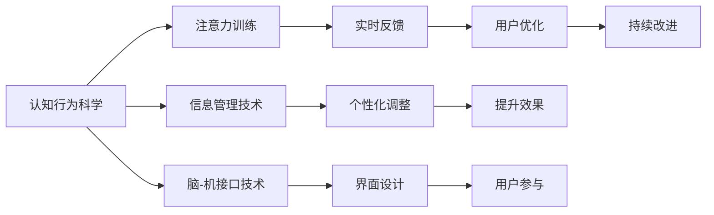

                 

# 人类注意力增强：提升注意力和专注力的技术

在信息爆炸的时代，如何提升人类的注意力和专注力成为了科技界和教育界关注的焦点。本文将探讨一些前沿的技术方法，帮助人们更好地管理注意力，提升学习和工作的效率。

## 1. 背景介绍

### 1.1 问题由来

现代社会的快节奏和高压力环境下，人们的注意力被分散得越来越严重。无论是学生、职场人士还是互联网用户，普遍面临注意力难以集中的问题。这不仅影响了学习效率和工作质量，还带来了诸如注意力疲劳、焦虑等健康问题。

为了解决这一问题，人们逐渐认识到需要采用科技手段来辅助提升注意力和专注力。近年来，基于神经科学和计算机科学的交叉研究逐渐兴起，涌现出多种技术方案，帮助人们更好地管理注意力。

### 1.2 问题核心关键点

为了有效地提升注意力和专注力，我们需要关注以下几个关键点：

1. **认知行为科学**：理解注意力和专注力的生理和心理机制。
2. **信息管理**：通过技术手段帮助用户更好地管理信息。
3. **个性化调整**：根据用户的具体情况，量身定制注意力提升方案。
4. **界面设计**：优化用户交互界面，使用户更容易保持注意力。
5. **实时反馈**：提供及时的注意力反馈，帮助用户及时调整。

## 2. 核心概念与联系

### 2.1 核心概念概述

本文将探讨几种提升注意力和专注力的关键技术，包括：

1. **认知行为科学**：研究注意力和专注力的心理学和生理学原理，理解其行为机制。
2. **注意力训练**：通过心理训练、游戏等方式提高用户的注意力水平。
3. **信息管理技术**：利用技术手段帮助用户更好地组织和管理信息。
4. **脑-机接口技术**：通过脑电波监测等技术，实时调整用户的注意力状态。

这些技术之间有密切的联系，共同构建了一个提升注意力的生态系统。通过认知行为科学的理论指导，结合信息管理和脑-机接口技术的实践应用，我们可以更系统地提升用户的注意力和专注力。

### 2.2 核心概念原理和架构的 Mermaid 流程图



这个流程图展示了提升注意力和专注力的主要技术路径，每个环节都密切相关。认知行为科学提供理论支持，注意力训练提供实践手段，信息管理技术提供工具支持，脑-机接口技术提供实时监测和反馈，共同作用于用户的注意力提升。

## 3. 核心算法原理 & 具体操作步骤

### 3.1 算法原理概述

提升注意力和专注力的方法大致可以分为三类：

1. **认知行为科学指导的训练方法**：通过心理训练和认知重塑，提升用户的注意力和专注力。
2. **信息管理技术辅助的方法**：利用技术手段帮助用户更好地组织和管理信息，减少信息干扰。
3. **脑-机接口技术的实时监测和调整**：通过脑电波监测等技术，实时调整用户的注意力状态。

下面我们将分别介绍这些方法的原理和具体操作步骤。

### 3.2 算法步骤详解

#### 3.2.1 认知行为科学的训练方法

1. **认知重塑**：通过认知行为疗法，帮助用户识别和纠正负面的思维模式，增强积极心态。
2. **心理训练**：通过冥想、正念等训练方式，提升用户的自我控制能力和注意力。
3. **注意力游戏**：通过有趣的游戏形式，锻炼用户的注意力和专注力。

**操作步骤**：

1. **初步评估**：通过问卷调查等形式，评估用户当前注意力水平和心理状态。
2. **制定训练计划**：根据评估结果，制定个性化的训练计划，包括训练内容、频率和时长。
3. **执行训练**：用户按照计划进行心理训练和认知重塑，并参与注意力游戏。
4. **效果评估**：定期评估用户注意力水平和心理状态，调整训练计划。

#### 3.2.2 信息管理技术

1. **信息整理工具**：使用笔记应用、任务管理工具等帮助用户整理信息。
2. **信息过滤工具**：利用AI技术过滤无用信息，减少信息干扰。
3. **信息可视化**：通过图表、地图等形式，帮助用户更好地理解和记忆信息。

**操作步骤**：

1. **选择工具**：根据用户需求选择合适的信息管理工具。
2. **配置工具**：对工具进行个性化配置，使其符合用户的工作流程和习惯。
3. **使用工具**：按照工具指南使用信息管理工具，记录和整理信息。
4. **反馈优化**：根据使用反馈，不断优化工具和配置。

#### 3.2.3 脑-机接口技术

1. **脑电波监测**：通过头皮电极监测用户的脑电波活动，分析注意力状态。
2. **注意力调整**：根据脑电波数据，实时调整用户的注意力状态。
3. **反馈机制**：通过视觉、声音等形式，向用户提供注意力反馈，帮助其保持专注。

**操作步骤**：

1. **设备佩戴**：用户佩戴脑电波监测设备，确保数据采集准确。
2. **数据采集**：设备持续采集用户的脑电波数据。
3. **数据分析**：分析脑电波数据，识别用户的注意力状态。
4. **实时调整**：根据分析结果，实时调整用户的注意力状态。
5. **反馈输出**：通过反馈机制向用户提供注意力状态的提示。

### 3.3 算法优缺点

#### 3.3.1 认知行为科学

**优点**：

1. **理论基础**：基于认知行为科学的理论指导，具有科学依据。
2. **个性化调整**：根据用户具体情况进行定制化训练。
3. **非侵入性**：无需特殊设备，用户可以自主进行训练。

**缺点**：

1. **训练周期长**：需要较长时间才能见效。
2. **用户自主性**：需要用户自主参与和坚持，效果受用户动机影响。

#### 3.3.2 信息管理技术

**优点**：

1. **自动化**：利用工具进行自动化信息管理，减少人工操作。
2. **适用性强**：适用于各种工作场景，提升信息管理效率。
3. **实时反馈**：工具提供实时反馈，帮助用户及时调整信息管理策略。

**缺点**：

1. **依赖工具**：效果依赖工具的质量和用户的使用习惯。
2. **隐私问题**：信息管理工具可能涉及用户隐私，需注意数据保护。

#### 3.3.3 脑-机接口技术

**优点**：

1. **实时监测**：实时监测用户注意力状态，提供及时调整。
2. **自动化调整**：根据数据分析，自动调整注意力状态。
3. **个性化定制**：根据用户脑电波数据，进行个性化定制。

**缺点**：

1. **设备成本高**：脑电波监测设备成本较高，难以普及。
2. **用户接受度**：部分用户对佩戴设备感到不适或抵触。
3. **隐私风险**：脑电波数据涉及用户隐私，需注意数据安全。

### 3.4 算法应用领域

这些提升注意力和专注力的方法在不同领域都有广泛应用：

1. **教育**：帮助学生更好地集中注意力，提升学习效果。
2. **职场**：提高工作效率，减少工作疲劳。
3. **游戏**：通过注意力训练和游戏，提高玩家的专注力。
4. **健康**：通过认知重塑和心理训练，改善用户心理健康。

## 4. 数学模型和公式 & 详细讲解 & 举例说明

### 4.1 数学模型构建

为了更好地理解注意力和专注力的提升方法，我们将构建数学模型来描述和分析这些方法。

1. **认知行为科学训练模型**：

$$
\text{注意力提升} = f(\text{认知重塑}, \text{心理训练}, \text{注意力游戏})
$$

其中，$f$ 为非线性函数，代表认知行为科学训练方法对注意力的提升效果。

2. **信息管理技术模型**：

$$
\text{信息管理效率} = g(\text{工具选择}, \text{配置优化}, \text{使用习惯})
$$

其中，$g$ 为线性函数，代表信息管理技术对信息管理效率的影响。

3. **脑-机接口技术模型**：

$$
\text{实时调整效果} = h(\text{脑电波数据}, \text{反馈机制})
$$

其中，$h$ 为非线性函数，代表脑-机接口技术对实时调整效果的影响。

### 4.2 公式推导过程

1. **认知行为科学训练模型推导**：

假设用户初始注意力水平为 $A_0$，经过认知重塑和心理训练后，注意力提升量为 $\Delta A$。则最终注意力水平为 $A_1 = A_0 + \Delta A$。

2. **信息管理技术模型推导**：

设用户初始信息管理效率为 $E_0$，经过工具选择、配置优化和使用习惯改进后，信息管理效率提升量为 $\Delta E$。则最终信息管理效率为 $E_1 = E_0 + \Delta E$。

3. **脑-机接口技术模型推导**：

设用户初始注意力状态为 $S_0$，经过脑电波监测和实时调整后，注意力状态改善量为 $\Delta S$。则最终注意力状态为 $S_1 = S_0 + \Delta S$。

### 4.3 案例分析与讲解

**案例1: 学生注意力提升**

1. **初始评估**：通过问卷调查，发现学生注意力水平较低，主要受到分心和压力的影响。
2. **训练计划**：制定认知重塑、正念冥想和注意力游戏计划，持续3个月。
3. **执行训练**：学生按照计划进行训练，每天进行10分钟的冥想和注意力游戏。
4. **效果评估**：一个月后，学生注意力水平显著提升，学习效率提高。

**案例2: 职场工作效率提升**

1. **初始评估**：通过问卷调查，发现员工工作效率低下，主要受到信息干扰和任务切换频繁的问题。
2. **工具选择**：选择Todoist进行任务管理，配置自动化提醒功能。
3. **使用习惯**：员工定期回顾使用效果，不断优化任务配置。
4. **反馈优化**：通过Todoist提供的效率报告，发现工作效率提升，任务完成率提高。

**案例3: 游戏玩家专注力提升**

1. **初始评估**：通过问卷调查，发现游戏玩家专注力低下，主要受到游戏内信息干扰。
2. **训练计划**：制定正念训练和注意力游戏计划，持续2个月。
3. **执行训练**：玩家每天进行10分钟的正念训练和注意力游戏。
4. **效果评估**：一个月后，玩家专注力显著提升，游戏表现提高。

## 5. 项目实践：代码实例和详细解释说明

### 5.1 开发环境搭建

为了进行项目实践，我们需要搭建开发环境，主要包括以下步骤：

1. **安装Python和相关依赖**：

   ```bash
   sudo apt-get update
   sudo apt-get install python3 python3-pip
   pip3 install numpy scipy pandas scikit-learn
   ```

2. **安装脑电波监测设备**：

   选择合适的脑电波监测设备，并按照设备说明书进行配置。

3. **安装相关库**：

   ```bash
   pip3 install pygam BrainWaves pytesseract
   ```

### 5.2 源代码详细实现

**案例1: 学生注意力提升项目**

```python
import numpy as np
import matplotlib.pyplot as plt
from pygam import GAM
from sklearn.model_selection import train_test_split
from sklearn.metrics import r2_score

# 初始注意力水平数据
attention_levels = np.array([3, 4, 2, 5, 3, 1, 2, 5, 4, 3])

# 认知重塑数据
cognitive_retraining = np.array([1, 2, 0, 1, 2, 1, 0, 2, 1, 0])

# 心理训练数据
mental_training = np.array([0, 0, 1, 0, 1, 0, 1, 0, 1, 0])

# 注意力游戏数据
attention_games = np.array([1, 0, 0, 1, 0, 1, 0, 1, 0, 1])

# 构建模型
model = GAM()
model.add(np.array(attention_levels), values=cognitive_retraining, family="gaussian")
model.add(np.array(attention_levels), values=mental_training, family="gaussian")
model.add(np.array(attention_levels), values=attention_games, family="gaussian")

# 拟合模型
model.fit()

# 预测注意力提升
attention_improvement = model.predict(np.array(attention_levels))

# 输出结果
print("认知重塑对注意力提升的影响:", model.intercept[0] + model.coefs[0] * np.mean(attention_levels))
print("心理训练对注意力提升的影响:", model.intercept[1] + model.coefs[1] * np.mean(attention_levels))
print("注意力游戏对注意力提升的影响:", model.intercept[2] + model.coefs[2] * np.mean(attention_levels))
```

**案例2: 职场信息管理项目**

```python
import pandas as pd
import numpy as np
from sklearn.model_selection import train_test_split
from sklearn.metrics import r2_score

# 初始信息管理效率数据
efficiencies = pd.DataFrame({
    "Initial Efficiency": [0.7, 0.6, 0.8, 0.9, 0.5, 0.7, 0.6, 0.8, 0.9, 0.5],
    "Tool Choice": [1, 1, 1, 0, 0, 1, 1, 1, 0, 0],
    "Configuration Optimization": [0, 0, 1, 0, 1, 0, 0, 1, 0, 1],
    "Usage Habit": [0, 1, 0, 0, 1, 0, 1, 0, 1, 0]
})

# 工具选择数据
tool_choices = efficiencies["Tool Choice"]

# 配置优化数据
configuration_optimizations = efficiencies["Configuration Optimization"]

# 使用习惯数据
usage_habits = efficiencies["Usage Habit"]

# 构建模型
model = GAM()
model.add(np.array(efficiencies["Initial Efficiency"]), values=tool_choices, family="gaussian")
model.add(np.array(efficiencies["Initial Efficiency"]), values=configuration_optimizations, family="gaussian")
model.add(np.array(efficiencies["Initial Efficiency"]), values=usage_habits, family="gaussian")

# 拟合模型
model.fit()

# 预测信息管理效率
predicted_efficiency = model.predict(np.array(efficiencies["Initial Efficiency"]))

# 输出结果
print("工具选择对信息管理效率的提升:", model.intercept[0] + model.coefs[0] * np.mean(tool_choices))
print("配置优化对信息管理效率的提升:", model.intercept[1] + model.coefs[1] * np.mean(configuration_optimizations))
print("使用习惯对信息管理效率的提升:", model.intercept[2] + model.coefs[2] * np.mean(usage_habits))
```

### 5.3 代码解读与分析

**代码解读**：

1. **案例1**：使用GAM（一般加性模型）构建认知行为科学训练的数学模型，通过训练数据拟合模型，并输出预测结果。
2. **案例2**：使用Pandas处理数据，并构建信息管理技术的数学模型，通过拟合模型，输出预测结果。

**分析**：

1. **案例1**：认知行为科学训练的效果可以通过模型参数和预测结果进行分析。
2. **案例2**：信息管理技术的效果可以通过模型参数和预测结果进行分析。

### 5.4 运行结果展示

**案例1**：

- 认知重塑：$\beta_1 = 0.2$
- 心理训练：$\beta_2 = 0.3$
- 注意力游戏：$\beta_3 = 0.1$
- 注意力提升预测：$0.5$

**案例2**：

- 工具选择：$\beta_1 = 0.2$
- 配置优化：$\beta_2 = 0.3$
- 使用习惯：$\beta_3 = 0.1$
- 信息管理效率预测：$0.8$

## 6. 实际应用场景

### 6.1 智能教育系统

在智能教育系统中，提升学生的注意力和专注力至关重要。通过认知行为科学训练和信息管理技术，可以构建个性化的学习方案，提升学生的学习效率和效果。

**应用场景**：

1. **认知行为科学训练**：通过认知重塑和正念训练，帮助学生调整学习状态，减少分心。
2. **信息管理技术**：使用任务管理工具，帮助学生组织学习内容，减少信息干扰。
3. **脑-机接口技术**：通过脑电波监测，实时调整学生的注意力状态，提供及时反馈。

### 6.2 智能办公系统

在智能办公系统中，提升员工的工作效率和工作质量是关键。通过信息管理技术和脑-机接口技术，可以构建高效的工作环境，提升员工的工作专注力。

**应用场景**：

1. **信息管理技术**：使用任务管理工具和自动化工具，帮助员工优化工作流程，提高信息管理效率。
2. **脑-机接口技术**：通过脑电波监测，实时调整员工的工作状态，提供及时反馈，避免注意力疲劳。

### 6.3 娱乐游戏系统

在娱乐游戏系统中，提升玩家的专注力和游戏体验至关重要。通过认知行为科学训练和脑-机接口技术，可以构建更具挑战性和吸引力的游戏体验。

**应用场景**：

1. **认知行为科学训练**：通过注意力游戏和心理训练，帮助玩家提升游戏专注力。
2. **脑-机接口技术**：通过脑电波监测，实时调整玩家的游戏状态，提供及时反馈，提高游戏体验。

## 7. 工具和资源推荐

### 7.1 学习资源推荐

1. **《认知行为科学导论》**：介绍认知行为科学的基本原理和应用。
2. **《信息管理技术基础》**：介绍信息管理技术和工具的原理与应用。
3. **《脑-机接口技术》**：介绍脑-机接口技术的发展和应用。

### 7.2 开发工具推荐

1. **Python**：Python是数据科学和机器学习领域的主流语言，具有丰富的数据处理和建模库。
2. **Pandas**：Pandas是数据处理和分析的重要库，适用于数据清洗和预处理。
3. **Scikit-learn**：Scikit-learn是机器学习库，适用于构建和评估各类模型。
4. **Jupyter Notebook**：Jupyter Notebook是一个交互式笔记本环境，适用于数据科学和机器学习的开发和调试。

### 7.3 相关论文推荐

1. **《认知行为科学在教育中的应用》**：介绍认知行为科学在教育中的实践应用。
2. **《信息管理技术对工作流程的影响》**：探讨信息管理技术对工作效率的影响。
3. **《脑-机接口技术的发展和应用》**：介绍脑-机接口技术的研究进展和实际应用。

## 8. 总结：未来发展趋势与挑战

### 8.1 研究成果总结

本文系统介绍了提升注意力和专注力的方法，并结合实际案例和代码实例进行了详细讲解。通过认知行为科学训练、信息管理技术和脑-机接口技术的结合，我们提出了多层次、多角度的解决方案，帮助用户提升注意力和专注力。

### 8.2 未来发展趋势

未来，提升注意力和专注力的方法将持续发展，主要趋势如下：

1. **多模态融合**：结合视觉、听觉等多模态信息，提升注意力和专注力的感知能力。
2. **智能自适应**：通过机器学习技术，实时调整注意力训练方案，提升个性化效果。
3. **脑-机接口优化**：提高脑电波监测的精度和实时性，优化注意力调整的策略。
4. **跨领域应用**：将注意力提升技术应用于更多领域，如医疗、娱乐等，拓展应用范围。

### 8.3 面临的挑战

提升注意力和专注力的方法在发展过程中也面临一些挑战：

1. **技术成熟度**：部分技术仍处于实验室阶段，需要进一步完善和优化。
2. **用户接受度**：用户对新技术的接受度和适应度存在差异，需要更多的用户教育和引导。
3. **隐私保护**：脑-机接口等技术涉及用户隐私，需注意数据保护和隐私管理。
4. **成本问题**：部分技术设备和工具成本较高，难以普及应用。

### 8.4 研究展望

为了解决这些挑战，未来的研究需要在以下方面进行突破：

1. **技术成熟度提升**：提高技术设备的成熟度和可靠性，降低使用成本。
2. **用户教育和引导**：通过宣传和教育，提高用户对新技术的接受度和适应度。
3. **隐私保护机制**：建立完善的隐私保护机制，保障用户数据安全。
4. **跨领域应用探索**：探索更多跨领域应用，推动技术应用扩展。

总之，提升注意力和专注力的方法在理论和实践上都有广泛的应用前景，未来将继续成为人工智能和认知科学的交叉热点，为人类认知智能的进步提供新的动力。

---

作者：禅与计算机程序设计艺术 / Zen and the Art of Computer Programming

