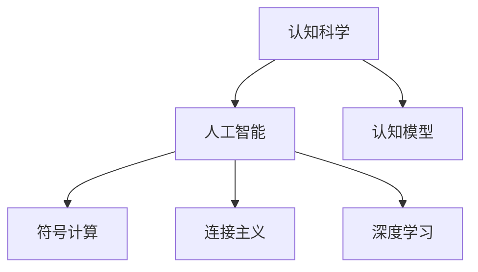

                 

# 人类的认知：AI 时代的认知革命

## 1. 背景介绍

### 1.1 问题由来
在过去的几十年里，人工智能（AI）技术经历了飞速发展，尤其在机器学习和深度学习领域取得了举世瞩目的成就。然而，这些技术的成功也引发了我们对人类认知的深入思考：

- 机器是否能够理解人类语言和行为？
- 机器学习是否能够模拟人类的认知过程？
- 人类认知与AI系统在原理和机制上存在哪些差异？
- 人工智能究竟会如何影响人类的认知与思维方式？

这些问题不仅仅是技术问题，更是哲学、心理学和社会学的重要议题。当前，AI技术正日益融入人们的日常生活，从智能家居到自动驾驶，从智能客服到医疗诊断，AI已无处不在。然而，AI系统终究是"黑盒"，其内部决策过程难以解释，这也引发了人们对AI系统安全性和透明度的担忧。

因此，本文将从认知科学的角度，探讨AI时代人类的认知革命，重点分析AI如何影响人类的认知，以及人类认知与AI系统的相互关系。本文将对AI时代的认知革命进行全面解读，为理解AI技术的未来发展方向提供有力支持。

## 2. 核心概念与联系

### 2.1 核心概念概述

为了更好地理解AI时代的认知革命，首先需要引入几个关键概念：

- **认知科学(Cognitive Science)**：研究人类认知过程及其机制的跨学科领域，涉及心理学、神经科学、计算机科学等。
- **人工智能(Artificial Intelligence, AI)**：通过算法和计算模型模仿人类智能的技术，旨在构建能够像人一样思考和行动的机器。
- **认知模型(Cognitive Model)**：模拟人类认知过程的计算模型，旨在理解和预测人类行为和决策。
- **符号计算(Symbolic Computation)**：使用符号表达式进行推理和决策的计算方式，侧重于逻辑和规则。
- **连接主义(Connectivism)**：基于神经元之间连接和学习过程的计算模型，侧重于分布式记忆和联想。
- **深度学习(Deep Learning)**：利用深度神经网络进行特征提取和模式识别的计算方法，侧重于数据驱动的复杂非线性模型。

这些概念之间的联系可以通过以下Mermaid流程图来展示：



这个流程图展示了认知科学、人工智能与认知模型、符号计算、连接主义、深度学习等概念之间的联系。这些概念共同构成了AI时代认知革命的理论基础。

## 3. 核心算法原理 & 操作步骤

### 3.1 算法原理概述

AI时代的认知革命，实质上是计算机对人类认知过程的模拟和拓展。这一过程涉及符号计算、连接主义和深度学习等多种计算模型和技术手段。本文将重点探讨深度学习中的认知模型和认知过程的算法原理。

### 3.2 算法步骤详解

深度学习模型通常分为训练、推理和评估三个步骤。

**训练**：通过大量标注数据，深度学习模型学习输入与输出之间的映射关系。训练过程通过反向传播算法，计算损失函数并更新模型参数。

**推理**：将新数据输入训练好的模型，得到模型的预测输出。推理过程通常包含前向传播和反向传播，得到模型对新数据的判别。

**评估**：使用验证集和测试集对模型进行性能评估，包括准确率、召回率、F1-score等指标。评估结果用于调整模型参数，改进模型性能。

深度学习模型的认知过程，可以从以下几个方面进行理解：

- **特征提取**：深度学习模型通过多层次的神经网络，自动学习输入数据的特征表示。不同层次的特征提取器，能够捕捉数据的不同层次的语义信息。

- **抽象与概括**：在训练过程中，模型通过自动调整权重，学习到数据的内在结构和规律。这种自动学习过程，类似于人类对数据进行抽象和概括的认知过程。

- **推理与决策**：通过学习到的特征表示，深度学习模型可以对新数据进行推理和决策。推理过程通常包含模型的前向传播，决策过程涉及输出层的激活函数。

### 3.3 算法优缺点

深度学习模型在认知模拟和认知革命中发挥了重要作用，但也存在一些局限性：

**优点**：
- 数据驱动：深度学习模型可以通过大数据自动学习特征表示，无需人工设计特征。
- 自动优化：深度学习模型通过反向传播算法自动调整参数，无需手动调整。
- 鲁棒性强：深度学习模型能够学习到数据中的噪声和规律，具有一定的鲁棒性。

**缺点**：
- 黑盒性质：深度学习模型通常被视为"黑盒"，其内部决策过程难以解释和理解。
- 数据依赖：深度学习模型对标注数据依赖较强，需要大量高质量数据进行训练。
- 过拟合风险：深度学习模型在训练过程中容易过拟合，需要采取正则化等方法避免。

### 3.4 算法应用领域

深度学习模型在多个领域得到了广泛应用，例如：

- 计算机视觉：图像分类、目标检测、图像生成等任务。
- 自然语言处理：语言建模、机器翻译、文本生成等任务。
- 语音识别：语音转文本、语音合成等任务。
- 机器人控制：机器人路径规划、动作生成等任务。

此外，深度学习模型在医学影像分析、金融预测、智能推荐等多个领域也展现了巨大的潜力。未来，随着深度学习技术的进一步发展，AI系统将能够模拟和拓展人类认知的更多方面，推动认知革命的深入发展。

## 4. 数学模型和公式 & 详细讲解

### 4.1 数学模型构建

深度学习模型的核心是神经网络，神经网络通常由多层神经元组成。每层神经元通过权重连接，接收前一层的输出，并生成新的输出。神经网络的输入为训练数据，输出为模型预测结果。

以图像分类为例，神经网络的结构可以表示为：

$$
\begin{aligned}
\boldsymbol{x} &= \text{Input layer} \\
\boldsymbol{h} &= \text{Hidden layers} \\
\boldsymbol{y} &= \text{Output layer} 
\end{aligned}
$$

其中，$\boldsymbol{x}$ 表示输入层，$\boldsymbol{h}$ 表示隐藏层，$\boldsymbol{y}$ 表示输出层。每一层的神经元都通过权重连接，形成神经网络。

### 4.2 公式推导过程

以卷积神经网络（CNN）为例，进行数学推导过程。

卷积神经网络常用于图像分类任务，其核心在于卷积层和池化层的交替使用。卷积层用于提取输入数据的特征，池化层用于降低特征图的大小，同时保留重要特征。

设输入数据为 $\boldsymbol{x}$，卷积核为 $\boldsymbol{W}$，输出特征图为 $\boldsymbol{h}$，则卷积操作可以表示为：

$$
\boldsymbol{h} = \text{Conv}(\boldsymbol{x}, \boldsymbol{W})
$$

其中，$\text{Conv}$ 表示卷积操作，$\boldsymbol{W}$ 表示卷积核。卷积操作可以表示为：

$$
\boldsymbol{h} = \text{Conv}(\boldsymbol{x}, \boldsymbol{W}) = \sum_{i,j} \boldsymbol{W} * \boldsymbol{x}(i,j)
$$

其中，$\boldsymbol{x}(i,j)$ 表示输入数据在位置 $(i,j)$ 的像素值，$\boldsymbol{W}$ 表示卷积核。卷积操作可以看作是输入数据的局部加权和。

### 4.3 案例分析与讲解

以手写数字识别为例，介绍卷积神经网络的应用。

手写数字识别任务可以表示为图像分类任务。使用卷积神经网络进行手写数字识别，需要经过以下几个步骤：

1. 数据预处理：将手写数字图像转换为像素矩阵，并进行归一化处理。

2. 卷积层：使用卷积核对像素矩阵进行卷积操作，生成特征图。

3. 池化层：对特征图进行池化操作，降低特征图的大小，同时保留重要特征。

4. 全连接层：将池化层的输出连接至全连接层，进行分类决策。

使用TensorFlow框架，可以方便地构建卷积神经网络，并进行训练和推理。

## 5. 项目实践：代码实例和详细解释说明

### 5.1 开发环境搭建

在项目实践前，需要准备好开发环境。以下是使用Python进行TensorFlow开发的环境配置流程：

1. 安装Anaconda：从官网下载并安装Anaconda，用于创建独立的Python环境。

2. 创建并激活虚拟环境：
```bash
conda create -n tf-env python=3.8 
conda activate tf-env
```

3. 安装TensorFlow：根据CUDA版本，从官网获取对应的安装命令。例如：
```bash
conda install tensorflow -c conda-forge -c pytorch-nightly
```

4. 安装各类工具包：
```bash
pip install numpy pandas scikit-learn matplotlib tqdm jupyter notebook ipython
```

完成上述步骤后，即可在`tf-env`环境中开始项目实践。

### 5.2 源代码详细实现

下面我们以手写数字识别为例，给出使用TensorFlow框架实现卷积神经网络的完整代码实现。

首先，定义数据处理函数：

```python
import tensorflow as tf
from tensorflow.keras.datasets import mnist
from tensorflow.keras.utils import to_categorical

def load_data():
    (x_train, y_train), (x_test, y_test) = mnist.load_data()
    x_train = x_train.reshape(-1, 28, 28, 1).astype('float32') / 255.0
    x_test = x_test.reshape(-1, 28, 28, 1).astype('float32') / 255.0
    y_train = to_categorical(y_train, 10)
    y_test = to_categorical(y_test, 10)
    return x_train, y_train, x_test, y_test
```

然后，定义卷积神经网络模型：

```python
from tensorflow.keras.layers import Conv2D, MaxPooling2D, Flatten, Dense
from tensorflow.keras.models import Sequential

def create_model():
    model = Sequential()
    model.add(Conv2D(32, kernel_size=(3, 3), activation='relu', input_shape=(28, 28, 1)))
    model.add(MaxPooling2D(pool_size=(2, 2)))
    model.add(Conv2D(64, kernel_size=(3, 3), activation='relu'))
    model.add(MaxPooling2D(pool_size=(2, 2)))
    model.add(Flatten())
    model.add(Dense(128, activation='relu'))
    model.add(Dense(10, activation='softmax'))
    return model
```

接着，定义训练和评估函数：

```python
from tensorflow.keras.callbacks import EarlyStopping

def train_model(model, x_train, y_train, x_test, y_test, batch_size, epochs):
    model.compile(optimizer='adam', loss='categorical_crossentropy', metrics=['accuracy'])
    early_stopping = EarlyStopping(monitor='val_loss', patience=5)
    model.fit(x_train, y_train, batch_size=batch_size, epochs=epochs, validation_data=(x_test, y_test), callbacks=[early_stopping])
    
    test_loss, test_acc = model.evaluate(x_test, y_test, verbose=0)
    print('Test loss:', test_loss)
    print('Test accuracy:', test_acc)

# 启动训练流程
x_train, y_train, x_test, y_test = load_data()
model = create_model()
train_model(model, x_train, y_train, x_test, y_test, batch_size=64, epochs=10)
```

以上就是使用TensorFlow框架实现卷积神经网络的完整代码实现。可以看到，TensorFlow框架提供了便捷的接口，使得模型构建和训练过程变得非常简单。

### 5.3 代码解读与分析

让我们再详细解读一下关键代码的实现细节：

**load_data函数**：
- 使用TensorFlow内置的MNIST数据集，加载训练集和测试集。
- 对输入数据进行归一化处理，并将标签进行one-hot编码。

**create_model函数**：
- 定义卷积神经网络模型，包含卷积层、池化层、全连接层等。
- 使用Sequential模型来构建模型，可以方便地添加多个层次。

**train_model函数**：
- 使用Adam优化器进行模型训练，损失函数为交叉熵。
- 使用EarlyStopping回调函数进行训练过程中的提前停止，避免过拟合。
- 在验证集上评估模型性能，输出测试集上的精度。

**训练流程**：
- 定义模型的优化器、损失函数和评估指标。
- 设置EarlyStopping回调函数，避免过拟合。
- 在训练集上训练模型，并在验证集上进行验证。
- 在测试集上评估模型性能，输出最终结果。

可以看到，TensorFlow框架使得卷积神经网络的构建和训练过程变得非常简单。开发者可以将更多精力放在模型优化和数据分析上，而不必过多关注底层实现细节。

## 6. 实际应用场景

### 6.1 智慧医疗

在智慧医疗领域，AI技术已经被广泛应用于疾病诊断、医学影像分析、个性化治疗等任务中。通过深度学习模型，AI系统能够对医学影像、病历记录等复杂数据进行高效分析和处理，辅助医生进行决策。

在具体应用中，可以使用深度学习模型对医学影像进行分类、分割和配准。以MRI图像分类为例，使用卷积神经网络对MRI图像进行特征提取和分类，可以识别出不同类型和阶段的疾病，辅助医生进行诊断和治疗。

此外，AI系统还可以通过自然语言处理技术，对电子病历进行信息提取和摘要，生成个性化的治疗方案，提高诊疗效率和准确性。例如，使用BERT模型对病历进行分类和摘要，可以自动化生成临床报告，减轻医生工作负担。

### 6.2 智能交通

在智能交通领域，AI技术被广泛应用于自动驾驶、交通流量预测、智能导航等任务中。通过深度学习模型，AI系统能够对交通数据进行高效分析和处理，优化交通管理和运输效率。

在自动驾驶中，深度学习模型被广泛应用于目标检测、路径规划和决策控制等任务。例如，使用YOLO模型对摄像头采集的图像进行目标检测，可以识别出行人和车辆等障碍物，辅助自动驾驶系统进行决策。

在交通流量预测中，深度学习模型被广泛应用于交通数据的分析和预测。例如，使用循环神经网络（RNN）对交通流量数据进行建模，可以预测未来的交通状况，优化交通管理和调度。

### 6.3 智能制造

在智能制造领域，AI技术被广泛应用于设备监控、生产调度、质量控制等任务中。通过深度学习模型，AI系统能够对设备数据和生产数据进行高效分析和处理，优化生产流程和提高生产效率。

在设备监控中，深度学习模型被广泛应用于设备故障检测和维护。例如，使用卷积神经网络对设备传感器数据进行特征提取和分类，可以检测出设备异常和故障，进行及时维护。

在生产调度中，深度学习模型被广泛应用于生产过程优化。例如，使用强化学习模型对生产调度进行优化，可以最大化生产效率和资源利用率，提高生产质量和效益。

### 6.4 未来应用展望

未来，随着深度学习技术的进一步发展，AI系统将在更多领域得到应用，为人类社会带来深刻变革。

在智慧城市治理中，AI系统被广泛应用于城市事件监测、舆情分析、应急指挥等环节，提高城市管理的自动化和智能化水平，构建更安全、高效的未来城市。

在智能教育中，AI系统被广泛应用于作业批改、学情分析、知识推荐等方面，因材施教，促进教育公平，提高教学质量。

在金融预测中，AI系统被广泛应用于股票预测、风险评估、客户服务等方面，提高金融决策的科学性和准确性，降低金融风险。

## 7. 工具和资源推荐

### 7.1 学习资源推荐

为了帮助开发者系统掌握深度学习模型的理论基础和实践技巧，这里推荐一些优质的学习资源：

1. 《深度学习》（Deep Learning）书籍：Ian Goodfellow等著，全面介绍了深度学习的理论基础和实践方法。

2. 《动手学深度学习》（Dive into Deep Learning）书籍：李沐等著，通过实践项目和代码实现，帮助读者快速掌握深度学习。

3. 《TensorFlow实战》（TensorFlow for Deep Learning）书籍：Manning Publications著，详细介绍了TensorFlow的使用方法和实践技巧。

4. Coursera深度学习课程：由Andrew Ng等人授课，涵盖深度学习的基础理论和实践方法，适合初学者和进阶学习者。

5. DeepLearning.AI深度学习课程：由Andrew Ng等人授课，涵盖深度学习的基础理论和实践方法，适合初学者和进阶学习者。

通过对这些资源的学习实践，相信你一定能够快速掌握深度学习模型的精髓，并用于解决实际的AI问题。

### 7.2 开发工具推荐

高效的开发离不开优秀的工具支持。以下是几款用于深度学习模型开发的常用工具：

1. TensorFlow：由Google主导开发的开源深度学习框架，生产部署方便，适合大规模工程应用。

2. PyTorch：由Facebook开发的开源深度学习框架，灵活动态的计算图，适合快速迭代研究。

3. Keras：基于TensorFlow和Theano等后端的高级深度学习框架，简单易用，适合初学者和快速原型设计。

4. Jupyter Notebook：交互式的数据分析和代码编写工具，支持Python、R等多种语言，适合数据科学和机器学习实践。

5. Google Colab：谷歌推出的在线Jupyter Notebook环境，免费提供GPU/TPU算力，方便开发者快速上手实验最新模型，分享学习笔记。

合理利用这些工具，可以显著提升深度学习模型的开发效率，加快创新迭代的步伐。

### 7.3 相关论文推荐

深度学习模型和认知模拟的研究源于学界的持续研究。以下是几篇奠基性的相关论文，推荐阅读：

1. ImageNet Classification with Deep Convolutional Neural Networks：提出卷积神经网络（CNN），展示了其在图像分类任务上的出色表现。

2. Deep Residual Learning for Image Recognition：提出残差网络（ResNet），缓解深度网络训练中的梯度消失问题，提高了深度网络的训练效率和精度。

3. Attention is All You Need：提出Transformer模型，提出了自注意力机制，提高了深度学习模型的推理和理解能力。

4. Neural Architectures for Named Entity Recognition（NER）：提出基于CNN和LSTM的NER模型，展示了其在命名实体识别任务上的优越性能。

5. Generative Adversarial Nets（GANs）：提出生成对抗网络（GANs），实现了高质量的图像生成和数据增强，展示了其强大的生成能力。

这些论文代表了大规模深度学习模型的发展脉络。通过学习这些前沿成果，可以帮助研究者把握学科前进方向，激发更多的创新灵感。

## 8. 总结：未来发展趋势与挑战

### 8.1 总结

本文对深度学习模型在认知科学中的应用进行了全面解读。首先阐述了深度学习模型的核心算法原理和操作步骤，分析了深度学习模型在认知模拟中的优势和局限。其次，从认知科学的角度，探讨了AI技术对人类认知的影响，分析了AI技术在智慧医疗、智能交通、智能制造等多个领域的应用前景。最后，总结了深度学习模型在实际应用中面临的挑战和未来发展趋势。

通过本文的系统梳理，可以看到，深度学习模型在认知科学中的应用前景广阔，推动了认知革命的深入发展。未来，随着深度学习技术的进一步演进，AI系统将在更多领域得到应用，为人类社会带来深刻变革。

### 8.2 未来发展趋势

未来，深度学习模型将呈现以下几个发展趋势：

1. 模型规模持续增大。随着算力成本的下降和数据规模的扩张，深度学习模型的参数量还将持续增长。超大规模深度学习模型蕴含的丰富知识，有望支撑更加复杂多变的认知模拟。

2. 模型鲁棒性增强。深度学习模型通过引入对抗训练、正则化等技术，提升了模型的鲁棒性和泛化能力，应对数据分布的变化。

3. 模型可解释性提高。深度学习模型通过引入可解释性工具，如LIME、SHAP等，提升了模型的可解释性和透明度，便于理解和调试。

4. 跨模态融合增强。深度学习模型通过引入多模态融合技术，结合视觉、听觉、语言等多模态信息，提升模型的综合认知能力。

5. 联邦学习和隐私保护增强。深度学习模型通过引入联邦学习和隐私保护技术，保护数据隐私和安全性，避免模型泄露个人隐私。

这些趋势将推动深度学习模型在认知模拟中的进一步应用，拓展人类认知的边界，推动认知革命的深入发展。

### 8.3 面临的挑战

尽管深度学习模型在认知模拟中取得了显著进展，但仍面临诸多挑战：

1. 数据依赖问题。深度学习模型对标注数据依赖较强，标注数据不足会限制模型的性能。如何在大规模无标注数据上进行预训练，提升模型的鲁棒性，仍是一大挑战。

2. 计算资源需求高。深度学习模型需要大量计算资源进行训练和推理，对硬件资源的需求较高。如何优化模型的计算图，降低计算成本，提升模型的推理效率，是亟需解决的问题。

3. 模型泛化性不足。深度学习模型在特定领域和数据分布下表现良好，但泛化能力有限。如何在跨领域和跨数据分布上进行迁移学习，提高模型的泛化能力，是未来研究的重要方向。

4. 模型透明性不足。深度学习模型的内部决策过程难以解释，缺乏可解释性。如何在模型设计中加入可解释性机制，提高模型的透明性和可信度，是重要的研究课题。

5. 模型安全性不足。深度学习模型在训练过程中可能学习到有害和偏见信息，影响模型输出的可信度。如何在模型训练中过滤有害信息和偏见，提升模型安全性，是亟需解决的问题。

这些挑战将推动深度学习模型在认知模拟中的进一步发展和优化。未来，只有在解决这些挑战的基础上，深度学习模型才能更好地模拟和拓展人类认知，推动认知革命的深入发展。

### 8.4 研究展望

未来，深度学习模型在认知模拟中的应用仍需不断探索和创新。以下是几个重要的研究方向：

1. 跨领域迁移学习。深度学习模型在跨领域迁移学习方面的研究仍需深入，如何提升模型在跨领域和跨数据分布下的泛化能力，是未来研究的重要方向。

2. 多模态融合学习。深度学习模型在多模态融合学习方面的研究仍需深入，如何结合视觉、听觉、语言等多模态信息，提升模型的综合认知能力，是未来研究的重要方向。

3. 模型可解释性。深度学习模型在可解释性方面的研究仍需深入，如何通过引入可解释性机制，提升模型的透明性和可信度，是未来研究的重要方向。

4. 模型安全性。深度学习模型在安全性方面的研究仍需深入，如何在模型训练和推理过程中过滤有害信息和偏见，提升模型安全性，是未来研究的重要方向。

5. 联邦学习和隐私保护。深度学习模型在联邦学习和隐私保护方面的研究仍需深入，如何在保证数据隐私和安全性的前提下，进行跨地域和多主体的模型训练，是未来研究的重要方向。

这些研究方向将推动深度学习模型在认知模拟中的进一步发展，拓展人类认知的边界，推动认知革命的深入发展。

## 9. 附录：常见问题与解答

**Q1：深度学习模型是否能够模拟人类认知？**

A: 深度学习模型在模拟人类认知方面取得了显著进展，但仍存在诸多局限性。深度学习模型可以模拟人类的视觉、语言和推理能力，但在理解复杂的社会和文化背景、推理复杂因果关系等方面仍存在较大挑战。未来，通过引入符号计算和因果推理等机制，深度学习模型有望进一步提升认知模拟的能力。

**Q2：深度学习模型在实际应用中面临哪些挑战？**

A: 深度学习模型在实际应用中面临以下挑战：

1. 数据依赖问题。深度学习模型对标注数据依赖较强，标注数据不足会限制模型的性能。

2. 计算资源需求高。深度学习模型需要大量计算资源进行训练和推理，对硬件资源的需求较高。

3. 模型泛化性不足。深度学习模型在特定领域和数据分布下表现良好，但泛化能力有限。

4. 模型透明性不足。深度学习模型的内部决策过程难以解释，缺乏可解释性。

5. 模型安全性不足。深度学习模型在训练过程中可能学习到有害和偏见信息，影响模型输出的可信度。

这些问题亟需解决，才能使深度学习模型在实际应用中发挥更大作用。

**Q3：未来深度学习模型将如何发展？**

A: 未来深度学习模型将呈现以下几个发展趋势：

1. 模型规模持续增大。超大规模深度学习模型蕴含的丰富知识，有望支撑更加复杂多变的认知模拟。

2. 模型鲁棒性增强。通过引入对抗训练、正则化等技术，提升了模型的鲁棒性和泛化能力。

3. 模型可解释性提高。通过引入可解释性工具，提升了模型的可解释性和透明度。

4. 跨模态融合增强。结合视觉、听觉、语言等多模态信息，提升模型的综合认知能力。

5. 联邦学习和隐私保护增强。保护数据隐私和安全性，避免模型泄露个人隐私。

这些趋势将推动深度学习模型在认知模拟中的进一步应用，拓展人类认知的边界，推动认知革命的深入发展。

作者：禅与计算机程序设计艺术 / Zen and the Art of Computer Programming

