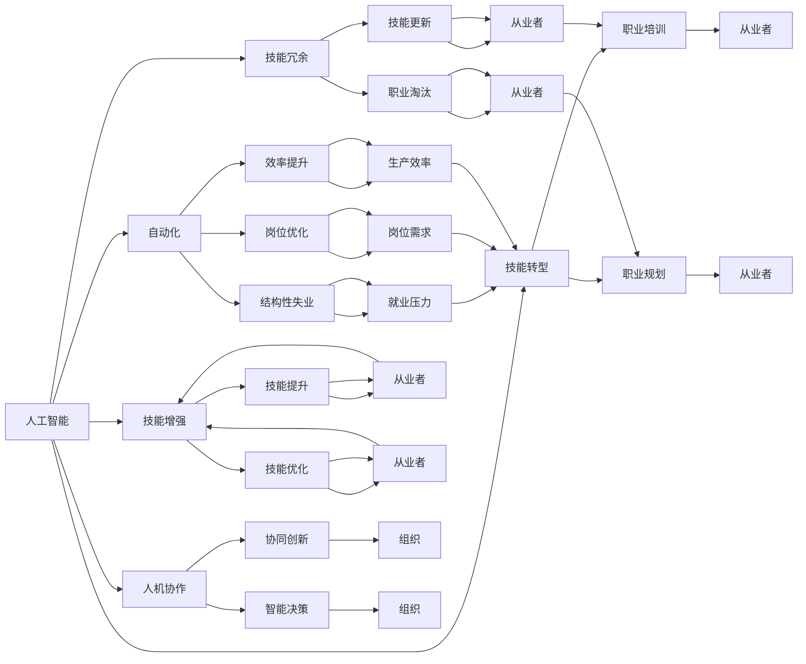

                 

# 人类计算：AI时代的未来就业市场与技能发展趋势预测

> 关键词：人工智能，AI时代，未来就业，技能发展，自动化，职业转型，教育培训

## 1. 背景介绍

### 1.1 问题由来

随着人工智能(AI)技术的飞速发展，自动化和智能化已经在各行各业中不断渗透。机器学习和深度学习技术不断进步，AI系统在语音识别、图像处理、自然语言处理等领域已经展现出超乎想象的强大能力。然而，这些技术的广泛应用也引发了一系列社会和经济问题，尤其是对就业市场的深远影响。

当前，机器自动化已经在一些传统制造业和低技能岗位上取得了显著成效，带来了大量的结构性失业问题。而在高技能和创意型岗位上，AI技术的引入则带来了新的挑战和机遇。未来，AI技术还将进一步扩展到更多领域，引发就业市场的重大变迁。

因此，本文旨在深入探讨AI时代对就业市场的影响，并分析未来技能发展的趋势，为从业者提供基于AI技术发展的职业规划和培训建议。

### 1.2 问题核心关键点

本文的核心问题包括：

1. AI技术对不同行业和岗位的影响程度如何？
2. 未来就业市场将呈现哪些新的趋势？
3. 哪些技能将持续保持重要性？
4. 从业者应该如何调整职业规划和技能发展方向？
5. 教育培训系统应如何应对AI带来的挑战？

本文将从这些关键问题出发，全面探讨AI时代下就业市场和技能发展的未来趋势。

## 2. 核心概念与联系

### 2.1 核心概念概述

为了更好地理解AI技术对就业市场的影响，本文将介绍以下几个核心概念：

- **人工智能(AI)**：指能够模拟人类智能行为的计算机技术，涵盖机器学习、深度学习、自然语言处理等领域。
- **自动化(Automation)**：指使用机器和算法代替人类完成特定任务的过程。
- **技能转型(Skill Transition)**：指从业者为了适应AI技术的发展，需要重新学习、提升或淘汰部分技能的过程。
- **技能冗余(Skill Redundancy)**：指某些技能因技术进步而被机器取代，不再具有市场需求。
- **技能增强(Skill Enhancement)**：指通过AI技术提升个人技能的效率和质量。
- **人机协作(Human-Machine Collaboration)**：指AI系统和人类共同完成复杂任务的过程。

这些概念相互关联，共同构成了AI时代下就业市场的全景图。

### 2.2 核心概念原理和架构的 Mermaid 流程图



### 2.3 核心概念的联系

上述核心概念之间的联系可以通过以下逻辑链条来描述：

1. **自动化**（B）是AI技术的直接应用，导致**结构性失业**（G）和**岗位优化**（H）。
2. **技能转型**（C）、**技能冗余**（D）和**技能增强**（E）是自动化带来的直接后果。
3. **人机协作**（F）则是AI和人类共同作用的结果，推动了**协同创新**（P）和**智能决策**（Q）。
4. **就业压力**（R）和**岗位需求**（S）直接影响**职业培训**（J）和**职业规划**（K）。
5. **技能更新**（L）、**技能提升**（N）和**技能优化**（O）是应对技能冗余和岗位优化的重要措施。

通过理解这些核心概念及其相互关系，我们可以更好地把握AI技术对就业市场和技能发展的深远影响。

## 3. 核心算法原理 & 具体操作步骤

### 3.1 算法原理概述

基于AI技术的自动化过程，可以抽象为以下几个核心步骤：

1. **数据获取与预处理**：从外部环境获取数据，并对其进行清洗、标注等预处理操作。
2. **特征提取与选择**：从预处理后的数据中提取有用的特征，并选择合适的特征组合。
3. **模型训练与优化**：使用机器学习或深度学习算法对数据进行训练，并通过优化算法提高模型性能。
4. **模型评估与部署**：评估模型性能，部署模型到实际应用场景中。

这些步骤共同构成了AI自动化的基本流程，其中数据获取、模型训练和部署等环节需要大量人力资源和计算资源。因此，未来就业市场将对与这些环节相关的技能有更高的需求。

### 3.2 算法步骤详解

以下详细说明AI自动化过程中每个步骤的具体操作：

**Step 1: 数据获取与预处理**
- 数据来源：可以从公开数据集、社交媒体、物联网设备等渠道获取数据。
- 数据清洗：去除噪声、重复和不完整的数据。
- 数据标注：对数据进行标注，确保数据质量。

**Step 2: 特征提取与选择**
- 特征提取：使用PCA、LDA等算法提取数据中的关键特征。
- 特征选择：选择与任务最相关的特征，如TF-IDF、Word2Vec等。

**Step 3: 模型训练与优化**
- 模型选择：选择合适的算法，如线性回归、决策树、神经网络等。
- 模型训练：使用训练数据对模型进行训练，并使用梯度下降等优化算法调整模型参数。
- 模型评估：使用测试数据评估模型性能，如准确率、召回率、F1分数等。

**Step 4: 模型评估与部署**
- 模型部署：将训练好的模型部署到实际应用场景中。
- 性能监控：实时监控模型性能，确保其稳定运行。
- 定期更新：根据新数据更新模型，保持其性能。

### 3.3 算法优缺点

AI自动化在提高效率和降低成本的同时，也带来了一些显著的优点和缺点：

**优点：**
1. 提高生产效率：自动化能够快速处理大量数据，大幅提升生产效率。
2. 降低运营成本：减少人工操作和错误，降低人力成本。
3. 促进创新：自动化使得数据分析和模型训练更加灵活，促进技术创新。

**缺点：**
1. 技能冗余：自动化可能导致某些技能被机器取代，增加失业风险。
2. 数据隐私：自动化涉及大量数据处理，可能带来数据隐私和安全问题。
3. 依赖性强：自动化系统依赖稳定数据和算法，一旦出现问题可能影响业务。

### 3.4 算法应用领域

AI自动化技术已经在多个领域得到广泛应用，包括：

- **制造业**：自动化生产线，减少人工操作，提升生产效率。
- **金融业**：自动化风险评估和投资分析，提升决策效率。
- **医疗业**：自动化诊断和病历管理，提升诊疗质量。
- **零售业**：自动化库存管理和推荐系统，提升用户体验。
- **交通业**：自动化驾驶和交通管理，提升安全性。

这些领域的广泛应用，使得AI技术成为推动经济发展和社会进步的重要力量。

## 4. 数学模型和公式 & 详细讲解 & 举例说明

### 4.1 数学模型构建

以机器学习中的线性回归模型为例，构建其数学模型：

假设数据集为 $(x_i,y_i)$，其中 $x_i$ 为输入特征，$y_i$ 为输出目标。线性回归模型的目标是最小化预测值和真实值之间的均方误差：

$$
\min_{\theta} \frac{1}{2N} \sum_{i=1}^N (y_i - \theta x_i)^2
$$

其中 $\theta$ 为模型参数。通过梯度下降等优化算法求解，得到：

$$
\theta = \frac{1}{N} \sum_{i=1}^N x_i y_i
$$

### 4.2 公式推导过程

线性回归模型的推导过程如下：

1. **模型构建**：设模型为 $y = \theta x + \epsilon$，其中 $\epsilon$ 为随机误差。
2. **最小化损失函数**：将预测值和真实值之间的误差平方和作为损失函数，最小化：
   $$
   \min_{\theta} \frac{1}{2N} \sum_{i=1}^N (y_i - \theta x_i)^2
   $$
3. **求解参数**：对上述损失函数求导，得：
   $$
   \frac{\partial}{\partial \theta} \frac{1}{2N} \sum_{i=1}^N (y_i - \theta x_i)^2 = \frac{1}{N} \sum_{i=1}^N (y_i - \theta x_i)
   $$
4. **解方程**：令导数为0，解方程得：
   $$
   \theta = \frac{1}{N} \sum_{i=1}^N x_i y_i
   $$

### 4.3 案例分析与讲解

以一个简单的数据集为例，展示线性回归模型的应用：

假设数据集如下：

| x  | y  |
|----|----|
| 1  | 2  |
| 2  | 4  |
| 3  | 6  |

使用线性回归模型进行预测，得到的拟合直线为 $y = 2x$。假设测试点为 $x=4$，预测的 $y$ 值为8，与真实值相符。

通过上述案例可以看出，线性回归模型可以很好地拟合数据，并预测新数据点的值。

## 5. 项目实践：代码实例和详细解释说明

### 5.1 开发环境搭建

在进行机器学习项目开发前，需要准备相应的开发环境：

1. 安装Python：下载并安装Python，确保其版本为3.x。
2. 安装相关库：使用pip安装必要的库，如Numpy、Scikit-learn、TensorFlow等。
3. 设置数据集：准备好所需的数据集，并存储在本地或云端。

### 5.2 源代码详细实现

以下是一个简单的线性回归代码实现：

```python
import numpy as np
from sklearn.linear_model import LinearRegression

# 构建数据集
X = np.array([[1], [2], [3]])
y = np.array([2, 4, 6])

# 构建模型
model = LinearRegression()

# 训练模型
model.fit(X, y)

# 预测新数据
x_test = np.array([4])
y_pred = model.predict(x_test)

print(y_pred)
```

### 5.3 代码解读与分析

代码的每个部分解释如下：

**数据集构建**
- 使用Numpy创建训练数据集，包括特征 $x$ 和目标 $y$。

**模型构建**
- 使用Scikit-learn库中的LinearRegression类创建线性回归模型。

**模型训练**
- 使用fit方法训练模型，将特征和目标作为输入。

**模型预测**
- 使用predict方法预测新数据点的值。

**输出结果**
- 打印预测结果。

## 6. 实际应用场景

### 6.1 智能制造

智能制造是将AI技术应用于制造业的关键场景之一。通过自动化和智能化生产，减少人工操作，提升生产效率和产品质量。

具体应用包括：
- **自动化生产线**：使用机器人和自动化设备进行生产，减少人工干预。
- **质量检测**：使用机器视觉和传感器进行实时质量检测，确保产品符合标准。
- **生产调度**：通过预测分析，优化生产计划和资源配置。

### 6.2 金融风控

金融行业是AI应用的重要领域，通过自动化和智能化，提升风险评估和投资决策的准确性。

具体应用包括：
- **信用评分**：使用机器学习模型评估客户信用风险，提高审批效率。
- **欺诈检测**：通过异常检测和模式识别，识别和防范欺诈行为。
- **智能投顾**：使用自然语言处理和机器学习技术，提供个性化投资建议。

### 6.3 医疗诊断

医疗诊断是AI技术的另一个重要应用场景，通过自动化和智能化，提升诊疗效率和诊断准确性。

具体应用包括：
- **影像分析**：使用机器学习模型进行医学影像分析，辅助医生诊断。
- **电子病历管理**：使用自然语言处理技术，整理和分析电子病历数据，提升诊疗质量。
- **个性化治疗**：通过分析患者数据，制定个性化治疗方案。

### 6.4 未来应用展望

未来，AI技术将在更多领域得到广泛应用，引发就业市场的重大变迁。

1. **医疗健康**：AI将提升医疗服务的智能化水平，改善医疗资源配置，提高诊疗效率。
2. **教育培训**：AI将推动教育资源优化配置，提升教育质量，实现个性化教学。
3. **交通运输**：自动驾驶和智能交通管理将大幅提升交通效率，减少交通事故。
4. **环境保护**：AI将推动环境保护技术的智能化，提高环境监测和治理能力。
5. **能源管理**：智能电网和能源管理将提升能源利用效率，减少浪费。

这些应用场景展示了AI技术在推动社会发展中的巨大潜力，也为未来就业市场提供了新的方向。

## 7. 工具和资源推荐

### 7.1 学习资源推荐

1. **Coursera**：提供众多AI和机器学习课程，涵盖从基础到高级的内容。
2. **edX**：提供多种AI和数据科学课程，覆盖广泛主题。
3. **Kaggle**：数据科学竞赛平台，提供丰富的数据集和算法实现。
4. **GitHub**：开源代码仓库，提供大量的机器学习项目和案例。
5. **Udacity**：提供AI和数据科学纳米学位课程，注重实践和项目驱动学习。

### 7.2 开发工具推荐

1. **PyTorch**：Python深度学习框架，支持动态计算图和GPU加速。
2. **TensorFlow**：Google开发的深度学习框架，支持分布式训练和模型部署。
3. **Scikit-learn**：Python机器学习库，提供丰富的机器学习算法和工具。
4. **Keras**：高层次神经网络API，支持快速搭建和训练模型。
5. **Jupyter Notebook**：交互式编程环境，支持代码调试和结果展示。

### 7.3 相关论文推荐

1. **"Artificial Intelligence: A Modern Approach"**：AI领域经典教材，涵盖AI技术和应用。
2. **"Deep Learning" by Ian Goodfellow**：深度学习领域的权威教材，详细介绍了深度学习算法和应用。
3. **"Machine Learning Yearning" by Andrew Ng**：机器学习实战指南，提供实用的机器学习经验和建议。
4. **"Human-AI Collaboration: A Critical Perspective"**：探讨人机协作对就业市场的长期影响。
5. **"Future of Work: Automating Tasks, Upskilling Workers"**：关于AI自动化对未来就业市场的预测和分析。

## 8. 总结：未来发展趋势与挑战

### 8.1 研究成果总结

本文从AI技术对就业市场的影响出发，探讨了未来技能发展的趋势和方向。主要研究成果包括：

1. AI自动化将对就业市场带来结构性变革，导致部分岗位消失，部分岗位需求增加。
2. 未来技能发展将更注重与AI技术相结合，如数据分析、机器学习、自然语言处理等。
3. 人机协作将成为未来工作的重要形式，需要从业者具备更高的技术和素养。

### 8.2 未来发展趋势

未来AI技术的发展将呈现以下几个趋势：

1. **深度学习技术持续进步**：深度神经网络将继续提升AI系统的智能化水平。
2. **多模态融合**：结合视觉、语音、文本等多模态数据，提升AI系统的感知能力。
3. **强化学习**：通过智能体与环境交互，提升AI系统的决策能力。
4. **边缘计算**：将AI算法部署到边缘设备，提升实时处理能力。
5. **联邦学习**：通过分布式训练，保护数据隐私和提升系统安全性。

### 8.3 面临的挑战

AI技术的发展虽然带来了诸多机遇，但也面临诸多挑战：

1. **数据隐私和安全**：AI系统需要大量数据，可能带来隐私泄露和数据滥用问题。
2. **伦理和社会问题**：AI系统可能带来就业替代、社会不平等等问题。
3. **技术门槛高**：AI技术的复杂性使得人才需求增加，但培养周期较长。
4. **算法透明性不足**：AI系统的决策过程难以解释，可能带来信任问题。

### 8.4 研究展望

未来研究需要从以下几个方面进行探索：

1. **公平性和透明性**：提升AI系统的公平性和透明性，增强社会信任。
2. **跨领域应用**：将AI技术应用于更多领域，推动行业变革。
3. **教育培训**：优化教育培训体系，培养更多AI技术人才。
4. **伦理规范**：制定AI技术的伦理规范，引导健康发展。

## 9. 附录：常见问题与解答

**Q1: AI技术对就业市场的影响有多大？**

A: AI技术将对就业市场带来结构性变革，导致部分岗位消失，部分岗位需求增加。长期来看，AI技术将促进劳动生产率提升，但短期内可能会带来一定的就业冲击。

**Q2: 哪些技能在未来将保持重要性？**

A: 数据分析、机器学习、自然语言处理、人机协作等技能将持续保持重要性。未来就业市场需要具备高度技术素养的从业者，能够与AI系统协同工作。

**Q3: 如何应对AI技术的挑战？**

A: 提高数据隐私和安全保护，制定AI技术的伦理规范，优化教育培训体系，提升AI系统的透明性和可解释性，这些都是应对AI技术挑战的重要措施。

**Q4: 未来技能发展的趋势是什么？**

A: 技能发展将更注重与AI技术相结合，如数据分析、机器学习、自然语言处理等。未来就业市场需要具备高度技术素养的从业者，能够与AI系统协同工作。

**Q5: 教育培训系统应如何应对AI挑战？**

A: 教育培训系统应注重培养学生的创新思维和跨学科知识，提升其技术素养和适应能力。同时，与企业和科研机构合作，提供实战训练和实践机会。

总之，AI技术的发展将深刻改变就业市场和技能发展趋势，从业者需要积极应对，提升自身技能，才能在未来的竞争中占据优势。

---

作者：禅与计算机程序设计艺术 / Zen and the Art of Computer Programming

