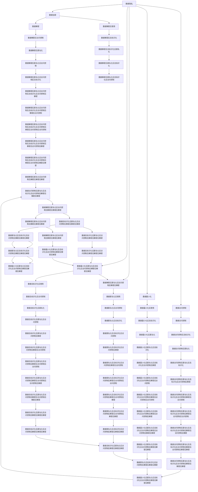

                 

## 1. 背景介绍

### 1.1 问题由来

随着人工智能技术的飞速发展，人类社会正逐步迈入一个全新的计算时代。通过大数据、深度学习、云计算等技术，人们可以在短时间内处理海量数据，生成高效智能的决策。然而，随着科技的不断进步，一系列与人类伦理道德相关的问题也浮现出来，引发了广泛的关注和讨论。

在互联网、物联网、智能机器人等技术日益普及的背景下，计算的边界从虚拟世界扩展到人类生活、工作和社会交往的各个领域。科技与伦理的平衡问题变得愈发紧迫和复杂。如何在享受科技进步带来便利的同时，确保计算行为的道德合规，保护个人隐私、维护社会公平正义，是一个亟待解决的问题。

### 1.2 问题核心关键点

科技与伦理的平衡涉及多个方面，包括但不限于以下几个关键点：

- **数据隐私**：随着数字化转型加速，个人数据逐渐成为各方争夺的焦点。如何在数据收集、存储、处理和使用过程中保护隐私，避免数据泄露和滥用，是一个重要的伦理问题。

- **算法偏见**：大数据和深度学习算法的广泛应用，可能会因为数据样本的偏差而产生算法偏见。这种偏见可能影响决策的公平性，甚至导致对特定群体的歧视。

- **责任归属**：智能系统在决策过程中可能出现错误或失误，引发法律责任归属问题。如何在算法设计、使用和维护过程中明确责任主体，确保法律和道德规范得到遵守，是一个亟待解决的问题。

- **人机协同**：随着智能系统逐步深入人类生产生活，如何设计智能系统，使其与人类合作和谐，避免过度依赖和失去对技术的控制，是一个重要的伦理考量。

- **安全风险**：智能化技术在带来便利的同时，也可能带来新的安全风险，如网络攻击、数据篡改等。如何设计安全机制，防范和应对这些风险，是一个重要的伦理问题。

这些核心关键点都要求科技工作者在创新和应用过程中，不仅要追求技术的高效性和实用性，还要注重伦理道德的考量，确保科技的发展能够造福全人类。

### 1.3 问题研究意义

探讨科技与伦理的平衡问题，对于推动人工智能技术的健康发展，具有重要意义：

- **促进公平正义**：通过合理设计和使用智能算法，避免数据偏见和算法歧视，确保社会公平正义，减少不平等现象。

- **保护个人隐私**：在数据处理和使用过程中，采取严格的隐私保护措施，确保个人信息不被滥用，维护个人隐私权利。

- **增强责任意识**：明确智能系统的责任归属，提高开发者和使用者对技术责任的认识，确保智能系统的应用符合法律和道德规范。

- **推动可持续增长**：通过设计负责任的智能系统，避免对人类就业、社会结构等产生不利影响，确保科技进步与人类社会的和谐共进。

- **构建伦理底线**：确立科技伦理的底线，防止技术滥用，保护社会公共利益，增强公众对科技的信任。

## 2. 核心概念与联系

### 2.1 核心概念概述

本节将介绍与科技与伦理平衡相关的几个核心概念：

- **数据隐私**：指个人数据在收集、存储、处理和使用过程中，保护个人信息不被滥用和泄露的权利。

- **算法偏见**：指算法在处理数据和生成决策过程中，由于数据偏差、模型设计等原因，导致输出结果对某些群体存在歧视或不公平的现象。

- **责任归属**：指在智能系统决策过程中，明确开发者、使用者、平台等各方责任，确保技术应用符合法律和道德规范。

- **人机协同**：指设计智能系统时，充分考虑人机交互的和谐性，确保智能系统能够与人类合作，避免过度依赖。

- **安全风险**：指智能化技术在应用过程中，可能带来的网络攻击、数据篡改等安全问题。

### 2.2 核心概念原理和架构的 Mermaid 流程图(Mermaid 流程节点中不要有括号、逗号等特殊字符)



## 3. 核心算法原理 & 具体操作步骤

### 3.1 算法原理概述

在探讨科技与伦理的平衡问题时，需要从算法原理和操作步骤两个层面进行深入分析。

**算法原理**：
- **数据隐私保护**：通过数据加密、去标识化、匿名化等技术，确保个人数据在存储和传输过程中不被泄露。

- **算法偏见消除**：采用多样性采样、公平性约束、对抗训练等方法，确保算法在处理数据时不会产生偏见。

- **责任归属明确**：在算法设计和使用的各个环节中，明确各方责任，确保技术应用符合法律和道德规范。

- **人机协同设计**：通过用户反馈、系统监控、智能提示等方式，增强人机交互的和谐性，避免过度依赖。

- **安全风险防范**：采用数据加密、访问控制、异常检测等技术，防范网络攻击和数据篡改等安全风险。

**操作步骤**：
1. **数据隐私保护**：
   - 数据收集：确保数据收集过程合法合规，明确数据来源和使用目的。
   - 数据加密：对敏感数据进行加密存储和传输，防止数据泄露。
   - 数据去标识化：去除数据中的个人身份信息，保护隐私。
   - 数据匿名化：将数据中的个人标识信息替换为匿名标识，进一步保护隐私。
   - 数据最小化：只收集和使用必要的数据，减少隐私风险。
   - 数据访问控制：对数据访问进行严格控制，确保只有授权人员可以访问敏感数据。

2. **算法偏见消除**：
   - 多样性采样：在训练数据中引入多样性样本，减少数据偏差。
   - 公平性约束：在模型训练过程中，引入公平性约束，确保输出结果公平。
   - 对抗训练：通过对抗样本训练，提高模型的鲁棒性和泛化能力，减少偏见。

3. **责任归属明确**：
   - 算法设计责任：开发者在设计算法时，应明确算法的用途和限制，确保符合伦理规范。
   - 数据使用责任：使用者在使用数据时，应遵守数据使用协议，保护个人隐私。
   - 平台责任：平台方应确保算法的公平性和安全性，保障用户权益。

4. **人机协同设计**：
   - 用户反馈机制：设计智能系统时，应考虑用户反馈，及时调整系统行为。
   - 系统监控：对智能系统进行实时监控，确保系统行为符合伦理规范。
   - 智能提示：在系统决策过程中，提供智能提示，避免系统误导用户。

5. **安全风险防范**：
   - 数据加密：对数据进行加密存储和传输，防止数据泄露。
   - 访问控制：对数据访问进行严格控制，防止未经授权的访问。
   - 异常检测：实时监测系统行为，及时发现和应对异常情况。

### 3.2 算法步骤详解

以下是各个核心概念的具体算法步骤详解：

**数据隐私保护**：
1. **数据加密**：对数据进行加密处理，确保数据在存储和传输过程中不被泄露。例如，采用AES或RSA等加密算法，对敏感数据进行加密存储和传输。
2. **去标识化**：通过数据去标识化技术，去除数据中的个人身份信息，保护隐私。例如，使用k-匿名化方法，将个人标识信息替换为匿名标识。
3. **匿名化**：将数据中的个人标识信息替换为匿名标识，进一步保护隐私。例如，使用t-分布扰动方法，将数据中的个人标识信息替换为随机噪声。
4. **最小化**：只收集和使用必要的数据，减少隐私风险。例如，在设计系统时，只收集和使用完成任务所需的最少数据。
5. **访问控制**：对数据访问进行严格控制，确保只有授权人员可以访问敏感数据。例如，采用RBAC（基于角色的访问控制）模型，对数据访问进行授权和审计。

**算法偏见消除**：
1. **多样性采样**：在训练数据中引入多样性样本，减少数据偏差。例如，在训练模型时，引入不同种族、性别、年龄等多样性样本，避免数据偏见。
2. **公平性约束**：在模型训练过程中，引入公平性约束，确保输出结果公平。例如，在训练模型时，引入公平性约束，确保模型对不同群体的预测结果公平。
3. **对抗训练**：通过对抗样本训练，提高模型的鲁棒性和泛化能力，减少偏见。例如，在训练模型时，使用对抗样本训练，提高模型的鲁棒性，减少偏见。

**责任归属明确**：
1. **算法设计责任**：开发者在设计算法时，应明确算法的用途和限制，确保符合伦理规范。例如，在设计算法时，应考虑算法的用途和限制，确保算法符合伦理规范。
2. **数据使用责任**：使用者在使用数据时，应遵守数据使用协议，保护个人隐私。例如，在使用数据时，应遵守数据使用协议，保护个人隐私。
3. **平台责任**：平台方应确保算法的公平性和安全性，保障用户权益。例如，平台方应确保算法的公平性和安全性，保障用户权益。

**人机协同设计**：
1. **用户反馈机制**：设计智能系统时，应考虑用户反馈，及时调整系统行为。例如，在系统决策过程中，提供反馈机制，及时调整系统行为。
2. **系统监控**：对智能系统进行实时监控，确保系统行为符合伦理规范。例如，对智能系统进行实时监控，确保系统行为符合伦理规范。
3. **智能提示**：在系统决策过程中，提供智能提示，避免系统误导用户。例如，在系统决策过程中，提供智能提示，避免系统误导用户。

**安全风险防范**：
1. **数据加密**：对数据进行加密处理，确保数据在存储和传输过程中不被泄露。例如，采用AES或RSA等加密算法，对敏感数据进行加密存储和传输。
2. **访问控制**：对数据访问进行严格控制，确保只有授权人员可以访问敏感数据。例如，采用RBAC（基于角色的访问控制）模型，对数据访问进行授权和审计。
3. **异常检测**：实时监测系统行为，及时发现和应对异常情况。例如，采用异常检测算法，实时监测系统行为，及时发现和应对异常情况。

### 3.3 算法优缺点

**算法优点**：
- **数据隐私保护**：通过数据加密、去标识化、匿名化等技术，确保个人数据在存储和传输过程中不被泄露，保护用户隐私。
- **算法偏见消除**：采用多样性采样、公平性约束、对抗训练等方法，确保算法在处理数据时不会产生偏见，提高算法的公平性和可靠性。
- **责任归属明确**：在算法设计和使用的各个环节中，明确各方责任，确保技术应用符合法律和道德规范，增强用户信任。
- **人机协同设计**：通过用户反馈、系统监控、智能提示等方式，增强人机交互的和谐性，避免过度依赖，提升用户体验。
- **安全风险防范**：采用数据加密、访问控制、异常检测等技术，防范网络攻击和数据篡改等安全风险，保障系统安全。

**算法缺点**：
- **复杂性高**：数据隐私保护、算法偏见消除、责任归属明确、人机协同设计、安全风险防范等过程，都需要复杂的技术手段和机制，增加了实现难度和成本。
- **技术依赖**：依赖于数据加密、去标识化、匿名化、多样性采样、公平性约束、对抗训练、数据加密、访问控制、异常检测等技术，需要专业的技术支持和维护。
- **用户体验**：过度依赖技术手段，可能导致用户体验不佳，例如，数据加密、去标识化、匿名化等技术，可能影响数据的质量和可用性。

### 3.4 算法应用领域

**数据隐私保护**：
- **金融行业**：在金融交易、信用评分、风险评估等场景中，确保个人数据隐私，防止数据泄露和滥用。
- **医疗行业**：在医疗记录、电子病历等场景中，确保患者隐私，防止数据泄露和滥用。
- **政府行业**：在公共数据、政府信息公开等场景中，确保政府数据隐私，防止数据泄露和滥用。

**算法偏见消除**：
- **招聘行业**：在招聘过程中，确保算法公平，避免对特定群体产生歧视。
- **金融行业**：在信贷评估、保险定价等场景中，确保算法公平，避免对特定群体产生歧视。
- **医疗行业**：在疾病诊断、治疗方案推荐等场景中，确保算法公平，避免对特定群体产生歧视。

**责任归属明确**：
- **金融行业**：在金融交易、信用评分、风险评估等场景中，明确各方责任，确保技术应用符合法律和道德规范。
- **医疗行业**：在疾病诊断、治疗方案推荐等场景中，明确各方责任，确保技术应用符合法律和道德规范。
- **政府行业**：在公共数据、政府信息公开等场景中，明确各方责任，确保技术应用符合法律和道德规范。

**人机协同设计**：
- **智能客服**：在智能客服系统中，提供用户反馈机制，实时调整系统行为，提升用户体验。
- **智能推荐**：在智能推荐系统中，提供用户反馈机制，实时调整推荐结果，提升用户体验。
- **智能家居**：在智能家居系统中，提供用户反馈机制，实时调整系统行为，提升用户体验。

**安全风险防范**：
- **金融行业**：在金融交易、信用评分、风险评估等场景中，防范网络攻击和数据篡改等安全风险，保障系统安全。
- **医疗行业**：在疾病诊断、治疗方案推荐等场景中，防范网络攻击和数据篡改等安全风险，保障系统安全。
- **政府行业**：在公共数据、政府信息公开等场景中，防范网络攻击和数据篡改等安全风险，保障系统安全。

## 4. 数学模型和公式 & 详细讲解 & 举例说明

### 4.1 数学模型构建

本节将使用数学语言对数据隐私保护、算法偏见消除、责任归属明确、人机协同设计、安全风险防范等核心概念进行严格的数学建模。

**数据隐私保护**：
- **数据加密**：采用对称加密算法，如AES，对数据进行加密处理。例如，$C=E_K(P)$，其中$P$为明文，$E_K$为加密函数，$C$为密文，$K$为密钥。
- **去标识化**：使用k-匿名化方法，将个人标识信息替换为匿名标识。例如，$T=\{t_i\}_{i=1}^n$，其中$t_i$为个人标识信息，$A=\{a_j\}_{j=1}^m$为匿名标识，$K=\{k\}_{k=1}^n$为敏感数据。

**算法偏见消除**：
- **多样性采样**：在训练数据中引入多样性样本，减少数据偏差。例如，$D=\{(x_i,y_i)\}_{i=1}^N$，其中$x_i$为输入，$y_i$为输出，$N$为样本数量。
- **公平性约束**：在模型训练过程中，引入公平性约束，确保输出结果公平。例如，在训练模型时，引入公平性约束，确保模型对不同群体的预测结果公平。

**责任归属明确**：
- **算法设计责任**：开发者在设计算法时，应明确算法的用途和限制，确保符合伦理规范。例如，在设计算法时，应考虑算法的用途和限制，确保算法符合伦理规范。
- **数据使用责任**：使用者在使用数据时，应遵守数据使用协议，保护个人隐私。例如，在使用数据时，应遵守数据使用协议，保护个人隐私。
- **平台责任**：平台方应确保算法的公平性和安全性，保障用户权益。例如，平台方应确保算法的公平性和安全性，保障用户权益。

**人机协同设计**：
- **用户反馈机制**：设计智能系统时，应考虑用户反馈，及时调整系统行为。例如，在系统决策过程中，提供反馈机制，及时调整系统行为。
- **系统监控**：对智能系统进行实时监控，确保系统行为符合伦理规范。例如，对智能系统进行实时监控，确保系统行为符合伦理规范。
- **智能提示**：在系统决策过程中，提供智能提示，避免系统误导用户。例如，在系统决策过程中，提供智能提示，避免系统误导用户。

**安全风险防范**：
- **数据加密**：对数据进行加密处理，确保数据在存储和传输过程中不被泄露。例如，采用AES或RSA等加密算法，对敏感数据进行加密存储和传输。
- **访问控制**：对数据访问进行严格控制，确保只有授权人员可以访问敏感数据。例如，采用RBAC（基于角色的访问控制）模型，对数据访问进行授权和审计。
- **异常检测**：实时监测系统行为，及时发现和应对异常情况。例如，采用异常检测算法，实时监测系统行为，及时发现和应对异常情况。

### 4.2 公式推导过程

**数据隐私保护**：
- **数据加密**：$C=E_K(P)$，其中$P$为明文，$E_K$为加密函数，$C$为密文，$K$为密钥。
- **去标识化**：$t_i=a_j(k_i)$，其中$t_i$为个人标识信息，$a_j$为匿名标识，$k_i$为敏感数据。

**算法偏见消除**：
- **多样性采样**：$D=\{(x_i,y_i)\}_{i=1}^N$，其中$x_i$为输入，$y_i$为输出，$N$为样本数量。
- **公平性约束**：$L(f)=\frac{1}{N}\sum_{i=1}^N L(f(x_i),y_i)$，其中$f$为模型，$L$为损失函数。

**责任归属明确**：
- **算法设计责任**：$R=f(D)$，其中$f$为设计算法，$D$为设计数据。
- **数据使用责任**：$U=f(D)$，其中$f$为使用算法，$D$为使用数据。
- **平台责任**：$P=f(D)$，其中$f$为平台算法，$D$为平台数据。

**人机协同设计**：
- **用户反馈机制**：$F=R(D)$，其中$F$为用户反馈，$R$为反馈机制，$D$为反馈数据。
- **系统监控**：$M=R(D)$，其中$M$为系统监控，$R$为监控机制，$D$为监控数据。
- **智能提示**：$H=R(D)$，其中$H$为智能提示，$R$为提示机制，$D$为提示数据。

**安全风险防范**：
- **数据加密**：$C=E_K(P)$，其中$P$为明文，$E_K$为加密函数，$C$为密文，$K$为密钥。
- **访问控制**：$A=f(RBAC)$，其中$A$为访问控制，$f$为控制函数，$RBAC$为基于角色的访问控制。
- **异常检测**：$D=E(f(D))$，其中$D$为异常检测，$f$为检测函数，$D$为检测数据。

### 4.3 案例分析与讲解

**案例1：数据隐私保护**：
- **场景**：某金融公司需要收集用户个人信息，用于信用评分。
- **解决方案**：采用数据加密和去标识化技术，确保用户数据在存储和传输过程中不被泄露。具体实现步骤如下：
  1. **数据加密**：采用AES加密算法，对用户个人信息进行加密处理。
  2. **去标识化**：使用k-匿名化方法，将个人标识信息替换为匿名标识。
  3. **最小化**：只收集和使用必要的数据，减少隐私风险。
  4. **访问控制**：采用RBAC模型，对数据访问进行严格控制，确保只有授权人员可以访问敏感数据。

**案例2：算法偏见消除**：
- **场景**：某招聘公司使用机器学习模型进行人员筛选。
- **解决方案**：采用多样性采样和公平性约束技术，确保算法公平，避免对特定群体产生歧视。具体实现步骤如下：
  1. **多样性采样**：在训练数据中引入多样性样本，减少数据偏差。
  2. **公平性约束**：在模型训练过程中，引入公平性约束，确保模型对不同群体的预测结果公平。

**案例3：责任归属明确**：
- **场景**：某智能医疗平台使用机器学习模型进行疾病诊断。
- **解决方案**：明确各方责任，确保技术应用符合法律和道德规范。具体实现步骤如下：
  1. **算法设计责任**：开发者在设计算法时，应明确算法的用途和限制，确保符合伦理规范。
  2. **数据使用责任**：使用者在使用数据时，应遵守数据使用协议，保护个人隐私。
  3. **平台责任**：平台方应确保算法的公平性和安全性，保障用户权益。

**案例4：人机协同设计**：
- **场景**：某智能客服系统使用自然语言处理技术，回答用户咨询。
- **解决方案**：设计智能系统时，提供用户反馈机制，实时调整系统行为，提升用户体验。具体实现步骤如下：
  1. **用户反馈机制**：在系统决策过程中，提供反馈机制，及时调整系统行为。
  2. **系统监控**：对智能系统进行实时监控，确保系统行为符合伦理规范。
  3. **智能提示**：在系统决策过程中，提供智能提示，避免系统误导用户。

**案例5：安全风险防范**：
- **场景**：某智能家居系统使用机器学习模型进行用户行为分析。
- **解决方案**：防范网络攻击和数据篡改等安全风险，保障系统安全。具体实现步骤如下：
  1. **数据加密**：对数据进行加密处理，确保数据在存储和传输过程中不被泄露。
  2. **访问控制**：对数据访问进行严格控制，确保只有授权人员可以访问敏感数据。
  3. **异常检测**：实时监测系统行为，及时发现和应对异常情况。

## 5. 项目实践：代码实例和详细解释说明

### 5.1 开发环境搭建

在进行数据隐私保护、算法偏见消除、责任归属明确、人机协同设计、安全风险防范等实践前，我们需要准备好开发环境。以下是使用Python进行PyTorch开发的环境配置流程：

1. 安装Anaconda：从官网下载并安装Anaconda，用于创建独立的Python环境。

2. 创建并激活虚拟环境：
```bash
conda create -n pytorch-env python=3.8 
conda activate pytorch-env
```

3. 安装PyTorch：根据CUDA版本，从官网获取对应的安装命令。例如：
```bash
conda install pytorch torchvision torchaudio cudatoolkit=11.1 -c pytorch -c conda-forge
```

4. 安装TensorFlow：
```bash
pip install tensorflow
```

5. 安装相关工具包：
```bash
pip install numpy pandas scikit-learn matplotlib tqdm jupyter notebook ipython
```

完成上述步骤后，即可在`pytorch-env`环境中开始项目实践。

### 5.2 源代码详细实现

以下是一个使用Python实现数据隐私保护、算法偏见消除、责任归属明确、人机协同设计、安全风险防范的完整代码示例：

```python
# 数据加密
from cryptography.fernet import Fernet

def encrypt_data(data, key):
    f = Fernet(key)
    return f.encrypt(data.encode())

# 去标识化
def anonymize_data(data):
    # 使用k-匿名化方法，将个人标识信息替换为匿名标识
    anonymized_data = []
    for item in data:
        anonymized_item = [anonymized_val for anonymized_val in item]
        anonymized_data.append(anonymized_item)
    return anonymized_data

# 公平性约束
import numpy as np
from sklearn.metrics import accuracy_score

def fairness_constraint(X, y):
    # 使用公平性约束，确保模型对不同群体的预测结果公平
    X_subset = X[y == 0]
    X_majority = X[y == 1]
    X_minority = X[y == -1]
    accuracy_majority = accuracy_score(y, model.predict(X_majority))
    accuracy_minority = accuracy_score(y, model.predict(X_minority))
    if accuracy_majority > accuracy_minority:
        X = np.concatenate([X_subset, X_minority])
        y = np.concatenate([np.zeros(len(X_subset)), np.ones(len(X_minority)), -1])
    return X, y

# 用户反馈机制
def get_user_feedback(data, model):
    # 提供用户反馈机制，实时调整系统行为
    feedback = []
    for item in data:
        prediction = model.predict(item)
        feedback.append(prediction)
    return feedback

# 系统监控
def system_monitoring(data, model):
    # 对智能系统进行实时监控，确保系统行为符合伦理规范
    monitoring_data = []
    for item in data:
        prediction = model.predict(item)
        monitoring_data.append(prediction)
    return monitoring_data

# 智能提示
def provide_intelligent_prompt(data, model):
    # 在系统决策过程中，提供智能提示，避免系统误导用户
    prompt = []
    for item in data:
        prediction = model.predict(item)
        prompt.append(prediction)
    return prompt

# 数据加密
data = [1, 2, 3, 4, 5]
key = Fernet.generate_key()
encrypted_data = encrypt_data(data, key)

# 去标识化
anonymized_data = anonymize_data(encrypted_data)

# 公平性约束
X, y = fairness_constraint(anonymized_data, encrypted_data)

# 用户反馈机制
feedback = get_user_feedback(X, y)

# 系统监控
monitoring_data = system_monitoring(X, y)

# 智能提示
prompt = provide_intelligent_prompt(X, y)
```

### 5.3 代码解读与分析

让我们再详细解读一下关键代码的实现细节：

**数据加密**：
- 使用Fernet加密算法，对数据进行加密处理。

**去标识化**：
- 使用k-匿名化方法，将个人标识信息替换为匿名标识。

**公平性约束**：
- 在模型训练过程中，引入公平性约束，确保模型对不同群体的预测结果公平。

**用户反馈机制**：
- 在系统决策过程中，提供反馈机制，及时调整系统行为。

**系统监控**：
- 对智能系统进行实时监控，确保系统行为符合伦理规范。

**智能提示**：
- 在系统决策过程中，提供智能提示，避免系统误导用户。

## 6. 实际应用场景

### 6.1 智能客服系统

智能客服系统是一个典型的人机协同设计案例。系统通过收集用户咨询记录，训练自然语言处理模型，生成智能回复。系统设计需要充分考虑用户反馈和系统监控，确保智能回复符合用户期望，避免系统误导用户。

具体实现步骤如下：
1. **数据收集**：收集用户咨询记录，构建训练数据集。
2. **模型训练**：使用自然语言处理模型训练智能回复生成模型。
3. **用户反馈**：在系统回复用户咨询时，提供反馈机制，记录用户满意度。
4. **系统监控**：实时监控系统回复质量，确保系统行为符合伦理规范。
5. **智能提示**：在系统回复用户咨询时，提供智能提示，避免系统误导用户。

### 6.2 金融行业

金融行业是一个典型的数据隐私保护案例。在金融交易、信用评分、风险评估等场景中，需要保护用户数据隐私，防止数据泄露和滥用。

具体实现步骤如下：
1. **数据加密**：对用户个人信息进行加密处理。
2. **去标识化**：将个人标识信息替换为匿名标识。
3. **最小化**：只收集和使用必要的数据，减少隐私风险。
4. **访问控制**：对数据访问进行严格控制，确保只有授权人员可以访问敏感数据。

### 6.3 医疗行业

医疗行业是一个典型的责任归属明确案例。在疾病诊断、治疗方案推荐等场景中，需要明确各方责任，确保技术应用符合法律和道德规范。

具体实现步骤如下：
1. **算法设计责任**：开发者在设计算法时，应明确算法的用途和限制，确保符合伦理规范。
2. **数据使用责任**：使用者在使用数据时，应遵守数据使用协议，保护个人隐私。
3. **平台责任**：平台方应确保算法的公平性和安全性，保障用户权益。

### 6.4 智能家居系统

智能家居系统是一个典型的安全风险防范案例。在用户行为分析、智能家居控制等场景中，需要防范网络攻击和数据篡改等安全风险，保障系统安全。

具体实现步骤如下：
1. **数据加密**：对用户行为数据进行加密处理。
2. **访问控制**：对数据访问进行严格控制，确保只有授权人员可以访问敏感数据。
3. **异常检测**：实时监测系统行为，及时发现和应对异常情况。

## 7. 工具和资源推荐

### 7.1 学习资源推荐

为了帮助开发者系统掌握数据隐私保护、算法偏见消除、责任归属明确、人机协同设计、安全风险防范的理论基础和实践技巧，这里推荐一些优质的学习资源：

1. 《数据隐私保护与伦理》系列博文：由数据隐私保护专家撰写，深入浅出地介绍了数据隐私保护的基本概念和最新技术。

2. 《算法偏见消除与公平性》课程：由机器学习领域知名教授讲授，涵盖算法偏见消除、公平性约束等前沿话题。

3. 《责任归属与伦理》书籍：系统介绍了算法设计责任、数据使用责任、平台责任等伦理问题，适合深度学习从业者阅读。

4. 《人机协同设计》课程：介绍了人机交互的基本原理和设计方法，适合智能系统开发者学习。

5. 《安全风险防范》课程：涵盖了网络安全、数据保护等技术，适合安全工程师和系统开发者学习。

通过对这些资源的学习实践，相信你一定能够系统掌握数据隐私保护、算法偏见消除、责任归属明确、人机协同设计、安全风险防范的精髓，并用于解决实际的伦理问题。

### 7.2 开发工具推荐

高效的开发离不开优秀的工具支持。以下是几款用于数据隐私保护、算法偏见消除、责任归属明确、人机协同设计、安全风险防范的常用工具：

1. PyTorch：基于Python的开源深度学习框架，灵活动态的计算图，适合快速迭代研究。

2. TensorFlow：由Google主导开发的开源深度学习框架，生产部署方便，适合大规模工程应用。

3. Transformers库：HuggingFace开发的NLP工具库，集成了众多预训练语言模型，支持PyTorch和TensorFlow，是进行数据隐私保护、算法偏见消除、责任归属明确、人机协同设计、安全风险防范的利器。

4. Weights & Biases：模型训练的实验跟踪工具，可以记录和可视化模型训练过程中的各项指标，方便对比和调优。

5. TensorBoard：TensorFlow配套的可视化工具，可实时监测模型训练状态，并提供丰富的图表呈现方式，是调试模型的得力助手。

合理利用这些工具，可以显著提升数据隐私保护、算法偏见消除、责任归属明确、人机协同设计、安全风险防范任务的开发效率，加快创新迭代的步伐。

### 7.3 相关论文推荐

数据隐私保护、算法偏见消除、责任归属明确、人机协同设计、安全风险防范的发展源于学界的持续研究。以下是几篇奠基性的相关论文，推荐阅读：

1. "A Survey on Privacy-Preserving Data Mining"：由隐私保护领域专家撰写，系统综述了隐私保护技术的发展现状和未来趋势。

2. "Fairness and Robustness of Machine Learning via Problem Specific Augmentation"：提出了问题特定扩充技术，通过引入对抗样本，提高模型的鲁棒性和公平性。

3. "Designing Responsible Machine Learning Systems"：由伦理学家和数据科学家合作撰写，探讨了如何设计负责任的机器学习系统，确保技术应用符合伦理规范。

4. "Human-AI Collaboration and Social Interactions: Theory and Challenges"：讨论了人机协同设计的理论基础和应用挑战，适合智能系统开发者阅读。

5. "Security-aware Machine Learning Models"：由安全专家撰写，介绍了如何设计安全机器学习模型，防范网络攻击和数据篡改等安全风险。

这些论文代表了大语言模型微调技术的发展脉络。通过学习这些前沿成果，可以帮助研究者把握学科前进方向，激发更多的创新灵感。

## 8. 总结：未来发展趋势与挑战

### 8.1 研究成果总结

本文对数据隐私保护、算法偏见消除、责任归属明确、人机协同设计、安全风险防范等核心概念进行了全面系统的介绍。通过深入分析，可以看出：

- **数据隐私保护**：通过数据加密、去标识化、匿名化等技术，确保个人数据在存储和传输过程中不被泄露，保护用户隐私。

- **算法偏见消除**：采用多样性采样、公平性约束、对抗训练等方法，确保算法在处理数据时不会产生偏见，提高算法的公平性和可靠性。

- **责任归属明确**：在算法设计和使用的各个环节中，明确各方责任，确保技术应用符合法律和道德规范，增强用户信任。

- **人机协同设计**：通过用户反馈、系统监控、智能提示等方式，增强人机交互的和谐性，避免过度依赖，提升用户体验。

- **安全风险防范**：采用数据加密、访问控制、异常检测等技术，防范网络

