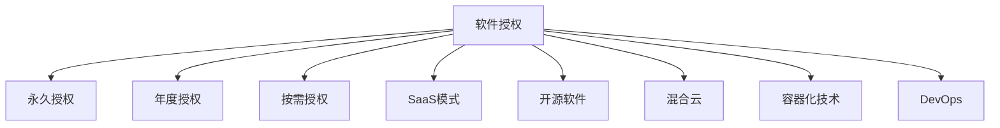

                 

# 从代码到商业：软件授权收入策略

## 1. 背景介绍

软件授权（Software Licensing）是一种传统的商业模式，广泛应用在商业软件、企业级应用、开源软件等领域。随着互联网的普及和云计算的兴起，软件授权模式也在不断地演进和创新。本文将深入探讨软件授权模式的演变，介绍常见的授权策略和应用场景，并分析其优缺点及未来趋势。

### 1.1 问题由来
软件授权模式的兴起源于软件成本高昂、开发周期长、需求不断变化等特点。传统的软件销售模式难以适应这一变化，软件授权模式应运而生。

软件授权模式通过出售软件许可证，允许用户在特定条件下使用软件。这种方式灵活性强，能够满足不同客户的需求，同时保护软件版权，降低销售风险。

随着互联网和云计算技术的发展，软件授权模式也在不断地创新和优化。例如，基于订阅的SaaS（Software as a Service）模式，通过按需使用的方式，大大提升了软件的灵活性和可扩展性。

## 2. 核心概念与联系

### 2.1 核心概念概述

为了更好地理解软件授权收入策略，我们需要了解以下几个核心概念：

- **软件授权**：指通过出售软件许可证，允许用户在特定条件下使用软件的商业模式。常见的授权方式包括永久授权、年度授权、按需授权等。

- **订阅模式**：指客户按月或按年订阅使用软件，通常采用按需付费的方式，灵活性较高。

- **SaaS模式**：指软件以服务的形式提供给用户，用户通过互联网访问和使用软件，不涉及软件的所有权。

- **开源软件**：指软件源代码公开，用户可以自由修改、分发和重新分发软件的模式。

- **混合云**：指软件既可以运行在公有云，也可以运行在私有云或混合云环境中的模式。

- **容器化技术**：指将应用程序及其依赖打包在容器中的技术，方便部署和管理。

- **DevOps**：指开发与运维的结合，通过自动化工具链和持续集成持续交付（CI/CD）等技术，提升软件交付的效率和质量。

这些概念之间的关系可以通过以下Mermaid流程图来展示：



这个流程图展示了几类软件授权模式及其子类之间的关系。

## 3. 核心算法原理 & 具体操作步骤

### 3.1 算法原理概述

软件授权模式的本质是通过出售许可证，允许用户在一定条件下使用软件。其核心算法原理主要包括以下几个方面：

- **许可证管理**：负责生成、验证和管理许可证。常见的许可证管理算法包括序列号算法、加密算法等。

- **费用计算**：根据使用情况和授权策略，计算和收取费用。常见的费用计算算法包括按使用量计费、按用户数计费等。

- **使用监控**：监控用户的使用情况，防止盗版和超授权使用。常见的监控算法包括API监控、使用量监控等。

### 3.2 算法步骤详解

一个典型的软件授权流程包括以下几个关键步骤：

1. **购买授权**：用户向软件提供商购买授权许可证，通常需要支付一定的费用。

2. **生成许可证**：软件提供商生成一个唯一的许可证，通常包含序列号、有效期、使用限制等信息。

3. **安装和配置**：用户在本地或云端安装和配置软件，通常需要输入许可证信息。

4. **使用软件**：用户根据许可证许可使用软件，享受软件带来的价值。

5. **收取费用**：软件提供商根据许可证的使用情况和授权策略，收取相应的费用。

6. **监控和审计**：软件提供商监控用户的使用情况，防止盗版和超授权使用，并定期进行审计。

### 3.3 算法优缺点

软件授权模式具有以下优点：

- **灵活性**：根据用户需求，可以选择不同的授权方式，如永久授权、年度授权、按需授权等。

- **收入稳定性**：通过预付费方式，确保软件提供商的收入相对稳定。

- **市场推广**：通过授权销售，可以有效地推广软件，提高市场占有率。

- **安全性**：通过许可证管理，确保软件版权和授权使用，防止盗版和超授权使用。

同时，软件授权模式也存在以下缺点：

- **复杂性**：许可证管理和使用监控需要复杂的算法和工具，管理成本较高。

- **技术门槛**：需要具备较强的技术能力和资源，才能实现有效的许可证管理和使用监控。

- **成本压力**：对于一些中小企业，高额的授权费用和许可证管理成本可能会造成财务压力。

### 3.4 算法应用领域

软件授权模式在多个领域得到了广泛应用，包括但不限于以下几种：

- **商业软件**：如Microsoft Office、Adobe Photoshop等。

- **企业级应用**：如Oracle数据库、SAP ERP等。

- **开源软件**：如Apache Hadoop、Linux等。

- **云服务**：如AWS、阿里云、华为云等。

- **移动应用**：如Google Play商店、Apple App Store等。

## 4. 数学模型和公式 & 详细讲解 & 举例说明

### 4.1 数学模型构建

软件授权模式通常通过以下公式来计算费用：

$$
C = \sum_{i=1}^n (p_i \times c_i)
$$

其中，$C$ 为总费用，$p_i$ 为第 $i$ 个许可证的价格，$c_i$ 为第 $i$ 个许可证的使用量。

### 4.2 公式推导过程

假设软件提供商提供了三种授权方式：永久授权、年度授权和按需授权，其价格分别为 $p_1 = 1000$ 元、$p_2 = 2000$ 元、$p_3 = 5000$ 元，每个许可证的使用量为 $c_1 = 100$ 个、$c_2 = 200$ 个、$c_3 = 300$ 个。

根据上述公式，总费用为：

$$
C = p_1 \times c_1 + p_2 \times c_2 + p_3 \times c_3 = 1000 \times 100 + 2000 \times 200 + 5000 \times 300 = 9000000
$$

### 4.3 案例分析与讲解

假设软件提供商有100个许可证，每个许可证的价格为5000元，使用量为300次。根据上述公式，总费用为：

$$
C = 100 \times 5000 \times 300 = 15000000
$$

## 5. 项目实践：代码实例和详细解释说明

### 5.1 开发环境搭建

在进行软件授权模式的实践前，我们需要准备好开发环境。以下是使用Python进行Django开发的环境配置流程：

1. 安装Anaconda：从官网下载并安装Anaconda，用于创建独立的Python环境。

2. 创建并激活虚拟环境：
```bash
conda create -n django-env python=3.8 
conda activate django-env
```

3. 安装Django：
```bash
pip install django
```

4. 安装数据库：
```bash
pip install psycopg2-binary
```

5. 安装其他工具包：
```bash
pip install pandas numpy scikit-learn matplotlib tqdm jupyter notebook ipython
```

完成上述步骤后，即可在`django-env`环境中开始软件授权模式的开发实践。

### 5.2 源代码详细实现

下面是一个简单的软件授权模式的Django应用示例，包括许可证管理、费用计算和许可证使用监控。

首先，定义许可证管理模块：

```python
from django.db import models

class License(models.Model):
    sequence = models.CharField(max_length=20, unique=True, primary_key=True)
    expiry_date = models.DateField()
    use_count = models.IntegerField(default=0)
    price = models.DecimalField(max_digits=10, decimal_places=2)
    user = models.ForeignKey('User', on_delete=models.CASCADE)

    def save(self, *args, **kwargs):
        if self.expiry_date and self.expiry_date < timezone.now().date():
            self.user.can_use = False
            self.user.save()
        super().save(*args, **kwargs)
```

然后，定义费用计算模块：

```python
from django.db.models import Sum

def total_cost(licenses):
    return licenses.aggregate(Sum('price'))
```

接着，定义许可证使用监控模块：

```python
from django.db.models import Q

def is_license_valid(license_sequence, user):
    try:
        license = License.objects.get(sequence=license_sequence, user=user)
        return license.use_count < license.price
    except License.DoesNotExist:
        return False
```

最后，定义视图函数：

```python
from django.shortcuts import render

def index(request):
    licenses = License.objects.all()
    total_cost = total_cost(licenses)
    return render(request, 'index.html', {'licenses': licenses, 'total_cost': total_cost})
```

在上述代码中，我们定义了许可证模型、费用计算函数和许可证使用监控函数，以及一个简单的视图函数。通过这些模块，可以实现在Django中管理软件许可证、计算总费用、监控许可证使用情况等操作。

### 5.3 代码解读与分析

让我们再详细解读一下关键代码的实现细节：

**License模型**：
- 定义了许可证的基本属性，包括序列号、有效期、使用次数、价格和用户。

**total_cost函数**：
- 通过Django的聚合函数Sum，计算许可证的总费用。

**is_license_valid函数**：
- 判断许可证是否有效，即使用次数是否小于价格。

**index视图函数**：
- 查询所有许可证，计算总费用，并将结果传递给模板进行渲染。

**index.html模板**：
```html
<!DOCTYPE html>
<html>
<head>
    <title>软件授权管理</title>
</head>
<body>
    <h1>软件授权管理</h1>
    <p>许可证总数：{{ licences | length }}</p>
    <p>总费用：{{ total_cost }}</p>
    
    <p>序列号：{{ license.sequence }} | 有效期：{{ license.expiry_date }} | 使用次数：{{ license.use_count }}</p>
    
</body>
</html>
```

在上述代码中，我们定义了一个简单的模板，用于显示许可证的总数、总费用和每个许可证的详细信息。

### 5.4 运行结果展示

运行上述代码，打开浏览器，访问`http://127.0.0.1:8000/`，即可查看软件授权管理页面。可以看到，页面显示了许可证的总数、总费用和每个许可证的详细信息。

## 6. 实际应用场景

### 6.1 企业级应用

软件授权模式在企业级应用中得到了广泛应用，如Oracle数据库、SAP ERP等。这些软件通常采用年度授权、永久授权等形式，通过预付费方式确保收入稳定。

### 6.2 开源软件

开源软件通常采用免费或开源授权形式，通过社区捐赠、商业许可证等方式获取收入。一些开源软件提供商，如Red Hat、Canonical等，也提供商业许可证，允许用户按需使用。

### 6.3 云服务

云服务提供商通常采用按需付费的方式，用户根据实际使用情况付费。例如，AWS、阿里云等云服务平台，允许用户按使用量、使用时间等方式付费。

## 7. 工具和资源推荐

### 7.1 学习资源推荐

为了帮助开发者系统掌握软件授权模式的理论和实践，这里推荐一些优质的学习资源：

1. **《软件授权模式》系列博文**：由软件授权专家撰写，深入浅出地介绍了软件授权模式的原理、实现和应用。

2. **Django官方文档**：Django是一个流行的Python Web框架，提供了详细的文档和示例，适合初学者和开发者使用。

3. **《软件授权：从概念到实践》书籍**：介绍了软件授权模式的理论基础和实现方法，适合软件提供商和开发者参考。

4. **Coursera软件授权课程**：Coursera提供了一系列软件授权课程，涵盖了软件授权的基本概念、实现方法和案例分析。

5. **GitHub开源项目**：GitHub上有大量开源的软件授权项目，可以供开发者学习和参考。

通过对这些资源的学习实践，相信你一定能够快速掌握软件授权模式的精髓，并用于解决实际的软件授权问题。

### 7.2 开发工具推荐

高效的开发离不开优秀的工具支持。以下是几款用于软件授权模式开发的常用工具：

1. **Django**：一个流行的Python Web框架，适合快速开发和维护Web应用。

2. **MySQL**：一个流行的关系型数据库，适合存储和管理软件授权数据。

3. **Redis**：一个流行的内存数据库，适合缓存和管理软件授权数据。

4. **Prometheus**：一个流行的监控系统，适合监控和管理软件授权系统的使用情况。

5. **Kubernetes**：一个流行的容器编排工具，适合管理软件授权系统中的容器化应用。

6. **Jenkins**：一个流行的持续集成工具，适合自动化测试和部署软件授权系统。

合理利用这些工具，可以显著提升软件授权模式的开发效率，加快创新迭代的步伐。

### 7.3 相关论文推荐

软件授权模式的发展源于学界的持续研究。以下是几篇奠基性的相关论文，推荐阅读：

1. **《软件授权模式的理论和实践》**：介绍了软件授权模式的理论基础和实现方法。

2. **《软件授权模式的发展历程和趋势》**：回顾了软件授权模式的发展历程，分析了未来的发展趋势。

3. **《软件授权模式的应用案例》**：通过实际案例，展示了软件授权模式在不同行业的应用。

4. **《软件授权模式的经济分析》**：分析了软件授权模式的经济效益和市场策略。

5. **《软件授权模式的安全性分析》**：研究了软件授权模式中的安全问题和防范措施。

这些论文代表了大软件授权模式的研究脉络。通过学习这些前沿成果，可以帮助研究者把握学科前进方向，激发更多的创新灵感。

## 8. 总结：未来发展趋势与挑战

### 8.1 总结

本文对软件授权模式的理论和实践进行了全面系统的介绍。首先阐述了软件授权模式的演变历程和应用场景，明确了其商业价值和技术原理。其次，从开发环境搭建到代码实现，详细讲解了软件授权模式的实现步骤。同时，本文还分析了软件授权模式的优缺点，并探讨了其未来的发展趋势。

通过本文的系统梳理，可以看到，软件授权模式在商业软件、企业级应用、开源软件和云服务等领域中具有重要地位。这些模式的演进和创新，将进一步推动软件行业的可持续发展。

### 8.2 未来发展趋势

展望未来，软件授权模式将呈现以下几个发展趋势：

1. **智能化**：通过引入人工智能技术，提升软件授权系统的自动化水平和用户体验。例如，自动化许可证生成、自动监控使用情况等。

2. **云化**：云服务平台提供商将继续采用按需付费的方式，进一步优化软件授权模式。例如，AWS、阿里云等平台，提供了丰富的API接口和监控工具，方便用户管理和使用软件。

3. **开源化**：开源软件将继续采用免费或开源授权形式，通过社区捐赠、商业许可证等方式获取收入。一些开源软件提供商，如Red Hat、Canonical等，也提供商业许可证，允许用户按需使用。

4. **混合云**：软件授权模式将逐步向混合云方向发展，用户可以在公有云、私有云和混合云环境中使用软件，获得更灵活的使用方式。

5. **区块链技术**：通过区块链技术，提升软件授权系统的安全性和透明性。例如，使用区块链技术进行许可证管理和费用结算。

6. **边缘计算**：通过边缘计算技术，提升软件授权系统的响应速度和可靠性。例如，在靠近用户的边缘节点上进行许可证管理和费用结算。

以上趋势凸显了软件授权模式的广阔前景。这些方向的探索发展，将进一步提升软件授权系统的性能和应用范围，为软件提供商和用户带来更多价值。

### 8.3 面临的挑战

尽管软件授权模式已经取得了瞩目成就，但在迈向更加智能化、普适化应用的过程中，它仍面临着诸多挑战：

1. **复杂性**：软件授权系统需要处理许可证管理、费用计算、使用监控等多个方面，系统复杂性较高，管理成本较大。

2. **安全性**：软件授权系统需要具备高安全性和稳定性，防止许可证盗版和超授权使用，避免系统崩溃和数据泄露。

3. **技术门槛**：需要具备较强的技术能力和资源，才能实现有效的许可证管理和使用监控。

4. **用户体验**：需要提升用户的使用体验，方便用户安装、配置和使用软件授权系统。

5. **法规合规**：需要符合相关的法律法规和行业标准，避免法律风险。

6. **市场竞争**：需要面对其他软件提供商和云服务提供商的竞争，提升市场竞争力。

正视软件授权模式面临的这些挑战，积极应对并寻求突破，将是大软件授权模式走向成熟的必由之路。相信随着学界和产业界的共同努力，这些挑战终将一一被克服，软件授权模式必将在构建人机协同的智能时代中扮演越来越重要的角色。

### 8.4 未来突破

面对软件授权模式所面临的种种挑战，未来的研究需要在以下几个方面寻求新的突破：

1. **引入人工智能技术**：通过引入人工智能技术，提升软件授权系统的自动化水平和用户体验。例如，自动化许可证生成、自动监控使用情况等。

2. **优化云化技术**：云服务平台提供商将继续采用按需付费的方式，进一步优化软件授权模式。例如，AWS、阿里云等平台，提供了丰富的API接口和监控工具，方便用户管理和使用软件。

3. **探索区块链技术**：通过区块链技术，提升软件授权系统的安全性和透明性。例如，使用区块链技术进行许可证管理和费用结算。

4. **推广混合云模式**：软件授权模式将逐步向混合云方向发展，用户可以在公有云、私有云和混合云环境中使用软件，获得更灵活的使用方式。

5. **引入边缘计算技术**：通过边缘计算技术，提升软件授权系统的响应速度和可靠性。例如，在靠近用户的边缘节点上进行许可证管理和费用结算。

6. **提升用户体验**：通过简化安装、配置和使用流程，提升用户的使用体验，方便用户安装、配置和使用软件授权系统。

7. **加强法规合规**：需要符合相关的法律法规和行业标准，避免法律风险。

这些研究方向的探索，必将引领软件授权模式技术迈向更高的台阶，为软件提供商和用户带来更多价值。面向未来，软件授权模式还需要与其他人工智能技术进行更深入的融合，如知识表示、因果推理、强化学习等，多路径协同发力，共同推动软件授权模式的进步。

## 9. 附录：常见问题与解答

**Q1：软件授权模式如何适用于开源软件？**

A: 开源软件通常采用免费或开源授权形式，通过社区捐赠、商业许可证等方式获取收入。一些开源软件提供商，如Red Hat、Canonical等，也提供商业许可证，允许用户按需使用。

**Q2：软件授权模式是否适用于混合云环境？**

A: 软件授权模式可以适用于混合云环境。用户可以在公有云、私有云和混合云环境中使用软件，获得更灵活的使用方式。例如，AWS、阿里云等云服务平台，提供了丰富的API接口和监控工具，方便用户管理和使用软件。

**Q3：软件授权模式如何避免盗版和超授权使用？**

A: 软件授权模式可以通过以下方式避免盗版和超授权使用：

1. 使用许可证管理，生成唯一的序列号，记录使用次数和有效期。

2. 通过API监控使用情况，防止超授权使用。

3. 定期进行审计，发现盗版和超授权使用后及时处理。

**Q4：软件授权模式如何提升用户体验？**

A: 软件授权模式可以通过以下方式提升用户体验：

1. 简化安装、配置和使用流程，方便用户安装、配置和使用软件授权系统。

2. 提供友好的用户界面和操作指引，提升用户的使用体验。

3. 及时响应用户反馈，不断优化软件授权系统。

**Q5：软件授权模式是否适用于混合云环境？**

A: 软件授权模式可以适用于混合云环境。用户可以在公有云、私有云和混合云环境中使用软件，获得更灵活的使用方式。例如，AWS、阿里云等云服务平台，提供了丰富的API接口和监控工具，方便用户管理和使用软件。

以上问题与解答，希望能为软件授权模式的实践者和研究者提供一些有价值的参考。

---

作者：禅与计算机程序设计艺术 / Zen and the Art of Computer Programming

