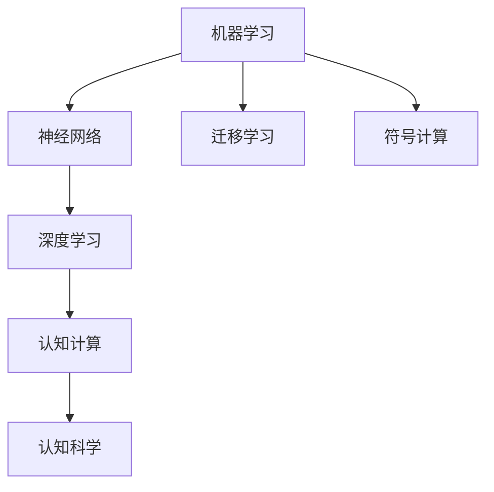

                 

## 1. 背景介绍

### 1.1 问题由来
在人工智能领域，"从简单到深刻的认知历程"是一条连接基础理论研究与应用实践的桥梁。通过深入理解机器学习与认知科学的交叉融合，可以更好地把握人工智能技术的本质与发展趋势。本文将围绕这一主题，系统介绍从基础数学到应用实践的全过程，为读者揭示人工智能背后的认知科学原理。

### 1.2 问题核心关键点
人工智能的核心问题可以归纳为以下几个关键点：
- 机器学习与认知科学的结合：如何将机器学习算法与认知科学的理论框架相结合，以解释和优化人工智能系统的行为。
- 神经网络与生物神经网络的类比：如何从神经网络的结构和功能上，类比和借鉴生物神经网络的研究成果。
- 模型训练与认知心理的类比：模型训练的过程是否可以类比为人的学习过程，以及如何优化这一过程以提升模型性能。
- 认知计算与符号计算的融合：如何结合认知计算和符号计算的方法，构建更高效、更人性化的智能系统。

这些关键点构成了从简单到深刻认知历程的主线，引导我们深入探索人工智能技术的发展脉络。

## 2. 核心概念与联系

### 2.1 核心概念概述

要深入理解从简单到深刻的认知历程，首先需要了解以下几个核心概念：

- **机器学习(Machine Learning, ML)**：一种数据驱动的自动化学习技术，通过算法和统计模型使计算机系统能够从数据中学习并作出预测或决策。
- **神经网络(Neural Network, NN)**：受生物神经网络启发，通过多层节点模拟人脑的神经元结构，用于数据处理与模式识别。
- **认知科学(Cognitive Science)**：研究人类心智的科学，包括感知、记忆、思维、语言等，旨在揭示人类认知过程的机制。
- **深度学习(Deep Learning, DL)**：一种基于神经网络的机器学习技术，通过多层次的特征抽象，能够处理和理解复杂的非线性数据。
- **迁移学习(Transfer Learning)**：将在一个任务上学习到的知识，迁移到另一个相关但不同的任务上，提高模型泛化能力。
- **认知计算(Cognitive Computing)**：模拟人脑认知过程，结合人工智能和认知科学的理论，提升系统的认知能力。
- **符号计算(Symbolic Computing)**：使用逻辑符号进行数学运算和推理，用于解决精确性和可解释性要求高的计算问题。

这些概念之间的联系可以通过以下Mermaid流程图来展示：



这个流程图展示了几组核心概念之间的逻辑关系：

1. 机器学习是神经网络和深度学习的基础。
2. 神经网络是深度学习的核心组件。
3. 深度学习与认知计算结合，可提升系统的认知能力。
4. 迁移学习和符号计算分别从知识迁移和逻辑推理的角度，辅助提升模型的泛化能力和精确性。
5. 认知科学为以上技术提供理论基础，指导算法的设计和优化。

这些概念共同构成了人工智能技术的基础框架，是我们从简单到深刻认知历程的重要组成部分。

## 3. 核心算法原理 & 具体操作步骤
### 3.1 算法原理概述

从简单到深刻的认知历程，涉及多个算法原理，其中最重要的是深度学习算法。深度学习通过多层神经网络，实现特征的层次提取和复杂模式的识别，逐步提升模型的认知能力。

### 3.2 算法步骤详解

以卷积神经网络(CNN)为例，其基本步骤如下：

1. **数据预处理**：将原始数据进行归一化、缩放等处理，以便于神经网络学习。
2. **卷积层(Convolutional Layer)**：通过卷积操作提取局部特征，多层卷积层可以提取更抽象的特征。
3. **激活函数(Activation Function)**：在卷积层后添加激活函数，如ReLU，引入非线性变换，增强特征表达能力。
4. **池化层(Pooling Layer)**：通过降采样操作，减少特征维度和计算量，增强模型泛化能力。
5. **全连接层(Fully Connected Layer)**：将池化层的特征输入到全连接层，进行分类或回归预测。
6. **优化算法(Optimization Algorithm)**：通过反向传播算法计算梯度，使用优化算法如SGD、Adam等更新模型参数。

### 3.3 算法优缺点

深度学习算法具有以下优点：
- 强大的特征提取能力：通过多层卷积和全连接层，能够自动学习数据中的复杂特征。
- 泛化能力：经过大量数据训练，深度学习模型能够适应新数据，减少过拟合风险。
- 硬件支持：现代GPU和TPU设备可以高效地训练深度神经网络。

同时，深度学习算法也存在一些缺点：
- 训练时间长：深度模型参数量巨大，训练时间较长。
- 计算资源需求高：需要大量GPU内存和高速计算能力。
- 可解释性差：深度模型往往是"黑盒"系统，难以解释其内部决策逻辑。

### 3.4 算法应用领域

深度学习算法在多个领域得到了广泛应用，包括：

- 计算机视觉：图像分类、目标检测、人脸识别等。
- 自然语言处理：语言翻译、文本生成、情感分析等。
- 语音识别：语音转文本、语音合成、语音情感识别等。
- 医疗健康：医学影像分析、病理诊断、个性化治疗等。
- 自动驾驶：场景感知、路径规划、行为决策等。

## 4. 数学模型和公式 & 详细讲解

### 4.1 数学模型构建

深度学习的数学模型通常基于多层神经网络，可以通过以下公式描述：

$$
h^{[l]} = \phi(W^{[l]} h^{[l-1]} + b^{[l]})
$$

其中 $h^{[l]}$ 表示第 $l$ 层的输出，$\phi$ 表示激活函数，$W^{[l]}$ 和 $b^{[l]}$ 分别表示第 $l$ 层的权重和偏置。

### 4.2 公式推导过程

以多层感知器(Multilayer Perceptron, MLP)为例，其训练过程如下：

1. **前向传播**：通过多层神经网络计算输出。
2. **损失函数**：计算模型预测与真实标签之间的误差，如均方误差、交叉熵等。
3. **反向传播**：根据梯度下降算法计算权重和偏置的更新量。
4. **参数更新**：使用优化算法更新模型参数，迭代优化模型性能。

### 4.3 案例分析与讲解

以图像分类任务为例，通过多层卷积神经网络(CNN)实现：

1. **卷积层**：使用卷积核提取图像特征。
2. **池化层**：通过最大池化操作减少特征维度。
3. **全连接层**：将池化层输出连接到全连接层进行分类预测。
4. **softmax函数**：计算每个类别的概率分布，进行分类预测。

## 5. 项目实践：代码实例和详细解释说明
### 5.1 开发环境搭建

以下是使用Python和TensorFlow搭建深度学习项目的基本环境配置：

1. 安装Anaconda：从官网下载并安装Anaconda，用于创建独立的Python环境。
2. 创建并激活虚拟环境：
```bash
conda create -n tf-env python=3.8 
conda activate tf-env
```

3. 安装TensorFlow：根据CUDA版本，从官网获取对应的安装命令。例如：
```bash
pip install tensorflow
```

4. 安装必要的工具包：
```bash
pip install numpy pandas matplotlib scikit-learn tensorflow-gpu
```

完成上述步骤后，即可在`tf-env`环境中开始深度学习项目开发。

### 5.2 源代码详细实现

以下是一个简单的卷积神经网络(CNN)代码实现：

```python
import tensorflow as tf
from tensorflow.keras import layers, models

# 定义CNN模型
model = models.Sequential()
model.add(layers.Conv2D(32, (3, 3), activation='relu', input_shape=(28, 28, 1)))
model.add(layers.MaxPooling2D((2, 2)))
model.add(layers.Conv2D(64, (3, 3), activation='relu'))
model.add(layers.MaxPooling2D((2, 2)))
model.add(layers.Conv2D(64, (3, 3), activation='relu'))
model.add(layers.Flatten())
model.add(layers.Dense(64, activation='relu'))
model.add(layers.Dense(10, activation='softmax'))

# 编译模型
model.compile(optimizer='adam',
              loss=tf.keras.losses.SparseCategoricalCrossentropy(from_logits=True),
              metrics=['accuracy'])

# 训练模型
model.fit(train_images, train_labels, epochs=5, validation_data=(test_images, test_labels))
```

### 5.3 代码解读与分析

让我们再详细解读一下关键代码的实现细节：

**Sequential模型**：
- 通过`Sequential`函数定义模型，逐步添加网络层。

**卷积层**：
- `layers.Conv2D`函数定义卷积层，参数包括卷积核大小、数量和激活函数等。

**池化层**：
- `layers.MaxPooling2D`函数定义池化层，通过最大池化操作减少特征维度。

**全连接层**：
- `layers.Dense`函数定义全连接层，用于分类或回归预测。

**softmax函数**：
- `layers.Softmax`函数用于计算每个类别的概率分布。

**编译模型**：
- `model.compile`函数编译模型，设置优化器、损失函数和评估指标。

**训练模型**：
- `model.fit`函数训练模型，设置训练数据、轮数和验证数据。

以上是使用TensorFlow搭建CNN模型的完整代码实现。可以看到，TensorFlow提供了强大的高层API，使得深度学习模型的构建和训练变得简洁高效。

## 6. 实际应用场景

### 6.1 计算机视觉

深度学习在计算机视觉领域的应用非常广泛，如图像分类、目标检测、人脸识别等。以下是一个图像分类的代码示例：

```python
import tensorflow as tf
from tensorflow.keras import layers, models
from tensorflow.keras.preprocessing.image import ImageDataGenerator

# 数据预处理
train_datagen = ImageDataGenerator(rescale=1./255, shear_range=0.2, zoom_range=0.2, horizontal_flip=True)
test_datagen = ImageDataGenerator(rescale=1./255)

train_generator = train_datagen.flow_from_directory(
        'train/',
        target_size=(224, 224),
        batch_size=32,
        class_mode='categorical')

test_generator = test_datagen.flow_from_directory(
        'test/',
        target_size=(224, 224),
        batch_size=32,
        class_mode='categorical')

# 定义CNN模型
model = models.Sequential()
model.add(layers.Conv2D(32, (3, 3), activation='relu', input_shape=(224, 224, 3)))
model.add(layers.MaxPooling2D((2, 2)))
model.add(layers.Conv2D(64, (3, 3), activation='relu'))
model.add(layers.MaxPooling2D((2, 2)))
model.add(layers.Conv2D(64, (3, 3), activation='relu'))
model.add(layers.Flatten())
model.add(layers.Dense(64, activation='relu'))
model.add(layers.Dense(10, activation='softmax'))

# 编译模型
model.compile(optimizer='adam',
              loss=tf.keras.losses.CategoricalCrossentropy(from_logits=True),
              metrics=['accuracy'])

# 训练模型
model.fit_generator(
        train_generator,
        steps_per_epoch=2000,
        epochs=5,
        validation_data=test_generator,
        validation_steps=800)
```

### 6.2 自然语言处理

深度学习在自然语言处理领域的应用同样非常广泛，如语言翻译、文本生成、情感分析等。以下是一个情感分析的代码示例：

```python
import tensorflow as tf
from tensorflow.keras import layers, models

# 加载数据
train_data = open('train.txt', 'r', encoding='utf-8').readlines()
test_data = open('test.txt', 'r', encoding='utf-8').readlines()

# 定义输入和标签
input_data = [tf.keras.preprocessing.text.text_to_word_sequence(sentence) for sentence in train_data]
label_data = [1 if sentiment == 'positive' else 0 for sentiment in train_data]

# 构建模型
model = models.Sequential()
model.add(layers.Embedding(input_dim=10000, output_dim=16, input_length=100))
model.add(layers.Conv1D(32, 5, activation='relu'))
model.add(layers.MaxPooling1D(5))
model.add(layers.Conv1D(32, 5, activation='relu'))
model.add(layers.MaxPooling1D(5))
model.add(layers.Conv1D(32, 5, activation='relu'))
model.add(layers.MaxPooling1D(5))
model.add(layers.Flatten())
model.add(layers.Dense(64, activation='relu'))
model.add(layers.Dense(1, activation='sigmoid'))

# 编译模型
model.compile(optimizer='adam', loss='binary_crossentropy', metrics=['accuracy'])

# 训练模型
model.fit(input_data, label_data, epochs=5, validation_split=0.2)
```

### 6.3 语音识别

深度学习在语音识别领域的应用包括语音转文本、语音合成、语音情感识别等。以下是一个语音转文本的代码示例：

```python
import tensorflow as tf
from tensorflow.keras import layers, models

# 加载数据
train_data = open('train.wav', 'rb').read()
test_data = open('test.wav', 'rb').read()

# 定义特征提取器
spectrogram = tf.signal.stft(train_data, frame_length=1024, frame_step=256)
magnitude = tf.abs(spectrogram)

# 构建模型
model = models.Sequential()
model.add(layers.Conv2D(32, (3, 3), activation='relu', input_shape=(1024, 256, 1)))
model.add(layers.MaxPooling2D((2, 2)))
model.add(layers.Conv2D(64, (3, 3), activation='relu'))
model.add(layers.MaxPooling2D((2, 2)))
model.add(layers.Conv2D(64, (3, 3), activation='relu'))
model.add(layers.Flatten())
model.add(layers.Dense(64, activation='relu'))
model.add(layers.Dense(1, activation='sigmoid'))

# 编译模型
model.compile(optimizer='adam', loss='binary_crossentropy', metrics=['accuracy'])

# 训练模型
model.fit(magnitude, train_labels, epochs=5, validation_data=(magnitude, test_labels))
```

### 6.4 未来应用展望

深度学习在多个领域的应用前景广阔，未来将进一步拓展到更多场景中：

- **医疗健康**：通过深度学习模型进行医学影像分析、病理诊断、个性化治疗等，提升医疗服务水平。
- **自动驾驶**：使用深度学习模型进行场景感知、路径规划、行为决策等，实现自主驾驶。
- **金融科技**：利用深度学习模型进行风险评估、信用评分、交易预测等，提升金融服务质量。
- **教育培训**：通过深度学习模型进行个性化推荐、智能评估、学习分析等，提升教育质量。
- **智能家居**：使用深度学习模型进行语音识别、场景感知、自动化控制等，实现智能家居系统。

## 7. 工具和资源推荐

### 7.1 学习资源推荐

为了帮助开发者系统掌握深度学习技术，这里推荐一些优质的学习资源：

1. **《深度学习》课程**：由斯坦福大学Andrew Ng教授开设，系统讲解深度学习的基本概念和算法。
2. **TensorFlow官方文档**：提供了完整的深度学习框架使用手册，包含大量实践案例。
3. **PyTorch官方文档**：提供了PyTorch框架的使用指南和API参考，是深度学习的主流工具之一。
4. **Kaggle数据集**：提供了大量的深度学习竞赛数据集，有助于实践和竞赛。
5. **GitHub深度学习项目**：GitHub上有很多开源的深度学习项目，可以学习其他人的实现，提高编程能力。

### 7.2 开发工具推荐

深度学习开发离不开高效的开发工具，以下是几款常用的开发工具：

1. **Jupyter Notebook**：用于编写和运行Python代码，支持各种深度学习库，提供了可视化的界面。
2. **TensorFlow**：由Google开发的深度学习框架，提供了丰富的工具和库，支持大规模分布式训练。
3. **PyTorch**：由Facebook开发的深度学习框架，灵活易用，支持动态计算图。
4. **Keras**：基于TensorFlow和Theano的高级API，简化了深度学习模型的构建过程。
5. **MXNet**：由Apache开发的深度学习框架，支持多种编程语言和硬件平台。

### 7.3 相关论文推荐

深度学习的发展离不开前沿研究的支持，以下是几篇具有里程碑意义的深度学习论文：

1. **《ImageNet Classification with Deep Convolutional Neural Networks》**：AlexNet首次在ImageNet大规模数据集上取得优异表现，奠定了深度学习在计算机视觉领域的基础。
2. **《Playing Atari with Deep Reinforcement Learning》**：DeepMind使用深度Q网络(DQN)在Atari游戏中取得优异成绩，展示了深度学习在强化学习领域的应用潜力。
3. **《Natural Language Processing with Transformers》**：Transformer网络的提出，使深度学习在自然语言处理领域取得了革命性进展。
4. **《Generative Adversarial Nets》**：生成对抗网络(GAN)的提出，推动了深度学习在图像生成、视频生成等领域的发展。
5. **《Adversarial Examples in Deep Learning》**：研究了深度学习模型的鲁棒性问题，指出深度学习模型容易受到对抗样本的攻击。

这些论文代表了大深度学习领域的研究进展，是深度学习研究的重要参考资料。

## 8. 总结：未来发展趋势与挑战

### 8.1 总结

本文系统介绍了深度学习算法，从简单到深刻的认知历程，揭示了人工智能技术的发展脉络。从基础数学模型到实际应用场景，详细讲解了深度学习的核心概念和实现步骤，并通过代码实例展示了深度学习模型的构建和训练过程。此外，本文还展望了深度学习技术的未来发展趋势和面临的挑战，提出了一系列研究方向。

通过本文的系统梳理，我们可以看到，深度学习算法在多个领域得到了广泛应用，未来还有广阔的发展空间。未来，深度学习技术将与更多学科领域融合，推动人工智能技术的不断进步。

### 8.2 未来发展趋势

未来，深度学习技术将呈现以下几个发展趋势：

1. **跨领域融合**：深度学习将与更多学科领域融合，如心理学、社会学等，推动跨学科研究的发展。
2. **自监督学习**：通过无监督或半监督学习，在缺乏标注数据的情况下，实现更好的模型训练。
3. **迁移学习**：通过迁移学习，在不同领域和任务之间实现知识共享和优化。
4. **强化学习**：结合强化学习，实现更加智能的决策和行为控制。
5. **跨模态学习**：通过跨模态学习，实现多模态数据的联合表示和分析。
6. **量子计算**：利用量子计算加速深度学习模型的训练和推理，提升计算效率。

### 8.3 面临的挑战

尽管深度学习技术取得了巨大成功，但在迈向更加智能化、普适化应用的过程中，仍然面临以下挑战：

1. **计算资源需求高**：深度学习模型参数量巨大，需要大量计算资源。
2. **数据依赖性强**：深度学习模型需要大量标注数据进行训练，数据获取成本高。
3. **模型可解释性差**：深度学习模型往往是"黑盒"系统，难以解释其内部决策逻辑。
4. **泛化能力有限**：深度学习模型容易过拟合，泛化能力有限。
5. **对抗样本攻击**：深度学习模型容易受到对抗样本的攻击，鲁棒性不足。
6. **伦理和隐私问题**：深度学习模型的应用可能涉及个人隐私和伦理问题，需要规范和监管。

### 8.4 研究展望

未来，深度学习技术需要从以下几个方面进行研究：

1. **优化算法**：研究更加高效的优化算法，提高模型训练效率。
2. **模型压缩**：研究模型压缩和剪枝技术，减小模型尺寸，提升计算效率。
3. **可解释性**：研究模型可解释性技术，提高模型的透明度和可解释性。
4. **鲁棒性**：研究模型鲁棒性技术，增强模型的泛化能力和对抗样本攻击能力。
5. **跨领域应用**：研究跨领域应用的技术，推动深度学习在更多领域的应用。
6. **伦理和隐私**：研究伦理和隐私保护技术，确保深度学习模型的应用符合人类价值观和伦理道德。

## 9. 附录：常见问题与解答

**Q1：深度学习是否适用于所有应用场景？**

A: 深度学习适用于数据量大、特征复杂的应用场景，如计算机视觉、自然语言处理等。但对于一些需要高度精确性和符号推理的任务，如编程、推理等，符号计算仍然是不可替代的。

**Q2：深度学习模型的可解释性如何提高？**

A: 深度学习模型的可解释性可以通过以下方式提高：
1. 简化模型结构，减小模型规模。
2. 使用可视化工具，如TensorBoard，展示模型的中间特征和梯度。
3. 使用可解释性技术，如LIME、SHAP等，解释模型的决策过程。
4. 结合符号计算，引入先验知识，增强模型的解释能力。

**Q3：如何避免深度学习模型的过拟合？**

A: 避免深度学习模型的过拟合，可以采取以下措施：
1. 数据增强：通过数据扩充、数据增强等方式，增加数据的多样性。
2. 正则化：使用L2正则、Dropout等正则化技术，避免过拟合。
3. 早停机制：在验证集上监测模型性能，及时停止训练。
4. 批归一化：使用批归一化技术，减少内部协变量偏移。

**Q4：深度学习模型的推理速度如何优化？**

A: 优化深度学习模型的推理速度，可以采取以下措施：
1. 模型剪枝：去除冗余参数，减小模型尺寸。
2. 量化加速：将浮点模型转为定点模型，减少内存占用。
3. 模型并行：使用多GPU或多TPU进行并行计算。
4. 硬件加速：利用FPGA、ASIC等专用硬件加速推理过程。

**Q5：如何应对深度学习模型的对抗样本攻击？**

A: 应对深度学习模型的对抗样本攻击，可以采取以下措施：
1. 对抗训练：在训练过程中引入对抗样本，增强模型的鲁棒性。
2. 鲁棒优化：使用鲁棒优化算法，如GDP、MAD等，增强模型的鲁棒性。
3. 对抗样本检测：使用对抗样本检测技术，检测输入数据是否为对抗样本。

以上是深度学习应用中常见问题的解答，希望能对您的深度学习实践有所帮助。

---

作者：禅与计算机程序设计艺术 / Zen and the Art of Computer Programming

