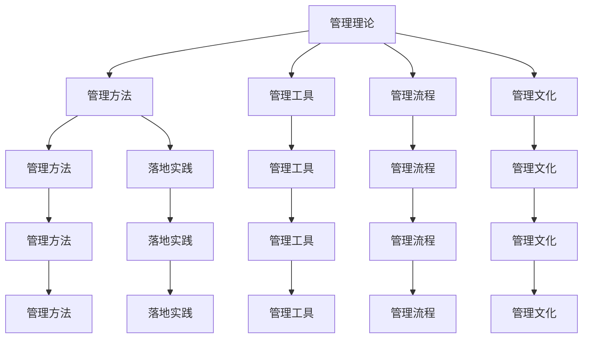

                 

# 从经典到实践：管理理论的落地

> 关键词：管理理论, 经典方法, 落地实践, 应用场景, 高效工具, 未来展望

## 1. 背景介绍

### 1.1 问题由来
在现代企业管理实践中，常常面临着诸如复杂决策、资源配置、团队协作、绩效管理等一系列挑战。为了应对这些挑战，管理学者提出了各种理论和方法，如战略管理、绩效管理、组织行为等。然而，这些理论和方法往往难以直接应用于具体实践，需在落地过程中加以调整和优化。

### 1.2 问题核心关键点
本文将重点探讨如何基于经典管理理论，设计一套系统、科学的管理方法，并在实际工作中进行落地实践。主要关注以下几个关键点：
- 如何将经典管理理论转化为可操作的管理方法。
- 如何通过工具和资源提升管理效率。
- 如何在复杂应用场景中实现管理方法的优化和改进。
- 未来的管理趋势及面临的挑战。

### 1.3 问题研究意义
管理理论的落地实践，有助于企业在日常运营中更好地应用先进的管理理念和技术，提升运营效率和竞争力。具体而言：
- 提升决策质量。通过科学的管理方法，减少决策过程中的主观性和随意性。
- 优化资源配置。通过系统化的管理工具，提高资源利用效率。
- 增强团队协作。通过有效的沟通和协调，促进团队共同目标的实现。
- 促进持续发展。通过持续改进的管理实践，使企业在动态环境中保持竞争力。

## 2. 核心概念与联系

### 2.1 核心概念概述

为更好地理解管理理论的落地实践，本节将介绍几个密切相关的核心概念：

- **管理理论**：如战略管理、组织行为、绩效管理等，为企业管理提供理论支撑。
- **管理方法**：如OKR、KPI、SCRUM等，是管理理论在实际中的具体应用形式。
- **管理工具**：如ERP、CRM、BI等，是帮助企业高效执行管理方法的数字化工具。
- **管理流程**：如战略规划、运营管理、人力资源管理等，是企业日常运营中的关键活动。
- **管理文化**：如企业文化、员工激励、领导力培养等，是管理方法得以落地执行的重要环境因素。

这些核心概念之间的逻辑关系可以通过以下Mermaid流程图来展示：



这个流程图展示了一整套管理理论、方法、工具、流程和文化之间的逻辑关系，共同构成了企业管理系统的核心框架。

## 3. 核心算法原理 & 具体操作步骤
### 3.1 算法原理概述

管理理论的落地实践，本质上是将理论转化为具体的方法和工具，并在实际管理活动中加以应用的过程。其核心思想是：

- **理论指导实践**：通过分析经典管理理论，提炼出核心原则和方法，转化为可操作的管理工具和流程。
- **工具赋能管理**：借助先进的数字化工具，提升管理方法的操作效率和精度。
- **流程优化执行**：通过系统化的管理流程，确保各项管理活动有序进行，提升整体运营效率。

具体而言，将经典管理理论通过以下步骤转化为实际管理方法：

1. **理论分析**：基于经典管理理论，识别出核心概念、原则和方法。
2. **方法设计**：根据理论分析结果，设计出具体的管理工具和流程。
3. **工具应用**：选择合适的管理工具，并进行配置和优化，使其能高效支持管理活动。
4. **流程执行**：通过实施管理流程，执行各项管理活动，并进行持续改进。

### 3.2 算法步骤详解

以下是管理理论落地实践的详细步骤：

**Step 1: 理论分析与方法设计**

1. **选择管理理论**：根据企业实际需求，选择适合的管理理论，如战略管理、绩效管理等。
2. **理论分析**：详细分析该理论的核心概念、原则和方法，形成理论框架。
3. **方法设计**：将理论框架转化为具体的管理方法，如OKR、KPI等。
4. **工具适配**：选择适用的管理工具，如ERP、CRM等，进行适配和定制。

**Step 2: 工具应用与流程优化**

1. **工具配置**：对管理工具进行配置，确保其能满足企业管理需求。
2. **流程制定**：根据管理方法，制定详细的操作流程，明确各项管理活动的步骤和责任。
3. **测试执行**：在小规模范围内进行试点，测试管理方法的可行性和效果。
4. **持续改进**：根据试点结果，对管理方法进行优化和改进，确保其落地效果。

**Step 3: 全面推广与效果评估**

1. **全面推广**：在企业范围内全面推广管理方法，确保各层级员工都能理解和应用。
2. **效果评估**：定期对管理效果进行评估，对比实施前后各项指标的变化，如绩效提升、流程效率等。
3. **反馈优化**：根据评估结果，收集员工的反馈意见，进一步优化管理方法。
4. **持续改进**：结合企业发展情况，持续改进和提升管理方法，确保其长期有效性。

### 3.3 算法优缺点

基于经典管理理论的落地实践方法，具有以下优点：
1. 系统性：通过理论指导实践，确保管理方法的系统性和科学性。
2. 可操作性：将复杂的管理理论转化为具体的方法和工具，方便操作执行。
3. 高效性：借助先进的数字化工具，提高管理效率和精度。
4. 持续改进：通过持续评估和改进，确保管理方法适应企业发展需求。

同时，该方法也存在一些局限性：
1. 理论更新滞后：经典管理理论可能与现代企业环境不符，需要不断更新理论基础。
2. 适用性问题：不同企业有不同的特点，统一的管理方法可能难以完全适配。
3. 工具依赖性：管理工具的选择和适配需要时间和资源投入，存在一定的技术门槛。
4. 文化影响：企业管理文化的差异，可能影响管理方法的落地效果。

尽管存在这些局限性，基于经典管理理论的落地实践方法仍然是目前最为广泛应用和有效的管理方法之一。

### 3.4 算法应用领域

经典管理理论的落地实践方法，广泛应用于各种企业管理领域，如：

- **人力资源管理**：通过绩效管理、员工激励等方法，提升员工绩效和满意度。
- **战略管理**：通过SWOT分析、战略规划等方法，制定企业发展方向和目标。
- **运营管理**：通过精益管理、供应链管理等方法，提高生产效率和运营质量。
- **财务管理**：通过预算管理、成本控制等方法，优化资源配置和财务状况。
- **质量管理**：通过六西格玛、PDCA等方法，提升产品质量和服务水平。

除了上述这些经典领域外，该方法也在创新型企业、高技术产业、中小型企业等多个领域得到广泛应用，为企业提供了科学的决策依据和管理工具。

## 4. 数学模型和公式 & 详细讲解  
### 4.1 数学模型构建

本节将使用数学语言对管理理论的落地实践方法进行更加严格的刻画。

记管理理论为 $T$，方法为 $M$，工具为 $W$，流程为 $P$，文化为 $C$。假设企业在 $T$ 的理论指导下，设计出 $M$ 的管理方法，并使用 $W$ 的工具和 $P$ 的流程，最终形成 $C$ 的管理文化。

定义企业管理效果为 $E$，根据经典管理理论，企业管理效果可以表示为：

$$
E = f(T, M, W, P, C)
$$

其中 $f$ 表示函数关系， $T$、$M$、$W$、$P$、$C$ 为输入参数， $E$ 为输出结果。

具体而言，管理效果 $E$ 可以分解为：

$$
E = E_1 + E_2 + E_3 + E_4 + E_5
$$

其中 $E_1$ 为战略管理效果，$E_2$ 为绩效管理效果，$E_3$ 为运营管理效果，$E_4$ 为财务管理效果，$E_5$ 为质量管理效果。

每个效果又可以根据具体管理活动进一步细化，如：

- $E_1 = w_1 \times \text{战略规划效果} + w_2 \times \text{SWOT分析效果} + ...$
- $E_2 = w_3 \times \text{绩效评估效果} + w_4 \times \text{员工激励效果} + ...$
- $E_3 = w_5 \times \text{精益管理效果} + w_6 \times \text{供应链管理效果} + ...$

### 4.2 公式推导过程

以下我们以绩效管理为例，推导管理效果的计算公式。

假设企业在绩效管理方法 $M$ 的指导下，通过 $W$ 工具和 $P$ 流程，最终形成管理文化 $C$。管理效果 $E_2$ 可表示为：

$$
E_2 = f_M(W, P, C)
$$

其中 $f_M$ 为绩效管理函数，$W$、$P$、$C$ 为输入参数，$E_2$ 为输出结果。

进一步细化 $E_2$ 为：

$$
E_2 = E_{2.1} + E_{2.2} + E_{2.3} + ... 
$$

其中 $E_{2.1}$ 为绩效评估效果，$E_{2.2}$ 为绩效反馈效果，$E_{2.3}$ 为绩效改进效果。

具体推导过程如下：

1. 设定绩效评估效果 $E_{2.1}$：

$$
E_{2.1} = f_{2.1}(W, P, C)
$$

其中 $f_{2.1}$ 为绩效评估函数，$W$、$P$、$C$ 为输入参数，$E_{2.1}$ 为输出结果。

2. 设定绩效反馈效果 $E_{2.2}$：

$$
E_{2.2} = f_{2.2}(W, P, C)
$$

其中 $f_{2.2}$ 为绩效反馈函数，$W$、$P$、$C$ 为输入参数，$E_{2.2}$ 为输出结果。

3. 设定绩效改进效果 $E_{2.3}$：

$$
E_{2.3} = f_{2.3}(W, P, C)
$$

其中 $f_{2.3}$ 为绩效改进函数，$W$、$P$、$C$ 为输入参数，$E_{2.3}$ 为输出结果。

综合上述函数关系，得到：

$$
E_2 = E_{2.1} + E_{2.2} + E_{2.3} + ...
$$

### 4.3 案例分析与讲解

以下以某制造企业的绩效管理实践为例，详细讲解基于经典管理理论的落地方法：

**案例背景**：某制造企业规模较大，员工人数超过5000人，生产工序复杂，管理难度较大。为了提升整体绩效和运营效率，企业决定引入绩效管理方法，并采用数字化工具进行支持。

**理论分析**：根据战略管理的SWOT分析方法，企业决定采取聚焦市场优势、改善资源不足的策略。同时，结合组织行为学中的激励理论，设计了基于绩效评估和反馈的员工激励方案。

**方法设计**：设计了一套包含绩效评估、绩效反馈和绩效改进三个环节的绩效管理系统。具体步骤如下：
1. **绩效评估**：通过数字化工具ERP，对员工和部门的工作表现进行量化评估，生成绩效报告。
2. **绩效反馈**：管理者根据绩效报告，对员工进行一对一面谈，提供反馈意见和改进建议。
3. **绩效改进**：员工根据反馈意见，制定个人改进计划，并定期汇报进展。

**工具适配**：选择ERP工具，根据企业实际需求进行了定制，集成了绩效管理功能，并与公司内部的其他系统进行了整合。

**流程执行**：在企业范围内推广绩效管理系统，制定详细的操作流程，并进行试点测试。试点完成后，全面推广并持续优化。

**效果评估**：定期对绩效管理效果进行评估，对比实施前后的绩效数据。根据评估结果，进一步优化绩效管理方法，确保其长期有效性。

## 5. 项目实践：代码实例和详细解释说明
### 5.1 开发环境搭建

在进行绩效管理实践前，我们需要准备好开发环境。以下是使用Python进行ERP系统开发的开发环境配置流程：

1. 安装Anaconda：从官网下载并安装Anaconda，用于创建独立的Python环境。

2. 创建并激活虚拟环境：
```bash
conda create -n erp-env python=3.8 
conda activate erp-env
```

3. 安装ERP系统所需的软件包：
```bash
pip install django rest_framework django-crispy-forms django-model-forms
```

4. 配置数据库：
```bash
python manage.py migrate
```

5. 启动开发服务器：
```bash
python manage.py runserver
```

完成上述步骤后，即可在`erp-env`环境中开始绩效管理系统开发。

### 5.2 源代码详细实现

现在我们以绩效管理系统的开发为例，给出ERP系统的代码实现。

**代码实现**：
```python
# settings.py
DATABASES = {
    'default': {
        'ENGINE': 'django.db.backends.postgresql',
        'NAME': 'erp',
        'USER': 'erp',
        'PASSWORD': 'erp',
        'HOST': 'localhost',
        'PORT': '5432',
    }
}

# models.py
from django.db import models

class Employee(models.Model):
    name = models.CharField(max_length=100)
    department = models.CharField(max_length=100)
    performance = models.FloatField(default=0.0)
    
class Department(models.Model):
    name = models.CharField(max_length=100)
    performance = models.FloatField(default=0.0)

# views.py
from django.shortcuts import render
from django.http import JsonResponse

def employee_list(request):
    employees = Employee.objects.all()
    performance_scores = [(e.name, e.department.name, e.performance) for e in employees]
    return JsonResponse(performance_scores, safe=False)

def department_list(request):
    departments = Department.objects.all()
    performance_scores = [(d.name, d.performance) for d in departments]
    return JsonResponse(performance_scores, safe=False)
```

**代码解读与分析**：
1. 首先，在`settings.py`中配置了数据库连接信息，确保系统能够正确访问数据库。
2. 在`models.py`中定义了`Employee`和`Department`两个模型，分别表示员工和部门。
3. 在`views.py`中实现了两个API接口，分别用于查询员工和部门的基本信息及其绩效得分。
4. 最后，通过`JsonResponse`将查询结果以JSON格式返回给前端，方便数据展示。

### 5.3 运行结果展示

通过上述代码实现，可以构建一个简单的ERP系统，用于管理企业的绩效数据。前端页面可以展示员工和部门的绩效得分，管理者可以通过接口进行数据查询和分析，进一步优化绩效管理方法。

## 6. 实际应用场景
### 6.1 制造企业绩效管理

某制造企业通过引入绩效管理系统，有效提升了整体运营效率和员工满意度。具体应用场景如下：

**应用场景**：
1. **绩效评估**：通过数字化工具ERP，对员工和部门的工作表现进行量化评估，生成绩效报告。
2. **绩效反馈**：管理者根据绩效报告，对员工进行一对一面谈，提供反馈意见和改进建议。
3. **绩效改进**：员工根据反馈意见，制定个人改进计划，并定期汇报进展。

**实施效果**：
- **提升效率**：通过数字化工具的辅助，绩效管理变得更加高效，减少了人工操作的误差。
- **增强激励**：管理者通过量化绩效，使员工更清楚自己的工作表现和改进方向，增强了员工的积极性和动力。
- **优化决策**：通过绩效数据分析，企业能够更科学地制定绩效考核标准，优化决策过程。

### 6.2 金融行业风险管理

某金融机构引入风险管理系统，实现了对各类风险的全面监控和及时应对。具体应用场景如下：

**应用场景**：
1. **风险评估**：通过数字化工具，对企业内外的各类风险进行量化评估，生成风险报告。
2. **风险预警**：系统根据预设的预警阈值，对高风险事件进行实时预警，提醒相关人员采取措施。
3. **风险应对**：管理者根据预警信息，制定应对策略，进行风险处置和风险控制。

**实施效果**：
- **降低风险**：通过量化评估和预警机制，金融机构能够及时发现并应对各类风险，降低了潜在损失。
- **优化资源**：通过系统化的风险管理，金融机构能够更好地分配资源，提升风险管理效率。
- **增强合规**：系统实现了风险管理的规范化和标准化，提高了企业的合规性。

### 6.3 零售行业客户管理

某零售企业引入客户管理系统，实现了对客户数据的全面管理和深度挖掘。具体应用场景如下：

**应用场景**：
1. **客户信息管理**：通过数字化工具，对客户的基本信息和购买行为进行记录和管理。
2. **客户分类管理**：根据客户的购买行为和消费特征，对客户进行分类和分级，提供差异化服务。
3. **客户生命周期管理**：通过客户管理系统，对客户的生命周期进行追踪和管理，实现客户价值的最大化。

**实施效果**：
- **提升客户满意度**：通过客户分类和分级管理，企业能够提供更加个性化的服务，提升客户满意度。
- **增加客户黏性**：通过客户生命周期管理，企业能够更好地了解客户需求，增加客户黏性。
- **优化营销策略**：通过客户数据分析，企业能够制定更加精准的营销策略，提高营销效果。

## 7. 工具和资源推荐
### 7.1 学习资源推荐

为了帮助开发者系统掌握管理理论的落地实践，这里推荐一些优质的学习资源：

1. **《管理学原理》**：经典的管理学教材，涵盖各种管理理论和方法，适合系统学习。
2. **Coursera《管理学导论》课程**：斯坦福大学开设的MOOC课程，由管理学者讲授，涵盖经典管理理论和方法。
3. **Harvard Business Review（哈佛商业评论）**：顶级商业管理期刊，提供最新的管理理论、案例和研究。
4. **Khan Academy《管理学》课程**：面向全世界的免费在线课程，适合基础学习。
5. **《OKR实践指南》**：Google内部管理实践指南，详细介绍了OKR管理方法的实施步骤和注意事项。

通过学习这些资源，相信你一定能够深入理解管理理论的落地实践，并在实际工作中灵活应用。

### 7.2 开发工具推荐

高效的开发离不开优秀的工具支持。以下是几款用于管理理论落地实践开发的常用工具：

1. **ERP系统**：如SAP、Oracle等，提供企业管理的数字化解决方案，包括人力资源、财务、供应链等模块。
2. **CRM系统**：如Salesforce、HubSpot等，提供客户管理的数字化解决方案，涵盖客户信息管理、客户分类管理等。
3. **BI系统**：如Tableau、PowerBI等，提供数据分析和可视化的解决方案，帮助企业更好地理解和管理数据。
4. **项目管理工具**：如Jira、Trello等，帮助企业进行项目管理和任务跟踪，提升工作效率。
5. **流程管理工具**：如BPMN、UiPath等，帮助企业进行流程建模和自动化，提升流程执行效率。

合理利用这些工具，可以显著提升管理理论落地实践的开发效率，加快创新迭代的步伐。

### 7.3 相关论文推荐

管理理论的落地实践源于学界的持续研究。以下是几篇奠基性的相关论文，推荐阅读：

1. **《绩效管理理论与实践》**：经典的管理学教材，详细介绍了绩效管理的基本理论和应用方法。
2. **《精益管理：实现卓越的运营》**：管理学者丰田吉姆的著作，介绍了精益管理的基本原则和方法。
3. **《绩效考核与员工激励》**：管理学者约翰·韦伯的著作，详细介绍了绩效考核和员工激励的理论和实践。
4. **《流程管理：企业最佳实践》**：管理学者迈克尔·哈默的著作，介绍了流程管理的基本原则和方法。
5. **《数字化管理：数字化时代的组织变革》**：管理学者彼得·德鲁克的著作，详细介绍了数字化管理的基本理论和应用方法。

这些论文代表了大规模管理理论的落地实践研究脉络。通过学习这些前沿成果，可以帮助研究者把握学科前进方向，激发更多的创新灵感。

## 8. 总结：未来发展趋势与挑战

### 8.1 总结

本文对管理理论的落地实践方法进行了全面系统的介绍。首先阐述了管理理论落地实践的背景和意义，明确了管理理论转化为可操作的管理方法的途径。其次，从原理到实践，详细讲解了管理理论转化为具体方法的步骤，给出了管理理论落地实践的代码实现。同时，本文还广泛探讨了管理理论在多个领域的应用前景，展示了其巨大的应用潜力。

通过本文的系统梳理，可以看到，管理理论的落地实践方法已经广泛应用于企业运营管理中，并取得了显著的效果。未来，随着管理理论的不断更新和优化，管理方法的科学性和系统性将进一步提升，为企业提供更高效、更智能的管理手段。

### 8.2 未来发展趋势

展望未来，管理理论的落地实践方法将呈现以下几个发展趋势：

1. **数字化转型**：随着数字化技术的不断进步，管理工具将变得更加智能和高效，帮助企业实现数字化转型。
2. **智能化管理**：通过人工智能和大数据分析，管理方法将变得更加智能化，提升决策效率和精度。
3. **持续改进**：持续改进和优化管理方法，确保其适应企业发展需求，实现长期有效性。
4. **跨领域应用**：管理理论将与其他学科，如经济学、社会学等进行更深入的融合，拓展应用范围。
5. **全球化管理**：管理理论的落地实践方法将逐步应用于全球化管理，帮助企业在全球市场中获得竞争优势。

以上趋势凸显了管理理论的落地实践方法的广阔前景。这些方向的探索发展，必将进一步提升企业管理的科学性和系统性，为企业的持续发展提供坚实的保障。

### 8.3 面临的挑战

尽管管理理论的落地实践方法已经取得了显著成效，但在其推广和应用过程中，仍面临诸多挑战：

1. **理论更新滞后**：经典管理理论可能与现代企业环境不符，需要不断更新理论基础。
2. **适用性问题**：不同企业有不同的特点，统一的管理方法可能难以完全适配。
3. **工具依赖性**：管理工具的选择和适配需要时间和资源投入，存在一定的技术门槛。
4. **文化影响**：企业管理文化的差异，可能影响管理方法的落地效果。

尽管存在这些挑战，管理理论的落地实践方法仍然是当前最为广泛应用和有效的管理方法之一。未来需要不断探索和创新，突破技术和管理上的瓶颈，推动管理理论的进一步发展。

### 8.4 研究展望

面向未来，管理理论的落地实践方法需要在以下几个方面寻求新的突破：

1. **理论创新**：引入最新的管理理论和方法，如敏捷管理、可持续发展管理等，优化现有管理方法。
2. **技术创新**：结合人工智能、大数据等技术，实现管理方法的智能化和自动化，提升管理效率和精度。
3. **管理创新**：探索新型管理模式，如混合管理、去中心化管理等，提升管理灵活性和适应性。
4. **文化创新**：构建更加包容、开放的企业文化，促进管理方法的落地实践。

这些研究方向的探索，必将引领管理理论的落地实践方法迈向更高的台阶，为企业管理提供更高效、更智能的解决方案。面向未来，管理理论的落地实践方法需要与其他人工智能技术进行更深入的融合，多路径协同发力，共同推动企业管理系统的进步。只有勇于创新、敢于突破，才能不断拓展管理理论的边界，让企业管理技术更好地造福企业和社会。

## 9. 附录：常见问题与解答

**Q1：如何选择适合企业的管理方法？**

A: 选择适合企业的管理方法需要综合考虑企业的行业特点、规模大小、发展阶段等因素。一般而言，可以通过以下步骤进行选择：
1. 分析企业实际需求，识别关键管理问题和目标。
2. 根据问题选择相应的管理方法，如绩效管理、战略管理等。
3. 参考成功案例，选择合适的管理工具和流程。

**Q2：如何评估管理效果？**

A: 管理效果的评估需要从多个维度进行，包括运营效率、客户满意度、员工绩效等。具体评估方法包括：
1. 设定明确的评估指标，如生产效率、客户满意度、员工绩效等。
2. 使用定量和定性方法进行评估，如问卷调查、绩效报告、满意度调查等。
3. 定期对比评估结果，分析改进措施的效果，持续优化管理方法。

**Q3：如何提升管理方法的适用性？**

A: 提升管理方法的适用性需要针对企业具体情况进行定制和优化。具体方法包括：
1. 深入分析企业特点和需求，识别关键管理问题。
2. 结合企业实际情况，灵活调整管理方法，使其更适配企业特点。
3. 定期收集员工反馈，不断优化管理方法，提升适用性。

**Q4：如何提升管理方法的执行效果？**

A: 提升管理方法的执行效果需要综合考虑管理工具、流程和文化等多方面因素。具体方法包括：
1. 选择合适的管理工具，提升管理效率和精度。
2. 制定详细的操作流程，确保各项管理活动有序进行。
3. 营造良好的管理文化，增强员工对管理方法的认同和执行。

这些问题的回答将帮助你更好地理解和应用管理理论的落地实践方法，提升企业管理水平。

---

作者：禅与计算机程序设计艺术 / Zen and the Art of Computer Programming

