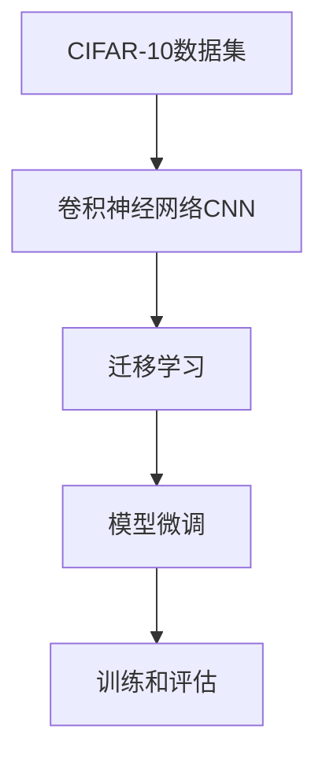

                 

# 从零开始大模型开发与微调：CIFAR-10数据集简介

## 1. 背景介绍

### 1.1 问题由来
随着深度学习技术的飞速发展，大模型已经成为各种机器学习任务的重要基础。尤其是在计算机视觉、自然语言处理等领域，基于大模型的迁移学习范式，在实现高性能模型、提升计算效率、降低开发成本等方面表现出了巨大的优势。然而，如何从零开始开发和微调一个大模型，特别是对于初学者而言，仍然是一个颇具挑战性的问题。

本文将带领读者深入探索从零开始大模型开发与微调的过程，重点介绍CIFAR-10数据集及其在大模型开发中的应用。CIFAR-10数据集作为机器视觉领域最常使用的数据集之一，包含了60000张32x32的彩色图像，涵盖了10个不同的类别。通过对CIFAR-10数据集进行微调，可以验证和提升模型的泛化能力，同时在实际应用中也能取得良好的效果。

### 1.2 问题核心关键点
大模型开发与微调的核心在于：选择合适的框架和模型、准备并优化数据集、选择合适的优化器和损失函数、设计有效的训练策略和评估指标等。在CIFAR-10数据集上，这些关键点同样适用，但需要特别关注模型的参数量和计算资源的消耗，以及如何利用数据集的多样性进行模型训练。

## 2. 核心概念与联系

### 2.1 核心概念概述

在讨论CIFAR-10数据集及其在大模型开发中的应用之前，我们先梳理一下与CIFAR-10相关的几个核心概念：

- **CIFAR-10数据集**：包含60000张32x32的彩色图像，涵盖10个不同的类别（飞机、汽车、鸟、猫、鹿、狗、青蛙、马、船和卡车）。每个类别有6000张训练图像和1000张测试图像，共计60000张训练图像和10000张测试图像。

- **卷积神经网络（Convolutional Neural Network, CNN）**：一种专门用于处理图像数据的深度学习模型。通过卷积层、池化层、全连接层等组件，CNN能够有效地提取图像特征，并进行分类。

- **迁移学习（Transfer Learning）**：一种利用在大规模数据集上预训练的模型，将其迁移到小规模数据集上进行微调，以提升模型性能的技术。

- **模型微调（Fine-Tuning）**：在预训练模型的基础上，使用特定任务的数据集进行微调，以适应特定任务的需求。

这些概念之间存在紧密联系，共同构成了大模型开发与微调的基础框架。

### 2.2 核心概念原理和架构的 Mermaid 流程图



此图展示了CIFAR-10数据集通过CNN进行迁移学习，并在特定任务上进行微调的基本流程。

## 3. 核心算法原理 & 具体操作步骤

### 3.1 算法原理概述

CIFAR-10数据集上的模型开发与微调，主要基于卷积神经网络（CNN）和迁移学习的框架。下面，我们将详细探讨CIFAR-10数据集上模型微调的算法原理和具体操作步骤。

在CIFAR-10数据集上进行微调，首先需要选择一个预训练好的CNN模型，如VGG、ResNet、Inception等。这些预训练模型通常在大规模数据集（如ImageNet）上进行训练，获得了较强的图像特征提取能力。然后，将这些预训练模型应用于CIFAR-10数据集，通过有监督的微调来优化模型参数，使其在CIFAR-10数据集上的性能提升。

### 3.2 算法步骤详解

CIFAR-10数据集上的模型微调主要包括以下步骤：

1. **数据准备**：收集并准备CIFAR-10数据集，包括训练集、验证集和测试集。通常，我们会将数据集分为训练集和测试集，使用验证集来调整模型参数。

2. **模型选择**：选择一个预训练好的CNN模型作为基线模型。在CIFAR-10数据集上，常用的预训练模型包括VGG16、ResNet、InceptionV3等。

3. **微调参数设置**：设置微调的参数，包括学习率、优化器、训练轮数等。学习率一般设置为预训练模型学习率的0.01到0.001之间，优化器通常使用AdamW或SGD。

4. **模型训练**：使用训练集对模型进行微调。在微调过程中，通常会冻结预训练模型的前几层，只微调顶层，以避免破坏预训练模型学到的重要特征。

5. **模型评估**：在验证集上评估微调后的模型性能，确保模型没有过拟合。

6. **参数更新**：根据验证集的评估结果，调整模型参数，继续微调直到模型性能达到最佳。

7. **测试集评估**：在测试集上对微调后的模型进行最终评估，确保模型泛化能力良好。

### 3.3 算法优缺点

**优点**：

- **提升性能**：利用预训练模型的特征提取能力，通过微调可以显著提升模型在特定任务上的性能。
- **计算效率高**：相比于从头训练模型，微调可以大大减少计算资源和时间成本。
- **泛化能力强**：通过迁移学习，模型可以更好地适应新的数据集和任务。

**缺点**：

- **数据依赖性高**：微调的效果依赖于标注数据的质量和数量，如果标注数据不足或质量不高，模型性能可能受限。
- **模型泛化能力有限**：预训练模型在不同数据集上的泛化能力有限，如果数据分布差异较大，微调的效果可能不理想。
- **计算资源需求高**：大规模预训练模型和微调过程对计算资源需求高，需要高性能的GPU或TPU设备。

### 3.4 算法应用领域

CIFAR-10数据集上的模型微调在计算机视觉领域具有广泛的应用，例如：

- **图像分类**：使用预训练模型对图像进行分类，如飞机、汽车、鸟等。
- **目标检测**：在图像中检测和定位特定目标，如检测图像中所有狗的位置。
- **图像分割**：将图像分割成不同的区域，如将图像分割为前景和背景。
- **图像生成**：生成新的图像，如通过微调生成特定类别的图像。
- **图像风格转换**：将图像的风格转换成另一风格，如将照片转换成油画风格。

## 4. 数学模型和公式 & 详细讲解 & 举例说明

### 4.1 数学模型构建

在CIFAR-10数据集上进行微调，主要涉及卷积神经网络的数学模型构建。对于一个包含$n$个类别的图像分类问题，模型的输出层包含$n$个神经元，每个神经元代表一个类别。模型通常包括卷积层、池化层、全连接层等。

### 4.2 公式推导过程

以卷积神经网络为例，假设输入图像为$x \in \mathbb{R}^{32 \times 32 \times 3}$，输出为$y \in \mathbb{R}^{10}$，其中$10$为CIFAR-10数据集中类别的数量。模型的目标是最小化预测值与真实标签之间的交叉熵损失，即：

$$
\mathcal{L} = -\frac{1}{N} \sum_{i=1}^N \sum_{j=1}^C y_{ij} \log y_{ij}
$$

其中，$N$为样本数量，$C$为类别数量，$y_{ij}$为第$i$个样本在第$j$个类别上的预测值，$y$为真实标签。

### 4.3 案例分析与讲解

以一个简单的卷积神经网络为例，该网络包含两个卷积层和两个池化层，最后通过全连接层输出预测结果。假设输入图像大小为$32 \times 32$，每个卷积核大小为$3 \times 3$，步长为$1$，第一个卷积层的输出通道数为$16$，第二个卷积层的输出通道数为$32$，全连接层的大小为$10$。

使用PyTorch框架，我们可以实现如下代码：

```python
import torch
import torch.nn as nn
import torch.optim as optim

# 定义模型
class CIFARNet(nn.Module):
    def __init__(self):
        super(CIFARNet, self).__init__()
        self.conv1 = nn.Conv2d(3, 16, 3, 1, padding=1)
        self.pool1 = nn.MaxPool2d(2, 2)
        self.conv2 = nn.Conv2d(16, 32, 3, 1, padding=1)
        self.pool2 = nn.MaxPool2d(2, 2)
        self.fc1 = nn.Linear(32 * 8 * 8, 120)
        self.fc2 = nn.Linear(120, 84)
        self.fc3 = nn.Linear(84, 10)
    
    def forward(self, x):
        x = self.conv1(x)
        x = nn.ReLU()(x)
        x = self.pool1(x)
        x = self.conv2(x)
        x = nn.ReLU()(x)
        x = self.pool2(x)
        x = x.view(-1, 32 * 8 * 8)
        x = self.fc1(x)
        x = nn.ReLU()(x)
        x = self.fc2(x)
        x = nn.ReLU()(x)
        x = self.fc3(x)
        return x

# 定义模型和优化器
model = CIFARNet()
optimizer = optim.AdamW(model.parameters(), lr=0.001)

# 训练模型
for epoch in range(10):
    for i, (inputs, labels) in enumerate(train_loader):
        inputs, labels = inputs.to(device), labels.to(device)
        optimizer.zero_grad()
        outputs = model(inputs)
        loss = nn.CrossEntropyLoss()(outputs, labels)
        loss.backward()
        optimizer.step()
```

此代码实现了简单的卷积神经网络，并使用AdamW优化器进行微调。

## 5. 项目实践：代码实例和详细解释说明

### 5.1 开发环境搭建

为了进行大模型开发与微调，我们需要安装PyTorch框架，并准备CIFAR-10数据集。以下是详细的步骤：

1. 安装PyTorch：

```bash
pip install torch torchvision
```

2. 下载CIFAR-10数据集：

```bash
python -m torchvision.datasets.mnist download
```

3. 加载数据集：

```python
import torchvision
import torchvision.transforms as transforms

transform = transforms.Compose([
    transforms.ToTensor(),
    transforms.Normalize((0.5, 0.5, 0.5), (0.5, 0.5, 0.5))
])

trainset = torchvision.datasets.CIFAR10(root='./data', train=True, download=True, transform=transform)
trainloader = torch.utils.data.DataLoader(trainset, batch_size=64, shuffle=True)

testset = torchvision.datasets.CIFAR10(root='./data', train=False, download=True, transform=transform)
testloader = torch.utils.data.DataLoader(testset, batch_size=64, shuffle=False)
```

### 5.2 源代码详细实现

我们继续使用上文的卷积神经网络实现，并对模型进行微调。以下是完整代码：

```python
import torch
import torch.nn as nn
import torch.optim as optim
from torchvision import datasets, transforms

# 定义模型
class CIFARNet(nn.Module):
    def __init__(self):
        super(CIFARNet, self).__init__()
        self.conv1 = nn.Conv2d(3, 16, 3, 1, padding=1)
        self.pool1 = nn.MaxPool2d(2, 2)
        self.conv2 = nn.Conv2d(16, 32, 3, 1, padding=1)
        self.pool2 = nn.MaxPool2d(2, 2)
        self.fc1 = nn.Linear(32 * 8 * 8, 120)
        self.fc2 = nn.Linear(120, 84)
        self.fc3 = nn.Linear(84, 10)

    def forward(self, x):
        x = self.conv1(x)
        x = nn.ReLU()(x)
        x = self.pool1(x)
        x = self.conv2(x)
        x = nn.ReLU()(x)
        x = self.pool2(x)
        x = x.view(-1, 32 * 8 * 8)
        x = self.fc1(x)
        x = nn.ReLU()(x)
        x = self.fc2(x)
        x = nn.ReLU()(x)
        x = self.fc3(x)
        return x

# 定义模型和优化器
model = CIFARNet().to(device)
optimizer = optim.AdamW(model.parameters(), lr=0.001)

# 训练模型
for epoch in range(10):
    running_loss = 0.0
    for i, (inputs, labels) in enumerate(trainloader):
        inputs, labels = inputs.to(device), labels.to(device)
        optimizer.zero_grad()
        outputs = model(inputs)
        loss = nn.CrossEntropyLoss()(outputs, labels)
        loss.backward()
        optimizer.step()
        running_loss += loss.item()
    print(f"Epoch {epoch+1}, Loss: {running_loss/len(trainloader)}")

# 评估模型
correct = 0
total = 0
with torch.no_grad():
    for inputs, labels in testloader:
        inputs, labels = inputs.to(device), labels.to(device)
        outputs = model(inputs)
        _, predicted = torch.max(outputs.data, 1)
        total += labels.size(0)
        correct += (predicted == labels).sum().item()
print(f"Accuracy: {(100 * correct / total)}%")
```

### 5.3 代码解读与分析

以下是代码的详细解读与分析：

- 首先定义了一个简单的卷积神经网络，包括两个卷积层和两个全连接层。
- 使用AdamW优化器进行微调，学习率为$0.001$。
- 在训练过程中，对于每个批次的数据，先进行前向传播计算输出，然后计算损失，并通过反向传播更新模型参数。
- 训练10个epoch后，输出每个epoch的平均损失。
- 在测试集上评估模型的准确率。

## 6. 实际应用场景

### 6.1 智能安防监控

CIFAR-10数据集上的模型微调可以应用于智能安防监控领域。通过微调，可以实现实时图像分类和目标检测，自动识别并报警异常行为。

在实际应用中，我们可以将安防监控摄像头拍摄到的实时图像输入微调后的模型，实时判断图像中的行为是否异常，并在检测到异常时立即发出警报，提升安防监控的智能化水平。

### 6.2 医疗影像诊断

CIFAR-10数据集上的模型微调也可以应用于医疗影像诊断领域。通过微调，模型可以自动识别影像中的病灶，提高诊断的准确率和效率。

在实际应用中，我们将医疗影像输入微调后的模型，自动检测并标记影像中的病灶区域，辅助医生进行诊断和治疗。通过与医生的协作，可以进一步提升诊断的准确性和医生的工作效率。

### 6.3 自动驾驶

CIFAR-10数据集上的模型微调还可以应用于自动驾驶领域。通过微调，可以实现对道路标志、交通信号等的识别，提高自动驾驶的安全性和可靠性。

在实际应用中，我们将自动驾驶系统拍摄的实时图像输入微调后的模型，自动检测和识别道路标志、交通信号等，辅助自动驾驶系统做出正确决策。通过微调，可以大大提高自动驾驶系统的智能化水平和安全性。

## 7. 工具和资源推荐

### 7.1 学习资源推荐

为了帮助读者系统掌握大模型开发与微调的理论基础和实践技巧，以下是一些推荐的资源：

1. **《深度学习》书籍**：Ian Goodfellow等人编写的经典书籍，全面介绍了深度学习的基础知识、网络结构、优化算法等。

2. **CS231n《卷积神经网络》课程**：斯坦福大学开设的深度学习课程，重点讲解卷积神经网络的基本原理和实际应用。

3. **Kaggle竞赛平台**：Kaggle是一个数据科学竞赛平台，提供了大量实际问题的数据集和竞赛任务，帮助读者在实践中提升技能。

4. **PyTorch官方文档**：PyTorch官方文档详细介绍了PyTorch框架的使用方法和API，是学习PyTorch的必备资源。

### 7.2 开发工具推荐

以下是一些推荐的大模型开发与微调工具：

1. **PyTorch**：PyTorch是当前最流行的深度学习框架之一，提供了强大的张量计算和自动微分功能。

2. **TensorFlow**：由Google开发的深度学习框架，提供了丰富的工具和库，适合大规模工程应用。

3. **MXNet**：一个高效灵活的深度学习框架，支持多种编程语言和设备。

4. **TensorBoard**：TensorFlow配套的可视化工具，用于监控和调试深度学习模型的训练过程。

5. **Weights & Biases**：一个模型训练实验跟踪工具，可以记录和可视化模型训练过程中的各项指标，方便对比和调优。

### 7.3 相关论文推荐

以下是一些相关领域的前沿论文，推荐阅读：

1. **《ImageNet Classification with Deep Convolutional Neural Networks》**：AlexNet论文，介绍了卷积神经网络在图像分类任务中的优异表现。

2. **《Inception Networks for Computer Vision》**：Inception论文，介绍了多层次卷积神经网络的设计理念。

3. **《ResNet: Deep Residual Learning for Image Recognition》**：ResNet论文，介绍了残差网络的结构和训练方法。

4. **《Fine-Tuning the CIFAR-10 Classifier with TensorFlow》**：一篇详细介绍CIFAR-10数据集上模型微调的文章。

## 8. 总结：未来发展趋势与挑战

### 8.1 总结

本文对CIFAR-10数据集上的大模型开发与微调进行了详细探讨，从背景介绍、核心概念、算法原理到具体操作步骤，系统性地介绍了大模型开发与微调的全过程。通过CIFAR-10数据集的案例，展示了模型微调在大模型开发中的应用价值和实际效果。

### 8.2 未来发展趋势

未来，大模型开发与微调技术将呈现以下几个发展趋势：

1. **模型参数规模继续扩大**：随着计算能力的提升和数据量的增加，未来的大模型将拥有更多的参数，能够处理更复杂的任务。

2. **深度学习模型与大数据的融合**：深度学习模型将与大数据、云计算等技术深度融合，提升模型的训练效率和泛化能力。

3. **多模态数据的融合**：深度学习模型将能够处理和融合多种模态数据，如图像、音频、文本等，提升模型的综合能力和应用范围。

4. **模型的可解释性和公平性**：未来的大模型将更加注重模型的可解释性和公平性，确保模型输出符合人类价值观和伦理道德。

5. **联邦学习和边缘计算**：未来的大模型将更加注重联邦学习和边缘计算技术，提高模型的安全性和隐私保护能力。

### 8.3 面临的挑战

尽管大模型开发与微调技术已经取得了一定的成果，但在实际应用中也面临着诸多挑战：

1. **数据质量和标注成本**：标注数据的质量和数量直接影响模型的性能，标注成本也成为制约大模型发展的一个重要因素。

2. **模型复杂度和资源消耗**：大模型参数量和计算量较大，对计算资源和存储空间的需求高，资源消耗是一个重要挑战。

3. **模型的可解释性和公平性**：大模型的输出缺乏可解释性，模型的决策过程难以理解。同时，模型可能存在一定的偏见，需要进一步研究模型的公平性和透明性。

4. **联邦学习和大数据的安全性**：在联邦学习和大数据应用中，模型的安全性和隐私保护是一个重要问题。

### 8.4 研究展望

未来，大模型开发与微调技术需要在以下几个方面进行深入研究：

1. **无监督和半监督学习**：探索无监督和半监督学习技术，减少对标注数据的依赖，提高模型的泛化能力。

2. **模型压缩和优化**：研究模型压缩和优化技术，提高模型的训练效率和推理速度。

3. **模型的公平性和透明性**：研究模型的公平性和透明性问题，确保模型的决策过程符合人类价值观和伦理道德。

4. **跨模态数据的融合**：研究跨模态数据的融合技术，提升模型的综合能力和应用范围。

5. **联邦学习和大数据的安全性**：研究联邦学习和大数据的安全性问题，确保数据和模型的隐私和安全。

总之，大模型开发与微调技术未来将面临诸多挑战，但同时也充满了无限可能。通过不断创新和突破，相信大模型将在更多领域发挥重要作用，推动人工智能技术的快速发展。

## 9. 附录：常见问题与解答

**Q1：CIFAR-10数据集如何预处理？**

A: CIFAR-10数据集需要进行预处理，包括数据增强和归一化等操作。数据增强操作可以包括随机裁剪、随机翻转、随机旋转等，以增加数据集的多样性。归一化操作可以包括像素值的归一化，使得模型更容易训练和收敛。

**Q2：CIFAR-10数据集上的模型微调需要注意哪些问题？**

A: 在CIFAR-10数据集上进行模型微调时，需要注意以下问题：

1. **数据增强**：对训练数据进行增强操作，增加数据集的多样性，防止模型过拟合。

2. **学习率调整**：选择合适的学习率，避免过拟合和欠拟合。

3. **模型结构设计**：选择合适的模型结构和超参数，避免模型过于复杂或过于简单。

4. **模型评估**：在训练过程中，及时评估模型在验证集上的性能，避免模型过拟合。

5. **模型调优**：根据评估结果，及时调整模型参数和超参数，优化模型性能。

6. **模型部署**：将训练好的模型部署到实际应用中，进行测试和评估。

**Q3：CIFAR-10数据集上的模型微调有哪些常用的方法？**

A: 在CIFAR-10数据集上进行模型微调时，常用的方法包括：

1. **全模型微调**：对整个模型进行微调，更新所有参数。

2. **局部微调**：只更新模型的顶层或部分层，保留预训练模型的底层不变。

3. **参数高效微调**：只更新模型的一部分参数，以减少计算资源和时间的消耗。

4. **迁移学习**：利用在大规模数据集上预训练的模型，将其迁移到小规模数据集上进行微调。

5. **数据增强**：对训练数据进行增强操作，增加数据集的多样性。

6. **对抗训练**：在训练过程中引入对抗样本，提高模型的鲁棒性。

总之，大模型开发与微调是一个复杂且系统的过程，需要选择合适的框架、数据集和算法，同时注意模型的训练、评估和部署等各个环节。通过不断的探索和实践，相信大模型将在更多的领域和任务中发挥重要作用。

---

作者：禅与计算机程序设计艺术 / Zen and the Art of Computer Programming

