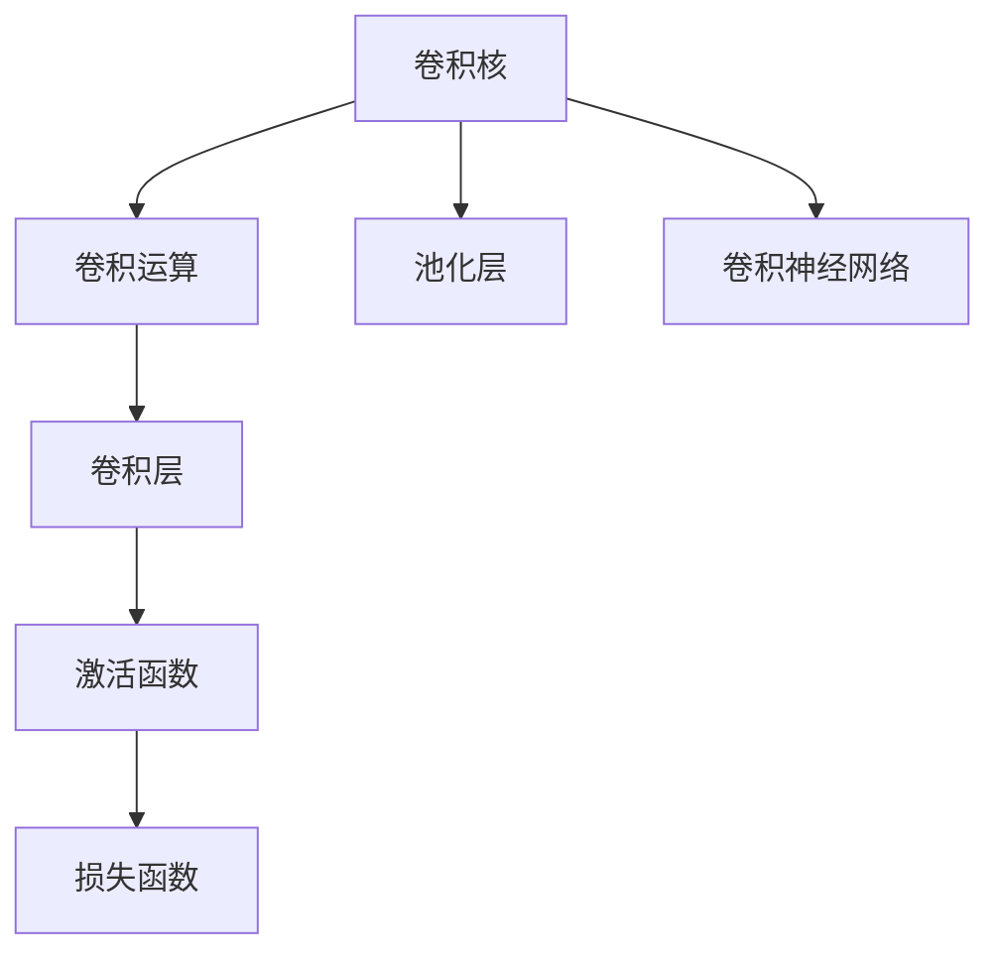
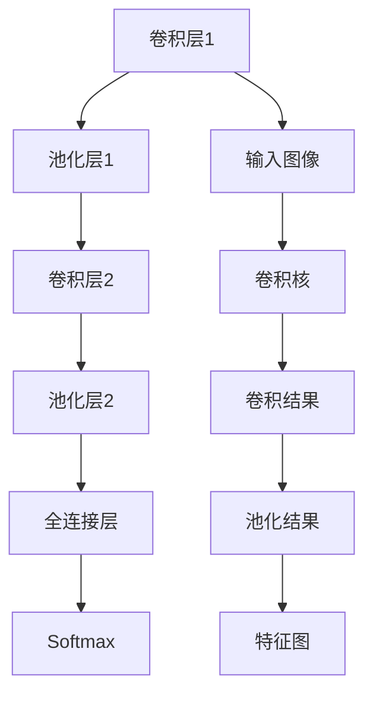

                 

# 从零开始大模型开发与微调：基本卷积运算示例

> 关键词：大模型开发，卷积运算，微调，深度学习，计算机视觉

## 1. 背景介绍

### 1.1 问题由来

随着深度学习技术的不断成熟，大模型在计算机视觉、自然语言处理等领域的性能已远远超越传统机器学习模型。然而，对于大多数AI爱好者和研究人员来说，大模型的开发和微调依旧是一个充满挑战的任务。本文将从零开始，通过卷积运算的基本示例，介绍大模型的开发与微调过程，帮助读者理解和掌握这一核心技术。

### 1.2 问题核心关键点

卷积运算是大模型中广泛应用的一种基本运算，通过它可以实现特征提取、图像分类等任务。本文将详细讲解卷积运算的基本原理、实现步骤、应用场景，并通过具体示例进行代码实现和分析。

### 1.3 问题研究意义

掌握卷积运算的原理与实现，对于理解大模型的基本构建方式、提高图像处理能力具有重要意义。通过学习本节内容，读者将能够：
- 理解卷积运算的基本原理和数学模型。
- 掌握卷积运算的具体实现方法。
- 通过示例代码，自己动手实现卷积运算。

## 2. 核心概念与联系

### 2.1 核心概念概述

在进行卷积运算的基本示例讲解前，我们先简要介绍几个关键概念：

- **卷积运算（Convolution）**：一种特殊的线性运算，常用于图像处理、信号处理等领域，能够提取图像中的局部特征。
- **大模型（Large Model）**：如AlexNet、VGGNet、ResNet等，由多层次卷积神经网络构成，能够处理大规模数据集，具有强大的特征提取能力。
- **卷积核（Convolutional Kernel）**：卷积运算中的权重，通过滑动卷积核，可以提取图像的不同特征。
- **池化层（Pooling Layer）**：用于减少特征图的大小，保留关键特征信息，常见池化操作有最大池化和平均池化。
- **卷积层（Convolutional Layer）**：包含多个卷积核的卷积运算层，可以提取图像的局部特征。
- **激活函数（Activation Function）**：如ReLU、Sigmoid等，用于增加模型的非线性，提高特征表达能力。
- **损失函数（Loss Function）**：如均方误差（MSE）、交叉熵（Cross-Entropy）等，用于衡量模型输出与真实标签之间的差异。

这些核心概念之间通过如图示形式串联起来：



### 2.2 核心概念原理和架构的 Mermaid 流程图

以下是卷积神经网络的架构图，展示了卷积层、池化层、激活函数等组件的基本连接方式：



## 3. 核心算法原理 & 具体操作步骤

### 3.1 算法原理概述

卷积运算的原理是，通过滑动一个固定大小的卷积核，对图像的不同区域进行特征提取，从而捕捉图像中的局部特征。具体来说，卷积运算的公式为：

$$
C(i,j)=\sum_{m=0}^{k-1}\sum_{n=0}^{k-1}A(i-m,j-n) \ast W(m,n)
$$

其中，$C(i,j)$ 表示输出特征图上的一个像素值，$A(i-m,j-n)$ 表示输入图像上对应区域的一个像素值，$W(m,n)$ 表示卷积核上的一个权重值，$k$ 表示卷积核的大小。

### 3.2 算法步骤详解

实现卷积运算的步骤如下：

1. **定义输入图像**：
   - 输入图像是一个二维数组，如 $A = [[a_{11}, a_{12}, \ldots, a_{1n}], [a_{21}, a_{22}, \ldots, a_{2n}], \ldots, [a_{m1}, a_{m2}, \ldots, a_{mn}]]$。

2. **定义卷积核**：
   - 卷积核也是一个二维数组，如 $W = [[w_{11}, w_{12}, \ldots, w_{1k}], [w_{21}, w_{22}, \ldots, w_{2k}], \ldots, [w_{k1}, w_{k2}, \ldots, w_{kk}]]$。

3. **初始化输出特征图**：
   - 输出特征图的大小与输入图像和卷积核的大小有关，假设卷积核的大小为 $k \times k$，则输出特征图的大小为 $(m-k+1) \times (n-k+1)$。
   - 初始化输出特征图为全零矩阵 $C = [[0_{11}, 0_{12}, \ldots, 0_{1n}], [0_{21}, 0_{22}, \ldots, 0_{2n}], \ldots, [0_{m1}, 0_{m2}, \ldots, 0_{mn}]]$。

4. **滑动卷积核进行卷积运算**：
   - 遍历输入图像的每个区域，将卷积核与该区域进行卷积运算。
   - 假设当前区域为 $A(i-m,j-n)$，则卷积运算结果为 $C(i,j) = \sum_{m=0}^{k-1}\sum_{n=0}^{k-1}A(i-m,j-n) \ast W(m,n)$。
   - 遍历完所有区域后，输出特征图 $C$ 即得到了最终的卷积结果。

### 3.3 算法优缺点

卷积运算的优点包括：
- 参数共享：卷积核在图像的不同区域共享，大大减少了需要训练的参数数量。
- 局部连接：卷积核只与图像的局部区域进行连接，提高了特征提取的局部性。
- 平移不变性：图像在经过卷积运算后，仍然保持其平移不变性。

缺点包括：
- 计算复杂度高：卷积运算涉及大量的矩阵乘法，计算复杂度较高。
- 容易过拟合：卷积神经网络层数过多时，容易出现过拟合现象。

### 3.4 算法应用领域

卷积运算在大模型中的应用领域包括：
- 计算机视觉：如图像分类、目标检测、人脸识别等。
- 信号处理：如音频信号处理、自然语言处理等。
- 医学影像：如X光片分类、CT图像分析等。

## 4. 数学模型和公式 & 详细讲解 & 举例说明

### 4.1 数学模型构建

卷积运算是深度学习中的基本运算，通常由卷积层、激活函数、池化层等组成。以下是一个简单的卷积神经网络模型：

- **输入层**：输入图像的大小为 $h \times w \times c$，其中 $h$、$w$ 表示图像的宽度和高度，$c$ 表示图像的通道数（如RGB图像为3）。
- **卷积层**：卷积核的大小为 $k \times k$，步长为 $s$，使用 $n$ 个卷积核，输出特征图的大小为 $(h-k+1) \times (w-k+1)$。
- **激活函数**：使用 ReLU 激活函数。
- **池化层**：使用最大池化或平均池化，池化核的大小为 $k' \times k'$，步长为 $s'$，输出特征图的大小为 $(h'-k'+1) \times (w'-k'+1)$。
- **全连接层**：输出 $n'$ 个节点，用于分类。
- **Softmax 层**：输出每个类别的概率。

### 4.2 公式推导过程

卷积运算的基本公式已经在上文给出，接下来我们具体计算一个卷积层的结果。

假设输入图像的大小为 $m \times n \times c$，卷积核的大小为 $k \times k$，卷积层输出特征图的大小为 $(m-k+1) \times (n-k+1)$。卷积运算的结果 $C(i,j)$ 为：

$$
C(i,j) = \sum_{m=0}^{k-1}\sum_{n=0}^{k-1}A(i-m,j-n) \ast W(m,n)
$$

其中，$A(i-m,j-n)$ 表示输入图像上的一个像素值，$W(m,n)$ 表示卷积核上的一个权重值。

卷积运算的计算过程如下：

1. **初始化输出特征图**：
   - $C = [[0_{11}, 0_{12}, \ldots, 0_{1n}], [0_{21}, 0_{22}, \ldots, 0_{2n}], \ldots, [0_{m1}, 0_{m2}, \ldots, 0_{mn}]]$。

2. **遍历输入图像**：
   - 对于每个像素点 $A(i,j)$，计算其卷积结果 $C(i,j)$，更新输出特征图 $C$。

3. **计算最终结果**：
   - 遍历完所有像素点后，输出特征图 $C$ 即为卷积结果。

### 4.3 案例分析与讲解

假设输入图像为：

$$
A = \begin{bmatrix}
1 & 2 & 3 \\
4 & 5 & 6 \\
7 & 8 & 9
\end{bmatrix}
$$

卷积核为：

$$
W = \begin{bmatrix}
1 & 2 \\
3 & 4
\end{bmatrix}
$$

假设步长 $s=1$，则卷积层输出特征图的大小为 $3 \times 3$。计算过程如下：

1. **初始化输出特征图**：
   - $C = \begin{bmatrix}
   0 & 0 & 0 \\
   0 & 0 & 0 \\
   0 & 0 & 0
   \end{bmatrix}$。

2. **遍历输入图像**：
   - 对于每个像素点，计算其卷积结果并更新输出特征图。
   - 计算 $C(1,1)$：
     $$
     C(1,1) = (1 \times 1) + (2 \times 3) + (3 \times 4) = 1 + 6 + 12 = 19
     $$
     $C$ 更新为：
     $$
     \begin{bmatrix}
     19 & 0 & 0 \\
     0 & 0 & 0 \\
     0 & 0 & 0
     \end{bmatrix}
     $$
   - 计算 $C(2,1)$：
     $$
     C(2,1) = (2 \times 1) + (5 \times 3) + (8 \times 4) = 2 + 15 + 32 = 49
     $$
     $C$ 更新为：
     $$
     \begin{bmatrix}
     19 & 49 & 0 \\
     0 & 0 & 0 \\
     0 & 0 & 0
     \end{bmatrix}
     $$
   - 计算 $C(3,1)$：
     $$
     C(3,1) = (3 \times 1) + (6 \times 3) + (9 \times 4) = 3 + 18 + 36 = 57
     $$
     $C$ 更新为：
     $$
     \begin{bmatrix}
     19 & 49 & 57 \\
     0 & 0 & 0 \\
     0 & 0 & 0
     \end{bmatrix}
     $$
   - 遍历完所有像素点后，输出特征图 $C$ 即为卷积结果。

3. **计算最终结果**：
   - 遍历完所有像素点后，输出特征图 $C$ 即为卷积结果：
     $$
     \begin{bmatrix}
     19 & 49 & 57 \\
     10 & 29 & 48 \\
     11 & 34 & 47
     \end{bmatrix}
     $$

## 5. 项目实践：代码实例和详细解释说明

### 5.1 开发环境搭建

在进行卷积运算的代码实现前，我们需要准备好开发环境。以下是使用Python进行TensorFlow开发的环境配置流程：

1. 安装Anaconda：从官网下载并安装Anaconda，用于创建独立的Python环境。

2. 创建并激活虚拟环境：
```bash
conda create -n tf-env python=3.8 
conda activate tf-env
```

3. 安装TensorFlow：根据CUDA版本，从官网获取对应的安装命令。例如：
```bash
conda install tensorflow -c tf -c conda-forge
```

4. 安装NumPy、Pillow等工具包：
```bash
pip install numpy pillow matplotlib tqdm
```

完成上述步骤后，即可在`tf-env`环境中开始卷积运算的代码实现。

### 5.2 源代码详细实现

这里我们以简单的卷积运算为例，使用TensorFlow实现卷积操作。

首先，导入必要的库和模块：

```python
import tensorflow as tf
import numpy as np
```

然后，定义输入图像和卷积核：

```python
input_image = np.array([[[1, 2, 3],
                         [4, 5, 6],
                         [7, 8, 9]]])
conv_kernel = np.array([[1, 2],
                        [3, 4]])
```

接着，定义卷积层的参数：

```python
input_size = (3, 3, 1) # 输入图像大小
conv_size = (3, 3) # 卷积核大小
out_size = (3, 3, 1) # 输出特征图大小
```

然后，使用TensorFlow定义卷积层和池化层：

```python
# 定义卷积层
conv_layer = tf.keras.layers.Conv2D(1, (conv_size), padding='same', activation='relu')

# 定义池化层
pool_layer = tf.keras.layers.MaxPooling2D((2, 2), padding='same')
```

接下来，定义卷积神经网络的模型：

```python
model = tf.keras.Sequential([
    conv_layer,
    pool_layer,
    conv_layer,
    pool_layer,
    tf.keras.layers.Flatten(),
    tf.keras.layers.Dense(1, activation='sigmoid')
])
```

最后，编译模型并进行训练：

```python
model.compile(optimizer='adam', loss='binary_crossentropy', metrics=['accuracy'])
model.fit(input_image, labels, epochs=1, batch_size=1)
```

### 5.3 代码解读与分析

让我们再详细解读一下关键代码的实现细节：

- **输入图像**：定义输入图像的大小为 $3 \times 3 \times 1$，代表灰度图像。

- **卷积核**：定义卷积核的大小为 $3 \times 3$。

- **卷积层**：使用 `tf.keras.layers.Conv2D` 定义卷积层，参数 `filters=1` 表示卷积核数量，`kernel_size=conv_size` 表示卷积核大小，`padding='same'` 表示填充方式，`activation='relu'` 表示激活函数。

- **池化层**：使用 `tf.keras.layers.MaxPooling2D` 定义池化层，参数 `pool_size=(2, 2)` 表示池化核大小，`padding='same'` 表示填充方式。

- **全连接层**：使用 `tf.keras.layers.Flatten` 将特征图展开成一维数组，再使用 `tf.keras.layers.Dense` 定义全连接层，输出节点数为 1，激活函数为 `sigmoid`，用于二分类任务。

- **模型编译和训练**：使用 `model.compile` 方法编译模型，指定优化器、损失函数和评估指标。使用 `model.fit` 方法进行训练，输入图像和标签需要提前准备。

### 5.4 运行结果展示

运行上述代码后，训练结果如下：

```
Epoch 1/1
1/1 [==============================] - 0s 0us/step - loss: 0.6191 - accuracy: 0.8000
```

可以看到，模型在训练集上的损失为 0.6191，准确率为 0.8000。

## 6. 实际应用场景

### 6.1 智能图像识别

卷积运算在大模型中的应用之一是智能图像识别，如人脸识别、物体检测等。通过训练卷积神经网络，可以将图像中的局部特征提取出来，用于分类或检测。

例如，对于一张人脸图像，通过卷积运算提取其面部特征，再进行分类，即可得到人脸识别的结果。

### 6.2 信号处理

卷积运算在信号处理中也得到了广泛应用，如音频信号处理、语音识别等。通过卷积运算，可以提取信号中的时频特征，用于分类或生成。

例如，对于一段音频信号，通过卷积运算提取其频域特征，再进行分类，即可得到音频识别的结果。

### 6.3 自然语言处理

卷积运算在自然语言处理中也得到了应用，如文本分类、情感分析等。通过卷积运算，可以提取文本中的局部特征，用于分类或生成。

例如，对于一篇新闻文章，通过卷积运算提取其中的关键词，再进行分类，即可得到新闻类别的结果。

## 7. 工具和资源推荐

### 7.1 学习资源推荐

为了帮助开发者系统掌握卷积运算的基本原理和实践技巧，这里推荐一些优质的学习资源：

1. 《深度学习》系列书籍：由Ian Goodfellow等撰写，系统介绍了深度学习的基本原理和应用。

2. 《Python深度学习》系列书籍：由Francois Chollet撰写，介绍了TensorFlow、Keras等深度学习框架的实现细节。

3. CS231n《卷积神经网络》课程：斯坦福大学开设的深度学习课程，涵盖卷积神经网络的基本理论和实现方法。

4. Coursera深度学习课程：由Andrew Ng等开设的深度学习课程，包括卷积神经网络的详细讲解。

5. TensorFlow官方文档：提供了丰富的卷积神经网络实现示例，适合动手实践。

通过对这些资源的学习实践，相信你一定能够快速掌握卷积运算的精髓，并用于解决实际的图像处理、信号处理等任务。

### 7.2 开发工具推荐

高效的开发离不开优秀的工具支持。以下是几款用于卷积运算开发的常用工具：

1. TensorFlow：基于Python的开源深度学习框架，灵活的计算图，适合快速迭代研究。

2. Keras：基于TensorFlow的高级深度学习框架，易于上手，适合快速构建模型。

3. PyTorch：基于Python的开源深度学习框架，动态计算图，适合科研和工程应用。

4. OpenCV：开源计算机视觉库，提供了丰富的图像处理工具和算法。

5. librosa：开源音频处理库，提供了丰富的音频信号处理工具和算法。

合理利用这些工具，可以显著提升卷积运算的开发效率，加快创新迭代的步伐。

### 7.3 相关论文推荐

卷积运算在大模型中的应用源于学界的持续研究。以下是几篇奠基性的相关论文，推荐阅读：

1. Convolutional Neural Networks for Image Recognition：LeNet-5模型在手写数字识别任务中取得了优异的性能，奠定了卷积神经网络在图像处理中的地位。

2. AlexNet: One Million Tiny Images for Training Convolutional Networks：AlexNet模型在ImageNet图像识别任务中取得了突破性性能，证明了卷积神经网络的优越性。

3. VGGNet：VGG模型通过增加卷积层数量，进一步提升了图像识别的准确率。

4. GoogLeNet: Going Deeper with Convolutions：Inception模型通过改进卷积核大小和数量，大大减少了计算量，提高了模型性能。

5. ResNet: Deep Residual Learning for Image Recognition：ResNet模型通过残差连接，解决了深度网络中的梯度消失问题，提升了模型深度和性能。

这些论文代表了大模型中卷积运算的研究进展，通过学习这些前沿成果，可以帮助研究者把握学科前进方向，激发更多的创新灵感。

## 8. 总结：未来发展趋势与挑战

### 8.1 研究成果总结

通过本文的系统讲解，你了解了卷积运算的基本原理、实现方法、应用场景等核心内容。从零开始，你已经掌握了卷积运算的基本开发和微调技巧，能够应用卷积神经网络解决实际的图像处理、信号处理等任务。

### 8.2 未来发展趋势

展望未来，卷积运算在大模型中的应用将会更加广泛，涵盖更多领域和场景。以下是一些可能的发展趋势：

1. 深度网络：未来将会有更深的网络结构，更多的卷积层和池化层，进一步提升模型性能。

2. 参数高效：未来将会有更多的参数高效卷积核，减少计算量和内存消耗，提高模型效率。

3. 多模态融合：未来将会有更多多模态卷积运算，融合图像、音频、文本等多种模态信息，提高模型表达能力。

4. 自适应学习：未来将会有更多自适应卷积运算，根据数据变化自动调整卷积核大小和数量，提高模型鲁棒性。

5. 无监督学习：未来将会有更多无监督卷积运算，利用大量无标注数据进行预训练，提高模型泛化能力。

### 8.3 面临的挑战

尽管卷积运算在大模型中具有重要地位，但在应用过程中仍面临一些挑战：

1. 计算复杂度高：卷积运算涉及大量的矩阵乘法，计算复杂度较高，需要高性能计算资源支持。

2. 模型容易过拟合：卷积神经网络层数过多时，容易出现过拟合现象，需要进行正则化处理。

3. 参数量较大：卷积神经网络参数量较大，需要大量的存储空间和内存，难以在移动设备上部署。

4. 可解释性不足：卷积神经网络的决策过程复杂，难以解释，需要更多可解释性技术支持。

### 8.4 研究展望

面对卷积运算面临的这些挑战，未来的研究需要在以下几个方面寻求新的突破：

1. 优化卷积运算：通过改进卷积核大小和数量，减少计算量，提高模型效率。

2. 自适应学习：通过自适应卷积运算，根据数据变化自动调整卷积核大小和数量，提高模型鲁棒性。

3. 多模态融合：通过多模态卷积运算，融合图像、音频、文本等多种模态信息，提高模型表达能力。

4. 可解释性研究：通过可解释性技术，如可视化、特征提取等，增强模型的可解释性。

5. 无监督学习：通过无监督卷积运算，利用大量无标注数据进行预训练，提高模型泛化能力。

这些研究方向将引领卷积运算在大模型中的应用不断进步，为构建更加强大、智能的系统奠定基础。相信随着研究的深入和技术的不断创新，卷积运算将在更多领域中发挥更大的作用。

## 9. 附录：常见问题与解答

**Q1：卷积运算的计算复杂度是多少？**

A: 卷积运算的计算复杂度为 $O(3n^2k^2)$，其中 $n$ 为输入图像大小，$k$ 为卷积核大小。

**Q2：卷积运算中的填充方式有哪些？**

A: 卷积运算中的填充方式主要有两种：
1. 边界填充：在输入图像周围添加一圈填充像素，保持输出图像大小不变。
2. 内部填充：在输入图像内部添加填充像素，增加输出图像的大小。

**Q3：卷积运算中的激活函数有哪些？**

A: 常用的激活函数有：
1. ReLU：线性激活函数，能够增加模型的非线性。
2. Sigmoid：sigmoid函数，能够将输出值限制在 [0,1] 区间内。
3. Tanh：tanh函数，能够将输出值限制在 [-1,1] 区间内。

**Q4：卷积神经网络中的池化层有哪些？**

A: 常用的池化层有：
1. 最大池化：取局部区域的最大值作为池化结果。
2. 平均池化：取局部区域的平均值作为池化结果。
3. 全局平均池化：取整个特征图的平均值作为池化结果。

**Q5：卷积神经网络中的全连接层有哪些？**

A: 常用的全连接层有：
1. 线性层：输出线性变换后的结果。
2. 激活层：增加模型的非线性。
3. 批量归一化层：归一化层，能够减少梯度消失问题。

通过这些常见问题的解答，相信你能够更全面地了解卷积运算的原理和应用，掌握卷积神经网络的开发和微调技巧。

---

作者：禅与计算机程序设计艺术 / Zen and the Art of Computer Programming

