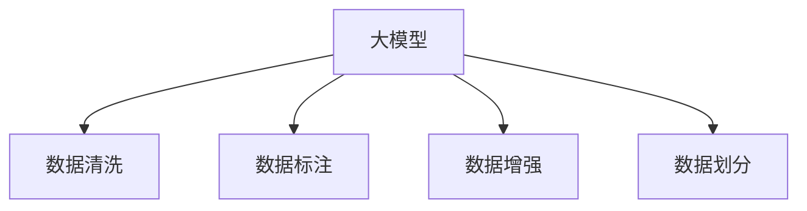

                 

# 从零开始大模型开发与微调：数据集的获取与处理

> 关键词：大模型开发,微调,Fine-tuning,数据集处理,数据增强,标注数据,数据清洗,数据划分

## 1. 背景介绍

### 1.1 问题由来

在深度学习时代，大模型（Large Models）的应用愈发广泛，从自然语言处理（NLP）、计算机视觉（CV）到推荐系统、医疗诊断等领域，大模型的存在极大地提升了相关任务的性能。然而，大模型的开发与微调工作涉及大量复杂的数据处理和模型训练，需要耗费大量的时间和资源。本文将从数据集获取与处理的角度出发，介绍如何构建高质量的数据集，以支撑大模型的开发与微调工作。

### 1.2 问题核心关键点

大模型开发与微调的核心在于数据的准备。数据集的质量直接影响模型的学习效果，一个高质量的数据集应该包含以下几个特点：
- **多样性**：数据集应该覆盖多种场景和情况，以确保模型具有广泛的泛化能力。
- **丰富性**：数据集应包含丰富多样的特征，以便模型可以学习到多种特征之间的关系。
- **标注质量**：标注应准确、一致，避免噪声数据的干扰。
- **规模适中**：数据集大小应适中，便于模型的有效训练，但不宜太小，以防止过拟合。
- **数据更新**：数据集应该定期更新，以反映现实世界的变化。

数据集处理包括数据清洗、标注、划分、增强等环节，数据处理的每一步都需要精心设计，以确保数据的质量和可用性。

### 1.3 问题研究意义

高质量的数据集是大模型开发与微调成功的基石，能够显著提升模型的性能，并缩短模型开发周期。具体来说，数据集的处理与准备有以下几个方面的意义：
- **提升模型泛化能力**：通过多样化和丰富化的数据集，大模型能够学习到更加广泛的特征，从而提升模型的泛化能力。
- **减少过拟合风险**：合理的数据清洗和标注可以减少数据中的噪声，避免模型在训练集上过拟合。
- **提高模型效果**：经过仔细设计的标注和增强操作，可以使模型在实际应用中表现更好，更接近人类水平。
- **降低开发成本**：高质量的数据集可以显著减少模型开发和微调过程中所需的数据标注和清洗工作，降低人力和物力成本。
- **加速技术迭代**：不断更新的数据集可以推动模型的持续改进，保持模型的时效性。

## 2. 核心概念与联系

### 2.1 核心概念概述

在讨论数据集的获取与处理前，我们先来了解几个核心概念：

- **大模型（Large Models）**：指具有数亿甚至数十亿参数的深度学习模型，如BERT、GPT等，能够在各种任务上取得优异性能。
- **微调（Fine-tuning）**：在大模型的基础上，使用任务特定的数据集对其进行微调，以适应特定任务。
- **数据集（Dataset）**：包含一组相关的样本，每个样本通常由输入数据和标注组成。
- **数据增强（Data Augmentation）**：通过对原始数据进行变换，生成新的数据样本，以提高数据的多样性。
- **标注（Label）**：样本的输出值或标签，用于监督学习模型的训练。
- **数据清洗（Data Cleaning）**：去除或修正数据集中的噪声、错误或不一致的数据，以保证数据质量。
- **数据划分（Data Splitting）**：将数据集划分为训练集、验证集和测试集，用于模型的训练、调参和评估。

这些概念之间的联系可以通过以下Mermaid流程图来展示：



这个流程图展示了大模型的开发与微调过程中，数据处理的各个关键步骤，以及它们之间的逻辑关系。

## 3. 核心算法原理 & 具体操作步骤

### 3.1 算法原理概述

大模型的开发与微调过程可以大致分为以下几个步骤：

1. **数据收集**：从公开数据集、网络爬虫、用户生成内容（User-Generated Content, UGC）等渠道收集数据。
2. **数据清洗**：去除或修正数据中的噪声、错误或不一致数据，保证数据质量。
3. **数据标注**：对数据集中的样本进行标注，生成训练标签。
4. **数据增强**：通过变换生成新的数据样本，丰富训练集。
5. **数据划分**：将数据集划分为训练集、验证集和测试集。
6. **模型训练**：使用训练集数据对模型进行训练。
7. **模型评估**：在验证集上评估模型性能，调整超参数。
8. **模型微调**：使用特定任务的数据集对模型进行微调，以适应任务需求。

### 3.2 算法步骤详解

#### 3.2.1 数据收集

数据收集是大模型开发与微调的基础，常见的数据来源包括：

- **公开数据集**：如ImageNet、COCO、Wikipedia等。
- **网络爬虫**：通过爬虫技术从网络抓取数据，生成大规模数据集。
- **用户生成内容**：从社交媒体、论坛、评论系统等获取用户生成的数据。

数据收集时应注意以下几点：
- **数据来源的多样性**：确保数据来源广泛，涵盖多种场景和情况。
- **数据的合法性**：确保数据来源合法，遵守相关法律法规。
- **数据的代表性**：确保数据能够代表实际应用场景，避免偏差。
- **数据的质量**：确保数据清晰、完整、无噪声。

#### 3.2.2 数据清洗

数据清洗是大模型开发与微调的重要步骤，常见的数据清洗操作包括：

- **去除噪声**：去除数据中的异常值、错误值和不一致值，如缺失值、错误格式等。
- **数据标准化**：将数据转换为标准格式，如统一日期格式、统一文本编码等。
- **数据归一化**：将数据归一化到一定范围，如0-1之间，以避免数据规模差异过大。
- **数据去重**：去除重复数据，以减少数据量和计算成本。

数据清洗的目的是提高数据的质量，确保数据集的一致性和可靠性。

#### 3.2.3 数据标注

数据标注是大模型训练的基础，常见的标注方法包括：

- **人工标注**：由专业标注员对数据进行标注，生成训练标签。
- **半自动标注**：使用机器学习算法辅助人工标注，提高标注效率和一致性。
- **自动标注**：使用深度学习模型自动标注数据，如使用CRNN、LSTM等进行文本识别和分类。

数据标注的准确性和一致性直接影响模型的学习效果。

#### 3.2.4 数据增强

数据增强是大模型训练的重要手段，通过变换生成新的数据样本，可以丰富训练集，避免过拟合。

常见的数据增强方法包括：

- **图像增强**：如旋转、平移、缩放、翻转等操作。
- **文本增强**：如同义词替换、回译、随机打乱等操作。
- **音频增强**：如改变音调、速度、音量等操作。

数据增强操作应根据数据类型和任务需求进行选择和设计。

#### 3.2.5 数据划分

数据划分的目的是将数据集划分为训练集、验证集和测试集，用于模型的训练、调参和评估。

数据划分的具体方法包括：

- **随机划分**：随机将数据集划分为训练集、验证集和测试集，各集大小可根据需要进行调整。
- **分层划分**：按照类别或标签进行划分，确保各集在类别或标签分布上的一致性。

数据划分的关键是保证训练集和测试集的类别或标签分布一致，以确保模型评估结果的可靠性。

### 3.3 算法优缺点

大模型开发与微调过程中的数据处理具有以下优点：

- **提高模型泛化能力**：通过数据清洗和标注，去除噪声数据，提高模型对新数据的泛化能力。
- **减少过拟合风险**：通过数据增强，丰富训练集，减少模型在训练集上的过拟合。
- **提高模型效果**：通过数据清洗和标注，生成高质量的数据集，提高模型训练效果。
- **降低开发成本**：通过自动标注和数据增强，减少人工标注和数据清洗的工作量，降低人力成本。

同时，数据处理也存在一些缺点：

- **数据收集和标注成本高**：高质量的数据集需要大量的人力和物力投入。
- **数据隐私和安全问题**：在收集和标注过程中，需要注意数据隐私和安全性，避免数据泄露和滥用。
- **数据处理的复杂性**：数据清洗和增强操作需要专业的知识和技能，过程复杂。
- **数据偏差问题**：数据收集和标注可能引入偏差，影响模型性能。

### 3.4 算法应用领域

大模型开发与微调技术已经在多个领域得到了广泛应用，包括但不限于以下几个方面：

- **自然语言处理（NLP）**：如文本分类、情感分析、机器翻译、命名实体识别等。
- **计算机视觉（CV）**：如图像识别、物体检测、图像分割等。
- **推荐系统**：如商品推荐、新闻推荐、音乐推荐等。
- **医疗诊断**：如病历分析、病理诊断、影像分析等。
- **金融分析**：如市场预测、信用评估、欺诈检测等。

这些领域中，大模型的开发与微调技术已经取得了显著的效果，并逐渐成为相关应用的核心技术。

## 4. 数学模型和公式 & 详细讲解 & 举例说明

### 4.1 数学模型构建

大模型的开发与微调通常基于监督学习的框架，使用深度学习模型对标注数据进行训练和微调。以图像分类任务为例，数学模型构建如下：

- **输入数据**：假设输入数据为图像 $x \in \mathbb{R}^n$。
- **输出标签**：假设输出标签为 $y \in \{1,2,...,C\}$，其中 $C$ 为类别数。
- **模型结构**：假设模型为 $f: \mathbb{R}^n \rightarrow \mathbb{R}^C$。
- **损失函数**：假设损失函数为交叉熵损失函数 $L(f(x),y)$。
- **优化器**：假设优化器为随机梯度下降算法 $g$。

其中，$f(x)$ 表示模型的输出，$L(f(x),y)$ 表示损失函数，$g$ 表示优化器。模型的训练过程可以表示为：

$$
\theta^* = \mathop{\arg\min}_{\theta} \sum_{i=1}^N L(f_\theta(x_i),y_i)
$$

其中 $\theta$ 为模型参数，$N$ 为样本数量。

### 4.2 公式推导过程

以图像分类任务为例，假设模型的输出为 $f(x)$，损失函数为交叉熵损失函数 $L(f(x),y)$，优化器为随机梯度下降算法 $g$。训练过程如下：

1. 初始化模型参数 $\theta_0$。
2. 对于每个训练样本 $(x_i,y_i)$，计算损失函数 $L(f(x_i),y_i)$。
3. 计算梯度 $\nabla_{\theta} L(f(x_i),y_i)$。
4. 更新模型参数 $\theta_{i+1} = g(\theta_i,\nabla_{\theta} L(f(x_i),y_i))$。
5. 重复步骤 2-4 直到收敛或达到预设迭代次数。

以 Binary Cross Entropy（二元交叉熵）损失函数为例，其计算公式为：

$$
L(f(x),y) = -\frac{1}{N} \sum_{i=1}^N (y_i \log f(x_i) + (1-y_i) \log (1-f(x_i)))
$$

其中 $y_i$ 为样本的真实标签，$f(x_i)$ 为模型的输出概率，$\log$ 表示自然对数。

### 4.3 案例分析与讲解

以 ImageNet 数据集为例，数据集包含超过一百万张高分辨率图像，涵盖了一千多个类别。在图像分类任务中，使用 ImageNet 数据集进行微调的过程如下：

1. **数据收集**：从 ImageNet 官网下载预标注数据集。
2. **数据清洗**：去除损坏、重复和无用的图像，确保数据集的一致性。
3. **数据标注**：对图像进行预标注，生成标注文件。
4. **数据增强**：对图像进行旋转、缩放、平移等操作，生成新的训练数据。
5. **数据划分**：将数据集划分为训练集、验证集和测试集。
6. **模型训练**：使用训练集数据对模型进行训练。
7. **模型评估**：在验证集上评估模型性能，调整超参数。
8. **模型微调**：使用特定任务的数据集对模型进行微调，以适应任务需求。

以 ImageNet 分类器为例，模型训练和微调过程如下：

1. **模型结构**：使用卷积神经网络（CNN）结构，如 AlexNet、VGG、ResNet 等。
2. **损失函数**：使用交叉熵损失函数。
3. **优化器**：使用随机梯度下降算法。
4. **超参数**：设置学习率、批大小、迭代轮数等。
5. **训练过程**：使用训练集数据对模型进行训练，每轮迭代更新模型参数。
6. **验证过程**：在验证集上评估模型性能，根据性能调整超参数。
7. **微调过程**：使用特定任务的数据集对模型进行微调，以适应任务需求。

## 5. 项目实践：代码实例和详细解释说明

### 5.1 开发环境搭建

在进行大模型开发与微调实践前，需要先准备好开发环境。以下是使用 Python 进行 PyTorch 开发的环境配置流程：

1. 安装 Anacoda：从官网下载并安装 Anacoda，用于创建独立的 Python 环境。

2. 创建并激活虚拟环境：
```bash
conda create -n pytorch-env python=3.8 
conda activate pytorch-env
```

3. 安装 PyTorch：根据 CUDA 版本，从官网获取对应的安装命令。例如：
```bash
conda install pytorch torchvision torchaudio cudatoolkit=11.1 -c pytorch -c conda-forge
```

4. 安装 Transformers 库：
```bash
pip install transformers
```

5. 安装各类工具包：
```bash
pip install numpy pandas scikit-learn matplotlib tqdm jupyter notebook ipython
```

完成上述步骤后，即可在 `pytorch-env` 环境中开始大模型开发与微调实践。

### 5.2 源代码详细实现

下面我们以图像分类任务为例，给出使用 PyTorch 和 Transformers 库进行 ImageNet 数据集微调的代码实现。

首先，定义数据处理函数：

```python
from torch.utils.data import Dataset, DataLoader
from torchvision import transforms
import torch
import os

class ImageDataset(Dataset):
    def __init__(self, data_dir, transform=None):
        self.data_dir = data_dir
        self.transform = transform
        self.file_names = os.listdir(self.data_dir)
        self.num_classes = len(self.file_names)
        
    def __len__(self):
        return len(self.file_names)
    
    def __getitem__(self, index):
        img_path = os.path.join(self.data_dir, self.file_names[index])
        label = self.file_names.index(os.path.basename(img_path))
        
        if self.transform is not None:
            img = self.transform(open(img_path, 'rb').read())
        else:
            img = Image.open(img_path).convert('RGB')
        
        return img, label
```

然后，定义模型和优化器：

```python
from transformers import ResNet18, AdamW

model = ResNet18()
optimizer = AdamW(model.parameters(), lr=2e-5)
```

接着，定义训练和评估函数：

```python
from tqdm import tqdm

device = torch.device('cuda') if torch.cuda.is_available() else torch.device('cpu')
model.to(device)

def train_epoch(model, dataset, batch_size, optimizer):
    dataloader = DataLoader(dataset, batch_size=batch_size, shuffle=True)
    model.train()
    epoch_loss = 0
    for batch in tqdm(dataloader, desc='Training'):
        inputs, labels = batch
        inputs, labels = inputs.to(device), labels.to(device)
        model.zero_grad()
        outputs = model(inputs)
        loss = outputs.loss
        epoch_loss += loss.item()
        loss.backward()
        optimizer.step()
    return epoch_loss / len(dataloader)

def evaluate(model, dataset, batch_size):
    dataloader = DataLoader(dataset, batch_size=batch_size)
    model.eval()
    preds, labels = [], []
    with torch.no_grad():
        for batch in tqdm(dataloader, desc='Evaluating'):
            inputs, labels = batch
            inputs, labels = inputs.to(device), labels.to(device)
            outputs = model(inputs)
            batch_preds = outputs.logits.argmax(dim=1).to('cpu').tolist()
            batch_labels = labels.to('cpu').tolist()
            for pred, label in zip(batch_preds, batch_labels):
                preds.append(pred)
                labels.append(label)
                
    return preds, labels

def accuracy(preds, labels):
    correct = sum(int(x == y) for x, y in zip(preds, labels))
    return correct / len(labels)
```

最后，启动训练流程并在测试集上评估：

```python
epochs = 5
batch_size = 16

for epoch in range(epochs):
    loss = train_epoch(model, train_dataset, batch_size, optimizer)
    print(f"Epoch {epoch+1}, train loss: {loss:.3f}")
    
    print(f"Epoch {epoch+1}, dev results:")
    preds, labels = evaluate(model, dev_dataset, batch_size)
    print(f"Accuracy: {accuracy(preds, labels)}")
    
print("Test results:")
preds, labels = evaluate(model, test_dataset, batch_size)
print(f"Accuracy: {accuracy(preds, labels)}")
```

以上就是使用 PyTorch 和 Transformers 库对 ImageNet 数据集进行图像分类任务微调的完整代码实现。可以看到，得益于 Transformers 库的强大封装，我们可以用相对简洁的代码完成 ImageNet 数据集的微调。

### 5.3 代码解读与分析

让我们再详细解读一下关键代码的实现细节：

**ImageDataset类**：
- `__init__`方法：初始化数据目录、转换函数等关键组件。
- `__len__`方法：返回数据集的样本数量。
- `__getitem__`方法：对单个样本进行处理，将图像输入转换为张量，同时返回标签。

**训练和评估函数**：
- 使用 PyTorch 的 DataLoader 对数据集进行批次化加载，供模型训练和推理使用。
- 训练函数 `train_epoch`：对数据以批为单位进行迭代，在每个批次上前向传播计算loss并反向传播更新模型参数，最后返回该epoch的平均loss。
- 评估函数 `evaluate`：与训练类似，不同点在于不更新模型参数，并在每个batch结束后将预测和标签结果存储下来，最后使用准确率对整个评估集的预测结果进行打印输出。

**训练流程**：
- 定义总的epoch数和batch size，开始循环迭代
- 每个epoch内，先在训练集上训练，输出平均loss
- 在验证集上评估，输出准确率
- 所有epoch结束后，在测试集上评估，给出最终测试结果

可以看到，PyTorch 配合 Transformers 库使得 ImageNet 数据集的微调代码实现变得简洁高效。开发者可以将更多精力放在数据处理、模型改进等高层逻辑上，而不必过多关注底层的实现细节。

当然，工业级的系统实现还需考虑更多因素，如模型的保存和部署、超参数的自动搜索、更灵活的任务适配层等。但核心的微调范式基本与此类似。

## 6. 实际应用场景

### 6.1 智能医疗

在大模型的微调应用中，智能医疗是一个极具潜力的领域。通过微调大模型，可以实现对医疗影像、病历、病理切片等数据的自动化分析和诊断，大大提升医疗服务的智能化水平。

以病理切片图像分类为例，可以使用大规模病理图像数据集进行大模型的预训练，然后通过微调模型，对新的病理切片图像进行分类，识别出不同类型的病变。这不仅可以提升病理诊断的准确性和一致性，还可以大大减轻医生的工作负担，提高诊断效率。

### 6.2 智能推荐

大模型的微调技术在推荐系统中的应用同样广泛。通过微调大模型，可以更好地理解用户的行为和偏好，生成个性化的推荐内容，提升用户体验。

以商品推荐为例，可以使用电商平台的购买记录、浏览记录等数据进行大模型的预训练，然后通过微调模型，对用户的未来购买意愿进行预测，生成个性化的商品推荐列表。这不仅可以提升推荐的准确性和多样性，还可以增加用户的购买转化率，提升平台的业绩。

### 6.3 金融风险管理

大模型的微调技术在金融领域也有广泛应用。通过微调大模型，可以实现对金融市场数据的分析和预测，及时发现潜在的风险。

以信用评估为例，可以使用金融领域的历史数据进行大模型的预训练，然后通过微调模型，对用户的信用风险进行预测，判断其是否具备偿还能力。这不仅可以提升信用评估的准确性，还可以降低金融机构的贷款风险，提高资金利用效率。

### 6.4 未来应用展望

随着大模型和微调技术的不断发展，未来将有更多领域受益于这些技术。

- **智慧城市**：通过微调大模型，可以实现对城市数据的全方位分析和管理，提升城市治理的智能化水平。
- **教育**：通过微调大模型，可以实现对学生学习行为的分析和管理，提升教育质量。
- **农业**：通过微调大模型，可以实现对农业数据的分析和管理，提升农业生产效率。
- **交通**：通过微调大模型，可以实现对交通数据的分析和管理，提升交通系统的智能化水平。
- **能源**：通过微调大模型，可以实现对能源数据的分析和管理，提升能源利用效率。

这些领域中，大模型的微调技术将发挥巨大的作用，推动相关领域的数字化、智能化转型升级。

## 7. 工具和资源推荐

### 7.1 学习资源推荐

为了帮助开发者系统掌握大模型开发与微调的理论基础和实践技巧，这里推荐一些优质的学习资源：

1. **《Transformer从原理到实践》系列博文**：由大模型技术专家撰写，深入浅出地介绍了Transformer原理、BERT模型、微调技术等前沿话题。

2. **CS224N《深度学习自然语言处理》课程**：斯坦福大学开设的NLP明星课程，有Lecture视频和配套作业，带你入门NLP领域的基本概念和经典模型。

3. **《Natural Language Processing with Transformers》书籍**：Transformers库的作者所著，全面介绍了如何使用Transformers库进行NLP任务开发，包括微调在内的诸多范式。

4. **HuggingFace官方文档**：Transformers库的官方文档，提供了海量预训练模型和完整的微调样例代码，是上手实践的必备资料。

5. **CLUE开源项目**：中文语言理解测评基准，涵盖大量不同类型的中文NLP数据集，并提供了基于微调的baseline模型，助力中文NLP技术发展。

通过对这些资源的学习实践，相信你一定能够快速掌握大模型开发与微调的精髓，并用于解决实际的NLP问题。

### 7.2 开发工具推荐

高效的开发离不开优秀的工具支持。以下是几款用于大模型开发与微调开发的常用工具：

1. **PyTorch**：基于Python的开源深度学习框架，灵活动态的计算图，适合快速迭代研究。大部分预训练语言模型都有PyTorch版本的实现。

2. **TensorFlow**：由Google主导开发的开源深度学习框架，生产部署方便，适合大规模工程应用。同样有丰富的预训练语言模型资源。

3. **Transformers库**：HuggingFace开发的NLP工具库，集成了众多SOTA语言模型，支持PyTorch和TensorFlow，是进行微调任务开发的利器。

4. **Weights & Biases**：模型训练的实验跟踪工具，可以记录和可视化模型训练过程中的各项指标，方便对比和调优。与主流深度学习框架无缝集成。

5. **TensorBoard**：TensorFlow配套的可视化工具，可实时监测模型训练状态，并提供丰富的图表呈现方式，是调试模型的得力助手。

6. **Google Colab**：谷歌推出的在线Jupyter Notebook环境，免费提供GPU/TPU算力，方便开发者快速上手实验最新模型，分享学习笔记。

合理利用这些工具，可以显著提升大模型开发与微调任务的开发效率，加快创新迭代的步伐。

### 7.3 相关论文推荐

大模型开发与微调技术的发展源于学界的持续研究。以下是几篇奠基性的相关论文，推荐阅读：

1. **Attention is All You Need**：提出了Transformer结构，开启了NLP领域的预训练大模型时代。

2. **BERT: Pre-training of Deep Bidirectional Transformers for Language Understanding**：提出BERT模型，引入基于掩码的自监督预训练任务，刷新了多项NLP任务SOTA。

3. **Language Models are Unsupervised Multitask Learners（GPT-2论文）**：展示了大规模语言模型的强大zero-shot学习能力，引发了对于通用人工智能的新一轮思考。

4. **Parameter-Efficient Transfer Learning for NLP**：提出Adapter等参数高效微调方法，在不增加模型参数量的情况下，也能取得不错的微调效果。

5. **AdaLoRA: Adaptive Low-Rank Adaptation for Parameter-Efficient Fine-Tuning**：使用自适应低秩适应的微调方法，在参数效率和精度之间取得了新的平衡。

这些论文代表了大模型开发与微调技术的发展脉络。通过学习这些前沿成果，可以帮助研究者把握学科前进方向，激发更多的创新灵感。

## 8. 总结：未来发展趋势与挑战

### 8.1 总结

本文对大模型开发与微调技术进行了全面系统的介绍。首先阐述了大模型开发与微调的背景和意义，明确了数据准备在大模型开发与微调中的重要性。其次，从原理到实践，详细讲解了大模型的开发与微调过程，给出了微调任务开发的完整代码实例。同时，本文还广泛探讨了大模型微调在智能医疗、智能推荐、金融风险管理等多个领域的应用前景，展示了微调范式的巨大潜力。此外，本文精选了微调技术的各类学习资源，力求为读者提供全方位的技术指引。

通过本文的系统梳理，可以看到，大模型的开发与微调技术已经在大规模的实践中得到验证，并在多个领域实现了成功应用。未来，随着预训练语言模型和微调方法的不断演进，大模型开发与微调技术必将在更广泛的领域发挥作用，推动人工智能技术的产业化进程。

### 8.2 未来发展趋势

展望未来，大模型的开发与微调技术将呈现以下几个发展趋势：

1. **模型规模持续增大**：随着算力成本的下降和数据规模的扩张，预训练语言模型的参数量还将持续增长。超大规模语言模型蕴含的丰富语言知识，有望支撑更加复杂多变的下游任务微调。

2. **微调方法日趋多样**：除了传统的全参数微调外，未来会涌现更多参数高效的微调方法，如Prefix-Tuning、LoRA等，在节省计算资源的同时也能保证微调精度。

3. **持续学习成为常态**：随着数据分布的不断变化，微调模型也需要持续学习新知识以保持性能。如何在不遗忘原有知识的同时，高效吸收新样本信息，将成为重要的研究课题。

4. **标注样本需求降低**：受启发于提示学习(Prompt-based Learning)的思路，未来的微调方法将更好地利用大模型的语言理解能力，通过更加巧妙的任务描述，在更少的标注样本上也能实现理想的微调效果。

5. **多模态微调崛起**：当前的微调主要聚焦于纯文本数据，未来会进一步拓展到图像、视频、语音等多模态数据微调。多模态信息的融合，将显著提升语言模型对现实世界的理解和建模能力。

6. **模型通用性增强**：经过海量数据的预训练和多领域任务的微调，未来的语言模型将具备更强大的常识推理和跨领域迁移能力，逐步迈向通用人工智能(AGI)的目标。

以上趋势凸显了大模型开发与微调技术的广阔前景。这些方向的探索发展，必将进一步提升NLP系统的性能和应用范围，为人类认知智能的进化带来深远影响。

### 8.3 面临的挑战

尽管大模型开发与微调技术已经取得了瞩目成就，但在迈向更加智能化、普适化应用的过程中，它仍面临着诸多挑战：

1. **数据收集和标注成本高**：高质量的数据集需要大量的人力和物力投入。对于长尾应用场景，难以获得充足的高质量标注数据，成为制约微调性能的瓶颈。如何进一步降低微调对标注样本的依赖，将是一大难题。

2. **模型鲁棒性不足**：当前微调模型面对域外数据时，泛化性能往往大打折扣。对于测试样本的微小扰动，微调模型的预测也容易发生波动。如何提高微调模型的鲁棒性，避免灾难性遗忘，还需要更多理论和实践的积累。

3. **推理效率有待提高**：大规模语言模型虽然精度高，但在实际部署时往往面临推理速度慢、内存占用大等效率问题。如何在保证性能的同时，简化模型结构，提升推理速度，优化资源占用，将是重要的优化方向。

4. **可解释性亟需加强**：当前微调模型更像是"黑盒"系统，难以解释其内部工作机制和决策逻辑。对于医疗、金融等高风险应用，算法的可解释性和可审计性尤为重要。如何赋予微调模型更强的可解释性，将是亟待攻克的难题。

5. **安全性有待保障**。预训练语言模型难免会学习到有偏见、有害的信息，通过微调传递到下游任务，产生误导性、歧视性的输出，给实际应用带来安全隐患。如何从数据和算法层面消除模型偏见，避免恶意用途，确保输出的安全性，也将是重要的研究课题。

6. **知识整合能力不足**：现有的微调模型往往局限于任务内数据，难以灵活吸收和运用更广泛的先验知识。如何让微调过程更好地与外部知识库、规则库等专家知识结合，形成更加全面、准确的信息整合能力，还有很大的想象空间。

正视微调面临的这些挑战，积极应对并寻求突破，将是大模型开发与微调技术走向成熟的必由之路。相信随着学界和产业界的共同努力，这些挑战终将一一被克服，大模型开发与微调必将在构建人机协同的智能时代中扮演越来越重要的角色。

### 8.4 未来突破

面对大模型开发与微调所面临的种种挑战，未来的研究需要在以下几个方面寻求新的突破：

1. **探索无监督和半监督微调方法**。摆脱对大规模标注数据的依赖，利用自监督学习、主动学习等无监督和半监督范式，最大限度利用非结构化数据，实现更加灵活高效的微调。

2. **研究参数高效和计算高效的微调范式**。开发更加参数高效的微调方法，在固定大部分预训练参数的同时，只更新极少量的任务相关参数。同时优化微调模型的计算图，减少前向传播和反向传播的资源消耗，实现更加轻量级、实时性的部署。

3. **融合因果和对比学习范式**。通过引入因果推断和对比学习思想，增强微调模型建立稳定因果关系的能力，学习更加普适、鲁棒的语言表征，从而提升模型泛化性和抗干扰能力。

4. **引入更多先验知识**。将符号化的先验知识，如知识图谱、逻辑规则等，与神经网络模型进行巧妙融合，引导微调过程学习更准确、合理的语言模型。同时加强不同模态数据的整合，实现视觉、语音等多模态信息与文本信息的协同建模。

5. **结合因果分析和博弈论工具**。将因果分析方法引入微调模型，识别出模型决策的关键特征，增强输出解释的因果性和逻辑性。借助博弈论工具刻画人机交互过程，主动探索并规避模型的脆弱点，提高系统稳定性。

6. **纳入伦理道德约束**。在模型训练目标中引入伦理导向的评估指标，过滤和惩罚有偏见、有害的输出倾向。同时加强人工干预和审核，建立模型行为的监管机制，确保输出符合人类价值观和伦理道德。

这些研究方向的探索，必将引领大模型开发与微调技术迈向更高的台阶，为构建安全、可靠、可解释、可控的智能系统铺平道路。面向未来，大模型开发与微调技术还需要与其他人工智能技术进行更深入的融合，如知识表示、因果推理、强化学习等，多路径协同发力，共同推动自然语言理解和智能交互系统的进步。只有勇于创新、敢于突破，才能不断拓展语言模型的边界，让智能技术更好地造福人类社会。

## 9. 附录：常见问题与解答

**Q1：大模型开发与微调需要哪些资源？**

A: 大模型开发与微调需要以下资源：
1. **算力**：高性能GPU/TPU等计算资源。
2. **存储**：足够的存储空间存储大规模数据集。
3. **内存**：足够的内存空间存储中间结果和模型参数。
4. **软件**：安装PyTorch、TensorFlow、Transformers等深度学习框架和工具库。

**Q2：如何选择大模型和微调算法？**

A: 选择大模型和微调算法应考虑以下几个因素：
1. **任务需求**：根据任务需求选择合适的预训练模型，如BERT、GPT等。
2. **数据规模**：根据数据规模选择合适的微调算法，如全参数微调、参数高效微调等。
3. **计算资源**：根据计算资源选择合适的模型结构和优化算法，如轻量级模型、小批量训练等。
4. **性能要求**：根据性能要求选择合适的超参数，如学习率、批大小、迭代轮数等。

**Q3：数据清洗和增强方法有哪些？**

A: 数据清洗和增强方法包括：
1. **数据清洗**：去除噪声、错误、不一致的数据，如缺失值、错误格式等。
2. **数据标准化**：将数据转换为标准格式，如统一日期格式、统一文本编码等。
3. **数据归一化**：将数据归一化到一定范围，如0-1之间。
4. **数据去重**：去除重复数据。
5. **图像增强**：如旋转、平移、缩放、翻转等。
6. **文本增强**：如同义词替换、回译、随机打乱等。
7. **音频增强**：如改变音调、速度、音量等。

**Q4：数据划分方法有哪些？**

A: 数据划分方法包括：
1. **随机划分**：随机将数据集划分为训练集、验证集和测试集，各集大小可根据需要进行调整。
2. **分层划分**：按照类别或标签进行划分，确保各集在类别或标签分布上的一致性。

**Q5：如何评估模型性能？**

A: 评估模型性能通常使用以下指标：
1. **准确率**：分类任务的常见指标，表示分类正确的样本数占总样本数的比例。
2. **召回率**：分类任务中的召回率，表示实际正类样本被正确分类的比例。
3. **F1分数**：综合考虑准确率和召回率，是一个综合指标。
4. **ROC曲线和AUC**：用于评估二分类任务的性能，ROC曲线越靠近左上角，表示模型性能越好，AUC值越接近1，表示模型性能越好。
5. **损失函数**：用于衡量模型输出与真实标签之间的差异，如交叉熵损失、均方误差损失等。

**Q6：如何优化模型训练过程？**

A: 优化模型训练过程的方法包括：
1. **优化算法**：选择合适的优化算法，如Adam、SGD等。
2. **学习率**：设置合适的学习率，一般初始学习率较大，逐渐减小。
3. **批大小**：选择合适的批大小，一般为2的幂次方。
4. **正则化**：使用L2正则、Dropout等正则化技术，防止过拟合。
5. **早停策略**：设置早停策略，当验证集性能不再提升时，停止训练。
6. **模型裁剪**：去除不必要的层和参数，减小模型尺寸，加快推理速度。
7. **量化加速**：将浮点模型转为定点模型，压缩存储空间，提高计算效率。

这些方法可以结合使用，以达到最佳的模型训练效果。

