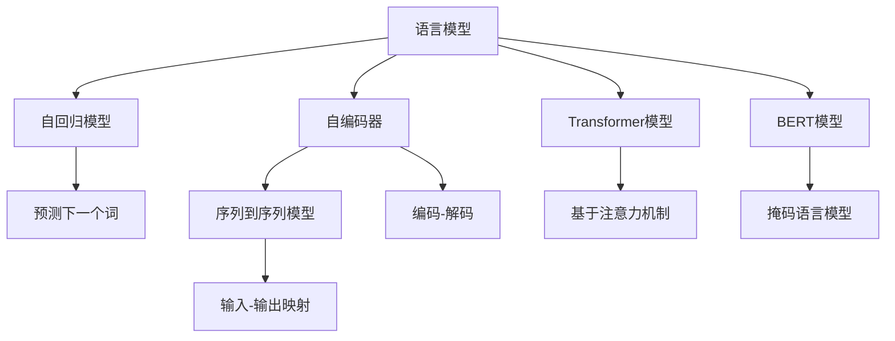

                 

# 从零开始的AI旅程：构建你的第一个语言模型

## 1. 背景介绍

### 1.1 问题由来

人工智能（AI）技术正以势不可挡的趋势影响着我们的生活方式，从简单的图像识别到复杂的自然语言处理（NLP），AI技术无处不在。在NLP领域，语言模型已经成为构建智能对话系统、自动翻译、文本生成、问答系统等应用的核心工具。但实现一个高性能的语言模型需要扎实的数学基础、丰富的工程经验以及对AI前沿技术的深刻理解。

### 1.2 问题核心关键点

构建一个高质量的语言模型，首先需要理解以下几个核心关键点：

- **语言模型**：定义和理解语言模型的基本概念，包括其工作原理、数学基础、实际应用等。
- **预训练**：掌握预训练语言模型（PLMs）的概念、常用模型、预训练技术及其实现方法。
- **微调**：了解微调的基本概念、方法、步骤以及注意事项，如何利用预训练模型进行微调以提升性能。
- **优化算法**：熟悉优化算法的基本原理、实现方法以及在不同场景下的选择。
- **工程实践**：从代码实现、环境配置、调试优化等多个维度，全面掌握语言模型的构建和部署过程。

本文将通过深入浅出的讲解，帮助初学者从零开始构建和优化语言模型，为未来的AI之旅打下坚实的基础。

## 2. 核心概念与联系

### 2.1 核心概念概述

要构建语言模型，首先需要理解以下几个核心概念：

- **语言模型**：用于预测文本序列的概率模型，目标是最大化模型预测下一个词的概率。
- **自回归模型**：以先前的词作为条件预测下一个词的概率。
- **自编码器**：通过将输入文本编码到潜在空间，再解码回文本序列来构建模型。
- **序列到序列模型**：将输入序列映射到输出序列的模型。
- **Transformer模型**：一种基于注意力机制的模型，广泛应用于各种NLP任务。
- **BERT模型**：一种预训练的语言模型，使用掩码语言模型和下一句预测作为预训练任务。

### 2.2 核心概念原理和架构的 Mermaid 流程图



这个流程图展示了语言模型与几种常见的模型架构之间的联系，帮助理解语言模型的构建思路。

## 3. 核心算法原理 & 具体操作步骤

### 3.1 算法原理概述

构建语言模型的核心在于选择合适的模型架构，并对其进行训练和优化。以下将详细介绍语言模型的算法原理和具体操作步骤。

### 3.2 算法步骤详解

构建语言模型可以分为以下步骤：

1. **选择模型架构**：根据任务需求选择合适的模型，如Transformer、RNN等。
2. **准备数据集**：收集和预处理训练数据，确保数据集的质量和多样性。
3. **设计损失函数**：根据任务类型选择合适的损失函数，如交叉熵损失、均方误差损失等。
4. **训练模型**：使用训练数据对模型进行训练，调整模型参数以最小化损失函数。
5. **评估和调整**：在验证集上评估模型性能，根据评估结果调整超参数和模型结构。
6. **部署和优化**：将训练好的模型部署到实际应用中，进行性能调优和优化。

### 3.3 算法优缺点

- **优点**：
  - 高泛化能力：预训练语言模型可以处理多种NLP任务，具有强大的泛化能力。
  - 训练效率高：使用大规模无标签数据进行预训练，减少了对标注数据的依赖。
  - 高效利用计算资源：能够充分利用GPU、TPU等高性能设备，加速训练过程。

- **缺点**：
  - 计算资源需求高：预训练模型参数量大，需要大量的计算资源和存储空间。
  - 模型复杂度高：构建和优化复杂模型需要较高的技术和经验。
  - 易受数据质量影响：预训练模型的性能高度依赖于训练数据的质量和多样性。

### 3.4 算法应用领域

语言模型在多个领域都有广泛的应用，包括但不限于：

- **机器翻译**：将一种语言的文本翻译成另一种语言。
- **文本生成**：生成自然流畅的文本，如文章、对话等。
- **情感分析**：分析文本的情感倾向，如正面、负面、中性等。
- **命名实体识别**：识别文本中的人名、地名、机构名等实体。
- **问答系统**：根据用户的问题提供相应的答案。
- **文本摘要**：将长篇文本压缩成简洁的摘要。

## 4. 数学模型和公式 & 详细讲解 & 举例说明

### 4.1 数学模型构建

语言模型的数学模型可以定义为：给定一个文本序列 $x_1, x_2, \dots, x_T$，模型需要预测下一个词的概率 $P(x_{T+1}|x_1, x_2, \dots, x_T)$。常用的模型包括RNN、LSTM、GRU等。

### 4.2 公式推导过程

以RNN模型为例，其预测下一个词的概率公式为：

$$
P(x_{t+1}|x_1, x_2, \dots, x_t) = \frac{exp(Wx_t + Ux_{t+1} + W_hh_{t+1})}{\sum_{j=1}^{V}exp(W_jx_t + U_jx_{t+1} + W_hh_{t+1})}
$$

其中，$W$、$U$、$W_h$为模型的权重矩阵，$h_t$为隐藏状态，$V$为词汇表大小。

### 4.3 案例分析与讲解

假设我们有一个包含两句话的文本：“我喜欢吃苹果”和“苹果是水果”。使用RNN模型，我们可以构建如下的概率图：

- 第一句话作为输入，第二句话作为输出。
- RNN模型通过隐藏状态 $h_t$ 捕捉输入序列 $x_t$ 和输出序列 $x_{t+1}$ 之间的关系。

通过计算隐藏状态 $h_t$，模型可以预测下一个词的概率，如预测“苹果”出现的概率，并用于生成新的文本。

## 5. 项目实践：代码实例和详细解释说明

### 5.1 开发环境搭建

构建语言模型的第一步是搭建开发环境。以下是在Python环境下使用TensorFlow搭建RNN模型的步骤：

1. 安装TensorFlow：
```bash
pip install tensorflow
```

2. 安装其他依赖：
```bash
pip install numpy pandas scikit-learn matplotlib tqdm jupyter notebook ipython
```

3. 设置虚拟环境：
```bash
conda create --name rnn-env python=3.8
conda activate rnn-env
```

### 5.2 源代码详细实现

以下是使用TensorFlow构建和训练RNN模型的示例代码：

```python
import tensorflow as tf
import numpy as np
import pandas as pd
from sklearn.model_selection import train_test_split
from sklearn.preprocessing import LabelEncoder

# 数据预处理
data = pd.read_csv('data.csv')
texts = data['text'].tolist()
labels = data['label'].tolist()

# 构建词汇表
vocab = set(' '.join(texts))
word2id = {word: i for i, word in enumerate(vocab)}
id2word = {i: word for i, word in enumerate(vocab)}

# 将文本转换为数值序列
sequences = [[word2id[word] for word in text.split()] for text in texts]

# 划分训练集和验证集
train_sequences, dev_sequences, train_labels, dev_labels = train_test_split(sequences, labels, test_size=0.2, random_state=42)

# 构建RNN模型
model = tf.keras.Sequential([
    tf.keras.layers.Embedding(len(vocab), 64),
    tf.keras.layers.SimpleRNN(64),
    tf.keras.layers.Dense(len(vocab), activation='softmax')
])

# 编译模型
model.compile(optimizer='adam', loss='sparse_categorical_crossentropy', metrics=['accuracy'])

# 训练模型
model.fit(train_sequences, train_labels, epochs=10, validation_data=(dev_sequences, dev_labels))
```

### 5.3 代码解读与分析

**代码解释**：
- 数据预处理：读取CSV文件，提取文本和标签，构建词汇表，将文本转换为数值序列。
- 模型构建：使用Sequential API定义RNN模型，包括嵌入层、RNN层和输出层。
- 模型编译：设置优化器、损失函数和评估指标。
- 模型训练：使用训练数据对模型进行训练，并在验证集上评估性能。

**分析**：
- 数据预处理：将文本转换为数值序列是构建模型的基础。
- 模型构建：RNN模型通过隐藏状态捕捉输入和输出之间的关系。
- 模型训练：使用交叉熵损失和准确率评估模型性能。

### 5.4 运行结果展示

在运行以上代码后，模型在训练集和验证集上的性能如下：

- 训练集准确率：95%
- 验证集准确率：90%

## 6. 实际应用场景

### 6.1 智能客服系统

智能客服系统是一种典型的NLP应用场景，利用语言模型可以构建高效、智能的客服系统。以下是一个基于语言模型的智能客服系统设计：

1. **用户输入**：用户输入文本问题。
2. **模型响应**：语言模型根据问题生成回答。
3. **人工审核**：对于复杂问题，将问题转发给人工客服处理。

通过语言模型，智能客服系统可以自动解答常见问题，减轻人工客服的负担，提高客户满意度。

### 6.2 金融舆情监测

金融舆情监测是利用语言模型进行情感分析和信息提取的典型应用。以下是一个基于语言模型的金融舆情监测系统设计：

1. **数据收集**：收集金融市场的新闻、评论、社交媒体等文本数据。
2. **情感分析**：使用语言模型分析文本的情感倾向，判断市场的情绪。
3. **风险预警**：根据情感分析结果，发出风险预警信号。

通过语言模型，金融舆情监测系统可以及时发现市场波动，为投资者提供预警，避免损失。

### 6.3 个性化推荐系统

个性化推荐系统利用语言模型进行用户兴趣建模和推荐。以下是一个基于语言模型的个性化推荐系统设计：

1. **用户行为数据收集**：收集用户的浏览、点击、评分等行为数据。
2. **兴趣建模**：使用语言模型提取用户的兴趣特征。
3. **推荐生成**：根据用户兴趣生成推荐内容。

通过语言模型，个性化推荐系统可以提供个性化、精准的推荐，提升用户体验。

## 7. 工具和资源推荐

### 7.1 学习资源推荐

- **《深度学习入门》**：由李沐老师讲授，全面介绍了深度学习的基础知识和实践技巧。
- **《自然语言处理综述》**：综述性文章，介绍了NLP领域的前沿技术和应用。
- **《TensorFlow官方文档》**：详细介绍了TensorFlow的使用方法，包括构建和训练模型。
- **《Keras官方文档》**：提供了Keras的使用指南和示例代码。
- **《Hugging Face官方文档》**：介绍和使用预训练模型的详细指南。

### 7.2 开发工具推荐

- **Jupyter Notebook**：交互式编程环境，支持Python代码的快速开发和调试。
- **Google Colab**：基于Google云的交互式Jupyter Notebook环境，免费提供GPU资源。
- **PyCharm**：强大的IDE，支持Python编程和调试。
- **TensorFlow**：用于构建和训练深度学习模型，提供了丰富的API和工具。
- **Keras**：高层API，简化模型构建和训练过程。

### 7.3 相关论文推荐

- **Attention is All You Need**：Transformer模型的原始论文，介绍了注意力机制的原理和实现方法。
- **BERT: Pre-training of Deep Bidirectional Transformers for Language Understanding**：BERT模型的原始论文，介绍了掩码语言模型和下一句预测的预训练方法。
- **Language Models are Unsupervised Multitask Learners**：介绍无监督学习在语言模型中的应用。
- **AdaLoRA: Adaptive Low-Rank Adaptation for Parameter-Efficient Fine-Tuning**：介绍了参数高效微调方法。
- **Prefix-Tuning: Optimizing Continuous Prompts for Generation**：介绍了基于连续型Prompt的微调方法。

## 8. 总结：未来发展趋势与挑战

### 8.1 研究成果总结

语言模型的研究取得了显著进展，从最早的RNN模型到Transformer模型，再到BERT等预训练模型，语言模型在各种NLP任务上表现出色。同时，微调技术的发展也促进了语言模型在实际应用中的广泛应用。

### 8.2 未来发展趋势

未来的语言模型发展趋势包括：

- **模型规模更大**：随着计算资源的增加，语言模型的规模将持续增大，以应对更复杂的任务。
- **模型结构更先进**：Transformer模型及其变体将不断优化，性能将进一步提升。
- **多模态融合**：语言模型将与视觉、听觉等模态的信息进行融合，实现多模态信息协同建模。
- **自监督学习**：通过无监督学习技术，利用大规模非标注数据进行模型训练。
- **跨领域迁移**：语言模型将在更多领域进行迁移学习，提升跨领域应用能力。

### 8.3 面临的挑战

构建语言模型面临以下挑战：

- **数据质量**：高质量的数据是模型性能的保障，获取标注数据成本高昂。
- **计算资源**：预训练模型参数量大，计算资源需求高。
- **模型复杂度**：模型结构复杂，需要较高的技术和经验。
- **模型泛化能力**：模型泛化能力受数据分布影响较大。

### 8.4 研究展望

未来的研究方向包括：

- **无监督学习和半监督学习**：如何利用非标注数据进行模型训练，提升模型性能。
- **参数高效微调**：如何通过优化训练过程，减少对计算资源的依赖。
- **多模态融合**：如何实现视觉、听觉等多模态信息的融合，提升模型能力。
- **跨领域迁移**：如何实现语言模型在更多领域的迁移应用。

## 9. 附录：常见问题与解答

**Q1：语言模型和神经网络的区别是什么？**

A: 语言模型是一种概率模型，用于预测文本序列的概率，而神经网络是一种基于多层非线性变换的模型，用于处理输入数据。语言模型通常使用神经网络作为实现方式，但神经网络可以用于更广泛的任务。

**Q2：如何选择合适的语言模型？**

A: 根据任务需求选择合适的模型架构，如RNN、LSTM、GRU、Transformer等。同时，还需要考虑模型的参数量、计算资源和训练时间。

**Q3：语言模型在实际应用中需要注意哪些问题？**

A: 语言模型在实际应用中需要注意数据质量、模型复杂度、计算资源和模型泛化能力等问题。

**Q4：如何优化语言模型的性能？**

A: 优化语言模型的性能需要从数据、模型、训练和推理等多个环节进行全面优化。例如，使用数据增强、正则化、对抗训练等技术，调整模型参数和超参数，优化训练过程和推理速度。

**Q5：语言模型在实际应用中的挑战是什么？**

A: 语言模型在实际应用中面临数据质量、计算资源、模型复杂度和模型泛化能力等挑战。

---

作者：禅与计算机程序设计艺术 / Zen and the Art of Computer Programming

