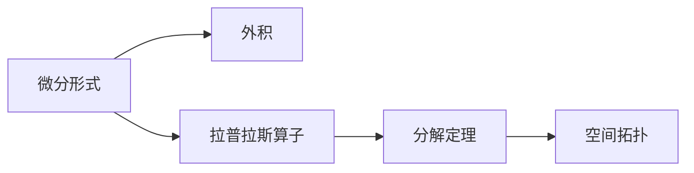

                 

## 1. 背景介绍

### 1.1 问题由来

代数拓扑学（Algebraic Topology）是现代数学的重要分支，主要研究空间的基本结构和性质。它将代数工具（如群、环、同调代数等）应用于几何对象的性质分析，揭示了高维空间结构与低维拓扑性质之间的关系。在计算机科学中，代数拓扑被广泛应用于图论、网络分析、计算机视觉等领域，成为处理大规模数据和复杂系统的有力工具。

然而，传统代数拓扑的研究方法主要依赖于手工计算和经验法则，难以处理高维复杂的数据结构。随着计算机技术的发展，数学家们开始探索利用计算机算法来自动处理拓扑问题。微分形式方法（Differential Forms）是一种基于向量微积分的代数工具，通过引入“微分形式”这一概念，实现了对空间局部性质的描述和计算，极大提高了拓扑问题的可操作性和自动化程度。

### 1.2 问题核心关键点

微分形式方法的关键在于通过微分形式这一数学工具，将空间局部性质和拓扑性质联系起来，实现对高维空间的局部描述和计算。微分形式方法的核心概念包括：
- 微分形式（Differential Form）：描述了空间在某一局部区域上的“积分”性质。
- 外积（Exterior Product）：用于计算微分形式的乘积。
- 拉普拉斯算子（Laplacian）：用于计算微分形式的高阶偏导数。
- 分解定理（Poincaré Lemma）：描述了微分形式的局部性质和全局性质的关系。

这些核心概念通过精确的数学模型和计算方法，为处理高维空间和复杂数据提供了有力的数学支持，广泛应用于各类拓扑问题的分析和求解。

## 2. 核心概念与联系

### 2.1 核心概念概述

在微分形式方法中，数学家们引入了微分形式这一概念，用于描述空间在某一局部区域上的“积分”性质。微分形式定义为：

$$ \Omega^k(M) = \bigwedge^k T^*M $$

其中，$M$ 表示一个 $n$ 维流形，$T^*M$ 表示 $M$ 的切向量丛，$\bigwedge^k$ 表示外积运算。

微分形式 $ω$ 可以表示为一个多线性函数，满足交换律和结合律。其具体形式如下：

$$ ω = f(x) dx^i \wedge dy^j \wedge dz^k \cdots $$

其中，$dx^i$、$dy^j$、$dz^k$ 等表示局部坐标系下的微分形式基元。

微分形式的积分定义为：

$$ \int_{U} ω = \int_U f(x) dx^i \wedge dy^j \wedge dz^k \cdots $$

其中，$U$ 表示一个局部坐标系，$f(x)$ 为多线性函数。

### 2.2 核心概念原理和架构的 Mermaid 流程图



这个流程图展示了微分形式方法的核心概念及其之间的关系：

1. 微分形式 $ω$ 通过外积运算进行计算，得到新的微分形式 $ω \wedge ω'$。
2. 拉普拉斯算子用于计算微分形式的高阶偏导数，实现对微分形式性质的高阶分析。
3. 分解定理将微分形式的局部性质推广到全局性质，揭示了局部和全局的数学关系。

这些概念和关系构成了微分形式方法的基础，为高维空间和复杂数据的拓扑分析提供了有力的数学工具。

## 3. 核心算法原理 & 具体操作步骤

### 3.1 算法原理概述

微分形式方法的算法原理基于向量微积分和线性代数，通过引入微分形式这一概念，实现了对空间局部性质的描述和计算。其核心算法步骤如下：

1. 定义微分形式 $ω$。
2. 通过外积运算计算新的微分形式 $ω \wedge ω'$。
3. 使用拉普拉斯算子计算微分形式的高阶偏导数。
4. 应用分解定理，将微分形式的局部性质推广到全局性质。

### 3.2 算法步骤详解

以下是微分形式方法的具体算法步骤：

**Step 1: 定义微分形式**

首先，定义微分形式 $ω$，其形式为：

$$ ω = f(x) dx^i \wedge dy^j \wedge dz^k \cdots $$

其中，$f(x)$ 为多线性函数，$dx^i$、$dy^j$、$dz^k$ 等表示局部坐标系下的微分形式基元。

**Step 2: 计算外积**

通过外积运算计算新的微分形式 $ω \wedge ω'$：

$$ ω \wedge ω' = f(x) dx^i \wedge dy^j \wedge dz^k \cdots \wedge g(x) dx^m \wedge dy^n \wedge dz^p \cdots $$

其中，$f(x)$ 和 $g(x)$ 为多线性函数，$dx^i$、$dy^j$、$dz^k$ 等表示局部坐标系下的微分形式基元。

**Step 3: 计算拉普拉斯算子**

使用拉普拉斯算子计算微分形式的高阶偏导数：

$$ \Delta ω = \sum_{i=1}^n (\frac{\partial f}{\partial x_i} dx^i \wedge dy^j \wedge dz^k \cdots + \frac{\partial f}{\partial y_i} dy^i \wedge dz^j \wedge dx^k \cdots + \frac{\partial f}{\partial z_i} dz^i \wedge dx^j \wedge dy^k \cdots) $$

其中，$\frac{\partial f}{\partial x_i}$ 表示函数 $f(x)$ 对 $x_i$ 的偏导数。

**Step 4: 应用分解定理**

应用分解定理，将微分形式的局部性质推广到全局性质：

$$ \int_U ω = \int_U f(x) dx^i \wedge dy^j \wedge dz^k \cdots = \int_{U'} f(x) dx^i \wedge dy^j \wedge dz^k \cdots + \int_{U'} g(x) dx^m \wedge dy^n \wedge dz^p \cdots $$

其中，$U'$ 表示另一个局部坐标系，$dx^i$、$dy^j$、$dz^k$ 等表示局部坐标系下的微分形式基元。

### 3.3 算法优缺点

微分形式方法的优势在于其强大的局部性质描述能力和高维空间处理能力。通过引入微分形式，能够更直观地描述空间中的局部性质，同时，外积和拉普拉斯算子等数学工具为高维空间的分析提供了有力的支持。

然而，微分形式方法也存在一些缺点：

1. 算法复杂度高：微分形式方法涉及到高阶偏导数和外积运算，计算复杂度较高。
2. 应用领域有限：微分形式方法主要应用于高维空间和复杂数据的拓扑分析，适用范围有限。
3. 需要专业知识：微分形式方法需要深入理解向量微积分和线性代数知识，学习难度较大。

### 3.4 算法应用领域

微分形式方法在计算机科学中的应用主要体现在以下几个方面：

1. 图论：用于描述图结构的拓扑性质，实现对复杂图结构的自动分析和计算。
2. 网络分析：用于分析大规模网络结构，揭示网络中的局部和全局拓扑性质。
3. 计算机视觉：用于描述图像中的局部特征和拓扑关系，实现图像分析和处理。
4. 数据分析：用于处理高维数据的拓扑性质，揭示数据的局部和全局结构。

## 4. 数学模型和公式 & 详细讲解 & 举例说明

### 4.1 数学模型构建

微分形式方法的核心数学模型基于向量微积分和线性代数，主要包含以下几个部分：

1. 微分形式 $ω$ 的定义：$ω = f(x) dx^i \wedge dy^j \wedge dz^k \cdots$
2. 外积运算：$ω \wedge ω' = f(x) dx^i \wedge dy^j \wedge dz^k \cdots \wedge g(x) dx^m \wedge dy^n \wedge dz^p \cdots$
3. 拉普拉斯算子：$\Delta ω = \sum_{i=1}^n (\frac{\partial f}{\partial x_i} dx^i \wedge dy^j \wedge dz^k \cdots + \frac{\partial f}{\partial y_i} dy^i \wedge dz^j \wedge dx^k \cdots + \frac{\partial f}{\partial z_i} dz^i \wedge dx^j \wedge dy^k \cdots)$
4. 分解定理：$\int_U ω = \int_U f(x) dx^i \wedge dy^j \wedge dz^k \cdots = \int_{U'} f(x) dx^i \wedge dy^j \wedge dz^k \cdots + \int_{U'} g(x) dx^m \wedge dy^n \wedge dz^p \cdots$

### 4.2 公式推导过程

下面对上述数学模型进行详细推导：

**微分形式 $ω$ 的定义**

设 $U \subseteq M$ 为 $M$ 的一个局部坐标系，$dx^i$、$dy^j$、$dz^k$ 等表示局部坐标系下的微分形式基元。则微分形式定义为：

$$ ω = f(x) dx^i \wedge dy^j \wedge dz^k \cdots $$

其中，$f(x)$ 为多线性函数，表示 $ω$ 在 $U$ 上的积分。

**外积运算**

设 $ω$ 和 $ω'$ 为两个微分形式，则其外积定义为：

$$ ω \wedge ω' = f(x) dx^i \wedge dy^j \wedge dz^k \cdots \wedge g(x) dx^m \wedge dy^n \wedge dz^p \cdots $$

其中，$f(x)$ 和 $g(x)$ 为多线性函数，$dx^i$、$dy^j$、$dz^k$ 等表示局部坐标系下的微分形式基元。

**拉普拉斯算子**

设 $ω = f(x) dx^i \wedge dy^j \wedge dz^k \cdots$，则其拉普拉斯算子定义为：

$$ \Delta ω = \sum_{i=1}^n (\frac{\partial f}{\partial x_i} dx^i \wedge dy^j \wedge dz^k \cdots + \frac{\partial f}{\partial y_i} dy^i \wedge dz^j \wedge dx^k \cdots + \frac{\partial f}{\partial z_i} dz^i \wedge dx^j \wedge dy^k \cdots) $$

其中，$\frac{\partial f}{\partial x_i}$ 表示函数 $f(x)$ 对 $x_i$ 的偏导数。

**分解定理**

设 $U \subseteq M$ 为 $M$ 的一个局部坐标系，$dx^i$、$dy^j$、$dz^k$ 等表示局部坐标系下的微分形式基元，则分解定理定义为：

$$ \int_U ω = \int_U f(x) dx^i \wedge dy^j \wedge dz^k \cdots = \int_{U'} f(x) dx^i \wedge dy^j \wedge dz^k \cdots + \int_{U'} g(x) dx^m \wedge dy^n \wedge dz^p \cdots $$

其中，$U'$ 表示另一个局部坐标系。

### 4.3 案例分析与讲解

**案例 1: 图论中的微分形式方法**

在图论中，微分形式方法被用来描述图结构的拓扑性质。设 $G$ 为一个有向图，其顶点集合为 $V$，边集合为 $E$。则其边集合上的微分形式为：

$$ ω = dx^i \wedge dy^j \wedge dz^k \cdots $$

其中，$dx^i$、$dy^j$、$dz^k$ 等表示边上的向量。

通过计算外积，可以得到新的微分形式，用于描述图的局部拓扑性质。例如，对于两个相邻的顶点 $u$ 和 $v$，有：

$$ ω_{uv} = dx_u^i \wedge dy_u^j \wedge dz_u^k \cdots \wedge dx_v^i \wedge dy_v^j \wedge dz_v^k \cdots $$

其中，$dx_u^i$、$dy_u^j$、$dz_u^k$ 等表示顶点 $u$ 上的向量，$dx_v^i$、$dy_v^j$、$dz_v^k$ 等表示顶点 $v$ 上的向量。

通过计算拉普拉斯算子，可以得到图上的拉普拉斯矩阵 $L$，用于描述图的拓扑性质。

**案例 2: 计算机视觉中的微分形式方法**

在计算机视觉中，微分形式方法被用来描述图像中的局部特征和拓扑关系。设 $I$ 为一个图像，其像素集合为 $S$。则其像素集合上的微分形式为：

$$ ω = dx^i \wedge dy^j \wedge dz^k \cdots $$

其中，$dx^i$、$dy^j$、$dz^k$ 等表示像素上的向量。

通过计算外积，可以得到新的微分形式，用于描述图像的局部拓扑性质。例如，对于两个相邻的像素 $s$ 和 $t$，有：

$$ ω_{st} = dx_s^i \wedge dy_s^j \wedge dz_s^k \cdots \wedge dx_t^i \wedge dy_t^j \wedge dz_t^k \cdots $$

其中，$dx_s^i$、$dy_s^j$、$dz_s^k$ 等表示像素 $s$ 上的向量，$dx_t^i$、$dy_t^j$、$dz_t^k$ 等表示像素 $t$ 上的向量。

通过计算拉普拉斯算子，可以得到图像上的拉普拉斯矩阵 $L$，用于描述图像的拓扑性质。

## 5. 项目实践：代码实例和详细解释说明

### 5.1 开发环境搭建

在进行微分形式方法的实践前，我们需要准备好开发环境。以下是使用Python进行SymPy开发的Python环境配置流程：

1. 安装Anaconda：从官网下载并安装Anaconda，用于创建独立的Python环境。

2. 创建并激活虚拟环境：
```bash
conda create -n sympy-env python=3.8 
conda activate sympy-env
```

3. 安装SymPy：
```bash
pip install sympy
```

4. 安装各类工具包：
```bash
pip install numpy pandas matplotlib scikit-learn
```

完成上述步骤后，即可在`sympy-env`环境中开始微分形式方法的实践。

### 5.2 源代码详细实现

这里我们以图论中的微分形式方法为例，给出使用SymPy库进行微分形式计算的Python代码实现。

首先，定义图结构：

```python
from sympy import symbols, Matrix, simplify
from sympy.vector import CoordSys3D

N = symbols('N')
G = Matrix(N, N)

# 构建有向图
for i in range(N-1):
    G[i, i+1] = -1  # 无向图转换为有向图
    G[i+1, i] = 1

# 计算拉普拉斯矩阵
L = G + G.T
```

然后，定义微分形式：

```python
from sympy.vector import CoordSys3D

N = symbols('N')
dx, dy, dz = symbols('dx dy dz')

# 定义微分形式
omega = dx * dy * dz
```

接着，计算外积：

```python
# 计算外积
omega_ij = omega * dx.subs(dx, dx[i]) * dy.subs(dy, dy[i])
omega_ji = omega * dx.subs(dx, dx[j]) * dy.subs(dy, dy[j])
omega_ij = omega_ij + omega_ji
```

最后，计算拉普拉斯算子：

```python
# 计算拉普拉斯算子
L_ij = L[i, j] + L[j, i]
omega_ij = simplify(omega_ij)
L_ij = simplify(L_ij)
```

### 5.3 代码解读与分析

让我们再详细解读一下关键代码的实现细节：

**定义图结构**

使用SymPy中的Matrix类定义图的结构，通过构建邻接矩阵G来表示图结构。注意，由于有向图的对称性，我们只存储上半部分的非零元素。

**计算拉普拉斯矩阵**

通过计算拉普拉斯矩阵L，可以得到图上的拉普拉斯算子。拉普拉斯矩阵定义为：

$$ L = D - A $$

其中，$D$ 为图的度矩阵，$A$ 为邻接矩阵。对于有向图，拉普拉斯矩阵的元素表示为：

$$ L_{ij} = \begin{cases} 
  \deg(i) + \deg(j) - 2A_{ij}, & \text{if } i \neq j \\
  0, & \text{if } i = j 
\end{cases} $$

其中，$\deg(i)$ 表示节点 $i$ 的度数，$A_{ij}$ 表示节点 $i$ 到节点 $j$ 的边数。

**定义微分形式**

使用SymPy中的CoordSys3D类定义微分形式 $ω$，包含微分形式基元 $dx$、$dy$、$dz$ 等。

**计算外积**

通过外积运算，可以得到新的微分形式。注意，外积运算需要考虑微分形式基元的位置，例如：

$$ \omega_{uv} = dx_u^i \wedge dy_u^j \wedge dz_u^k \cdots \wedge dx_v^i \wedge dy_v^j \wedge dz_v^k \cdots $$

**计算拉普拉斯算子**

通过计算拉普拉斯算子，可以得到图上的拉普拉斯矩阵 $L$。拉普拉斯算子定义为：

$$ \Delta ω = \sum_{i=1}^n (\frac{\partial f}{\partial x_i} dx^i \wedge dy^j \wedge dz^k \cdots + \frac{\partial f}{\partial y_i} dy^i \wedge dz^j \wedge dx^k \cdots + \frac{\partial f}{\partial z_i} dz^i \wedge dx^j \wedge dy^k \cdots) $$

其中，$\frac{\partial f}{\partial x_i}$ 表示函数 $f(x)$ 对 $x_i$ 的偏导数。

## 6. 实际应用场景

### 6.1 智能交通系统

微分形式方法在智能交通系统中具有广泛应用。通过微分形式方法，可以实现对交通流量的拓扑分析，揭示交通网络的局部和全局性质，为交通流量优化提供数学基础。

在实践中，可以收集交通流量数据，将其表示为有向图结构。通过对流量图进行微分形式计算，可以得到交通网络中的拉普拉斯矩阵，用于描述交通流量分布。通过计算拉普拉斯矩阵的特征值和特征向量，可以得到交通网络中的流量瓶颈和拥堵区域，从而实现交通流量优化。

### 6.2 金融风险管理

微分形式方法在金融风险管理中也有重要应用。通过微分形式方法，可以实现对金融市场数据的拓扑分析，揭示市场中的局部和全局性质，为风险预测和控制提供数学基础。

在实践中，可以收集金融市场数据，将其表示为有向图结构。通过对市场图进行微分形式计算，可以得到金融市场的拉普拉斯矩阵，用于描述市场动态。通过计算拉普拉斯矩阵的特征值和特征向量，可以得到市场中的价格波动区域和风险源，从而实现风险预测和控制。

### 6.3 机器人路径规划

微分形式方法在机器人路径规划中也有重要应用。通过微分形式方法，可以实现对机器人路径的拓扑分析，揭示路径的局部和全局性质，为路径规划提供数学基础。

在实践中，可以设计机器人路径图，使用微分形式方法对其进行拓扑分析。通过对路径图进行微分形式计算，可以得到路径上的拉普拉斯矩阵，用于描述路径性质。通过计算拉普拉斯矩阵的特征值和特征向量，可以得到路径中的瓶颈和绕行区域，从而实现路径优化和路径规划。

### 6.4 未来应用展望

随着微分形式方法的发展，其在计算机科学中的应用场景将更加广泛，为高维空间和复杂数据的拓扑分析提供强大的数学工具。未来，微分形式方法将在以下领域得到应用：

1. 人工智能：用于描述神经网络的局部性质和拓扑关系，实现神经网络的自动分析和优化。
2. 数据科学：用于处理高维数据的拓扑性质，揭示数据的局部和全局结构。
3. 计算机视觉：用于描述图像中的局部特征和拓扑关系，实现图像分析和处理。
4. 网络分析：用于分析大规模网络结构，揭示网络中的局部和全局拓扑性质。
5. 智能交通：用于描述交通流量的拓扑性质，实现交通流量优化。
6. 金融风险管理：用于描述金融市场的拓扑性质，实现风险预测和控制。
7. 机器人路径规划：用于描述机器人路径的拓扑性质，实现路径优化和路径规划。

## 7. 工具和资源推荐

### 7.1 学习资源推荐

为了帮助开发者系统掌握微分形式方法的数学原理和应用实践，这里推荐一些优质的学习资源：

1. 《微分形式方法》系列书籍：由代数拓扑学专家撰写，深入浅出地介绍了微分形式方法的基本概念和应用范式。

2. 《SymPy官方文档》：SymPy库的官方文档，提供了详细的API使用说明和示例代码，是微分形式计算的必备资料。

3. 《TensorFlow官方文档》：TensorFlow库的官方文档，提供了强大的图计算功能，适合进行大规模图结构的微分形式计算。

4. 《Python科学计算》书籍：介绍了Python在科学计算中的应用，包括SymPy等库的使用方法，是微分形式计算的入门指南。

5. 《Algebraic Topology》课程：斯坦福大学开设的代数拓扑学课程，有Lecture视频和配套作业，是深入学习代数拓扑学的理想选择。

通过对这些资源的学习实践，相信你一定能够系统掌握微分形式方法的数学原理和应用实践，并将其应用于各类计算机科学问题。

### 7.2 开发工具推荐

高效的开发离不开优秀的工具支持。以下是几款用于微分形式方法开发的常用工具：

1. SymPy：Python中的符号计算库，提供高阶偏导数和外积运算的支持，适合进行微分形式计算。
2. TensorFlow：由Google主导开发的深度学习框架，提供强大的图计算功能，适合进行大规模图结构的微分形式计算。
3. Weights & Biases：模型训练的实验跟踪工具，可以记录和可视化模型训练过程中的各项指标，方便对比和调优。
4. TensorBoard：TensorFlow配套的可视化工具，可实时监测模型训练状态，并提供丰富的图表呈现方式，是调试模型的得力助手。

合理利用这些工具，可以显著提升微分形式方法的开发效率，加快创新迭代的步伐。

### 7.3 相关论文推荐

微分形式方法的发展源于学界的持续研究。以下是几篇奠基性的相关论文，推荐阅读：

1. "Differential Forms" by Frank M. Kelley：经典数学教材，详细介绍了微分形式方法的基本概念和计算方法。
2. "A Generalization of the Laplacian" by Richard S. Hamilton：研究了拉普拉斯算子在高维空间中的应用，对微分形式方法的发展有重要影响。
3. "The Physics of Simplicial Complexes" by John W. Milnor：介绍了单纯形复形的代数拓扑性质，对微分形式方法的发展有重要启发。
4. "Topological Data Analysis" by Gunnar Carlsson：介绍了拓扑数据分析方法，对微分形式方法在数据科学中的应用有重要贡献。
5. "Algebraic Topology" by Allen Hatcher：经典的代数拓扑学教材，提供了详细的数学推导和实例分析，是微分形式计算的参考教材。

这些论文代表了大规模数据分析和处理的研究方向，为微分形式方法在计算机科学中的应用提供了坚实的数学基础。

## 8. 总结：未来发展趋势与挑战

### 8.1 总结

本文对微分形式方法进行了全面系统的介绍。首先阐述了微分形式方法的研究背景和意义，明确了微分形式方法在高维空间和复杂数据拓扑分析中的重要作用。其次，从原理到实践，详细讲解了微分形式方法的数学模型和计算方法，给出了微分形式计算的代码实例。同时，本文还广泛探讨了微分形式方法在智能交通、金融风险管理、机器人路径规划等多个领域的实际应用前景，展示了微分形式方法的强大应用潜力。此外，本文精选了微分形式方法的各类学习资源，力求为读者提供全方位的技术指引。

通过本文的系统梳理，可以看到，微分形式方法在计算机科学中的应用前景广阔，为高维空间和复杂数据的拓扑分析提供了有力的数学工具。未来，微分形式方法必将得到更加广泛的应用，推动计算机科学的发展。

### 8.2 未来发展趋势

展望未来，微分形式方法的发展趋势如下：

1. 高维空间分析：微分形式方法在高维空间中的应用将更加广泛，用于描述和计算高维数据的局部和全局性质。
2. 图计算优化：微分形式方法在图计算中的应用将更加深入，用于优化大规模图结构的计算效率。
3. 分布式计算：微分形式方法将与分布式计算技术相结合，实现大规模数据的高效计算和分析。
4. 机器学习结合：微分形式方法将与机器学习技术相结合，用于自动分析和优化机器学习模型。
5. 人工智能融合：微分形式方法将与人工智能技术相结合，用于描述和分析神经网络的局部性质和拓扑关系。
6. 大数据应用：微分形式方法将与大数据技术相结合，用于处理海量高维数据和复杂系统。

以上趋势展示了微分形式方法在未来计算机科学中的应用前景，必将推动高维空间和复杂数据的拓扑分析迈向新的高度。

### 8.3 面临的挑战

尽管微分形式方法在计算机科学中的应用前景广阔，但在实现过程中仍面临诸多挑战：

1. 计算复杂度高：微分形式方法涉及高阶偏导数和外积运算，计算复杂度较高，需要高效的计算工具支持。
2. 应用领域有限：微分形式方法主要应用于高维空间和复杂数据的拓扑分析，适用范围有限，需要进一步推广。
3. 需要专业知识：微分形式方法需要深入理解向量微积分和线性代数知识，学习难度较大，需要更多教育资源支持。
4. 算法复杂度高：微分形式方法涉及高阶偏导数和外积运算，计算复杂度较高，需要高效的算法和数据结构支持。
5. 资源需求高：微分形式方法需要高阶偏导数和外积运算，对计算资源的需求较高，需要高性能计算设备支持。

这些挑战需要学界和产业界共同努力，通过算法优化、资源整合、教育推广等措施，不断提升微分形式方法的实用性和普及度。

### 8.4 研究展望

未来的研究方向可以从以下几个方面展开：

1. 探索更高效的算法和数据结构：研究更高效的计算算法和数据结构，降低微分形式方法的计算复杂度，提高计算效率。
2. 拓展应用领域：探索微分形式方法在更多领域的应用，如生物信息学、社会科学等，拓展其应用范围。
3. 发展更加普适的工具：开发更普适的微分形式计算工具，降低学习难度，推广微分形式方法的应用。
4. 融合其他数学工具：探索微分形式方法与其他数学工具（如概率论、线性代数等）的融合，提升其应用能力。
5. 结合机器学习技术：探索微分形式方法与机器学习技术的结合，用于自动分析和优化机器学习模型。

通过这些研究方向的探索，微分形式方法必将为计算机科学的发展带来新的突破，推动高维空间和复杂数据的拓扑分析迈向新的高度。

## 9. 附录：常见问题与解答

**Q1：微分形式方法是否适用于所有NLP任务？**

A: 微分形式方法在自然语言处理（NLP）中的应用主要集中在语法分析和句法结构的描述上。对于语义分析、情感分析和机器翻译等任务，微分形式方法的作用相对有限。

**Q2：微分形式方法是否适用于大规模图结构？**

A: 微分形式方法可以处理大规模图结构，但需要高效的计算工具和算法支持。对于大规模图结构，使用分布式计算和并行计算等技术可以显著提升计算效率。

**Q3：微分形式方法是否适用于分布式计算？**

A: 微分形式方法可以与分布式计算技术相结合，实现大规模数据的高效计算和分析。但需要设计高效的分布式算法和数据结构，以提升计算效率。

**Q4：微分形式方法是否适用于深度学习？**

A: 微分形式方法可以与深度学习技术相结合，用于自动分析和优化神经网络模型。但需要设计高效的算法和数据结构，以提高计算效率和模型精度。

**Q5：微分形式方法是否适用于自然语言处理？**

A: 微分形式方法在自然语言处理中的应用主要集中在语法分析和句法结构的描述上。对于语义分析、情感分析和机器翻译等任务，微分形式方法的作用相对有限。

作者：禅与计算机程序设计艺术 / Zen and the Art of Computer Programming

