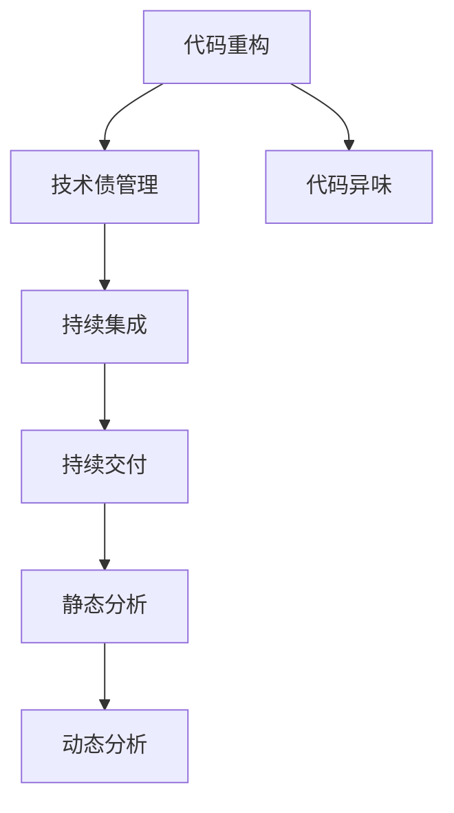

                 

# 代码重构与技术债管理原理与代码实战案例讲解

> 关键词：代码重构, 技术债管理, 软件架构设计, 持续集成, 静态分析, 持续交付

## 1. 背景介绍

### 1.1 问题由来
随着软件项目的规模不断扩大和时间的推移，代码库变得越来越庞大、复杂，维护成本也随之水涨船高。源代码中的bug、技术过时、质量问题、设计缺陷等逐渐累积，形成了所谓的"技术债"。技术债如果不及时偿还，将严重影响软件项目的健康和可持续发展。同时，频繁的修改和新增功能也使得代码重构变得迫切必要。

### 1.2 问题核心关键点
代码重构与技术债管理是软件开发中始终绕不开的话题，两者的关系紧密相连。正确理解代码重构的原理和实践方法，才能有效管理和降低技术债，提升代码质量和系统性能。

### 1.3 问题研究意义
通过系统学习代码重构与技术债管理，可以帮助开发者：

1. **提升代码质量**：重构能够优化代码结构，消除代码异味，提高代码的可读性、可维护性和可扩展性。
2. **降低维护成本**：减少技术债，避免未来的维护成本和潜在的风险。
3. **加速新功能开发**：通过重构，使代码更易于理解和修改，新功能的开发效率得以提升。
4. **促进团队协作**：清晰的代码结构和良好的重构实践，有助于团队协作和知识共享。
5. **确保系统可靠性**：有效的技术债管理可以避免由于技术债务累积引发的系统问题。

## 2. 核心概念与联系

### 2.1 核心概念概述

为更好地理解代码重构与技术债管理，本节将介绍几个密切相关的核心概念：

- **代码重构(Code Refactoring)**：在保持软件功能不变的前提下，改善软件的结构和实现，提升代码质量。常见的重构方式包括变量重命名、函数提取、类转换等。
- **技术债(Technical Debt)**：在开发过程中为快速交付而牺牲代码质量和系统性能，导致未来维护和扩展成本增加。常见的技术债来源包括代码异味、不完善的单元测试等。
- **代码异味(Smell)**：代码库中不易维护、可能存在问题的代码片段，如过长的方法、过深的继承层次等。代码异味往往预示着未来的技术债。
- **持续集成(Continuous Integration, CI)**：通过自动化集成和测试，保证代码变更的正确性，提高软件开发效率和质量。
- **持续交付(Continuous Delivery, CD)**：通过自动化流程，快速将代码变更交付到生产环境，加速新功能上线。
- **静态分析(Static Analysis)**：在代码编写过程中或编译之前，对代码进行形式化检查，识别潜在的质量问题。
- **动态分析(Dynamic Analysis)**：在程序运行时，通过工具对程序的执行行为进行监控和分析，发现性能问题和漏洞。

这些核心概念之间的逻辑关系可以通过以下Mermaid流程图来展示：



这个流程图展示了大语言模型的核心概念及其之间的关系：

1. 代码重构用于改善代码质量，减少代码异味，从而降低技术债。
2. 持续集成和持续交付能够提高开发效率和代码质量，防止新技术债的产生。
3. 静态分析和动态分析能够识别和预防质量问题，降低技术债累积的风险。

这些概念共同构成了代码重构与技术债管理的整体框架，确保软件项目的长期健康和稳定。

## 3. 核心算法原理 & 具体操作步骤
### 3.1 算法原理概述

代码重构与技术债管理涉及多个方面的算法和工具，包括静态分析工具、代码重构工具、持续集成平台等。其核心思想是通过自动化工具和人工干预，持续监控和优化代码库，避免新技术债的产生，并逐步偿还现有技术债。

### 3.2 算法步骤详解

代码重构与技术债管理的完整流程包括以下几个关键步骤：

**Step 1: 确定重构目标**

首先需要明确重构的目标，例如：优化代码结构、消除代码异味、提升测试覆盖率等。

**Step 2: 设计重构方案**

根据目标，设计具体的重构方案。例如，将长函数拆分为多个短函数，提取共用的代码模块等。

**Step 3: 编写重构代码**

编写重构代码，确保新代码满足重构目标，且不引入新的问题。

**Step 4: 自动化重构**

利用自动化工具进行代码重构，减少人工操作和引入错误的风险。例如，使用JSDoc进行Java代码的文档注释，使用JSLint进行JavaScript代码的格式化和检查。

**Step 5: 集成和测试**

将重构代码集成到现有代码库，并运行单元测试和集成测试，确保重构代码的正确性。

**Step 6: 持续监控和维护**

建立持续集成和持续交付流程，定期对代码库进行自动化检测和重构，监控技术债累积情况。

**Step 7: 反馈和优化**

根据监控结果和测试反馈，持续优化重构方案和工具，提升重构效果。

### 3.3 算法优缺点

代码重构与技术债管理具有以下优点：
1. 提升代码质量：通过重构，改善代码结构和实现，减少代码异味，提高可读性和可维护性。
2. 降低维护成本：重构能够提前发现和修复问题，减少未来的维护成本和风险。
3. 加速功能开发：优化后的代码库更加易于理解和修改，新功能的开发效率得以提升。
4. 促进团队协作：清晰的代码结构和良好的重构实践，有助于团队协作和知识共享。

同时，该方法也存在一定的局限性：
1. 短期成本高：重构初期需要投入大量时间和精力，但长期来看能够显著提升开发效率和代码质量。
2. 自动化工具有限：虽然有很多优秀的重构工具和静态分析工具，但并不是所有代码异味和问题都能够自动检测和解决。
3. 需要持续维护：重构不是一劳永逸的，需要持续监控和维护，防止新问题的产生。
4. 存在技术风险：错误的重构操作可能会引入新的问题，需要谨慎处理。

尽管存在这些局限性，但就目前而言，代码重构与技术债管理仍是软件项目中不可或缺的一部分，需要开发者在系统级别进行全面考虑和持续优化。

### 3.4 算法应用领域

代码重构与技术债管理技术广泛应用在软件开发和维护的各个阶段，具体包括：

- **初期设计**：在设计阶段就考虑代码异味和可维护性，选择合适的设计模式和架构风格。
- **编码阶段**：在编码过程中，利用静态分析和自动化工具进行代码检测和重构，减少技术债的积累。
- **测试阶段**：在测试过程中，通过持续集成和持续交付流程，快速发现和修复问题，防止新技术债的产生。
- **运维阶段**：在运维过程中，利用动态分析和监控工具，定期重构代码，优化系统性能和稳定性。

## 4. 数学模型和公式 & 详细讲解 & 举例说明

### 4.1 数学模型构建

代码重构与技术债管理技术一般不涉及复杂的数学模型，但在实际应用中，可能需要对代码质量和系统性能进行量化评估。例如，可以使用代码异味指标、测试覆盖率、部署时间等来衡量软件项目的健康程度。

### 4.2 公式推导过程

代码重构与技术债管理涉及的公式较少，主要集中在代码质量的度量上。例如，可以使用McCabe的Cyclomatic Complexity来度量代码的复杂度，公式如下：

$$
Cyclomatic\ Complexity = E - N + 2P - M
$$

其中，$E$ 为表达式数量，$N$ 为控制结构的数量，$P$ 为流程点数量，$M$ 为方法数量。

### 4.3 案例分析与讲解

假设某软件项目的某个模块的Cyclomatic Complexity为20，说明该模块存在一定的复杂度，需要进一步分析其代码结构和实现方式，以确定重构的方向。

## 5. 项目实践：代码实例和详细解释说明

### 5.1 开发环境搭建

在进行代码重构与技术债管理实践前，我们需要准备好开发环境。以下是使用Python进行Jenkins CI/CD流程的配置流程：

1. 安装Jenkins Server：从官网下载并安装Jenkins Server，确保服务器硬件配置满足运行需求。
2. 安装Jenkins Plugin：安装必要的Jenkins插件，如Maven Plugin、Junit Plugin等，支持Java和Junit项目的自动化构建和测试。
3. 配置Jenkins Pipeline：编写Pipeline脚本，定义代码构建、测试和部署的自动化流程。
4. 集成静态分析工具：集成SonarQube等静态分析工具，实现代码质量自动检测和分析。
5. 配置持续集成：配置Jenkins CI/CD流程，确保每次代码变更自动触发构建和测试，并在Jenkins Dashboard中显示监控结果。

完成上述步骤后，即可在Jenkins环境中进行代码重构与技术债管理的实践。

### 5.2 源代码详细实现

这里我们以Java代码重构为例，给出使用SonarQube进行代码质量检测和重构的Jenkins Pipeline代码实现。

```groovy
pipeline {
    agent any
    stages {
        stage('Build') {
            steps {
                // 编译代码
                withJava() {
                    sh 'mvn clean compile'
                }
            }
        }
        stage('Test') {
            steps {
                // 运行单元测试
                withJava() {
                    sh 'mvn test'
                }
            }
        }
        stage('Static Analysis') {
            steps {
                // 运行静态分析
                withJava() {
                    sh 'mvn org.sonarsource.sonar-java:sonar-java-cli:2.3.0:sonar-java-analyze -Dsonar.sources=src/main/java -Dsonar.java.binDir=/path/to/bin -Dsonar.host.url=http://localhost:9000'
                }
            }
        }
        stage('Refactor') {
            steps {
                // 执行代码重构
                withJava() {
                    sh 'mvn clean package'
                }
            }
        }
    }
}
```

这个Pipeline代码实现包括以下步骤：

1. 在Build阶段，编译代码，确保编译成功。
2. 在Test阶段，运行单元测试，确保测试通过。
3. 在Static Analysis阶段，利用SonarQube进行静态分析，生成代码质量报告。
4. 在Refactor阶段，执行代码重构，生成优化后的代码。

### 5.3 代码解读与分析

让我们再详细解读一下关键代码的实现细节：

**Pipeline脚本**：
- 使用Jenkins Pipeline语法，定义代码构建、测试和重构的自动化流程。
- 在Pipeline的每个阶段中，利用Jenkins的withJava()命令运行Java代码，并在每个步骤中执行具体的Shell命令。

**静态分析命令**：
- 使用SonarQube命令行工具，指定源代码目录、二进制目录和SonarQube服务器地址，启动静态分析。
- SonarQube能够检测代码异味、未使用的代码、安全漏洞等问题，并生成详细的报告。

**代码重构命令**：
- 在Refactor阶段，执行Maven编译命令，重新编译代码。
- 由于重构可能改变代码结构，因此需要在CI/CD流程中执行编译命令，确保重构后的代码能够正常运行。

**持续集成结果展示**：
- Jenkins Pipeline在每个阶段完成后，会自动将测试和静态分析结果发布到Jenkins Dashboard，开发者可以实时查看项目的状态和质量问题。
- 通过持续集成和持续交付流程，及时发现和解决代码问题，提升项目开发效率和质量。

### 5.4 运行结果展示

在配置完成后，每次代码变更都会自动触发Jenkins Pipeline的执行。通过观察Jenkins Dashboard中的构建结果和静态分析报告，开发者可以实时了解代码的质量和重构效果。

## 6. 实际应用场景
### 6.1 企业级Java应用

在大型企业级Java应用中，代码重构与技术债管理是确保系统稳定和高效的重要手段。通过持续集成和持续交付流程，企业可以确保新功能的快速上线，同时通过静态分析和动态分析工具，持续监控代码质量，及时发现和解决潜在问题。

### 6.2 开源软件项目

开源软件项目通常涉及大量的代码贡献和维护，通过代码重构与技术债管理，可以提升项目的代码质量和社区协作效率。例如，Apache Maven项目通过持续集成和静态分析工具，确保代码变更的正确性和稳定性，同时通过代码重构，提升项目的可读性和可维护性。

### 6.3 移动应用开发

移动应用开发项目通常需要在较短的时间内推出多个版本，代码重构与技术债管理技术可以有效提高开发效率和代码质量。例如，使用SonarQube等工具，对移动应用代码进行静态分析，提升代码质量和安全，同时通过持续集成和持续交付流程，确保每次变更的正确性。

## 7. 工具和资源推荐
### 7.1 学习资源推荐

为了帮助开发者系统掌握代码重构与技术债管理技术，这里推荐一些优质的学习资源：

1. 《Clean Code: A Handbook of Agile Software Craftsmanship》书籍：由Robert C. Martin编写，详细介绍了如何编写可读性强的代码，并提出了常见的代码异味和重构策略。
2. 《Refactoring: Improving the Design of Existing Code》书籍：由Martin Fowler编写，系统介绍了代码重构的基本原则和具体方法。
3. 《Jenkins User Guide》书籍：由Bruce Williams编写，全面介绍了Jenkins的使用和配置方法，是Jenkins实践的必备资料。
4. 《SonarQube Official Documentation》文档：由SonarQube官方提供，包含丰富的使用案例和最佳实践，是静态分析的权威指南。
5. 《Continuous Delivery: Reliable Software Releases through Build, Test, and Deploy Automation》书籍：由Jez Humble和David Farley编写，介绍了持续集成和持续交付的理论和实践方法。

通过对这些资源的学习实践，相信你一定能够快速掌握代码重构与技术债管理的精髓，并用于解决实际的开发问题。
###  7.2 开发工具推荐

高效的开发离不开优秀的工具支持。以下是几款用于代码重构与技术债管理开发的常用工具：

1. Jenkins：一个开源的持续集成和持续交付平台，支持多语言和框架，能够高效地自动化构建和测试流程。
2. SonarQube：一个开源的静态代码分析工具，支持多种编程语言，能够全面检测代码异味、未使用的代码等质量问题。
3. IntelliJ IDEA：一个集成了静态分析、重构和代码提示功能的Java IDE，能够辅助开发者进行高效的代码重构和质量管理。
4. Git：一个流行的版本控制系统，能够高效地管理和协作代码变更。
5. Maven：一个流行的Java项目管理工具，能够自动构建、测试和打包项目。

合理利用这些工具，可以显著提升代码重构与技术债管理任务的开发效率，加快创新迭代的步伐。

### 7.3 相关论文推荐

代码重构与技术债管理技术的发展源于学界的持续研究。以下是几篇奠基性的相关论文，推荐阅读：

1. Refactoring: Improving the Design of Existing Code by Martin Fowler：提出了代码重构的基本原则和具体方法，是重构领域的经典之作。
2. Software Architecture in Practice: Architecture, Design and Evolution by Jonathan Warnell：详细介绍了软件架构的设计和演进，提供了系统化的架构管理方案。
3. Software Architecture: Principles, Patterns, and Practices by Mark Richards：介绍了软件架构的基本原理和设计模式，强调了架构在重构中的重要作用。
4. Technical Debt: A Survey of the Literature by Matthias Felleisen：系统总结了技术债的研究现状和理论基础，为技术债管理提供了理论指导。
5. Continuous Delivery: Reliable Software Releases through Build, Test, and Deploy Automation by Jez Humble和David Farley：介绍了持续集成和持续交付的理论和实践方法，是CD领域的经典之作。

这些论文代表了大语言模型微调技术的发展脉络。通过学习这些前沿成果，可以帮助研究者把握学科前进方向，激发更多的创新灵感。

## 8. 总结：未来发展趋势与挑战
### 8.1 总结

本文对代码重构与技术债管理技术进行了全面系统的介绍。首先阐述了代码重构与技术债管理的技术背景和意义，明确了重构在提升代码质量和降低技术债方面的独特价值。其次，从原理到实践，详细讲解了代码重构与技术债管理的数学原理和关键步骤，给出了代码质量检测和重构的完整代码实例。同时，本文还广泛探讨了代码重构与技术债管理在企业级应用、开源软件项目和移动应用开发等多个领域的应用前景，展示了该技术的广泛应用潜力。

通过本文的系统梳理，可以看到，代码重构与技术债管理技术正在成为软件开发中的重要范式，极大地提升了代码库的质量和开发效率。未来的研究需要在代码异味检测、自动化重构、持续集成等方面进行更多的探索和创新。

### 8.2 未来发展趋势

展望未来，代码重构与技术债管理技术将呈现以下几个发展趋势：

1. 自动化重构技术将进一步提升，减少人工干预，提高重构效率和质量。例如，使用机器学习算法辅助代码重构，自动检测和修复代码异味。
2. 静态分析技术将更加智能，通过深度学习和自然语言处理技术，实现更全面和准确的代码异味检测和分析。
3. 持续集成和持续交付流程将更加完善，通过DevOps实践，提升代码变更的自动化和效率。
4. 跨平台和跨语言的代码质量管理将更加普及，通过统一的标准和工具，实现代码质量的一致性和可比性。
5. 与代码异味检测和代码重构相结合的IDE将出现，提供更全面和智能的代码开发支持。

以上趋势凸显了代码重构与技术债管理技术的广阔前景。这些方向的探索发展，必将进一步提升软件开发的质量和效率，为软件项目的长期健康和稳定提供保障。

### 8.3 面临的挑战

尽管代码重构与技术债管理技术已经取得了显著成效，但在迈向更加智能化、普适化应用的过程中，它仍面临着诸多挑战：

1. 自动化工具的局限性。虽然现有工具能够检测和修复部分代码异味，但仍然存在许多复杂的问题需要人工干预。
2. 重构方案的选择。重构方案的选择需要综合考虑业务需求、代码质量、开发效率等多个因素，难以在短时间内找到最优方案。
3. 技术债的累积。在快速交付需求下，技术债的累积难以完全避免，如何有效管理技术债，避免未来的高维护成本，仍需持续探索。
4. 跨团队协作的困难。在大型项目中，代码库涉及多个团队，如何统一代码标准和重构规范，提升团队协作效率，仍需进一步优化。
5. 重构效果的验证。重构效果的评估和验证需要时间和精力，如何客观评估重构效果，提升重构的科学性和有效性，仍需深入研究。

这些挑战需要开发者在系统级别进行全面考虑和持续优化，才能真正实现代码重构与技术债管理的理想效果。

### 8.4 研究展望

面向未来，代码重构与技术债管理技术需要在以下几个方面寻求新的突破：

1. 探索更多自动化重构技术和工具，减少人工干预，提升重构效率和质量。
2. 结合深度学习和自然语言处理技术，提升静态分析和动态分析的智能化水平，实现更全面和准确的代码异味检测和分析。
3. 研究更多跨平台和跨语言的代码质量管理方法，提升代码一致性和可比性。
4. 在持续集成和持续交付流程中，引入更多自动化和智能化工具，提升开发效率和代码质量。
5. 探索更多重构效果的验证方法，客观评估重构效果，提升重构的科学性和有效性。

这些研究方向的探索，必将引领代码重构与技术债管理技术迈向更高的台阶，为软件开发的质量和效率提供更坚实的保障。只有勇于创新、敢于突破，才能不断拓展技术债管理技术的边界，推动软件开发技术的进步。

## 9. 附录：常见问题与解答

**Q1：什么是代码异味？**

A: 代码异味是指代码库中不易维护、可能存在问题的代码片段，例如过长的方法、过深的继承层次等。代码异味通常预示着未来的技术债，需要进行及时重构。

**Q2：如何进行代码重构？**

A: 代码重构需要系统性的规划和执行。首先，明确重构目标，然后设计具体的重构方案，编写重构代码，最后通过自动化工具进行重构。重构过程中需要注意不要引入新的问题，确保重构后的代码功能不变。

**Q3：如何管理技术债？**

A: 技术债管理需要持续监控和优化。建立持续集成和持续交付流程，定期对代码库进行自动化检测和重构，监控技术债累积情况。同时，通过重构和自动化工具，逐步偿还现有技术债，避免未来的高维护成本。

**Q4：如何评估重构效果？**

A: 重构效果的评估需要结合多种指标，例如代码质量、测试覆盖率、运行时间等。可以通过自动化工具生成重构前后的比较报告，客观评估重构效果。

**Q5：如何处理重构过程中出现的问题？**

A: 重构过程中可能会遇到各种问题，例如编译错误、测试失败等。需要及时发现和解决问题，确保重构的顺利进行。同时，可以通过分阶段的重构方案，逐步推进重构过程。

---

作者：禅与计算机程序设计艺术 / Zen and the Art of Computer Programming

