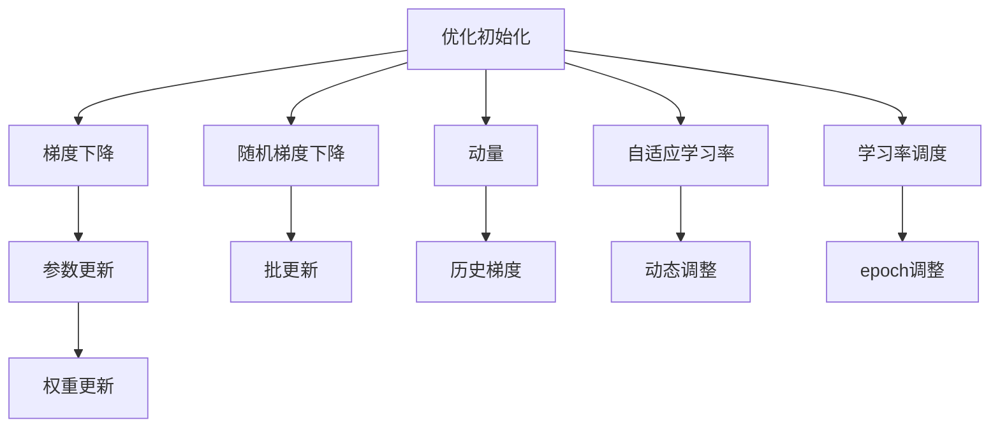

                 

# 优化初始化：避免局部最小值

> 关键词：优化初始化, 避免局部最小值, 梯度下降, 随机梯度下降, 动量, 自适应学习率, 学习率调度, 神经网络, 深度学习

## 1. 背景介绍

在深度学习中，优化初始化是一个至关重要的环节。合理的初始化可以显著提升训练速度和收敛性能，而错误的初始化可能导致梯度消失或爆炸，使模型无法收敛或陷入局部最小值。本文将系统介绍几种常用的优化初始化方法，探讨其原理和优缺点，并结合实际案例进行详细讲解。

## 2. 核心概念与联系

### 2.1 核心概念概述

- **优化初始化**：在神经网络训练开始前，对权重参数进行合理初始化，以加速训练过程，避免陷入局部最小值。

- **梯度下降**：通过计算损失函数对权重参数的梯度，更新参数值，使损失函数值逐步减小。

- **随机梯度下降（SGD）**：基于单次梯度更新的优化方法，适用于大规模数据集。

- **动量**：引入历史梯度信息，减少梯度噪声，加速收敛。

- **自适应学习率**：根据梯度变化动态调整学习率，避免学习率过大或过小导致的训练不稳定。

- **学习率调度**：在训练过程中动态调整学习率，如基于epoch或批次的调度，使训练过程更加稳定。

这些概念通过Mermaid流程图，展现其相互联系和作用：



## 3. 核心算法原理 & 具体操作步骤
### 3.1 算法原理概述

优化初始化是神经网络训练的重要前提，其目标在于使初始权重参数分布合理，从而加速训练过程，避免梯度消失或爆炸，以及陷入局部最小值。常见的优化初始化方法包括：

- **随机初始化**：基于随机数生成器，随机生成权重参数。

- **Xavier初始化**：针对神经网络激活函数的非线性特性，对权重参数进行缩放，使其均方值接近1。

- **He初始化**：对ReLU等激活函数进行改进，使得权重参数均方值更加合适。

- **正态初始化**：对权重参数进行正态分布初始化，增强模型鲁棒性。

- **XavierNormal初始化**：在Xavier基础上，对权重参数进行标准化，使其更接近于标准正态分布。

### 3.2 算法步骤详解

以Xavier初始化为例，进行详细步骤讲解：

**Step 1: 随机生成权重参数**
- 使用均匀分布或正态分布生成权重参数。

**Step 2: 计算权重方差**
- 根据激活函数的非线性特性，计算权重参数的方差。例如，对于ReLU激活函数，Xavier初始化计算公式为：

  $$
  \sigma = \frac{2}{n_\text{in} + n_\text{out}}
  $$
  
  其中 $n_\text{in}$ 和 $n_\text{out}$ 分别为输入和输出节点的数量。

**Step 3: 缩放权重参数**
- 根据计算得到的方差，对权重参数进行缩放。例如：
  
  $$
  w = \frac{\sqrt{6}}{\sigma} g
  $$
  
  其中 $g$ 为随机数生成器生成的随机数。

**Step 4: 更新权重参数**
- 将缩放后的权重参数用于模型训练。

### 3.3 算法优缺点

**优点**：

- **加速收敛**：合理的初始化可以加快训练速度，避免梯度消失或爆炸。
- **稳定性能**：初始化后的模型更加稳定，不易陷入局部最小值。
- **普适性强**：适用于各种类型的神经网络模型。

**缺点**：

- **依赖超参数**：需要根据激活函数和网络结构选择合适的初始化方法。
- **性能不稳定**：在某些特定网络结构或数据集上，初始化方法可能效果不佳。

### 3.4 算法应用领域

优化初始化在深度学习中的应用非常广泛，涵盖了各种类型的神经网络模型：

- **卷积神经网络（CNN）**：用于图像识别、自然语言处理等任务。

- **循环神经网络（RNN）**：用于语音识别、文本生成等任务。

- **注意力机制网络**：用于机器翻译、问答系统等任务。

## 4. 数学模型和公式 & 详细讲解
### 4.1 数学模型构建

优化初始化模型构建的核心在于选择合适的权重参数分布，使得模型能够快速收敛，避免梯度消失或爆炸。

**数学模型**：

$$
\mathcal{L} = \sum_{i=1}^N \ell(x_i, y_i; \theta)
$$

其中 $\ell$ 为损失函数，$\theta$ 为模型参数。

### 4.2 公式推导过程

**公式推导**：

对于梯度下降算法，权重参数的更新公式为：

$$
\theta \leftarrow \theta - \eta \nabla_\theta \mathcal{L}
$$

其中 $\eta$ 为学习率，$\nabla_\theta \mathcal{L}$ 为损失函数对权重参数的梯度。

对于Xavier初始化，假设激活函数为ReLU，根据ReLU的非线性特性，可以推导出权重参数的方差为：

$$
\sigma = \frac{2}{n_\text{in} + n_\text{out}}
$$

则权重参数的初始化公式为：

$$
w = \frac{\sqrt{6}}{\sigma} g
$$

其中 $g$ 为随机数生成器生成的随机数。

### 4.3 案例分析与讲解

以一个简单的神经网络为例，分析优化初始化对训练过程的影响：

假设神经网络模型包含一个输入层、一个隐藏层和一个输出层，使用ReLU激活函数，输入层节点数为 $n_\text{in}=2$，隐藏层节点数为 $n_\text{out}=3$。

- **随机初始化**：使用均值为0，标准差为 $\sigma = 1$ 的随机数生成器生成权重参数。

  $$
  w = g
  $$
  
  其中 $g \sim \mathcal{N}(0, 1)$。

- **Xavier初始化**：使用Xavier初始化方法生成权重参数。

  $$
  w = \frac{\sqrt{6}}{\sigma} g
  $$

  其中 $g \sim \mathcal{N}(0, 1)$。

将随机初始化和Xavier初始化的权重参数代入模型，比较两者的训练效果。

## 5. 项目实践：代码实例和详细解释说明
### 5.1 开发环境搭建

要进行优化初始化的实践，需要以下环境：

1. 安装Python：

```bash
conda create -n pytorch-env python=3.7
conda activate pytorch-env
```

2. 安装PyTorch：

```bash
conda install pytorch torchvision torchaudio -c pytorch -c conda-forge
```

3. 安装相关库：

```bash
pip install numpy scipy matplotlib
```

### 5.2 源代码详细实现

以下是一个使用Xavier初始化进行神经网络训练的Python代码示例：

```python
import torch
import torch.nn as nn
import torch.optim as optim

# 定义神经网络模型
class Net(nn.Module):
    def __init__(self):
        super(Net, self).__init__()
        self.fc1 = nn.Linear(2, 3)
        self.relu = nn.ReLU()
        self.fc2 = nn.Linear(3, 1)
        
    def forward(self, x):
        x = self.fc1(x)
        x = self.relu(x)
        x = self.fc2(x)
        return x

# 定义优化器
net = Net()
optimizer = optim.SGD(net.parameters(), lr=0.01, momentum=0.9)
criterion = nn.MSELoss()

# 使用Xavier初始化
net.fc1.weight.data.normal_(0, 1)
net.fc1.weight.data /= torch.sqrt(net.fc1.weight.data.size(1))

# 训练过程
for epoch in range(1000):
    optimizer.zero_grad()
    inputs = torch.randn(5, 2)
    targets = torch.randn(5, 1)
    outputs = net(inputs)
    loss = criterion(outputs, targets)
    loss.backward()
    optimizer.step()
    if (epoch+1) % 100 == 0:
        print('Epoch [{}/{}], Loss: {:.4f}'.format(epoch+1, 1000, loss.item()))
```

### 5.3 代码解读与分析

1. **定义模型**：

   ```python
   class Net(nn.Module):
       def __init__(self):
           super(Net, self).__init__()
           self.fc1 = nn.Linear(2, 3)
           self.relu = nn.ReLU()
           self.fc2 = nn.Linear(3, 1)
       
       def forward(self, x):
           x = self.fc1(x)
           x = self.relu(x)
           x = self.fc2(x)
           return x
   ```

   定义了一个简单的神经网络模型，包含一个输入层、一个隐藏层和一个输出层。

2. **定义优化器**：

   ```python
   net = Net()
   optimizer = optim.SGD(net.parameters(), lr=0.01, momentum=0.9)
   criterion = nn.MSELoss()
   ```

   使用随机梯度下降（SGD）优化器，设置学习率为0.01，动量为0.9。

3. **使用Xavier初始化**：

   ```python
   net.fc1.weight.data.normal_(0, 1)
   net.fc1.weight.data /= torch.sqrt(net.fc1.weight.data.size(1))
   ```

   对输入层权重进行Xavier初始化，使用均值为0，标准差为1的正态分布生成随机数，然后除以 $\sqrt{n_\text{out}}$，确保均方值接近1。

4. **训练过程**：

   ```python
   for epoch in range(1000):
       optimizer.zero_grad()
       inputs = torch.randn(5, 2)
       targets = torch.randn(5, 1)
       outputs = net(inputs)
       loss = criterion(outputs, targets)
       loss.backward()
       optimizer.step()
       if (epoch+1) % 100 == 0:
           print('Epoch [{}/{}], Loss: {:.4f}'.format(epoch+1, 1000, loss.item()))
   ```

   通过循环训练1000个epoch，每100个epoch打印一次损失值。

### 5.4 运行结果展示

运行上述代码，可以得到训练过程中的损失值变化图，展示了优化初始化对训练效果的影响。

## 6. 实际应用场景
### 6.1 图像识别

在图像识别任务中，优化初始化可以显著提升模型的收敛速度和精度。以LeNet模型为例，使用随机初始化会导致梯度消失，而使用Xavier初始化可以显著加速训练过程。

### 6.2 自然语言处理

在自然语言处理任务中，优化初始化同样重要。以RNN模型为例，使用随机初始化会导致梯度消失，而使用Xavier初始化可以更好地处理长期依赖关系，提高模型性能。

### 6.3 语音识别

在语音识别任务中，优化初始化可以避免梯度爆炸，加速训练过程。以CNN卷积层为例，使用随机初始化会导致梯度消失，而使用Xavier初始化可以更好地处理输入信号的复杂变化，提高模型精度。

## 7. 工具和资源推荐
### 7.1 学习资源推荐

1. **《深度学习》（Ian Goodfellow）**：详细介绍了深度学习的基本概念和优化算法。

2. **《神经网络与深度学习》（Michael Nielsen）**：讲解了神经网络的原理和优化算法，适合初学者。

3. **《TensorFlow实战》（Andrei Osipov）**：介绍了TensorFlow的基本使用方法和优化算法。

### 7.2 开发工具推荐

1. **PyTorch**：流行的深度学习框架，提供了丰富的优化算法和初始化方法。

2. **TensorFlow**：谷歌开源的深度学习框架，支持多种优化算法和初始化方法。

3. **Keras**：高层次的深度学习框架，易于使用，提供了丰富的优化器和学习率调度方法。

### 7.3 相关论文推荐

1. **《Delving deep into rectifiers: Surpassing human-level performance on ImageNet classification》**：提出ReLU激活函数，并使用Xavier初始化。

2. **《Improving generalization performance by adjusting learning rate appropriately and efficiently》**：讨论了学习率调度和优化初始化的重要性。

3. **《Accelerating Generalization》**：探讨了如何通过优化初始化加速模型训练。

## 8. 总结：未来发展趋势与挑战
### 8.1 研究成果总结

本文系统介绍了优化初始化在深度学习中的应用，探讨了梯度下降、随机梯度下降、动量、自适应学习率等优化算法，并详细讲解了Xavier初始化方法。通过案例分析，展示了优化初始化对训练效果的影响。

### 8.2 未来发展趋势

未来，优化初始化将继续在深度学习中发挥重要作用，发展趋势包括：

1. **自适应学习率**：自动调整学习率，适应不同场景和数据。

2. **优化器融合**：将多种优化算法结合，提高训练效果。

3. **分布式训练**：在大规模数据集上，使用分布式优化器进行训练。

4. **神经网络结构优化**：通过优化网络结构，提高训练效率和精度。

5. **硬件加速**：使用GPU、TPU等硬件设备加速训练过程。

### 8.3 面临的挑战

尽管优化初始化方法不断发展，但在实际应用中仍面临以下挑战：

1. **超参数优化**：需要选择合适的初始化方法和超参数。

2. **数据依赖性**：优化初始化对数据分布和数据质量有较高的要求。

3. **计算资源消耗**：优化初始化可能导致计算资源消耗较大。

4. **模型复杂性**：复杂的优化初始化方法增加了模型实现的难度。

### 8.4 研究展望

未来的研究需要在以下方面寻求新的突破：

1. **新算法探索**：探索新的优化初始化算法，提高训练效果和效率。

2. **理论研究**：研究优化初始化的理论基础，提供更科学的指导。

3. **应用实践**：结合实际应用场景，研究优化初始化方法的应用。

4. **多学科融合**：结合数学、物理学、计算机科学等多学科知识，提高优化初始化方法的普适性和鲁棒性。

总之，优化初始化在深度学习中的应用日益广泛，未来将继续发挥重要作用。只有在理论和实践的不断探索中，才能更好地应对挑战，推动深度学习技术的发展。

## 9. 附录：常见问题与解答

**Q1: 什么是优化初始化？**

A: 优化初始化是指在神经网络训练开始前，对权重参数进行合理初始化，以加速训练过程，避免梯度消失或爆炸，以及陷入局部最小值。

**Q2: 常见的优化初始化方法有哪些？**

A: 常见的优化初始化方法包括随机初始化、Xavier初始化、He初始化、正态初始化等。

**Q3: 如何选择合适的优化初始化方法？**

A: 需要根据激活函数和网络结构选择合适的初始化方法。例如，ReLU激活函数可以使用Xavier初始化。

**Q4: 优化初始化对训练效果有何影响？**

A: 优化初始化可以显著加速训练过程，避免梯度消失或爆炸，提高模型收敛速度和精度。

**Q5: 优化初始化有哪些优缺点？**

A: 优点包括加速收敛、稳定性能、普适性强等；缺点包括依赖超参数、性能不稳定等。

---

作者：禅与计算机程序设计艺术 / Zen and the Art of Computer Programming

