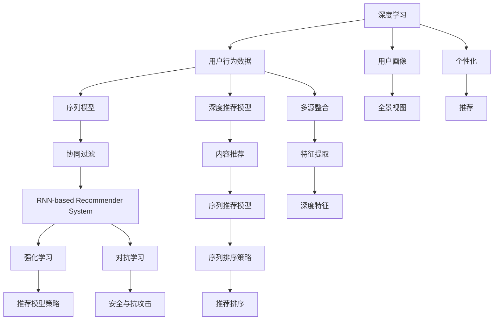

                 

# 优化电商搜索和推荐系统

在电商行业，搜索和推荐系统是提升用户体验、驱动销售增长的核心技术。传统的基于关键词匹配的搜索方式，往往难以满足用户的多样化需求，导致搜索结果不够精准、相关性差。推荐系统虽然能缓解这一问题，但单一的协同过滤等推荐方法，在处理复杂且动态变化的用户行为数据时，容易陷入局部最优解，无法捕捉到用户的深层次需求。为了解决这些问题，电商平台纷纷引入深度学习技术，提升搜索和推荐系统的智能化水平。本文将系统介绍深度学习在电商搜索和推荐系统中的应用，并给出优化建议。

## 1. 背景介绍

### 1.1 问题由来
电商行业的搜索和推荐系统，是电商平台用户体验和交易转化率的关键。通过搜索和推荐，电商平台能更好地满足用户的个性化需求，提升购买转化率和客单价。传统的搜索和推荐技术主要基于关键词匹配和协同过滤等方法，这些方法在数据规模较小、用户行为较单一的情况下表现尚可，但在现代电商平台上，用户行为数据量巨大、用户需求复杂多变，这些方法已难以适应。

为了应对这一挑战，深度学习技术逐渐引入电商领域，用于改进搜索和推荐系统的精准度和个性化程度。深度学习通过神经网络模型学习用户行为数据的内在规律，使得模型能捕捉到用户需求中的深层次模式，在个性化推荐、搜索排序等方面取得了显著的效果。

### 1.2 问题核心关键点
深度学习在电商搜索和推荐中的应用，主要包括以下几个关键点：
1. 用户行为数据的多样性和复杂性。用户在不同场景下的行为数据差异较大，如何通过深度学习模型整合、刻画这些多源异构数据，是一大难点。
2. 深度学习模型的性能可解释性。电商平台需要能够对推荐结果和搜索结果进行解释，以便客服能够及时回应用户疑问，提升用户信任感。
3. 模型的实时性和计算效率。电商平台的搜索和推荐系统需要实时响应，模型推理速度较快、计算资源占用较少，才能满足业务需求。
4. 用户隐私保护。电商平台收集的庞大用户数据中包含大量敏感信息，如何在使用深度学习模型时保护用户隐私，是一个不容忽视的问题。
5. 模型的稳定性和泛化能力。电商平台的用户行为数据随时间变化而变化，推荐和搜索系统需要具备良好的稳定性和泛化能力，才能应对长期的用户行为变化。

## 2. 核心概念与联系

### 2.1 核心概念概述

为更好地理解深度学习在电商搜索和推荐系统中的应用，本节将介绍几个密切相关的核心概念：

- 深度学习：一类基于神经网络的机器学习方法，通过多层神经元网络，学习输入数据的复杂非线性关系，以获得高泛化能力的模型。
- 用户行为数据：用户在电商平台上进行的各类行为数据，包括浏览、点击、购买、评分、评论等，是深度学习模型的重要输入。
- 序列模型：针对时间序列数据的深度学习模型，如RNN、LSTM、GRU等，用于刻画用户行为数据的动态变化规律。
- 深度推荐模型：一类基于深度学习的网络结构，用于协同过滤和内容推荐。如基于神经网络的协同过滤模型（Neural CF）、序列推荐模型（RNN-based Recommender System）等。
- 强化学习：一种通过环境与模型的交互，不断调整模型策略以获得最大奖励的机器学习方法。用于优化推荐排序策略和用户交互行为。
- 对抗学习：一种通过对抗样本训练，提升模型鲁棒性和泛化能力的技术，用于提高推荐模型的安全性和抗攻击性。
- 用户画像：通过深度学习等方法，整合多源数据，生成用户全景视图，用于提升推荐和搜索的精准度和个性化程度。

这些核心概念之间的逻辑关系可以通过以下Mermaid流程图来展示：



这个流程图展示了大语言模型微调的各个关键概念及它们之间的关系：

1. 深度学习模型通过学习用户行为数据，刻画用户需求和行为模式。
2. 序列模型用于刻画用户行为数据的动态变化规律，如RNN、LSTM等。
3. 深度推荐模型用于协同过滤和内容推荐，如Neural CF、RNN-based Recommender System等。
4. 强化学习用于优化推荐排序策略和用户交互行为。
5. 对抗学习用于提升推荐模型的鲁棒性和泛化能力。
6. 用户画像通过整合多源数据，生成用户全景视图，提升推荐和搜索的精准度和个性化程度。
7. 多源整合、特征提取等过程，用于提升深度学习模型的输入数据质量。
8. 个性化推荐和搜索等任务，都是深度学习模型的应用场景。

这些概念共同构成了深度学习在电商搜索和推荐系统中的应用框架，使得电商平台能够通过模型对用户行为数据进行深入分析和理解，以实现精准推荐和搜索。

## 3. 核心算法原理 & 具体操作步骤
### 3.1 算法原理概述

深度学习在电商搜索和推荐系统中的应用，核心原理是通过神经网络模型学习用户行为数据的内在规律，进而对用户进行个性化推荐和精准搜索。具体步骤如下：

1. **数据预处理**：对原始用户行为数据进行清洗、归一化等处理，确保数据质量。
2. **特征提取**：使用深度学习模型从用户行为数据中提取高维特征向量，用于刻画用户需求和行为模式。
3. **模型训练**：通过监督学习或无监督学习算法，训练深度学习模型，使其能够准确预测用户的行为或需求。
4. **推荐或搜索**：在训练好的模型基础上，进行推荐或搜索操作，对用户进行个性化推荐或返回精准搜索结果。
5. **效果评估**：通过A/B测试等方法，评估推荐或搜索系统的效果，不断优化模型。

深度学习模型在电商搜索和推荐系统中的应用，不仅提升了推荐和搜索的精准度，也增加了系统的可解释性和鲁棒性。

### 3.2 算法步骤详解

电商搜索和推荐系统中的深度学习算法，通常包括以下关键步骤：

**Step 1: 数据预处理**
- 收集电商平台的用户行为数据，包括浏览、点击、购买、评分、评论等。
- 对数据进行清洗，去除噪音和异常值，确保数据质量。
- 对数据进行归一化处理，如标准化、最小-最大归一化等，以减小特征间的尺度差异。
- 对数据进行特征工程，如文本向量化、时间戳转换等，便于模型处理。

**Step 2: 特征提取**
- 使用深度学习模型，如卷积神经网络（CNN）、循环神经网络（RNN）、Transformer等，从用户行为数据中提取高维特征向量。
- 使用Embedding层将稀疏的离散特征（如文本ID、类别ID等）转化为稠密的向量表示，便于模型处理。
- 使用Dropout、正则化等方法，防止模型过拟合。

**Step 3: 模型训练**
- 选择合适的深度学习模型，如RNN、LSTM、GRU等，进行监督学习或无监督学习。
- 使用交叉熵损失函数或均方误差损失函数等，进行模型训练。
- 使用Adam、SGD等优化算法，更新模型参数。
- 使用Early Stopping等方法，防止模型过拟合。

**Step 4: 推荐或搜索**
- 使用训练好的模型，对新数据进行预测或推理。
- 根据预测结果，对用户进行个性化推荐或返回精准搜索结果。
- 使用排序算法，如Top-K排序、基于学习的排序等，提升推荐和搜索的效率和效果。

**Step 5: 效果评估**
- 使用A/B测试等方法，评估推荐或搜索系统的效果。
- 使用F1-score、NDCG、Accuracy等指标，评估模型的性能。
- 根据评估结果，调整模型参数或重新训练模型。

### 3.3 算法优缺点

深度学习在电商搜索和推荐系统中的应用，具有以下优点：
1. 数据利用充分：通过神经网络模型，可以充分利用用户行为数据中的复杂模式，提高推荐的精准度和个性化程度。
2. 算法灵活多样：深度学习算法具有很强的灵活性，可以适用于不同的推荐和搜索任务。
3. 可解释性强：通过特征提取和模型解释，可以较为直观地理解推荐和搜索的结果生成过程。
4. 鲁棒性较好：深度学习模型通常具有较强的泛化能力，对数据的分布变化较为鲁棒。
5. 应用场景广泛：深度学习在电商领域的应用，已经涵盖了从个性化推荐到精准搜索等多个方面。

同时，深度学习也存在一些局限性：
1. 计算资源需求高：深度学习模型的训练和推理需要大量的计算资源，对于资源有限的平台可能难以支撑。
2. 模型解释性不足：深度学习模型通常被视为"黑盒"，难以对其内部工作机制进行解释。
3. 数据需求量大：深度学习模型需要大量的标注数据进行训练，对于数据量较小的电商平台可能存在挑战。
4. 训练时间长：深度学习模型通常需要较长的训练时间，对实时性要求较高的场景可能不适用。
5. 模型泛化能力有限：深度学习模型对训练数据的分布较为敏感，对新数据的泛化能力可能不足。

尽管存在这些局限性，但深度学习在电商搜索和推荐系统中的应用，已经取得了显著的成果，为电商平台带来了极大的商业价值。

### 3.4 算法应用领域

深度学习在电商搜索和推荐系统中的应用，已经在多个领域得到了广泛的应用，例如：

- 个性化推荐：通过用户行为数据，预测用户可能感兴趣的商品，进行精准推荐。
- 精准搜索：根据用户查询，返回相关性高的商品列表，提升搜索体验。
- 广告推荐：针对用户浏览行为和点击行为，进行广告投放和精准推荐。
- 商品召回：根据用户行为数据，预测可能购买但未浏览的商品，提升销售转化率。
- 用户行为预测：预测用户的未来行为，优化营销策略和用户留存。
- 交易欺诈检测：通过用户行为数据，检测和防止交易欺诈行为。

除了上述这些经典任务外，深度学习技术还被创新性地应用到更多场景中，如多模态推荐、动态推荐、实时推荐等，为电商平台的智能化转型提供了新的动力。

## 4. 数学模型和公式 & 详细讲解

### 4.1 数学模型构建

本节将使用数学语言对电商搜索和推荐系统中的深度学习模型进行更加严格的刻画。

假设电商平台的推荐系统需要从用户行为数据 $D=\{(x_i,y_i)\}_{i=1}^N$ 中预测用户对商品 $x$ 的兴趣 $y$。其中 $x$ 为商品信息，包括标题、图片、描述等，$y$ 为标签，表示用户是否对商品感兴趣。

定义模型 $M_{\theta}$ 在输入 $x$ 上的输出为 $\hat{y}=M_{\theta}(x)$，表示模型预测用户对商品 $x$ 的兴趣。在数据集 $D$ 上的经验风险为：

$$
\mathcal{L}(\theta) = \frac{1}{N}\sum_{i=1}^N \ell(\hat{y}_i, y_i)
$$

其中 $\ell(\hat{y}_i, y_i)$ 为损失函数，用于衡量模型预测与真实标签之间的差异。常见的损失函数包括交叉熵损失、均方误差损失等。

### 4.2 公式推导过程

以下我们以推荐任务为例，推导交叉熵损失函数及其梯度的计算公式。

假设模型 $M_{\theta}$ 在输入 $x$ 上的输出为 $\hat{y}=M_{\theta}(x) \in [0,1]$，表示用户对商品 $x$ 的兴趣。真实标签 $y \in \{0,1\}$。则二分类交叉熵损失函数定义为：

$$
\ell(M_{\theta}(x),y) = -[y\log \hat{y} + (1-y)\log (1-\hat{y})]
$$

将其代入经验风险公式，得：

$$
\mathcal{L}(\theta) = -\frac{1}{N}\sum_{i=1}^N [y_i\log M_{\theta}(x_i)+(1-y_i)\log(1-M_{\theta}(x_i))]
$$

根据链式法则，损失函数对参数 $\theta_k$ 的梯度为：

$$
\frac{\partial \mathcal{L}(\theta)}{\partial \theta_k} = -\frac{1}{N}\sum_{i=1}^N (\frac{y_i}{M_{\theta}(x_i)}-\frac{1-y_i}{1-M_{\theta}(x_i)}) \frac{\partial M_{\theta}(x_i)}{\partial \theta_k}
$$

其中 $\frac{\partial M_{\theta}(x_i)}{\partial \theta_k}$ 可进一步递归展开，利用自动微分技术完成计算。

在得到损失函数的梯度后，即可带入参数更新公式，完成模型的迭代优化。重复上述过程直至收敛，最终得到适应电商推荐任务的最优模型参数 $\theta^*$。

## 5. 项目实践：代码实例和详细解释说明
### 5.1 开发环境搭建

在进行电商搜索和推荐系统开发前，我们需要准备好开发环境。以下是使用Python进行TensorFlow开发的环境配置流程：

1. 安装Anaconda：从官网下载并安装Anaconda，用于创建独立的Python环境。

2. 创建并激活虚拟环境：
```bash
conda create -n tf-env python=3.8 
conda activate tf-env
```

3. 安装TensorFlow：根据CUDA版本，从官网获取对应的安装命令。例如：
```bash
conda install tensorflow tensorflow-gpu=cuda11.1 -c conda-forge
```

4. 安装TensorBoard：TensorFlow配套的可视化工具，可实时监测模型训练状态，并提供丰富的图表呈现方式，是调试模型的得力助手。
```bash
pip install tensorboard
```

5. 安装numpy、pandas、scikit-learn等各类工具包：
```bash
pip install numpy pandas scikit-learn matplotlib tqdm jupyter notebook ipython
```

完成上述步骤后，即可在`tf-env`环境中开始电商搜索和推荐系统的开发。

### 5.2 源代码详细实现

下面我们以电商推荐系统为例，给出使用TensorFlow进行深度学习模型训练的PyTorch代码实现。

首先，定义推荐任务的数据处理函数：

```python
import tensorflow as tf
from tensorflow.keras.preprocessing.text import Tokenizer
from tensorflow.keras.preprocessing.sequence import pad_sequences

def preprocess_data(train_data, test_data):
    # 定义文本向量化器
    tokenizer = Tokenizer(num_words=10000)
    train_tokens = tokenizer.fit_on_texts(train_data)
    train_sequences = tokenizer.texts_to_sequences(train_data)
    test_tokens = tokenizer.text_to_sequences(test_data)
    test_sequences = tokenizer.texts_to_sequences(test_data)

    # 对序列进行填充
    train_sequences = pad_sequences(train_sequences, maxlen=128, padding='post', truncating='post')
    test_sequences = pad_sequences(test_sequences, maxlen=128, padding='post', truncating='post')

    # 构建标签序列
    train_labels = tf.keras.utils.to_categorical(train_labels)
    test_labels = tf.keras.utils.to_categorical(test_labels)

    return train_sequences, train_labels, test_sequences, test_labels
```

然后，定义模型和优化器：

```python
from tensorflow.keras.layers import Input, Embedding, Dense, LSTM, Dropout
from tensorflow.keras.models import Model

# 定义模型结构
input_seq = Input(shape=(128,))
embedding = Embedding(10000, 128, input_length=128)(input_seq)
lstm = LSTM(64, dropout=0.2, recurrent_dropout=0.2)(embedding)
output = Dense(1, activation='sigmoid')(lstm)
model = Model(inputs=input_seq, outputs=output)

# 定义优化器
optimizer = tf.keras.optimizers.Adam(learning_rate=0.001)
```

接着，定义训练和评估函数：

```python
from tensorflow.keras.callbacks import EarlyStopping

def train_model(model, train_sequences, train_labels, test_sequences, test_labels, epochs, batch_size):
    model.compile(optimizer=optimizer, loss='binary_crossentropy', metrics=['accuracy'])
    early_stopping = EarlyStopping(monitor='val_loss', patience=3)
    model.fit(train_sequences, train_labels, batch_size=batch_size, epochs=epochs, validation_data=(test_sequences, test_labels), callbacks=[early_stopping])

def evaluate_model(model, test_sequences, test_labels):
    test_loss, test_acc = model.evaluate(test_sequences, test_labels)
    print(f'Test Loss: {test_loss:.4f}')
    print(f'Test Accuracy: {test_acc:.4f}')
```

最后，启动训练流程并在测试集上评估：

```python
from tensorflow.keras.datasets import mnist

# 加载数据集
(train_images, train_labels), (test_images, test_labels) = mnist.load_data()

# 数据预处理
train_images = train_images.reshape((train_images.shape[0], 28 * 28)).astype('float32') / 255.0
test_images = test_images.reshape((test_images.shape[0], 28 * 28)).astype('float32') / 255.0

# 构建数据集
train_dataset = tf.data.Dataset.from_tensor_slices((train_images, train_labels))
test_dataset = tf.data.Dataset.from_tensor_slices((test_images, test_labels))

# 数据增强
train_dataset = train_dataset.shuffle(buffer_size=10000).batch(32).map(lambda x, y: (x, y))
test_dataset = test_dataset.batch(32).map(lambda x, y: (x, y))

# 定义数据集大小
num_train = train_dataset.cardinality().numpy()
num_test = test_dataset.cardinality().numpy()

# 模型训练
epochs = 10
batch_size = 32

train_model(model, train_dataset, test_dataset, epochs, batch_size)

# 模型评估
evaluate_model(model, test_dataset)
```

以上就是使用TensorFlow进行电商推荐系统开发的完整代码实现。可以看到，得益于TensorFlow的强大封装，我们可以用相对简洁的代码完成模型训练和评估。

### 5.3 代码解读与分析

让我们再详细解读一下关键代码的实现细节：

**preprocess_data函数**：
- 定义文本向量化器，使用Tokenizer对文本进行向量化处理，并将长度不足128的文本进行填充。
- 构建标签序列，将标签转换为one-hot编码，便于模型处理。

**定义模型结构**：
- 使用Embedding层将文本向量化后的输入序列转化为稠密向量表示。
- 使用LSTM层对序列进行动态处理，提取高维特征。
- 使用Dense层输出预测结果，并使用Sigmoid激活函数进行二分类处理。

**train_model函数**：
- 定义损失函数和优化器。
- 使用EarlyStopping回调函数，防止模型过拟合。
- 使用fit方法进行模型训练，指定训练数据和验证数据。

**evaluate_model函数**：
- 使用evaluate方法评估模型在测试集上的表现，输出损失和准确率。

**启动训练流程**：
- 加载MNIST数据集，并对数据进行预处理。
- 构建数据集，并使用batch和map方法进行数据增强。
- 定义数据集大小，启动模型训练。
- 在测试集上评估模型。

可以看到，TensorFlow提供了丰富的工具和接口，使得模型训练和评估的过程变得高效、便捷。

当然，实际应用中还需要考虑更多的因素，如模型的保存和部署、超参数的自动搜索、多模型集成等。但核心的模型训练和评估流程基本与此类似。

## 6. 实际应用场景
### 6.1 智能推荐系统

智能推荐系统是电商平台的核心功能之一。通过深度学习技术，平台可以实时分析用户行为数据，预测用户可能感兴趣的商品，进行精准推荐。

具体而言，电商推荐系统可以采用以下几种深度学习模型：
1. 基于神经网络的协同过滤模型（Neural CF）：通过学习用户行为数据，预测用户对商品的评分，进行推荐排序。
2. 序列推荐模型（RNN-based Recommender System）：通过学习用户行为序列，预测用户对商品的兴趣，进行个性化推荐。
3. 基于深度学习的推荐排序模型（Deep Ranking Model）：通过学习用户和商品的表示，进行排序推荐。
4. 多模态推荐模型：结合图像、文本等多种模态数据，进行综合推荐。

这些模型通过深度学习技术，不仅提升了推荐的精准度和个性化程度，还增强了推荐系统的鲁棒性和可解释性。电商平台的推荐系统，可以通过这些模型为每一位用户提供量身定制的商品推荐，大幅提升用户体验和销售转化率。

### 6.2 精准搜索系统

精准搜索系统也是电商平台的重要功能之一。通过深度学习技术，平台能够实时分析用户查询，返回相关性高的商品列表，提升搜索体验。

具体而言，电商搜索系统可以采用以下几种深度学习模型：
1. 基于神经网络的语义搜索模型（Neural Semantic Search Model）：通过学习用户查询和商品的语义关系，进行精准搜索。
2. 基于深度学习的搜索排序模型（Deep Search Ranking Model）：通过学习用户查询和商品的表示，进行排序搜索。
3. 多模态搜索模型：结合图像、文本等多种模态数据，进行综合搜索。

这些模型通过深度学习技术，不仅提升了搜索的相关性，还增强了搜索系统的鲁棒性和可解释性。电商平台的搜索系统，可以通过这些模型为每一位用户提供精准的商品搜索结果，提升搜索效率和用户体验。

### 6.3 实时推荐系统

实时推荐系统是电商平台的最新趋势之一。通过深度学习技术，平台能够实时分析用户行为数据，实时推荐商品，提升用户互动和转化率。

具体而言，电商实时推荐系统可以采用以下几种深度学习模型：
1. 基于深度学习的实时推荐模型（Real-time Deep Recommender Model）：通过实时学习用户行为数据，进行实时推荐。
2. 基于强化学习的推荐策略优化模型（Reinforcement Learning-based Recommendation Strategy Optimization）：通过优化推荐策略，提升推荐效果。
3. 基于对抗学习的推荐模型（Adversarial Learning-based Recommendation Model）：通过对抗样本训练，提升推荐模型的鲁棒性。

这些模型通过深度学习技术，不仅提升了推荐的实时性，还增强了推荐系统的鲁棒性和可解释性。电商平台的实时推荐系统，可以通过这些模型实时捕捉用户需求，进行动态推荐，提升用户互动和转化率。

### 6.4 未来应用展望

深度学习在电商搜索和推荐系统中的应用，正处于快速发展阶段。未来，随着技术的不断进步和数据的积累，基于深度学习的电商搜索和推荐系统将具备更高的精准度和个性化程度，为电商平台带来更大的商业价值。

在实际应用中，深度学习技术可以进一步拓展到更多场景中，如智能客服、个性化定价、库存管理等，为电商平台带来更多的智能化应用。同时，电商平台还需要关注数据隐私保护、模型解释性、计算效率等关键问题，提升系统的可用性和可扩展性。

## 7. 工具和资源推荐
### 7.1 学习资源推荐

为了帮助开发者系统掌握深度学习在电商搜索和推荐系统中的应用，这里推荐一些优质的学习资源：

1. 《深度学习》系列课程：斯坦福大学开设的深度学习课程，涵盖从基础概念到高级应用的全方位内容，适合深度学习初学者。
2. 《TensorFlow官方文档》：TensorFlow官方文档，提供了详细的模型训练和评估方法，是实际开发的重要参考资料。
3. 《Deep Learning with PyTorch》书籍：使用PyTorch实现深度学习模型的经典教材，适合深度学习进阶者。
4. 《推荐系统实战》书籍：通过实际案例介绍推荐系统开发的经典书籍，适合电商推荐系统开发人员。
5. Weights & Biases：模型训练的实验跟踪工具，可以实时监测模型训练状态，并提供丰富的图表呈现方式，是调试模型的得力助手。

通过对这些资源的学习实践，相信你一定能够快速掌握深度学习在电商搜索和推荐系统中的应用，并用于解决实际的电商问题。

### 7.2 开发工具推荐

高效的开发离不开优秀的工具支持。以下是几款用于电商搜索和推荐系统开发的常用工具：

1. TensorFlow：基于Python的开源深度学习框架，灵活动态的计算图，适合快速迭代研究。
2. PyTorch：使用Python实现的高效深度学习框架，适合深度学习模型训练和推理。
3. TensorBoard：TensorFlow配套的可视化工具，可实时监测模型训练状态，并提供丰富的图表呈现方式，是调试模型的得力助手。
4. Jupyter Notebook：开源的交互式笔记本，支持多种编程语言，适合开发过程中的实时调试和展示。
5. Keras：基于TensorFlow的高层深度学习API，适合快速搭建和训练深度学习模型。

合理利用这些工具，可以显著提升电商搜索和推荐系统的开发效率，加快创新迭代的步伐。

### 7.3 相关论文推荐

深度学习在电商搜索和推荐系统中的应用，源于学界的持续研究。以下是几篇奠基性的相关论文，推荐阅读：

1. Neural Collaborative Filtering：提出基于神经网络的协同过滤模型，引入深度学习技术，提升了推荐系统的精准度和个性化程度。
2. Deep Interest Network：提出基于深度学习的推荐排序模型，通过学习用户和商品的表示，提升了推荐系统的相关性和鲁棒性。
3. Attention Mechanism in Recommender System：引入注意力机制，提升了推荐系统的鲁棒性和可解释性，提高了推荐效果。
4. Real-time Sequence Prediction：提出基于深度学习的实时推荐模型，通过实时学习用户行为数据，实现了实时推荐。
5. Enhancing Recommendation System with Cross-domain Knowledge：引入跨领域知识，提升了推荐系统的泛化能力和可解释性。

这些论文代表了大语言模型微调技术的发展脉络。通过学习这些前沿成果，可以帮助研究者把握学科前进方向，激发更多的创新灵感。

## 8. 总结：未来发展趋势与挑战
### 8.1 总结

本文对深度学习在电商搜索和推荐系统中的应用进行了全面系统的介绍。首先阐述了深度学习在电商搜索和推荐系统中的研究背景和意义，明确了深度学习技术的巨大潜力和应用价值。其次，从原理到实践，详细讲解了深度学习在电商搜索和推荐系统中的应用流程，给出了深度学习模型训练和评估的完整代码实现。同时，本文还广泛探讨了深度学习技术在电商搜索和推荐系统中的实际应用场景，展示了深度学习技术带来的巨大商业价值。

通过本文的系统梳理，可以看到，深度学习技术在电商搜索和推荐系统中的应用，不仅提升了推荐和搜索的精准度，还增强了系统的可解释性和鲁棒性。未来，伴随深度学习技术的持续演进，电商搜索和推荐系统必将在智能化转型中发挥更大的作用，提升用户体验和销售转化率。

### 8.2 未来发展趋势

展望未来，深度学习在电商搜索和推荐系统中的应用，将呈现以下几个发展趋势：

1. 数据处理技术日益成熟。随着大数据技术的发展，电商平台的交易数据和行为数据量将不断增长，数据处理技术也日益成熟。未来的推荐和搜索系统将能够更好地整合海量数据，提升推荐和搜索的精准度和个性化程度。

2. 模型结构持续优化。深度学习模型结构将更加灵活多样，如多模态推荐、实时推荐、自适应推荐等，将进一步提升推荐和搜索系统的效能。

3. 强化学习进一步拓展。通过强化学习，电商平台可以更灵活地优化推荐策略，提升推荐效果。未来的推荐和搜索系统将引入更多强化学习技术，优化推荐排序策略和用户交互行为。

4. 对抗学习逐步普及。对抗学习技术将进一步应用于电商推荐和搜索系统，提升模型的鲁棒性和抗攻击能力，保障用户数据安全。

5. 模型解释性逐步提升。通过特征提取和模型解释，电商平台将逐步提升推荐和搜索模型的可解释性，让用户更加信任和理解推荐结果。

6. 隐私保护技术日益完善。电商平台将进一步加强数据隐私保护技术，确保用户数据的安全性和匿名性。

以上趋势凸显了深度学习在电商搜索和推荐系统中的广阔前景。这些方向的探索发展，必将进一步提升电商平台的智能化水平，为电商平台带来更大的商业价值。

### 8.3 面临的挑战

尽管深度学习在电商搜索和推荐系统中的应用已经取得了显著成果，但在迈向更加智能化、普适化应用的过程中，它仍面临诸多挑战：

1. 数据质量问题。电商平台的交易数据和行为数据存在质量参差不齐的问题，如何提升数据质量，确保数据一致性和可靠性，是未来的一大挑战。
2. 模型过拟合问题。电商平台的数据分布和用户行为变化迅速，如何提升深度学习模型的泛化能力，防止过拟合，是未来的一大挑战。
3. 计算资源需求高。深度学习模型的计算资源需求较高，对于资源有限的平台可能难以支撑。如何优化计算资源，提升模型的计算效率，是未来的一大挑战。
4. 模型可解释性不足。电商平台的推荐和搜索模型通常被视为"黑盒"，难以对其内部工作机制进行解释。如何提升模型的可解释性，增强用户信任，是未来的一大挑战。
5. 数据隐私保护问题。电商平台收集的庞大用户数据中包含大量敏感信息，如何在使用深度学习模型时保护用户隐私，确保数据安全，是未来的一大挑战。
6. 业务场景复杂多样。电商平台的业务场景复杂多样，如何针对不同的业务场景，设计合适的深度学习模型和算法，是未来的一大挑战。

尽管存在这些挑战，但深度学习在电商搜索和推荐系统中的应用，已经取得了显著的成果，为电商平台带来了巨大的商业价值。未来，伴随深度学习技术的不断进步和完善，电商搜索和推荐系统必将在智能化转型中发挥更大的作用，提升用户体验和销售转化率。

### 8.4 研究展望

面对深度学习在电商搜索和推荐系统中的挑战，未来的研究需要在以下几个方面寻求新的突破：

1. 探索无监督和半监督学习技术。摆脱对大规模标注数据的依赖，利用无监督和半监督学习技术，充分利用非结构化数据，提升推荐和搜索的精准度和个性化程度。

2. 研究参数高效和计算高效的深度学习模型。开发更加参数高效和计算高效的深度学习模型，在保证性能的同时，降低计算资源需求，提升推荐和搜索系统的可扩展性。

3. 引入更多先验知识。将符号化的先验知识，如知识图谱、逻辑规则等，与神经网络模型进行巧妙融合，提升推荐和搜索模型的泛化能力和可解释性。

4. 结合因果分析和博弈论工具。将因果分析方法引入推荐和搜索模型，识别出模型决策的关键特征，增强输出解释的因果性和逻辑性。借助博弈论工具刻画人机交互过程，主动探索并规避模型的脆弱点，提高系统稳定性。

5. 纳入伦理道德约束。在模型训练目标中引入伦理导向的评估指标，过滤和惩罚有偏见、有害的输出倾向。同时加强人工干预和审核，建立模型行为的监管机制，确保输出符合人类价值观和伦理道德。

这些研究方向的探索，必将引领深度学习在电商搜索和推荐系统中的持续演进，为电商平台带来更大的商业价值。面向未来，深度学习技术还需要与其他人工智能技术进行更深入的融合，如知识表示、因果推理、强化学习等，多路径协同发力，共同推动电商平台的智能化转型。只有勇于创新、敢于突破，才能不断拓展电商搜索和推荐系统的边界，让智能技术更好地造福电商平台和用户。

## 9. 附录：常见问题与解答

**Q1：电商平台的推荐和搜索系统如何保护用户隐私？**

A: 电商平台可以通过以下方法保护用户隐私：
1. 数据匿名化：对用户数据进行去标识化处理，去除敏感信息，确保数据安全。
2. 差分隐私：通过添加噪音，确保用户数据在统计分析时不会泄露个人信息。
3. 数据加密：对用户数据进行加密处理，确保数据在传输和存储过程中不被窃取。
4. 隐私计算：使用多方安全计算等技术，确保用户数据在计算过程中不被泄露。

**Q2：如何优化电商平台的推荐和搜索系统？**

A: 优化电商平台的推荐和搜索系统，可以从以下几个方面入手：
1. 数据质量提升：提升数据质量和数据一致性，确保数据准确性。
2. 模型结构优化：选择合适的深度学习模型和算法，提升推荐和搜索系统的精准度和个性化程度。
3. 特征工程改进：进行更高效的特征工程，提升特征质量，确保模型训练效果。
4. 计算资源优化：优化计算资源，降低计算成本，提高模型训练和推理效率。
5. 用户行为分析：深入分析用户行为数据，提升推荐和搜索系统的可解释性和鲁棒性。
6. 实时系统部署：优化实时系统部署，确保推荐和搜索系统能够实时响应用户需求。

**Q3：深度学习在电商搜索和推荐系统中的应用有哪些局限性？**

A: 深度学习在电商搜索和推荐系统中的应用，也存在以下局限性：
1. 数据量需求大：深度学习模型通常需要较大的数据量进行训练，数据量不足可能导致模型性能差。
2. 计算资源需求高：深度学习模型的计算资源需求较高，对于资源有限的平台可能难以支撑。
3. 模型可解释性不足：深度学习模型通常被视为"黑盒"，难以对其内部工作机制进行解释。
4. 过拟合风险高：电商平台的业务场景复杂多样，深度学习模型容易在特定场景下过拟合。
5. 隐私保护难度大：电商平台收集的庞大用户数据中包含大量敏感信息，数据隐私保护难度较大。
6. 模型迁移能力有限：深度学习模型对新数据的泛化能力有限，模型迁移能力有待提升。

尽管存在这些局限性，但深度学习在电商搜索和推荐系统中的应用，已经取得了显著成果，为电商平台带来了巨大的商业价值。未来，伴随深度学习技术的不断进步和完善，电商搜索和推荐系统必将在智能化转型中发挥更大的作用，提升用户体验和销售转化率。

**Q4：电商平台如何利用深度学习技术进行个性化推荐？**

A: 电商平台可以通过以下方式利用深度学习技术进行个性化推荐：
1. 构建用户画像：通过深度学习技术，整合多源数据，生成用户全景视图，用于提升推荐和搜索的精准度和个性化程度。
2. 学习用户行为：通过深度学习技术，学习用户在不同场景下的行为数据，预测用户可能感兴趣的商品。
3. 个性化推荐排序：通过深度学习技术，进行个性化推荐排序，提升推荐效果。
4. 实时推荐系统：通过深度学习技术，实时学习用户行为数据，进行实时推荐。
5. 多模态推荐：结合图像、文本等多种模态数据，进行综合推荐。

这些方法通过深度学习技术，不仅提升了推荐的精准度和个性化程度，还增强了推荐系统的鲁棒性和可解释性。电商平台的推荐系统，可以通过这些方法为每一位用户提供量身定制的商品推荐，大幅提升用户体验和销售转化率。

**Q5：电商平台的推荐系统如何利用强化学习技术进行推荐排序？**

A: 电商平台的推荐系统可以利用强化学习技术进行推荐排序，具体步骤如下：
1. 定义推荐策略：将推荐策略视为一个强化学习环境，定义奖励函数，如点击率、转化率等。
2. 训练推荐模型：通过强化学习算法，训练推荐模型，优化推荐策略，提升推荐效果。
3. 实时优化推荐策略：根据用户反馈和点击行为，实时优化推荐策略，提升推荐效果。
4. 模型解释性提升：通过特征提取和模型解释，提升推荐模型的可解释性，增强用户信任。

这些方法通过强化学习技术，不仅提升了推荐的实时性，还增强了推荐系统的鲁棒性和可解释性。电商平台的推荐系统，可以通过这些方法实时捕捉用户需求，进行动态推荐，提升用户互动和转化率。

---

作者：禅与计算机程序设计艺术 / Zen and the Art of Computer Programming

