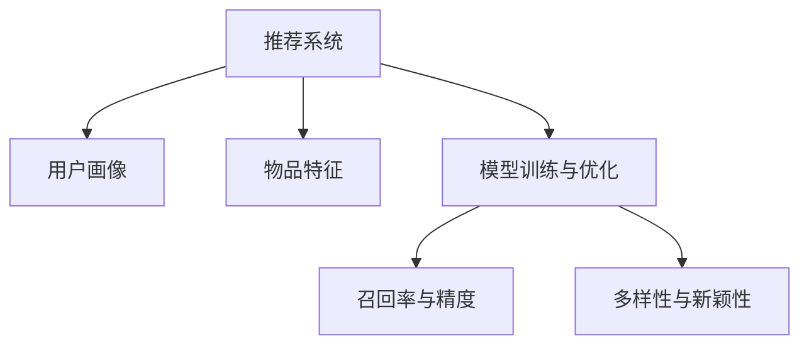

                 

# 传统搜索推荐系统的局限性

## 1. 背景介绍

### 1.1 问题由来

随着互联网技术的飞速发展，推荐系统已经成为了网络服务中不可或缺的一部分，为亿万用户提供了个性化体验。然而，尽管现有的推荐系统在实际应用中取得了显著的成效，但它们仍然面临着一系列无法回避的局限性。这些问题不仅影响了用户的体验，还限制了推荐系统的应用范围。因此，本文将深入探讨传统搜索推荐系统的局限性，并提出解决方案。

### 1.2 问题核心关键点

推荐系统核心关键点主要包括用户画像构建、兴趣发现与匹配、推荐策略设计和数据获取与处理等方面。本文将从这些关键点出发，详细分析推荐系统面临的问题及其解决策略。

## 2. 核心概念与联系

### 2.1 核心概念概述

为了更好地理解传统搜索推荐系统的局限性，我们需要先了解一些核心概念：

- **推荐系统(Recommender System)**：根据用户的历史行为、兴趣、社交关系等数据，为其推荐感兴趣的物品或内容。常见的推荐系统包括基于协同过滤、内容推荐和混合推荐等。

- **用户画像(User Profile)**：通过分析用户的历史行为和兴趣，构建用户的个性化特征表示，用于推荐决策。用户画像通常包括用户的基本信息、行为特征、兴趣偏好等。

- **物品特征(Item Feature)**：对推荐物品进行特征提取，如文本描述、图像特征、价格等，用于匹配用户兴趣。

- **模型训练与优化**：利用机器学习或深度学习模型对用户画像和物品特征进行训练，优化推荐模型，提升推荐效果。

- **召回率(Recall)与精度(Precision)**：召回率表示推荐系统中正确推荐的物品数量与实际存在物品数量的比率；精度表示推荐系统中正确推荐的物品数量与实际推荐物品数量的比率。

- **多样性(Diversity)与新颖性(Newness)**：多样性衡量推荐结果的多样程度，避免推荐结果过于集中；新颖性衡量推荐结果的新颖性，避免推荐过多常见内容。

这些概念之间的逻辑关系可以通过以下Mermaid流程图来展示：



这个流程图展示了一些关键概念及其之间的关系：

1. 推荐系统通过用户画像和物品特征对用户进行推荐。
2. 用户画像通过分析用户行为得到。
3. 物品特征通过提取物品属性得到。
4. 模型训练与优化用于提升推荐效果。
5. 召回率和精度用于评估推荐性能。
6. 多样性和新颖性用于优化推荐质量。

## 3. 核心算法原理 & 具体操作步骤
### 3.1 算法原理概述

传统搜索推荐系统一般基于以下算法原理：

- **协同过滤(Collaborative Filtering)**：基于用户历史行为或物品评分，通过相似度计算推荐相似用户或物品。
- **内容推荐(Content-Based Filtering)**：根据物品特征与用户兴趣的匹配度进行推荐。
- **混合推荐(Hybrid Recommender)**：结合协同过滤和内容推荐，优势互补，提升推荐效果。

推荐系统的基本步骤包括：

1. 数据获取：收集用户行为数据和物品特征数据。
2. 用户画像构建：通过分析用户历史行为，构建用户画像。
3. 物品特征提取：提取物品的特征属性。
4. 模型训练：利用机器学习或深度学习模型对用户画像和物品特征进行训练，优化推荐模型。
5. 推荐计算：根据用户画像和物品特征，计算推荐结果。
6. 结果排序与呈现：根据召回率、精度、多样性等指标，对推荐结果进行排序，返回给用户。

### 3.2 算法步骤详解

以下详细讲解推荐系统的各个步骤：

**Step 1: 数据获取**

推荐系统首先需要收集用户行为数据和物品特征数据。这些数据可以通过各种方式获取，如点击流、购买记录、评分数据、评论数据等。数据获取的完整性和准确性对后续推荐模型的训练效果至关重要。

**Step 2: 用户画像构建**

用户画像的构建是推荐系统的核心环节。通过对用户历史行为进行分析，可以得到用户的基本信息、兴趣偏好、行为特征等。常见的用户画像构建方法包括：

- 基于用户的协同过滤：利用用户历史评分数据，计算用户之间或物品之间的相似度，构建用户画像。
- 基于物品的协同过滤：利用物品历史评分数据，计算物品之间或用户之间的相似度，构建用户画像。
- 基于内容的协同过滤：利用物品特征数据，计算用户画像与物品特征之间的相似度，构建用户画像。

**Step 3: 物品特征提取**

物品特征提取是推荐系统的重要组成部分。物品特征可以来源于多种来源，如物品的文本描述、图片、标签等。通过特征提取，可以得到物品的紧凑表示，用于匹配用户兴趣。

**Step 4: 模型训练与优化**

推荐模型的训练与优化是推荐系统的关键环节。常见的推荐模型包括：

- 协同过滤模型：基于用户或物品的评分数据，通过矩阵分解、因子分解等方法，得到用户画像和物品特征的嵌入表示。
- 内容推荐模型：基于物品的文本描述、图片、标签等特征，通过文本分类、图像识别等方法，得到物品的特征表示。
- 混合推荐模型：结合协同过滤和内容推荐，得到用户画像和物品特征的综合表示。

**Step 5: 推荐计算**

推荐计算是推荐系统的执行环节。通过计算用户画像和物品特征之间的相似度，可以得到推荐结果。常见的推荐计算方法包括：

- 基于用户画像的推荐：利用用户画像与物品特征之间的相似度，得到推荐结果。
- 基于物品特征的推荐：利用物品特征与用户画像之间的相似度，得到推荐结果。

**Step 6: 结果排序与呈现**

推荐结果排序与呈现是推荐系统的最后环节。通过排序算法，将推荐结果按照召回率、精度、多样性等指标进行排序，最终呈现给用户。常见的排序算法包括：

- 基于排序的推荐算法：通过计算物品与用户画像之间的相似度，对推荐结果进行排序。
- 基于深度学习的推荐算法：通过深度神经网络对推荐结果进行排序。

### 3.3 算法优缺点

传统搜索推荐系统具有以下优点：

1. **个性化推荐**：根据用户历史行为，提供个性化的推荐，提升用户体验。
2. **覆盖面广**：能够覆盖广泛的商品或内容，满足用户多样化的需求。
3. **易于部署**：推荐系统的模型相对简单，易于部署和维护。

同时，传统搜索推荐系统也存在一些缺点：

1. **数据获取困难**：需要大量用户行为数据，数据获取成本较高。
2. **推荐效果不稳定**：推荐效果受到数据质量和用户行为变化的影响，推荐结果不稳定。
3. **推荐结果单调**：推荐结果往往过于集中，缺乏多样性和新颖性。
4. **算法复杂度高**：推荐算法涉及多种技术，算法复杂度较高，难以解释和调试。

### 3.4 算法应用领域

传统搜索推荐系统广泛应用于电子商务、社交网络、新闻推荐、视频推荐等多个领域。以下是几个典型的应用场景：

- **电子商务推荐**：根据用户的购买历史和浏览行为，推荐商品和优惠活动。
- **社交网络推荐**：根据用户的社交关系和兴趣，推荐朋友和内容。
- **新闻推荐**：根据用户的阅读历史和兴趣，推荐新闻文章和专题。
- **视频推荐**：根据用户的观看历史和评价，推荐视频内容和频道。

## 4. 数学模型和公式 & 详细讲解 & 举例说明

### 4.1 数学模型构建

本节将使用数学语言对传统搜索推荐系统的数学模型进行更加严格的刻画。

记用户画像为 $U=\{x_1, x_2, \ldots, x_n\}$，物品特征为 $I=\{y_1, y_2, \ldots, y_m\}$，推荐模型为 $R:\mathcal{X} \times \mathcal{Y} \rightarrow [0,1]$，其中 $\mathcal{X}$ 为输入空间，$\mathcal{Y}$ 为输出空间，$U$ 和 $I$ 分别表示用户画像和物品特征的集合。

假设推荐系统的训练数据集为 $D=\{(u_i, y_i)\}_{i=1}^N$，其中 $u_i$ 表示用户，$y_i$ 表示物品，$u_i$ 和 $y_i$ 通过用户画像和物品特征映射到高维空间，得到向量 $x_i$ 和 $y_i$。推荐模型 $R$ 的预测结果为 $\hat{y_i} = R(x_i, y_i)$，表示物品 $y_i$ 对用户 $u_i$ 的推荐程度。

定义推荐模型的损失函数为 $\ell(R, D) = \frac{1}{N} \sum_{i=1}^N \ell(\hat{y_i}, y_i)$，其中 $\ell(\hat{y_i}, y_i)$ 表示预测结果与实际结果之间的差异，常用的损失函数包括均方误差损失、交叉熵损失等。

推荐系统的优化目标是最小化损失函数，即找到最优推荐模型：

$$
\hat{R} = \mathop{\arg\min}_{R} \ell(R, D)
$$

在实践中，我们通常使用梯度下降等优化算法来近似求解上述最优化问题。设 $\eta$ 为学习率，$\lambda$ 为正则化系数，则参数的更新公式为：

$$
R \leftarrow R - \eta \nabla_{R}\ell(R, D) - \eta\lambda R
$$

其中 $\nabla_{R}\ell(R, D)$ 为损失函数对推荐模型的梯度，可通过反向传播算法高效计算。

### 4.2 公式推导过程

以下我们以交叉熵损失函数为例，推导其梯度计算过程。

假设推荐模型 $R$ 在用户画像 $x_i$ 和物品特征 $y_i$ 上的预测结果为 $\hat{y_i} = R(x_i, y_i)$，真实结果为 $y_i \in \{0,1\}$。则交叉熵损失函数定义为：

$$
\ell(R(x_i, y_i), y_i) = -[y_i\log \hat{y_i} + (1-y_i)\log (1-\hat{y_i})]
$$

将其代入损失函数，得：

$$
\ell(R, D) = -\frac{1}{N}\sum_{i=1}^N [y_i\log R(x_i, y_i)+(1-y_i)\log(1-R(x_i, y_i))]
$$

根据链式法则，损失函数对推荐模型 $R$ 的梯度为：

$$
\frac{\partial \ell(R, D)}{\partial R} = -\frac{1}{N}\sum_{i=1}^N (\frac{y_i}{R(x_i, y_i)}-\frac{1-y_i}{1-R(x_i, y_i)}) \frac{\partial R(x_i, y_i)}{\partial R}
$$

其中 $\frac{\partial R(x_i, y_i)}{\partial R}$ 可进一步递归展开，利用自动微分技术完成计算。

在得到损失函数的梯度后，即可带入参数更新公式，完成模型的迭代优化。重复上述过程直至收敛，最终得到适应推荐任务的推荐模型 $\hat{R}$。

### 4.3 案例分析与讲解

以下我们以电商推荐系统为例，详细讲解基于交叉熵损失函数的推荐系统训练过程。

假设电商推荐系统需要推荐商品，用户画像为 $x_i$，物品特征为 $y_i$，推荐模型为 $R(x_i, y_i)$。

首先，定义交叉熵损失函数：

$$
\ell(R(x_i, y_i), y_i) = -[y_i\log R(x_i, y_i)+(1-y_i)\log(1-R(x_i, y_i))]
$$

然后，计算损失函数对推荐模型的梯度：

$$
\frac{\partial \ell(R, D)}{\partial R} = -\frac{1}{N}\sum_{i=1}^N (\frac{y_i}{R(x_i, y_i)}-\frac{1-y_i}{1-R(x_i, y_i)}) \frac{\partial R(x_i, y_i)}{\partial R}
$$

通过反向传播算法，对推荐模型 $R(x_i, y_i)$ 进行参数更新：

$$
R \leftarrow R - \eta \nabla_{R}\ell(R, D) - \eta\lambda R
$$

其中 $\eta$ 为学习率，$\lambda$ 为正则化系数，$\nabla_{R}\ell(R, D)$ 为损失函数对推荐模型的梯度，利用自动微分技术计算。

在训练过程中，我们需要不断调整学习率 $\eta$ 和正则化系数 $\lambda$，以获得最佳的推荐效果。常用的学习率调度策略包括学习率衰减、学习率 warmup、动量等。

## 5. 项目实践：代码实例和详细解释说明

### 5.1 开发环境搭建

在进行推荐系统开发前，我们需要准备好开发环境。以下是使用Python进行TensorFlow开发的环境配置流程：

1. 安装Anaconda：从官网下载并安装Anaconda，用于创建独立的Python环境。

2. 创建并激活虚拟环境：
```bash
conda create -n tf-env python=3.8 
conda activate tf-env
```

3. 安装TensorFlow：根据CUDA版本，从官网获取对应的安装命令。例如：
```bash
pip install tensorflow==2.5.0
```

4. 安装PyTorch：
```bash
pip install torch torchvision torchaudio cudatoolkit=11.1 -c pytorch -c conda-forge
```

5. 安装各类工具包：
```bash
pip install numpy pandas scikit-learn matplotlib tqdm jupyter notebook ipython
```

完成上述步骤后，即可在`tf-env`环境中开始推荐系统开发。

### 5.2 源代码详细实现

这里我们以电商推荐系统为例，给出使用TensorFlow和Keras实现推荐模型的PyTorch代码实现。

首先，定义推荐模型的输入输出和损失函数：

```python
from tensorflow.keras import layers, models
from tensorflow.keras.losses import BinaryCrossentropy

# 输入维度
input_dim = 100

# 定义模型
model = models.Sequential()
model.add(layers.Dense(64, activation='relu', input_dim=input_dim))
model.add(layers.Dense(1, activation='sigmoid'))

# 定义损失函数
loss = BinaryCrossentropy()

# 编译模型
model.compile(optimizer='adam', loss=loss)
```

然后，定义训练函数：

```python
from tensorflow.keras.datasets import mnist

# 加载数据集
(x_train, y_train), (x_test, y_test) = mnist.load_data()

# 数据预处理
x_train = x_train.reshape((x_train.shape[0], -1))
x_train = x_train / 255.0
x_test = x_test.reshape((x_test.shape[0], -1))
x_test = x_test / 255.0

# 定义训练数据生成器
train_generator = tf.data.Dataset.from_tensor_slices((x_train, y_train)).shuffle(10000).batch(64).repeat()

# 定义评估数据生成器
test_generator = tf.data.Dataset.from_tensor_slices((x_test, y_test)).batch(64).repeat()

# 定义训练函数
def train_model(model, train_generator, test_generator, epochs=10, batch_size=64):
    for epoch in range(epochs):
        for x, y in train_generator:
            model.train_on_batch(x, y)
        score = model.evaluate(test_generator)
        print('Epoch {}, loss: {}'.format(epoch, score[0]))
```

最后，启动训练流程：

```python
# 训练模型
train_model(model, train_generator, test_generator, epochs=10, batch_size=64)
```

以上是一个简单的电商推荐系统的代码实现。可以看到，使用TensorFlow和Keras可以方便地搭建推荐模型并进行训练。

### 5.3 代码解读与分析

让我们再详细解读一下关键代码的实现细节：

**定义模型**

- `model = models.Sequential()`：定义一个Sequential模型，用于搭建推荐模型。
- `model.add(layers.Dense(64, activation='relu', input_dim=input_dim))`：添加一个全连接层，64个神经元，ReLU激活函数，输入维度为 `input_dim`。
- `model.add(layers.Dense(1, activation='sigmoid'))`：添加一个全连接层，1个神经元，sigmoid激活函数，用于输出推荐概率。

**定义损失函数**

- `loss = BinaryCrossentropy()`：定义二分类交叉熵损失函数，用于计算推荐模型的预测结果与实际结果之间的差异。

**定义训练函数**

- `train_generator = tf.data.Dataset.from_tensor_slices((x_train, y_train)).shuffle(10000).batch(64).repeat()`：定义训练数据生成器，对训练数据进行洗牌、分批次处理和重复。
- `test_generator = tf.data.Dataset.from_tensor_slices((x_test, y_test)).batch(64).repeat()`：定义测试数据生成器，对测试数据进行分批次处理和重复。
- `model.train_on_batch(x, y)`：在每个批次上对模型进行前向传播和反向传播，更新模型参数。
- `score = model.evaluate(test_generator)`：在测试集上评估模型的性能，返回损失和准确率。

**训练流程**

- `train_model(model, train_generator, test_generator, epochs=10, batch_size=64)`：定义训练函数，对模型进行多轮训练，每轮训练完毕后在测试集上评估模型性能。

可以看到，TensorFlow和Keras提供了简单易用的接口，使得推荐模型的开发变得方便快捷。开发者可以将更多精力放在数据预处理、模型优化等高层逻辑上，而不必过多关注底层的实现细节。

当然，工业级的系统实现还需考虑更多因素，如模型的保存和部署、超参数的自动搜索、更灵活的任务适配层等。但核心的推荐范式基本与此类似。

## 6. 实际应用场景

### 6.1 智能推荐系统

智能推荐系统已经广泛应用于电子商务、视频平台、新闻阅读等多个领域。以下是几个典型的应用场景：

- **电商平台**：根据用户的浏览历史和购买记录，推荐相关商品和促销活动。
- **视频平台**：根据用户的观看历史和评分记录，推荐相关视频和频道。
- **新闻阅读**：根据用户的阅读历史和兴趣标签，推荐相关新闻文章和专题。

### 6.2 广告投放

广告投放也是推荐系统的重要应用场景。通过分析用户的历史行为和兴趣，推荐系统能够帮助广告主精准投放广告，提升广告效果和投资回报率。

### 6.3 个性化医疗

个性化医疗也是推荐系统的重要应用场景。通过分析用户的健康数据和行为记录，推荐系统能够帮助医生制定个性化的诊疗方案，提高诊疗效果和患者满意度。

### 6.4 未来应用展望

随着推荐系统的发展，未来将在更多领域得到应用，为各行各业带来新的价值：

- **智能家居**：通过分析用户的行为习惯和偏好，推荐系统能够帮助用户打造个性化的智能家居环境。
- **金融投资**：通过分析用户的投资记录和行为偏好，推荐系统能够帮助用户优化投资组合，提升投资收益。
- **智能交通**：通过分析用户的出行记录和偏好，推荐系统能够帮助用户规划最优路线，提升出行效率。

## 7. 工具和资源推荐

### 7.1 学习资源推荐

为了帮助开发者系统掌握推荐系统的理论基础和实践技巧，这里推荐一些优质的学习资源：

1. 《推荐系统实践》系列博文：由推荐系统领域的专家撰写，深入浅出地介绍了推荐系统的各个环节和前沿技术。

2. CS229《机器学习》课程：斯坦福大学开设的机器学习明星课程，有Lecture视频和配套作业，涵盖推荐系统的基础知识。

3. 《推荐系统基础》书籍：推荐系统领域的经典教材，系统介绍了推荐系统的理论基础和实践方法。

4. Kaggle推荐系统竞赛：通过参与Kaggle推荐系统竞赛，实践推荐系统的各个环节，积累经验。

通过对这些资源的学习实践，相信你一定能够快速掌握推荐系统的精髓，并用于解决实际的推荐问题。

### 7.2 开发工具推荐

推荐的开发工具包括：

1. TensorFlow：基于Python的开源深度学习框架，灵活动态的计算图，适合快速迭代研究。

2. PyTorch：基于Python的开源深度学习框架，灵活的动态图，适合学术研究和工程开发。

3. Keras：基于TensorFlow和Theano的高层次API，易于上手，适合快速原型开发。

4. H2O.ai：开源的机器学习平台，支持多种算法，易于集成和部署。

5. Scikit-learn：Python的机器学习库，支持多种算法和数据预处理工具，适合快速原型开发。

6. Apache Spark：基于内存计算的分布式计算框架，支持大规模数据处理和推荐模型训练。

### 7.3 相关论文推荐

推荐系统的研究源于学界的持续研究。以下是几篇奠基性的相关论文，推荐阅读：

1. Factorization Machines for Recommender Systems（FMs论文）：提出Factorization Machines算法，应用于推荐系统的特征提取和模型训练。

2. Deep Collaborative Filtering（DCF论文）：提出深度学习在推荐系统中的应用，提升了推荐模型的精度。

3. Wide & Deep Learning for Recommender Systems（Wide & Deep论文）：提出Wide & Deep推荐模型，结合浅层模型和深层模型的优点，提升了推荐模型的泛化能力和精度。

4. Attention-Based Recommender Systems（Attention论文）：提出注意力机制在推荐系统中的应用，提升了推荐模型的鲁棒性和多样性。

5. Nearest Neighbor Recommendations with Large Implicit Datasets（NNI论文）：提出基于近邻的推荐算法，应用于大型稀疏数据集上的推荐系统。

这些论文代表了大推荐系统的发展脉络。通过学习这些前沿成果，可以帮助研究者把握学科前进方向，激发更多的创新灵感。

## 8. 总结：未来发展趋势与挑战

### 8.1 总结

本文对传统搜索推荐系统的局限性进行了全面系统的介绍。首先阐述了推荐系统面临的常见问题，包括数据获取困难、推荐效果不稳定、推荐结果单调、算法复杂度高等方面。其次，从用户画像构建、兴趣发现与匹配、推荐策略设计和数据获取与处理等关键点出发，详细分析了推荐系统面临的挑战及解决策略。

通过本文的系统梳理，可以看到，传统推荐系统在提供个性化推荐、覆盖面广、易于部署等方面具有显著优势，但也面临数据质量、模型复杂度等诸多挑战。未来，推荐系统需要在模型优化、数据获取、用户体验等方面不断提升，才能更好地适应现实需求。

### 8.2 未来发展趋势

展望未来，推荐系统的发展将呈现以下几个趋势：

1. **深度学习应用广泛**：深度学习技术在推荐系统中得到广泛应用，提升推荐模型的精度和泛化能力。

2. **多模态融合**：推荐系统将融合多种模态数据，如文本、图像、音频等，提升推荐模型的多样性和新颖性。

3. **实时推荐**：推荐系统将具备实时推荐能力，能够动态调整推荐策略，提升用户体验。

4. **个性化推荐**：推荐系统将具备更强的个性化推荐能力，能够根据用户行为进行动态调整，提升推荐效果。

5. **自动化推荐**：推荐系统将具备自动化推荐能力，能够根据用户行为和环境进行智能推荐，提升推荐系统的可操作性。

6. **推荐结果多样性**：推荐系统将具备更高的多样性，能够推荐更广泛的内容，避免推荐结果过于集中。

以上趋势凸显了推荐系统的发展方向，这些方向的探索发展，将进一步提升推荐系统的性能和应用范围，为各行各业带来新的价值。

### 8.3 面临的挑战

尽管推荐系统已经取得了显著成效，但在迈向更加智能化、普适化应用的过程中，它仍面临着诸多挑战：

1. **数据质量问题**：推荐系统需要大量高质量的数据，但数据获取成本较高，且数据质量难以保证。

2. **模型复杂度高**：推荐系统涉及多种技术，算法复杂度较高，难以解释和调试。

3. **推荐结果单调**：推荐结果往往过于集中，缺乏多样性和新颖性。

4. **用户隐私保护**：推荐系统需要收集大量用户数据，如何保护用户隐私是一个重要问题。

5. **推荐系统鲁棒性不足**：推荐系统在面对异常数据和恶意攻击时，容易产生错误推荐。

6. **推荐系统可解释性不足**：推荐系统通常是一个黑盒模型，难以解释其内部工作机制和决策逻辑。

这些挑战需要在技术、伦理、法律等多个层面进行全面考虑和解决。

### 8.4 研究展望

未来推荐系统的研究需要在以下几个方向寻求新的突破：

1. **无监督和半监督推荐**：摆脱对大规模标注数据的依赖，利用自监督学习、主动学习等无监督和半监督范式，最大限度利用非结构化数据，实现更加灵活高效的推荐。

2. **参数高效和计算高效的推荐**：开发更加参数高效和计算高效的推荐方法，在固定大部分预训练参数的同时，只更新极少量的任务相关参数。

3. **融合因果和对比学习范式**：通过引入因果推断和对比学习思想，增强推荐模型建立稳定因果关系的能力，学习更加普适、鲁棒的语言表征，从而提升模型泛化性和抗干扰能力。

4. **结合先验知识**：将符号化的先验知识，如知识图谱、逻辑规则等，与神经网络模型进行巧妙融合，引导推荐过程学习更准确、合理的语言模型。

5. **多模态推荐**：将视觉、语音、文本等多种模态数据进行融合，实现多模态信息与推荐模型的协同建模。

6. **公平推荐**：探索公平推荐方法，避免推荐系统中的偏见和歧视，提升推荐系统的公平性和可解释性。

这些研究方向将推动推荐系统向更高层次发展，为各行各业带来新的突破和创新。

## 9. 附录：常见问题与解答

**Q1：推荐系统是否适用于所有应用场景？**

A: 推荐系统在大多数应用场景中都能取得不错的效果，特别是对于数据量较大的场景。但对于一些特定领域的场景，如新闻内容推荐、电影评分推荐等，推荐系统的效果可能不如人工推荐或专家推荐。

**Q2：推荐系统如何处理冷启动问题？**

A: 冷启动问题是推荐系统面临的常见问题，推荐系统需要为刚进入平台的用户推荐内容。常用的处理方式包括：

- 基于用户行为的推荐：利用用户的历史行为数据，为用户推荐相关内容。
- 基于物品属性的推荐：利用物品的特征属性，推荐与用户兴趣相关的物品。
- 基于社交网络的推荐：利用用户的社交关系，推荐与用户兴趣相关的物品。

**Q3：推荐系统如何提高推荐效果？**

A: 提高推荐效果的方法包括：

- 数据清洗和预处理：保证数据质量，去除噪声和异常数据。
- 特征工程：通过特征提取和选择，提高推荐模型的特征质量。
- 模型优化：通过调整模型结构、改进优化算法等，提升推荐模型的精度和泛化能力。
- 算法创新：引入新的推荐算法和技术，提升推荐系统的性能。

这些方法需要根据具体应用场景进行灵活应用。

**Q4：推荐系统在工业级部署中需要注意哪些问题？**

A: 推荐系统在工业级部署中需要注意以下问题：

- 模型压缩：将复杂的推荐模型压缩到合理的规模，提升推理速度。
- 存储优化：对推荐模型进行存储优化，减少存储空间占用。
- 模型调优：在生产环境中，对推荐模型进行调优，提升模型精度和推理速度。
- 安全性：在部署推荐系统时，需要考虑用户数据的安全性和隐私保护。

这些问题是推荐系统工程化过程中的重要环节，需要全面考虑和解决。

通过本文的系统梳理，可以看到，推荐系统在提供个性化推荐、覆盖面广、易于部署等方面具有显著优势，但也面临数据质量、模型复杂度等诸多挑战。未来，推荐系统需要在模型优化、数据获取、用户体验等方面不断提升，才能更好地适应现实需求。

