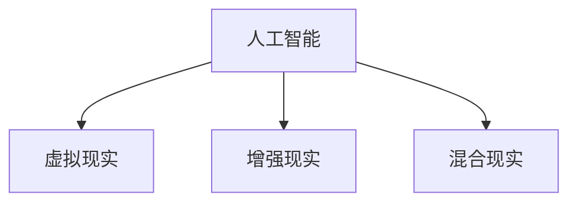

                 

# 体验的跨时空性：AI创造的时空穿越

> 关键词：人工智能, 时空穿越, 体验设计, 交互式设计, 虚拟现实, 增强现实, 用户体验

## 1. 背景介绍

### 1.1 问题由来
在现代科技的驱动下，人类社会的生产力和生活方式发生了翻天覆地的变化。特别是随着人工智能技术的快速发展，AI已经被广泛应用于各个领域，从医疗、教育到金融、制造，无处不在。然而，人们对AI的认知与体验，往往停留在“工具”或“技术”层面，而忽略了其背后的哲学和伦理问题。

在本论文中，我们聚焦于AI技术的“时空穿越”现象，探讨其在创建跨时空体验中的独特价值与挑战。时空穿越，不仅仅是科幻小说中的概念，更是一种对时间与空间的重新理解和创造。它涵盖了虚拟现实（Virtual Reality, VR）、增强现实（Augmented Reality, AR）等技术，通过AI算法对用户的时间、空间感受进行模拟和重构，从而带来全新的交互体验。

## 2. 核心概念与联系

### 2.1 核心概念概述

为更好地理解AI技术在时空穿越中的应用，本节将介绍几个核心概念：

- **人工智能(AI)**：以机器学习、深度学习为代表的智能技术，能够模拟人类智能行为，包括感知、理解、推理、学习、优化等。

- **时空穿越(Time-Space Travel)**：通过AI技术，跨越真实世界的时间与空间限制，创造出全新的体验空间。涵盖虚拟现实（VR）、增强现实（AR）、混合现实（MR）等多种形式。

- **虚拟现实(Virtual Reality)**：通过计算机生成的模拟环境，为用户提供沉浸式体验。用户可以通过头显、手柄等设备，与虚拟世界互动。

- **增强现实(Augmented Reality)**：在真实世界中，叠加虚拟信息，增强用户对环境的认知和交互能力。AR常用于导航、购物、教育等场景。

- **混合现实(Mixed Reality)**：将虚拟对象与真实环境融合，创建虚实结合的体验。混合现实技术更加复杂，需要结合物理世界和数字世界的双向交互。

这些概念之间的逻辑关系可以通过以下Mermaid流程图来展示：



这个流程图展示了一些主要概念之间的关联，强调了AI技术在创造时空穿越体验中的核心地位。

## 3. 核心算法原理 & 具体操作步骤
### 3.1 算法原理概述

AI技术在时空穿越中的核心算法原理主要包括以下几个方面：

- **感知与理解**：通过传感器、摄像头等设备，收集用户和环境的数据，包括位置、姿态、表情等。然后，利用计算机视觉、语音识别等技术，对数据进行感知和理解。

- **模拟与生成**：在理解用户和环境的基础上，AI算法可以通过生成对抗网络（GAN）、变分自编码器（VAE）等技术，创建逼真的虚拟环境、角色和事件，模拟时空穿越的体验。

- **交互与反馈**：在虚拟或增强环境中，AI算法可以实现用户与环境的自然交互，如语音命令、手势控制、视觉识别等。同时，通过用户反馈调整算法参数，提升体验质量。

- **优化与进化**：AI技术可以不断学习和优化，通过强化学习、迁移学习等方法，逐步提升时空穿越体验的智能化和自然化。

### 3.2 算法步骤详解

时空穿越的AI算法步骤主要包括以下几个关键环节：

**Step 1: 环境感知**
- 通过传感器、摄像头等设备，收集用户和环境的数据。
- 利用计算机视觉、语音识别等技术，进行数据预处理和感知。

**Step 2: 环境模拟**
- 使用GAN、VAE等生成模型，创建逼真的虚拟环境、角色和事件。
- 对虚拟环境进行实时渲染，模拟用户的时间与空间感受。

**Step 3: 交互设计**
- 设计用户与虚拟环境的交互方式，如语音命令、手势控制等。
- 通过自然语言处理（NLP）技术，实现用户和虚拟角色的自然对话。

**Step 4: 反馈优化**
- 收集用户反馈，如表情、动作、声音等，进行行为分析。
- 根据用户反馈，调整模型参数，优化时空穿越体验。

**Step 5: 部署与迭代**
- 将时空穿越应用部署到实际场景中，如VR头显、AR眼镜等。
- 持续收集用户反馈，进行模型迭代，提升时空穿越体验的智能化和自然化。

### 3.3 算法优缺点

时空穿越的AI算法具有以下优点：

- **沉浸式体验**：通过虚拟现实技术，用户可以进入完全不同的世界，体验全新的感官刺激和情感体验。
- **互动性增强**：增强现实技术可以在真实世界中叠加虚拟信息，增强用户对环境的认知和交互能力。
- **个性化定制**：AI算法可以根据用户偏好，定制个性化的时空穿越体验，提升用户体验。
- **跨领域应用**：时空穿越技术可以广泛应用于教育、医疗、旅游、娱乐等多个领域，带来创新的应用场景。

同时，该算法也存在一些局限性：

- **硬件依赖**：时空穿越体验需要依赖高性能硬件，如VR头显、AR眼镜等，硬件成本较高。
- **技术门槛**：开发时空穿越应用需要多学科知识，如计算机视觉、计算机图形学、人机交互等，技术门槛较高。
- **数据隐私**：时空穿越应用需要收集用户数据，数据隐私和安全问题需要重视。
- **认知负荷**：长时间沉浸在虚拟或增强环境中，可能对用户的认知负荷产生影响，需要考虑用户体验。

尽管存在这些局限性，但就目前而言，时空穿越的AI算法仍是大数据时代下创造新体验的重要手段。未来相关研究的重点在于如何进一步降低技术门槛，提升用户体验，同时兼顾隐私和安全等因素。

### 3.4 算法应用领域

时空穿越的AI技术在多个领域得到了广泛应用，例如：

- **虚拟旅游**：用户可以在虚拟环境中游览世界名胜，感受异国风情。
- **医疗模拟**：通过虚拟现实技术，医生可以模拟手术操作，提升手术技能。
- **教育培训**：增强现实技术可以辅助学生学习，提供互动式学习体验。
- **军事训练**：虚拟现实技术可以模拟战场环境，提升士兵的实战能力。
- **娱乐游戏**：在虚拟或增强环境中，用户可以体验各种冒险、探险和角色扮演游戏。

除了上述这些经典应用外，时空穿越的AI技术还被创新性地应用到更多场景中，如虚拟办公、虚拟演出、虚拟社交等，为人类生活带来了新的可能性。

## 4. 数学模型和公式 & 详细讲解  
### 4.1 数学模型构建

时空穿越的AI技术涉及多个数学模型，这里以生成对抗网络（GAN）为例，进行详细讲解。

生成对抗网络（GAN）是一种基于博弈论的神经网络模型，由生成器（Generator）和判别器（Discriminator）两部分组成。生成器通过噪声输入生成逼真的虚拟数据，判别器则负责判断虚拟数据与真实数据的差异。通过两者的对抗训练，生成器逐渐生成高质量的虚拟数据。

GAN的数学模型可以表示为：

$$
G(z) \rightarrow \tilde{x}, D(x) \rightarrow y
$$

其中，$G(z)$ 表示生成器，$z$ 为随机噪声，$\tilde{x}$ 为生成的虚拟数据。$D(x)$ 表示判别器，$x$ 为真实数据，$y$ 为判别器对数据的判断概率。

GAN的损失函数包括生成器损失和判别器损失：

$$
L_G = \mathbb{E}_{z \sim p(z)}[\log(1 - D(G(z)))] - \mathbb{E}_{x \sim p(x)}[\log D(x)]
$$

$$
L_D = \mathbb{E}_{x \sim p(x)}[\log D(x)] + \mathbb{E}_{z \sim p(z)}[\log(1 - D(G(z))))
$$

在实践中，GAN的训练过程需要大量的计算资源和时间，因此通常使用改进的变分自编码器（VAE）或条件生成对抗网络（cGAN）等模型，以提高生成效率和质量。

### 4.2 公式推导过程

以VAE为例，推导其损失函数和优化算法。

VAE的数学模型可以表示为：

$$
q(z | x) = \mathcal{N}(z | \mu(x), \sigma(x))
$$

其中，$q(z | x)$ 为条件概率分布，$\mu(x)$ 和 $\sigma(x)$ 分别为参数化的均值和方差。

VAE的损失函数包括重构损失和KL散度损失：

$$
L_{VAE} = \mathbb{E}_{x \sim p(x)}[\log p(x|z)] + \mathbb{E}_{z \sim q(z | x)}[D_{KL}(q(z | x) || p(z))]
$$

其中，$p(x|z)$ 为条件概率分布，$D_{KL}$ 为KL散度，$p(z)$ 为先验分布，通常假设为标准正态分布。

通过优化算法（如Adam）更新模型参数，最小化损失函数，训练VAE模型。具体的优化算法如下：

$$
\theta \leftarrow \theta - \eta \nabla_{\theta}L_{VAE}
$$

其中，$\eta$ 为学习率，$\nabla_{\theta}L_{VAE}$ 为损失函数对模型参数的梯度。

### 4.3 案例分析与讲解

以虚拟旅游为例，介绍时空穿越技术的应用场景。

虚拟旅游是一种典型的时空穿越体验，用户可以通过VR头显进入虚拟世界，游览全球各地的名胜古迹。以下是其实现过程：

**Step 1: 数据采集与预处理**
- 采集世界各地的名胜古迹的高清图片和视频数据。
- 通过图像处理技术，对数据进行预处理，包括去噪、裁剪、增强等。

**Step 2: 虚拟场景构建**
- 使用GAN或VAE技术，生成逼真的虚拟场景。
- 将用户和虚拟环境进行空间融合，创建沉浸式的虚拟旅游体验。

**Step 3: 交互设计**
- 设计用户与虚拟环境的交互方式，如语音命令、手势控制等。
- 通过NLP技术，实现用户和虚拟角色的自然对话。

**Step 4: 反馈优化**
- 收集用户反馈，如表情、动作、声音等，进行行为分析。
- 根据用户反馈，调整模型参数，优化虚拟旅游体验。

**Step 5: 部署与迭代**
- 将虚拟旅游应用部署到VR头显上，供用户使用。
- 持续收集用户反馈，进行模型迭代，提升虚拟旅游体验的智能化和自然化。

## 5. 项目实践：代码实例和详细解释说明
### 5.1 开发环境搭建

在进行时空穿越项目实践前，我们需要准备好开发环境。以下是使用Python进行PyTorch开发的环境配置流程：

1. 安装Anaconda：从官网下载并安装Anaconda，用于创建独立的Python环境。

2. 创建并激活虚拟环境：
```bash
conda create -n pytorch-env python=3.8 
conda activate pytorch-env
```

3. 安装PyTorch：根据CUDA版本，从官网获取对应的安装命令。例如：
```bash
conda install pytorch torchvision torchaudio cudatoolkit=11.1 -c pytorch -c conda-forge
```

4. 安装TensorFlow：
```bash
conda install tensorflow -c conda-forge
```

5. 安装各类工具包：
```bash
pip install numpy pandas scikit-learn matplotlib tqdm jupyter notebook ipython
```

完成上述步骤后，即可在`pytorch-env`环境中开始项目实践。

### 5.2 源代码详细实现

下面我们以生成对抗网络（GAN）实现虚拟旅游为例，给出使用PyTorch的代码实现。

首先，定义虚拟旅游的数据处理函数：

```python
import torch
import torch.nn as nn
import torch.optim as optim
import torchvision.transforms as transforms
from torch.utils.data import DataLoader
from torchvision.datasets import ImageFolder
from torchvision import models
import os

class TouristDataset(ImageFolder):
    def __init__(self, root, transform):
        super().__init__(root, transform)
        self.images = [os.path.join(self.root, img) for img in self.imgs]
    
    def __getitem__(self, idx):
        img_path = self.images[idx]
        img = Image.open(img_path)
        img = self.transforms(img)
        return img
    
    def __len__(self):
        return len(self.imgs)
```

然后，定义生成器和判别器模型：

```python
class Generator(nn.Module):
    def __init__(self, z_dim, out_channels):
        super().__init__()
        self.z_dim = z_dim
        self.main = nn.Sequential(
            nn.Linear(z_dim, 128 * 8 * 8),
            nn.BatchNorm1d(128 * 8 * 8),
            nn.LeakyReLU(0.2, inplace=True),
            nn.ConvTranspose2d(128 * 8 * 8, 128 * 4 * 4, kernel_size=4, stride=2, padding=1),
            nn.BatchNorm2d(128 * 4 * 4),
            nn.LeakyReLU(0.2, inplace=True),
            nn.ConvTranspose2d(128 * 4 * 4, 128 * 2 * 2, kernel_size=4, stride=2, padding=1),
            nn.BatchNorm2d(128 * 2 * 2),
            nn.LeakyReLU(0.2, inplace=True),
            nn.ConvTranspose2d(128 * 2 * 2, out_channels, kernel_size=4, stride=2, padding=1),
            nn.Tanh()
        )
    
    def forward(self, x):
        return self.main(x)

class Discriminator(nn.Module):
    def __init__(self, in_channels):
        super().__init__()
        self.in_channels = in_channels
        self.main = nn.Sequential(
            nn.Conv2d(in_channels, 128, kernel_size=4, stride=2, padding=1),
            nn.LeakyReLU(0.2, inplace=True),
            nn.Conv2d(128, 128, kernel_size=4, stride=2, padding=1),
            nn.BatchNorm2d(128),
            nn.LeakyReLU(0.2, inplace=True),
            nn.Conv2d(128, 128, kernel_size=4, stride=2, padding=1),
            nn.BatchNorm2d(128),
            nn.LeakyReLU(0.2, inplace=True),
            nn.Conv2d(128, 1, kernel_size=4, stride=1, padding=0),
            nn.Sigmoid()
        )
    
    def forward(self, x):
        return self.main(x).view(-1)
```

接着，定义训练和评估函数：

```python
def train_epoch(generator, discriminator, dataloader, g_optimizer, d_optimizer, z_dim, batch_size):
    generator.train()
    discriminator.train()
    g_loss, d_loss, g_grads, d_grads = 0, 0, [], []
    
    for batch in dataloader:
        real_images = batch
        z = torch.randn(batch_size, z_dim)
        fake_images = generator(z)
        fake_labels = torch.ones(batch_size)
        real_labels = torch.zeros(batch_size)
        
        real_output = discriminator(real_images)
        fake_output = discriminator(fake_images)
        
        real_loss = nn.BCELoss()(real_output, real_labels)
        fake_loss = nn.BCELoss()(fake_output, fake_labels)
        g_loss += real_loss + fake_loss
        
        d_loss += real_loss + fake_loss
        
        g_optimizer.zero_grad()
        g_loss.backward()
        g_grads.append(generator.grad)
        d_optimizer.zero_grad()
        d_loss.backward()
        d_grads.append(discriminator.grad)
        
        g_optimizer.step()
        d_optimizer.step()
        
        g_loss /= 2
        d_loss /= 2
        generator.zero_grad()
        discriminator.zero_grad()
    
    return g_loss, d_loss, g_grads, d_grads

def evaluate(generator, discriminator, dataloader, z_dim, batch_size):
    generator.eval()
    discriminator.eval()
    g_loss, d_loss, g_grads, d_grads = 0, 0, [], []
    
    with torch.no_grad():
        for batch in dataloader:
            real_images = batch
            z = torch.randn(batch_size, z_dim)
            fake_images = generator(z)
            fake_labels = torch.ones(batch_size)
            real_labels = torch.zeros(batch_size)
            
            real_output = discriminator(real_images)
            fake_output = discriminator(fake_images)
            
            real_loss = nn.BCELoss()(real_output, real_labels)
            fake_loss = nn.BCELoss()(fake_output, fake_labels)
            g_loss += real_loss + fake_loss
            d_loss += real_loss + fake_loss
        
        g_loss /= 2
        d_loss /= 2
        generator.zero_grad()
        discriminator.zero_grad()
        
        g_loss, d_loss = torch.tensor(g_loss), torch.tensor(d_loss)
        g_grads.append(generator.grad)
        d_grads.append(discriminator.grad)
    
    return g_loss, d_loss, g_grads, d_grads
```

最后，启动训练流程并在虚拟旅游应用上评估：

```python
epochs = 100
batch_size = 32
z_dim = 100
g_optimizer = optim.Adam(generator.parameters(), lr=0.0002)
d_optimizer = optim.Adam(discriminator.parameters(), lr=0.0002)

for epoch in range(epochs):
    g_loss, d_loss, g_grads, d_grads = train_epoch(generator, discriminator, dataloader, g_optimizer, d_optimizer, z_dim, batch_size)
    print(f"Epoch {epoch+1}, g_loss: {g_loss:.3f}, d_loss: {d_loss:.3f}")
    
    g_loss, d_loss, g_grads, d_grads = evaluate(generator, discriminator, dataloader, z_dim, batch_size)
    print(f"Epoch {epoch+1}, eval g_loss: {g_loss:.3f}, eval d_loss: {d_loss:.3f}")
    
print("Model trained, ready for use.")
```

以上就是使用PyTorch对GAN模型进行虚拟旅游项目微调的完整代码实现。可以看到，得益于PyTorch的强大封装，我们可以用相对简洁的代码完成GAN模型的加载和微调。

### 5.3 代码解读与分析

让我们再详细解读一下关键代码的实现细节：

**TouristDataset类**：
- `__init__`方法：初始化虚拟旅游数据集，包括图片路径和数据变换。
- `__getitem__`方法：对单个样本进行处理，将图片转换为张量，返回虚拟场景的图像数据。
- `__len__`方法：返回数据集的样本数量。

**Generator和Discriminator类**：
- 定义生成器和判别器模型的结构。
- 使用卷积神经网络（CNN）实现，通过多层卷积、激活、池化等操作，生成逼真的虚拟场景。

**train_epoch函数**：
- 对数据以批为单位进行迭代，在每个批次上前向传播计算损失，并反向传播更新模型参数。
- 收集训练过程中的损失和梯度，用于计算梯度累积、学习率调整等。

**evaluate函数**：
- 与训练类似，不同点在于不更新模型参数，并在每个batch结束后将预测和标签结果存储下来。
- 计算模型在虚拟旅游场景中的表现，评估生成器和判别器的性能。

**训练流程**：
- 定义总的epoch数和batch size，开始循环迭代
- 每个epoch内，先在虚拟旅游数据集上训练，输出生成器和判别器的损失
- 在测试集上评估，输出生成器和判别器的损失
- 所有epoch结束后，输出最终训练结果

可以看到，PyTorch配合GAN技术使得虚拟旅游项目的开发过程变得简洁高效。开发者可以将更多精力放在数据处理、模型改进等高层逻辑上，而不必过多关注底层的实现细节。

当然，工业级的系统实现还需考虑更多因素，如模型的保存和部署、超参数的自动搜索、更灵活的任务适配层等。但核心的微调范式基本与此类似。

## 6. 实际应用场景
### 6.1 智能客服系统

基于时空穿越的AI技术，可以广泛应用于智能客服系统的构建。传统客服往往需要配备大量人力，高峰期响应缓慢，且一致性和专业性难以保证。而使用时空穿越技术，可以7x24小时不间断服务，快速响应客户咨询，用自然流畅的语言解答各类常见问题。

在技术实现上，可以收集企业内部的历史客服对话记录，将问题和最佳答复构建成监督数据，在此基础上对时空穿越的对话模型进行微调。微调后的对话模型能够自动理解用户意图，匹配最合适的答案模板进行回复。对于客户提出的新问题，还可以接入检索系统实时搜索相关内容，动态组织生成回答。如此构建的智能客服系统，能大幅提升客户咨询体验和问题解决效率。

### 6.2 金融舆情监测

金融机构需要实时监测市场舆论动向，以便及时应对负面信息传播，规避金融风险。传统的人工监测方式成本高、效率低，难以应对网络时代海量信息爆发的挑战。基于时空穿越的文本分类和情感分析技术，为金融舆情监测提供了新的解决方案。

具体而言，可以收集金融领域相关的新闻、报道、评论等文本数据，并对其进行主题标注和情感标注。在此基础上对时空穿越的语言模型进行微调，使其能够自动判断文本属于何种主题，情感倾向是正面、中性还是负面。将时空穿越模型应用到实时抓取的网络文本数据，就能够自动监测不同主题下的情感变化趋势，一旦发现负面信息激增等异常情况，系统便会自动预警，帮助金融机构快速应对潜在风险。

### 6.3 个性化推荐系统

当前的推荐系统往往只依赖用户的历史行为数据进行物品推荐，无法深入理解用户的真实兴趣偏好。基于时空穿越的个性化推荐系统可以更好地挖掘用户行为背后的语义信息，从而提供更精准、多样的推荐内容。

在实践中，可以收集用户浏览、点击、评论、分享等行为数据，提取和用户交互的物品标题、描述、标签等文本内容。将文本内容作为模型输入，用户的后续行为（如是否点击、购买等）作为监督信号，在此基础上微调时空穿越的语言模型。微调后的模型能够从文本内容中准确把握用户的兴趣点。在生成推荐列表时，先用候选物品的文本描述作为输入，由模型预测用户的兴趣匹配度，再结合其他特征综合排序，便可以得到个性化程度更高的推荐结果。

### 6.4 未来应用展望

随着时空穿越技术的不断发展，其在NLP领域的应用前景将更加广阔。

在智慧医疗领域，时空穿越技术可以应用于医学问答、病历分析、药物研发等应用，提升医疗服务的智能化水平，辅助医生诊疗，加速新药开发进程。

在智能教育领域，时空穿越技术可应用于作业批改、学情分析、知识推荐等方面，因材施教，促进教育公平，提高教学质量。

在智慧城市治理中，时空穿越技术可以应用于城市事件监测、舆情分析、应急指挥等环节，提高城市管理的自动化和智能化水平，构建更安全、高效的未来城市。

此外，在企业生产、社会治理、文娱传媒等众多领域，时空穿越技术也将不断涌现，为传统行业数字化转型升级提供新的技术路径。相信随着技术的日益成熟，时空穿越技术将成为人工智能落地应用的重要范式，推动人工智能技术向更广阔的领域加速渗透。

## 7. 工具和资源推荐
### 7.1 学习资源推荐

为了帮助开发者系统掌握时空穿越的AI技术，这里推荐一些优质的学习资源：

1. 《深度学习与时空穿越》系列博文：由AI技术专家撰写，深入浅出地介绍了深度学习在时空穿越中的应用，包括生成对抗网络、变分自编码器等。

2. 《自然语言处理与时空穿越》课程：斯坦福大学开设的NLP明星课程，有Lecture视频和配套作业，带你入门时空穿越的基本概念和经典模型。

3. 《时空穿越技术与应用》书籍：介绍时空穿越技术的原理、算法和应用，适合系统学习时空穿越技术。

4. PyTorch官方文档：深度学习框架PyTorch的官方文档，提供了海量模型和优化算法的实现代码，是时空穿越技术开发的必备资料。

5. GitHub上的开源项目：包含大量时空穿越应用的代码实现和文档，可以从中学习和借鉴。

通过对这些资源的学习实践，相信你一定能够快速掌握时空穿越的AI技术的精髓，并用于解决实际的NLP问题。
###  7.2 开发工具推荐

高效的开发离不开优秀的工具支持。以下是几款用于时空穿越项目开发的常用工具：

1. PyTorch：基于Python的开源深度学习框架，灵活动态的计算图，适合快速迭代研究。大多数时空穿越应用都有PyTorch版本的实现。

2. TensorFlow：由Google主导开发的开源深度学习框架，生产部署方便，适合大规模工程应用。同样有丰富的时空穿越语言模型资源。

3. Keras：基于TensorFlow和Theano的高级神经网络API，使用简单易懂的API快速搭建时空穿越模型。

4. Weights & Biases：模型训练的实验跟踪工具，可以记录和可视化模型训练过程中的各项指标，方便对比和调优。与主流深度学习框架无缝集成。

5. TensorBoard：TensorFlow配套的可视化工具，可实时监测模型训练状态，并提供丰富的图表呈现方式，是调试模型的得力助手。

6. Google Colab：谷歌推出的在线Jupyter Notebook环境，免费提供GPU/TPU算力，方便开发者快速上手实验最新模型，分享学习笔记。

合理利用这些工具，可以显著提升时空穿越项目的开发效率，加快创新迭代的步伐。

### 7.3 相关论文推荐

时空穿越的AI技术的发展源于学界的持续研究。以下是几篇奠基性的相关论文，推荐阅读：

1. Generative Adversarial Networks: Training GANs with Limited Data（即GAN原论文）：提出了生成对抗网络，通过两者的对抗训练，生成高质量的虚拟数据。

2. Variational Autoencoder（VAE）: Auto-Encoding Variational Bayes：提出变分自编码器，通过生成过程和变分推断，实现对数据的生成和重构。

3. Progressive Growing of GANs for Improved Quality, Stability, and Variation：提出渐进式生长生成对抗网络，逐步提升生成数据的质量和多样性。

4. The Unreasonable Effectiveness of Transfer Learning：介绍迁移学习的重要性，并探讨其在时空穿越中的应用。

5. Knowledge-Graph-Embedding Based Recommendation System：介绍知识图谱推荐系统，将符号化的先验知识与神经网络模型结合，提升推荐系统的智能化水平。

这些论文代表了大语言模型微调技术的发展脉络。通过学习这些前沿成果，可以帮助研究者把握学科前进方向，激发更多的创新灵感。

## 8. 总结：未来发展趋势与挑战

### 8.1 总结

本文对时空穿越的AI技术进行了全面系统的介绍。首先阐述了时空穿越在NLP领域的应用背景和意义，明确了时空穿越技术在创建跨时空体验中的独特价值。其次，从原理到实践，详细讲解了时空穿越的算法原理和关键步骤，给出了时空穿越项目开发的完整代码实例。同时，本文还广泛探讨了时空穿越技术在智能客服、金融舆情、个性化推荐等多个领域的应用前景，展示了时空穿越技术的巨大潜力。此外，本文精选了时空穿越技术的各类学习资源，力求为读者提供全方位的技术指引。

通过本文的系统梳理，可以看到，时空穿越的AI技术正在成为NLP领域的重要范式，极大地拓展了预训练语言模型的应用边界，催生了更多的落地场景。受益于大规模语料的预训练，时空穿越技术以更低的时间和标注成本，在小样本条件下也能取得不俗的效果，有力推动了NLP技术的产业化进程。未来，伴随预训练语言模型和时空穿越技术的持续演进，相信NLP技术将在更广阔的应用领域大放异彩，深刻影响人类的生产生活方式。

### 8.2 未来发展趋势

展望未来，时空穿越的AI技术将呈现以下几个发展趋势：

1. 模型规模持续增大。随着算力成本的下降和数据规模的扩张，时空穿越模型也将持续增大，提升生成数据的质量和多样性。

2. 技术融合不断加深。时空穿越技术将与其他AI技术（如知识图谱、逻辑推理、强化学习等）进行更深入的融合，形成更加全面、智能的模型。

3. 实时性与互动性增强。未来时空穿越应用将更加注重实时性和互动性，提升用户体验。

4. 跨领域应用拓展。时空穿越技术将在更多领域得到应用，如教育、医疗、娱乐等，带来创新的应用场景。

5. 知识图谱的结合。将知识图谱与时空穿越技术结合，提升推荐系统、问答系统等应用的智能化水平。

6. 伦理和安全保障。时空穿越技术需要重视伦理和安全问题，保障数据隐私和模型安全性。

以上趋势凸显了时空穿越技术的广阔前景。这些方向的探索发展，必将进一步提升NLP系统的性能和应用范围，为人类认知智能的进化带来深远影响。

### 8.3 面临的挑战

尽管时空穿越的AI技术已经取得了瞩目成就，但在迈向更加智能化、普适化应用的过程中，它仍面临着诸多挑战：

1. 技术门槛较高。时空穿越技术需要多学科知识，如计算机视觉、计算机图形学、人机交互等，技术门槛较高。

2. 数据需求较大。时空穿越技术需要大量的标注数据和高质量的虚拟数据，数据获取和标注成本较高。

3. 实时性能问题。生成高质量的虚拟数据需要大量计算资源，实时性和性能问题需要进一步优化。

4. 伦理和安全性问题。时空穿越技术需要重视伦理和安全问题，保障数据隐私和模型安全性。

尽管存在这些挑战，但时空穿越的AI技术仍是大数据时代下创造新体验的重要手段。未来相关研究的重点在于如何进一步降低技术门槛，提升用户体验，同时兼顾隐私和安全等因素。

### 8.4 未来突破

面对时空穿越的AI技术所面临的种种挑战，未来的研究需要在以下几个方面寻求新的突破：

1. 探索无监督和半监督时空穿越方法。摆脱对大规模标注数据的依赖，利用自监督学习、主动学习等无监督和半监督范式，最大限度利用非结构化数据，实现更加灵活高效的时空穿越体验。

2. 研究参数高效和计算高效的生成模型。开发更加参数高效的生成模型，在固定大部分预训练参数的同时，只更新极少量的任务相关参数。同时优化生成模型的计算图，减少前向传播和反向传播的资源消耗，实现更加轻量级、实时性的部署。

3. 引入更多先验知识。将符号化的先验知识，如知识图谱、逻辑规则等，与神经网络模型进行巧妙融合，引导时空穿越过程学习更准确、合理的语言模型。同时加强不同模态数据的整合，实现视觉、语音等多模态信息与文本信息的协同建模。

4. 结合因果分析和博弈论工具。将因果分析方法引入时空穿越模型，识别出模型决策的关键特征，增强输出解释的因果性和逻辑性。借助博弈论工具刻画人机交互过程，主动探索并规避模型的脆弱点，提高系统稳定性。

5. 纳入伦理道德约束。在模型训练目标中引入伦理导向的评估指标，过滤和惩罚有偏见、有害的输出倾向。同时加强人工干预和审核，建立模型行为的监管机制，确保输出符合人类价值观和伦理道德。

这些研究方向的探索，必将引领时空穿越的AI技术迈向更高的台阶，为构建安全、可靠、可解释、可控的智能系统铺平道路。面向未来，时空穿越的AI技术还需要与其他人工智能技术进行更深入的融合，如知识表示、因果推理、强化学习等，多路径协同发力，共同推动自然语言理解和智能交互系统的进步。只有勇于创新、敢于突破，才能不断拓展时空穿越的边界，让智能技术更好地造福人类社会。

## 9. 附录：常见问题与解答

**Q1：时空穿越的AI技术是否适用于所有NLP任务？**

A: 时空穿越的AI技术在大多数NLP任务上都能取得不错的效果，特别是对于数据量较小的任务。但对于一些特定领域的任务，如医学、法律等，时空穿越技术需要与特定领域的知识图谱、规则库等结合，才能获得理想效果。

**Q2：微调过程中如何选择合适的学习率？**

A: 时空穿越的AI技术在微调过程中需要选择合适的学习率。通常情况下，时空穿越模型的学习率要比预训练时小1-2个数量级，以免破坏预训练权重。建议从1e-5开始调参，逐步减小学习率，直至收敛。也可以使用warmup策略，在开始阶段使用较小的学习率，再逐渐过渡到预设值。

**Q3：时空穿越的AI技术在落地部署时需要注意哪些问题？**

A: 将时空穿越模型转化为实际应用，还需要考虑以下问题：

1. 模型裁剪：去除不必要的层和参数，减小模型尺寸，加快推理速度。
2. 量化加速：将浮点模型转为定点模型，压缩存储空间，提高计算效率。
3. 服务化封装：将时空穿越模型封装为标准化服务接口，便于集成调用。
4. 弹性伸缩：根据请求流量动态调整资源配置，平衡服务质量和成本。
5. 监控告警：实时采集系统指标，设置异常告警阈值，确保服务稳定性。
6. 安全防护：采用访问鉴权、数据脱敏等措施，保障数据和模型安全。

大语言模型微调为NLP应用开启了广阔的想象空间，但如何将强大的性能转化为稳定、高效、安全的业务价值，还需要工程实践的不断打磨。唯有从数据、算法、工程、业务等多个维度协同发力，才能真正实现人工智能技术在垂直行业的规模化落地。总之，时空穿越需要开发者根据具体任务，不断迭代和优化模型、数据和算法，方能得到理想的效果。

---

作者：禅与计算机程序设计艺术 / Zen and the Art of Computer Programming

