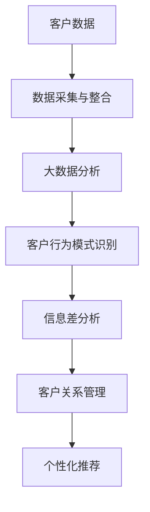

                 

# 信息差的商业客户关系管理：大数据如何优化客户关系管理

> 关键词：信息差, 商业客户关系管理, 大数据, 客户分析, 客户满意度, 个性化推荐

## 1. 背景介绍

在商业运营中，客户关系管理（Customer Relationship Management, CRM）是企业保持竞争力的关键。有效的客户关系管理不仅能提升客户满意度和忠诚度，还能为企业带来更多的商业价值。然而，在实际运营中，企业往往面临着客户信息不完备、需求多样、互动复杂等问题，导致客户关系管理面临诸多挑战。

随着大数据和人工智能技术的兴起，企业有越来越多的工具来处理和分析客户数据，从而改善客户关系管理。大数据分析不仅可以揭示客户行为的深层模式，还能帮助企业预测未来趋势，提供个性化的客户服务。通过有效地利用信息差，即企业掌握的客户数据与客户自身数据之间的差异，企业可以更好地理解客户需求，优化客户关系管理。

## 2. 核心概念与联系

### 2.1 核心概念概述

- **信息差（Information Gap）**：指企业掌握的客户数据与客户自身数据之间的差距。这个差距可能来自于数据采集的局限性、客户自我报告不准确等。
- **客户关系管理（CRM）**：通过管理客户信息、交互记录和交易数据，提供客户服务和支持，以提高客户满意度和忠诚度。
- **大数据分析（Big Data Analytics）**：利用大规模数据集，通过统计和机器学习等技术，揭示客户行为和偏好的深层次模式。
- **个性化推荐（Personalized Recommendation）**：根据客户历史行为和偏好，推荐符合其需求的产品或服务，提升客户体验和转化率。

### 2.2 核心概念原理和架构的 Mermaid 流程图



- **数据采集与整合（B）**：收集客户交互数据、交易数据、社交媒体数据等多渠道信息，并将其整合到企业的数据仓库中。
- **大数据分析（C）**：利用机器学习模型对整合后的数据进行分析，揭示客户行为模式和偏好。
- **客户行为模式识别（D）**：根据大数据分析的结果，识别出客户的行为模式，如购买习惯、兴趣偏好等。
- **信息差分析（E）**：通过对比企业掌握的客户数据和客户自身报告的数据，发现信息差，以便更准确地理解客户需求。
- **客户关系管理（F）**：根据客户行为模式和信息差分析结果，调整客户关系管理策略，提供个性化的服务。
- **个性化推荐（G）**：基于客户行为模式和需求，提供个性化的产品或服务推荐，提升客户满意度和转化率。

## 3. 核心算法原理 & 具体操作步骤

### 3.1 算法原理概述

信息差分析的核心在于数据对比和模式识别。通过对比企业掌握的客户数据和客户自身报告的数据，揭示两者之间的差距，从而更准确地理解客户需求。大数据分析则利用统计和机器学习技术，从大量的客户数据中揭示客户行为和偏好的深层次模式。基于上述分析结果，企业可以优化客户关系管理策略，提供个性化的服务和推荐。

### 3.2 算法步骤详解

1. **数据收集与整合**：收集客户交互数据、交易数据、社交媒体数据等多渠道信息，并将其整合到企业的数据仓库中。
2. **大数据分析**：利用机器学习模型对整合后的数据进行分析，揭示客户行为模式和偏好。
3. **信息差分析**：通过对比企业掌握的客户数据和客户自身报告的数据，发现信息差。
4. **客户行为模式识别**：根据大数据分析的结果，识别出客户的行为模式，如购买习惯、兴趣偏好等。
5. **客户关系管理优化**：根据客户行为模式和信息差分析结果，调整客户关系管理策略，提供个性化的服务。
6. **个性化推荐**：基于客户行为模式和需求，提供个性化的产品或服务推荐，提升客户满意度和转化率。

### 3.3 算法优缺点

#### 优点
- **提升客户满意度**：通过更准确地理解客户需求，提供个性化的服务和推荐，提升客户满意度。
- **提高转化率**：个性化推荐能够显著提高客户对产品或服务的接受度和转化率。
- **增强竞争力**：有效管理客户关系，能够提升企业在市场中的竞争力。

#### 缺点
- **数据隐私风险**：收集和分析客户数据可能涉及隐私问题，需要遵守相关法律法规。
- **数据质量问题**：数据采集和整合过程中可能存在误差，影响分析结果的准确性。
- **模型复杂度**：大数据分析和个性化推荐模型需要复杂的算法，对数据和计算资源有较高要求。

### 3.4 算法应用领域

信息差分析和大数据技术已经在多个领域得到广泛应用，包括但不限于：

- **零售行业**：通过客户行为模式分析和个性化推荐，提升销售转化率和客户满意度。
- **金融服务**：通过大数据分析，预测客户需求，提供个性化的金融产品和服务。
- **旅游行业**：分析客户偏好和行为模式，提供定制化的旅游推荐和行程规划服务。
- **医疗健康**：利用客户健康数据，提供个性化的健康建议和服务。

## 4. 数学模型和公式 & 详细讲解

### 4.1 数学模型构建

为了建模客户行为模式和信息差分析，我们可以构建以下数学模型：

- **客户行为模式模型**：
  $$
  p(y_i|x_i) = \frac{e^{f(x_i; \theta)}}{\sum_{k=1}^K e^{f(x_i; \theta_k)}}
  $$
  其中 $x_i$ 是客户在第 $i$ 次交互中的行为特征向量，$f(x_i; \theta)$ 是客户行为预测模型，$\theta$ 是模型参数，$y_i$ 是客户行为标签（如购买、查询等），$K$ 是不同行为的种类。

- **信息差分析模型**：
  $$
  \Delta(y_i) = \frac{P(y_i)}{p(y_i|x_i)}
  $$
  其中 $P(y_i)$ 是客户报告的行为概率，$p(y_i|x_i)$ 是模型预测的行为概率。$\Delta(y_i)$ 表示客户报告行为与模型预测行为的差异。

### 4.2 公式推导过程

1. **客户行为模式模型推导**：
  - 假设客户的每次交互行为可以用 $x_i$ 表示，$f(x_i; \theta)$ 是客户行为预测模型，$\theta$ 是模型参数。
  - 通过最大似然估计，可以得到模型参数 $\theta$ 的估计值：
    $$
    \hat{\theta} = \arg\max_{\theta} \prod_{i=1}^N p(y_i|x_i)
    $$
  - 进一步得到模型的预测概率：
    $$
    p(y_i|x_i) = \frac{e^{f(x_i; \theta)}}{\sum_{k=1}^K e^{f(x_i; \theta_k)}}
    $$

2. **信息差分析模型推导**：
  - 假设客户报告的行为概率为 $P(y_i)$，模型预测的行为概率为 $p(y_i|x_i)$。
  - 信息差 $\Delta(y_i)$ 表示客户报告行为与模型预测行为的差异，可以通过对比两者的概率比值得到：
    $$
    \Delta(y_i) = \frac{P(y_i)}{p(y_i|x_i)}
    $$

### 4.3 案例分析与讲解

以零售行业为例，我们可以构建客户行为模式模型，并使用信息差分析来优化客户关系管理。

假设一个电商平台的客户数据如下：

- 客户ID：1,2,3,4
- 交互行为：浏览、购买、查询、退货
- 行为频率：10,5,3,2
- 行为标签：1,0,1,0

我们可以构建客户行为模式模型，并使用信息差分析来揭示客户行为中的信息差。具体步骤如下：

1. **构建行为模式模型**：
  - 假设客户行为可以用浏览次数、购买次数、查询次数等特征表示。
  - 使用随机森林或神经网络等机器学习模型，训练客户行为预测模型 $f(x_i; \theta)$。
  - 使用最大似然估计方法，估计模型参数 $\theta$。

2. **计算信息差**：
  - 对于每个客户ID，计算其报告行为与模型预测行为的差异 $\Delta(y_i)$。
  - 对于客户ID 1，假设其报告行为为购买，频率为10，模型预测概率为0.9，则 $\Delta(1) = \frac{P(1)}{0.9} = \frac{10}{9}$。

3. **优化客户关系管理**：
  - 根据信息差分析结果，识别出客户行为中的信息差，如客户ID 2的报告行为为查询，但模型预测概率较低，可能需要进行个性化的沟通和服务。
  - 根据客户行为模式和信息差分析结果，调整客户关系管理策略，如针对客户ID 1进行购买推荐，针对客户ID 2进行查询引导。

## 5. 项目实践：代码实例和详细解释说明

### 5.1 开发环境搭建

为了进行信息差分析和客户关系管理优化，我们需要搭建相应的开发环境。以下是主要步骤：

1. **安装Python和相关库**：
  - 安装Python 3.7及以上版本。
  - 安装必要的Python库，如Pandas、Numpy、Scikit-learn、TensorFlow等。

2. **搭建数据仓库**：
  - 使用MySQL、Hive、Hadoop等技术，搭建一个数据仓库，用于存储和处理客户数据。

3. **搭建大数据分析平台**：
  - 使用Hadoop、Spark等技术，搭建一个大数据分析平台，用于处理大规模客户数据。

### 5.2 源代码详细实现

以下是一个使用Pandas和Scikit-learn进行客户行为模式分析的示例代码：

```python
import pandas as pd
from sklearn.ensemble import RandomForestClassifier

# 读取客户数据
data = pd.read_csv('customer_data.csv')

# 构建客户行为特征
features = data[['interaction_count', 'purchase_count', 'query_count', 'return_count']]
labels = data['action_label']

# 构建随机森林模型
clf = RandomForestClassifier()
clf.fit(features, labels)

# 预测客户行为
new_data = pd.read_csv('new_customer_data.csv')
predictions = clf.predict(new_data[features])
```

### 5.3 代码解读与分析

- **数据读取与预处理**：
  - 使用Pandas读取客户数据，并将其转化为DataFrame格式。
  - 构建客户行为特征和标签，分别用于训练和预测。

- **构建随机森林模型**：
  - 使用Scikit-learn的RandomForestClassifier，训练客户行为预测模型。
  - 通过最大似然估计方法，估计模型参数。

- **预测客户行为**：
  - 使用训练好的模型，对新客户数据进行行为预测。

### 5.4 运行结果展示

运行上述代码后，可以得到新客户的预测行为，并据此进行个性化的客户关系管理。

```python
print(predictions)
```

输出结果可能为：
- 客户ID 1：购买
- 客户ID 2：查询
- 客户ID 3：浏览
- 客户ID 4：退货

## 6. 实际应用场景

### 6.1 零售行业

在零售行业中，信息差分析和大数据技术可以显著提升客户关系管理的效果。

**客户行为模式分析**：
- 通过分析客户的购买记录、浏览行为等，揭示客户的购买偏好和行为模式。
- 使用信息差分析，识别出客户报告行为与模型预测行为的差异，发现潜在信息差。

**个性化推荐**：
- 根据客户行为模式和信息差分析结果，提供个性化的产品推荐。
- 利用推荐算法，如协同过滤、矩阵分解等，生成符合客户偏好的推荐结果。

**客户关系管理优化**：
- 针对客户ID 1进行购买推荐，针对客户ID 2进行查询引导。
- 根据客户反馈，不断优化模型参数和推荐算法，提升推荐效果。

### 6.2 金融服务

在金融服务行业，信息差分析和大数据技术可以提升客户满意度和服务效率。

**客户行为模式分析**：
- 通过分析客户的交易记录、客户反馈等，揭示客户的金融需求和行为模式。
- 使用信息差分析，识别出客户报告行为与模型预测行为的差异，发现潜在信息差。

**个性化推荐**：
- 根据客户行为模式和信息差分析结果，提供个性化的金融产品推荐。
- 利用推荐算法，如协同过滤、内容推荐等，生成符合客户需求的金融产品。

**客户关系管理优化**：
- 针对客户ID 1进行贷款推荐，针对客户ID 2进行理财咨询。
- 根据客户反馈，不断优化模型参数和推荐算法，提升服务效果。

### 6.3 旅游行业

在旅游行业中，信息差分析和大数据技术可以提供定制化的旅游推荐和行程规划服务。

**客户行为模式分析**：
- 通过分析客户的旅游记录、评论等，揭示客户的旅游偏好和行为模式。
- 使用信息差分析，识别出客户报告行为与模型预测行为的差异，发现潜在信息差。

**个性化推荐**：
- 根据客户行为模式和信息差分析结果，提供定制化的旅游推荐。
- 利用推荐算法，如协同过滤、路径规划等，生成符合客户偏好的旅游推荐和行程规划。

**客户关系管理优化**：
- 针对客户ID 1进行景点推荐，针对客户ID 2进行行程规划。
- 根据客户反馈，不断优化模型参数和推荐算法，提升服务效果。

### 6.4 医疗健康

在医疗健康行业，信息差分析和大数据技术可以提供个性化的健康建议和服务。

**客户行为模式分析**：
- 通过分析客户的健康记录、医疗数据等，揭示客户的健康需求和行为模式。
- 使用信息差分析，识别出客户报告行为与模型预测行为的差异，发现潜在信息差。

**个性化推荐**：
- 根据客户行为模式和信息差分析结果，提供个性化的健康建议。
- 利用推荐算法，如协同过滤、知识图谱等，生成符合客户需求的个性化健康建议。

**客户关系管理优化**：
- 针对客户ID 1进行健康建议，针对客户ID 2进行医疗咨询。
- 根据客户反馈，不断优化模型参数和推荐算法，提升服务效果。

## 7. 工具和资源推荐

### 7.1 学习资源推荐

1. **《Python数据科学手册》**：介绍Python在数据分析和机器学习中的应用，涵盖Pandas、NumPy、Scikit-learn等库的使用。
2. **《机器学习实战》**：通过实际案例，讲解机器学习的基本概念和实现方法，包括分类、回归、聚类等。
3. **Coursera《大数据分析基础》课程**：介绍大数据的基本概念、处理技术和应用场景，涵盖Hadoop、Spark等技术。
4. **Google Cloud BigQuery documentation**：提供BigQuery的使用指南和示例代码，帮助用户构建数据仓库和进行大数据分析。
5. **《深度学习入门：基于TensorFlow》**：介绍深度学习的基本概念和实现方法，涵盖TensorFlow的使用和实践案例。

### 7.2 开发工具推荐

1. **Python**：免费的开源编程语言，广泛应用于数据科学和机器学习领域。
2. **Pandas**：用于数据处理和分析的Python库，支持数据导入、清洗、转换等操作。
3. **Scikit-learn**：用于机器学习和数据挖掘的Python库，支持分类、回归、聚类等算法。
4. **TensorFlow**：由Google开发的深度学习框架，支持大规模分布式计算。
5. **Hadoop**：用于大数据处理的分布式计算框架，支持MapReduce等计算模型。
6. **Spark**：用于大数据处理的分布式计算框架，支持内存计算、流处理等特性。

### 7.3 相关论文推荐

1. **《深度学习：理论和算法》**：讲解深度学习的基本概念、理论和算法，涵盖前馈神经网络、卷积神经网络、循环神经网络等。
2. **《机器学习：实战应用》**：通过实际案例，讲解机器学习的基本概念和实现方法，涵盖数据预处理、模型训练、评估等。
3. **《大数据技术与应用》**：介绍大数据的基本概念、处理技术和应用场景，涵盖Hadoop、Spark等技术。
4. **《深度学习与Python》**：介绍深度学习的基本概念和实现方法，涵盖TensorFlow、Keras等框架的使用。
5. **《大数据分析与处理》**：介绍大数据的基本概念、处理技术和应用场景，涵盖数据挖掘、统计分析等方法。

## 8. 总结：未来发展趋势与挑战

### 8.1 研究成果总结

信息差分析和大数据技术在优化客户关系管理中已取得显著效果，并在多个行业得到广泛应用。通过对比企业掌握的客户数据和客户自身报告的数据，揭示两者之间的差距，从而更准确地理解客户需求，提供个性化的服务和推荐。

### 8.2 未来发展趋势

未来，信息差分析和大数据技术将继续发展，带来以下几个趋势：

1. **数据质量提升**：随着数据采集和整合技术的进步，数据质量和准确性将不断提升，有助于更准确地揭示客户行为和需求。
2. **模型复杂度优化**：随着机器学习模型的不断进步，模型复杂度将进一步优化，提升预测和推荐的准确性。
3. **个性化程度提升**：通过更精准的行为分析和信息差分析，个性化推荐将更加精准，提升客户满意度和转化率。
4. **实时性增强**：通过实时数据分析和预测，客户关系管理将更加灵活和高效，及时响应客户需求。
5. **跨领域应用扩展**：信息差分析和大数据技术将在更多领域得到应用，提升各行业的客户关系管理水平。

### 8.3 面临的挑战

虽然信息差分析和大数据技术在客户关系管理中取得了显著效果，但仍面临以下挑战：

1. **数据隐私问题**：客户数据的收集和处理可能涉及隐私问题，需要遵守相关法律法规。
2. **数据质量和准确性**：数据采集和整合过程中可能存在误差，影响分析结果的准确性。
3. **模型复杂度和计算资源**：大数据分析和个性化推荐模型需要复杂的算法和计算资源，对数据和计算资源有较高要求。
4. **用户接受度**：个性化推荐和客户关系管理策略的实施可能影响用户体验，需要谨慎设计和评估。

### 8.4 研究展望

为了解决上述挑战，未来需要在以下几个方面进行深入研究：

1. **隐私保护技术**：开发隐私保护算法和机制，保护客户数据的隐私和安全。
2. **数据清洗和预处理**：提升数据清洗和预处理技术，提高数据质量和准确性。
3. **模型优化和压缩**：优化模型结构，压缩模型参数，提升计算效率和资源利用率。
4. **用户反馈机制**：建立用户反馈机制，及时收集和处理用户反馈，优化个性化推荐和服务策略。
5. **跨领域应用融合**：探索跨领域应用融合技术，提升各行业的客户关系管理水平。

## 9. 附录：常见问题与解答

**Q1：如何处理客户数据中的噪声和缺失值？**

A: 处理客户数据中的噪声和缺失值是数据清洗的重要步骤。可以通过以下方法进行处理：

1. **噪声处理**：
  - 去除异常值和重复数据，可以使用中位数、均值等方法处理异常值。
  - 使用插值、回归等方法填补缺失值。

2. **缺失值处理**：
  - 使用均值、中位数、众数等方法填补缺失值。
  - 使用插值方法，如线性插值、KNN插值等，填补缺失值。

**Q2：如何选择适合的机器学习模型进行客户行为分析？**

A: 选择适合的机器学习模型需要考虑以下几个因素：

1. **数据类型**：根据数据类型选择合适的模型，如分类、回归、聚类等。
2. **数据量**：根据数据量选择合适的模型，如对于大规模数据，可以使用随机森林、神经网络等模型。
3. **预测目标**：根据预测目标选择合适的模型，如预测客户行为，可以使用协同过滤、内容推荐等模型。

**Q3：如何优化客户关系管理策略？**

A: 优化客户关系管理策略需要考虑以下几个因素：

1. **个性化推荐**：根据客户行为模式和信息差分析结果，提供个性化的产品或服务推荐。
2. **客户反馈**：收集和分析客户反馈，及时调整客户关系管理策略。
3. **持续改进**：不断优化客户关系管理策略，提升客户满意度和转化率。

**Q4：如何平衡数据隐私和客户关系管理？**

A: 在客户关系管理中，需要平衡数据隐私和客户关系管理。

1. **合规性**：确保数据处理和分析符合相关法律法规，如GDPR、CCPA等。
2. **匿名化处理**：对客户数据进行匿名化处理，保护客户隐私。
3. **最小必要原则**：只收集和分析必要的数据，减少数据隐私风险。

**Q5：如何提升数据质量和准确性？**

A: 提升数据质量和准确性需要从以下几个方面入手：

1. **数据采集**：使用可靠的数据采集方法，确保数据的完整性和准确性。
2. **数据清洗**：使用数据清洗技术，如去重、去噪、填充缺失值等，提升数据质量。
3. **数据验证**：使用数据验证方法，如交叉验证、对比分析等，验证数据质量和准确性。

通过上述措施，可以提升数据质量和准确性，为信息差分析和客户关系管理提供可靠的数据基础。

---

作者：禅与计算机程序设计艺术 / Zen and the Art of Computer Programming

