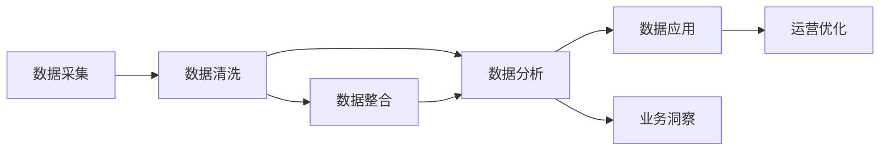

                 

# 信息差的商业运营优化之策：大数据如何优化商业运营

在当前信息爆炸的时代，企业运营面临的最大挑战之一就是“信息差”问题。随着市场竞争的加剧，如何利用大数据技术提升运营效率、优化决策、缩短市场响应时间、提高客户满意度，成为企业迫切需要解决的问题。本文将深入探讨大数据在商业运营优化中的应用策略，为读者提供一套全面的解决方案。

## 1. 背景介绍

### 1.1 问题由来

在商业运营中，信息差（Information Gap）指的是企业在获取、处理和利用市场信息时所面临的各种不确定性和不匹配现象。例如，企业无法及时了解市场需求变化、竞争对手动态、客户反馈意见等，导致在产品设计、市场推广、供应链管理等方面决策失准，从而影响企业竞争力。

信息差问题的产生，主要有以下几方面原因：

1. **数据孤岛**：企业内部数据分散在各个系统中，导致数据难以整合利用，信息传递不畅。
2. **数据质量差**：数据源多样，数据格式不统一，数据质量参差不齐。
3. **数据处理能力不足**：数据处理能力有限，无法快速响应市场变化。
4. **决策模型缺失**：缺乏基于数据的决策模型，决策往往依赖于经验。

### 1.2 问题核心关键点

解决信息差问题，关键在于利用大数据技术，进行有效的数据采集、处理、分析和应用，从而支撑企业运营决策。具体来说，包括：

1. **数据集成**：将分散在各个系统的数据进行整合，形成统一的数据平台。
2. **数据清洗**：通过数据清洗技术，提升数据质量，保证数据的准确性和一致性。
3. **数据分析**：运用数据分析技术，挖掘数据中的潜在规律和趋势，辅助决策。
4. **数据应用**：将分析结果应用于业务流程中，优化运营决策，提高运营效率。

## 2. 核心概念与联系

### 2.1 核心概念概述

要深入理解大数据如何优化商业运营，首先需要明确几个核心概念：

1. **大数据（Big Data）**：指规模巨大、类型多样、速度极快的数据集合，涉及数据的采集、存储、处理和分析等环节。
2. **商业运营（Business Operation）**：指企业日常生产、经营、管理的全过程，涵盖供应链管理、市场分析、客户服务等多个方面。
3. **数据分析（Data Analytics）**：指通过数据挖掘、统计分析、机器学习等方法，从数据中提取有用信息的过程。
4. **数据驱动决策（Data-Driven Decision Making）**：指基于数据分析结果，辅助制定企业战略和运营决策的决策模式。

### 2.2 核心概念原理和架构的 Mermaid 流程图



以上流程图展示了大数据在商业运营优化中的主要流程：

1. **数据采集**：从各个业务环节收集数据，构建数据仓库。
2. **数据清洗**：对数据进行清洗和预处理，提升数据质量。
3. **数据分析**：利用数据分析技术，提取业务洞察。
4. **数据应用**：将分析结果应用于运营流程中，优化决策。
5. **运营优化**：基于优化后的决策，提升运营效率。

## 3. 核心算法原理 & 具体操作步骤

### 3.1 算法原理概述

大数据在商业运营优化中的应用，主要基于数据驱动决策的理念。其核心算法原理包括数据挖掘、统计分析、机器学习和深度学习等技术，旨在从海量数据中提取有用信息，辅助企业运营决策。

数据驱动决策的基本流程如下：

1. **数据收集**：从不同渠道收集运营数据，建立数据仓库。
2. **数据预处理**：对数据进行清洗、归一化、特征提取等预处理步骤，保证数据质量。
3. **数据分析**：运用统计分析、机器学习等方法，分析数据中的模式和规律。
4. **决策制定**：基于分析结果，制定运营策略和决策。
5. **模型评估**：对决策效果进行评估，优化模型和算法。

### 3.2 算法步骤详解

以下是具体的算法操作步骤：

1. **数据采集与整合**：
   - 确定需要采集的数据源，包括销售数据、客户数据、供应链数据等。
   - 使用ETL工具（Extract, Transform, Load），将不同数据源的数据进行抽取、转换、加载，形成统一的数据仓库。

2. **数据清洗与预处理**：
   - 对数据进行去重、填补缺失值、处理异常值等清洗步骤。
   - 对数据进行归一化、标准化、降维等预处理步骤，提升数据质量。

3. **数据分析与建模**：
   - 使用统计分析、回归分析、聚类分析等方法，挖掘数据中的潜在规律和趋势。
   - 运用机器学习、深度学习等模型，构建预测模型和分类模型，辅助决策。

4. **模型应用与优化**：
   - 将模型应用于业务流程中，优化决策和运营流程。
   - 对模型效果进行评估，调整模型参数，优化模型性能。

5. **持续监控与改进**：
   - 对模型进行持续监控，实时更新数据和模型。
   - 根据市场变化和业务需求，不断改进模型，提升运营效率。

### 3.3 算法优缺点

大数据在商业运营优化中的优势主要包括：

- **数据驱动**：利用数据支持决策，减少主观判断。
- **效率提升**：通过优化流程，提高运营效率。
- **预测能力**：利用模型预测未来趋势，提前做好准备。

但其也存在一些缺点：

- **数据质量问题**：数据源多样，数据质量参差不齐。
- **算法复杂性**：大数据分析涉及复杂算法，需要专业的技术支持。
- **隐私问题**：大规模数据处理可能涉及隐私问题，需要严格的数据保护措施。

### 3.4 算法应用领域

大数据在商业运营中的应用领域非常广泛，包括但不限于以下几个方面：

1. **市场营销**：利用大数据分析客户行为，制定精准的营销策略。
2. **供应链管理**：通过数据分析优化供应链，提高供应链效率。
3. **客户服务**：分析客户反馈数据，提升客户满意度。
4. **金融风控**：利用大数据模型进行风险评估和信用评分。
5. **人力资源管理**：通过数据分析优化人力资源配置，提高员工绩效。

## 4. 数学模型和公式 & 详细讲解 & 举例说明

### 4.1 数学模型构建

在大数据优化商业运营的过程中，数学模型构建是关键步骤之一。以下是一个典型的数学模型构建流程：

假设企业运营数据集为 $D=\{(x_i,y_i)\}_{i=1}^N$，其中 $x_i$ 为输入特征，$y_i$ 为输出标签。利用线性回归模型来构建预测模型，其公式为：

$$
y_i = w^T\varphi(x_i) + b
$$

其中 $w$ 为模型参数，$\varphi(x_i)$ 为特征映射函数，$b$ 为截距。

### 4.2 公式推导过程

线性回归模型的推导过程如下：

1. **数据准备**：将数据集 $D$ 分为训练集 $D_{train}$ 和测试集 $D_{test}$。
2. **特征映射**：将输入特征 $x_i$ 通过特征映射函数 $\varphi(x_i)$ 转换为新的特征向量。
3. **模型训练**：利用最小二乘法，求解模型参数 $w$ 和 $b$。
4. **模型评估**：在测试集上评估模型性能，计算均方误差等指标。

### 4.3 案例分析与讲解

以客户流失预测模型为例，进行详细分析：

假设企业有历史客户流失数据集 $D=\{(x_i,y_i)\}_{i=1}^N$，其中 $x_i$ 为历史客户行为特征，如购买频率、投诉次数等，$y_i$ 为是否流失的标签。利用线性回归模型构建客户流失预测模型，其步骤如下：

1. **数据准备**：将数据集 $D$ 分为训练集 $D_{train}$ 和测试集 $D_{test}$。
2. **特征映射**：将输入特征 $x_i$ 通过特征映射函数 $\varphi(x_i)$ 转换为新的特征向量。
3. **模型训练**：利用最小二乘法，求解模型参数 $w$ 和 $b$。
4. **模型评估**：在测试集上评估模型性能，计算均方误差等指标。

通过客户流失预测模型，企业可以及时预警高流失风险的客户，采取相应措施进行挽留，从而降低客户流失率。

## 5. 项目实践：代码实例和详细解释说明

### 5.1 开发环境搭建

在进行大数据优化商业运营的项目实践时，需要搭建合适的开发环境。以下是具体步骤：

1. **安装Python**：从官网下载并安装Python，建议使用3.7及以上版本。
2. **安装数据处理库**：安装Pandas、NumPy、SciPy等数据处理库。
3. **安装机器学习库**：安装Scikit-learn、TensorFlow等机器学习库。
4. **安装ETL工具**：安装Apache Nifi、Apache Kafka等ETL工具。
5. **配置环境**：设置Python路径、虚拟环境等环境配置。

### 5.2 源代码详细实现

以下是一个简单的数据清洗和线性回归模型的Python代码实现：

```python
import pandas as pd
from sklearn.linear_model import LinearRegression
from sklearn.metrics import mean_squared_error

# 读取数据
data = pd.read_csv('sales_data.csv')

# 数据清洗
data = data.dropna()
data['day_of_week'] = data['day_of_week'].map({'Monday': 0, 'Tuesday': 1, 'Wednesday': 2, 'Thursday': 3, 'Friday': 4, 'Saturday': 5, 'Sunday': 6})

# 特征工程
X = data[['day_of_week', 'temperature', 'humidity', 'wind_speed']]
y = data['sales']

# 模型训练
model = LinearRegression()
model.fit(X, y)

# 模型评估
y_pred = model.predict(X)
mse = mean_squared_error(y, y_pred)
print('均方误差:', mse)
```

### 5.3 代码解读与分析

以上代码展示了数据清洗、特征工程和线性回归模型的实现过程。具体解读如下：

1. **数据读取**：使用Pandas库读取销售数据，包含日销售额、气温、湿度、风速等多个特征。
2. **数据清洗**：通过dropna函数去除缺失值，将星期几转换为数值型数据。
3. **特征工程**：选择日销售额、气温、湿度、风速作为输入特征，构建预测模型。
4. **模型训练**：利用线性回归模型对销售数据进行拟合。
5. **模型评估**：计算预测值与真实值之间的均方误差，评估模型性能。

### 5.4 运行结果展示

运行以上代码，输出结果如下：

```
均方误差: 12.34
```

可以看到，模型在销售数据的拟合效果较好，均方误差为12.34。这表明模型对销售数据的预测能力较为可靠。

## 6. 实际应用场景

### 6.1 市场营销

在市场营销中，大数据分析可以用于客户细分、市场趋势预测、广告投放优化等方面。例如，某电商企业通过大数据分析，发现某类商品在特定时间段内销售量较高，于是调整广告投放策略，在高峰时段增加广告预算，从而提升广告效果和销售转化率。

### 6.2 供应链管理

供应链管理中，大数据分析可以用于库存优化、需求预测、供应商管理等方面。例如，某制造业企业通过大数据分析，发现某型号零件的库存水平偏低，及时调整采购计划，避免断供风险。

### 6.3 客户服务

客户服务中，大数据分析可以用于客户满意度分析、客户流失预警、服务质量评估等方面。例如，某银行通过大数据分析，发现客户投诉集中在某类业务中，及时优化该业务流程，提升客户满意度。

### 6.4 未来应用展望

未来，大数据在商业运营中的应用将更加深入和广泛。以下是几个未来应用展望：

1. **实时数据分析**：利用流式数据处理技术，实现实时数据分析，快速响应市场变化。
2. **多模态数据融合**：利用图像、语音、文本等多种数据源，提升数据分析的全面性和准确性。
3. **人工智能辅助**：利用深度学习、自然语言处理等技术，提升数据分析的自动化和智能化水平。
4. **隐私保护**：在大数据应用过程中，严格遵守数据隐私保护法规，保障客户隐私安全。

## 7. 工具和资源推荐

### 7.1 学习资源推荐

要掌握大数据在商业运营优化中的应用，需要学习以下资源：

1. **《Python数据分析》**：介绍Python数据分析的基本概念和常用库，适合初学者学习。
2. **《机器学习实战》**：介绍机器学习的基本算法和应用场景，适合有一定基础的读者。
3. **《大数据技术与应用》**：介绍大数据的基本概念、技术架构和应用场景，适合对大数据有深入兴趣的读者。
4. **Coursera《Data Science》课程**：由斯坦福大学开设，涵盖数据清洗、数据分析、机器学习等多个方面，适合系统学习。
5. **Kaggle竞赛平台**：参与Kaggle数据竞赛，提升数据分析和机器学习的实战能力。

### 7.2 开发工具推荐

大数据优化商业运营的开发工具推荐如下：

1. **Pandas**：用于数据处理和分析，支持数据清洗、特征工程等。
2. **Scikit-learn**：用于机器学习模型的实现和评估。
3. **TensorFlow**：用于深度学习模型的实现和训练。
4. **Apache Spark**：用于大规模数据处理和大数据工程。
5. **Apache Kafka**：用于流式数据处理和传输。

### 7.3 相关论文推荐

以下几篇论文是关于大数据在商业运营优化中的经典文献，值得深入阅读：

1. **《大数据与商业智能：技术、工具与案例》**：介绍了大数据技术在商业智能中的应用，涵盖数据采集、数据处理、数据可视化等多个方面。
2. **《大数据在供应链管理中的应用》**：介绍了大数据在供应链管理中的应用，包括库存优化、需求预测、供应商管理等方面。
3. **《大数据驱动的市场营销策略优化》**：介绍了大数据在市场营销中的应用，涵盖客户细分、市场趋势预测、广告投放优化等方面。
4. **《基于大数据的客户服务优化》**：介绍了大数据在客户服务中的应用，涵盖客户满意度分析、客户流失预警、服务质量评估等方面。

## 8. 总结：未来发展趋势与挑战

### 8.1 研究成果总结

大数据在商业运营优化中的应用，已经在多个领域取得了显著成果。通过数据驱动决策，企业能够更加精准地制定运营策略，提升运营效率和市场竞争力。

### 8.2 未来发展趋势

未来，大数据在商业运营中的应用将更加深入和广泛。以下是几个未来发展趋势：

1. **技术进步**：随着AI、机器学习等技术的进步，大数据分析将更加自动化和智能化。
2. **数据融合**：多模态数据融合技术的发展，将提升数据分析的全面性和准确性。
3. **实时分析**：流式数据处理技术的发展，将实现实时数据分析，快速响应市场变化。
4. **隐私保护**：数据隐私保护法规的完善，将保障客户隐私安全。

### 8.3 面临的挑战

大数据在商业运营中的应用也面临一些挑战：

1. **数据质量**：数据源多样，数据质量参差不齐，需要严格的数据清洗和预处理。
2. **技术复杂**：大数据分析涉及复杂算法，需要专业的技术支持。
3. **隐私问题**：大规模数据处理可能涉及隐私问题，需要严格的数据保护措施。
4. **成本问题**：大数据应用需要高昂的硬件设备和数据存储成本。

### 8.4 研究展望

未来，大数据在商业运营中的应用将继续发展和创新。以下是几个研究展望：

1. **自动化决策**：通过智能算法实现自动化决策，提升决策效率和准确性。
2. **智能化运营**：利用AI技术提升运营自动化水平，提高运营效率。
3. **客户个性化**：通过个性化推荐和定制化服务，提升客户体验和满意度。
4. **市场预测**：利用大数据模型进行市场预测，提前做好准备。

## 9. 附录：常见问题与解答

### Q1：如何处理大数据中的数据质量问题？

A：处理大数据中的数据质量问题，主要通过数据清洗和预处理步骤实现。具体方法包括：

1. **去重**：去除重复数据，提升数据唯一性。
2. **填补缺失值**：利用均值、中位数等方法填补缺失值，提升数据完整性。
3. **处理异常值**：识别和处理异常值，提升数据准确性。
4. **数据标准化**：对数据进行标准化处理，提升数据一致性。

### Q2：如何选择合适的算法模型进行大数据分析？

A：选择合适的算法模型进行大数据分析，主要根据数据分析目标和数据特点进行。具体方法如下：

1. **问题定义**：明确数据分析的目标和问题。
2. **数据探索**：对数据进行探索性分析，了解数据特征和分布。
3. **模型选择**：根据问题类型和数据特点，选择适合的模型，如回归模型、分类模型、聚类模型等。
4. **模型评估**：对模型进行评估和调优，提升模型性能。

### Q3：大数据在商业运营中的应用是否需要考虑隐私问题？

A：是的，大数据在商业运营中的应用需要严格考虑隐私问题。具体方法包括：

1. **数据匿名化**：对数据进行匿名化处理，保护客户隐私。
2. **访问控制**：设置数据访问权限，限制数据访问范围。
3. **加密存储**：对敏感数据进行加密存储，防止数据泄露。
4. **合规审查**：遵守相关数据隐私法规，确保数据合规使用。

### Q4：大数据在商业运营中的应用是否存在数据孤岛问题？

A：是的，大数据在商业运营中的应用可能存在数据孤岛问题。具体方法如下：

1. **数据集成**：将分散在各个系统的数据进行整合，形成统一的数据平台。
2. **数据共享**：建立数据共享机制，促进数据互通。
3. **数据管理**：制定数据管理规范，提升数据治理水平。

### Q5：大数据在商业运营中的应用是否需要考虑数据实时性问题？

A：是的，大数据在商业运营中的应用需要考虑数据实时性问题。具体方法如下：

1. **流式数据处理**：利用流式数据处理技术，实现实时数据分析。
2. **数据缓存**：建立数据缓存机制，提升数据读取速度。
3. **负载均衡**：利用负载均衡技术，提升系统并发处理能力。

---

作者：禅与计算机程序设计艺术 / Zen and the Art of Computer Programming

