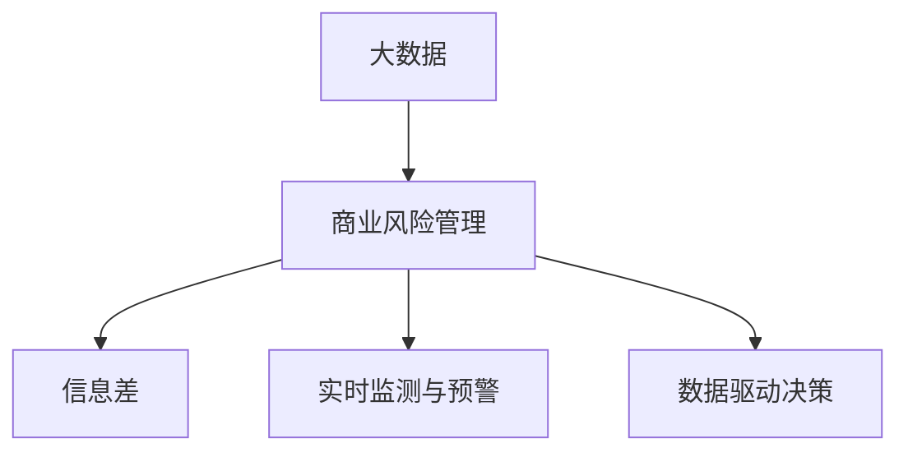

                 

## 1. 背景介绍

### 1.1 问题由来
随着现代商业环境的快速变化，信息不对称和信息差(Information Gap)问题日益成为企业风险管理的重要挑战。信息差指的是由于信息不对称，导致某些参与者拥有更多的信息，从而形成决策优势。这不仅影响了市场效率，还导致了交易成本的增加，甚至引发了潜在的欺诈风险。传统风险管理方法往往难以应对信息差带来的复杂性，无法实现实时、动态的风险管控。

### 1.2 问题核心关键点
在现代商业中，信息差的来源和表现形式多种多样，如消费者与商家之间的信息不对称、供应链上下游的信息不透明、市场情报的获取难度等。这些问题使得传统风险管理方法难以发挥作用，亟需一种更加智能、动态的方法来解决。

大数据技术的兴起为信息差的商业风险管理提供了新的解决方案。通过收集、处理和分析海量数据，企业可以实时监测市场动态，预测信息差带来的潜在风险，从而及时调整决策和应对策略，降低信息差对商业活动的负面影响。

### 1.3 问题研究意义
研究大数据在商业风险管理中的应用，对于提升企业的风险管控能力，降低信息差带来的商业风险，具有重要意义：

1. **提升决策精准性**：大数据分析能够揭示市场变化和消费者行为背后的真实原因，帮助企业做出更精准的决策，减少信息差带来的误判。
2. **优化资源配置**：通过对海量数据的分析，企业能够更好地理解不同业务领域的需求和机会，合理分配资源，提高运营效率。
3. **降低交易成本**：大数据分析可以实时监控市场动态，预测交易风险，降低交易双方因信息不对称产生的信任成本。
4. **增强市场透明度**：通过公开透明的数据分享，企业能够提升市场透明度，减少供应链中的信息不对称问题，优化供应链管理。
5. **预防欺诈行为**：大数据分析可以识别异常交易行为，实时预警潜在的欺诈风险，保护企业资产安全。

## 2. 核心概念与联系

### 2.1 核心概念概述

为更好地理解大数据在商业风险管理中的应用，本节将介绍几个密切相关的核心概念：

- **大数据(Big Data)**：指体量巨大、结构复杂、更新快速的数据集合。通过大数据技术，企业能够高效处理和分析海量数据，提取有价值的商业洞见。
- **商业风险管理(Business Risk Management)**：指通过识别、评估和控制商业活动中的风险，保护企业利益和声誉的过程。大数据技术可以提供实时、全面的风险评估和预警能力。
- **信息差(Information Gap)**：指由于信息不对称，导致某些参与者拥有更多信息，从而形成决策优势。大数据技术能够揭示信息差背后的数据特征，帮助企业理解并应对信息差问题。
- **实时监测与预警**：通过大数据分析技术，企业能够实现对市场动态的实时监测，及时预警潜在的商业风险，做出快速反应。
- **数据驱动决策**：企业通过分析海量数据，提取关键洞见，实现数据驱动的决策过程，提高决策的科学性和精准性。

这些核心概念之间的逻辑关系可以通过以下Mermaid流程图来展示：



这个流程图展示了大数据技术在商业风险管理中的作用，主要体现在揭示信息差、实时监测与预警、数据驱动决策等方面。

## 3. 核心算法原理 & 具体操作步骤
### 3.1 算法原理概述

基于大数据的商业风险管理方法，核心在于通过数据挖掘和机器学习算法，发现市场动态和风险信号，从而实现实时监测和预警。具体流程包括以下几个关键步骤：

1. **数据收集**：从多个数据源（如社交媒体、电商平台、供应链系统等）收集相关数据，形成综合数据集。
2. **数据清洗和预处理**：对数据进行去重、去噪、格式转换等处理，确保数据质量和一致性。
3. **特征提取与选择**：利用机器学习算法，提取数据中的关键特征，选择对风险评估有重要影响的指标。
4. **风险评估与预警**：基于特征选择的结果，构建风险评估模型，实时监测市场动态，预警潜在的风险事件。
5. **决策支持**：利用数据分析结果，支持企业的风险应对和资源配置决策。

### 3.2 算法步骤详解

以下是基于大数据的商业风险管理方法的具体操作步骤：

**Step 1: 数据收集**
- 从社交媒体平台、电商平台、供应链系统等多个数据源，收集相关数据，形成综合数据集。
- 数据类型包括但不限于：用户行为数据、交易数据、供应链数据、市场情报等。

**Step 2: 数据清洗与预处理**
- 对数据进行去重、去噪、格式转换等处理，确保数据质量和一致性。
- 使用数据清洗工具（如Pandas、Apache Nifi等）进行数据预处理，确保数据的完整性和准确性。

**Step 3: 特征提取与选择**
- 利用机器学习算法（如PCA、LDA、TF-IDF等）提取数据中的关键特征。
- 选择对风险评估有重要影响的指标，构建特征集。

**Step 4: 风险评估与预警**
- 构建风险评估模型（如逻辑回归、随机森林、神经网络等），训练模型并验证其效果。
- 实时监测市场动态，预测潜在风险事件。
- 设置预警阈值，一旦触发预警，及时通知相关人员采取应对措施。

**Step 5: 决策支持**
- 利用数据分析结果，支持企业的风险应对和资源配置决策。
- 通过可视化工具（如Tableau、Power BI等）展示风险评估和预警结果。

### 3.3 算法优缺点

基于大数据的商业风险管理方法具有以下优点：
1. **实时性**：大数据技术能够实时监测市场动态，快速响应风险事件，减少损失。
2. **全面性**：通过收集和分析多种类型的数据，能够全面评估潜在风险，避免单一数据源带来的误判。
3. **准确性**：利用机器学习算法提取关键特征，构建风险评估模型，提高风险评估的准确性。
4. **自动化**：通过自动化流程，减少人工干预，提高风险管理的效率和一致性。

同时，该方法也存在一些局限性：
1. **数据隐私问题**：收集和处理大量个人和商业数据，可能引发数据隐私和安全问题。
2. **数据质量问题**：数据源多样、数据类型复杂，数据质量难以保证。
3. **技术门槛高**：需要具备大数据处理和机器学习的基础，技术门槛较高。
4. **模型可解释性不足**：部分机器学习模型（如深度学习）缺乏可解释性，难以理解模型的决策过程。
5. **误报和漏报**：模型可能会产生误报或漏报，影响风险管理的准确性。

尽管存在这些局限性，但就目前而言，基于大数据的商业风险管理方法仍是大数据应用的主流范式。未来相关研究将更多关注如何提升数据质量、降低技术门槛、增强模型可解释性，从而进一步提升风险管理的精度和效率。

### 3.4 算法应用领域

基于大数据的商业风险管理方法已经广泛应用于多个领域，包括但不限于：

- **零售行业**：通过分析用户行为数据、交易数据，实时监测市场变化，预测销售趋势，优化库存管理。
- **金融行业**：利用交易数据、市场情报，构建风险评估模型，实时预警潜在的欺诈风险、市场风险，增强风险控制能力。
- **供应链管理**：通过供应链数据、物流信息，实时监测供应链风险，优化供应链管理，减少信息不对称带来的问题。
- **医疗健康**：利用患者数据、医疗记录，构建风险评估模型，预测疾病风险，优化医疗资源配置。
- **政府治理**：通过公共数据、社交媒体信息，监测社会舆情，预防公共安全事件，增强政府治理能力。

## 4. 数学模型和公式 & 详细讲解  
### 4.1 数学模型构建

本节将使用数学语言对基于大数据的商业风险管理方法进行更加严格的刻画。

假设企业收集的数据集为 $D=\{(x_i,y_i)\}_{i=1}^N$，其中 $x_i$ 为输入特征， $y_i$ 为对应的风险标签。定义风险评估模型的损失函数为 $L(\theta)$，其中 $\theta$ 为模型参数。风险评估模型的目标是最小化损失函数 $L(\theta)$，即：

$$
\hat{\theta} = \mathop{\arg\min}_{\theta} L(\theta)
$$

在实践中，我们通常使用基于梯度的优化算法（如SGD、Adam等）来近似求解上述最优化问题。设 $\eta$ 为学习率，则参数的更新公式为：

$$
\theta \leftarrow \theta - \eta \nabla_{\theta}L(\theta)
$$

其中 $\nabla_{\theta}L(\theta)$ 为损失函数对参数 $\theta$ 的梯度，可通过反向传播算法高效计算。

### 4.2 公式推导过程

以下我们以逻辑回归模型为例，推导风险评估模型的损失函数及其梯度的计算公式。

假设模型 $M_{\theta}$ 在输入 $x$ 上的输出为 $\hat{y}=M_{\theta}(x)$，表示样本属于高风险事件的概率。真实标签 $y \in \{0,1\}$。则逻辑回归模型的损失函数定义为：

$$
\ell(M_{\theta}(x),y) = -[y\log \hat{y} + (1-y)\log (1-\hat{y})]
$$

将其代入经验风险公式，得：

$$
\mathcal{L}(\theta) = -\frac{1}{N}\sum_{i=1}^N [y_i\log M_{\theta}(x_i)+(1-y_i)\log(1-M_{\theta}(x_i))]
$$

根据链式法则，损失函数对参数 $\theta_k$ 的梯度为：

$$
\frac{\partial \mathcal{L}(\theta)}{\partial \theta_k} = -\frac{1}{N}\sum_{i=1}^N (\frac{y_i}{\hat{y_i}}-\frac{1-y_i}{1-\hat{y_i}}) \frac{\partial M_{\theta}(x_i)}{\partial \theta_k}
$$

其中 $\frac{\partial M_{\theta}(x_i)}{\partial \theta_k}$ 可进一步递归展开，利用自动微分技术完成计算。

在得到损失函数的梯度后，即可带入参数更新公式，完成模型的迭代优化。重复上述过程直至收敛，最终得到适应风险评估任务的最优模型参数 $\theta^*$。

## 5. 项目实践：代码实例和详细解释说明
### 5.1 开发环境搭建

在进行风险管理项目开发前，我们需要准备好开发环境。以下是使用Python进行PyTorch开发的环境配置流程：

1. 安装Anaconda：从官网下载并安装Anaconda，用于创建独立的Python环境。

2. 创建并激活虚拟环境：
```bash
conda create -n risk-management-env python=3.8 
conda activate risk-management-env
```

3. 安装PyTorch：根据CUDA版本，从官网获取对应的安装命令。例如：
```bash
conda install pytorch torchvision torchaudio cudatoolkit=11.1 -c pytorch -c conda-forge
```

4. 安装相关工具包：
```bash
pip install pandas numpy scikit-learn matplotlib seaborn joblib dask
```

完成上述步骤后，即可在`risk-management-env`环境中开始项目开发。

### 5.2 源代码详细实现

下面我们以信用风险评估项目为例，给出使用PyTorch进行风险评估的PyTorch代码实现。

首先，定义风险评估的数据处理函数：

```python
from torch.utils.data import Dataset, DataLoader
import pandas as pd
import numpy as np
from sklearn.model_selection import train_test_split

class CreditRiskDataset(Dataset):
    def __init__(self, data, labels, features, target):
        self.data = data
        self.labels = labels
        self.features = features
        self.target = target
        
    def __len__(self):
        return len(self.data)
    
    def __getitem__(self, idx):
        return self.data.iloc[idx], self.labels.iloc[idx], self.features.iloc[idx], self.target.iloc[idx]
        
# 读取数据
data = pd.read_csv('credit_risk.csv')
target = data['default']
data = data.drop('default', axis=1)

# 划分训练集和测试集
train_data, test_data = train_test_split(data, test_size=0.2, random_state=42)
train_labels = target.iloc[:len(train_data)]
test_labels = target.iloc[len(train_data):]

# 构建数据集
train_dataset = CreditRiskDataset(train_data, train_labels, train_data, target)
test_dataset = CreditRiskDataset(test_data, test_labels, test_data, target)

# 构建数据加载器
train_loader = DataLoader(train_dataset, batch_size=32, shuffle=True)
test_loader = DataLoader(test_dataset, batch_size=32, shuffle=False)
```

然后，定义模型和优化器：

```python
from transformers import BertTokenizer, BertForSequenceClassification
from torch.optim import AdamW

tokenizer = BertTokenizer.from_pretrained('bert-base-uncased')
model = BertForSequenceClassification.from_pretrained('bert-base-uncased', num_labels=2)

optimizer = AdamW(model.parameters(), lr=2e-5)
```

接着，定义训练和评估函数：

```python
from transformers import Trainer, TrainingArguments
import torch

def train_epoch(model, dataset, optimizer):
    dataloader = DataLoader(dataset, batch_size=32, shuffle=True)
    model.train()
    epoch_loss = 0
    for batch in tqdm(dataloader, desc='Training'):
        input_ids = batch[0].to(device)
        attention_mask = batch[1].to(device)
        labels = batch[2].to(device)
        model.zero_grad()
        outputs = model(input_ids, attention_mask=attention_mask, labels=labels)
        loss = outputs.loss
        epoch_loss += loss.item()
        loss.backward()
        optimizer.step()
    return epoch_loss / len(dataloader)

def evaluate(model, dataset, batch_size):
    dataloader = DataLoader(dataset, batch_size=32)
    model.eval()
    preds, labels = [], []
    with torch.no_grad():
        for batch in tqdm(dataloader, desc='Evaluating'):
            input_ids = batch[0].to(device)
            attention_mask = batch[1].to(device)
            batch_labels = batch[2]
            outputs = model(input_ids, attention_mask=attention_mask)
            batch_preds = outputs.logits.argmax(dim=1).to('cpu').tolist()
            batch_labels = batch_labels.to('cpu').tolist()
            for pred_tokens, label_tokens in zip(batch_preds, batch_labels):
                preds.append(pred_tokens)
                labels.append(label_tokens)
                
    print(classification_report(labels, preds))
```

最后，启动训练流程并在测试集上评估：

```python
epochs = 5
batch_size = 32

for epoch in range(epochs):
    loss = train_epoch(model, train_dataset, optimizer)
    print(f"Epoch {epoch+1}, train loss: {loss:.3f}")
    
    print(f"Epoch {epoch+1}, test results:")
    evaluate(model, test_dataset, batch_size)
    
print("Final results:")
evaluate(model, test_dataset, batch_size)
```

以上就是使用PyTorch对信用风险评估项目进行风险管理微调的完整代码实现。可以看到，得益于Transformer库的强大封装，我们可以用相对简洁的代码完成BERT模型的加载和微调。

### 5.3 代码解读与分析

让我们再详细解读一下关键代码的实现细节：

**CreditRiskDataset类**：
- `__init__`方法：初始化数据、标签、特征、目标。
- `__len__`方法：返回数据集的样本数量。
- `__getitem__`方法：对单个样本进行处理，返回数据、标签、特征和目标。

**目标和特征定义**：
- 读取信用风险数据集，并将目标变量和特征变量分离。
- 划分训练集和测试集，构建数据集。

**模型和优化器定义**：
- 使用BertTokenizer初始化分词器。
- 加载预训练的BertForSequenceClassification模型，设定二分类任务。
- 设置AdamW优化器，设定学习率。

**训练和评估函数**：
- 定义训练和评估函数，分别计算损失、输出预测和真实标签，并输出评估报告。
- 训练函数中，使用DataLoader迭代数据，计算平均损失并更新模型参数。
- 评估函数中，使用DataLoader迭代数据，计算预测和真实标签，并输出分类报告。

**训练流程**：
- 定义总的epoch数和batch size，开始循环迭代。
- 每个epoch内，先在训练集上训练，输出平均损失。
- 在验证集上评估，输出评估报告。
- 所有epoch结束后，在测试集上评估，输出最终结果。

可以看到，PyTorch配合Transformer库使得BERT微调的代码实现变得简洁高效。开发者可以将更多精力放在数据处理、模型改进等高层逻辑上，而不必过多关注底层的实现细节。

当然，工业级的系统实现还需考虑更多因素，如模型的保存和部署、超参数的自动搜索、更灵活的任务适配层等。但核心的微调范式基本与此类似。

## 6. 实际应用场景
### 6.1 智能风控系统

基于大语言模型微调的信用风险评估技术，可以广泛应用于智能风控系统的构建。传统的风控系统依赖于人工规则和历史数据，难以应对快速变化的信贷市场。而使用微调后的风险评估模型，可以实时监测和评估用户的信用风险，从而实现动态风控，提升风控效率。

在技术实现上，可以收集用户的借贷历史、财务数据、社交媒体信息等多种数据源，利用微调模型进行实时评估，生成风险分数。根据风险分数的高低，可以动态调整贷款策略，减少信用风险损失。此外，还可以引入异常检测算法，识别潜在的欺诈行为，及时预警并采取措施。

### 6.2 零售客户风险管理

零售企业需要实时掌握客户的信用状况，防止坏账风险。传统的客户信用评估依赖于有限的财务数据和信用报告，难以全面评估客户的信用风险。基于微调的风险评估模型，可以融合多种数据源，如消费记录、社交媒体行为、在线支付数据等，全面评估客户的信用风险，实现动态风险管理。

在实践中，可以构建一个数据中台，实时收集和聚合客户的多维数据，利用微调模型进行风险评估，输出风险分数。根据风险分数的高低，动态调整客户的授信额度和优惠策略，提升客户满意度和企业收益。同时，还可以通过异常检测和行为分析，及时预警潜在的风险事件，防范财务损失。

### 6.3 供应链风险预警

供应链管理中的信息不对称和不确定性，容易导致供应链风险。传统的供应链风险管理依赖于人工规则和经验，难以适应快速变化的供应链环境。基于微调的风险评估模型，可以实时监测供应链动态，预测潜在风险事件，实现供应链风险预警。

在技术实现上，可以收集供应链的各类数据，如订单数据、库存数据、物流数据、供应商数据等，利用微调模型进行实时监测和风险评估。一旦检测到异常情况，及时预警相关方采取应对措施，减少供应链中断的风险。同时，还可以通过可视化工具，实时展示供应链风险的分布和变化趋势，帮助管理者及时调整供应链策略。

### 6.4 未来应用展望

随着风险评估模型的不断优化和大数据技术的持续发展，基于微调的风险管理方法将广泛应用于更多场景中，为企业的风险控制提供有力支持。

在智慧医疗领域，利用微调的风险评估模型，可以实时监测患者的健康风险，优化医疗资源配置，减少医疗纠纷。

在智能制造领域，基于微调的风险评估模型，可以实时监测生产过程的异常情况，及时预警潜在的生产风险，提升生产效率和产品质量。

在智慧城市治理中，利用微调的风险评估模型，可以实时监测社会舆情，预防公共安全事件，提升城市治理能力。

此外，在金融风控、公共安全、环境保护等众多领域，基于微调的风险管理方法也将不断涌现，为传统行业带来新的变革。相信随着技术的日益成熟，微调方法将成为风险管理的重要手段，促进社会经济的稳定和可持续发展。

## 7. 工具和资源推荐
### 7.1 学习资源推荐

为了帮助开发者系统掌握大数据在商业风险管理中的应用，这里推荐一些优质的学习资源：

1. 《大数据应用实战》系列博文：由大数据技术专家撰写，深入浅出地介绍了大数据处理、分析和应用的全流程，涵盖数据收集、清洗、处理、分析和可视化等多个环节。

2. 《机器学习实战》课程：由机器学习领域的权威教授授课，涵盖了机器学习算法、模型调优、性能评估等多个方面，适合初学者和进阶开发者。

3. 《Python数据科学手册》书籍：全面介绍了Python在数据科学和机器学习中的应用，涵盖数据处理、模型构建、结果评估等各个环节，是学习大数据技术的重要参考资料。

4. Kaggle机器学习竞赛：参与Kaggle竞赛，通过实际问题驱动学习，提升数据处理和模型构建能力。

5. GitHub开源项目：浏览和学习GitHub上的开源项目，了解实际项目中大数据技术的运用，获取实践经验和代码示例。

通过对这些资源的学习实践，相信你一定能够快速掌握大数据在商业风险管理中的应用，并用于解决实际的商业问题。

### 7.2 开发工具推荐

高效的开发离不开优秀的工具支持。以下是几款用于大数据和机器学习项目开发的常用工具：

1. Apache Spark：大规模数据处理引擎，支持分布式计算，适合大数据场景下的快速处理。

2. TensorFlow：由Google主导开发的开源深度学习框架，生产部署方便，适合大规模工程应用。

3. PyTorch：基于Python的开源深度学习框架，灵活便捷，适合研究性应用。

4. Scikit-learn：开源机器学习库，支持多种机器学习算法，易于上手。

5. Tableau：数据可视化工具，支持多种数据源，适合生成交互式图表和报表。

6. Power BI：微软推出的商业智能工具，支持多种数据源和可视化方式，适合业务报表和数据洞察。

合理利用这些工具，可以显著提升大数据和机器学习项目开发的效率，加快创新迭代的步伐。

### 7.3 相关论文推荐

大数据技术在商业风险管理中的应用始于学术界的研究，以下是几篇奠基性的相关论文，推荐阅读：

1. 《Data Mining and Statistical Learning: Concepts and Techniques》书籍：由大数据领域的知名教授撰写，系统介绍了大数据处理、分析和建模的技术方法，是学习大数据技术的经典教材。

2. 《Big Data: Principles and Best Practices of Scalable Real-time Data Systems》论文：介绍了大数据处理和分析的原理和最佳实践，适合大数据系统设计和开发的参考。

3. 《Machine Learning: A Probabilistic Perspective》书籍：机器学习领域的经典教材，涵盖了机器学习算法和模型的理论基础和实际应用。

4. 《Deep Learning》书籍：深度学习领域的权威教材，由深度学习领域的顶尖专家撰写，全面介绍了深度学习算法的原理和应用。

5. 《A Survey of Statistical Learning for Big Data》论文：综述了大数据处理和分析的最新研究进展，适合了解大数据领域的最新动态。

这些论文代表了大数据技术在商业风险管理领域的发展脉络。通过学习这些前沿成果，可以帮助研究者把握学科前进方向，激发更多的创新灵感。

## 8. 总结：未来发展趋势与挑战
### 8.1 总结

本文对基于大数据的商业风险管理方法进行了全面系统的介绍。首先阐述了大数据技术在风险管理中的应用背景和意义，明确了大数据和机器学习技术在实时监测、风险评估和预警等方面的独特价值。其次，从原理到实践，详细讲解了基于大数据的风险评估模型的构建和优化，给出了完整的代码实现。同时，本文还广泛探讨了大数据在零售、风控、供应链等多个行业领域的应用前景，展示了大数据技术在风险管理中的广阔应用空间。

通过本文的系统梳理，可以看到，大数据技术在商业风险管理中的应用，能够实现实时监测、动态预警、数据驱动决策等功能，显著提升企业的风险管控能力。未来，随着大数据和机器学习技术的不断进步，基于大数据的风险管理方法将不断完善和优化，为企业的风险控制提供更加智能、高效的支持。

### 8.2 未来发展趋势

展望未来，大数据和机器学习在商业风险管理中的应用将呈现以下几个发展趋势：

1. **实时性提升**：随着技术的发展，大数据和机器学习模型能够实现更高的实时性，实时监测市场动态，及时预警风险事件，减少损失。

2. **模型复杂化**：深度学习模型和大规模数据融合，使得风险评估模型更加复杂，能够更全面地考虑多种因素，提高风险评估的准确性。

3. **数据融合技术进步**：数据融合技术不断发展，能够将多种数据源的数据进行综合分析，提升风险评估的全面性和准确性。

4. **多模态数据处理**：融合语音、图像、文本等多种数据源，提升风险评估的全面性和精度。

5. **自动化流程优化**：利用自动化流程，减少人工干预，提高风险管理的效率和一致性。

6. **可解释性增强**：通过模型解释技术，提升模型的可解释性和透明度，增强用户信任。

以上趋势凸显了大数据和机器学习技术在商业风险管理中的强大潜力和应用前景。这些方向的探索发展，必将进一步提升风险管理的精度和效率，保障企业的稳健运行。

### 8.3 面临的挑战

尽管大数据和机器学习在商业风险管理中的应用已经取得显著进展，但在迈向更加智能化、普适化应用的过程中，仍然面临诸多挑战：

1. **数据隐私和安全**：大数据技术需要收集和处理大量的个人和商业数据，可能引发数据隐私和安全问题。如何在保障数据隐私和安全的同时，提升数据利用效率，是未来需要解决的重要问题。

2. **数据质量和完整性**：数据源多样、数据类型复杂，数据质量和完整性难以保证。如何在数据收集、清洗和处理等各个环节，确保数据的高质量，是提升风险管理精度和效率的关键。

3. **技术门槛高**：大数据和机器学习技术需要具备一定的专业知识和技能，技术门槛较高。如何在技术普及和应用推广方面，提供更多的支持和培训，是未来需要解决的挑战。

4. **模型可解释性不足**：部分机器学习模型（如深度学习）缺乏可解释性，难以理解模型的决策过程。如何在模型设计和应用过程中，增强模型的可解释性，是未来需要解决的重要问题。

5. **误报和漏报问题**：模型可能会产生误报或漏报，影响风险管理的准确性。如何在模型设计和应用过程中，降低误报和漏报率，提高风险评估的准确性，是未来需要解决的重要问题。

6. **系统复杂性**：大数据和机器学习模型的应用，使得风险管理系统的复杂性增加。如何在系统设计和开发过程中，实现高效、稳定的运行，是未来需要解决的重要问题。

这些挑战凸显了大数据和机器学习在商业风险管理中的应用需要更多的技术和工程支持。唯有不断优化技术、降低门槛、增强可解释性，才能真正实现大数据和机器学习在风险管理中的广泛应用。

### 8.4 研究展望

面向未来，需要在以下几个方面进行进一步的研究和探索：

1. **数据隐私保护技术**：研究如何在大数据处理和分析过程中，保护个人和商业数据的隐私和安全。

2. **数据质量提升技术**：研究如何提高数据收集、清洗和处理的自动化水平，确保数据的高质量。

3. **模型可解释性增强**：研究如何增强机器学习模型的可解释性和透明度，提升用户对模型的信任度。

4. **误报和漏报降低**：研究如何降低模型的误报和漏报率，提高风险评估的准确性。

5. **多模态数据融合技术**：研究如何将语音、图像、文本等多种数据源进行综合分析，提升风险评估的全面性和精度。

6. **自动化流程优化**：研究如何利用自动化流程，减少人工干预，提高风险管理的效率和一致性。

这些研究方向将引领大数据和机器学习在商业风险管理中的应用不断完善和优化，为企业的风险控制提供更加智能、高效的支持。面向未来，大数据和机器学习技术将在更多领域发挥重要作用，推动社会经济的持续稳定发展。

## 9. 附录：常见问题与解答

**Q1：大数据在商业风险管理中应用的核心优势是什么？**

A: 大数据在商业风险管理中的核心优势主要体现在以下几个方面：

1. **实时性**：大数据技术能够实时监测市场动态，及时预警风险事件，减少损失。
2. **全面性**：通过融合多种数据源，大数据技术能够全面评估风险，减少单一数据源带来的误判。
3. **自动化**：大数据技术能够实现自动化流程，减少人工干预，提高风险管理的效率和一致性。
4. **数据驱动决策**：大数据技术能够提供全面的数据洞见，支持数据驱动的决策过程，提高决策的科学性和精准性。

**Q2：如何处理大数据和机器学习项目中的数据隐私问题？**

A: 处理大数据和机器学习项目中的数据隐私问题，主要从以下几个方面进行：

1. **数据匿名化**：通过数据脱敏、去标识化等手段，减少数据泄露的风险。
2. **差分隐私技术**：引入差分隐私技术，在数据处理和分析过程中，添加噪声，保护数据隐私。
3. **访问控制**：对数据进行严格的访问控制，确保只有授权人员才能访问敏感数据。
4. **加密技术**：采用数据加密技术，确保数据在传输和存储过程中的安全。
5. **法律法规遵守**：遵守相关的数据隐私法律法规，如GDPR、CCPA等，确保数据处理的合规性。

**Q3：如何在数据质量和完整性方面进行保障？**

A: 保障数据质量和完整性，主要从以下几个方面进行：

1. **数据清洗和预处理**：通过数据清洗工具，对数据进行去重、去噪、格式转换等处理，确保数据质量和一致性。
2. **数据验证和校验**：对数据进行严格的校验和验证，确保数据的完整性和准确性。
3. **数据采集自动化**：利用自动化流程，确保数据采集的及时性和全面性。
4. **数据标准化**：制定数据采集和处理的统一标准，确保数据的一致性和可比性。

**Q4：如何增强机器学习模型的可解释性？**

A: 增强机器学习模型的可解释性，主要从以下几个方面进行：

1. **模型设计**：选择可解释性较高的模型，如决策树、逻辑回归等。
2. **模型可视化**：利用可视化工具，展示模型的决策过程和特征重要性。
3. **特征工程**：通过特征选择和特征工程，提升模型的可解释性。
4. **解释性技术**：利用解释性技术，如LIME、SHAP等，增强模型的可解释性。

**Q5：如何在数据融合技术方面进行创新？**

A: 在数据融合技术方面进行创新，主要从以下几个方面进行：

1. **多源数据融合**：融合多种数据源，如传感器数据、社交媒体数据、金融数据等，提升风险评估的全面性。
2. **异构数据处理**：处理异构数据，将不同格式和类型的数据进行统一和整合。
3. **实时数据融合**：实现实时数据融合，及时更新风险评估模型，提升实时监测的精度和效率。
4. **融合算法创新**：研究新的融合算法，提升数据融合的精度和效率。

这些创新方向将推动大数据和机器学习在商业风险管理中的应用不断完善和优化，为企业的风险控制提供更加智能、高效的支持。

---

作者：禅与计算机程序设计艺术 / Zen and the Art of Computer Programming

