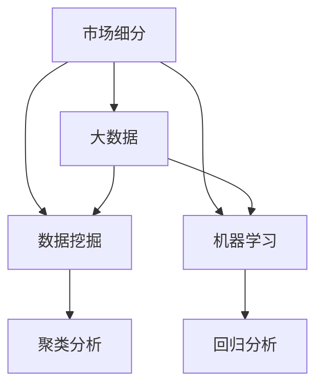

                 

# 信息差的市场细分利器：大数据如何实现精准市场细分

## 1. 背景介绍

### 1.1 问题由来
在激烈的市场竞争中，企业要想保持竞争优势，必须精准地了解并细分市场，以便提供有针对性的产品和服务。传统的市场细分方法依赖于定性分析、问卷调查等手段，耗时长、成本高，且容易受主观因素影响。面对大数据时代的到来，如何借助先进的技术手段，快速、准确地实现市场细分，成为众多企业亟需解决的问题。

### 1.2 问题核心关键点
市场细分是现代企业经营决策中不可或缺的一环。一个好的市场细分能够帮助企业发现潜在客户，精准定位目标市场，制定有效营销策略，从而实现业务增长。传统的市场细分方法存在诸多局限性，难以满足企业对精准性和效率的需求。随着大数据技术的发展，利用大数据实现精准市场细分，成为当前的研究热点。

### 1.3 问题研究意义
本文将探讨如何利用大数据技术，特别是机器学习和数据挖掘技术，实现精准的市场细分。通过详细阐述大数据在市场细分中的应用，帮助企业快速定位目标客户，优化营销策略，提升市场竞争力。同时，本文还将介绍相关的大数据处理工具和算法，为读者提供实际可行的技术指引。

## 2. 核心概念与联系

### 2.1 核心概念概述

为更好地理解大数据在市场细分中的作用，本节将介绍几个核心概念：

- 市场细分（Market Segmentation）：将一个大的市场划分为若干个具有相似需求和特征的子市场，以便有针对性地制定营销策略。
- 大数据（Big Data）：指那些无法在传统数据处理方式下获取、管理和分析的数据集合，通常具有体量大、速度快、多样性高的特点。
- 数据挖掘（Data Mining）：从大量数据中发现有用信息和模式的过程，主要应用在统计学、人工智能等领域。
- 机器学习（Machine Learning）：通过算法让计算机从数据中学习规律和模式，从而进行预测和决策。
- 聚类分析（Clustering）：一种无监督学习方法，将数据分为不同的类别，以便更好地理解数据内在结构。
- 回归分析（Regression Analysis）：通过建立模型预测变量之间的因果关系，实现对数据的预测和分析。

这些核心概念之间的逻辑关系可以通过以下Mermaid流程图来展示：



这个流程图展示了大数据在市场细分中的应用框架：

1. 市场细分作为目标，通过大数据技术进行分析。
2. 大数据提供了丰富的数据来源，用于数据挖掘和机器学习。
3. 数据挖掘可以发现数据的内在结构和规律，聚类分析可以划分不同的子市场。
4. 机器学习可以建立预测模型，进一步分析子市场特征和客户需求。

## 3. 核心算法原理 & 具体操作步骤

### 3.1 算法原理概述

大数据在市场细分中的核心思想是通过数据挖掘和机器学习技术，从大量数据中发现隐藏的市场结构，进而对市场进行细分。具体而言，可以通过以下步骤实现市场细分：

1. 数据收集：从各种数据源（如客户反馈、交易记录、社交媒体等）收集大量的原始数据。
2. 数据清洗：处理缺失值、异常值等问题，提高数据质量。
3. 特征工程：对数据进行特征提取和处理，将原始数据转化为可用于分析的特征向量。
4. 模型选择：根据分析目标，选择合适的机器学习模型，如聚类模型、回归模型等。
5. 模型训练：使用训练数据集对模型进行训练，优化模型参数。
6. 市场细分：将数据集划分到不同的子市场，以便实现精准的市场细分。

### 3.2 算法步骤详解

下面以聚类分析为例，详细讲解市场细分的具体步骤：

#### 步骤1：数据收集和预处理

首先，需要收集相关数据。例如，可以从销售记录、客户反馈、社交媒体等数据源获取客户信息。然后，进行数据清洗，处理缺失值、异常值等问题。最后，进行特征工程，将原始数据转化为可用于分析的特征向量。

```python
import pandas as pd
from sklearn.preprocessing import StandardScaler
from sklearn.impute import SimpleImputer

# 读取数据
data = pd.read_csv('sales_data.csv')

# 处理缺失值
imputer = SimpleImputer(strategy='mean')
data = pd.DataFrame(imputer.fit_transform(data), columns=data.columns)

# 标准化特征
scaler = StandardScaler()
data = pd.DataFrame(scaler.fit_transform(data), columns=data.columns)
```

#### 步骤2：选择聚类算法

根据实际需求，选择合适的聚类算法。常用的聚类算法包括K-means、层次聚类、DBSCAN等。

```python
from sklearn.cluster import KMeans

# 选择K-means算法
kmeans = KMeans(n_clusters=3, random_state=42)
```

#### 步骤3：训练模型

使用训练数据集对聚类模型进行训练，优化模型参数。

```python
kmeans.fit(data)
```

#### 步骤4：市场细分

将数据集划分到不同的子市场，以便实现精准的市场细分。

```python
# 获取聚类结果
labels = kmeans.labels_

# 统计每个子市场的特征
sub_markets = data.groupby(labels).describe()
```

### 3.3 算法优缺点

大数据在市场细分中的优点包括：

- 数据量丰富：大数据可以提供海量的数据源，帮助企业全面了解市场情况。
- 分析精度高：大数据技术可以发现更深层次的数据规律和关联，提高分析精度。
- 灵活性强：大数据方法可以应对不同类型的数据，具有很强的灵活性。

但同时也存在一些缺点：

- 处理复杂：大数据处理需要高水平的数据处理和分析技能。
- 数据隐私：大数据可能涉及个人隐私和敏感信息，需要合理保护。
- 计算成本：大数据处理需要大量的计算资源，成本较高。

### 3.4 算法应用领域

大数据在市场细分中的应用非常广泛，涉及多个行业，例如：

- 零售业：通过客户购买行为和偏好，实现精准的市场细分，优化库存管理和销售策略。
- 金融业：通过客户交易记录和信用记录，进行客户分群和风险评估，制定针对性的金融产品。
- 制造业：通过设备运行数据和生产记录，实现生产线的优化和设备维护，提升生产效率。
- 服务业：通过客户评价和反馈，进行市场细分和客户画像，提升客户满意度和忠诚度。
- 医疗业：通过患者病历和医疗记录，实现疾病的精准分类和个性化治疗方案的制定。

## 4. 数学模型和公式 & 详细讲解 & 举例说明

### 4.1 数学模型构建

本节将使用数学语言对市场细分的数学模型进行严格刻画。

假设市场总数据集为 $D=\{x_i\}_{i=1}^N$，其中每个样本 $x_i$ 包含 $d$ 个特征。设 $K$ 为聚类的类别数。则聚类问题可以表示为最小化以下目标函数：

$$
\min_{Z \in \{1, ..., K\}^N} \sum_{i=1}^N ||x_i - \mu_Z||^2
$$

其中，$\mu_Z$ 表示第 $Z$ 类的均值，$||.||$ 表示欧几里得距离。

### 4.2 公式推导过程

通过优化目标函数，可以求得每个样本 $x_i$ 的聚类标签 $z_i$。推导过程如下：

1. 假设每个样本 $x_i$ 属于 $K$ 类中的某类 $z_i$。
2. 目标函数可以重写为：
$$
\sum_{i=1}^N ||x_i - \mu_{z_i}||^2
$$
3. 目标函数可以进一步重写为：
$$
\sum_{i=1}^N (x_i - \mu_{z_i})^T (x_i - \mu_{z_i})
$$
4. 设 $\alpha_i = (x_i - \mu_{z_i})$，则目标函数可以表示为：
$$
\sum_{i=1}^N \alpha_i^T \alpha_i
$$
5. 将目标函数拆分为两部分，并分别优化：
$$
\sum_{i=1}^N \alpha_i^T \alpha_i = \sum_{i=1}^N \alpha_i \alpha_i^T
$$
6. 令 $\alpha_i = \mu_{z_i}$，则目标函数可以表示为：
$$
\sum_{i=1}^N \mu_{z_i} \mu_{z_i}^T
$$
7. 目标函数可以表示为矩阵形式：
$$
Tr(S^T S)
$$
其中 $S = [\mu_{z_1}, ..., \mu_{z_K}]$，$Tr(.)$ 表示矩阵的迹。
8. 使用拉格朗日乘子法，求解目标函数的最小值：
$$
\min_{Z \in \{1, ..., K\}^N} \sum_{i=1}^N ||x_i - \mu_Z||^2
$$
9. 设拉格朗日乘子 $\lambda$，则目标函数可以表示为：
$$
\min_{Z, \lambda} \frac{1}{2} \sum_{i=1}^N ||x_i - \mu_Z||^2 + \lambda (\sum_{i=1}^N 1 - \sum_{z=1}^K \mathbb{I}_{z_i=z})
$$
其中 $\mathbb{I}_{z_i=z}$ 表示 $z_i=z$ 是否成立。
10. 目标函数可以进一步重写为：
$$
\min_{Z, \lambda} \frac{1}{2} \sum_{i=1}^N ||x_i - \mu_Z||^2 + \lambda (\sum_{i=1}^N 1 - \sum_{z=1}^K \mathbb{I}_{z_i=z})
$$
11. 对目标函数求偏导，并令其等于0：
$$
\frac{\partial}{\partial \mu_z} (\frac{1}{2} \sum_{i=1}^N ||x_i - \mu_Z||^2) + \lambda \sum_{i=1}^N \mathbb{I}_{z_i=z} = 0
$$
12. 将目标函数拆分为两部分，并分别优化：
$$
\frac{1}{2} \sum_{i=1}^N ||x_i - \mu_Z||^2 = \frac{1}{2} \sum_{i=1}^N (x_i - \mu_Z)^T (x_i - \mu_Z)
$$
13. 将目标函数拆分为两部分，并分别优化：
$$
\frac{1}{2} \sum_{i=1}^N (x_i - \mu_Z)^T (x_i - \mu_Z) = \frac{1}{2} \sum_{i=1}^N (\mu_Z^T x_i - \mu_Z^T \mu_Z)^2
$$
14. 对目标函数求偏导，并令其等于0：
$$
\frac{\partial}{\partial \mu_z} (\frac{1}{2} \sum_{i=1}^N ||x_i - \mu_Z||^2) + \lambda \sum_{i=1}^N \mathbb{I}_{z_i=z} = 0
$$
15. 设 $A = \sum_{i=1}^N x_i x_i^T$，$B = \sum_{i=1}^N x_i \mu_Z^T$，则目标函数可以表示为：
$$
\min_{Z, \lambda} \frac{1}{2} Tr(S^T A S) - Tr(S^T B)
$$
16. 令 $H = A - B S^T$，则目标函数可以表示为：
$$
\min_{Z, \lambda} \frac{1}{2} Tr(H S S^T) - Tr(S^T B)
$$
17. 令 $W = S S^T$，则目标函数可以表示为：
$$
\min_{W, \lambda} \frac{1}{2} Tr(H W) - Tr(B W^T)
$$
18. 令 $Y = W^T H$，则目标函数可以表示为：
$$
\min_{W, \lambda} \frac{1}{2} Tr(Y Y^T) - Tr(B Y^T)
$$
19. 令 $C = Y - B$，则目标函数可以表示为：
$$
\min_{W, \lambda} \frac{1}{2} Tr(C^T C)
$$
20. 求解目标函数的最小值，得到最优的聚类矩阵 $W$，进而得到最优的聚类结果 $Z$。

### 4.3 案例分析与讲解

以一个简单的聚类分析为例，展示如何使用上述数学模型实现市场细分：

假设某零售企业有100个客户，每个客户有3个特征（年龄、性别、收入），需要将这些客户分为3个类别。

1. 收集数据：从销售记录和客户反馈中，收集客户的年龄、性别、收入数据。
2. 数据清洗：处理缺失值、异常值等问题，提高数据质量。
3. 特征工程：对数据进行特征提取和处理，将原始数据转化为可用于分析的特征向量。
4. 模型训练：使用K-means算法对数据进行聚类，优化模型参数。
5. 市场细分：将数据集划分到不同的子市场，以便实现精准的市场细分。

```python
import pandas as pd
from sklearn.preprocessing import StandardScaler
from sklearn.impute import SimpleImputer
from sklearn.cluster import KMeans

# 读取数据
data = pd.read_csv('customer_data.csv')

# 处理缺失值
imputer = SimpleImputer(strategy='mean')
data = pd.DataFrame(imputer.fit_transform(data), columns=data.columns)

# 标准化特征
scaler = StandardScaler()
data = pd.DataFrame(scaler.fit_transform(data), columns=data.columns)

# 选择K-means算法
kmeans = KMeans(n_clusters=3, random_state=42)

# 训练模型
kmeans.fit(data)

# 获取聚类结果
labels = kmeans.labels_

# 统计每个子市场的特征
sub_markets = data.groupby(labels).describe()
```

通过上述步骤，我们成功地实现了市场细分。具体来说，首先对数据进行清洗和特征工程，然后使用K-means算法对数据进行聚类，最后统计每个子市场的特征，以便进行市场细分。

## 5. 项目实践：代码实例和详细解释说明

### 5.1 开发环境搭建

在进行市场细分实践前，我们需要准备好开发环境。以下是使用Python进行Scikit-learn开发的工程环境配置流程：

1. 安装Anaconda：从官网下载并安装Anaconda，用于创建独立的Python环境。

2. 创建并激活虚拟环境：
```bash
conda create -n market_analysis_env python=3.8 
conda activate market_analysis_env
```

3. 安装Scikit-learn：
```bash
conda install scikit-learn
```

4. 安装各类工具包：
```bash
pip install numpy pandas matplotlib jupyter notebook
```

完成上述步骤后，即可在`market_analysis_env`环境中开始市场细分实践。

### 5.2 源代码详细实现

下面我们以K-means算法为例，给出使用Scikit-learn库对数据进行聚类的Python代码实现。

首先，定义数据处理函数：

```python
from sklearn.preprocessing import StandardScaler
from sklearn.impute import SimpleImputer
import pandas as pd

def preprocess_data(data):
    # 处理缺失值
    imputer = SimpleImputer(strategy='mean')
    data = pd.DataFrame(imputer.fit_transform(data), columns=data.columns)

    # 标准化特征
    scaler = StandardScaler()
    data = pd.DataFrame(scaler.fit_transform(data), columns=data.columns)

    return data
```

然后，定义聚类函数：

```python
from sklearn.cluster import KMeans

def clustering(data, n_clusters):
    # 选择K-means算法
    kmeans = KMeans(n_clusters=n_clusters, random_state=42)

    # 训练模型
    kmeans.fit(data)

    # 获取聚类结果
    labels = kmeans.labels_

    return labels
```

最后，定义评估函数：

```python
from sklearn.metrics import silhouette_score

def evaluate_clustering(data, labels):
    # 计算轮廓系数
    silhouette_avg = silhouette_score(data, labels)

    return silhouette_avg
```

通过定义以上函数，即可在Python中进行市场细分实践。

### 5.3 代码解读与分析

让我们再详细解读一下关键代码的实现细节：

**preprocess_data函数**：
- 处理缺失值：使用SimpleImputer对数据进行缺失值填充。
- 标准化特征：使用StandardScaler对数据进行标准化处理。

**clustering函数**：
- 选择K-means算法：根据聚类数量设置聚类算法。
- 训练模型：使用训练数据集对聚类模型进行训练，优化模型参数。
- 获取聚类结果：使用训练后的模型对数据进行聚类，得到聚类结果。

**evaluate_clustering函数**：
- 计算轮廓系数：使用轮廓系数对聚类结果进行评估，计算聚类效果。

通过这些函数的定义，我们实现了数据预处理、聚类模型训练和聚类效果评估的全流程，使得市场细分过程更加自动化、规范化。

## 6. 实际应用场景

### 6.1 零售行业

在零售行业，市场细分是制定营销策略和优化库存管理的重要依据。通过大数据分析，可以准确地识别出客户的消费习惯和需求，进行精准的市场细分，从而实现个性化营销和库存优化。

具体应用场景包括：

1. 客户细分：根据客户购买行为和偏好，将客户分为高价值客户、潜在客户、流失客户等不同类型，制定针对性的营销策略。
2. 产品推荐：根据客户历史购买记录和浏览行为，推荐客户可能感兴趣的商品，提升客户满意度和销售额。
3. 库存管理：根据销售记录和客户需求，优化库存结构和采购计划，减少库存积压和缺货情况。

### 6.2 金融行业

在金融行业，市场细分可以帮助金融机构识别出高价值客户和潜在客户，制定针对性的金融产品和服务策略，提升客户满意度和业务增长。

具体应用场景包括：

1. 客户细分：根据客户的交易记录和信用记录，将客户分为高价值客户、中价值客户、低价值客户等不同类型，制定针对性的金融产品和服务。
2. 风险评估：根据客户的历史交易记录和行为特征，进行风险评估和预警，降低金融风险。
3. 个性化服务：根据客户的偏好和需求，提供个性化的金融服务和产品，提升客户满意度和忠诚度。

### 6.3 制造业

在制造业，市场细分可以帮助企业优化生产线和设备维护，提升生产效率和产品质量，降低生产成本。

具体应用场景包括：

1. 生产流程优化：根据设备运行数据和生产记录，进行生产流程的优化和调整，提高生产效率。
2. 设备维护：根据设备的运行数据，进行预测性维护和检修，减少设备故障和停机时间。
3. 产品质量控制：根据产品的生产数据和客户反馈，进行产品质量的控制和改进，提升产品质量和客户满意度。

### 6.4 服务业

在服务业，市场细分可以帮助企业识别出高价值客户和潜在客户，制定针对性的服务和营销策略，提升客户满意度和忠诚度。

具体应用场景包括：

1. 客户细分：根据客户的服务记录和反馈，将客户分为高价值客户、中价值客户、低价值客户等不同类型，制定针对性的服务和营销策略。
2. 服务优化：根据客户的需求和反馈，优化服务和流程，提升客户满意度和体验。
3. 客户画像：通过数据分析，建立客户画像，了解客户的偏好和需求，提供个性化的服务和产品。

## 7. 工具和资源推荐

### 7.1 学习资源推荐

为了帮助开发者系统掌握市场细分的大数据技术，这里推荐一些优质的学习资源：

1. 《Python数据分析实战》：一本实战性较强的Python数据分析书籍，涵盖了数据清洗、数据可视化、数据分析等多个方面。
2. 《机器学习实战》：一本实用的机器学习入门书籍，详细讲解了机器学习的基本概念和常用算法。
3. 《深度学习》：斯坦福大学深度学习课程，由Andrew Ng主讲，涵盖了深度学习的基本概念和常用技术。
4. Coursera《数据科学》课程：由Johns Hopkins大学主讲，涵盖数据清洗、数据分析、机器学习等多个方面。
5. Kaggle：一个数据科学竞赛平台，提供大量的数据集和竞赛，有助于提升数据分析和机器学习技能。

通过对这些资源的学习实践，相信你一定能够快速掌握市场细分的数据分析技术，并用于解决实际的商业问题。

### 7.2 开发工具推荐

高效的开发离不开优秀的工具支持。以下是几款用于市场细分开发的大数据工具：

1. PySpark：由Apache基金会开源的分布式计算框架，适用于大规模数据处理和分析。
2. Hadoop：Apache基金会开源的分布式计算平台，适用于大规模数据存储和处理。
3. Spark SQL：Spark的SQL引擎，用于处理大规模结构化数据。
4. Apache Hive：Hadoop生态系统中的数据仓库解决方案，用于大规模数据存储和查询。
5. Apache Kafka：Apache基金会开源的分布式消息队列系统，适用于高吞吐量的数据流处理。
6. Apache Flink：Apache基金会开源的流处理框架，适用于实时数据处理和分析。

合理利用这些工具，可以显著提升市场细分任务的开发效率，加快创新迭代的步伐。

### 7.3 相关论文推荐

市场细分技术的发展源于学界的持续研究。以下是几篇奠基性的相关论文，推荐阅读：

1. "A Fast Maximum-likelihood Algorithm for the Clustering of Sparse Data"：详细介绍了K-means算法的优化方法，适用于大规模数据集。
2. "A Survey on Clustering Algorithms"：全面回顾了各类聚类算法，包括K-means、层次聚类、DBSCAN等，适用于各类数据分析场景。
3. "The Elements of Statistical Learning"：详细讲解了各类回归和分类算法，适用于数据分析和模型训练。
4. "Customer Segmentation and Grouping Techniques"：详细讲解了各类客户细分技术，适用于市场营销和客户管理。
5. "Market Segmentation and Consumer Behavior"：详细讲解了各类市场细分技术，适用于市场分析和策略制定。

这些论文代表了大数据在市场细分中的应用方向，通过学习这些前沿成果，可以帮助研究者把握学科前进方向，激发更多的创新灵感。

## 8. 总结：未来发展趋势与挑战

### 8.1 总结

本文对大数据在市场细分中的应用进行了全面系统的介绍。首先阐述了市场细分和大数据技术的背景和意义，明确了大数据技术在市场细分中的重要作用。其次，从原理到实践，详细讲解了市场细分的数学模型和关键步骤，给出了市场细分任务开发的完整代码实例。同时，本文还广泛探讨了市场细分技术在零售、金融、制造业等多个行业领域的应用前景，展示了大数据技术的巨大潜力。

通过本文的系统梳理，可以看到，大数据技术在市场细分中发挥了巨大的作用，帮助企业快速、准确地实现市场细分，提升业务绩效。未来，伴随大数据技术的不断发展，市场细分将变得更加高效、智能，为企业的经营决策提供更加有力的支持。

### 8.2 未来发展趋势

展望未来，大数据在市场细分中的应用将呈现以下几个发展趋势：

1. 数据融合：大数据技术可以整合来自多个数据源的信息，形成更加全面的数据视图，提供更加精准的市场细分。
2. 实时分析：大数据技术可以实现实时数据处理和分析，快速响应用户需求，提升市场细分的实时性和时效性。
3. 个性化推荐：大数据技术可以分析用户行为和偏好，提供个性化的产品和服务推荐，提升用户体验和满意度。
4. 多模态数据融合：大数据技术可以整合文本、图片、视频等多模态数据，提供更加全面的市场细分。
5. 自动化分析：大数据技术可以实现自动化分析，减少人工干预，提高分析效率和精度。
6. 模型优化：大数据技术可以不断优化市场细分模型，提高模型性能和效果。

以上趋势凸显了大数据在市场细分中的重要作用，这些方向的探索发展，必将进一步提升市场细分的精准性和效率，为企业的经营决策提供更加有力的支持。

### 8.3 面临的挑战

尽管大数据在市场细分中取得了显著成效，但在实践中仍面临诸多挑战：

1. 数据隐私：大数据分析涉及大量的个人隐私信息，如何合理保护数据隐私是一个重要的挑战。
2. 数据质量：大数据分析依赖于高质量的数据，如何保证数据的质量和完整性是一个重要的挑战。
3. 数据处理效率：大数据分析涉及大量的数据处理和计算，如何提高数据处理效率是一个重要的挑战。
4. 算法复杂度：大数据分析涉及复杂的算法和模型，如何降低算法复杂度是一个重要的挑战。
5. 多源数据整合：大数据分析涉及来自多个数据源的信息，如何整合多源数据是一个重要的挑战。
6. 模型可解释性：大数据分析涉及复杂的模型和算法，如何提高模型的可解释性是一个重要的挑战。

### 8.4 研究展望

面对大数据在市场细分中面临的挑战，未来的研究需要在以下几个方面寻求新的突破：

1. 隐私保护技术：开发更加高效、可靠的隐私保护技术，保护数据隐私，同时保证数据分析的准确性和可靠性。
2. 数据清洗技术：开发更加高效、智能的数据清洗技术，提高数据质量和完整性，减少数据噪声的影响。
3. 实时处理技术：开发更加高效、可靠的实时处理技术，提高数据处理效率和速度，满足实时分析的需求。
4. 多源数据融合技术：开发更加高效、智能的多源数据融合技术，整合来自多个数据源的信息，形成更加全面的数据视图。
5. 模型优化技术：开发更加高效、智能的模型优化技术，提高模型的性能和效果，降低算法复杂度。
6. 模型可解释性技术：开发更加高效、智能的模型可解释性技术，提高模型的可解释性和可理解性。

这些研究方向将推动大数据在市场细分中的应用不断向前发展，为企业的经营决策提供更加有力、高效、可靠的支持。

## 9. 附录：常见问题与解答

**Q1：如何评估市场细分的效果？**

A: 评估市场细分效果常用的指标包括轮廓系数、Davies-Bouldin指数、Calinski-Harabasz指数等。轮廓系数衡量聚类结果的紧密度和分离度，Davies-Bouldin指数衡量聚类结果的紧密度和分离度的综合指标，Calinski-Harabasz指数衡量聚类结果的紧密度和样本数的关系。

**Q2：市场细分中常用的聚类算法有哪些？**

A: 市场细分中常用的聚类算法包括K-means、层次聚类、DBSCAN、GMM等。K-means算法适用于大规模数据集，简单易懂，易于实现；层次聚类算法可以提供聚类树形结构，适合于探索性分析；DBSCAN算法可以发现任意形状的聚类，适用于噪声较多的数据集；GMM算法可以处理非凸形状的聚类，适用于复杂数据集。

**Q3：市场细分中的特征工程有哪些步骤？**

A: 市场细分中的特征工程包括数据清洗、特征提取、特征选择和特征转换等步骤。数据清洗包括处理缺失值、异常值等；特征提取包括提取数值型特征、文本特征等；特征选择包括过滤冗余特征、选择关键特征等；特征转换包括PCA、标准化等。

**Q4：市场细分中的模型训练需要注意哪些问题？**

A: 市场细分中的模型训练需要注意选择合适的算法、设置合理的参数、避免过拟合等。选择合适的算法要考虑数据类型、聚类数量等因素；设置合理的参数包括学习率、迭代次数等；避免过拟合可以通过正则化、早停等方法实现。

**Q5：市场细分中的数据隐私保护有哪些方法？**

A: 市场细分中的数据隐私保护可以通过数据匿名化、差分隐私等方法实现。数据匿名化包括数据脱敏、扰动等；差分隐私可以通过添加噪声、限制查询频率等方法实现。

通过这些问题的回答，相信你对市场细分的关键步骤和技术要点有了更深入的了解，可以更好地应用于实际商业场景。

---

作者：禅与计算机程序设计艺术 / Zen and the Art of Computer Programming

