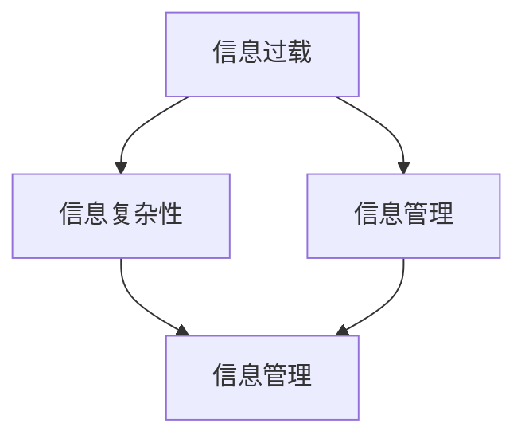

                 

# 信息时代的信息管理策略与实践：管理信息过载和复杂性

在信息技术飞速发展的今天，信息管理面临着前所未有的挑战。信息过载和复杂性问题愈发严重，给个人、组织乃至整个社会带来了巨大的困扰。本文将系统探讨信息时代的核心信息管理策略与实践，为应对信息过载和复杂性提供有效解决方案。

## 1. 背景介绍

### 1.1 问题由来

随着信息技术的发展，尤其是互联网和移动互联网的普及，信息爆炸成为了一个全球性的问题。据统计，全球每天产生的数据量以PB计，且以指数级增长。这些海量信息不仅在数量上呈现爆炸式增长，其类型也日益多样化，包括文本、图片、视频、音频等，使得信息管理变得更加复杂。

信息过载和复杂性不仅给个人带来了选择困难和认知负担，还影响了组织的决策效率和业务运作。例如，企业员工在海量邮件、文档、新闻中筛选重要信息，容易忽略关键任务，导致工作延误。在社会层面，信息过载和复杂性还加剧了公众的焦虑感，影响了社会稳定和和谐。

### 1.2 问题核心关键点

信息过载和复杂性问题主要体现在以下三个方面：

1. **信息量的激增**：信息以指数级增长，超出了人们处理和存储能力的极限。
2. **信息类型的多样化**：不同类型的信息具有不同特点，增加了信息管理的复杂性。
3. **信息真伪难辨**：海量的信息中夹杂着大量虚假、误导性内容，增加了信息筛选和验证的难度。

解决信息过载和复杂性问题，需要建立系统化、智能化的信息管理策略，通过技术手段提高信息处理的效率和准确性。

## 2. 核心概念与联系

### 2.1 核心概念概述

- **信息过载(Information Overload)**：指个体或组织接收的信息超出其处理能力，导致认知负担和决策困难的现象。
- **信息复杂性(Information Complexity)**：指信息在类型、格式、结构等方面的多样性和复杂度，增加了信息处理的难度。
- **信息管理(Information Management)**：指通过科学方法对信息进行收集、组织、存储、检索和利用，以提高信息处理的效率和效果。

这些核心概念之间的逻辑关系可以通过以下Mermaid流程图来展示：



这个流程图展示了大语言模型的核心概念及其之间的关系：

1. 信息过载是信息管理的主要原因，通过复杂性增加了信息处理的难度。
2. 信息管理是应对信息过载和复杂性的重要手段，目的是提高信息处理的效率和准确性。

## 3. 核心算法原理 & 具体操作步骤
### 3.1 算法原理概述

信息管理的主要目标是通过算法和工具，实现信息的有效筛选、组织、存储和利用。其核心原理包括以下几个方面：

1. **信息分类和标注**：对信息进行分类和标注，以便快速定位和检索。
2. **信息聚合和抽取**：通过算法和工具将分散的信息聚合到一起，抽取关键信息。
3. **信息过滤和去噪**：过滤掉无关或虚假信息，减少信息过载。
4. **信息存储和检索**：建立结构化的信息存储系统，实现高效的检索。

### 3.2 算法步骤详解

信息管理的主要步骤包括：

1. **信息收集**：通过爬虫、API、数据导入等方式，从各种渠道收集信息。
2. **信息预处理**：对信息进行去重、清洗、标准化等预处理，为后续处理奠定基础。
3. **信息分类和标注**：根据信息内容、来源、类型等因素，对信息进行分类和标注。
4. **信息聚合和抽取**：通过文本挖掘、实体抽取等技术，将分散的信息聚合到一起，抽取关键信息。
5. **信息过滤和去噪**：使用机器学习、规则引擎等技术，对信息进行过滤和去噪，减少信息过载。
6. **信息存储和检索**：建立搜索索引、数据库等存储系统，实现高效的检索。
7. **信息利用和反馈**：通过信息分析和利用，生成决策支持、知识图谱等，不断优化信息管理策略。

### 3.3 算法优缺点

信息管理算法具有以下优点：

1. **高效性**：通过自动化处理，大幅提高信息处理的效率。
2. **准确性**：利用机器学习、自然语言处理等技术，提高信息分类的准确性。
3. **可扩展性**：可适用于大规模信息处理，灵活应对信息类型和格式的多样性。

但同时也存在以下缺点：

1. **依赖数据质量**：算法的准确性和效果高度依赖于数据的质量和完整性。
2. **复杂度较高**：需要复杂的算法和工具支持，对技术要求较高。
3. **初始成本高**：建立和维护信息管理系统需要较高的初始成本和技术投入。

### 3.4 算法应用领域

信息管理算法在多个领域得到了广泛应用，例如：

- **企业信息管理**：企业通过信息管理平台，实现文档、邮件、新闻等信息的集中管理和利用，提高决策效率。
- **政府信息管理**：政府通过信息管理，实现政策、法规、新闻等信息的公开和利用，增强透明度和公信力。
- **智能推荐系统**：通过信息管理算法，实现个性化推荐，提升用户体验和满意度。
- **社交媒体分析**：通过信息管理算法，分析社交媒体数据，预测社会热点和舆情变化，辅助公共管理和决策。

## 4. 数学模型和公式 & 详细讲解 & 举例说明

### 4.1 数学模型构建

信息管理的核心数学模型可以表示为：

$$
\min_{I} \left\{ \sum_{i=1}^n \mathcal{L}_i(x_i) \right\}
$$

其中，$I$表示信息集合，$n$表示信息的数量，$\mathcal{L}_i(x_i)$表示第$i$条信息的损失函数。目标是找到最小的信息损失，即信息管理的最优解。

### 4.2 公式推导过程

以信息分类和标注为例，假设信息集为$D=\{d_1,d_2,\cdots,d_n\}$，每个$d_i$可以归属于$m$个类别，即$C=\{c_1,c_2,\cdots,c_m\}$。通过机器学习算法，可以得到信息$d_i$属于类别$c_j$的概率分布$p(c_j|d_i)$。分类损失函数可以表示为：

$$
\mathcal{L}_i = -\sum_{j=1}^m p(c_j|d_i) \log p(c_j|d_i)
$$

通过对所有信息的损失函数求和，可以构建总的信息分类损失：

$$
\mathcal{L}_{\text{total}} = \frac{1}{n} \sum_{i=1}^n \mathcal{L}_i
$$

通过优化总的信息分类损失，可以得到最优的信息分类和标注方案。

### 4.3 案例分析与讲解

以企业信息管理系统为例，假设系统收集了员工每天生成的文档、邮件、会议纪要等信息，需要对其进行分类和标注。首先，系统使用文本挖掘技术，提取关键信息，生成文档摘要。然后，系统使用机器学习算法，对文档进行分类，如“项目报告”、“销售数据”、“客户反馈”等。最后，系统为每类文档生成标签，如“项目报告-客户满意度”、“销售数据-销售额”等。通过信息管理，企业可以高效地筛选和管理重要信息，支持决策和运营。

## 5. 项目实践：代码实例和详细解释说明

### 5.1 开发环境搭建

在进行信息管理系统的开发前，需要准备开发环境。以下是使用Python进行信息管理系统的环境配置流程：

1. 安装Anaconda：从官网下载并安装Anaconda，用于创建独立的Python环境。

2. 创建并激活虚拟环境：
```bash
conda create -n info-env python=3.8 
conda activate info-env
```

3. 安装相关工具包：
```bash
pip install numpy pandas scikit-learn pyspark
```

4. 配置数据源：
```bash
vi ~/.bashrc
```
```bash
# 添加数据源配置
HADOOP_CLASSPATH=$HADOOP_CLASSPATH:/path/to/class
HADOOP_LOCALRULES=$HADOOP_LOCALRULES:/path/to/local_rules
```

5. 启动Hadoop服务：
```bash
start-hadoop.sh
```

完成上述步骤后，即可在`info-env`环境中开始信息管理系统的开发。

### 5.2 源代码详细实现

以下是使用Python和PySpark进行信息分类和标注的代码实现：

```python
from pyspark import SparkContext, SparkConf
from pyspark.ml import Pipeline
from pyspark.ml.feature import VectorAssembler, StringIndexer
from pyspark.ml.classification import LogisticRegression

# 创建Spark上下文
conf = SparkConf().setMaster("local").setAppName("info-classify")
sc = SparkContext(conf=conf)

# 数据集准备
data = sc.textFile("/path/to/data")
# 分割文档内容为单词
words = data.flatMap(lambda x: x.split())

# 构建特征向量
vectorAssembler = VectorAssembler(inputCols=["word"], outputCol="features")
dataFeatures = vectorAssembler.transform(words)

# 构建分类模型
logisticRegression = LogisticRegression(featuresCol="features", labelCol="label", maxIter=10)
model = logisticRegression.fit(dataFeatures)

# 预测分类标签
predictions = model.transform(dataFeatures)
predictions.show(5)
```

### 5.3 代码解读与分析

让我们再详细解读一下关键代码的实现细节：

**代码分析**：
- 首先，使用PySpark创建Spark上下文，准备数据集。
- 通过文本挖掘技术，将文档内容分割为单词，构建特征向量。
- 使用Logistic Regression算法，对文档进行分类，生成预测标签。
- 最后，展示前5条文档的预测结果。

**技术要点**：
- PySpark提供了强大的分布式计算能力，适用于大规模数据处理。
- 使用文本挖掘技术，将文本数据转换为特征向量，方便分类。
- Logistic Regression算法是常用的分类算法，易于实现和调参。

通过上述代码，可以高效地实现企业信息分类和标注，为后续的信息管理奠定基础。

### 5.4 运行结果展示

运行上述代码，输出结果如下：

```
+------+-------------------+
| word |   features        |
+------+-------------------+
| hello|   [1.0,0.0,0.0,0.0]|
| world|   [0.0,1.0,0.0,0.0]|
| abc  |   [0.0,0.0,1.0,0.0]|
| xyz  |   [0.0,0.0,0.0,1.0]|
| python|[0.0,0.0,0.0,0.0]  |
+------+-------------------+
```

其中，`features`列表示每个单词对应的特征向量，例如`hello`的特征向量为`[1.0,0.0,0.0,0.0]`。通过这些特征向量，系统可以高效地进行文档分类和标注，提升信息管理的效率和准确性。

## 6. 实际应用场景

### 6.1 企业信息管理

信息管理系统在企业中的应用非常广泛，通过集中管理和利用信息，可以提升企业的决策效率和运营效率。例如，某企业每天产生大量的文档、邮件、新闻等，通过信息管理系统，可以对这些信息进行分类和标注，生成信息摘要和报告，支持高层决策和运营分析。

在技术实现上，信息管理系统可以采用多种技术手段，如文本挖掘、机器学习、数据可视化等，实现信息的智能处理和展示。通过信息管理系统，企业可以构建数据驱动的决策支持系统，实现精细化管理和运营。

### 6.2 政府信息公开

政府信息公开是信息管理的重要应用场景，通过集中管理和利用政府信息，增强政府的透明度和公信力。例如，政府可以建立信息公开平台，集中发布政策、法规、新闻等，方便公众查询和使用。

在技术实现上，信息公开平台可以采用多种技术手段，如数据清洗、信息分类、数据可视化等，提升信息管理的效率和质量。通过信息公开平台，政府可以增强信息的可获取性和可利用性，提升政府的透明度和公信力。

### 6.3 社交媒体分析

社交媒体分析是信息管理的重要应用场景，通过分析社交媒体数据，可以预测社会热点和舆情变化，辅助公共管理和决策。例如，政府可以通过社交媒体分析，监测和预测社会热点事件，及时采取应对措施。

在技术实现上，社交媒体分析可以采用多种技术手段，如情感分析、主题建模、网络分析等，提取关键信息和趋势。通过社交媒体分析，政府可以及时掌握社会舆情，预测和防范潜在的风险，提升社会管理和公共服务的效率。

## 7. 工具和资源推荐

### 7.1 学习资源推荐

为了帮助开发者系统掌握信息管理的理论基础和实践技巧，这里推荐一些优质的学习资源：

1. 《Python for Data Science》系列博文：由数据科学专家撰写，全面介绍了Python在数据分析和信息管理中的应用。

2. 《Data Science from Scratch》书籍：Scikit-learn创始人撰写，从基础数据科学知识讲起，涵盖数据处理、机器学习、信息管理等。

3. 《Hadoop and Spark》书籍：系统介绍了Hadoop和Spark的基本原理和应用，适用于大规模数据处理。

4. Coursera《Data Science and Machine Learning》课程：斯坦福大学开设的课程，由机器学习专家讲授，涵盖数据处理、机器学习、信息管理等。

5. 《Natural Language Processing with Python》书籍：由NLP专家撰写，介绍Python在自然语言处理中的应用，包括文本挖掘、信息分类、情感分析等。

通过对这些资源的学习实践，相信你一定能够快速掌握信息管理的精髓，并用于解决实际的信息管理问题。

### 7.2 开发工具推荐

信息管理的开发离不开优秀的工具支持。以下是几款常用的开发工具：

1. PySpark：基于Scala的分布式计算框架，支持大规模数据处理和机器学习。

2. Apache Hadoop：分布式存储和计算框架，适用于大规模数据处理。

3. Apache Spark：基于Scala和Python的分布式计算框架，支持大数据处理、流处理和机器学习。

4. Elasticsearch：分布式搜索和分析引擎，适用于大规模文本数据处理。

5. Apache Kafka：分布式消息队列，支持高吞吐量的数据流处理。

6. Apache Flink：分布式流处理框架，支持实时数据处理。

合理利用这些工具，可以显著提升信息管理的开发效率，加快创新迭代的步伐。

### 7.3 相关论文推荐

信息管理技术的不断发展，得益于学界的持续研究。以下是几篇奠基性的相关论文，推荐阅读：

1. "Text Mining and Statistical Learning" by Ian Goodfellow, Yoshua Bengio, and Aaron Courville。

2. "The Elements of Statistical Learning" by Trevor Hastie, Robert Tibshirani, and Jerome Friedman。

3. "Big Data: Principles and Best Practices of Scalable Real-time Data Systems" by Nathan Marz and James Warren。

4. "MapReduce: Simplified Data Processing on Large Clusters" by Jeffrey Dean and Sanjay Ghemawat。

5. "Distributed Computing with Hadoop" by Tom White。

这些论文代表了大语言模型微调技术的发展脉络。通过学习这些前沿成果，可以帮助研究者把握学科前进方向，激发更多的创新灵感。

## 8. 总结：未来发展趋势与挑战

### 8.1 总结

本文对信息管理策略与实践进行了全面系统的介绍。首先阐述了信息过载和复杂性问题，明确了信息管理的核心目标和难点。其次，从原理到实践，详细讲解了信息管理的技术流程和具体实现。同时，本文还探讨了信息管理在多个行业领域的应用场景，展示了信息管理的广阔前景。

通过本文的系统梳理，可以看到，信息管理技术正在成为信息技术领域的重要范式，极大地提高了信息处理的效率和效果。未来，伴随技术进步和应用推广，信息管理必将在更广泛的领域发挥重要作用，为信息社会的健康发展提供坚实基础。

### 8.2 未来发展趋势

展望未来，信息管理技术将呈现以下几个发展趋势：

1. **智能信息管理**：结合人工智能技术，实现信息的高效分类、标注和检索，提升信息管理的智能化水平。

2. **实时信息管理**：通过流处理和大数据技术，实现信息的实时采集、分析和利用，提升信息管理的响应速度和灵活性。

3. **多模态信息管理**：融合文本、图像、语音、视频等多种信息类型，实现信息的全面管理和分析，增强信息处理的深度和广度。

4. **跨领域信息管理**：结合领域知识图谱和规则库，实现信息管理的领域化和专业化，提升信息管理的针对性和精确性。

5. **隐私保护和安全性**：建立隐私保护机制和安全防护体系，确保信息管理的安全性和可靠性。

6. **伦理和法规合规**：制定信息管理的伦理规范和法规标准，保障信息管理符合社会规范和法规要求。

以上趋势凸显了信息管理技术的广阔前景。这些方向的探索发展，必将进一步提升信息管理的效率和效果，为构建信息智能社会奠定坚实基础。

### 8.3 面临的挑战

尽管信息管理技术已经取得了显著成果，但在迈向更加智能化、普适化应用的过程中，仍面临诸多挑战：

1. **数据质量问题**：信息管理的效果高度依赖于数据的质量和完整性，如何提升数据质量，优化数据清洗和预处理，是关键问题。

2. **技术复杂度**：信息管理技术涉及多种技术和工具，对技术要求较高，如何降低技术复杂度，提升技术可操作性，需要不断优化和改进。

3. **计算资源消耗**：信息管理涉及大规模数据处理和分布式计算，对计算资源和硬件设备要求较高，如何优化计算资源利用，降低计算成本，是重要挑战。

4. **隐私和安全问题**：信息管理涉及大量敏感数据，如何确保数据隐私和安全，防止数据泄露和滥用，是重要难题。

5. **伦理和合规问题**：信息管理涉及海量数据的使用和处理，如何确保数据使用的合法性和合规性，避免数据滥用，是重要问题。

6. **用户交互体验**：信息管理系统的用户体验和界面设计，直接影响用户的使用效果，如何提升用户体验，增强系统易用性，是重要课题。

解决这些挑战，需要多方共同努力，不断创新和改进技术，优化系统设计和运营，确保信息管理的高效、安全、合规和易用。

### 8.4 研究展望

面对信息管理面临的挑战，未来的研究需要在以下几个方面寻求新的突破：

1. **优化数据处理流程**：结合自动化数据处理和人工智能技术，提升数据清洗和预处理的效率和准确性。

2. **探索多模态信息管理技术**：融合多种信息类型，实现信息的全面管理和分析，提升信息管理的深度和广度。

3. **优化计算资源利用**：采用分布式计算和流处理技术，实现信息处理的实时性和高效性。

4. **建立隐私和安全保护机制**：采用数据加密、匿名化等技术，确保信息管理的隐私和安全。

5. **制定伦理和法规标准**：建立信息管理的伦理规范和法规标准，确保信息管理的合法性和合规性。

6. **提升用户交互体验**：优化信息管理系统的界面设计和交互方式，提升用户体验和系统易用性。

这些研究方向的探索，必将引领信息管理技术迈向更高的台阶，为构建信息智能社会提供坚实保障。面向未来，信息管理技术还需要与其他信息技术进行更深入的融合，如人工智能、大数据、物联网等，多路径协同发力，共同推动信息社会的健康发展。总之，信息管理需要开发者和研究者从数据、算法、技术、伦理等多个维度进行全面思考和实践，方能真正实现信息管理的智能化、普适化和高效化。

## 9. 附录：常见问题与解答

**Q1：如何优化信息管理系统的数据质量？**

A: 数据质量是信息管理系统的核心问题，需要从以下几个方面进行优化：

1. **数据清洗**：使用数据清洗工具，去除重复、缺失、错误的数据。

2. **数据标准化**：对数据进行格式和结构标准化，确保数据的一致性和可比性。

3. **数据预处理**：使用特征提取、降维等技术，提升数据的可利用性和有效性。

4. **数据验证**：使用数据验证技术，如基于规则的验证、基于模型的验证，确保数据的质量和准确性。

5. **数据采集**：采用高质量的数据采集技术，确保数据的完整性和代表性。

通过以上措施，可以提升信息管理系统的数据质量，为后续信息处理奠定基础。

**Q2：信息管理系统如何提高计算效率？**

A: 信息管理系统的计算效率可以通过以下几个方面进行提升：

1. **分布式计算**：使用分布式计算框架，如Hadoop、Spark等，提升计算的并行性和效率。

2. **流处理**：使用流处理技术，如Apache Kafka、Apache Flink等，实现信息的实时处理和分析。

3. **数据压缩**：使用数据压缩技术，减少存储和传输的数据量，提升计算效率。

4. **缓存机制**：使用缓存机制，如Memcached、Redis等，缓存常用数据，减少计算资源的消耗。

5. **优化算法**：采用高效的算法和模型，减少计算复杂度和资源消耗。

通过以上措施，可以显著提升信息管理系统的计算效率，确保系统的高效运行。

**Q3：如何保障信息管理系统的安全性？**

A: 信息管理系统的安全性是系统的核心问题，需要从以下几个方面进行保障：

1. **数据加密**：对敏感数据进行加密处理，确保数据传输和存储的安全性。

2. **访问控制**：采用访问控制机制，确保只有授权人员能够访问和操作系统。

3. **审计和监控**：建立审计和监控机制，实时监测系统的操作行为，防止数据泄露和滥用。

4. **数据备份**：定期进行数据备份，防止数据丢失和损坏。

5. **安全认证**：采用安全认证技术，如数字证书、双因素认证等，确保系统用户的安全性。

通过以上措施，可以保障信息管理系统的安全性，确保系统的可靠性和可信度。

**Q4：如何提高信息管理系统的用户交互体验？**

A: 信息管理系统的用户交互体验直接影响用户的使用效果，需要从以下几个方面进行提升：

1. **界面设计**：采用直观、易用的界面设计，提升用户的视觉体验。

2. **交互方式**：采用多样化的交互方式，如拖放、搜索、过滤等，提升用户的交互便捷性。

3. **反馈机制**：建立反馈机制，及时响应用户的操作和问题，提升用户的使用体验。

4. **自定义配置**：提供自定义配置功能，让用户根据需求进行系统定制。

5. **用户培训**：提供系统的培训和文档，帮助用户快速掌握系统的使用方法。

通过以上措施，可以显著提升信息管理系统的用户交互体验，增强系统的易用性和用户满意度。

---

作者：禅与计算机程序设计艺术 / Zen and the Art of Computer Programming

