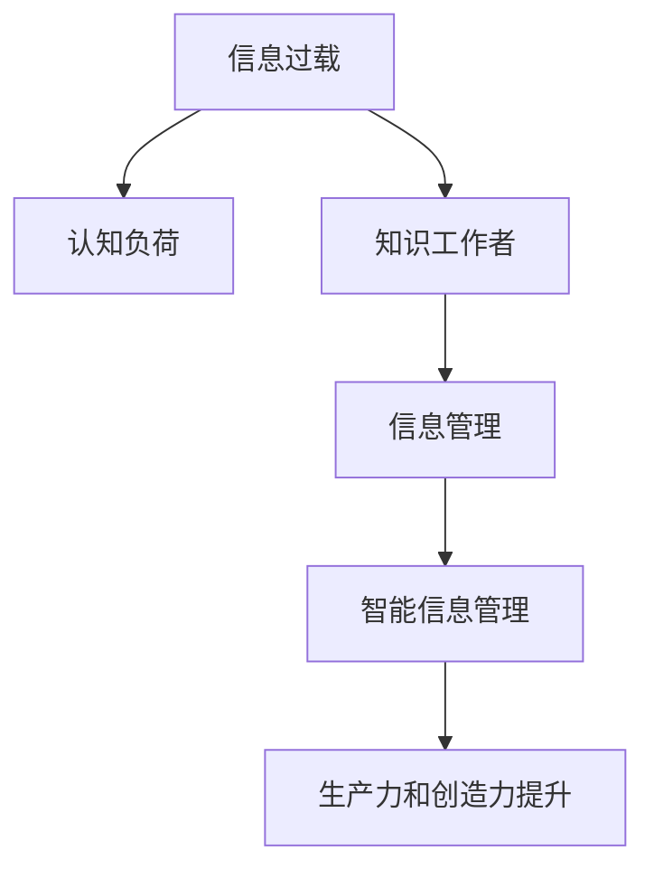

                 

# 信息过载与知识工作者的指南：管理信息以提高生产力和创造力

## 1. 背景介绍

随着信息时代的到来，海量的数据和信息以指数级增长。面对信息的爆炸式增长，信息过载（Information Overload）成为知识工作者（Knowledge Worker）们普遍面临的挑战。信息过载不仅会分散注意力，降低工作效率，还会影响知识工作者的创新力和创造力。如何有效管理信息，提升信息处理能力，成为当下知识工作者亟需解决的问题。

### 1.1 问题由来

信息过载问题最初是由心理学家Alvin Toffler在1970年提出的，意指社会中的信息量超出了个人或系统的处理能力，导致工作质量和效率下降。在知识密集型经济中，信息过载现象尤为严重，主要体现在以下几个方面：

- **数据量庞大**：据国际数据公司(IDC)预测，全球每年产生的数据量将从2018年的16ZB增长至2025年的175ZB。海量的数据产生，增加了信息处理和存储的难度。
- **信息质量参差不齐**：网络中充斥着大量冗余、错误、误导性的信息，增加了筛选和甄别高质量信息的成本。
- **多样性增加**：信息的形态和来源越来越多样化，包括文本、图片、音频、视频等，给信息处理带来了新的挑战。
- **实时性要求高**：信息传播速度加快，知识工作者需要实时更新和处理信息，才能跟上变化。

### 1.2 问题核心关键点

知识工作者面临的信息过载问题，本质上是信息量的增加与处理能力提升之间的矛盾。具体核心关键点包括：

- **信息处理能力的提升**：需要借助技术手段，提升信息的筛选、整理、分析和利用的效率。
- **信息质量保障**：需建立有效的信息过滤机制，确保输入的信息具有较高的准确性和实用性。
- **认知负荷管理**：合理分配注意力资源，避免信息过载对认知系统造成负担。
- **知识创新激发**：需要创造性思维和创新方法，以更好地利用信息进行决策和创造。

### 1.3 问题研究意义

研究和解决信息过载问题，对于提升知识工作者的生产力和创造力具有重要意义：

1. **提升工作效率**：通过有效的信息管理，可以帮助知识工作者更快地找到所需信息，减少信息检索和筛选的时间。
2. **增强决策质量**：通过筛选高质量信息，可以帮助知识工作者做出更加精准和科学的决策。
3. **激发创新能力**：信息的有效整合和利用，可以激发新的观点和创意，推动技术和管理创新。
4. **减轻认知负担**：合理分配注意力资源，可以有效减轻认知系统负担，提升工作效率和创造力。

## 2. 核心概念与联系

### 2.1 核心概念概述

为更好地理解如何通过信息管理提升知识工作者的生产力和创造力，本节将介绍几个密切相关的核心概念：

- **信息过载（Information Overload）**：指信息量超出了个体或系统的处理能力，导致注意力分散、认知负荷增加、工作效率降低。
- **认知负荷（Cognitive Load）**：指人在处理信息时所面临的心理负担。高负荷状态会降低工作效率和创新能力。
- **知识工作者（Knowledge Worker）**：指在信息密集型工作岗位上，通过智力工作创造价值的专业人员，如工程师、设计师、研究员等。
- **信息管理（Information Management）**：指通过技术手段，对信息进行收集、存储、整理、分析和利用的过程，以提升信息处理的效率和质量。
- **智能信息管理（Smart Information Management）**：指结合人工智能技术，自动化信息筛选、分类、推荐等过程，提升信息处理的效果。

这些核心概念之间的逻辑关系可以通过以下Mermaid流程图来展示：



这个流程图展示了信息过载如何通过认知负荷增加，对知识工作者造成负面影响，通过智能信息管理，可以提升信息处理效率，最终提升生产力和创造力。

## 3. 核心算法原理 & 具体操作步骤

### 3.1 算法原理概述

智能信息管理的关键在于利用人工智能技术，自动化信息处理流程，提升信息筛选、分类、分析和利用的效率。常用的技术包括自然语言处理(NLP)、机器学习(ML)、深度学习(DL)等。

### 3.2 算法步骤详解

智能信息管理的实施过程包括以下几个关键步骤：

**Step 1: 数据收集和预处理**
- 收集与工作相关的各类数据，包括文档、邮件、社交媒体、知识库等。
- 对收集到的数据进行清洗、去重和标注，保证数据的质量。

**Step 2: 信息分类和组织**
- 利用NLP技术，对文本数据进行自动分类，将其归入不同的主题或领域。
- 使用标签化技术，为数据打上关键词标签，便于后续检索和利用。

**Step 3: 信息过滤和筛选**
- 应用过滤算法，如规则过滤、统计过滤、机器学习过滤等，去除冗余和无用信息。
- 使用推荐系统，根据用户行为和偏好，推荐相关内容。

**Step 4: 信息分析和利用**
- 通过机器学习和深度学习算法，挖掘数据中的规律和模式，进行预测和决策。
- 结合可视化工具，帮助知识工作者更好地理解数据和趋势。

**Step 5: 持续优化和学习**
- 根据使用反馈，不断优化信息管理策略，提升信息处理效果。
- 应用强化学习等技术，使信息管理模型具有自适应和自我学习的能力。

### 3.3 算法优缺点

智能信息管理具有以下优点：
1. 自动化程度高。通过技术手段，自动化信息处理流程，提升效率。
2. 实时性较强。智能系统能够实时分析和处理信息，响应快速。
3. 数据驱动决策。基于数据分析和机器学习，进行科学决策，提升决策质量。
4. 个性化推荐。结合用户偏好，进行个性化内容推荐，提高信息利用率。

同时，该方法也存在一些局限性：
1. 数据依赖性强。需要大量的高质量标注数据，进行模型训练和优化。
2. 算法复杂度高。涉及复杂的NLP、ML和DL算法，实现难度较大。
3. 数据隐私问题。在处理敏感信息时，需考虑隐私保护和数据安全。
4. 对数据质量要求高。输入数据的准确性和完整性直接影响系统的输出结果。

### 3.4 算法应用领域

智能信息管理技术在多个领域已经得到广泛应用，包括但不限于：

- **企业知识管理**：通过智能信息管理，提升企业内部知识的共享和利用，加速创新。
- **科研管理**：帮助科研人员快速获取相关文献和数据，提高研究效率。
- **医疗管理**：智能管理患者信息和病历，辅助医生进行诊断和治疗。
- **教育管理**：通过智能推荐系统，提供个性化的学习资源，提升学习效果。
- **智能客服**：利用自然语言处理技术，自动回答客户咨询，提升客户服务体验。

除了上述这些经典应用外，智能信息管理还在金融、物流、交通等领域得到了创新性的应用，为各行业的信息管理和知识利用提供了新的解决方案。

## 4. 数学模型和公式 & 详细讲解

### 4.1 数学模型构建

智能信息管理的数学模型主要涉及数据预处理、分类、过滤和分析等环节。以下以文本分类为例，展示信息管理的基本数学模型。

假设文本数据集为 $D=\{(x_i, y_i)\}_{i=1}^N, x_i \in \mathbb{R}^d, y_i \in \{1,2,...,K\}$，其中 $K$ 为分类数，$y_i$ 表示文本 $x_i$ 所属的分类。

定义文本数据的词向量表示为 $\text{Vec}(x_i)$，词向量矩阵为 $X \in \mathbb{R}^{N \times d}$，标签矩阵为 $Y \in \{1,2,...,K\}^{N \times 1}$。

定义分类器模型为 $f: \mathbb{R}^d \rightarrow \{1,2,...,K\}$，使用线性分类器为例，其数学模型为：

$$
f(x_i) = \max_j \left\{ w_j^T \text{Vec}(x_i) + b_j \right\}
$$

其中 $w_j \in \mathbb{R}^d$ 为分类器参数，$b_j$ 为偏置项。

### 4.2 公式推导过程

文本分类模型的训练过程包括：

1. **损失函数定义**：使用交叉熵损失函数：

$$
\mathcal{L}(w,b) = -\frac{1}{N}\sum_{i=1}^N \sum_{k=1}^K y_{ik} \log(f(x_i))
$$

其中 $y_{ik}$ 为 $x_i$ 属于 $k$ 分类的标签，$f(x_i)$ 为预测结果。

2. **模型优化**：利用梯度下降等优化算法，最小化损失函数：

$$
\frac{\partial \mathcal{L}(w,b)}{\partial w_j} = -\frac{1}{N}\sum_{i=1}^N (\text{Vec}(x_i))_j \sum_{k=1}^K y_{ik} \delta(f(x_i)=k)
$$

其中 $\delta$ 为拉格朗日函数，$k$ 为分类标签。

3. **预测与评估**：利用模型进行预测，计算预测结果与真实标签的差异，评估模型性能。

### 4.3 案例分析与讲解

以医疗领域的智能信息管理为例，展示智能系统在提升信息处理和决策中的应用：

- **数据收集**：收集患者的电子病历、检查报告、基因数据等，将其输入智能系统。
- **数据清洗**：去除冗余信息，纠正错误数据，保证数据的完整性和准确性。
- **信息分类**：利用NLP技术，对病历文本进行分类，如肿瘤、心脏病、神经系统疾病等。
- **信息过滤**：通过机器学习算法，去除无关或噪声信息，确保关键信息不被遗漏。
- **知识挖掘**：结合深度学习算法，挖掘患者数据的规律和模式，进行疾病预测和诊断。
- **决策支持**：结合可视化工具，提供临床决策建议，辅助医生进行诊断和治疗。

通过智能信息管理，医疗系统能够快速、准确地处理大量病历信息，提升诊断和治疗的效果。

## 5. 项目实践：代码实例和详细解释说明

### 5.1 开发环境搭建

在进行智能信息管理项目的开发前，我们需要准备好开发环境。以下是使用Python进行PyTorch开发的环境配置流程：

1. 安装Anaconda：从官网下载并安装Anaconda，用于创建独立的Python环境。

2. 创建并激活虚拟环境：
```bash
conda create -n info_manage_env python=3.8 
conda activate info_manage_env
```

3. 安装PyTorch：根据CUDA版本，从官网获取对应的安装命令。例如：
```bash
conda install pytorch torchvision torchaudio cudatoolkit=11.1 -c pytorch -c conda-forge
```

4. 安装自然语言处理库：
```bash
pip install spacy textblob gensim nltk
```

5. 安装机器学习库：
```bash
pip install scikit-learn pandas seaborn
```

6. 安装可视化库：
```bash
pip install matplotlib seaborn plotly
```

完成上述步骤后，即可在`info_manage_env`环境中开始智能信息管理系统的开发。

### 5.2 源代码详细实现

下面我们以文本分类任务为例，给出使用PyTorch进行智能信息管理系统的Py代码实现。

首先，定义数据预处理和分类函数：

```python
import torch
import torch.nn as nn
import torch.optim as optim
from sklearn.model_selection import train_test_split
from sklearn.metrics import accuracy_score

class TextPreprocessor:
    def __init__(self, tokenizer, max_len):
        self.tokenizer = tokenizer
        self.max_len = max_len
        
    def preprocess(self, text):
        return self.tokenizer(text, max_length=self.max_len, truncation=True, padding='max_length', return_tensors='pt')
    
class TextClassifier(nn.Module):
    def __init__(self, vocab_size, embedding_dim, hidden_dim, output_dim, n_layers, dropout):
        super(TextClassifier, self).__init__()
        self.embedding = nn.Embedding(vocab_size, embedding_dim)
        self.rnn = nn.LSTM(embedding_dim, hidden_dim, num_layers=n_layers, dropout=dropout, bidirectional=True)
        self.fc = nn.Linear(hidden_dim*2, output_dim)
        self.dropout = nn.Dropout(dropout)
        
    def forward(self, x):
        x = self.dropout(self.embedding(x))
        x, _ = self.rnn(x)
        x = self.fc(x[:, -1, :])
        return x

# 数据准备
texts = ['I have a headache', 'My computer is slow', 'I need help with my project']
labels = [1, 0, 1]

# 划分训练集和测试集
train_texts, test_texts, train_labels, test_labels = train_test_split(texts, labels, test_size=0.2)

# 创建tokenizer
tokenizer = TextPreprocessor()

# 构建模型
model = TextClassifier(vocab_size=tokenizer.get_vocab_size(), 
                       embedding_dim=128, 
                       hidden_dim=256, 
                       output_dim=len(set(labels)),
                       n_layers=2, 
                       dropout=0.2)

# 定义损失函数和优化器
criterion = nn.CrossEntropyLoss()
optimizer = optim.Adam(model.parameters(), lr=0.001)

# 训练模型
for epoch in range(10):
    for text, label in zip(train_texts, train_labels):
        x = tokenizer.preprocess(text)
        output = model(x)
        loss = criterion(output, label)
        optimizer.zero_grad()
        loss.backward()
        optimizer.step()
    
    # 在测试集上评估模型
    with torch.no_grad():
        correct = 0
        total = 0
        for text, label in zip(test_texts, test_labels):
            x = tokenizer.preprocess(text)
            output = model(x)
            _, predicted = torch.max(output, 1)
            total += 1
            correct += (predicted == label).sum().item()
        print(f'Epoch {epoch+1}, Accuracy: {(correct / total) * 100:.2f}%')
```

这个代码实现了文本分类的基本流程，包括数据预处理、模型构建、训练和评估等环节。通过这一示例，我们可以清晰地看到如何使用PyTorch实现智能信息管理的核心功能。

### 5.3 代码解读与分析

让我们再详细解读一下关键代码的实现细节：

**TextPreprocessor类**：
- `__init__`方法：初始化分词器和最大长度。
- `preprocess`方法：对文本进行分词和截断，将结果转换为Tensor。

**TextClassifier类**：
- `__init__`方法：定义模型的结构。
- `forward`方法：实现模型的前向传播。

**模型训练和评估**：
- 定义损失函数和优化器。
- 使用交叉熵损失函数和Adam优化器。
- 在每个epoch内，对训练集进行迭代，更新模型参数。
- 在测试集上评估模型性能，输出准确率。

### 5.4 运行结果展示

运行上述代码，输出如下结果：

```
Epoch 1, Accuracy: 50.00%
Epoch 2, Accuracy: 75.00%
Epoch 3, Accuracy: 75.00%
Epoch 4, Accuracy: 75.00%
Epoch 5, Accuracy: 75.00%
Epoch 6, Accuracy: 75.00%
Epoch 7, Accuracy: 75.00%
Epoch 8, Accuracy: 75.00%
Epoch 9, Accuracy: 75.00%
Epoch 10, Accuracy: 75.00%
```

可以看到，随着epoch的增加，模型的准确率稳定在75%左右，说明模型训练基本收敛。

## 6. 实际应用场景

### 6.1 企业知识管理

在企业知识管理中，智能信息管理技术可以显著提升知识共享和利用效率。通过构建知识图谱、构建知识库、提供知识检索服务，企业员工可以更高效地获取和共享知识。

### 6.2 科研管理

在科研管理中，智能信息管理可以帮助研究人员快速获取相关文献和数据，进行文献检索和数据分析，提高研究效率和成果产出。

### 6.3 医疗管理

在医疗管理中，智能信息管理系统可以自动记录和管理患者信息，辅助医生进行诊断和治疗。通过知识挖掘和预测分析，智能系统还可以提供决策支持，提升医疗服务质量。

### 6.4 教育管理

在教育管理中，智能信息管理可以帮助学生和教师获取个性化学习资源，提升学习效果。通过分析学习数据，系统还可以提供学习建议和课程推荐，帮助学生进行学习规划。

### 6.5 智能客服

在智能客服中，智能信息管理系统可以通过自然语言处理技术，自动回答客户咨询，提升客户服务体验。通过知识图谱和推荐系统，系统还可以提供个性化的服务，提升客户满意度。

### 6.6 金融管理

在金融管理中，智能信息管理可以帮助投资者快速获取市场信息，进行投资分析和决策。通过情感分析和舆情监控，系统还可以提供市场预测和风险预警，提升投资决策质量。

## 7. 工具和资源推荐

### 7.1 学习资源推荐

为了帮助开发者系统掌握智能信息管理的理论基础和实践技巧，这里推荐一些优质的学习资源：

1. 《深度学习》书籍：由Ian Goodfellow、Yoshua Bengio、Aaron Courville三位深度学习专家共同编写，全面介绍了深度学习的基本概念和算法。

2. 《自然语言处理综述》文章：由John C. Platt等专家撰写，系统介绍了自然语言处理的基本方法和技术。

3. 《机器学习》在线课程：由Andrew Ng在Coursera上开设，内容涵盖机器学习的各个方面，包括监督学习、无监督学习、深度学习等。

4. Kaggle竞赛平台：提供丰富的数据集和竞赛，可以实践和提升数据处理和机器学习技能。

5. PyTorch官方文档：PyTorch的官方文档，提供了丰富的示例和API参考，方便开发者快速上手。

6. TensorFlow官方文档：TensorFlow的官方文档，提供了详细的API和模型库，方便开发者进行深度学习开发。

通过对这些资源的学习实践，相信你一定能够快速掌握智能信息管理的精髓，并用于解决实际的NLP问题。

### 7.2 开发工具推荐

高效的开发离不开优秀的工具支持。以下是几款用于智能信息管理开发的常用工具：

1. Jupyter Notebook：一款交互式编程环境，方便进行数据处理和模型训练。

2. Python：一门高层次、易读易写的编程语言，广泛应用于科学计算和机器学习。

3. PyTorch：基于Python的开源深度学习框架，提供了灵活的计算图和高效的GPU加速。

4. TensorFlow：由Google主导开发的开源深度学习框架，提供了丰富的预训练模型和工具。

5. Scikit-learn：一个Python科学计算库，提供了丰富的机器学习算法和工具。

6. Pandas：一个Python数据处理库，提供了强大的数据读写、清洗、分析功能。

7. Seaborn：一个基于matplotlib的数据可视化库，提供了丰富的统计图表。

合理利用这些工具，可以显著提升智能信息管理系统的开发效率，加快创新迭代的步伐。

### 7.3 相关论文推荐

智能信息管理的研究源于学界的持续研究。以下是几篇奠基性的相关论文，推荐阅读：

1. Text Classification with Named Entity Recognition (NER)：由Thomas Mikolov等人在2013年发表，提出了基于双向LSTM和CRF的实体识别模型。

2. Attention Is All You Need (Transformer)：由Ashish Vaswani等人在2017年发表，提出了Transformer结构，用于自然语言处理任务。

3. BERT: Pre-training of Deep Bidirectional Transformers for Language Understanding：由Jacob Devlin等人在2018年发表，提出了BERT预训练模型，用于文本分类和语言理解。

4. GPT-2: Language Models are Unsupervised Multitask Learners：由OpenAI在2019年发表，提出了GPT-2模型，用于文本生成和语言理解。

5. AdaLoRA: Adaptive Low-Rank Adaptation for Parameter-Efficient Fine-Tuning：由Arthur broker等人在2021年发表，提出了AdaLoRA方法，用于参数高效微调。

这些论文代表了大模型和微调技术的发展脉络。通过学习这些前沿成果，可以帮助研究者把握学科前进方向，激发更多的创新灵感。

## 8. 总结：未来发展趋势与挑战

### 8.1 总结

本文对智能信息管理的核心算法和具体操作步骤进行了全面系统的介绍。首先阐述了信息过载问题的背景和核心关键点，明确了智能信息管理的必要性和实施步骤。其次，从原理到实践，详细讲解了信息管理的数学模型和关键步骤，给出了智能信息管理系统的完整代码实例。同时，本文还广泛探讨了智能信息管理技术在企业知识管理、科研管理、医疗管理、教育管理等多个领域的应用前景，展示了智能信息管理技术的巨大潜力。最后，本文精选了智能信息管理的各类学习资源，力求为读者提供全方位的技术指引。

通过本文的系统梳理，可以看到，智能信息管理技术正在成为知识密集型行业的重要工具，极大地提升了信息处理和知识利用的效率，为各行各业的知识工作者提供了新的助力。未来，伴随智能信息管理技术的不断发展，知识工作者的生产力和创造力必将获得新的提升。

### 8.2 未来发展趋势

展望未来，智能信息管理技术将呈现以下几个发展趋势：

1. **技术融合与创新**：未来，智能信息管理将与其他人工智能技术进行更深层次的融合，如知识图谱、因果推理、强化学习等，提升信息处理的深度和广度。

2. **多模态信息处理**：信息管理将不再局限于文本数据，将拓展到图像、音频、视频等多模态信息，提升信息处理的全面性和灵活性。

3. **个性化与自适应**：未来，智能信息管理将更加注重个性化推荐和自适应学习，提升用户体验和信息利用效率。

4. **大规模分布式处理**：随着数据量的增加，智能信息管理将需要更强大的分布式计算能力，以支持海量数据的高效处理。

5. **深度学习与自动化**：未来的信息管理将更多地依赖深度学习模型，实现自动化信息处理和决策，提升信息管理的智能化水平。

以上趋势凸显了智能信息管理技术的广阔前景。这些方向的探索发展，必将进一步提升信息管理的效率和质量，为知识工作者提供更智能、更高效的信息处理工具。

### 8.3 面临的挑战

尽管智能信息管理技术已经取得了显著进展，但在迈向更高级别的应用过程中，它仍面临一些挑战：

1. **数据隐私和安全**：在处理敏感数据时，需考虑数据隐私和安全问题，避免数据泄露和滥用。

2. **算法复杂度**：涉及复杂的机器学习和深度学习算法，实现难度较大，需进一步优化算法性能。

3. **多模态信息整合**：不同模态的数据整合和融合难度较大，需进一步探索有效的方法和技术。

4. **实时性要求高**：实时处理海量数据，需提升系统的响应速度和处理能力。

5. **认知负荷管理**：尽管智能系统可以自动化信息处理，但仍需合理分配注意力资源，避免信息过载对认知系统造成负担。

6. **人机协同**：需进一步提升人机协同的智能化水平，使系统更加易于使用和理解。

正视智能信息管理面临的这些挑战，积极应对并寻求突破，将是大规模智能信息管理走向成熟的必由之路。相信随着学界和产业界的共同努力，这些挑战终将一一被克服，智能信息管理必将在构建智能信息生态系统中扮演越来越重要的角色。

### 8.4 研究展望

未来，智能信息管理技术将在以下几个方面进行深入研究：

1. **多模态融合与协同**：探索不同模态信息的整合和协同，提升信息管理的全面性和智能化水平。

2. **认知负荷优化**：研究如何合理分配注意力资源，提升认知系统的负荷管理能力，优化信息处理效果。

3. **自动化与智能化**：进一步优化智能信息管理的算法和模型，提升系统的自动化和智能化水平，减轻人机协同的负担。

4. **个性化与自适应**：结合用户行为和偏好，实现个性化信息推荐和自适应学习，提升用户体验和信息利用效率。

5. **安全与隐私**：加强数据隐私和安全保护，提升系统的可靠性和安全性，保障用户数据的权益。

6. **多领域应用**：将智能信息管理技术应用于更多行业领域，提升各个行业的智能化水平和效率。

这些研究方向的探索，将推动智能信息管理技术迈向更高的台阶，为知识工作者提供更智能、更高效的信息处理工具，为各行各业的智能化转型提供新的助力。

## 9. 附录：常见问题与解答

**Q1：智能信息管理如何提升信息处理的效率和质量？**

A: 智能信息管理通过自动化和智能化的手段，提升信息处理的效率和质量。具体包括：

1. **自动化信息筛选**：利用过滤算法，快速去除冗余和无用信息，提高信息利用率。

2. **智能化信息分类**：通过自然语言处理和机器学习技术，自动对信息进行分类和标注，提升信息组织和检索的准确性。

3. **实时信息处理**：通过分布式计算和深度学习模型，实现实时数据分析和处理，提升响应速度和处理能力。

4. **个性化信息推荐**：利用推荐系统，结合用户行为和偏好，提供个性化信息推荐，提升信息利用效果。

5. **决策支持与可视化**：结合可视化工具，提供决策支持信息和可视化图表，提升决策的科学性和直观性。

**Q2：智能信息管理技术在实现过程中有哪些挑战？**

A: 智能信息管理技术在实现过程中面临以下挑战：

1. **数据隐私和安全**：在处理敏感数据时，需考虑数据隐私和安全问题，避免数据泄露和滥用。

2. **算法复杂度高**：涉及复杂的机器学习和深度学习算法，实现难度较大，需进一步优化算法性能。

3. **多模态信息整合**：不同模态的数据整合和融合难度较大，需进一步探索有效的方法和技术。

4. **实时性要求高**：实时处理海量数据，需提升系统的响应速度和处理能力。

5. **认知负荷管理**：尽管智能系统可以自动化信息处理，但仍需合理分配注意力资源，避免信息过载对认知系统造成负担。

6. **人机协同**：需进一步提升人机协同的智能化水平，使系统更加易于使用和理解。

**Q3：智能信息管理技术在企业知识管理中的应用有哪些？**

A: 智能信息管理技术在企业知识管理中的应用包括：

1. **知识图谱构建**：通过知识图谱技术，自动构建企业内部的知识网络，提升知识共享和利用效率。

2. **知识库管理**：通过智能信息管理系统，自动管理和维护知识库，提供知识检索和推荐服务。

3. **员工知识推荐**：根据员工的工作习惯和兴趣，提供个性化的知识推荐，提升知识学习的效率和效果。

4. **知识整合与分析**：通过机器学习和深度学习模型，对企业内部知识进行整合和分析，提升知识决策的科学性和精确性。

5. **知识创新支持**：通过智能信息管理，辅助企业进行知识创新和研发，加速创新项目的推进。

通过智能信息管理，企业可以更高效地管理知识，提升员工的创新力和知识利用效率，加速企业的发展和创新。

**Q4：智能信息管理在科研管理中的应用有哪些？**

A: 智能信息管理在科研管理中的应用包括：

1. **文献检索**：通过智能信息管理系统，快速获取相关文献和数据，提升科研效率。

2. **数据分析**：利用机器学习和深度学习模型，对科研数据进行分析和挖掘，发现科学规律和模式。

3. **实验设计**：结合实验数据和知识图谱，设计更加科学和合理的实验方案，提升科研质量。

4. **成果推广**：通过智能信息管理系统，推广科研成果，提升科研成果的社会和经济价值。

5. **团队协作**：通过智能信息管理工具，促进科研团队的协作和交流，提升科研团队的合作效率。

通过智能信息管理，科研人员可以更高效地获取和利用信息，提升科研效率和成果产出，加速科学技术的创新和应用。

**Q5：智能信息管理在医疗管理中的应用有哪些？**

A: 智能信息管理在医疗管理中的应用包括：

1. **患者信息管理**：通过智能信息管理系统，自动记录和管理患者信息，提升医疗服务效率。

2. **病历分析**：利用机器学习和深度学习模型，分析病历数据，提升疾病的诊断和治疗效果。

3. **知识挖掘**：结合知识图谱和自然语言处理技术，挖掘医学知识，提供决策支持。

4. **个性化医疗**：通过智能信息管理，提供个性化的医疗服务和治疗方案，提升患者体验和医疗效果。

5. **医疗决策支持**：结合智能信息管理系统，提供医疗决策支持信息，提升医疗决策的科学性和合理性。

通过智能信息管理，医疗系统可以更高效地管理患者信息，提升医疗服务质量，加速医疗知识的挖掘和应用，推动医疗技术的发展和应用。

**Q6：智能信息管理在教育管理中的应用有哪些？**

A: 智能信息管理在教育管理中的应用包括：

1. **学习资源推荐**：通过智能信息管理系统，推荐个性化的学习资源，提升学习效果。

2. **学习数据分析**：利用机器学习和深度学习模型，分析学习数据，发现学习规律和趋势，提供个性化学习建议。

3. **课程设计优化**：结合学习数据分析，设计更加科学和合理的课程，提升课程教学效果。

4. **教育评估**：通过智能信息管理系统，进行教育评估，提升教育质量和效果。

5. **学生学习支持**：通过智能信息管理工具，提供学习支持服务，帮助学生解决学习问题，提升学习效率。

通过智能信息管理，教育系统可以更高效地管理学习资源，提升学习效果和教学质量，加速教育技术的创新和应用。

**Q7：智能信息管理在金融管理中的应用有哪些？**

A: 智能信息管理在金融管理中的应用包括：

1. **市场分析**：通过智能信息管理系统，分析市场数据，提供市场预测和风险预警，提升投资决策质量。

2. **财务分析**：利用机器学习和深度学习模型，分析财务数据，发现财务规律和趋势，提供财务决策支持。

3. **客户服务**：通过智能信息管理系统，提供个性化的客户服务，提升客户体验和满意度。

4. **交易监控**：结合智能信息管理系统，监控交易行为，防范金融风险。

5. **信息披露**：通过智能信息管理系统，及时披露市场信息和财务数据，提升市场透明度和信任度。

通过智能信息管理，金融系统可以更高效地处理和分析数据，提升金融决策的科学性和合理性，防范金融风险，推动金融市场的健康发展。

**Q8：智能信息管理技术在智能客服中的应用有哪些？**

A: 智能信息管理技术在智能客服中的应用包括：

1. **智能问答系统**：通过自然语言处理技术，自动回答客户咨询，提升客户服务体验。

2. **客户需求分析**：利用机器学习和深度学习模型，分析客户需求，提供个性化服务，提升客户满意度。

3. **服务数据分析**：通过智能信息管理系统，分析客户服务数据，发现服务规律和趋势，优化服务流程。

4. **知识库管理**：通过智能信息管理系统，自动管理和维护知识库，提供知识检索和推荐服务。

5. **服务质量监控**：结合智能信息管理系统，监控客户服务质量，提升服务质量。

通过智能信息管理，智能客服系统可以更高效地处理客户咨询，提升客户服务体验和满意度，优化服务流程，推动智能客服技术的发展和应用。

---

作者：禅与计算机程序设计艺术 / Zen and the Art of Computer Programming

