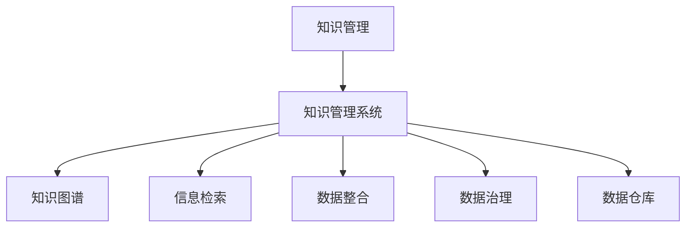

                 

# 信息过载与知识管理系统实施指南：有效组织和检索信息

> 关键词：信息过载, 知识管理, 信息检索, 数据整合, 知识图谱, 数据治理, 数据仓库

## 1. 背景介绍

### 1.1 问题由来

随着信息化时代的到来，互联网技术的飞速发展，人们获取信息的方式和途径越来越多样化。从传统的报纸、电视、书籍，到现在的社交媒体、视频网站、智能应用等，信息量呈指数级增长。然而，信息量的爆炸式增长也带来了新的挑战——信息过载。

信息过载指的是人们面对大量的信息时，难以处理和利用，导致效率降低、决策困难甚至信息焦虑。在商业、科研、教育等领域，信息过载问题尤为严重。企业需要处理海量的内部和外部数据，研究人员需要筛选海量文献，学生需要在海量知识库中查找信息。

信息过载不仅影响人们的日常生活，也严重制约了组织和个人的决策能力和创新能力。如何有效组织和检索信息，成为知识管理领域亟待解决的课题。

### 1.2 问题核心关键点

信息过载问题的核心在于数据量和数据质量的不匹配。一方面，人们面对的信息量不断增加；另一方面，这些信息往往零散、无序、不一致，难以有效利用。

解决信息过载问题，需要建立高效的知识管理系统(Knowledge Management System, KMS)。KMS通过采集、整理、存储、检索、分享等环节，帮助用户高效利用知识，提升决策效率和工作质量。

## 2. 核心概念与联系

### 2.1 核心概念概述

为更好地理解知识管理系统的构建，本节将介绍几个关键概念：

- **知识管理**：通过组织和利用知识，提高组织和个人的工作效率和决策质量。
- **知识管理系统**：用于管理和应用知识的软件系统，包括知识采集、存储、检索、共享等环节。
- **知识图谱**：一种图形化的知识表示方式，通过节点和边描述实体与实体之间的关系。
- **信息检索**：利用算法自动从大量信息中检索出用户需要的数据，提高检索效率和准确性。
- **数据整合**：将来自不同来源的数据通过技术手段统一整合，构建统一的数据视图。
- **数据治理**：通过数据质量管理、数据安全管理等手段，保障数据的质量和安全性。
- **数据仓库**：集成了来自多个数据源的结构化数据，为数据分析和决策支持提供支持。

这些概念之间的逻辑关系可以通过以下Mermaid流程图来展示：



这个流程图展示出知识管理系统的关键组件及其之间的联系：

1. 知识管理通过知识管理系统来实现。
2. 知识图谱、信息检索等组件支持知识管理系统的数据管理和应用。
3. 数据整合和数据治理是知识管理系统的底层支撑，保障数据质量和安全。
4. 数据仓库是知识管理系统的数据来源，提供结构化数据支持。

## 3. 核心算法原理 & 具体操作步骤
### 3.1 算法原理概述

知识管理系统的核心目标是有效组织和检索信息。这需要依赖信息检索算法和数据整合技术。

信息检索算法通过构建索引、匹配查询词等方式，从海量数据中快速定位目标信息。常见算法包括布尔检索、向量空间模型、概率模型等。这些算法通过计算检索结果的相关性，将匹配度高的结果排在前面，帮助用户快速找到所需信息。

数据整合技术通过ETL(Extract, Transform, Load)流程，将不同数据源的数据统一整合。ETL流程包括数据抽取、转换和加载，其中数据转换技术如数据清洗、数据标准化、数据匹配等，对提高数据质量和一致性至关重要。

知识图谱则通过图形化的方式，展示实体之间的关系，帮助用户直观理解数据结构。图谱算法如PageRank、DeepWalk等，通过计算节点的权重和相似度，揭示数据中的隐藏关系，提高知识的发现和利用效率。

### 3.2 算法步骤详解

知识管理系统的实现主要包括以下几个关键步骤：

**Step 1: 数据采集**

- 确定数据源，包括内部系统和外部资源。
- 设计数据采集策略，确保数据的完整性和一致性。
- 使用ETL工具如Apache Nifi、Talend等，自动化地从数据源抽取数据。

**Step 2: 数据清洗**

- 对原始数据进行清洗，去除冗余、错误和噪声数据。
- 进行数据标准化，确保数据格式一致，便于后续处理。
- 使用ETL工具提供的数据清洗功能，自动进行数据预处理。

**Step 3: 数据整合**

- 将来自不同数据源的数据进行归并，建立统一的数据视图。
- 设计数据匹配规则，解决不同数据源中相同实体的不同表示问题。
- 使用数据整合工具如Informatica、DataStage等，自动化进行数据整合。

**Step 4: 数据存储**

- 将整合后的数据存储到数据仓库或数据湖中。
- 设计合理的数据模型，确保数据的可扩展性和可维护性。
- 使用SQL数据库或NoSQL数据库，如Hadoop Hive、Apache Cassandra等，存储和管理数据。

**Step 5: 知识抽取**

- 从存储的数据中提取实体、关系、属性等信息。
- 使用自然语言处理技术，如命名实体识别、关系抽取等，提取知识元数据。
- 将抽取的知识元数据存储到知识图谱或数据库中。

**Step 6: 知识图谱构建**

- 将抽取的知识元数据构建为知识图谱。
- 设计知识图谱的数据模型，包括节点和边。
- 使用图谱工具如Neo4j、TigerGraph等，构建和查询知识图谱。

**Step 7: 信息检索**

- 设计信息检索模型，如倒排索引、向量空间模型等。
- 建立索引，将数据按照关键词或属性进行索引。
- 设计检索算法，根据用户查询匹配检索结果。

**Step 8: 系统集成**

- 将各个组件进行集成，构建知识管理系统。
- 设计友好的用户界面，方便用户使用系统。
- 使用API或Web服务等方式，与其他系统集成。

### 3.3 算法优缺点

知识管理系统的优点包括：

- 提高信息检索效率。通过优化检索算法和构建索引，用户可以更快地找到所需信息。
- 提升数据质量。通过ETL流程，解决数据冗余、错误、不一致等问题，确保数据质量。
- 增强知识发现。通过知识抽取和图谱构建，揭示数据中的隐藏关系，提高知识的发现和利用效率。

系统的主要缺点包括：

- 数据采集和整合成本高。需要投入大量人力和时间进行数据源的选择、数据抽取和整合。
- 系统复杂度高。知识管理系统的设计和实现复杂度较高，需要多学科的协作。
- 数据隐私和安全问题。整合和共享数据可能涉及敏感信息，需要设计严格的隐私和安全策略。

尽管存在这些局限性，但知识管理系统在信息组织和利用方面仍然具有重要价值。未来相关研究将进一步优化数据采集和整合流程，提高系统的易用性和可扩展性，同时加强数据隐私和安全保障。

### 3.4 算法应用领域

知识管理系统在多个领域都有广泛的应用：

- **商业智能**：帮助企业从大量业务数据中提取有价值的信息，辅助决策。
- **科研管理**：帮助研究人员管理文献、数据和实验记录，提高科研效率。
- **教育培训**：提供丰富的学习资源和知识库，支持个性化学习。
- **政府管理**：帮助政府机构管理数据和信息，提升公共服务质量。
- **医疗健康**：辅助医生诊断和治疗，提供患者健康记录管理。
- **供应链管理**：优化供应链流程，提高生产效率和供应链透明度。

## 4. 数学模型和公式 & 详细讲解 & 举例说明

### 4.1 数学模型构建

本节将使用数学语言对知识管理系统的核心算法进行更加严格的刻画。

假设知识管理系统的数据源为 $D=\{d_i\}_{i=1}^N$，每个数据 $d_i$ 包含 $M$ 个属性，即 $d_i=(d_i^1, d_i^2, ..., d_i^M)$。知识管理系统的目标是从 $D$ 中提取知识元数据，构建知识图谱，进行信息检索。

定义知识图谱的数据模型为 $G=(V,E)$，其中 $V$ 为节点集合，$E$ 为边集合。每个节点表示一个实体，边表示实体之间的关系。

定义信息检索模型为 $I=(V_q, V_d)$，其中 $V_q$ 为用户查询的节点集合，$V_d$ 为检索结果的节点集合。用户查询 $q$ 和检索结果 $d$ 之间的相似度为 $s(q,d)$。

定义知识抽取模型为 $E=(V_k, E_k)$，其中 $V_k$ 为知识元数据的节点集合，$E_k$ 为知识元数据之间的关系。知识抽取的目标是从数据 $D$ 中提取 $V_k$ 和 $E_k$。

### 4.2 公式推导过程

以下我们以布尔检索算法为例，推导信息检索过程的数学公式。

假设数据集 $D=\{d_1, d_2, ..., d_N\}$，每个数据包含 $M$ 个属性，即 $d_i=(d_i^1, d_i^2, ..., d_i^M)$。用户查询 $q=(q^1, q^2, ..., q^M)$，其中 $q^j$ 为查询属性，取值为0或1。定义 $R$ 为数据 $d_i$ 中属性 $d_i^j$ 的取值，即 $R=(R_1, R_2, ..., R_M)$。定义布尔检索函数为 $f(R,q)=\prod_{j=1}^M R_j^{q_j}(1-R_j)^{1-q_j}$。

将 $f(R,q)$ 展开得：

$$
f(R,q) = \prod_{j=1}^M R_j^{q_j}(1-R_j)^{1-q_j} = \prod_{j=1}^M (R_j^{q_j} \cdot (1-R_j)^{1-q_j})
$$

令 $q_j'=1-q_j$，则有：

$$
f(R,q) = \prod_{j=1}^M (R_j^{q_j} \cdot (1-R_j)^{q_j'})
$$

进一步简化得：

$$
f(R,q) = \prod_{j=1}^M R_j^{q_j}(1-R_j)^{q_j'}
$$

将 $f(R,q)$ 与用户查询 $q$ 进行匹配，可以得出每个数据 $d_i$ 与查询 $q$ 的匹配度 $s_i(q)$，即：

$$
s_i(q) = f(R_i,q) = \prod_{j=1}^M R_i^j(1-R_i)^{1-q_j'}
$$

最终的检索结果为：

$$
\text{result} = \arg\max_{i=1}^N s_i(q)
$$

通过布尔检索算法，可以高效地从大量数据中检索出与用户查询最匹配的结果，提高信息检索的效率和准确性。

## 5. 项目实践：代码实例和详细解释说明
### 5.1 开发环境搭建

在进行知识管理系统的开发前，我们需要准备好开发环境。以下是使用Python进行Elasticsearch开发的环境配置流程：

1. 安装Anaconda：从官网下载并安装Anaconda，用于创建独立的Python环境。

2. 创建并激活虚拟环境：
```bash
conda create -n elasticsearch-env python=3.8 
conda activate elasticsearch-env
```

3. 安装Elasticsearch：从官网下载并安装Elasticsearch，注意配置文件和数据目录。

4. 安装Python的Elasticsearch客户端库：
```bash
pip install elasticsearch
```

5. 安装Flask：
```bash
pip install flask
```

6. 安装SQLAlchemy：
```bash
pip install sqlalchemy
```

完成上述步骤后，即可在`elasticsearch-env`环境中开始知识管理系统的开发。

### 5.2 源代码详细实现

下面我们以构建知识图谱为例，给出使用Python和Elasticsearch进行知识管理系统的代码实现。

首先，定义数据模型和索引：

```python
from elasticsearch import Elasticsearch
from elasticsearch import helpers
from elasticsearch import indexes

es = Elasticsearch([{'host': 'localhost', 'port': 9200}])
index = indexes.SimpleIndex('books', 'mappings.json')
```

然后，定义数据导入函数：

```python
def import_data():
    with open('books.json', 'r') as f:
        books = json.load(f)
    action = helpers.prepare_bulk(action='index', index=index, body=books)
    es.bulk(body=action)
```

接着，定义图谱构建函数：

```python
from py2neo import Graph
from py2neo import Node, Relationship

graph = Graph("http://localhost:7474/db/data/")
books = graph.run("MATCH (n) RETURN n").data()
for book in books:
    title = book['title']
    author = book['author']
    genres = book['genres']
    graph.create(Node('Book', name=title))
    graph.create(Node('Author', name=author))
    graph.create(Node('Genre', name=genres))
    graph.create(Relationship(book, 'AUTHOR', author))
    graph.create(Relationship(book, 'GENRE', genres))
```

最后，启动Elasticsearch和Flask服务，进行系统部署：

```python
if __name__ == '__main__':
    import_data()
    app.run(debug=True)
```

以上就是使用Python和Elasticsearch构建知识管理系统的完整代码实现。可以看到，通过Elasticsearch的索引和查询功能，可以高效地构建和检索知识图谱。

### 5.3 代码解读与分析

让我们再详细解读一下关键代码的实现细节：

**定义数据模型和索引**：
- `indexes.SimpleIndex`：定义了一个简单的索引，包括索引名称和映射文件路径。

**数据导入函数**：
- 使用`json.load`方法加载JSON文件，得到数据集。
- 使用`helpers.prepare_bulk`方法将数据集转换为Elasticsearch的bulk请求。
- 使用`es.bulk`方法批量提交请求，将数据导入Elasticsearch。

**图谱构建函数**：
- 使用`py2neo`库连接到Neo4j图谱数据库。
- 从图谱数据库中获取所有图书、作者和类型数据。
- 创建图书、作者和类型的节点，并建立相应的关系。

**系统部署**：
- 启动Elasticsearch服务，确保索引和数据已经准备就绪。
- 启动Flask服务，通过API接口提供系统功能，如数据导入、图谱构建等。

## 6. 实际应用场景

### 6.1 商业智能

在商业智能领域，知识管理系统可以应用于业务数据整合、数据可视化、报告生成等环节。企业可以通过知识管理系统，将来自不同业务系统的数据整合在一起，生成统一的视图，支持实时数据分析和决策支持。

具体而言，可以采集企业内部的财务、销售、运营等数据，建立数据仓库或数据湖。通过数据清洗和ETL流程，将这些数据整合到一个统一的数据库中。在数据仓库基础上，建立知识图谱，帮助业务人员快速找到所需信息，生成数据报表和分析报告，辅助高层决策。

### 6.2 科研管理

在科研管理领域，知识管理系统可以应用于文献管理、项目跟踪、实验记录等环节。研究人员可以通过知识管理系统，管理文献、实验数据和项目进度，提高科研效率。

具体而言，可以采集研究人员发表的论文、实验记录、项目进度等数据，建立数据仓库或数据湖。通过数据清洗和ETL流程，将这些数据整合到一个统一的数据库中。在数据仓库基础上，建立知识图谱，帮助研究人员快速找到所需文献和实验数据，跟踪项目进度，生成科研项目报告，支持科研协作。

### 6.3 教育培训

在教育培训领域，知识管理系统可以应用于学习资源管理、个性化学习推荐、学习进度跟踪等环节。学生可以通过知识管理系统，获取丰富的学习资源，支持个性化学习。

具体而言，可以采集学校和在线教育平台的学习资源，如视频、文档、习题等，建立数据仓库或数据湖。通过数据清洗和ETL流程，将这些数据整合到一个统一的数据库中。在数据仓库基础上，建立知识图谱，帮助学生快速找到所需学习资源，推荐个性化学习路径，跟踪学习进度，生成学习报告，支持师生互动。

### 6.4 未来应用展望

随着知识管理系统的不断发展，其应用领域将进一步拓展，带来更多创新的应用场景：

- **智能客服**：通过知识管理系统，建立客服知识库，支持智能客服系统进行快速检索和回答，提升客户满意度。
- **金融风控**：在金融风控领域，知识管理系统可以用于建立客户信用图谱，辅助信贷评估和风险控制。
- **智能推荐**：通过知识管理系统，建立用户兴趣图谱，支持个性化推荐系统进行商品、内容推荐，提高用户满意度。
- **智慧医疗**：在智慧医疗领域，知识管理系统可以用于建立患者健康图谱，支持医疗决策和健康管理。
- **智慧城市**：在智慧城市领域，知识管理系统可以用于建立城市运行图谱，支持城市管理、交通规划等应用。

## 7. 工具和资源推荐

### 7.1 学习资源推荐

为了帮助开发者系统掌握知识管理系统的理论基础和实践技巧，这里推荐一些优质的学习资源：

1. **《知识管理》（Knowledge Management）**：吉尔·克里斯托弗斯和克里斯汀·蒂兹合著的经典书籍，全面介绍了知识管理的基本概念、理论框架和实践案例。

2. **《信息检索》（Information Retrieval）**：克里斯托弗·D. 梅德雷和苏珊·加尼尔合著的教材，介绍了信息检索的核心算法和技术。

3. **《数据治理》（Data Governance）**：克里斯托弗·A. 克拉克合著的书籍，介绍了数据治理的理论和实践方法。

4. **《数据仓库与数据治理》（Data Warehouse and Data Governance）**：杰弗瑞·A. 曲维仁和祖建合著的书籍，介绍了数据仓库和数据治理的核心技术和最佳实践。

5. **《Python数据科学手册》（Python Data Science Handbook）**：Jake VanderPlas著的书籍，介绍了使用Python进行数据分析和处理的方法。

通过对这些资源的学习实践，相信你一定能够快速掌握知识管理系统的精髓，并用于解决实际的业务问题。

### 7.2 开发工具推荐

高效的开发离不开优秀的工具支持。以下是几款用于知识管理系统开发的常用工具：

1. **Elasticsearch**：开源的分布式搜索与分析引擎，支持高效的数据存储和检索。

2. **Apache Nifi**：开源的数据集成工具，支持自动化地从不同数据源抽取、转换和加载数据。

3. **Talend**：开源的数据集成平台，支持ETL流程的设计和执行。

4. **Flask**：轻量级的Web框架，支持快速开发API接口。

5. **Py2neo**：Python的Neo4j图谱客户端库，支持图谱数据的存储和查询。

6. **ELK Stack**：Elasticsearch、Logstash和Kibana的组合，支持日志分析和可视化。

合理利用这些工具，可以显著提升知识管理系统的开发效率，加快创新迭代的步伐。

### 7.3 相关论文推荐

知识管理系统的研究源于学界的持续研究。以下是几篇奠基性的相关论文，推荐阅读：

1. **《知识管理：一个协作环境下的信息创建、检索与共享体系结构》（Knowledge Management: A Collaborative Approach to Semantic Engineering）**：托马斯·达文波特和托马斯·德维森合著的论文，介绍了知识管理的基本框架和应用场景。

2. **《信息检索：理论和实践》（Information Retrieval: Theory and Practice）**：克里斯托弗·D. 梅德雷和苏珊·加尼尔合著的书籍，介绍了信息检索的核心算法和技术。

3. **《数据治理：战略、实践与治理框架》（Data Governance: Strategies, Practices and Governance Frameworks）**：克里斯托弗·A. 克拉克合著的书籍，介绍了数据治理的理论和实践方法。

4. **《数据仓库的概念和技术》（The Concepts and Technologies of Data Warehouse）**：大卫·W. 奥德放合著的书籍，介绍了数据仓库的核心技术和应用场景。

5. **《基于知识图谱的推荐系统》（Knowledge-Based Recommendation Systems）**：张灵格和赵义凤合著的论文，介绍了知识图谱在推荐系统中的应用。

这些论文代表了大语言模型微调技术的发展脉络。通过学习这些前沿成果，可以帮助研究者把握学科前进方向，激发更多的创新灵感。

## 8. 总结：未来发展趋势与挑战

### 8.1 总结

本文对知识管理系统进行了全面系统的介绍。首先阐述了信息过载问题的背景和知识管理系统的意义，明确了系统在数据整合、知识抽取、信息检索等环节的关键作用。其次，从原理到实践，详细讲解了知识管理系统的构建过程，包括数据采集、数据清洗、数据整合、知识抽取、图谱构建、信息检索等环节。最后，本文还探讨了知识管理系统的实际应用场景，推荐了相关学习资源和开发工具，为读者提供了全面的技术指引。

通过本文的系统梳理，可以看到，知识管理系统在信息组织和利用方面具有重要价值，能够有效解决信息过载问题，提升业务效率和工作质量。未来，伴随知识管理系统的不断演进，其在多领域的应用将更加广泛，推动社会各行业的信息化和智能化进程。

### 8.2 未来发展趋势

展望未来，知识管理系统将呈现以下几个发展趋势：

1. **实时化处理**：知识管理系统将向实时化、流处理方向发展，支持对海量数据的实时分析和处理，满足业务实时化需求。

2. **自动化部署**：知识管理系统将向自动化部署、自动化运维方向发展，减少人工干预，提高系统可靠性和稳定性。

3. **智能推荐**：知识管理系统将融合人工智能技术，支持个性化推荐、智能问答等应用，提升用户体验。

4. **多模态数据融合**：知识管理系统将融合多模态数据，支持语音、图像、文本等多源数据的整合和应用。

5. **边缘计算**：知识管理系统将向边缘计算方向发展，支持在设备端进行数据处理和分析，提升系统响应速度和效率。

6. **联邦学习**：知识管理系统将向联邦学习方向发展，支持分布式数据共享和合作学习，保障数据隐私和安全。

以上趋势凸显了知识管理系统的广阔前景。这些方向的探索发展，必将进一步提升知识管理系统的应用范围和价值，为社会各行业的信息化、智能化进程提供重要支持。

### 8.3 面临的挑战

尽管知识管理系统已经取得了一定的成果，但在迈向更加智能化、普适化应用的过程中，仍面临诸多挑战：

1. **数据来源多样化**：不同数据源的数据格式、数据质量、数据规模差异较大，需要统一整合。

2. **数据隐私和安全问题**：数据整合和共享可能涉及敏感信息，需要设计严格的隐私和安全策略。

3. **系统复杂度高**：知识管理系统的设计和实现复杂度较高，需要多学科的协作。

4. **实时性要求高**：实时化处理对系统性能和可扩展性提出了更高要求。

5. **多模态数据融合困难**：多模态数据的整合和应用需要突破现有技术瓶颈。

6. **边缘计算成本高**：边缘计算需要投资大量的硬件设备和网络基础设施。

尽管存在这些挑战，但通过不断的技术创新和实践探索，知识管理系统必将在未来变得更加高效、可靠、智能化，为社会各行业的信息化、智能化进程提供重要支撑。

### 8.4 研究展望

面对知识管理系统面临的挑战，未来的研究需要在以下几个方面寻求新的突破：

1. **统一数据格式**：研究数据格式标准化、数据转换技术，解决数据异构问题，提升数据整合效率。

2. **数据隐私保护**：研究数据隐私保护技术，如差分隐私、联邦学习等，保障数据隐私和安全。

3. **自动化部署和运维**：研究自动化部署、自动化运维技术，减少人工干预，提高系统可靠性和稳定性。

4. **实时化处理**：研究实时化处理技术，如流处理、微服务架构等，提升系统响应速度和处理能力。

5. **多模态数据融合**：研究多模态数据融合技术，如深度学习、知识图谱等，提升数据整合和应用效率。

6. **边缘计算优化**：研究边缘计算优化技术，如边缘计算平台、分布式数据存储等，降低边缘计算成本，提升系统响应速度和效率。

这些研究方向的探索，必将引领知识管理系统向更高层次发展，为社会各行业的信息化和智能化进程提供重要支持。

## 9. 附录：常见问题与解答

**Q1：知识管理系统如何实现数据整合？**

A: 知识管理系统的数据整合主要通过ETL流程实现。ETL流程包括数据抽取、数据转换和数据加载三个环节：

1. **数据抽取**：从不同数据源（如数据库、文件、API等）抽取数据，确保数据的完整性和一致性。

2. **数据转换**：对抽取的数据进行清洗、标准化、去重等处理，确保数据质量。

3. **数据加载**：将转换后的数据加载到目标数据存储（如数据仓库、数据湖等）中，建立统一的数据视图。

数据转换是数据整合的关键环节，常用的技术包括数据清洗、数据标准化、数据匹配等。数据清洗可以去除冗余、错误和噪声数据；数据标准化可以统一数据格式，便于后续处理；数据匹配可以解决不同数据源中相同实体的不同表示问题，确保数据一致性。

**Q2：知识管理系统如何支持智能推荐？**

A: 知识管理系统可以通过建立用户兴趣图谱，支持智能推荐系统进行个性化推荐。具体步骤如下：

1. **数据采集**：采集用户的行为数据，如浏览记录、购买记录、搜索记录等。

2. **用户画像**：通过数据清洗和转换，建立用户画像，描述用户的兴趣和偏好。

3. **知识抽取**：从数据仓库中抽取产品、内容、服务等信息，构建知识图谱。

4. **推荐算法**：设计推荐算法，如协同过滤、基于内容的推荐、基于知识的推荐等。

5. **实时推荐**：通过实时处理用户行为数据，更新用户画像，生成推荐结果。

通过知识管理系统，可以高效地构建和查询知识图谱，支持智能推荐系统的个性化推荐，提升用户体验。

**Q3：知识管理系统如何保障数据隐私和安全？**

A: 知识管理系统在保障数据隐私和安全方面，主要通过以下措施：

1. **数据匿名化**：在数据采集和处理过程中，对敏感信息进行匿名化处理，防止数据泄露。

2. **访问控制**：设计严格的访问控制机制，确保只有授权人员可以访问敏感数据。

3. **加密技术**：使用加密技术，如AES、RSA等，保护数据在传输和存储过程中的安全性。

4. **数据脱敏**：在数据处理过程中，对敏感信息进行脱敏处理，防止数据泄露。

5. **联邦学习**：采用联邦学习技术，将数据分布在多个节点上进行训练，保障数据隐私和安全。

6. **差分隐私**：使用差分隐私技术，保护数据隐私，防止数据泄露。

通过这些措施，知识管理系统可以有效保障数据隐私和安全，确保数据在处理和使用过程中的安全性。

**Q4：知识管理系统如何支持多模态数据融合？**

A: 知识管理系统可以通过多模态数据融合技术，支持语音、图像、文本等多源数据的整合和应用。具体步骤如下：

1. **数据采集**：采集不同模态的数据，如语音、图像、文本等。

2. **数据转换**：对不同模态的数据进行清洗、标准化、去重等处理，确保数据质量。

3. **数据融合**：将不同模态的数据进行融合，建立统一的数据视图。

4. **知识抽取**：从融合后的数据中抽取实体、关系、属性等信息，构建知识图谱。

5. **应用场景**：将融合后的数据应用于实际应用场景，如智能客服、智能推荐等。

通过多模态数据融合技术，知识管理系统可以有效整合和应用多源数据，提升系统的实用性和可靠性。

**Q5：知识管理系统如何支持实时化处理？**

A: 知识管理系统可以通过实时化处理技术，支持对海量数据的实时分析和处理，满足业务实时化需求。具体步骤如下：

1. **实时数据采集**：使用流式数据采集技术，实时采集数据，确保数据的时效性。

2. **实时数据处理**：使用流式数据处理技术，对实时数据进行清洗、标准化、去重等处理，确保数据质量。

3. **实时数据存储**：使用流式数据存储技术，将处理后的数据实时存储在目标数据存储中，建立实时数据视图。

4. **实时数据分析**：使用实时数据分析技术，如实时流处理、实时查询等，对实时数据进行分析和处理。

5. **实时应用场景**：将实时数据应用于实时应用场景，如实时推荐、实时监控等。

通过实时化处理技术，知识管理系统可以有效处理实时数据，满足业务实时化需求，提升系统响应速度和效率。

---

作者：禅与计算机程序设计艺术 / Zen and the Art of Computer Programming

