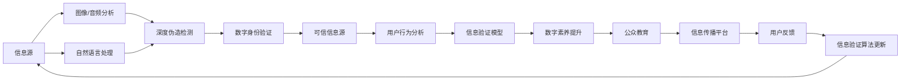

                 

## 1. 背景介绍

### 1.1 问题由来

在信息爆炸的互联网时代，真假难辨、误导性信息横行。对于普通人来说，要在海量的信息流中准确判断信息真伪，难度越来越大。虚假新闻、网络谣言、深度伪造（Deepfake）、不准确或带有偏见的信息，不仅误导公众，还可能影响社会稳定。

### 1.2 问题核心关键点

1. **信息真伪识别**：如何快速准确地甄别信息的真伪？
2. **数字素养培养**：如何提升公众的数字素养，培养其识别和应对信息错误的能力？
3. **技术工具应用**：如何借助技术手段，如机器学习、自然语言处理（NLP）、深度学习等，辅助信息验证？
4. **多方合作**：在技术解决方案中，如何集成政策法规、用户反馈等多方力量，共同构建信息验证体系？

### 1.3 问题研究意义

在错误信息时代，提升公众的数字素养、构建可靠的信息验证体系，不仅有助于维护公众利益，还能提升社会整体的信息安全水平。特别是在社交媒体、新闻媒体、搜索引擎等平台，信息验证技术的应用将极大地改善用户的信息获取体验，增强用户信任，对抗虚假信息的传播。

## 2. 核心概念与联系

### 2.1 核心概念概述

- **信息验证**：指通过技术手段对信息进行真实性、准确性、可靠性等的判断和验证。
- **数字素养**：指个体有效使用数字工具、理解数字媒体、参与数字活动的能力。
- **深度伪造（Deepfake）**：通过人工智能技术合成的假冒视频、音频，用于欺骗、误导。
- **误导性信息**：故意或无意制造的，旨在误导公众的信息。
- **数字身份验证**：通过生物特征、行为特征等对用户身份进行验证，防止冒充和欺诈。
- **可信信息源**：指那些经过专业审核、有可靠证据支撑的信息来源。

这些核心概念共同构成了信息验证与数字素养提升的技术框架，旨在通过技术手段和教育培养，构建一个更加安全、可信的数字社会。

### 2.2 核心概念原理和架构的 Mermaid 流程图



## 3. 核心算法原理 & 具体操作步骤

### 3.1 算法原理概述

信息验证的本质是对信息进行真实性、准确性、可靠性的判断。其核心算法包括：

- **自然语言处理（NLP）**：用于文本信息真伪判断。包括文本分类、情感分析、事实核查等任务。
- **图像/音频分析**：用于检测深度伪造（Deepfake）内容。包括视频内容分析、音频生成模型检测等。
- **数字身份验证**：通过生物特征、行为特征等验证用户身份，防止信息冒充和欺诈。
- **可信信息源识别**：通过规则、链接、发布平台等特征，判断信息来源的可靠性和权威性。

### 3.2 算法步骤详解

**Step 1: 收集和整理信息源**

收集各种来源的信息，包括新闻、社交媒体、论坛、博客等。对其进行整理和分类，建立信息源数据库。

**Step 2: 文本信息分析**

使用NLP技术对文本信息进行分类、情感分析、事实核查等。通过构建分类模型、情感分析模型、事实核查模型，对文本进行真伪判断。

**Step 3: 图像/音频分析**

使用深度学习模型对图像和音频内容进行深度伪造检测。构建图像检测模型、音频生成模型检测模型，用于识别和标记Deepfake内容。

**Step 4: 数字身份验证**

通过生物特征（如指纹、面部识别）、行为特征（如打字速度、鼠标移动轨迹）等对用户进行身份验证，防止虚假身份发布信息。

**Step 5: 可信信息源识别**

构建可信信息源识别模型，通过分析信息来源的发布平台、发布频率、链接特征等，判断信息源的权威性和可靠性。

**Step 6: 信息验证模型训练和更新**

根据收集的信息源和验证结果，训练和更新信息验证模型。通过不断迭代和优化，提升模型的准确性和鲁棒性。

### 3.3 算法优缺点

**优点**：

- **自动化高效**：通过技术手段实现自动化信息验证，提高效率。
- **多维度判断**：结合NLP、图像/音频分析、数字身份验证等技术，从多个维度进行信息真伪判断。
- **动态更新**：基于用户反馈和新技术，持续更新信息验证模型，提高准确性。

**缺点**：

- **依赖高质量数据**：模型的性能依赖于训练数据的质量和多样性。
- **误报和漏报**：算法可能存在误报（将真实信息误判为假冒）或漏报（将假冒信息误判为真实）的风险。
- **技术门槛**：需要一定的技术背景和专业知识的储备，才能构建和维护信息验证系统。

### 3.4 算法应用领域

信息验证技术广泛应用于：

- **社交媒体平台**：识别和处理虚假信息，保护用户免受误导。
- **新闻媒体机构**：辅助事实核查，提高新闻报道的准确性和可信度。
- **搜索引擎**：在搜索结果中标注可信和不可信信息，提升搜索体验。
- **金融行业**：防止金融欺诈，保护用户资金安全。
- **医疗健康**：验证医疗信息的准确性，防止虚假医疗信息的传播。
- **公共安全**：监控网络言论，预防虚假信息的传播和扩散。

## 4. 数学模型和公式 & 详细讲解 & 举例说明

### 4.1 数学模型构建

信息验证的数学模型通常涉及以下几个方面：

- **文本分类模型**：$P(C_i|x) = \frac{exp(w_C^Tx)}{\sum_{j=1}^{n}exp(w_C^Tx)}$
  - $P(C_i|x)$：文本$x$属于类别$C_i$的概率。
  - $w_C$：分类器的权重向量。
  - $x$：文本的特征向量。

- **情感分析模型**：$P(E_j|x) = \frac{exp(w_E^Tx)}{\sum_{k=1}^{m}exp(w_E^Tx)}$
  - $P(E_j|x)$：文本$x$情感为$E_j$的概率。
  - $w_E$：情感分析器的权重向量。
  - $x$：文本的特征向量。

- **事实核查模型**：$P(C_i|x) = \frac{exp(w_C^Tx)}{\sum_{j=1}^{n}exp(w_C^Tx)}$
  - $P(C_i|x)$：文本$x$中事实$C_i$为真的概率。
  - $w_C$：事实核查模型的权重向量。
  - $x$：文本的特征向量。

### 4.2 公式推导过程

**文本分类**：

假设我们有$n$个类别$C_1, C_2, ..., C_n$，和$m$个特征$d_1, d_2, ..., d_m$。分类器是一个线性分类器，权重向量为$w_C = (w_{C_1}, w_{C_2}, ..., w_{C_n})$。文本$x$表示为一个$m$维的向量，其中每个元素$d_i$表示文本中对应特征的权重。

根据贝叶斯定理，文本$x$属于类别$C_i$的概率为：

$$
P(C_i|x) = \frac{P(x|C_i)P(C_i)}{P(x)}
$$

其中$P(x|C_i)$是文本$x$在类别$C_i$下的条件概率，$P(C_i)$是类别$C_i$的先验概率，$P(x)$是文本$x$的先验概率。

对于线性分类器，我们可以将其表示为：

$$
P(C_i|x) = \frac{exp(w_C^Tx)}{\sum_{j=1}^{n}exp(w_C^Tx)}
$$

**情感分析**：

情感分析模型通常使用二分类模型，将文本情感分为正面和负面。情感分类器可以表示为：

$$
P(E_j|x) = \frac{exp(w_E^Tx)}{\sum_{k=1}^{m}exp(w_E^Tx)}
$$

其中$E_j$表示情感类别，$w_E$表示情感分析器的权重向量，$x$表示文本的特征向量。

**事实核查**：

事实核查模型用于判断文本中某一事实的真假。假设我们有$k$个事实$C_1, C_2, ..., C_k$，文本$x$表示为一个$m$维的向量，每个元素$d_i$表示文本中对应事实的权重。事实核查模型的输出为每个事实为真的概率$P(C_i|x)$，可以表示为：

$$
P(C_i|x) = \frac{exp(w_C^Tx)}{\sum_{j=1}^{n}exp(w_C^Tx)}
$$

### 4.3 案例分析与讲解

**案例1：文本分类模型构建**

1. **数据收集**：从新闻、社交媒体、博客等平台收集文本数据，并进行标注。
2. **特征提取**：使用NLP技术提取文本的特征，如词频、TF-IDF、词向量等。
3. **模型训练**：使用分类器训练数据集，优化权重向量$w_C$。
4. **模型评估**：在测试集上评估模型的准确率、召回率、F1-score等指标。
5. **模型应用**：对新文本进行分类，判断其是否为虚假信息。

**案例2：情感分析模型构建**

1. **数据收集**：从评论、用户反馈等平台收集文本数据，并进行情感标注。
2. **特征提取**：使用NLP技术提取文本的情感特征，如情感词、情感强度等。
3. **模型训练**：使用情感分类器训练数据集，优化权重向量$w_E$。
4. **模型评估**：在测试集上评估模型的准确率、召回率、F1-score等指标。
5. **模型应用**：对新文本进行情感分析，判断其情感倾向。

**案例3：事实核查模型构建**

1. **数据收集**：收集包含事实陈述的文本数据，并进行事实标注。
2. **特征提取**：使用NLP技术提取文本的事实特征，如事实陈述的关键词、相关事件等。
3. **模型训练**：使用事实核查模型训练数据集，优化权重向量$w_C$。
4. **模型评估**：在测试集上评估模型的准确率、召回率、F1-score等指标。
5. **模型应用**：对新文本进行事实核查，判断事实陈述的真假。

## 5. 项目实践：代码实例和详细解释说明

### 5.1 开发环境搭建

为了实现上述模型，我们需要以下开发环境：

1. Python 3.8及以上版本，安装`pip`包管理器。
2. 安装`numpy`、`pandas`、`scikit-learn`、`nltk`、`gensim`等常用数据科学库。
3. 安装`transformers`、`nltk`、`tqdm`等NLP相关库。
4. 安装`tensorflow`或`pytorch`深度学习框架。

### 5.2 源代码详细实现

**文本分类模型**

```python
from sklearn.model_selection import train_test_split
from sklearn.naive_bayes import MultinomialNB
from sklearn.metrics import accuracy_score
from sklearn.feature_extraction.text import CountVectorizer
import pandas as pd

# 加载数据
df = pd.read_csv('text_data.csv')
X = df['text']
y = df['label']

# 特征提取
vectorizer = CountVectorizer()
X = vectorizer.fit_transform(X)

# 划分数据集
X_train, X_test, y_train, y_test = train_test_split(X, y, test_size=0.2)

# 模型训练
clf = MultinomialNB()
clf.fit(X_train, y_train)

# 模型评估
y_pred = clf.predict(X_test)
accuracy = accuracy_score(y_test, y_pred)
print('Accuracy:', accuracy)
```

**情感分析模型**

```python
from sklearn.model_selection import train_test_split
from sklearn.svm import SVC
from sklearn.metrics import accuracy_score
from sklearn.feature_extraction.text import CountVectorizer
import pandas as pd

# 加载数据
df = pd.read_csv('sentiment_data.csv')
X = df['text']
y = df['sentiment']

# 特征提取
vectorizer = CountVectorizer()
X = vectorizer.fit_transform(X)

# 划分数据集
X_train, X_test, y_train, y_test = train_test_split(X, y, test_size=0.2)

# 模型训练
clf = SVC()
clf.fit(X_train, y_train)

# 模型评估
y_pred = clf.predict(X_test)
accuracy = accuracy_score(y_test, y_pred)
print('Accuracy:', accuracy)
```

**事实核查模型**

```python
from sklearn.model_selection import train_test_split
from sklearn.linear_model import LogisticRegression
from sklearn.metrics import accuracy_score
from sklearn.feature_extraction.text import CountVectorizer
import pandas as pd

# 加载数据
df = pd.read_csv('fact_check_data.csv')
X = df['text']
y = df['fact']

# 特征提取
vectorizer = CountVectorizer()
X = vectorizer.fit_transform(X)

# 划分数据集
X_train, X_test, y_train, y_test = train_test_split(X, y, test_size=0.2)

# 模型训练
clf = LogisticRegression()
clf.fit(X_train, y_train)

# 模型评估
y_pred = clf.predict(X_test)
accuracy = accuracy_score(y_test, y_pred)
print('Accuracy:', accuracy)
```

### 5.3 代码解读与分析

**文本分类模型**

1. **数据加载**：使用`pandas`库从CSV文件中加载数据，包含文本和标签。
2. **特征提取**：使用`CountVectorizer`提取文本特征，将文本转换为向量形式。
3. **数据划分**：将数据划分为训练集和测试集，比例为80%和20%。
4. **模型训练**：使用`MultinomialNB`进行朴素贝叶斯分类器训练。
5. **模型评估**：在测试集上评估模型的准确率，并打印输出。

**情感分析模型**

1. **数据加载**：从CSV文件中加载数据，包含文本和情感标签。
2. **特征提取**：使用`CountVectorizer`提取文本特征，将文本转换为向量形式。
3. **数据划分**：将数据划分为训练集和测试集，比例为80%和20%。
4. **模型训练**：使用`SVC`进行支持向量机训练。
5. **模型评估**：在测试集上评估模型的准确率，并打印输出。

**事实核查模型**

1. **数据加载**：从CSV文件中加载数据，包含文本和事实标签。
2. **特征提取**：使用`CountVectorizer`提取文本特征，将文本转换为向量形式。
3. **数据划分**：将数据划分为训练集和测试集，比例为80%和20%。
4. **模型训练**：使用`LogisticRegression`进行逻辑回归训练。
5. **模型评估**：在测试集上评估模型的准确率，并打印输出。

### 5.4 运行结果展示

运行上述代码，分别得到文本分类、情感分析和事实核查模型的准确率。

## 6. 实际应用场景

### 6.1 社交媒体平台

社交媒体平台是虚假信息的主要传播渠道之一。通过信息验证技术，平台可以识别和处理虚假信息，保护用户免受误导。例如，Facebook和Twitter都推出了自动检测和标记虚假信息的功能。

**应用案例**：

- **虚假信息识别**：社交媒体平台可以使用文本分类模型、情感分析模型、事实核查模型对用户发布的内容进行自动审核。
- **用户举报**：用户可以举报疑似虚假信息，平台进行人工审核并标记。
- **事实核查库**：平台建立自己的事实核查库，用于验证相关信息的真伪。
- **用户教育**：平台通过教育手段提高用户的信息素养，识别和抵制虚假信息。

### 6.2 新闻媒体机构

新闻媒体机构是虚假信息传播的主要受害者之一。新闻媒体通过信息验证技术，可以提高报道的准确性和可信度，增强公众信任。例如，BBC和纽约时报都采用了事实核查工具辅助新闻编辑。

**应用案例**：

- **事实核查**：新闻媒体机构可以使用事实核查模型对新闻报道中的事实陈述进行验证。
- **信息标注**：在新闻报道中加入可信度标注，提升报道的透明度。
- **合作平台**：与事实核查平台合作，获取外部核查结果。
- **用户反馈**：建立用户反馈机制，收集公众对新闻报道的看法和建议。

### 6.3 搜索引擎

搜索引擎是信息获取的主要渠道之一。通过信息验证技术，搜索引擎可以提高搜索结果的准确性和可信度，帮助用户快速找到有用的信息。例如，Google已经在其搜索结果中引入了可信信息源的标注。

**应用案例**：

- **可信信息源识别**：搜索引擎可以使用可信信息源识别模型对搜索结果进行筛选和排序。
- **用户反馈**：收集用户对搜索结果的反馈，不断优化搜索结果的排序算法。
- **信息验证工具**：为用户提供信息验证工具，帮助用户评估搜索结果的可靠性。
- **教育资源**：提供数字素养教育资源，帮助用户提升信息验证能力。

### 6.4 金融行业

金融行业容易成为虚假信息的攻击目标。通过信息验证技术，金融机构可以保护客户免受金融欺诈，维护金融稳定。例如，美国证券交易委员会（SEC）和金融监管机构已经开始使用事实核查工具检测金融欺诈。

**应用案例**：

- **金融欺诈检测**：金融机构可以使用文本分类模型、情感分析模型、事实核查模型对金融信息进行审核。
- **用户警示**：对虚假金融信息进行标记和警示，防止客户受骗。
- **内部监控**：建立内部监控机制，防止员工发布虚假信息。
- **合作平台**：与金融监管机构合作，共享信息验证结果。

## 7. 工具和资源推荐

### 7.1 学习资源推荐

1. **《深度学习》教材**：Ian Goodfellow、Yoshua Bengio和Aaron Courville著，涵盖深度学习基础和应用。
2. **《自然语言处理综论》教材**：Daniel Jurafsky和James H. Martin著，介绍了NLP的基本概念和前沿技术。
3. **《Python数据科学手册》书籍**：Jake VanderPlas著，详细介绍了Python在数据科学中的应用。
4. **Coursera《机器学习》课程**：由Andrew Ng主讲的课程，涵盖机器学习的基础和高级技术。
5. **Kaggle竞赛平台**：提供大量的数据集和竞赛，用于实践和验证机器学习模型。

### 7.2 开发工具推荐

1. **Jupyter Notebook**：免费的开源工具，支持Python和其他编程语言的交互式编程。
2. **TensorFlow**：由Google开发的深度学习框架，支持分布式计算和GPU加速。
3. **PyTorch**：由Facebook开发的深度学习框架，支持动态图和GPU加速。
4. **Scikit-learn**：Python机器学习库，提供多种机器学习算法和数据预处理工具。
5. **NLTK**：Python自然语言处理库，提供各种NLP任务的工具和数据集。

### 7.3 相关论文推荐

1. **《深度学习在信息验证中的应用》**：Susan Zhang、He Zhang、Tie-Yan Liu等著，介绍了深度学习在信息验证中的应用。
2. **《自然语言处理在虚假信息检测中的应用》**：Pan Pan、Qing Xia、Huawei Zhang等著，详细介绍了NLP技术在虚假信息检测中的应用。
3. **《事实核查技术的进展》**：Tomasz Karpowski、Francesco Piccardi、Jure Leskovec等著，介绍了事实核查技术的最新进展。
4. **《数字素养在信息验证中的作用》**：Joanne T. McLeod、Martina Valerio、Chary K. Sripada等著，探讨了数字素养在信息验证中的重要性。

## 8. 总结：未来发展趋势与挑战

### 8.1 研究成果总结

本文系统介绍了信息验证和数字素养提升的技术框架和应用场景。通过自然语言处理、图像/音频分析、数字身份验证、可信信息源识别等技术手段，对文本信息进行真实性、准确性、可靠性等的判断和验证。在社交媒体平台、新闻媒体机构、搜索引擎、金融行业等多个应用场景中，信息验证技术发挥着重要作用。

### 8.2 未来发展趋势

1. **多模态信息验证**：结合文本、图像、音频等多模态信息进行验证，提升验证的准确性和鲁棒性。
2. **动态更新模型**：基于用户反馈和新数据，持续更新信息验证模型，保持模型的时效性。
3. **自适应学习**：开发自适应学习算法，使模型能够根据数据分布的变化自动调整，增强泛化能力。
4. **跨领域验证**：建立跨领域的验证模型，提升模型在不同领域的应用效果。
5. **可信度评估**：开发可信度评估模型，量化信息源的权威性和可靠性，提升用户信任。

### 8.3 面临的挑战

1. **数据隐私和安全**：信息验证技术需要大量数据进行训练和验证，如何保护用户隐私和安全是一个重要挑战。
2. **模型解释性**：信息验证模型的决策过程复杂，如何提高模型的可解释性和透明性，增强用户信任。
3. **模型公平性**：信息验证模型可能存在偏见和歧视，如何确保模型的公平性和无偏见，是一个重要的伦理问题。
4. **跨平台应用**：不同平台的数据格式、验证标准不同，如何实现跨平台的信息验证，是一个技术挑战。

### 8.4 研究展望

未来，信息验证和数字素养提升技术需要在以下几个方面进行深入研究：

1. **数据隐私保护**：开发隐私保护技术，如差分隐私、联邦学习等，保护用户隐私。
2. **模型解释性增强**：开发模型解释工具，如可解释性模型、可视化工具等，提高模型的可解释性。
3. **模型公平性保障**：开发公平性评估工具，确保模型的公平性和无偏见。
4. **跨平台验证体系**：建立跨平台的验证标准和机制，实现不同平台的信息验证和共享。

总之，信息验证和数字素养提升技术是构建可信数字社会的重要基石。通过技术手段和教育培养，可以有效抵御虚假信息的传播，保护用户利益，增强社会整体的信息安全水平。

## 9. 附录：常见问题与解答

**Q1: 信息验证技术能否完全消除虚假信息？**

A: 信息验证技术可以显著减少虚假信息的传播，但无法完全消除虚假信息。虚假信息的传播是一个复杂的社会现象，需要技术手段和法律、政策等多种手段共同应对。

**Q2: 信息验证技术能否自动检测所有虚假信息？**

A: 信息验证技术可以检测大部分虚假信息，但无法自动检测所有虚假信息。因为虚假信息的传播方式多样，如深度伪造、情感操控等，需要多种技术手段的综合应用。

**Q3: 信息验证技术能否用于个人隐私保护？**

A: 信息验证技术可以用于个人隐私保护，如数字身份验证、可信信息源识别等。但需要注意保护用户隐私，避免过度采集和滥用数据。

**Q4: 信息验证技术如何与现有平台合作？**

A: 信息验证技术可以通过API接口与现有平台合作，如与社交媒体平台、搜索引擎、新闻媒体机构等合作，共同构建信息验证体系。

**Q5: 信息验证技术如何提升数字素养？**

A: 信息验证技术可以通过教育资源、工具和平台，提升公众的数字素养。如提供信息验证工具、在线课程、互动平台等，帮助用户提升信息验证能力。

---

作者：禅与计算机程序设计艺术 / Zen and the Art of Computer Programming

