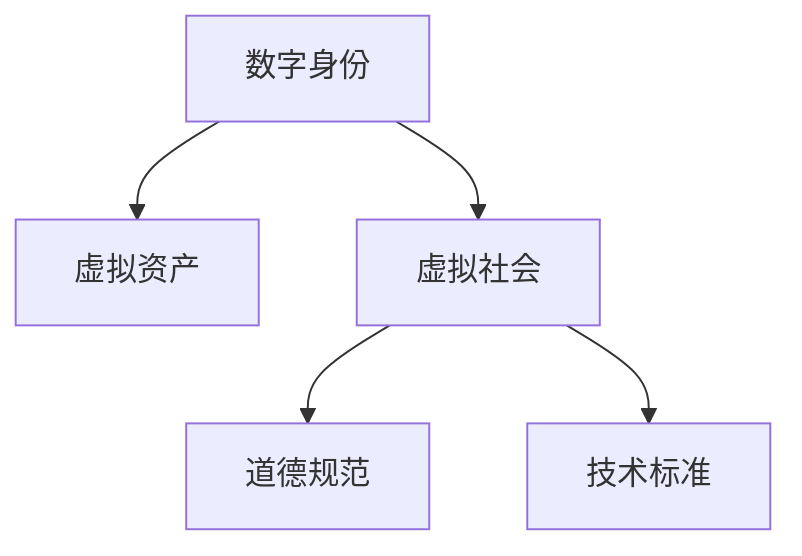

                 

# 元宇宙伦理委员会:虚拟世界行为准则的制定

## 1. 背景介绍

随着虚拟现实（VR）、增强现实（AR）和沉浸式技术的飞速发展，元宇宙（Metaverse）正逐渐从一个科幻概念变为现实。元宇宙是一个由数字资产、社会、经济和政治系统共同组成的虚拟世界，人们可以在其中进行交流、工作、学习和娱乐。尽管元宇宙的潜力巨大，但随之而来的伦理问题也越来越多地受到关注。为保障虚拟世界的秩序和安全，建立一套全面、公平、有效的行为准则成为了当务之急。

### 1.1 问题由来

元宇宙的出现，意味着人类将在数字世界中投入更多时间和精力，进而带来一系列复杂的伦理和社会问题。例如，数字身份的隐私和数据安全、虚拟资产的所有权和价值认知、用户间的互动规范、虚拟世界的道德约束等。这些问题的解决，需要多学科的合作，包括计算机科学、哲学、法学、社会学等多个领域。元宇宙伦理委员会的设立，就是为了集思广益，制定出一套针对虚拟世界的行为准则，以规范元宇宙的发展。

### 1.2 问题核心关键点

元宇宙伦理委员会的工作重点在于：

1. **数字身份和隐私保护**：如何在虚拟世界中保护用户的隐私和数据安全，防止身份盗用和滥用？
2. **虚拟资产管理**：如何界定虚拟资产的所有权和使用权，保障虚拟交易的安全性和公平性？
3. **用户间互动规范**：如何制定虚拟世界的互动规则，防止网络霸凌、诈骗等负面行为？
4. **道德约束**：如何设定虚拟世界的道德标准，防止虚假信息、仇恨言论、不当内容的传播？
5. **跨平台互操作性**：如何在不同平台间实现无缝互动和数据共享，避免平台间的孤岛效应？

这些关键问题需要委员会基于多元视角进行深入探讨，制定出具有普遍适用性和前瞻性的行为准则。

## 2. 核心概念与联系

### 2.1 核心概念概述

为更好地理解元宇宙行为准则的制定过程，本节将介绍几个核心概念及其相互联系：

- **数字身份（Digital Identity）**：用户在虚拟世界中的身份标识，与现实世界的身份可能存在重叠，也可能完全不同。
- **虚拟资产（Virtual Assets）**：包括数字货币、虚拟物品、虚拟土地等，在元宇宙中具有重要的经济价值。
- **虚拟社会（Virtual Society）**：由多个用户互动构成的虚拟社区，需要制定相应的规则和法律。
- **道德规范（Moral Norms）**：在虚拟世界中的行为准则，旨在维护社会的公平、公正和秩序。
- **技术标准（Technical Standards）**：为了确保不同平台间的互操作性和兼容性，需要制定统一的技术标准。

这些概念之间的关系可以通过以下Mermaid流程图来展示：



这个流程图展示了核心概念之间的逻辑关系：

1. 数字身份是用户参与虚拟社会的基础。
2. 虚拟资产在虚拟社会中扮演重要经济角色。
3. 道德规范和法律规定了虚拟社会的行为准则。
4. 技术标准保障了不同平台之间的互操作性。

## 3. 核心算法原理 & 具体操作步骤

### 3.1 算法原理概述

元宇宙行为准则的制定，本质上是一种共识机制的建立过程。它涉及到伦理、法律、技术等多个维度的综合考量。其核心算法原理可总结如下：

1. **多方协商**：邀请来自不同领域的专家和利益相关者参与讨论，通过多次磋商达成共识。
2. **模型构建**：基于已有的研究成果和实践案例，构建行为准则的模型框架。
3. **正式发布**：将制定出的准则转化为具体文件，发布并公开征求意见，确保透明度和公正性。
4. **持续迭代**：随着元宇宙的发展，行为准则需要定期修订，以适应新的情况和挑战。

### 3.2 算法步骤详解

制定元宇宙行为准则的基本步骤如下：

**Step 1: 组建专家团队**
- 招募跨学科的专家和利益相关者，如计算机科学家、哲学家、法学家、社会学家等。
- 明确委员会的工作目标和任务分工。

**Step 2: 数据收集和分析**
- 收集当前元宇宙中的各类数据，包括用户行为数据、交易数据、投诉数据等。
- 对数据进行分类和分析，识别出关键问题和潜在风险。

**Step 3: 制定初步准则**
- 根据数据分析和讨论结果，初步制定出行为准则草案。
- 将草案提交专家团队审核，根据反馈进行修改。

**Step 4: 公开征求意见**
- 将准则草案发布到公众平台，征求各方意见和建议。
- 组织专家讨论，评估公众意见，并根据意见进行修订。

**Step 5: 正式发布和执行**
- 发布最终的行为准则，并制定相应的执行机制。
- 建立监督和投诉机制，确保准则的落实和遵守。

**Step 6: 持续优化**
- 定期评估准则的执行效果，根据新的情况和挑战进行调整。
- 引入自动监测和预警系统，实时监控和反馈。

### 3.3 算法优缺点

元宇宙行为准则的制定具有以下优点：

1. **多方协作**：通过多方参与，确保准则的全面性和公平性。
2. **透明度高**：公开征求意见，增加透明度和信任度。
3. **适应性强**：随着元宇宙的发展，准则可以动态调整，适应新的需求。
4. **法律支持**：与现实世界的法律体系相结合，提供法律保障。

同时，也存在以下缺点：

1. **协调困难**：涉及多个领域和利益相关者，协调难度大。
2. **执行成本高**：需要投入大量资源进行监督和执行。
3. **缺乏一致性**：不同平台和社区可能有不同的执行标准，难以统一。
4. **技术依赖**：需要依赖先进的技术手段，确保准则的落地实施。

## 4. 数学模型和公式 & 详细讲解

### 4.1 数学模型构建

元宇宙行为准则的制定，涉及多个维度和多个变量，其数学模型可以表示为：

$$
P = f(D, C, T, L)
$$

其中，$P$ 表示行为准则，$D$ 表示数据集，$C$ 表示共识过程，$T$ 表示技术标准，$L$ 表示法律体系。

### 4.2 公式推导过程

根据上述模型，我们可以进一步细化各个变量的影响因素，如数据质量、共识算法、技术复杂度、法律法规等。例如，数据质量可以通过以下公式来度量：

$$
Q = \sum_{i=1}^{n} w_i q_i
$$

其中，$Q$ 表示数据质量，$w_i$ 表示权重，$q_i$ 表示具体指标。

### 4.3 案例分析与讲解

以虚拟资产管理为例，行为准则可以包括：

1. **所有权界定**：明确虚拟资产的归属和转让方式。
2. **交易安全**：确保交易的透明性和安全性，防止欺诈和盗窃。
3. **使用限制**：规定虚拟资产的使用范围和限制，防止滥用。

这些准则的制定，需要基于已有的法律法规和技术标准，结合元宇宙的特定场景进行细化。

## 5. 项目实践：代码实例和详细解释说明

### 5.1 开发环境搭建

为了进行元宇宙行为准则的制定，需要搭建一个协作平台，以便专家和公众进行交流和讨论。

1. **服务器部署**：使用云服务搭建服务器，部署协作平台。
2. **数据存储**：选择合适的数据库，存储各类数据和讨论记录。
3. **开发工具**：使用Python等开发语言，配合第三方协作工具（如Github、Slack等）进行协作开发。

### 5.2 源代码详细实现

以下是使用Python实现元宇宙行为准则制定平台的代码示例：

```python
# 创建协作平台类
class CollaborationPlatform:
    def __init__(self, platform_name):
        self.name = platform_name
        self.db = None

    def initialize(self, db_type):
        # 初始化数据库连接
        if db_type == 'MySQL':
            self.db = MySQLConnection()
        elif db_type == 'PostgreSQL':
            self.db = PostgreSQLConnection()

    def post_discussion(self, topic, content, author):
        # 发布讨论内容
        self.db.post_discussion(topic, content, author)

    def retrieve_discussions(self, topic):
        # 获取讨论内容
        return self.db.retrieve_discussions(topic)

# 创建数据处理类
class DataProcessor:
    def __init__(self, data_type):
        self.type = data_type
        self.db = None

    def initialize(self, db_type):
        # 初始化数据库连接
        if db_type == 'MySQL':
            self.db = MySQLConnection()
        elif db_type == 'PostgreSQL':
            self.db = PostgreSQLConnection()

    def process_data(self, data):
        # 处理数据
        return self.db.process_data(data)

# 创建准则制定类
class EthicalStandards:
    def __init__(self, platform):
        self.platform = platform
        self.data = None

    def initialize(self, platform, data_type):
        # 初始化协作平台和数据处理器
        self.platform = platform
        self.data = DataProcessor(data_type)

    def analyze_data(self):
        # 分析数据
        return self.data.process_data()

    def propose_code_of_conduct(self):
        # 提出行为准则
        data_analysis = self.analyze_data()
        return generate_code_of_conduct(data_analysis)
```

### 5.3 代码解读与分析

**CollaborationPlatform类**：
- `__init__`方法：初始化协作平台名称和数据库连接。
- `initialize`方法：根据指定数据库类型，初始化数据库连接。
- `post_discussion`方法：发布讨论内容。
- `retrieve_discussions`方法：获取讨论内容。

**DataProcessor类**：
- `__init__`方法：初始化数据类型和数据库连接。
- `initialize`方法：根据指定数据库类型，初始化数据库连接。
- `process_data`方法：处理数据，生成分析结果。

**EthicalStandards类**：
- `__init__`方法：初始化协作平台、数据处理器和准则生成器。
- `initialize`方法：初始化协作平台和数据处理器。
- `analyze_data`方法：分析数据，生成分析结果。
- `propose_code_of_conduct`方法：根据分析结果，生成行为准则草案。

## 6. 实际应用场景

### 6.1 虚拟身份和隐私保护

在元宇宙中，数字身份和隐私保护至关重要。行为准则应明确规定：

1. **身份认证**：采用多重身份认证机制，防止身份盗用。
2. **数据保护**：严格限制数据使用权限，防止数据滥用。
3. **隐私政策**：制定隐私政策，透明化数据收集和处理流程。

### 6.2 虚拟资产管理

虚拟资产是元宇宙中的重要经济载体，行为准则应确保：

1. **所有权界定**：明确资产归属，防止资产纠纷。
2. **交易安全**：保障交易透明性，防止欺诈和盗窃。
3. **使用限制**：规定资产使用规则，防止滥用。

### 6.3 用户间互动规范

元宇宙中的互动，需要行为准则进行规范，防止负面行为：

1. **礼貌用语**：提倡文明礼貌，避免网络霸凌和辱骂。
2. **言论自由**：在遵守法律法规的前提下，保障言论自由。
3. **举报机制**：建立举报和处理机制，及时应对不当行为。

### 6.4 道德约束和法律体系

道德规范和法律体系是元宇宙行为准则的重要组成部分：

1. **道德标准**：制定道德标准，引导用户行为。
2. **法律法规**：结合现实世界的法律法规，提供法律保障。
3. **争议仲裁**：建立争议仲裁机制，解决用户间的纠纷。

## 7. 工具和资源推荐

### 7.1 学习资源推荐

为了深入理解元宇宙行为准则的制定过程，以下是一些推荐的学习资源：

1. **《元宇宙伦理与法规》**：探讨元宇宙伦理与法律体系的书籍，提供丰富的案例和分析。
2. **《虚拟现实与人工智能》**：介绍虚拟现实和人工智能的结合应用，提供丰富的理论支持。
3. **《元宇宙白皮书》**：多份元宇宙白皮书，提供全面的元宇宙发展路线图和规范指南。
4. **《人工智能与法律》**：结合人工智能技术的法律应用，提供详细的法律规范和案例分析。
5. **《虚拟社会与治理》**：探讨虚拟社会的治理结构和机制，提供多角度的治理方案。

通过这些学习资源，可以深入理解元宇宙行为准则的制定过程，获取相关领域的最新研究成果和实践案例。

### 7.2 开发工具推荐

以下是一些用于元宇宙行为准则制定的开发工具：

1. **GitHub**：开源协作平台，支持代码版本控制和项目管理。
2. **Jupyter Notebook**：交互式开发环境，支持数据分析和模型构建。
3. **Slack**：实时协作工具，支持团队沟通和任务管理。
4. **Google Colab**：基于Google Cloud的在线开发环境，支持GPU和TPU计算资源。
5. **AWS S3**：云存储服务，支持大数据分析和协作。

这些工具可以大大提升协作效率，加速元宇宙行为准则的制定进程。

### 7.3 相关论文推荐

以下是几篇关于元宇宙伦理和行为准则的重要论文：

1. **《虚拟世界中的伦理问题》**：探讨虚拟世界中的伦理困境和解决方案。
2. **《元宇宙行为准则的制定》**：介绍元宇宙行为准则的制定过程和实践案例。
3. **《虚拟身份与隐私保护》**：探讨虚拟身份和隐私保护的相关问题与解决方案。
4. **《虚拟资产管理与法律》**：结合虚拟资产的管理和法律问题，提出相应的规范建议。
5. **《元宇宙道德规范与社会治理》**：探讨元宇宙中的道德规范和治理机制。

这些论文代表了当前元宇宙伦理和行为准则研究的前沿成果，值得深入学习和研究。

## 8. 总结：未来发展趋势与挑战

### 8.1 研究成果总结

本文对元宇宙行为准则的制定过程进行了全面系统的介绍，主要涵盖以下几个方面：

1. **背景介绍**：探讨元宇宙的兴起及其带来的伦理问题。
2. **核心概念**：介绍数字身份、虚拟资产、虚拟社会、道德规范和技术标准等核心概念。
3. **算法原理**：阐述元宇宙行为准则制定的算法原理和操作步骤。
4. **案例分析**：通过虚拟资产管理等具体案例，详细讲解准则的制定过程。
5. **项目实践**：提供代码实例和详细解释说明，展示协作平台和数据处理器的实现。
6. **应用场景**：探讨元宇宙中的隐私保护、资产管理、用户互动和道德约束等问题。
7. **工具推荐**：推荐学习资源、开发工具和相关论文，支持准则的制定和实施。

通过本文的系统梳理，可以看到，元宇宙行为准则的制定是一个涉及多学科、多维度的复杂过程，需要多方协作、反复迭代才能达成共识。未来，随着元宇宙的不断发展，准则的内容和形式也将不断演进。

### 8.2 未来发展趋势

展望未来，元宇宙行为准则的制定将呈现以下几个发展趋势：

1. **标准化**：随着元宇宙的普及，准则将逐步标准化，形成统一的规范体系。
2. **跨平台**：为了促进不同平台之间的互操作性，准则需要兼容各类技术标准。
3. **动态更新**：元宇宙发展迅速，准则需要定期更新，以适应新的情况和挑战。
4. **国际合作**：元宇宙是全球性的，准则的制定需要国际合作，形成全球共识。
5. **用户参与**：准则的制定应更多地吸纳用户的意见和反馈，增强其透明度和公正性。

这些趋势将推动元宇宙行为准则的不断完善，为虚拟世界的和谐发展提供保障。

### 8.3 面临的挑战

尽管元宇宙行为准则的制定具有重要意义，但也面临诸多挑战：

1. **跨学科复杂性**：涉及伦理、法律、技术等多个领域，协调难度大。
2. **技术依赖**：需要依赖先进的技术手段，确保准则的落地实施。
3. **全球差异**：不同国家和地区的法律法规和文化背景差异较大，准则的制定需要考虑这些差异。
4. **执行难度**：准则的制定和执行需要投入大量资源，需建立有效的监督和反馈机制。
5. **用户理解**：准则的制定需要与用户进行充分沟通，确保用户理解和遵守。

这些挑战需要多方共同努力，才能确保元宇宙行为准则的制定和执行效果。

### 8.4 研究展望

未来，元宇宙行为准则的研究方向将包括：

1. **跨学科研究**：结合哲学、法学、社会学等多个学科，全面评估准则的合理性。
2. **技术革新**：推动元宇宙技术的发展，确保准则的实施效果。
3. **伦理导向**：将伦理价值观融入准则的制定过程，确保准则的道德性和公正性。
4. **全球合作**：加强国际合作，形成全球统一的元宇宙规范体系。
5. **持续评估**：建立准则的评估机制，定期评估准则的执行效果和适用性。

这些研究方向将为元宇宙行为准则的制定和实施提供有力的支持。

## 9. 附录：常见问题与解答

**Q1: 如何保证元宇宙行为准则的公正性和透明度？**

A: 为了保证元宇宙行为准则的公正性和透明度，需要做到以下几点：
1. **多方参与**：邀请来自不同领域的专家和利益相关者参与讨论，确保准则的全面性和公平性。
2. **公开征求意见**：将准则草案发布到公众平台，征求各方意见和建议，增加透明度和信任度。
3. **监督机制**：建立监督和反馈机制，实时监控准则的执行情况，确保准则的落实和遵守。

**Q2: 元宇宙行为准则的制定是否需要考虑国际差异？**

A: 元宇宙是全球性的，行为准则的制定需要考虑不同国家和地区的法律法规和文化背景差异。以下是一些建议：
1. **国际合作**：邀请国际专家参与准则的制定，形成全球共识。
2. **适应性调整**：根据不同国家和地区的法律法规，制定具有适应性的准则版本。
3. **跨文化沟通**：在准则制定过程中，注重跨文化沟通和交流，尊重不同文化和价值观。

**Q3: 如何防止元宇宙中的不当行为？**

A: 防止元宇宙中的不当行为，需要从多个方面入手：
1. **用户教育**：通过教育和培训，提高用户对行为准则的理解和遵守。
2. **技术手段**：采用技术手段，如自动识别和屏蔽不当行为，增强准则的执行力度。
3. **社区监管**：建立社区监管机制，对不当行为进行举报和处理，确保准则的落实。
4. **法律支持**：结合现实世界的法律法规，为不当行为提供法律保障。

**Q4: 元宇宙行为准则的执行效果如何评估？**

A: 元宇宙行为准则的执行效果可以通过以下方式进行评估：
1. **用户反馈**：通过用户调查和反馈，了解准则的执行效果和用户满意度。
2. **数据分析**：利用大数据分析工具，评估行为准则的实施效果和用户行为变化。
3. **第三方评估**：引入第三方机构进行独立评估，提供客观的评估报告。
4. **定期修订**：根据评估结果，定期修订准则，确保其适应性和有效性。

**Q5: 如何应对元宇宙中的隐私保护问题？**

A: 元宇宙中的隐私保护问题，需要从多个方面进行应对：
1. **数据加密**：采用数据加密技术，保护用户数据的安全性。
2. **隐私政策**：制定透明的隐私政策，明确数据收集和使用规则。
3. **用户控制**：赋予用户对个人数据的控制权，允许用户自主管理和保护数据。
4. **法律保障**：结合现实世界的法律法规，提供法律保障，防止数据滥用。

以上是元宇宙行为准则制定的一些常见问题及其解答，希望能为相关实践提供有益的参考。

---

作者：禅与计算机程序设计艺术 / Zen and the Art of Computer Programming

