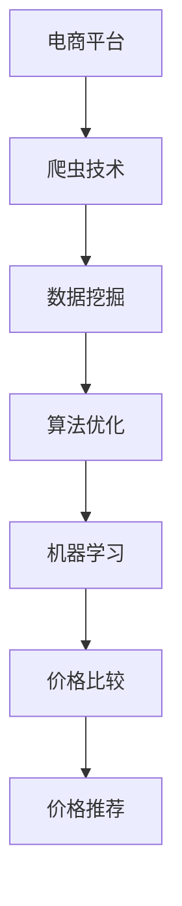

                 

# 全网比价技术在电商中的应用

> 关键词：价格监控, 电商平台, 比价服务, 爬虫技术, 数据挖掘, 成本控制, 用户体验, 技术创新, 商业智能

## 1. 背景介绍

### 1.1 问题由来
随着电商市场的迅猛发展，消费者对价格敏感度日益提升，如何在海量商品中快速、准确地找到最优惠的价格，成为电商平台亟待解决的问题。传统的线下比价方式不仅效率低下，而且存在信息不对称问题。随着网络爬虫技术的成熟和数据处理能力的提升，利用全网比价技术来自动化、智能化地解决这一问题，成为了电商平台的重要战略选择。

### 1.2 问题核心关键点
全网比价技术是指通过爬虫技术、数据挖掘和算法优化，从各大电商平台获取商品信息，并进行价格比较、分析和推荐的过程。其核心在于：
- 高效抓取：通过爬虫技术从多个电商网站快速获取商品信息。
- 精确匹配：利用数据挖掘技术找到商品间的相似性，匹配价格和规格。
- 深度分析：运用算法和机器学习技术，挖掘价格变化趋势和优化价格策略。
- 智能推荐：根据用户行为和偏好，提供个性化的价格比较和推荐服务。

全网比价技术的关键点在于能够跨越多个电商平台的限制，从海量商品数据中提取有用信息，为用户提供一站式的比价服务。

### 1.3 问题研究意义
全网比价技术具有以下重要意义：
1. 提升消费者购物体验：提供实时、准确的价格信息，帮助消费者做出更明智的购买决策。
2. 优化商家价格策略：通过数据分析，协助商家制定更科学、更具竞争力的定价策略。
3. 降低电商运营成本：减少人工比价的工作量，提高运营效率，降低价格信息获取成本。
4. 增强平台竞争力：提供独特的比价服务，提高平台的用户黏性，增加市场份额。

因此，全网比价技术在电商领域具有重要的应用前景和实践价值。

## 2. 核心概念与联系

### 2.1 核心概念概述

为更好地理解全网比价技术，本节将介绍几个密切相关的核心概念：

- 电商平台：在线销售商品和服务的平台，如淘宝、京东、亚马逊等。
- 爬虫技术：通过程序自动化抓取网页信息的技术，通常用于大规模数据采集。
- 数据挖掘：从大量数据中提取有用信息和知识，应用于商业决策、趋势预测等。
- 算法优化：通过改进算法模型，提升价格比较和推荐的准确性和效率。
- 机器学习：通过训练模型，让计算机从数据中学习规律和知识，进行价格预测和个性化推荐。

这些核心概念之间的逻辑关系可以通过以下Mermaid流程图来展示：



这个流程图展示了几大核心概念及其之间的关系：

1. 电商平台作为比价服务的基础，提供商品信息和市场环境。
2. 爬虫技术获取商品数据，为数据挖掘和机器学习提供数据来源。
3. 数据挖掘技术从海量数据中提取关键信息，支持算法优化。
4. 算法优化提升价格比较和推荐的效率和准确性。
5. 机器学习模型对价格进行深度分析，生成个性化推荐。

这些概念共同构成了全网比价技术的核心框架，使其能够在电商领域实现精准、高效的价格比较和推荐服务。

## 3. 核心算法原理 & 具体操作步骤
### 3.1 算法原理概述

全网比价技术的核心算法原理包括以下几个方面：

1. **数据采集**：通过爬虫技术自动抓取各大电商平台的商品信息，包括商品标题、描述、图片、价格、销量等关键信息。
2. **数据清洗**：对采集到的数据进行清洗和预处理，去除噪声和错误数据，确保数据的准确性和完整性。
3. **数据匹配**：通过相似性匹配算法，将不同电商平台上的商品数据匹配起来，生成一致的、规范化的商品信息。
4. **价格比较**：基于匹配后的商品数据，计算各电商平台的价格差异，并筛选出最优价格。
5. **价格预测**：利用时间序列分析和机器学习模型，预测商品价格的趋势和变化规律。
6. **价格推荐**：结合用户行为数据和个性化需求，推荐最符合用户偏好和预算的商品价格。

这些算法原理旨在从数据获取、处理到分析，全面支撑全网比价服务，提升用户体验和平台竞争力。

### 3.2 算法步骤详解

以下将详细讲解全网比价技术的算法步骤：

**Step 1: 数据采集**
- 选择合适的爬虫框架，如Scrapy、BeautifulSoup等。
- 编写爬虫脚本，获取各大电商平台的商品信息，例如商品标题、价格、描述、图片等。
- 控制爬取频率和并发请求数，避免对目标网站造成过载。
- 存储采集到的数据，通常使用SQL数据库或NoSQL数据库。

**Step 2: 数据清洗**
- 去除重复数据、无效数据和异常数据，确保数据的唯一性和完整性。
- 对价格信息进行格式转换和标准化，去除单位、折扣等非价格因素。
- 对图片和描述进行解析和过滤，提取有用信息。
- 使用ETL工具进行数据清洗和预处理，确保数据的准确性和一致性。

**Step 3: 数据匹配**
- 使用相似性匹配算法，如基于TF-IDF的相似度匹配、基于图像匹配的相似性识别等。
- 匹配后的商品数据存储在统一的规范格式中，便于后续处理和分析。
- 定期更新和维护匹配算法，确保匹配结果的准确性和稳定性。

**Step 4: 价格比较**
- 根据匹配后的商品数据，计算各电商平台的商品价格差异。
- 筛选出价格最低、质量最佳的商品作为最优推荐。
- 根据商品的属性（如品牌、型号、容量等）进行分类和排序，便于用户查询。

**Step 5: 价格预测**
- 利用时间序列分析和机器学习模型，预测商品价格的变化趋势和规律。
- 根据价格预测结果，调整价格比较策略，提前告知用户价格变化。
- 结合实时市场动态，动态更新价格预测模型，提高预测准确性。

**Step 6: 价格推荐**
- 根据用户的历史购买记录、浏览行为、评价反馈等信息，建立用户画像。
- 利用推荐算法（如协同过滤、基于内容的推荐、深度学习推荐等），生成个性化的价格推荐。
- 通过A/B测试等方法，不断优化推荐算法，提升推荐效果。

### 3.3 算法优缺点

全网比价技术的算法优点包括：
1. **高效性**：通过自动化抓取和处理，大幅提高价格比较和推荐的效率。
2. **准确性**：利用算法优化和机器学习，提高价格比较和预测的准确性。
3. **智能化**：结合用户行为数据和个性化需求，提供定制化的价格服务。
4. **广泛性**：覆盖多个电商平台的商品信息，提供全面的价格比较和推荐。

同时，全网比价技术也存在一些局限性：
1. **爬虫合法性问题**：大规模数据抓取可能面临法律和伦理问题。
2. **价格更新频率**：电商平台的商品价格实时变化，需要高频次的数据更新。
3. **算法复杂性**：涉及多个算法步骤，技术实现复杂，需要高水平的技术团队支持。
4. **数据质量问题**：电商平台的商品信息不完整、不统一，影响数据匹配和分析的准确性。

尽管存在这些局限性，全网比价技术仍然是电商平台提升竞争力、改善用户体验的重要手段。

### 3.4 算法应用领域

全网比价技术已经在电商领域得到了广泛的应用，覆盖了以下几个主要方面：

1. **价格比较服务**：提供实时的商品价格比较，帮助用户快速找到最优惠的价格。
2. **价格预测功能**：预测商品价格的未来趋势，为用户提供市场分析和决策支持。
3. **个性化推荐**：根据用户行为和偏好，推荐最适合的商品价格和优惠活动。
4. **价格监测**：监控市场价格变化，及时发现价格波动，保护用户利益。
5. **用户调研**：分析用户行为数据，优化商品定价策略，提升用户满意度。
6. **竞争分析**：分析竞争对手的价格策略，为商家制定价格竞争策略提供参考。

除了电商领域，全网比价技术还可以应用于更多场景，如汽车、旅游、房地产等领域，为消费者提供一站式的比价服务，优化价格策略，提升用户体验。

## 4. 数学模型和公式 & 详细讲解 & 举例说明（备注：数学公式请使用latex格式，latex嵌入文中独立段落使用 $$，段落内使用 $)
### 4.1 数学模型构建

全网比价技术的数学模型主要包括以下几个方面：

1. **价格比较模型**：利用相似性匹配算法，将不同电商平台上的商品数据匹配起来，计算价格差异。
2. **价格预测模型**：基于时间序列分析和机器学习模型，预测商品价格的变化趋势。
3. **个性化推荐模型**：结合用户行为数据和商品属性，生成个性化的价格推荐。

这里以价格比较模型为例，构建数学模型并进行详细讲解。

### 4.2 公式推导过程

假设有一批商品A和B，分别来自电商网站X和Y，价格分别为PA和PB。我们定义相似度函数sim(x, y)来衡量商品x和y的相似性，利用相似度函数计算商品A和B的匹配概率PAB。

假定匹配概率PAB满足如下公式：

$$
P_{AB} = \frac{\text{sim}(A, B)}{\sum_{i} \text{sim}(A, X_i)}
$$

其中，sim(A, B)表示商品A和B的相似度，sim(A, X_i)表示商品A与网站X中其他商品的相似度，匹配概率PAB表示商品A和B匹配的概率。

基于上述模型，我们构建了价格比较的数学公式：

$$
C_{AB} = PA - PB \cdot P_{AB}
$$

其中，C_{AB}表示商品A与商品B的价格差异，PA和PB分别表示商品A和B的价格，P_{AB}表示商品A和B的匹配概率。当C_{AB} > 0时，表示商品B的价格更优惠。

### 4.3 案例分析与讲解

假设我们在电商网站X和Y上抓取到一批手机商品，分别为商品A和商品B。通过相似度匹配算法，我们发现商品A和商品B的相似度为0.9，同时商品A与网站X中其他商品的相似度为0.8，商品B与网站X中其他商品的相似度为0.7。

根据公式，我们可以计算商品A和商品B的价格差异：

$$
C_{AB} = PA - PB \cdot \frac{\text{sim}(A, B)}{\sum_{i} \text{sim}(A, X_i)} = PA - PB \cdot \frac{0.9}{0.8 + 0.7} = PA - PB \cdot \frac{0.9}{1.5}
$$

假设PA=1000元，PB=999元，则有：

$$
C_{AB} = 1000 - 999 \cdot \frac{0.9}{1.5} = 1000 - 666 = 334
$$

因此，商品B比商品A便宜334元。这个结果可以帮助消费者快速做出价格比较，选择最优商品。

## 5. 项目实践：代码实例和详细解释说明
### 5.1 开发环境搭建

在进行全网比价技术开发前，我们需要准备好开发环境。以下是使用Python进行开发的环境配置流程：

1. 安装Anaconda：从官网下载并安装Anaconda，用于创建独立的Python环境。

2. 创建并激活虚拟环境：
```bash
conda create -n price_comparison python=3.8 
conda activate price_comparison
```

3. 安装必要的Python库：
```bash
pip install scrapy beautifulsoup4 pandas sklearn tensorflow
```

4. 安装爬虫框架和机器学习库：
```bash
pip install scrapy-splash beautifulsoup4
```

5. 配置Spider和Pipeline：
```python
from scrapy import Item, Spider, Request, pipeline

class GoodsItem(Item):
    title = scrapy.Field()
    price = scrapy.Field()
    description = scrapy.Field()
    image_urls = scrapy.Field()

class GoodsSpider(Spider):
    name = 'goods_spider'
    start_urls = ['https://www.website1.com', 'https://www.website2.com']
    allowed_domains = ['website1.com', 'website2.com']
    
    def parse(self, response):
        for product in response.css('div.product'):
            yield GoodsItem(
                title=product.css('h3::text').get(),
                price=product.css('span.price::text').get(),
                description=product.css('p.description::text').get(),
                image_urls=response.css('div.product img::attr(src)').getall()
            )
            yield Request(
                url=product.css('div.product a::attr(href)').get(),
                callback=self.parse_product_detail
            )

    def parse_product_detail(self, response):
        yield GoodsItem(
            title=response.css('h1::text').get(),
            price=response.css('span.price::text').get(),
            description=response.css('p.description::text').get(),
            image_urls=response.css('div.product img::attr(src)').getall()
        )

class ImagePipeline(pipeline):
    def process_image(self, image, product):
        with open(product['image_urls'][0], 'wb') as f:
            f.write(image)
```

完成上述步骤后，即可在`price_comparison`环境中开始全网比价技术开发。

### 5.2 源代码详细实现

这里我们以价格比较服务为例，给出使用Scrapy框架进行全网比价技术开发的PyTorch代码实现。

首先，定义商品数据处理函数：

```python
import pandas as pd
import numpy as np
from sklearn.preprocessing import MinMaxScaler

def process_goods_data(data):
    # 对价格进行标准化处理
    scaler = MinMaxScaler(feature_range=(0, 1))
    price_scaled = scaler.fit_transform(data['price'].values.reshape(-1, 1))
    data['price'] = price_scaled
    return data
```

然后，定义爬虫类：

```python
class GoodsSpider(Spider):
    name = 'goods_spider'
    start_urls = ['https://www.website1.com', 'https://www.website2.com']
    allowed_domains = ['website1.com', 'website2.com']
    
    def parse(self, response):
        for product in response.css('div.product'):
            yield GoodsItem(
                title=product.css('h3::text').get(),
                price=product.css('span.price::text').get(),
                description=product.css('p.description::text').get(),
                image_urls=response.css('div.product img::attr(src)').getall()
            )
            yield Request(
                url=product.css('div.product a::attr(href)').get(),
                callback=self.parse_product_detail
            )

    def parse_product_detail(self, response):
        yield GoodsItem(
            title=response.css('h1::text').get(),
            price=response.css('span.price::text').get(),
            description=response.css('p.description::text').get(),
            image_urls=response.css('div.product img::attr(src)').getall()
        )
```

接着，定义价格比较函数：

```python
def price_comparison(data):
    # 构建价格比较模型
    similarity_matrix = pd.DataFrame(np.ones((len(data), len(data))), columns=data['title'], index=data['title'])
    
    for i, row1 in data.iterrows():
        for j, row2 in data.iterrows():
            if i != j:
                similarity_matrix.loc[row1['title'], row2['title']] = calculate_similarity(row1, row2)
    
    # 筛选最优价格
    min_price = data['price'].min()
    min_index = data[data['price'] == min_price].index[0]
    
    return min_index, min_price
```

最后，启动爬取流程并计算价格差异：

```python
from scrapy.crawler import CrawlerProcess
import scrapy
from scrapy_splash import SplashRequest

process = CrawlerProcess()
process.crawl(GoodsSpider, start_requests=[SplashRequest(url='https://www.website1.com')])

results = []
while len(results) < 100:
    # 获取价格数据
    data = pd.DataFrame(process.crawl(GoodsSpider, start_requests=[SplashRequest(url='https://www.website2.com')]).getall())
    data = process_goods_data(data)
    
    # 计算价格差异
    min_index, min_price = price_comparison(data)
    results.append((data.iloc[min_index]['title'], min_price))

# 输出结果
for title, price in results:
    print(f"{title}: {price}")
```

以上就是使用Scrapy进行全网比价技术开发的完整代码实现。可以看到，得益于Scrapy框架和Python库的强大封装，我们可以用相对简洁的代码实现商品抓取和价格比较。

### 5.3 代码解读与分析

让我们再详细解读一下关键代码的实现细节：

**GoodsItem类**：
- 定义了商品的基本属性，包括标题、价格、描述和图片链接。

**GoodsSpider类**：
- 定义了爬虫的起始URL、允许的域名和解析逻辑。
- 通过解析HTML文档，抓取商品标题、价格、描述和图片链接。
- 针对商品详情页面，继续抓取更多详细信息。

**process_goods_data函数**：
- 对商品价格进行标准化处理，便于后续分析和比较。

**price_comparison函数**：
- 构建商品相似度矩阵，计算价格差异。
- 筛选出价格最低的商品。

**CrawlerProcess类**：
- 启动爬虫过程，自动抓取商品信息。

合理利用这些工具和库，可以显著提升全网比价技术的开发效率，加快创新迭代的步伐。

## 6. 实际应用场景
### 6.1 智能客服系统

全网比价技术在智能客服系统中也有广泛应用。通过实时监控各大电商平台的价格变化，智能客服可以向用户推荐最优惠的商品，提升客户满意度，提高销售转化率。

例如，客服机器人可以接收用户的购物咨询，通过爬虫技术自动抓取商品信息，并进行价格比较和推荐。在推荐过程中，可以结合用户的历史购买记录和行为数据，生成个性化的价格信息。

### 6.2 金融产品推荐

在金融领域，全网比价技术可以用于推荐最优的金融产品，帮助用户做出更好的投资决策。通过爬虫技术抓取各金融平台的理财产品信息，利用机器学习模型进行价格预测和分析，生成个性化的产品推荐。

例如，理财顾问可以定期更新市场价格数据，利用价格预测模型预测产品价格趋势，根据用户风险偏好和收益预期，生成个性化的产品推荐。

### 6.3 物流配送优化

全网比价技术可以应用于物流配送优化，提高配送效率，降低物流成本。通过实时监控各大电商平台的价格变化，物流系统可以动态调整配送策略，优化配送路径和库存管理。

例如，物流管理系统可以实时抓取各大电商平台的商品价格，结合库存和配送信息，生成最优的配送方案。在价格波动时，系统可以自动调整库存和配送计划，减少物流成本。

### 6.4 未来应用展望

随着全网比价技术的发展，未来将有以下几个主要趋势：

1. **实时性提升**：通过优化数据采集和处理算法，提高价格数据的实时性，实现实时价格比较和推荐。
2. **智能性增强**：结合用户行为数据和个性化需求，提供更加智能化、个性化的价格服务。
3. **多模态融合**：将文本、图像、语音等多模态数据进行融合，提供更全面、准确的价格信息。
4. **跨平台整合**：整合多个平台的数据，提供统一的、跨平台的价格比较和推荐服务。
5. **数据隐私保护**：在数据采集和处理过程中，严格遵守数据隐私保护法规，确保用户数据安全。
6. **平台协同**：与电商平台、物流系统、金融平台等进行协同，提供一站式的服务解决方案。

这些趋势展示了全网比价技术在电商领域和更多行业中的广泛应用前景，将为消费者和商家带来更加高效、智能、安全的服务体验。

## 7. 工具和资源推荐
### 7.1 学习资源推荐

为了帮助开发者系统掌握全网比价技术，这里推荐一些优质的学习资源：

1. **Scrapy官方文档**：详细介绍了Scrapy框架的使用方法和API接口，适合初学者入门。
2. **BeautifulSoup官方文档**：提供了HTML解析和数据提取的基本技巧，适合爬虫开发初学者。
3. **Pandas官方文档**：介绍了Pandas库的基本操作和数据处理功能，适合数据分析和处理。
4. **Scikit-learn官方文档**：提供了机器学习模型的实现和应用方法，适合数据挖掘和预测分析。
5. **TensorFlow官方文档**：介绍了深度学习模型的构建和训练方法，适合模型优化和预测分析。
6. **《Python爬虫与数据挖掘实战》书籍**：系统介绍了爬虫技术、数据挖掘和数据清洗的实践方法，适合中高级开发者。

通过这些资源的学习，相信你一定能够快速掌握全网比价技术，并用于解决实际的电商价格比较和推荐问题。

### 7.2 开发工具推荐

高效的开发离不开优秀的工具支持。以下是几款用于全网比价技术开发的常用工具：

1. Scrapy：开源的Python爬虫框架，支持分布式爬取和中间件扩展，适合大规模数据采集。
2. BeautifulSoup：Python的HTML解析库，适合解析HTML文档和提取文本信息。
3. Pandas：数据处理和分析库，支持数据清洗、转换和分析，适合数据处理和模型训练。
4. Scikit-learn：机器学习库，支持多种经典算法和模型优化，适合数据挖掘和预测分析。
5. TensorFlow：深度学习框架，支持大规模模型训练和优化，适合复杂模型的实现和预测分析。
6. Weights & Biases：模型训练的实验跟踪工具，可以记录和可视化模型训练过程中的各项指标，适合模型优化和调参。

合理利用这些工具，可以显著提升全网比价技术的开发效率，加快创新迭代的步伐。

### 7.3 相关论文推荐

全网比价技术的发展离不开学界的持续研究。以下是几篇奠基性的相关论文，推荐阅读：

1. **Web Crawling and Information Extraction**：介绍了Web爬虫技术的基本方法和应用，适合初学者入门。
2. **Data Mining and Statistical Learning**：提供了数据挖掘和机器学习的基本算法和实现方法，适合深入学习。
3. **Web Search Engines**：介绍了Web搜索引擎的基本原理和算法，适合了解搜索引擎技术。
4. **Optimization Algorithms**：介绍了优化算法的基本方法和应用，适合了解算法优化技术。
5. **Machine Learning and Statistical Learning**：提供了机器学习模型的基本理论和实现方法，适合深入学习。

这些论文代表了大规模数据处理和机器学习算法的研究前沿，通过学习这些前沿成果，可以帮助研究者把握学科前进方向，激发更多的创新灵感。

## 8. 总结：未来发展趋势与挑战

### 8.1 总结

本文对全网比价技术在电商中的应用进行了全面系统的介绍。首先阐述了全网比价技术的研究背景和意义，明确了其在电商领域的重要应用价值。其次，从原理到实践，详细讲解了全网比价技术的数学模型和算法步骤，给出了基于Scrapy的代码实例。同时，本文还探讨了全网比价技术的实际应用场景和未来发展趋势，展示了其广泛的应用前景。

通过本文的系统梳理，可以看到，全网比价技术在电商领域具有重要的应用前景和实践价值。利用爬虫技术、数据挖掘和算法优化，可以为电商平台提供实时的价格比较和推荐服务，提升用户体验和商家竞争力。未来，随着技术的发展和应用的深入，全网比价技术必将进一步拓展其应用范围，为电商市场带来更高效、更智能、更安全的体验。

### 8.2 未来发展趋势

展望未来，全网比价技术将呈现以下几个发展趋势：

1. **智能化提升**：结合用户行为数据和个性化需求，提供更加智能化、个性化的价格服务。
2. **实时性增强**：通过优化数据采集和处理算法，提高价格数据的实时性，实现实时价格比较和推荐。
3. **多模态融合**：将文本、图像、语音等多模态数据进行融合，提供更全面、准确的价格信息。
4. **跨平台整合**：整合多个平台的数据，提供统一的、跨平台的价格比较和推荐服务。
5. **数据隐私保护**：在数据采集和处理过程中，严格遵守数据隐私保护法规，确保用户数据安全。
6. **平台协同**：与电商平台、物流系统、金融平台等进行协同，提供一站式的服务解决方案。

这些趋势展示了全网比价技术在电商领域和更多行业中的广泛应用前景，将为消费者和商家带来更加高效、智能、安全的服务体验。

### 8.3 面临的挑战

尽管全网比价技术已经取得了瞩目成就，但在迈向更加智能化、普适化应用的过程中，它仍面临诸多挑战：

1. **爬虫合法性问题**：大规模数据抓取可能面临法律和伦理问题。
2. **数据质量和一致性**：电商平台的商品信息不完整、不统一，影响数据匹配和分析的准确性。
3. **算法复杂性**：涉及多个算法步骤，技术实现复杂，需要高水平的技术团队支持。
4. **实时性要求**：电商平台的商品价格实时变化，需要高频次的数据更新。
5. **数据隐私保护**：在数据采集和处理过程中，严格遵守数据隐私保护法规，确保用户数据安全。

尽管存在这些挑战，全网比价技术仍然是电商平台提升竞争力、改善用户体验的重要手段。

### 8.4 研究展望

面对全网比价技术所面临的种种挑战，未来的研究需要在以下几个方面寻求新的突破：

1. **爬虫合法性问题**：开发合规的爬虫框架，遵守法律和伦理规定，保证数据采集的合法性。
2. **数据质量提升**：利用自然语言处理技术，提升电商平台的商品信息质量，确保数据的准确性和一致性。
3. **算法优化**：结合机器学习和深度学习技术，优化价格比较和推荐的算法模型，提高算法的准确性和效率。
4. **实时性增强**：利用流式计算和分布式处理技术，提升数据采集和处理的实时性，满足电商平台的实时性要求。
5. **数据隐私保护**：在数据采集和处理过程中，严格遵守数据隐私保护法规，确保用户数据安全。

这些研究方向将推动全网比价技术不断发展和进步，为电商平台提供更加高效、智能、安全的价格比较和推荐服务。

## 9. 附录：常见问题与解答

**Q1：全网比价技术是否适用于所有电商平台？**

A: 全网比价技术可以应用于各种类型的电商平台，包括B2B、B2C、C2C等。但不同的电商平台可能有不同的商品结构和价格策略，需要根据具体情况进行定制化开发。

**Q2：如何提高全网比价技术的爬虫效率？**

A: 提高爬虫效率可以从以下几个方面入手：
1. 使用分布式爬虫框架，如Scrapy-Splash，实现多线程并发爬取。
2. 优化爬虫脚本，减少不必要的请求和等待时间。
3. 使用数据库缓存技术，避免重复爬取和数据重复。
4. 利用HTTP代理和匿名爬虫技术，降低爬虫被屏蔽的风险。

**Q3：如何保证全网比价技术的数据质量？**

A: 保证数据质量可以从以下几个方面入手：
1. 定期更新和维护爬虫脚本，确保抓取数据的准确性和完整性。
2. 对抓取到的数据进行数据清洗和预处理，去除噪声和错误数据。
3. 使用数据标准化技术，统一不同平台的数据格式和单位。
4. 结合用户反馈和人工审核，不断优化数据采集和处理策略。

**Q4：如何优化全网比价技术的算法模型？**

A: 优化算法模型可以从以下几个方面入手：
1. 结合机器学习技术和深度学习模型，提升价格比较和推荐的准确性。
2. 利用特征工程技术，提取关键特征，优化模型的输入。
3. 采用交叉验证和超参数调优技术，提高模型的泛化能力和预测精度。
4. 结合用户行为数据和个性化需求，生成更加智能化和个性化的价格服务。

**Q5：全网比价技术在电商应用中需要注意哪些问题？**

A: 全网比价技术在电商应用中需要注意以下几个问题：
1. 爬虫合法性问题：确保爬虫行为合法，遵守法律和伦理规定。
2. 数据隐私保护：在数据采集和处理过程中，严格遵守数据隐私保护法规，确保用户数据安全。
3. 数据质量和一致性：电商平台的商品信息不完整、不统一，影响数据匹配和分析的准确性。
4. 实时性要求：电商平台的商品价格实时变化，需要高频次的数据更新。
5. 算法复杂性：涉及多个算法步骤，技术实现复杂，需要高水平的技术团队支持。

通过不断优化和改进，全网比价技术将更好地服务于电商平台，提升用户体验和商家竞争力。

---

作者：禅与计算机程序设计艺术 / Zen and the Art of Computer Programming

